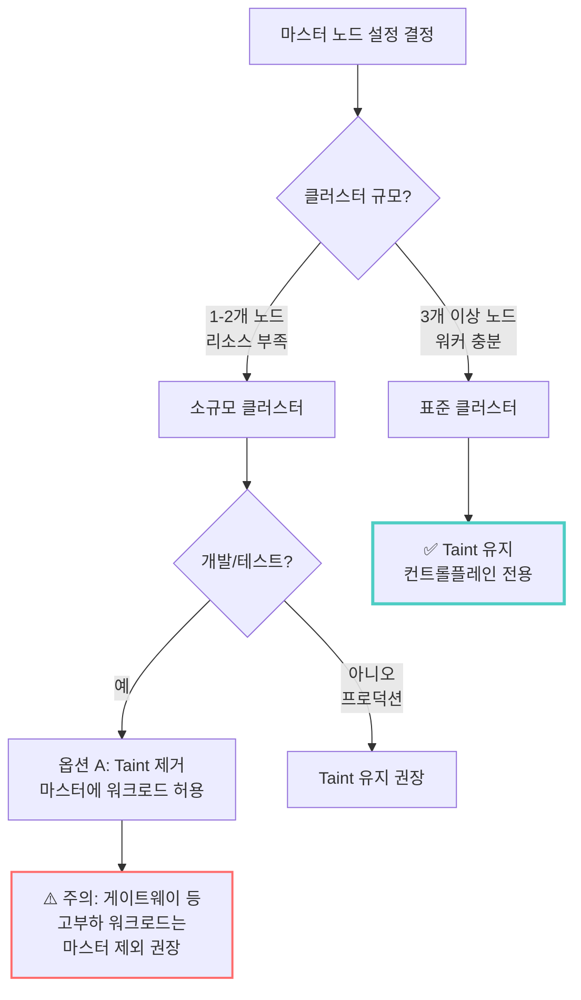
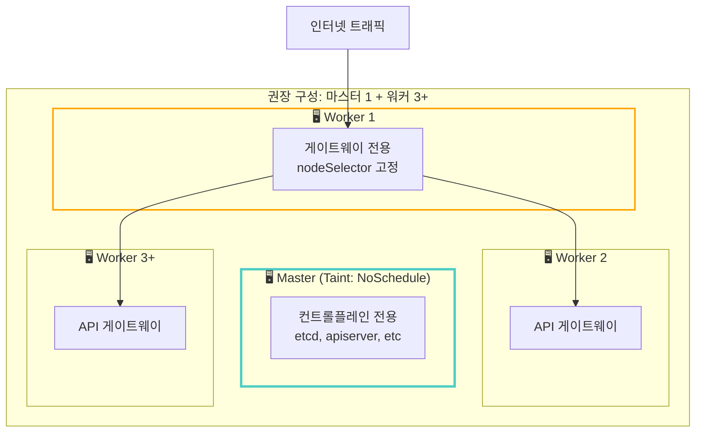

# 3단계: Kubernetes + Cilium 클러스터 구축

> **시리즈**: [Oracle Cloud + Tailscale + Kubernetes 완벽 가이드](README.md)
> ← **이전**: [2단계: Tailscale 메시 네트워크 구성](02-setup-tailscale-network.md) | **다음**: [4단계: 네트워킹 심화 이해](04-deep-dive-networking.md) →

---

> Tailscale 메시 네트워크 위에 Kubernetes 클러스터와 Cilium CNI 설치

## 📋 이 단계에서 할 일

1. Container Runtime (containerd) 설치
2. Kubernetes 패키지 설치
3. 마스터 노드 초기화
4. Cilium CNI 설치 (VXLAN 모드)
5. 워커 노드 추가
6. 클러스터 검증

## 🐳 Phase 1: Container Runtime 설치

**모든 노드에서 실행**

### 1. Containerd 설치

```bash
# Docker 저장소 추가 (containerd 포함)
sudo dnf config-manager --add-repo https://download.docker.com/linux/centos/docker-ce.repo

# Containerd 설치
sudo dnf install -y containerd.io

# 설정 파일 생성
sudo mkdir -p /etc/containerd
sudo containerd config default | sudo tee /etc/containerd/config.toml

# SystemdCgroup 활성화 (중요!)
sudo sed -i 's/SystemdCgroup = false/SystemdCgroup = true/g' /etc/containerd/config.toml

# 서비스 시작
sudo systemctl restart containerd
sudo systemctl enable containerd

# 확인
sudo systemctl status containerd
```

### 2. crictl 설치 (디버깅 도구)

```bash
# crictl 다운로드
VERSION="v1.34.0"
wget https://github.com/kubernetes-sigs/cri-tools/releases/download/$VERSION/crictl-$VERSION-linux-arm64.tar.gz
sudo tar zxvf crictl-$VERSION-linux-arm64.tar.gz -C /usr/local/bin
rm -f crictl-$VERSION-linux-arm64.tar.gz

# crictl 설정
cat <<EOF | sudo tee /etc/crictl.yaml
runtime-endpoint: unix:///run/containerd/containerd.sock
image-endpoint: unix:///run/containerd/containerd.sock
timeout: 2
EOF

# 확인
sudo crictl version
```

## ☸️ Phase 2: Kubernetes 설치

**모든 노드에서 실행**

### 1. Kubernetes 저장소 추가

```bash
# Kubernetes 공식 저장소
cat <<EOF | sudo tee /etc/yum.repos.d/kubernetes.repo
[kubernetes]
name=Kubernetes
baseurl=https://pkgs.k8s.io/core:/stable:/v1.34/rpm/
enabled=1
gpgcheck=1
gpgkey=https://pkgs.k8s.io/core:/stable:/v1.34/rpm/repodata/repomd.xml.key
exclude=kubelet kubeadm kubectl
arch=aarch64
EOF
```

### 2. Kubernetes 패키지 설치

```bash
# 버전 고정 설치 (1.34.1)
sudo dnf install -y \
  kubelet-1.34.1 \
  kubeadm-1.34.1 \
  kubectl-1.34.1 \
  --disableexcludes=kubernetes

# kubelet 서비스 활성화
sudo systemctl enable --now kubelet
```

## 🎮 Phase 3: 마스터 노드 초기화

**마스터 노드에서만 실행**

### 1. kubelet node-ip 설정

```bash
# Tailscale IP 확인
TAILSCALE_IP=$(tailscale ip -4)
echo "Control Plane Tailscale IP: $TAILSCALE_IP"

# kubelet이 Tailscale IP 사용하도록 설정
echo "KUBELET_EXTRA_ARGS=--node-ip=$TAILSCALE_IP" | sudo tee /etc/sysconfig/kubelet
```

### 2. kubeadm 초기화

```bash
# 클러스터 초기화 (kube-proxy 없이)
sudo kubeadm init \
  --apiserver-advertise-address=$TAILSCALE_IP \
  --apiserver-cert-extra-sans=$TAILSCALE_IP \
  --pod-network-cidr=10.244.0.0/16 \
  --service-cidr=10.96.0.0/12 \
  --skip-phases=addon/kube-proxy

# 출력되는 join 명령어를 안전한 곳에 저장!
# kubeadm join 100.64.0.1:6443 --token ... --discovery-token-ca-cert-hash ...
```

### 3. kubectl 설정

```bash
# kubeconfig 설정
mkdir -p $HOME/.kube
sudo cp -i /etc/kubernetes/admin.conf $HOME/.kube/config
sudo chown $(id -u):$(id -g) $HOME/.kube/config

# 자동완성 설정
echo 'source <(kubectl completion bash)' >> ~/.bashrc
echo 'alias k=kubectl' >> ~/.bashrc
echo 'complete -o default -F __start_kubectl k' >> ~/.bashrc
source ~/.bashrc

# 노드 확인 (NotReady 상태가 정상 - CNI 설치 전)
kubectl get nodes
```

### 4. Control Plane Taint 제거 (선택)

단일 노드 또는 테스트 환경에서 마스터에도 Pod 스케줄링:

```bash
kubectl taint nodes --all node-role.kubernetes.io/control-plane-
```

## 🌐 Phase 4: Cilium CNI 설치

**마스터 노드에서 실행**

### 1. Helm 설치

```bash
# Helm 설치 스크립트
curl -fsSL -o get_helm.sh https://raw.githubusercontent.com/helm/helm/main/scripts/get-helm-3
chmod 700 get_helm.sh
./get_helm.sh

# 확인
helm version
```

### 2. Cilium 설치 준비

```bash
# Cilium Helm 차트 추가
helm repo add cilium https://helm.cilium.io/
helm repo update

# Tailscale IP 확인
TAILSCALE_IP=$(tailscale ip -4)
echo "API Server IP: $TAILSCALE_IP"
```

### 3. VXLAN vs Native Routing 선택

#### 왜 VXLAN 터널링을 사용하나요?

**Tailscale 환경의 제약:**
```bash
# Tailscale은 노드 간 터널만 제공
# Pod 네트워크 라우팅은 자동으로 설정되지 않음!

# ❌ Native Routing 시도 시:
sudo ip route add 10.244.1.0/24 via 100.64.0.2  # Worker 1
sudo ip route add 10.244.2.0/24 via 100.64.0.3  # Worker 2
# → 노드 추가 시마다 모든 노드에서 수동 설정 필요!
```

**운영 복잡도 비교:**

| 항목 | Native Routing | VXLAN Tunneling |
|------|---------------|-----------------|
| **라우팅 관리** | 수동 (ip route) | 자동 (Cilium) |
| **노드 추가** | 모든 노드 업데이트 | 자동 감지 |
| **성능** | ~5% 빠름 | VXLAN 오버헤드 |
| **운영 난이도** | 높음 | 낮음 |
| **추천** | 고성능 필수 시 | **일반적인 경우** ✅ |

**결론:** 실무에서는 VXLAN의 운영 편의성이 미세한 성능 차이보다 훨씬 중요합니다.

### 4. Cilium 설치 실행

Tailscale 메시 네트워크에 최적화된 설정:

```bash
helm install cilium cilium/cilium \
  --version 1.18.2 \
  --namespace kube-system \
  --set operator.replicas=1 \
  --set operator.resources.limits.cpu="200m" \
  --set operator.resources.limits.memory="256Mi" \
  --set ipam.mode=kubernetes \
  --set routingMode=tunnel \
  --set tunnelProtocol=vxlan \
  --set kubeProxyReplacement=true \
  --set k8sServiceHost=$TAILSCALE_IP \
  --set k8sServicePort=6443 \
  --set autoDirectNodeRoutes=false \
  --set bpf.masquerade=true \
  --set loadBalancer.mode=snat \
  --set bpf.lbExternalClusterIP=true \
  --set enableIPv4Masquerade=true \
  --set hostPort.enabled=true \
  --set nodePort.enabled=true \
  --set mtu=1200 \
  --set ipv4.enabled=true \
  --set ipv6.enabled=false \
  --set image.pullPolicy=IfNotPresent \
  --set hubble.relay.enabled=false \
  --set hubble.ui.enabled=false \
  --set prometheus.enabled=false
```

#### 주요 설정 설명

| 옵션 | 값 | 이유 |
|------|-----|------|
| `routingMode=tunnel` | VXLAN 터널 | Tailscale과 호환 |
| `kubeProxyReplacement=true` | eBPF 사용 | kube-proxy 대체 |
| `mtu=1200` | 1200 bytes | Tailscale(1280) - VXLAN 헤더(50) |
| `loadBalancer.mode=snat` | SNAT | 리턴 패킷 라우팅 |

### 5. Cilium CLI 설치 및 확인

```bash
# Cilium CLI 설치
CILIUM_CLI_VERSION=$(curl -s https://raw.githubusercontent.com/cilium/cilium-cli/main/stable.txt)
CLI_ARCH=arm64
curl -L --fail --remote-name-all \
  https://github.com/cilium/cilium-cli/releases/download/${CILIUM_CLI_VERSION}/cilium-linux-${CLI_ARCH}.tar.gz
sudo tar xzvfC cilium-linux-${CLI_ARCH}.tar.gz /usr/local/bin
rm cilium-linux-${CLI_ARCH}.tar.gz

# 상태 확인
cilium status --wait

# 노드 Ready 확인
kubectl get nodes
```

### 6. Cilium 동작 확인

```bash
# Cilium Pod 상태
kubectl -n kube-system get pods -l k8s-app=cilium

# Cilium 노드 목록 (Tailscale IP 확인)
kubectl -n kube-system exec ds/cilium -- cilium node list

# Masquerade 인터페이스 확인
kubectl -n kube-system exec ds/cilium -- cilium status --verbose | grep Masq
# 예상: Masquerading: BPF [enp0s6, tailscale0]

# CoreDNS 정상 동작 확인
kubectl get pods -n kube-system -l k8s-app=kube-dns
```

## 👥 Phase 5: 워커 노드 추가

### 1. Join Token 생성 (마스터에서)

```bash
# 새로운 join 명령 생성
kubeadm token create --print-join-command

# 출력 예시:
# kubeadm join 100.64.0.1:6443 --token xxxxx --discovery-token-ca-cert-hash sha256:xxxxx
```

### 2. 워커 노드 Join (워커에서)

```bash
# Tailscale IP 설정
TAILSCALE_IP=$(tailscale ip -4)
echo "Worker Tailscale IP: $TAILSCALE_IP"

# kubelet node-ip 설정
echo "KUBELET_EXTRA_ARGS=--node-ip=$TAILSCALE_IP" | sudo tee /etc/sysconfig/kubelet

# Join 실행 (마스터에서 받은 명령 사용)
sudo kubeadm join 100.64.0.1:6443 \
  --token <TOKEN> \
  --discovery-token-ca-cert-hash sha256:<HASH>
```

### 3. 노드 확인 (마스터에서)

```bash
# 노드 상태 확인
kubectl get nodes -o wide

# 노드 레이블 추가
kubectl label node <worker-name> node-role.kubernetes.io/worker=true
```

## ✅ Phase 6: 클러스터 검증

### 1. 기본 통신 테스트

```bash
# 테스트 Pod 생성
kubectl run test-pod --image=nginx:alpine --restart=Never

# Pod 상태 확인
kubectl get pods -o wide

# Pod 로그 확인
kubectl logs test-pod

# Pod 삭제
kubectl delete pod test-pod
```

### 2. 크로스 노드 통신 테스트

```bash
# 각 노드에 Pod 배포 (nicolaka/netshoot: 네트워크 디버깅 도구 포함)
kubectl run test-master --image=nicolaka/netshoot --restart=Never \
  --overrides='{"spec":{"nodeSelector":{"node-role.kubernetes.io/control-plane":""}}}' \
  -- sleep 3600

kubectl run test-worker --image=nicolaka/netshoot --restart=Never \
  --overrides='{"spec":{"nodeSelector":{"node-role.kubernetes.io/worker":"true"}}}' \
  -- sleep 3600

# Pod IP 확인
kubectl get pods -o wide

# 크로스 노드 ping 테스트
kubectl exec test-master -- ping -c 3 <worker-pod-ip>
kubectl exec test-worker -- ping -c 3 <master-pod-ip>

# DNS 테스트 (추가)
kubectl exec test-master -- nslookup kubernetes.default
kubectl exec test-worker -- nslookup kubernetes.default

# 테스트 정리
kubectl delete pod test-master test-worker
```

**왜 nicolaka/netshoot을 사용하나요?**
- ✅ ping, curl, wget, dig, nslookup, traceroute, tcpdump 등 포함
- ✅ busybox보다 네트워크 디버깅에 최적화
- ✅ 실제 운영 환경 트러블슈팅에도 유용

### 3. Service 통신 테스트

```bash
# Deployment 생성
kubectl create deployment nginx --image=nginx:alpine --replicas=2

# Service 노출
kubectl expose deployment nginx --port=80 --type=ClusterIP

# Service 확인
kubectl get svc nginx

# 테스트 Pod에서 Service 접근 (curl 사용)
kubectl run test --rm -it --image=nicolaka/netshoot --restart=Never -- curl -s nginx

# 또는 간단한 HTTP 테스트
kubectl run test --rm -it --image=curlimages/curl --restart=Never -- curl -s nginx

# 정리
kubectl delete deployment nginx
kubectl delete svc nginx
```

### 4. Cilium Health 확인

```bash
# Cilium 연결성 테스트 (시간이 걸림)
cilium connectivity test

# Health 상태
kubectl -n kube-system exec ds/cilium -- cilium-health status
```

---

## 🔧 Phase 7: 마스터 노드 워크로드 스케줄링 설정 (옵셔널)

> **기본 동작**: kubeadm은 마스터 노드에 `node-role.kubernetes.io/control-plane:NoSchedule` taint를 자동으로 추가하여 일반 워크로드가 스케줄되지 않도록 합니다.

### 언제 이 설정을 변경하나요?



---

### 옵션 A: Taint 제거 (마스터에 워크로드 허용)

**사용 사례**: 워커 노드가 1-2개뿐인 소규모 개발/테스트 환경

```bash
# 현재 taint 확인
kubectl describe node <master-node-name> | grep Taints

# Taint 제거 (마스터에 Pod 스케줄 허용)
kubectl taint nodes <master-node-name> node-role.kubernetes.io/control-plane:NoSchedule-
#                                                                                     ↑
#                                                                          마지막 '-' 주의!

# 제거 확인
kubectl describe node <master-node-name> | grep Taints
# 출력 예상: Taints: <none>
```

**주의사항:**
```yaml
# 게이트웨이 등 고부하 워크로드는 nodeSelector로 마스터 제외
apiVersion: apps/v1
kind: Deployment
metadata:
  name: gateway
spec:
  template:
    spec:
      affinity:
        nodeAffinity:
          requiredDuringSchedulingIgnoredDuringExecution:
            nodeSelectorTerms:
            - matchExpressions:
              - key: node-role.kubernetes.io/control-plane
                operator: DoesNotExist  # 마스터 노드 제외
```

---

### 옵션 B: Taint 복구 (컨트롤플레인 전용으로 전환)

**사용 사례**: 워커 노드 확장 후 마스터를 컨트롤플레인 전용으로 격리

```bash
# 1. Taint 추가 (새 워크로드 스케줄링 금지)
kubectl taint nodes <master-node-name> node-role.kubernetes.io/control-plane:NoSchedule

# 2. 마스터에서 실행 중인 워크로드 확인
kubectl get pods -A -o wide --field-selector spec.nodeName=<master-node-name>

# 3. kube-system 외 네임스페이스의 Pod가 있다면 삭제 (자동으로 워커에 재배치)
kubectl delete pod <pod-name> -n <namespace>

# 4. 최종 확인 (시스템 Pod만 남아야 함)
kubectl get pods -A -o wide | grep <master-node-name>
```

**예상 결과 (정상):**
```bash
# 마스터 노드에는 시스템 Pod만 실행
NAMESPACE     NAME
kube-system   cilium-xxxxx
kube-system   cilium-envoy-xxxxx
kube-system   cilium-operator-xxxxx
kube-system   coredns-xxxxx
kube-system   etcd-<master-name>
kube-system   kube-apiserver-<master-name>
kube-system   kube-controller-manager-<master-name>
kube-system   kube-scheduler-<master-name>
```

---

### 옵션 C: 권장 아키텍처 (워커 4개 이상)



**설정 예시:**
```bash
# 1. 마스터 taint 유지 (기본 상태)
kubectl describe node <master-name> | grep Taints
# Taints: node-role.kubernetes.io/control-plane:NoSchedule

# 2. Worker 1을 게이트웨이 전용으로 라벨링
kubectl label nodes <worker1-name> node-role=gateway

# 3. 게이트웨이 배포 시 nodeSelector 사용
apiVersion: apps/v1
kind: Deployment
metadata:
  name: gateway
spec:
  template:
    spec:
      nodeSelector:
        node-role: gateway  # Worker 1에만 배치
```

---

### 검증: 새 Pod가 어디에 배치되는지 확인

```bash
# 테스트 Pod 생성
kubectl run nginx-test --image=nginx:alpine

# Pod가 배치된 노드 확인
kubectl get pod nginx-test -o wide

# 예상 결과:
# - Taint 제거한 경우: 마스터 또는 워커에 배치
# - Taint 유지한 경우: 워커에만 배치 (마스터 제외)

# 테스트 정리
kubectl delete pod nginx-test
```

---

### 트레이드오프 요약

| 구성 | 장점 | 단점 | 권장 환경 |
|------|------|------|----------|
| **Taint 제거** | 리소스 효율 | 컨트롤플레인 위험 | 개발/테스트, 노드 1-2개 |
| **Taint 유지** | 안정성 최우선 | 리소스 제약 | 프로덕션, 노드 3개 이상 |

**핵심 원칙**: "컨트롤플레인은 성역이다. 워크로드와 분리하라."

---

## 📋 체크리스트

### 필수 작업
- [ ] Containerd 설치 및 실행
- [ ] Kubernetes 패키지 설치
- [ ] 마스터 노드 초기화 성공
- [ ] kubectl 설정 완료
- [ ] Cilium CNI 설치
- [ ] 노드 Ready 상태 확인
- [ ] CoreDNS 정상 동작
- [ ] 워커 노드 Join (있는 경우)
- [ ] Pod 간 통신 성공
- [ ] Service 통신 성공

### 옵셔널 (Phase 7)
- [ ] 마스터 노드 taint 설정 결정 (유지 또는 제거)
- [ ] 워커 노드 역할 라벨링 (게이트웨이 전용 등)
- [ ] 테스트 Pod로 스케줄링 동작 검증

## ⚠️ 트러블슈팅

### 노드가 NotReady 상태
```bash
# kubelet 로그 확인
sudo journalctl -u kubelet -f

# CNI 플러그인 확인
ls -la /opt/cni/bin/
```

### Cilium Pod CrashLoopBackOff
- FAQ [Q_CNI9](../../k8s/FAQ.md#q_cni9-cilium-pod가-pod-sandbox-changed-에러로-반복-재시작됩니다) 참고

### 새 워커 노드 추가 시 문제
- FAQ [Q_CNI10](../../k8s/FAQ.md#q_cni10-새-워커-노드-추가-절차-tailscale--cilium-환경) 참고

### Pod 간 통신 불가
```bash
# Cilium 상태 확인
cilium status

# VXLAN 인터페이스 확인
ip link show | grep vxlan

# iptables 규칙 확인
sudo iptables -L -n -t nat
```

## 🔄 다음 단계

클러스터가 정상 동작하면:
→ [**04-deep-dive-networking.md**](04-deep-dive-networking.md) - 네트워킹 심화 이해

## 💡 추가 팁

### 리소스 최적화

Control Plane (2 OCPU, 12GB):
```bash
# kubelet 리소스 예약
sudo tee -a /var/lib/kubelet/config.yaml <<EOF
systemReserved:
  cpu: "200m"
  memory: "512Mi"
kubeReserved:
  cpu: "200m"
  memory: "512Mi"
EOF
```

Worker Node (4 OCPU, 24GB):
```bash
# 더 많은 Pod 허용
sudo tee -a /var/lib/kubelet/config.yaml <<EOF
maxPods: 110
systemReserved:
  cpu: "300m"
  memory: "1Gi"
EOF
```

### 모니터링 추가

```bash
# Metrics Server 설치
kubectl apply -f https://github.com/kubernetes-sigs/metrics-server/releases/latest/download/components.yaml

# ARM64 호환성 패치
kubectl patch deployment metrics-server -n kube-system --type='json' \
  -p='[{"op": "add", "path": "/spec/template/spec/containers/0/args/-", "value": "--kubelet-insecure-tls"}]'

# 확인
kubectl top nodes
kubectl top pods
```

---

*축하합니다! Kubernetes 클러스터가 성공적으로 구축되었습니다.*