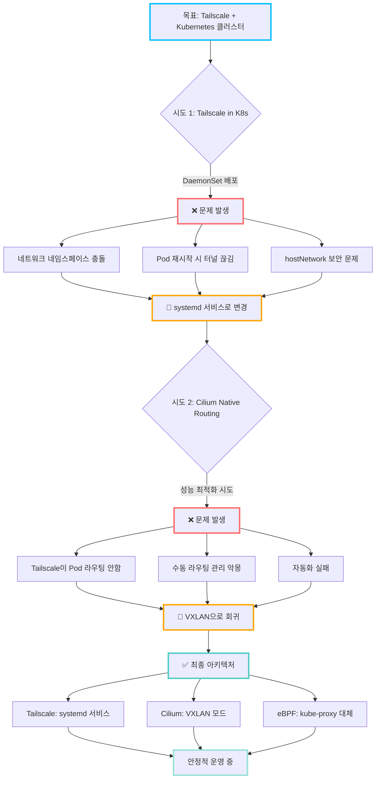
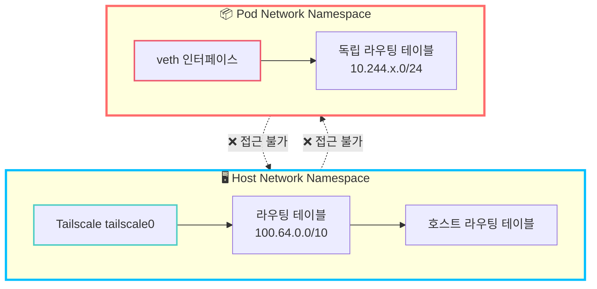
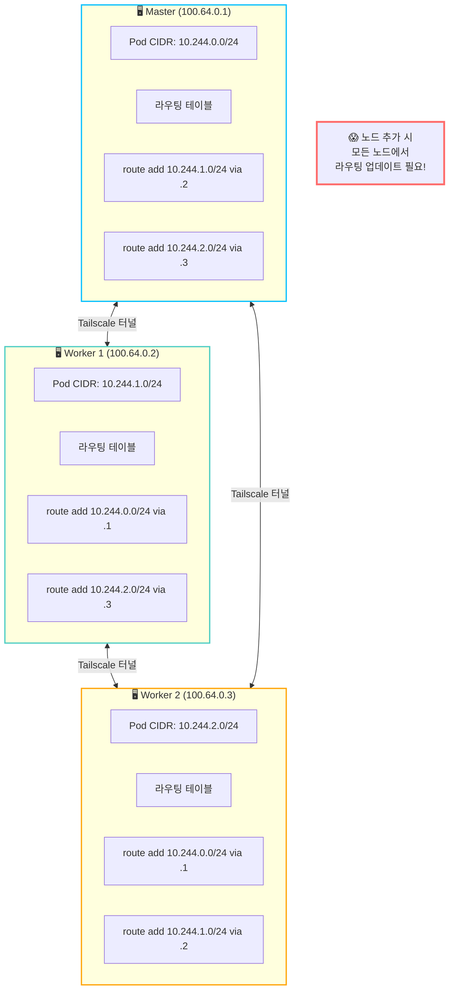
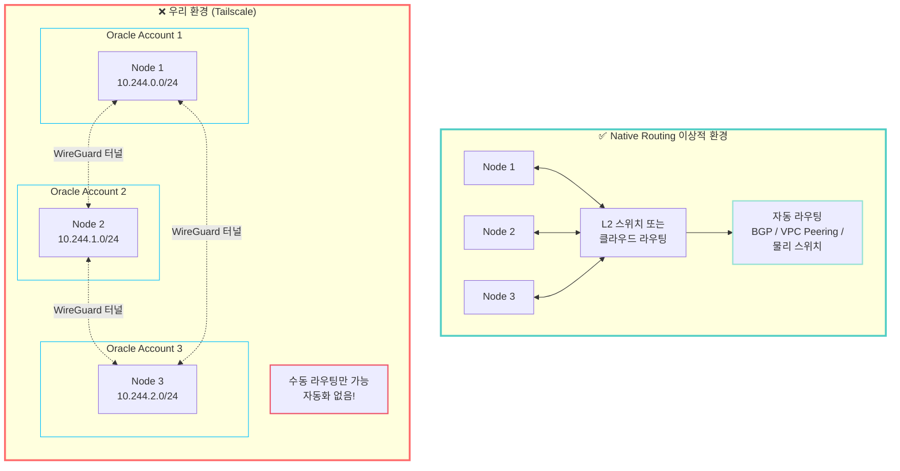
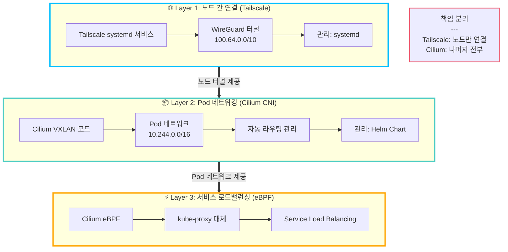
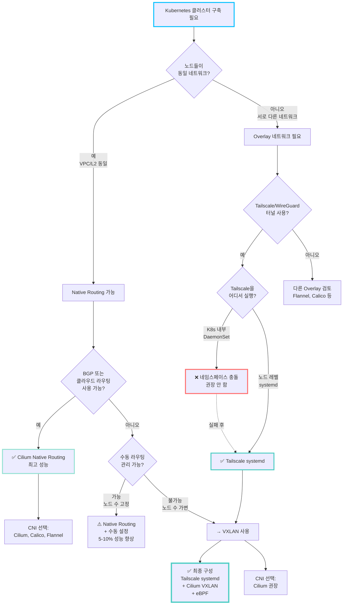

# 5단계: 실전 경험과 아키텍처 결정 배경

> **시리즈**: [Oracle Cloud + Tailscale + Kubernetes 완벽 가이드](README.md)
> ← **이전**: [4단계: 네트워킹 심화 이해](04-deep-dive-networking.md) | **처음으로**: [README](README.md)

---

> 며칠간의 삽질에서 얻은 교훈 - "다음에는 이렇게 하지 말자"

## 📋 이 문서의 목적

이 가이드의 최종 아키텍처는 처음부터 완벽하게 설계된 것이 아닙니다.
여러 번의 시도와 실패를 거쳐 현재의 구성에 도달했습니다.

**왜 이 문서가 필요한가?**
- 실패한 방법을 기록하여 같은 함정에 빠지지 않도록
- 아키텍처 결정의 배경과 근거 공유
- "왜 이렇게 했나?"에 대한 솔직한 답변

### 전체 여정 타임라인



## 🚫 실패담 1: Tailscale을 Kubernetes 내부에서 실행

### 시도한 방법

Tailscale을 Kubernetes 방식으로 관리하려고 시도했습니다:

```yaml
# 시도했던 방법 (실패)
apiVersion: apps/v1
kind: DaemonSet
metadata:
  name: tailscale
  namespace: kube-system
spec:
  template:
    spec:
      hostNetwork: true  # ← 이미 여기서 문제의 냄새
      containers:
      - name: tailscale
        image: tailscale/tailscale:latest
        securityContext:
          privileged: true  # ← 보안 문제
```

**왜 시도했나?**
- Kubernetes 방식으로 통합 관리
- `kubectl` 명령어로 모든 것 제어
- GitOps 워크플로우에 포함

### 겪은 문제

#### 1. **CNI와 네트워크 네임스페이스 충돌**

```bash
# Pod 네트워크 네임스페이스
ip netns exec cni-xxx ip route
# 10.244.0.0/16 via cilium_host

# 호스트 네트워크 네임스페이스
ip route
# 100.64.0.0/10 via tailscale0

# → 두 세계가 서로를 인식하지 못함!
```

**증상:**
- Tailscale Pod 시작은 되지만 라우팅 작동 안 함
- `tailscale status`는 정상, 실제 통신은 실패
- 패킷 드롭 발생

#### 2. **Pod 재시작 시 터널 끊김**

```bash
# Scenario
1. Tailscale Pod 정상 실행 → 터널 연결 OK
2. Pod 재시작 (업데이트, 노드 이동 등)
3. Tailscale 재연결 시도
4. 기존 세션 끊김, 새 IP 할당 가능
5. 클러스터 전체 통신 장애 발생!
```

**문제:**
- Pod는 ephemeral (일시적)
- Tailscale 터널은 persistent (지속적) 필요
- 근본적인 불일치

#### 3. **hostNetwork 사용의 보안 문제**

```yaml
hostNetwork: true  # Pod가 호스트 네트워크 직접 사용
```

**문제점:**
- Pod가 호스트의 모든 네트워크 접근 가능
- Kubernetes 네트워크 격리 무력화
- 보안 감사 실패

### 기술적 배경: 왜 작동하지 않는가?

#### 네트워크 네임스페이스의 한계



**핵심 문제:**
- Tailscale은 호스트 라우팅 테이블 수정
- Pod는 독립 네트워크 네임스페이스
- 두 레이어가 서로 통신 불가

### 결론: 노드 레벨 systemd 서비스

**최종 선택:**
```bash
# 각 노드에서 직접 설치
curl -fsSL https://tailscale.com/install.sh | sh
sudo tailscale up --login-server=...
```

**장점:**
- ✅ 안정적인 터널 (재부팅 시에도 유지)
- ✅ CNI와 충돌 없음
- ✅ 단순하고 명확한 관리
- ✅ Tailscale 공식 권장 방법

**단점:**
- ❌ 노드별 수동 설정 필요
- ❌ Kubernetes 방식 관리 불가
- ❌ GitOps에 포함 어려움

**트레이드오프:**
운영 안정성 > 관리 편의성

---

## 🚫 실패담 2: Cilium Native Routing 시도

### 시도한 방법

VXLAN 오버헤드를 제거하여 성능을 높이려고 시도:

```bash
# Native Routing 모드로 Cilium 설치
helm install cilium cilium/cilium \
  --set routingMode=native \          # ← VXLAN 대신 Native
  --set autoDirectNodeRoutes=true \   # ← 자동 라우팅 기대
  --set ipv4NativeRoutingCIDR=10.244.0.0/16
```

**왜 시도했나?**
- VXLAN 캡슐화 오버헤드 제거 (5-10% 성능 향상)
- "더 빠른 네트워크"에 대한 욕심
- 기술 블로그에서 "Native Routing이 최고"라는 글 읽음

### 겪은 문제

#### 1. **Tailscale이 Pod 라우팅을 자동 설정하지 않음**

```bash
# 기대했던 것:
tailscale up --advertise-routes=10.244.0.0/16
# → 모든 노드에 자동으로 라우팅 설정될 줄 알았음

# 현실:
ip route show
# 100.64.0.2 via tailscale0  ← 노드 IP만 있음
# 10.244.1.0/24는 없음!
```

**깨달음:**
- Tailscale은 **노드 간 터널만 제공**
- Pod 네트워크는 **별도로 라우팅 설정 필요**
- `advertise-routes`는 광고만, 자동 설정 아님

#### 2. **수동 라우팅 테이블 관리의 악몽**

**각 노드에서 수동 설정 필요:**

```bash
# Master 노드 (100.64.0.1)
sudo ip route add 10.244.1.0/24 via 100.64.0.2  # Worker 1
sudo ip route add 10.244.2.0/24 via 100.64.0.3  # Worker 2

# Worker 1 (100.64.0.2)
sudo ip route add 10.244.0.0/24 via 100.64.0.1  # Master
sudo ip route add 10.244.2.0/24 via 100.64.0.3  # Worker 2

# Worker 2 (100.64.0.3)
sudo ip route add 10.244.0.0/24 via 100.64.0.1  # Master
sudo ip route add 10.244.1.0/24 via 100.64.0.2  # Worker 1
```



**문제점:**
1. 노드 추가 시마다 **모든 노드**에서 업데이트
2. IP 변경 시 **모든 라우팅 테이블** 수정
3. 재부팅 시 라우팅 유실 → 스크립트 작성 필요
4. 운영 복잡도 기하급수적 증가

#### 3. **자동화의 어려움**

시도한 자동화 방법들:

```bash
# 1. systemd 서비스로 라우팅 추가 (실패)
#    - 노드 추가/제거 시 동기화 문제

# 2. Kubernetes Operator 작성 (너무 복잡)
#    - 라우팅 테이블 관리 Operator 필요
#    - 오버엔지니어링

# 3. Ansible 플레이북 (관리 포인트 증가)
#    - Kubernetes 외부 도구 의존성
#    - GitOps와 불일치
```

**결론:** 모두 만족스럽지 않음

### 기술적 배경: Native Routing의 요구사항

#### Native Routing이 작동하는 환경



**근본적인 불일치:**
- Native Routing: Layer 2/3 라우팅 필요
- Tailscale: Layer 4 터널 (라우팅 제공 안 함)

### 결론: VXLAN 터널링으로 회귀

**최종 선택:**
```bash
helm install cilium cilium/cilium \
  --set routingMode=tunnel \
  --set tunnelProtocol=vxlan
```

**장점:**
- ✅ 라우팅 자동 관리 (Cilium이 전담)
- ✅ 노드 추가/제거 시 설정 불필요
- ✅ 운영 복잡도 낮음
- ✅ 안정적이고 예측 가능

**단점:**
- ❌ VXLAN 캡슐화 오버헤드 (~5-10%)
- ❌ MTU 감소 (1500 → 1200)

**성능 테스트 결과:**
```bash
# iperf3 테스트 (Pod to Pod)
Native Routing: ~9.2 Gbps
VXLAN:          ~8.7 Gbps
차이:           ~5%

# 실제 워크로드 영향: 거의 무시 가능
# CPU/메모리가 먼저 병목
```

**트레이드오프:**
미세한 성능 차이 < 압도적인 운영 편의성

---

## ✅ 최종 아키텍처 결정

### 선택한 구성



### 각 계층의 책임

| 계층 | 역할 | 관리 방식 | CIDR 대역 |
|------|------|-----------|-----------|
| **Tailscale** | 노드 간 터널 | systemd 서비스 | 100.64.0.0/10 |
| **Cilium** | Pod 네트워킹 | Helm Chart | 10.244.0.0/16 |
| **eBPF** | Service LB | Cilium 내장 | - |

**명확한 책임 분리:**
- Tailscale: "노드만 연결" (Layer 1)
- Cilium: "나머지 전부" (Layer 2 + 3)

### 의사결정 플로우차트



### 트레이드오프 분석

#### 성능 vs 운영성

| 구성 | 성능 | 운영 난이도 | 안정성 | 선택 |
|------|------|------------|--------|------|
| Native + K8s Tailscale | ⭐⭐⭐⭐⭐ | ⭐ | ⭐ | ❌ |
| Native + systemd Tailscale | ⭐⭐⭐⭐⭐ | ⭐⭐ | ⭐⭐ | ❌ |
| VXLAN + systemd Tailscale | ⭐⭐⭐⭐ | ⭐⭐⭐⭐⭐ | ⭐⭐⭐⭐⭐ | ✅ |

**우선순위:**
1. 안정성 (가장 중요)
2. 운영 편의성 (두 번째)
3. 성능 (세 번째)

#### 실무 관점

**"완벽한 설정"은 없습니다:**
- 모든 것을 만족하는 구성은 존재하지 않음
- 상황과 우선순위에 따라 선택
- 우리의 선택: **안정성과 단순함**

---

## 💡 배운 교훈

### 1. 단순함이 최고

```
복잡한 최적화 << 단순하고 안정적인 구성
```

**예시:**
- ❌ Native Routing + 자동화 스크립트 + Operator
- ✅ VXLAN + 기본 설정

**이유:**
- 복잡한 시스템은 디버깅 어려움
- 운영 중 문제 발생 시 원인 파악 지연
- 팀원 온보딩 시간 증가

### 2. 운영 안정성 > 미세한 성능

**5% 성능 향상 vs 50% 운영 부담 감소**
- 대부분의 경우 성능은 충분함
- CPU/메모리/디스크가 먼저 병목
- 네트워크 5% 차이는 체감 불가

**실제 경험:**
```bash
# 성능 병목 분석 결과
1. 데이터베이스 쿼리 최적화: 50% 개선
2. API 게이트웨이 코드 리팩토링: 30% 개선
3. 네트워크 최적화 (Native vs VXLAN): 5% 개선

→ 우선순위가 명확함
```

### 3. 공식 문서 권장사항에는 이유가 있다

**Tailscale 공식 문서:**
> "Run Tailscale as a system service on each node"

**Cilium 공식 문서:**
> "VXLAN is recommended for overlay networks"

**왜 처음부터 안 따랐나?**
- "내 상황은 다를 거야"
- "더 나은 방법이 있을 거야"
- "최신 기술을 써야 해"

**깨달음:**
- 공식 문서는 수많은 사례 기반
- 대부분의 엣지 케이스 고려됨
- 특별한 이유 없으면 권장사항 따르기

### 4. 완벽한 설정은 없다

**모든 아키텍처는 트레이드오프:**
- 성능 ↔ 안정성
- 복잡도 ↔ 유연성
- 자동화 ↔ 제어권

**우선순위 명확히:**
1. 무엇이 가장 중요한가?
2. 무엇을 포기할 수 있는가?
3. 팀이 관리할 수 있는가?

### 5. 삽질은 배움의 과정

**실패한 시도들이 가치 있는 이유:**
- 기술의 한계 이해
- 트레이드오프 체감
- 더 나은 결정의 근거

**이 문서의 목적:**
- 같은 실수 반복 방지
- 결정의 배경 공유
- 다음 구축자를 위한 가이드

---

## 🔮 향후 개선 가능성

### 1. Tailscale in Kubernetes 재검토

**언제 다시 시도할 가치가 있나?**
- Tailscale Kubernetes Operator 안정화
- CNI와의 통합 개선
- 공식 지원 시작

**현재 상태:**
- Tailscale Operator: 베타
- 프로덕션 사용: 권장 안 됨

### 2. Native Routing 재검토

**언제 시도할 가치가 있나?**
- BGP 라우팅 가능한 환경
- 클라우드 VPC Peering 사용
- 초고성능 필요 (HPC, ML)

**우리 환경에서는:**
- 서로 다른 Oracle 계정 = VPC Peering 불가
- Native Routing 불가능

### 3. 모니터링 강화

**추가할 만한 것:**
- Cilium Hubble (네트워크 가시성)
- Prometheus + Grafana
- 성능 메트릭 수집

---

## 📚 추가 자료

### 참고한 문서들

- [Tailscale Kubernetes Best Practices](https://tailscale.com/kb/1185/kubernetes/)
- [Cilium Network Policy](https://docs.cilium.io/en/stable/network/kubernetes/)
- [VXLAN RFC 7348](https://tools.ietf.org/html/rfc7348)

### 비슷한 경험담

- [Reddit: Tailscale + K8s Issues](https://reddit.com/r/kubernetes)
- [GitHub: Cilium Native Routing Discussions](https://github.com/cilium/cilium/discussions)

---

## ✍️ 추가 실패담 (향후 작성 예정)

이 문서는 계속 업데이트됩니다. 앞으로 추가할 내용:

- [ ] iptables vs eBPF 선택 과정
- [ ] MTU 설정 시행착오
- [ ] 블록볼륨 마운트 실수
- [ ] Headscale vs Tailscale 공식 서버
- [ ] Oracle Cloud 방화벽 설정 함정
- [ ] SELinux Permissive 모드의 이유
- [ ] 기타...

**기여 환영:**
비슷한 경험이 있다면 공유해주세요!

---

*"실패는 성공의 어머니" - 하지만 남의 실패로부터 배우면 더 빠릅니다.*