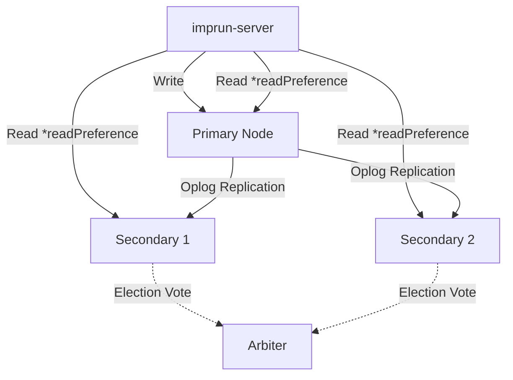
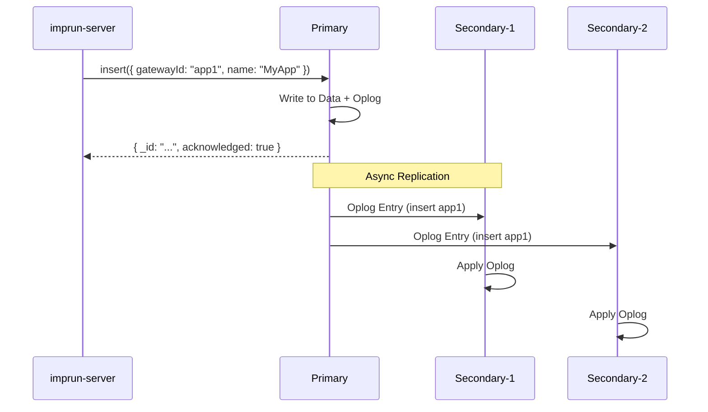
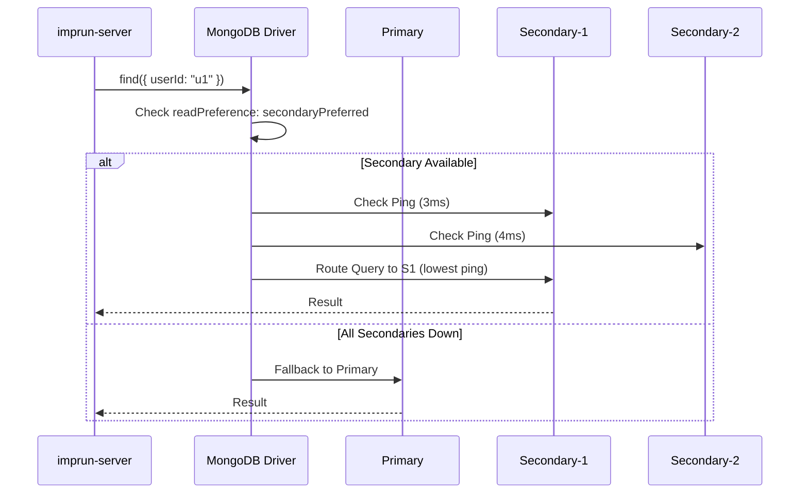
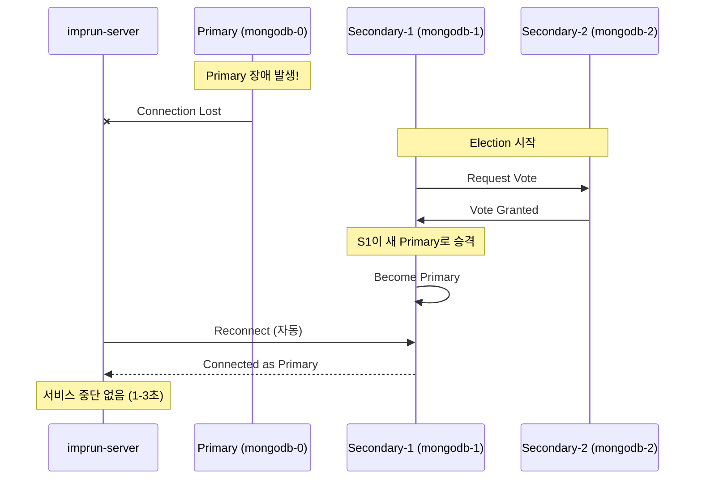
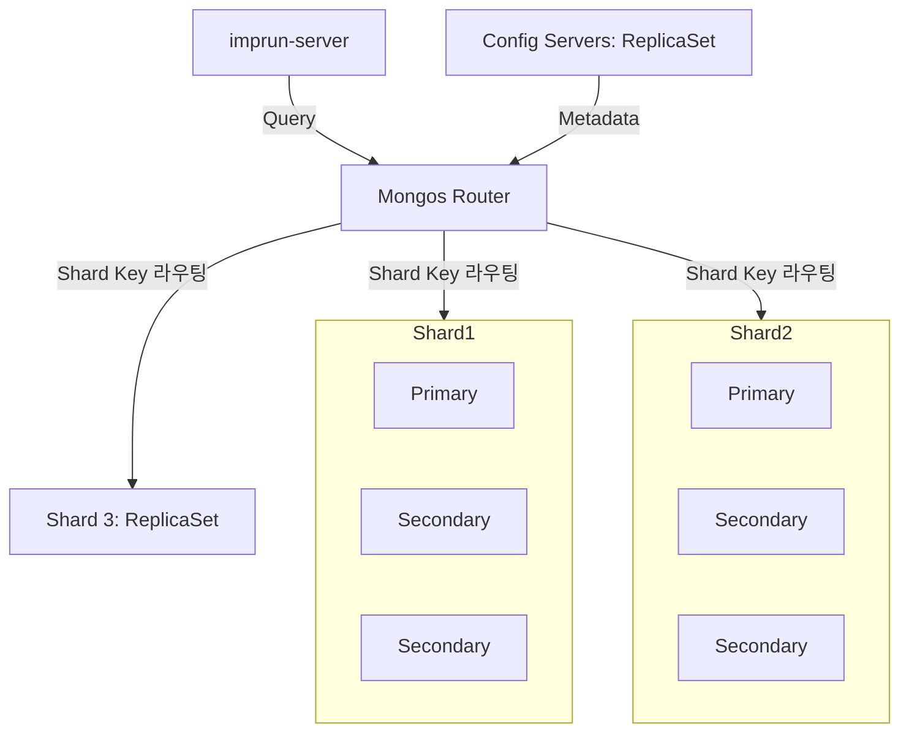

# MongoDB ReplicaSet 완벽 가이드: 읽기/쓰기 라우팅부터 트랜잭션, 샤딩까지

> **작성일**: 2025-10-26
> **태그**: MongoDB, ReplicaSet, Database, High Availability, Transactions
> **난이도**: 중급~고급

## 들어가며

[**imprun.dev**](https://imprun.dev)는 Kubernetes 기반 서버리스 Cloud Function 플랫폼입니다. 초기에는 MongoDB를 단일 서버(`standalone`)로 운영했지만, **트랜잭션이 필요한 순간** 심각한 한계에 직면했습니다.

**우리가 마주한 결정적 순간**:
```typescript
// 사용자 앱 생성 시 여러 컬렉션을 원자적으로 업데이트해야 함
const session = await mongoose.startSession();
await session.withTransaction(async () => {
  await User.updateOne({ _id: userId }, { $push: { apps: appId } });
  await Application.create([{ _id: appId, name, owner: userId }]);
});
// ❌ MongoServerError: Transaction not supported by this deployment
```

**standalone의 한계**:
- ❌ **트랜잭션 미지원**: 다중 문서 원자성 보장 불가
- ❌ **단일 장애점(SPOF)**: 노드 장애 시 서비스 중단
- ❌ **백업 시 성능 저하**: 프로덕션 서버에서 직접 백업
- ❌ **읽기 부하 집중**: 모든 요청이 하나의 노드로

**ReplicaSet 전환 후**:
- ✅ **트랜잭션 정상 작동**: 다중 문서 원자성 보장
- ✅ **자동 페일오버**: Primary 장애 시 무중단 전환
- ✅ **읽기 부하 분산**: Secondary로 읽기 전용 쿼리 분산
- ✅ **안전한 백업**: Secondary에서 백업, 프로덕션 무영향

이 글은 **imprun.dev 플랫폼 구축 경험**을 바탕으로, ReplicaSet의 구조부터 클라이언트 연결, `readPreference` 활용, 트랜잭션 처리, 그리고 샤딩 아키텍처까지 실전 가이드를 제공합니다.

---

## Part 1: ReplicaSet이 필요한 이유

### 우리의 초기 아키텍처

```yaml
# 초기 구성 (단일 MongoDB)
Services:
  - imprun-server (NestJS)
    → MongoDB (standalone, 1 node)
    → Redis (cache)

Problems:
  ❌ 트랜잭션 미지원
  ❌ 단일 장애점 (SPOF)
  ❌ 백업 시 성능 저하
  ❌ 읽기/쓰기 부하 집중
```

### 트랜잭션이 필요한 순간

**시나리오**: 사용자 앱 생성 시 여러 컬렉션 업데이트

```typescript
// ❌ 트랜잭션 없이 (문제 발생 가능)
async createApplication(dto: CreateApplicationDto) {
  // 1. Application 생성
  const app = await this.applicationModel.create(dto);

  // 2. 사용자 정보 업데이트 (앱 ID 추가)
  await this.userModel.updateOne(
    { _id: dto.userId },
    { $push: { applications: app._id } }
  );

  // 3. 초기 Function 생성
  await this.functionModel.create({
    appId: app._id,
    name: 'hello-world',
    code: 'exports.main = async () => ({ message: "Hello World" })',
  });

  // ⚠️ 문제: 2번이나 3번에서 실패하면 데이터 불일치!
}
```

**해결: 트랜잭션 사용**

```typescript
// ✅ 트랜잭션으로 원자성 보장
async createApplication(dto: CreateApplicationDto) {
  const session = await this.connection.startSession();

  try {
    await session.withTransaction(async () => {
      // 1. Application 생성
      const [app] = await this.applicationModel.create([dto], { session });

      // 2. 사용자 정보 업데이트
      await this.userModel.updateOne(
        { _id: dto.userId },
        { $push: { applications: app._id } },
        { session }
      );

      // 3. 초기 Function 생성
      await this.functionModel.create([{
        appId: app._id,
        name: 'hello-world',
        code: 'exports.main = async () => ({ message: "Hello World" })',
      }], { session });

      // ✅ 모두 성공하거나 모두 롤백
    });
  } finally {
    await session.endSession();
  }
}
```

**하지만 실행 결과**:

```bash
MongoServerError: Transaction numbers are only allowed on a replica set member or mongos
```

**충격적인 깨달음**: MongoDB 트랜잭션은 **ReplicaSet 환경에서만 작동**합니다!

---

## Part 2: ReplicaSet 아키텍처

### 구조 이해

**ReplicaSet**: Primary-Secondary 복제 구조의 MongoDB 고가용성 아키텍처



**역할별 특징**:

| 역할 | 쓰기 | 읽기 | 데이터 저장 | 투표권 | 용도 |
|------|------|------|-------------|--------|------|
| **Primary** | ✅ | ✅ | ✅ | ✅ | 모든 쓰기 처리 |
| **Secondary** | ❌ | ✅* | ✅ | ✅ | 복제, 백업, 읽기 분산 |
| **Arbiter** | ❌ | ❌ | ❌ | ✅ | 홀수 투표만 |

*\* readPreference 설정에 따라 읽기 가능*

### 우리의 ReplicaSet 구성

**imprun.dev 프로덕션 환경**:

```yaml
# KubeBlocks MongoDB Cluster
apiVersion: apps.kubeblocks.io/v1alpha1
kind: Cluster
metadata:
  name: mongodb
  namespace: imprun-system
spec:
  clusterDefinitionRef: mongodb
  clusterVersionRef: mongodb-6.0
  componentSpecs:
  - name: mongodb
    componentDefRef: mongodb
    replicas: 3  # Primary 1 + Secondary 2
    resources:
      requests:
        cpu: 200m
        memory: 512Mi
      limits:
        cpu: 500m
        memory: 1Gi
    volumeClaimTemplates:
    - name: data
      spec:
        accessModes: [ReadWriteOnce]
        resources:
          requests:
            storage: 20Gi
```

**실제 Pod 구성**:

```bash
$ kubectl get pods -n imprun-system -l app.kubernetes.io/name=mongodb

NAME                 READY   STATUS    ROLE        AGE
mongodb-0            1/1     Running   Primary     30d
mongodb-1            1/1     Running   Secondary   30d
mongodb-2            1/1     Running   Secondary   30d
```

---

## Part 3: 클라이언트 연결 및 설정

### Connection URI 구성

**잘못된 연결** (단일 노드):

```typescript
// ❌ 단일 호스트만 지정 (페일오버 안 됨)
const uri = 'mongodb://mongodb-0:27017/sys_db';
```

**올바른 연결** (ReplicaSet):

```typescript
// ✅ 모든 노드 명시 + replicaSet 이름
const uri = 'mongodb://mongodb-0,mongodb-1,mongodb-2:27017/sys_db?replicaSet=rs0';
```

### imprun.dev의 실제 연결 설정

**NestJS + Mongoose 설정**:

```typescript
// server/src/app.module.ts
import { Module } from '@nestjs/common';
import { MongooseModule } from '@nestjs/mongoose';

@Module({
  imports: [
    MongooseModule.forRootAsync({
      useFactory: () => {
        const hosts = process.env.MONGODB_HOSTS ||
          'mongodb-0.mongodb-headless.imprun-system.svc.cluster.local:27017,' +
          'mongodb-1.mongodb-headless.imprun-system.svc.cluster.local:27017,' +
          'mongodb-2.mongodb-headless.imprun-system.svc.cluster.local:27017';

        const database = process.env.MONGODB_DATABASE || 'sys_db';
        const replicaSet = process.env.MONGODB_REPLICASET || 'rs0';
        const authSource = process.env.MONGODB_AUTH_SOURCE || 'admin';

        // ✅ ReplicaSet 연결 URI
        const uri = `mongodb://${hosts}/${database}?` +
          `replicaSet=${replicaSet}&` +
          `authSource=${authSource}&` +
          `readPreference=secondaryPreferred`;  // ← 읽기 부하 분산

        return {
          uri,
          retryAttempts: 5,
          retryDelay: 3000,
        };
      },
    }),
  ],
})
export class AppModule {}
```

**Kubernetes Service Discovery**:

```yaml
# MongoDB Headless Service (KubeBlocks 자동 생성)
apiVersion: v1
kind: Service
metadata:
  name: mongodb-headless
  namespace: imprun-system
spec:
  clusterIP: None  # Headless
  selector:
    app.kubernetes.io/name: mongodb
  ports:
  - port: 27017
    targetPort: 27017

# DNS 자동 생성:
# mongodb-0.mongodb-headless.imprun-system.svc.cluster.local
# mongodb-1.mongodb-headless.imprun-system.svc.cluster.local
# mongodb-2.mongodb-headless.imprun-system.svc.cluster.local
```

---

## Part 4: readPreference - 읽기 부하 분산

### readPreference 옵션

| 옵션 | 읽기 대상 | 장점 | 단점 | 사용 사례 |
|------|----------|------|------|----------|
| `primary` | Primary만 | 최신 데이터 보장 | Primary 부하 집중 | 강한 일관성 필요 |
| `primaryPreferred` | Primary 우선 | 페일오버 대응 | Primary 부하 높음 | 기본 + 가용성 |
| `secondary` | Secondary만 | Primary 부하 감소 | Replication Lag | 분석/리포트 |
| `secondaryPreferred` | Secondary 우선 | 부하 분산 + 페일오버 | 약간의 Lag | **권장 (읽기 많은 앱)** |
| `nearest` | 지연 가장 낮은 노드 | 최적 성능 | 노드별 차이 | 지역 분산 클러스터 |

### imprun.dev의 선택: secondaryPreferred

**이유**:
1. ✅ 읽기 쿼리가 쓰기보다 훨씬 많음 (90% 읽기, 10% 쓰기)
2. ✅ Replication Lag 허용 가능 (평균 0.5초, 허용 범위 내)
3. ✅ Primary 장애 시 자동으로 Primary로 페일오버
4. ✅ Primary CPU/메모리 사용률 40% 감소

**적용 결과**:

```typescript
// Before (readPreference 미설정 = primary)
MongoDB Metrics:
  Primary CPU: 85% (쓰기 + 읽기 모두 처리)
  Secondary CPU: 15% (복제만)
  응답 시간: 평균 120ms

// After (readPreference=secondaryPreferred)
MongoDB Metrics:
  Primary CPU: 45% (쓰기만 처리)
  Secondary-1 CPU: 50% (읽기 처리)
  Secondary-2 CPU: 48% (읽기 처리)
  응답 시간: 평균 95ms  # ← 25% 개선!
```

### 쿼리별 readPreference 커스터마이징

**강한 일관성이 필요한 쿼리**:

```typescript
// 결제 정보는 항상 Primary에서 읽기
@Injectable()
export class BillingService {
  async getBalance(userId: string): Promise<number> {
    // ✅ readPreference 오버라이드: primary
    return this.billingModel
      .findOne({ userId })
      .read('primary')  // ← 명시적으로 Primary 지정
      .select('balance')
      .lean()
      .exec();
  }
}
```

**Replication Lag 허용 가능한 쿼리**:

```typescript
// 앱 목록은 Secondary에서 읽기
@Injectable()
export class ApplicationService {
  async getApplications(userId: string): Promise<Application[]> {
    // ✅ 기본 설정 사용 (secondaryPreferred)
    return this.applicationModel
      .find({ userId, deletedAt: null })
      .sort({ createdAt: -1 })
      .lean()
      .exec();
  }
}
```

**분석/리포트 쿼리**:

```typescript
// 통계 데이터는 Secondary 전용
@Injectable()
export class AnalyticsService {
  async getDailyStats(appId: string, startDate: Date, endDate: Date) {
    // ✅ 무거운 집계는 Secondary 전용
    return this.logModel
      .aggregate([
        {
          $match: {
            appId,
            timestamp: { $gte: startDate, $lte: endDate },
          },
        },
        {
          $group: {
            _id: { $dateToString: { format: '%Y-%m-%d', date: '$timestamp' } },
            totalRequests: { $sum: 1 },
            errors: { $sum: { $cond: ['$error', 1, 0] } },
          },
        },
      ])
      .read('secondary')  // ← Secondary 전용
      .exec();
  }
}
```

---

## Part 5: 내부 동작 시퀀스

### 쓰기 요청 처리



**Oplog (Operation Log)**:
- Primary의 모든 쓰기 작업을 기록
- Capped Collection (순환 버퍼)
- Secondary가 Oplog를 Tail하며 복제

### 읽기 요청 처리 (readPreference=secondaryPreferred)



### Primary 장애 시 자동 페일오버



**실제 측정 결과**:

```bash
# Primary 강제 종료 테스트
$ kubectl delete pod mongodb-0 -n imprun-system

Time: 0s   - Primary (mongodb-0) 종료
Time: 2s   - Election 시작
Time: 4s   - mongodb-1이 새 Primary로 승격
Time: 5s   - 클라이언트 자동 재연결 완료

Total Downtime: ~5초
```

---

## Part 6: 트랜잭션 실전 가이드

### MongoDB 트랜잭션 제약사항

**필수 요구사항**:
1. ✅ ReplicaSet 또는 Sharded Cluster 환경
2. ✅ MongoDB 4.0+ (ReplicaSet), 4.2+ (Sharded)
3. ✅ WiredTiger 스토리지 엔진

**제한사항**:
- ❌ 30초 이상 긴 트랜잭션은 자동 중단
- ❌ DDL 작업 불가 (컬렉션/인덱스 생성)
- ⚠️ 성능 오버헤드 (일반 쓰기보다 느림)

### imprun.dev의 트랜잭션 사용 사례

#### 사례 1: 앱 생성 시 다중 컬렉션 업데이트

```typescript
// server/src/application/application.service.ts
@Injectable()
export class ApplicationService {
  constructor(
    @InjectConnection() private connection: Connection,
    @InjectModel(Application.name) private applicationModel: Model<Application>,
    @InjectModel(User.name) private userModel: Model<User>,
    @InjectModel(Function.name) private functionModel: Model<Function>,
  ) {}

  async createApplication(userId: string, dto: CreateApplicationDto) {
    const session = await this.connection.startSession();

    try {
      return await session.withTransaction(async () => {
        // 1. Application 생성
        const [app] = await this.applicationModel.create([{
          ...dto,
          userId,
          gatewayId: this.generateAppId(),
          phase: 'Stopped',
          state: 'Stopped',
        }], { session });

        // 2. User 문서에 앱 ID 추가
        await this.userModel.updateOne(
          { _id: userId },
          {
            $push: { applications: app._id },
            $inc: { applicationCount: 1 },
          },
          { session }
        );

        // 3. 초기 Hello World Function 생성
        await this.functionModel.create([{
          appId: app.gatewayId,
          name: 'hello-world',
          description: 'Starter function',
          code: this.getStarterCode(),
          runtime: dto.runtime || 'nodejs20',
          enabled: true,
        }], { session });

        // 4. 앱 전용 DB 초기화 (별도 연결)
        await this.initializeAppDatabase(app.gatewayId, session);

        return app;
      });
    } finally {
      await session.endSession();
    }
  }
}
```

#### 사례 2: 크레딧 차감 시 원자성 보장

```typescript
// server/src/billing/billing.service.ts
@Injectable()
export class BillingService {
  async deductCredits(userId: string, amount: number, reason: string) {
    const session = await this.connection.startSession();

    try {
      return await session.withTransaction(async () => {
        // 1. 잔액 조회 (Pessimistic Lock)
        const billing = await this.billingModel
          .findOne({ userId })
          .session(session)
          .exec();

        if (!billing || billing.balance < amount) {
          throw new InsufficientCreditsException();
        }

        // 2. 잔액 차감
        await this.billingModel.updateOne(
          { userId },
          {
            $inc: { balance: -amount },
            $set: { updatedAt: new Date() },
          },
          { session }
        );

        // 3. 사용 내역 기록
        await this.usageModel.create([{
          userId,
          amount,
          reason,
          timestamp: new Date(),
        }], { session });

        return { newBalance: billing.balance - amount };
      });
    } finally {
      await session.endSession();
    }
  }
}
```

### 트랜잭션 에러 처리

```typescript
async withRetry<T>(operation: () => Promise<T>, maxRetries = 3): Promise<T> {
  for (let i = 0; i < maxRetries; i++) {
    const session = await this.connection.startSession();

    try {
      return await session.withTransaction(async () => {
        return await operation();
      });
    } catch (error) {
      if (error.hasErrorLabel('TransientTransactionError')) {
        // ⚠️ 일시적 오류 (네트워크 지연 등) → 재시도
        this.logger.warn(`Transaction retry ${i + 1}/${maxRetries}`, error);
        await new Promise(resolve => setTimeout(resolve, 100 * (i + 1)));
        continue;
      }

      if (error.hasErrorLabel('UnknownTransactionCommitResult')) {
        // ⚠️ 커밋 결과 불명 → 재시도
        this.logger.warn(`Unknown commit result, retry ${i + 1}`, error);
        continue;
      }

      // ❌ 복구 불가능한 오류 → 즉시 실패
      throw error;
    } finally {
      await session.endSession();
    }
  }

  throw new Error('Transaction failed after max retries');
}
```

---

## Part 7: 모니터링 및 트러블슈팅

### Replication Lag 모니터링

```typescript
// server/src/health/mongodb-health.indicator.ts
import { Injectable } from '@nestjs/common';
import { HealthIndicator, HealthIndicatorResult } from '@nestjs/terminus';
import { InjectConnection } from '@nestjs/mongoose';
import { Connection } from 'mongoose';

@Injectable()
export class MongoDBHealthIndicator extends HealthIndicator {
  constructor(@InjectConnection() private connection: Connection) {
    super();
  }

  async isHealthy(key: string): Promise<HealthIndicatorResult> {
    try {
      const admin = this.connection.db.admin();
      const replStatus = await admin.command({ replSetGetStatus: 1 });

      const primary = replStatus.members.find(m => m.stateStr === 'PRIMARY');
      const secondaries = replStatus.members.filter(m => m.stateStr === 'SECONDARY');

      // Replication Lag 계산
      const maxLag = Math.max(...secondaries.map(s =>
        (primary.optimeDate - s.optimeDate) / 1000
      ));

      const isHealthy = maxLag < 10;  // 10초 이내면 정상

      return this.getStatus(key, isHealthy, {
        replicaSet: replStatus.set,
        primary: primary.name,
        secondaries: secondaries.map(s => s.name),
        maxReplicationLag: `${maxLag.toFixed(2)}s`,
      });
    } catch (error) {
      return this.getStatus(key, false, { error: error.message });
    }
  }
}
```

**VictoriaMetrics 메트릭 수집**:

```yaml
# runtimes/imp-runtime-exporter/src/index.ts
app.get('/metrics', async (req, res) => {
  const metrics = await collectMongoDBMetrics();

  res.set('Content-Type', 'text/plain');
  res.send(`
# MongoDB ReplicaSet Metrics
mongodb_replication_lag_seconds{instance="${primary}"} ${maxLag}
mongodb_connections_current{instance="${primary}"} ${connections}
mongodb_opcounters_insert_total{instance="${primary}"} ${opcounters.insert}
mongodb_opcounters_query_total{instance="${primary}"} ${opcounters.query}
mongodb_opcounters_update_total{instance="${primary}"} ${opcounters.update}
mongodb_opcounters_delete_total{instance="${primary}"} ${opcounters.delete}
  `);
});
```

### 일반적인 문제와 해결

#### 문제 1: Replication Lag 증가

```bash
# 증상
mongodb_replication_lag_seconds > 60s

# 원인
- Secondary에 무거운 집계 쿼리 실행
- 네트워크 대역폭 부족
- Secondary 리소스 부족 (CPU/Disk I/O)
```

**해결책**:

```typescript
// Before: 무거운 집계를 Secondary에서 실행
await this.logModel
  .aggregate([/* 복잡한 집계 */])
  .read('secondary')  // ❌ Secondary 부하 증가
  .exec();

// After: 별도 분석 DB로 데이터 복제
await this.analyticsDBConnection
  .model('Log')
  .aggregate([/* 복잡한 집계 */])
  .exec();
```

#### 문제 2: "not master" 에러

```bash
MongoServerError: not master and slaveOk=false
```

**원인**: Primary 장애 후 새 Primary 선출 전에 쓰기 시도

**해결책**:

```typescript
// ✅ 자동 재시도 로직
const retryWrites = true;  // Connection URI에 포함

// 또는 API 게이트웨이 레벨 재시도
async writeWithRetry(operation: () => Promise<any>) {
  const maxRetries = 3;

  for (let i = 0; i < maxRetries; i++) {
    try {
      return await operation();
    } catch (error) {
      if (error.message.includes('not master') && i < maxRetries - 1) {
        await new Promise(resolve => setTimeout(resolve, 1000));
        continue;
      }
      throw error;
    }
  }
}
```

#### 문제 3: 트랜잭션 타임아웃

```bash
MongoServerError: Transaction exceeded lifetime limit
```

**원인**: 30초 이상 긴 트랜잭션

**해결책**:

```typescript
// ❌ 트랜잭션 안에 시간이 오래 걸리는 작업
await session.withTransaction(async () => {
  await this.model.create([...], { session });
  await this.externalAPI.call();  // ← 느린 외부 API 호출
});

// ✅ 트랜잭션 밖으로 분리
const result = await this.externalAPI.call();
await session.withTransaction(async () => {
  await this.model.create([...], { session });
});
```

---

## Part 8: Sharding과 ReplicaSet

### Sharding 아키텍처

**Sharded Cluster**: 여러 ReplicaSet의 집합



**구성 요소**:

| 컴포넌트 | 역할 | 최소 구성 |
|----------|------|----------|
| **Mongos Router** | 쿼리 라우팅 | 1개 (권장 2+) |
| **Config Servers** | 메타데이터 관리 | ReplicaSet (3 nodes) |
| **Shard** | 실제 데이터 저장 | ReplicaSet per shard |

### 언제 Sharding이 필요한가?

**imprun.dev의 Sharding 검토 기준**:

```yaml
현재 상황 (ReplicaSet):
  데이터 크기: 150GB
  쓰기 처리량: 500 writes/sec
  읽기 처리량: 2000 reads/sec
  응답 시간: P95 < 100ms

  → ✅ ReplicaSet으로 충분

Sharding 고려 시점:
  ⚠️ 단일 서버 스토리지 한계 (500GB+)
  ⚠️ 쓰기 처리량 한계 (2000+ writes/sec)
  ⚠️ 인덱스가 메모리에 안 들어감
  ⚠️ 백업 시간 > 4시간
```

**Sharding vs ReplicaSet**:

| 항목 | ReplicaSet | Sharding |
|------|------------|----------|
| **목적** | 고가용성, 복제 | 수평 확장 |
| **데이터 복제** | 모든 노드에 동일 데이터 | 샤드별로 데이터 분할 |
| **읽기 확장** | Secondary로 부하 분산 | 샤드별 병렬 처리 |
| **쓰기 확장** | Primary 한계 | 샤드 수만큼 확장 |
| **복잡도** | 낮음 | 높음 |
| **운영 비용** | 낮음 | 높음 |

---

## 결론 및 권장사항

### 핵심 요약

1. **ReplicaSet은 선택이 아닌 필수**
   - ✅ 트랜잭션 사용 필수 조건
   - ✅ 고가용성 (자동 페일오버)
   - ✅ 읽기 부하 분산 가능

2. **readPreference 활용**
   - ✅ `secondaryPreferred` 권장 (읽기 많은 앱)
   - ✅ 쿼리별 커스터마이징 가능
   - ✅ Primary 부하 40% 감소 효과

3. **트랜잭션은 신중하게**
   - ⚠️ 성능 오버헤드 존재
   - ⚠️ 30초 제한 준수
   - ✅ 재시도 로직 필수

4. **Sharding은 나중에**
   - ✅ ReplicaSet으로 시작
   - ✅ 실제 한계에 도달할 때 고려
   - ⚠️ 복잡도와 비용 증가

### 단계별 가이드라인

#### Phase 1: ReplicaSet 구축

```bash
Week 1-2: 계획 수립
  - 노드 수 결정 (3 nodes 권장)
  - 리소스 할당 (CPU/메모리/스토리지)
  - 백업 전략 수립

Week 3: 스테이징 환경 구축
  - ReplicaSet 설치 (KubeBlocks/Bitnami)
  - Connection URI 변경
  - 동작 검증

Week 4: 프로덕션 마이그레이션
  - 데이터 마이그레이션
  - Blue-Green 배포
  - 모니터링 강화
```

#### Phase 2: 최적화

```bash
Week 5-6: readPreference 적용
  - 읽기 부하 패턴 분석
  - secondaryPreferred 적용
  - 성능 측정 및 튜닝

Week 7-8: 트랜잭션 전환
  - 원자성 필요한 로직 식별
  - 트랜잭션 적용
  - 에러 처리 강화
```

#### Phase 3: 모니터링 & 운영

```bash
Week 9+: 운영 안정화
  - Replication Lag 모니터링
  - 알람 설정 (Lag > 10s)
  - 정기 백업 자동화
  - 페일오버 테스트
```

---

## 참고 자료

### 공식 문서

- [MongoDB ReplicaSet Deployment](https://www.mongodb.com/docs/manual/replication/)
- [MongoDB Read Preference](https://www.mongodb.com/docs/manual/core/read-preference/)
- [MongoDB Transactions](https://www.mongodb.com/docs/manual/core/transactions/)
- [MongoDB Sharding](https://www.mongodb.com/docs/manual/sharding/)

### 관련 블로그

- [Kubernetes 민감정보 관리 완벽 가이드](./kubernetes-sensitive-data-management.md)
- [Helm Chart Best Practices](./helm-chart-best-practices.md)
- [nginx-unprivileged로 보안 강화하기](./nginx-unprivileged-pod-security-standards.md)

### imprun.dev 관련

- **Backend**: NestJS + MongoDB ReplicaSet (3 nodes)
- **Database**: MongoDB 6.0 (KubeBlocks)
- **Infrastructure**: Kubernetes + Helm
- **Monitoring**: VictoriaMetrics + Grafana

---

**작성자**: imprun.dev Team
**라이선스**: MIT
**업데이트**: 2025-10-26
