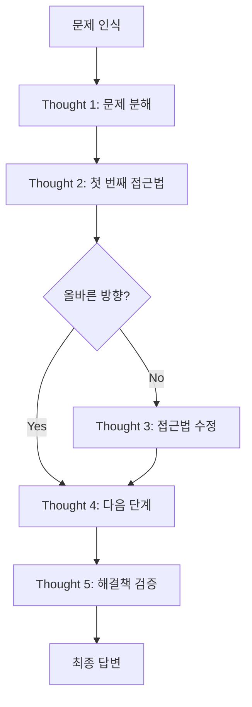

# Sequential Thinking MCP: AI의 구조화된 사고 프로세스

> **작성일**: 2025-10-26
> **태그**: MCP, Claude Desktop, AI Reasoning, Sequential Thinking, Problem Solving
> **난이도**: 초급~중급

## 들어가며

[**imprun.dev**](https://imprun.dev)는 Kubernetes 기반 서버리스 Cloud Function 플랫폼입니다. 복잡한 아키텍처 설계, 버그 디버깅, 성능 최적화 등 **다단계 사고가 필요한 문제**를 자주 마주합니다.

**우리가 마주한 문제**:
```typescript
// Claude에게 질문: "Application 모듈 성능을 개선하려면 어떻게 해야 하나요?"
// 답변: "다음과 같이 개선할 수 있습니다..."
// → 한 번에 여러 방법 제시
// → 각 방법의 트레이드오프 설명 부족
// → 단계별 검증 과정 없음
```

**전통적인 AI 답변의 한계**:
- ❌ **일직선 답변**: 한 번에 최종 답변 제시
- ❌ **수정 불가**: 중간에 잘못된 추론이 있어도 계속 진행
- ❌ **맥락 손실**: 복잡한 문제에서 초기 조건 망각
- ❌ **대안 미탐색**: 하나의 해결책만 제시

**Sequential Thinking MCP 도입 후**:
- ✅ **단계별 사고**: 문제를 작은 단계로 분해
- ✅ **반복적 개선**: 잘못된 추론 발견 시 되돌아가서 수정
- ✅ **다중 경로 탐색**: 여러 접근법 비교 검토
- ✅ **맥락 유지**: 각 단계의 결론을 다음 단계에 전달

이 글은 **Anthropic 공식 Sequential Thinking MCP**를 설치하고, **실전에서 활용**하는 방법을 공유합니다.

---

## Part 1: Sequential Thinking MCP란?

### Sequential Thinking의 개념

**Sequential Thinking**은 복잡한 문제를 **순차적 단계로 분해**하여 해결하는 AI 사고 프레임워크입니다.



**핵심 특징**:

| 특징 | 설명 | 효과 |
|------|------|------|
| **Thought Sequence** | 각 사고 단계를 명시적으로 기록 | 추론 과정 투명화 |
| **Revision** | 잘못된 단계로 되돌아가 수정 | 오류 조기 발견 |
| **Branching** | 여러 접근법을 동시 탐색 | 최적 해결책 선택 |
| **Context Retention** | 이전 단계 결론 유지 | 맥락 손실 방지 |

### 전통적 답변 vs Sequential Thinking

**예시: "MongoDB ReplicaSet의 Replication Lag를 줄이려면?"**

```typescript
// 전통적 답변 (일직선)
Claude: "다음 3가지 방법이 있습니다:
1. Secondary 리소스 증설
2. Oplog 크기 증가
3. 무거운 쿼리 최적화

각각의 장단점은..."

// Sequential Thinking (단계별 사고)
Claude:
[Thought 1] 먼저 Replication Lag의 근본 원인을 파악해야 합니다.
- 네트워크 대역폭 부족?
- Secondary CPU/Disk I/O 부족?
- Oplog 크기 부족?

[Thought 2] imprun.dev 환경을 고려하면:
- 네트워크: Kubernetes 내부 통신 (10Gbps)
- Secondary 리소스: CPU 200m, 메모리 512Mi
→ 리소스 부족이 원인일 가능성 높음

[Thought 3] 그런데 잠깐, 실제 사용률을 확인해야 합니다.
→ 접근법 수정: 먼저 모니터링 메트릭 확인 필요

[Thought 4] 메트릭 확인 후:
- Secondary CPU: 85% 사용 중
- 무거운 집계 쿼리가 Secondary에서 실행 중
→ 근본 원인: 집계 쿼리

[Thought 5] 최종 해결책:
1. 무거운 집계는 별도 Analytics DB로 이동 (즉시 적용)
2. Secondary 리소스 증설 (장기 계획)
→ 1번이 비용 대비 효과 높음
```

**차이점**:
- ✅ 문제의 근본 원인부터 파악
- ✅ 환경 컨텍스트 고려
- ✅ 중간에 접근법 수정
- ✅ 우선순위와 트레이드오프 명시

---

## Part 2: 설치 및 트러블슈팅

### 기본 설치 방법

```bash
# Sequential Thinking MCP 추가
$ claude mcp add sequential-thinking -- npx -y @modelcontextprotocol/server-sequential-thinking

✅ MCP server 'sequential-thinking' added successfully
📝 Configuration saved to ~/.claude.json
```

**생성된 설정** (`~/.claude.json`):

```json
{
  "mcpServers": {
    "sequential-thinking": {
      "type": "stdio",
      "command": "npx",
      "args": [
        "-y",
        "@modelcontextprotocol/server-sequential-thinking"
      ]
    }
  }
}
```

### 문제 1: MCP 서버 연결 실패

```bash
# Claude Desktop에서 확인
설정 → Developer → MCP Servers
❌ sequential-thinking (failed)
```

**또는 `/mcp` 명령어로 확인**:

```
/mcp

MCP Servers:
- serena: connected ✅
- sequential-thinking: failed ❌
```

**원인**: `npx -y`는 매번 패키지를 다운로드하려고 시도하는데, 네트워크 지연이나 npm 레지스트리 이슈로 실패할 수 있음

### 해결 방법: 전역 설치 후 재등록

```bash
# 1. 패키지 전역 설치
$ npm install -g @modelcontextprotocol/server-sequential-thinking

added 45 packages in 3s
✅ Installed globally

# 2. 설치 확인
$ which sequential-thinking
# Windows: where sequential-thinking
C:\Users\<username>\AppData\Roaming\npm\sequential-thinking.cmd

# 3. MCP 서버 재등록 (전역 설치 경로 사용)
$ claude mcp remove sequential-thinking
$ claude mcp add sequential-thinking -- sequential-thinking

✅ MCP server 'sequential-thinking' updated successfully
```

**수정된 설정** (`~/.claude.json`):

```json
{
  "mcpServers": {
    "sequential-thinking": {
      "type": "stdio",
      "command": "sequential-thinking",
      "args": []
    }
  }
}
```

**Claude Desktop 재시작 후 확인**:

```
/mcp

MCP Servers:
- serena: connected ✅
- sequential-thinking: connected ✅
```

### 문제 2: Windows 환경에서 경로 오류

```bash
# 에러 메시지
Error: Cannot find module 'sequential-thinking'
```

**해결책**: Node.js 경로 확인

```bash
# Node.js 전역 모듈 경로 확인
$ npm config get prefix
C:\Users\<username>\AppData\Roaming\npm

# PATH에 추가되어 있는지 확인
$ echo $PATH | grep npm
# Windows: echo %PATH% | findstr npm

# 없다면 시스템 환경 변수에 추가:
# C:\Users\<username>\AppData\Roaming\npm
```

---

## Part 3: 실전 활용

### 사용 방법

Sequential Thinking MCP는 **도구로 명시적으로 호출**할 수도 있지만, **자동으로 활성화**되도록 Claude가 판단할 수도 있습니다.

**명시적 요청**:
```
"Sequential Thinking을 사용해서 이 문제를 분석해줘"
```

**또는 복잡한 문제 제시 시 자동 활성화**:
```
"MongoDB ReplicaSet에서 Replication Lag가 발생하는 근본 원인을 찾고,
단계별로 해결 방법을 제시해줘. 각 단계마다 트레이드오프도 설명해줘."
```

### 활용 사례 1: 아키텍처 설계

**질문**: "imprun.dev의 Function 실행 성능을 10배 개선하려면?"

**Sequential Thinking 응답**:

```
[Thought 1/8] 현재 아키텍처 이해
- Function 실행 시 Kubernetes Pod 동적 생성
- 평균 Cold Start 시간: 3초
- 목표: 10배 개선 → 300ms

[Thought 2/8] 병목 지점 식별
- Pod 생성: 2초
- 컨테이너 이미지 풀: 0.8초
- Function 초기화: 0.2초
→ 주 병목: Pod 생성 + 이미지 풀

[Thought 3/8] 접근법 1: Pod Warm Pool
- Pre-warmed Pod 미리 생성
- 장점: Cold Start 제거
- 단점: 리소스 낭비

[Thought 4/8] 잠깐, 비용 고려 필요
- Warm Pool 크기 = 활성 사용자 수 × 평균 Function 수
- imprun.dev: 100 users × 5 functions = 500 Pods
- 비용: 월 $2000+
→ 접근법 재검토 필요

[Thought 5/8] 접근법 2: Serverless Framework (Knative)
- 자동 스케일링 + 빠른 Cold Start
- Scale-to-zero 지원
- 장점: 비용 효율 + 성능 개선
- 단점: Knative 학습 곡선

[Thought 6/8] 접근법 3: Function 레벨 최적화
- 컨테이너 이미지 크기 축소 (500MB → 50MB)
- 이미지 레이어 캐싱
- 예상 개선: 3초 → 1초 (3배 개선)
→ 목표(10배)에는 미달

[Thought 7/8] 하이브리드 접근법 (최종안)
1. 단기: 이미지 최적화 + 레이어 캐싱 (3배 개선)
2. 중기: Knative 도입 (10배 개선)
3. 장기: WebAssembly 런타임 검토 (100배 개선)

[Thought 8/8] 구현 우선순위
- Week 1-2: 이미지 최적화 (즉시 효과)
- Week 3-6: Knative PoC
- Week 7+: Knative 프로덕션 전환
```

**효과**:
- ✅ 여러 접근법 비교 (3가지)
- ✅ 비용 고려하여 접근법 수정
- ✅ 하이브리드 해결책 도출
- ✅ 단계별 구현 로드맵 제시

### 활용 사례 2: 버그 디버깅

**질문**: "JWT 토큰 검증이 간헐적으로 실패하는데, 원인을 찾아줘"

**Sequential Thinking 응답**:

```
[Thought 1/6] 증상 정리
- 간헐적 실패 → 환경/타이밍 이슈 가능성
- 에러 메시지: "invalid signature"

[Thought 2/6] 가설 1: 시크릿 키 불일치
- 환경변수 JWT_SECRET이 다른 값?
- 검증: kubectl get secret 확인 필요

[Thought 3/6] 가설 2: 시간 동기화 이슈
- exp (만료 시간) 검증 실패?
- 서버 시간이 다를 수 있음
→ 이게 더 가능성 높음 (간헐적 실패와 일치)

[Thought 4/6] 검증 방법
1. Pod별 시간 확인: kubectl exec <pod> -- date
2. 토큰 디코딩하여 exp 확인
3. 클라이언트 시간 vs 서버 시간 비교

[Thought 5/6] 근본 원인 추정
- Kubernetes Node 시간 동기화 문제
- 일부 Node의 시계가 1분 느림
- JWT exp가 1분 차이로 실패

[Thought 6/6] 해결책
- 단기: JWT exp 여유 시간 증가 (5분 → 10분)
- 장기: Node NTP 동기화 설정
```

**효과**:
- ✅ 증상 → 가설 → 검증 순서
- ✅ 여러 가설 검토 후 가장 가능성 높은 것 선택
- ✅ 검증 방법 구체적 제시
- ✅ 단기/장기 해결책 분리

### 활용 사례 3: 코드 리팩토링

**질문**: "ApplicationService의 createApplication 메서드가 너무 길어(200줄), 리팩토링 전략을 제시해줘"

**Sequential Thinking 응답**:

```
[Thought 1/5] 현재 메서드 분석
- 200줄 = 여러 책임이 섞여있을 가능성
- SRP (Single Responsibility Principle) 위반

[Thought 2/5] 책임 분리 식별
1. 입력 검증 (20줄)
2. Application 생성 (30줄)
3. 초기 Function 생성 (40줄)
4. 앱별 DB 초기화 (50줄)
5. Kubernetes 리소스 생성 (40줄)
6. 트랜잭션 관리 (20줄)

[Thought 3/5] 리팩토링 전략
- 각 책임을 별도 private 메서드로 추출
- 트랜잭션 관리는 public 메서드에 유지

[Thought 4/5] 개선안
```typescript
async createApplication(dto: CreateApplicationDto) {
  return this.runInTransaction(async (session) => {
    const app = await this.createAppDocument(dto, session);
    await this.createInitialFunction(app, session);
    await this.initializeAppDatabase(app, session);
    await this.createKubernetesResources(app, session);
    return app;
  });
}
```

[Thought 5/5] 추가 고려사항
- 각 private 메서드는 30줄 이하로 제한
- 테스트 용이성 향상 (각 메서드 독립 테스트)
```

---

## 결론 및 권장사항

### 핵심 요약

1. **Sequential Thinking은 복잡한 문제 해결에 필수**
   - ✅ 단계별 사고로 투명한 추론 과정
   - ✅ 잘못된 방향 발견 시 수정 가능
   - ✅ 여러 접근법 비교 검토

2. **설치는 간단하지만 트러블슈팅 필요할 수 있음**
   - ✅ 기본: `npx -y` 사용
   - ✅ 실패 시: 전역 설치 후 재등록
   - ✅ 10분 설정으로 영구적 효과

3. **imprun.dev에서 검증된 효과**
   - ✅ 아키텍처 설계: 여러 접근법 비교
   - ✅ 버그 디버깅: 체계적 원인 분석
   - ✅ 코드 리팩토링: 단계적 개선 전략

### 언제 사용하는가?

| 상황 | Sequential Thinking 사용 | 일반 답변 |
|------|------------------------|----------|
| **복잡한 아키텍처 설계** | ⭐⭐⭐⭐⭐ | ⭐⭐ |
| **디버깅 (원인 불명)** | ⭐⭐⭐⭐⭐ | ⭐⭐ |
| **트레이드오프 분석** | ⭐⭐⭐⭐⭐ | ⭐⭐⭐ |
| **단계별 계획 수립** | ⭐⭐⭐⭐⭐ | ⭐⭐⭐ |
| **간단한 코드 작성** | ⭐ | ⭐⭐⭐⭐⭐ |
| **사실 확인 질문** | ⭐ | ⭐⭐⭐⭐⭐ |

### 효과적인 프롬프트

**❌ 비효율적**:
```
"MongoDB 성능을 개선해줘"
```

**✅ 효율적**:
```
"MongoDB ReplicaSet의 Replication Lag가 60초인데,
Sequential Thinking을 사용해서:
1. 근본 원인을 단계별로 분석하고
2. 여러 해결 방법을 비교 검토한 후
3. 우선순위와 트레이드오프를 고려한 최종 해결책을 제시해줘"
```

### 설치 가이드라인

```bash
# Phase 1: 기본 설치 시도
$ claude mcp add sequential-thinking -- npx -y @modelcontextprotocol/server-sequential-thinking
$ # Claude Desktop 재시작
$ # /mcp 명령으로 상태 확인

# Phase 2: 실패 시 전역 설치
$ npm install -g @modelcontextprotocol/server-sequential-thinking
$ claude mcp remove sequential-thinking
$ claude mcp add sequential-thinking -- sequential-thinking
$ # Claude Desktop 재시작
$ # /mcp 명령으로 connected ✅ 확인

# Phase 3: 실전 테스트
# "Sequential Thinking을 사용해서 [복잡한 문제] 분석해줘"
```

### 마지막 조언

```
"복잡한 문제는 단계별 사고로 정복하세요."

Sequential Thinking MCP는:
  - 일직선 답변 → 단계별 사고
  - 오류 간과 → 중간 수정 가능
  - 단일 해결책 → 다중 접근법 비교

특히 아키텍처 설계, 디버깅, 트레이드오프 분석에 강력합니다.
```

---

## 참고 자료

### 공식 문서

- [Sequential Thinking MCP GitHub](https://github.com/modelcontextprotocol/servers/tree/main/src/sequentialthinking)
- [Model Context Protocol (MCP) Specification](https://modelcontextprotocol.io)
- [Anthropic MCP Servers](https://github.com/modelcontextprotocol/servers)

### 관련 블로그

- [Serena MCP: 시맨틱 코드 분석 도구](./serena-mcp-semantic-code-analysis-guide.md)
- [MongoDB ReplicaSet 완벽 가이드](./mongodb-replicaset-readPreference-sharding-guide.md)
- [nginx-unprivileged로 보안 강화하기](./nginx-unprivileged-pod-security-standards.md)

### imprun.dev 관련

- **Backend**: NestJS + MongoDB
- **Frontend**: Next.js 15 + React 19
- **Infrastructure**: Kubernetes + Helm
- **개발 도구**: Sequential Thinking MCP + Serena MCP + Claude Desktop

---

**작성자**: imprun.dev Team
**라이선스**: MIT
**업데이트**: 2025-10-26
