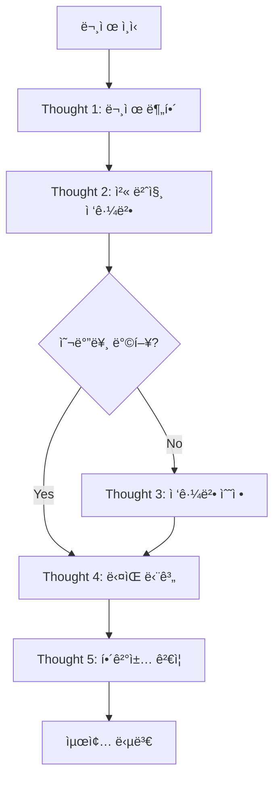

# Sequential Thinking MCP: AIì˜ êµ¬ì¡°í™”ëœ ì‚¬ê³  프로세스

> **ì‘성ì¼**: 2025-10-26
> **태그**: MCP, Claude Desktop, AI Reasoning, Sequential Thinking, Problem Solving
> **ë‚œì´ë„**: 초급~중급

## 들어가며

[**imprun.dev**](https://imprun.dev)는 Kubernetes 기반 서버리스 Cloud Function 플ë«í¼ì…니다. ë³µì¡í•œ 아키í…처 설계, 버그 디버깅, 성능 최ì í™” 등 **다단계 사고가 필요한 문제**를 ì주 마주합니다.

**우리가 마주한 문제**:
```typescript
// Claudeì—게 질문: "Application 모듈 ì„±ëŠ¥ì„ ê°œì„ í•˜ë ¤ë©´ 어떻게 해야 하나요?"
// 답변: "다ìŒê³¼ ê°™ì´ ê°œì„ í•  수 ìˆìŠµë‹ˆë‹¤..."
// → í•œ ë²ˆì— ì—¬ëŸ¬ 방법 제시
// → ê° ë°©ë²•ì˜ íŠ¸ë ˆì´ë“œì˜¤í”„ 설명 부족
// → 단계별 ê²€ì¦ ê³¼ì • ì—†ìŒ
```

**전통ì ì¸ AI ë‹µë³€ì˜ í•œê³„**:
- ⌠**ì¼ì§ì„  답변**: í•œ ë²ˆì— ìµœì¢… 답변 제시
- ⌠**수정 불가**: ì¤‘ê°„ì— ì˜ëª»ëœ ì¶”ë¡ ì´ ìˆì–´ë„ ê³„ì† ì§„í–‰
- ⌠**ë§¥ë½ ì†ì‹¤**: ë³µì¡í•œ 문제ì—ì„œ 초기 ì¡°ê±´ ë§ê°
- ⌠**대안 미íƒìƒ‰**: í•˜ë‚˜ì˜ í•´ê²°ì±…ë§Œ 제시

**Sequential Thinking MCP ë„ì… í›„**:
- ✅ **단계별 사고**: 문제를 ì‘ì€ ë‹¨ê³„ë¡œ 분해
- ✅ **ë°˜ë³µì  ê°œì„ **: ì˜ëª»ëœ 추론 발견 ì‹œ ë˜ëŒì•„가서 수정
- ✅ **다중 경로 íƒìƒ‰**: 여러 접근법 ë¹„êµ ê²€í† 
- ✅ **ë§¥ë½ ìœ ì§€**: ê° ë‹¨ê³„ì˜ ê²°ë¡ ì„ ë‹¤ìŒ ë‹¨ê³„ì— ì „ë‹¬

ì´ ê¸€ì€ **Anthropic ê³µì‹ Sequential Thinking MCP**를 설치하고, **실전ì—ì„œ 활용**하는 ë°©ë²•ì„ ê³µìœ í•©ë‹ˆë‹¤.

---

## Part 1: Sequential Thinking MCP�

### Sequential Thinkingì˜ ê°œë…

**Sequential Thinking**ì€ ë³µì¡í•œ 문제를 **ìˆœì°¨ì  ë‹¨ê³„ë¡œ 분해**하여 해결하는 AI 사고 프레ì„워í¬ì…니다.



**핵심 특징**:

| 특징 | 설명 | 효과 |
|------|------|------|
| **Thought Sequence** | ê° ì‚¬ê³  단계를 명시ì ìœ¼ë¡œ ê¸°ë¡ | 추론 과정 투명화 |
| **Revision** | ì˜ëª»ëœ 단계로 ë˜ëŒì•„ê°€ 수정 | 오류 조기 발견 |
| **Branching** | 여러 ì ‘ê·¼ë²•ì„ ë™ì‹œ íƒìƒ‰ | ìµœì  í•´ê²°ì±… ì„ íƒ |
| **Context Retention** | ì´ì „ 단계 ê²°ë¡  유지 | ë§¥ë½ ì†ì‹¤ 방지 |

### ì „í†µì  ë‹µë³€ vs Sequential Thinking

**예시: "MongoDB ReplicaSetì˜ Replication Lag를 줄ì´ë ¤ë©´?"**

```typescript
// ì „í†µì  ë‹µë³€ (ì¼ì§ì„ )
Claude: "ë‹¤ìŒ 3가지 ë°©ë²•ì´ ìˆìŠµë‹ˆë‹¤:
1. Secondary 리소스 ì¦ì„¤
2. Oplog í¬ê¸° ì¦ê°€
3. 무거운 쿼리 최ì í™”

ê°ê°ì˜ ì¥ë‹¨ì ì€..."

// Sequential Thinking (단계별 사고)
Claude:
[Thought 1] 먼저 Replication Lagì˜ ê·¼ë³¸ ì›ì¸ì„ 파악해야 합니다.
- ë„¤íŠ¸ì›Œí¬ ëŒ€ì—­í­ ë¶€ì¡±?
- Secondary CPU/Disk I/O 부족?
- Oplog í¬ê¸° 부족?

[Thought 2] imprun.dev í™˜ê²½ì„ ê³ ë ¤í•˜ë©´:
- 네트워í¬: Kubernetes 내부 통신 (10Gbps)
- Secondary 리소스: CPU 200m, 메모리 512Mi
→ 리소스 ë¶€ì¡±ì´ ì›ì¸ì¼ 가능성 높ìŒ

[Thought 3] ê·¸ëŸ°ë° ì ê¹, 실제 ì‚¬ìš©ë¥ ì„ í™•ì¸í•´ì•¼ 합니다.
→ 접근법 수정: 먼저 ëª¨ë‹ˆí„°ë§ ë©”íŠ¸ë¦­ í™•ì¸ í•„ìš”

[Thought 4] 메트릭 í™•ì¸ í›„:
- Secondary CPU: 85% 사용 중
- 무거운 집계 쿼리가 Secondaryì—ì„œ 실행 중
→ 근본 ì›ì¸: 집계 쿼리

[Thought 5] 최종 해결책:
1. 무거운 집계는 ë³„ë„ Analytics DBë¡œ ì´ë™ (즉시 ì ìš©)
2. Secondary 리소스 ì¦ì„¤ (ì¥ê¸° 계íš)
→ 1ë²ˆì´ ë¹„ìš© 대비 효과 높ìŒ
```

**ì°¨ì´ì **:
- ✅ ë¬¸ì œì˜ ê·¼ë³¸ ì›ì¸ë¶€í„° 파악
- ✅ 환경 컨í…스트 ê³ ë ¤
- ✅ ì¤‘ê°„ì— ì ‘ê·¼ë²• 수정
- ✅ 우선순위와 트레ì´ë“œì˜¤í”„ 명시

---

## Part 2: 설치 ë° íŠ¸ëŸ¬ë¸”ìŠˆíŒ…

### 기본 설치 방법

```bash
# Sequential Thinking MCP 추가
$ claude mcp add sequential-thinking -- npx -y @modelcontextprotocol/server-sequential-thinking

✅ MCP server 'sequential-thinking' added successfully
📠Configuration saved to ~/.claude.json
```

**ìƒì„±ëœ 설정** (`~/.claude.json`):

```json
{
  "mcpServers": {
    "sequential-thinking": {
      "type": "stdio",
      "command": "npx",
      "args": [
        "-y",
        "@modelcontextprotocol/server-sequential-thinking"
      ]
    }
  }
}
```

### 문제 1: MCP 서버 연결 실패

```bash
# Claude Desktopì—ì„œ 확ì¸
설정 → Developer → MCP Servers
⌠sequential-thinking (failed)
```

**ë˜ëŠ” `/mcp` 명령어로 확ì¸**:

```
/mcp

MCP Servers:
- serena: connected ✅
- sequential-thinking: failed âŒ
```

**ì›ì¸**: `npx -y`는 매번 패키지를 다운로드하려고 ì‹œë„하는ë°, ë„¤íŠ¸ì›Œí¬ ì§€ì—°ì´ë‚˜ npm 레지스트리 ì´ìŠˆë¡œ 실패할 수 ìˆìŒ

### í•´ê²° 방법: ì „ì—­ 설치 후 ì¬ë“±ë¡

```bash
# 1. 패키지 전역 설치
$ npm install -g @modelcontextprotocol/server-sequential-thinking

added 45 packages in 3s
✅ Installed globally

# 2. 설치 확ì¸
$ which sequential-thinking
# Windows: where sequential-thinking
C:\Users\<username>\AppData\Roaming\npm\sequential-thinking.cmd

# 3. MCP 서버 ì¬ë“±ë¡ (ì „ì—­ 설치 경로 사용)
$ claude mcp remove sequential-thinking
$ claude mcp add sequential-thinking -- sequential-thinking

✅ MCP server 'sequential-thinking' updated successfully
```

**ìˆ˜ì •ëœ ì„¤ì •** (`~/.claude.json`):

```json
{
  "mcpServers": {
    "sequential-thinking": {
      "type": "stdio",
      "command": "sequential-thinking",
      "args": []
    }
  }
}
```

**Claude Desktop ì¬ì‹œì‘ 후 확ì¸**:

```
/mcp

MCP Servers:
- serena: connected ✅
- sequential-thinking: connected ✅
```

### 문제 2: Windows 환경ì—ì„œ 경로 오류

```bash
# ì—러 메시지
Error: Cannot find module 'sequential-thinking'
```

**í•´ê²°ì±…**: Node.js 경로 확ì¸

```bash
# Node.js ì „ì—­ 모듈 경로 확ì¸
$ npm config get prefix
C:\Users\<username>\AppData\Roaming\npm

# PATHì— ì¶”ê°€ë˜ì–´ ìˆëŠ”지 확ì¸
$ echo $PATH | grep npm
# Windows: echo %PATH% | findstr npm

# 없다면 시스템 환경 ë³€ìˆ˜ì— ì¶”ê°€:
# C:\Users\<username>\AppData\Roaming\npm
```

---

## Part 3: 실전 활용

### 사용 방법

Sequential Thinking MCP는 **ë„구로 명시ì ìœ¼ë¡œ 호출**í•  ìˆ˜ë„ ìˆì§€ë§Œ, **ìë™ìœ¼ë¡œ 활성화**ë˜ë„ë¡ Claudeê°€ íŒë‹¨í•  ìˆ˜ë„ ìˆìŠµë‹ˆë‹¤.

**ëª…ì‹œì  ìš”ì²­**:
```
"Sequential Thinkingì„ ì‚¬ìš©í•´ì„œ ì´ ë¬¸ì œë¥¼ 분ì„해줘"
```

**ë˜ëŠ” ë³µì¡í•œ 문제 제시 ì‹œ ìë™ í™œì„±í™”**:
```
"MongoDB ReplicaSetì—ì„œ Replication Lagê°€ ë°œìƒí•˜ëŠ” 근본 ì›ì¸ì„ 찾고,
단계별로 í•´ê²° ë°©ë²•ì„ ì œì‹œí•´ì¤˜. ê° ë‹¨ê³„ë§ˆë‹¤ 트레ì´ë“œì˜¤í”„ë„ ì„¤ëª…í•´ì¤˜."
```

### 활용 사례 1: 아키í…처 설계

**질문**: "imprun.devì˜ Function 실행 ì„±ëŠ¥ì„ 10ë°° 개선하려면?"

**Sequential Thinking ì‘답**:

```
[Thought 1/8] í˜„ì¬ ì•„í‚¤í…처 ì´í•´
- Function 실행 ì‹œ Kubernetes Pod ë™ì  ìƒì„±
- í‰ê·  Cold Start 시간: 3ì´ˆ
- 목표: 10배 개선 → 300ms

[Thought 2/8] 병목 ì§€ì  ì‹ë³„
- Pod ìƒì„±: 2ì´ˆ
- 컨테ì´ë„ˆ ì´ë¯¸ì§€ í’€: 0.8ì´ˆ
- Function 초기화: 0.2초
→ 주 병목: Pod ìƒì„± + ì´ë¯¸ì§€ í’€

[Thought 3/8] 접근법 1: Pod Warm Pool
- Pre-warmed Pod 미리 ìƒì„±
- ì¥ì : Cold Start 제거
- 단ì : 리소스 낭비

[Thought 4/8] ì ê¹, 비용 ê³ ë ¤ í•„ìš”
- Warm Pool í¬ê¸° = 활성 사용ì 수 × í‰ê·  Function 수
- imprun.dev: 100 users × 5 functions = 500 Pods
- 비용: 월 $2000+
→ 접근법 ì¬ê²€í†  í•„ìš”

[Thought 5/8] 접근법 2: Serverless Framework (Knative)
- ìë™ ìŠ¤ì¼€ì¼ë§ + 빠른 Cold Start
- Scale-to-zero 지ì›
- ì¥ì : 비용 효율 + 성능 개선
- 단ì : Knative 학습 곡선

[Thought 6/8] 접근법 3: Function 레벨 최ì í™”
- 컨테ì´ë„ˆ ì´ë¯¸ì§€ í¬ê¸° 축소 (500MB → 50MB)
- ì´ë¯¸ì§€ ë ˆì´ì–´ ìºì‹±
- ì˜ˆìƒ ê°œì„ : 3ì´ˆ → 1ì´ˆ (3ë°° 개선)
→ 목표(10ë°°)ì—는 미달

[Thought 7/8] 하ì´ë¸Œë¦¬ë“œ 접근법 (최종안)
1. 단기: ì´ë¯¸ì§€ 최ì í™” + ë ˆì´ì–´ ìºì‹± (3ë°° 개선)
2. 중기: Knative ë„ì… (10ë°° 개선)
3. ì¥ê¸°: WebAssembly ëŸ°íƒ€ì„ ê²€í†  (100ë°° 개선)

[Thought 8/8] 구현 우선순위
- Week 1-2: ì´ë¯¸ì§€ 최ì í™” (즉시 효과)
- Week 3-6: Knative PoC
- Week 7+: Knative 프로ë•ì…˜ 전환
```

**효과**:
- ✅ 여러 접근법 ë¹„êµ (3가지)
- ✅ 비용 고려하여 접근법 수정
- ✅ 하ì´ë¸Œë¦¬ë“œ í•´ê²°ì±… ë„출
- ✅ 단계별 구현 로드맵 제시

### 활용 사례 2: 버그 디버깅

**질문**: "JWT í† í° ê²€ì¦ì´ ê°„í—ì ìœ¼ë¡œ 실패하는ë°, ì›ì¸ì„ 찾아줘"

**Sequential Thinking ì‘답**:

```
[Thought 1/6] ì¦ìƒ 정리
- ê°„í—ì  ì‹¤íŒ¨ → 환경/타ì´ë° ì´ìŠˆ 가능성
- ì—러 메시지: "invalid signature"

[Thought 2/6] 가설 1: ì‹œí¬ë¦¿ 키 불ì¼ì¹˜
- 환경변수 JWT_SECRETì´ ë‹¤ë¥¸ ê°’?
- ê²€ì¦: kubectl get secret í™•ì¸ í•„ìš”

[Thought 3/6] 가설 2: 시간 ë™ê¸°í™” ì´ìŠˆ
- exp (만료 시간) ê²€ì¦ ì‹¤íŒ¨?
- 서버 ì‹œê°„ì´ ë‹¤ë¥¼ 수 ìˆìŒ
→ ì´ê²Œ ë” ê°€ëŠ¥ì„± ë†’ìŒ (ê°„í—ì  ì‹¤íŒ¨ì™€ ì¼ì¹˜)

[Thought 4/6] ê²€ì¦ ë°©ë²•
1. Pod별 시간 확ì¸: kubectl exec <pod> -- date
2. í† í° ë””ì½”ë”©í•˜ì—¬ exp 확ì¸
3. í´ë¼ì´ì–¸íŠ¸ 시간 vs 서버 시간 비êµ

[Thought 5/6] 근본 ì›ì¸ 추정
- Kubernetes Node 시간 ë™ê¸°í™” 문제
- ì¼ë¶€ Nodeì˜ ì‹œê³„ê°€ 1분 ëŠë¦¼
- JWT expê°€ 1분 ì°¨ì´ë¡œ 실패

[Thought 6/6] í•´ê²°ì±…
- 단기: JWT exp 여유 시간 ì¦ê°€ (5분 → 10분)
- ì¥ê¸°: Node NTP ë™ê¸°í™” 설정
```

**효과**:
- ✅ ì¦ìƒ → 가설 → ê²€ì¦ ìˆœì„œ
- ✅ 여러 가설 검토 후 ê°€ì¥ ê°€ëŠ¥ì„± ë†’ì€ ê²ƒ ì„ íƒ
- ✅ ê²€ì¦ ë°©ë²• êµ¬ì²´ì  ì œì‹œ
- ✅ 단기/ì¥ê¸° í•´ê²°ì±… 분리

### 활용 사례 3: 코드 리팩토ë§

**질문**: "ApplicationServiceì˜ createApplication 메서드가 너무 길어(200줄), ë¦¬íŒ©í† ë§ ì „ëµì„ 제시해줘"

**Sequential Thinking ì‘답**:

```
[Thought 1/5] í˜„ì¬ ë©”ì„œë“œ 분ì„
- 200줄 = 여러 ì±…ì„ì´ ì„ì—¬ìˆì„ 가능성
- SRP (Single Responsibility Principle) 위반

[Thought 2/5] ì±…ì„ ë¶„ë¦¬ ì‹ë³„
1. ì…ë ¥ ê²€ì¦ (20줄)
2. Application ìƒì„± (30줄)
3. 초기 Function ìƒì„± (40줄)
4. 앱별 DB 초기화 (50줄)
5. Kubernetes 리소스 ìƒì„± (40줄)
6. 트ëœì­ì…˜ 관리 (20줄)

[Thought 3/5] ë¦¬íŒ©í† ë§ ì „ëµ
- ê° ì±…ì„ì„ ë³„ë„ private 메서드로 추출
- 트ëœì­ì…˜ 관리는 public ë©”ì„œë“œì— ìœ ì§€

[Thought 4/5] 개선안
```typescript
async createApplication(dto: CreateApplicationDto) {
  return this.runInTransaction(async (session) => {
    const app = await this.createAppDocument(dto, session);
    await this.createInitialFunction(app, session);
    await this.initializeAppDatabase(app, session);
    await this.createKubernetesResources(app, session);
    return app;
  });
}
```

[Thought 5/5] 추가 고려사항
- ê° private 메서드는 30줄 ì´í•˜ë¡œ 제한
- 테스트 ìš©ì´ì„± í–¥ìƒ (ê° ë©”ì„œë“œ ë…립 테스트)
```

---

## ê²°ë¡  ë° ê¶Œì¥ì‚¬í•­

### 핵심 요약

1. **Sequential Thinkingì€ ë³µì¡í•œ 문제 í•´ê²°ì— í•„ìˆ˜**
   - ✅ 단계별 사고로 투명한 추론 과정
   - ✅ ì˜ëª»ëœ ë°©í–¥ 발견 ì‹œ 수정 가능
   - ✅ 여러 접근법 ë¹„êµ ê²€í† 

2. **설치는 간단하지만 트러블슈팅 필요할 수 ìˆìŒ**
   - ✅ 기본: `npx -y` 사용
   - ✅ 실패 ì‹œ: ì „ì—­ 설치 후 ì¬ë“±ë¡
   - ✅ 10분 설정으로 ì˜êµ¬ì  효과

3. **imprun.devì—ì„œ ê²€ì¦ëœ 효과**
   - ✅ 아키í…처 설계: 여러 접근법 비êµ
   - ✅ 버그 디버깅: ì²´ê³„ì  ì›ì¸ 분ì„
   - ✅ 코드 리팩토ë§: ë‹¨ê³„ì  ê°œì„  ì „ëµ

### 언제 사용하는가?

| ìƒí™© | Sequential Thinking 사용 | ì¼ë°˜ 답변 |
|------|------------------------|----------|
| **ë³µì¡í•œ 아키í…처 설계** | â­â­â­â­â­ | â­â­ |
| **디버깅 (ì›ì¸ 불명)** | â­â­â­â­â­ | â­â­ |
| **트레ì´ë“œì˜¤í”„ 분ì„** | â­â­â­â­â­ | â­â­â­ |
| **단계별 ê³„íš ìˆ˜ë¦½** | â­â­â­â­â­ | â­â­â­ |
| **간단한 코드 ì‘성** | â­ | â­â­â­â­â­ |
| **사실 í™•ì¸ ì§ˆë¬¸** | â­ | â­â­â­â­â­ |

### 효과ì ì¸ 프롬프트

**⌠비효율ì **:
```
"MongoDB ì„±ëŠ¥ì„ ê°œì„ í•´ì¤˜"
```

**✅ 효율ì **:
```
"MongoDB ReplicaSetì˜ Replication Lagê°€ 60ì´ˆì¸ë°,
Sequential Thinkingì„ ì‚¬ìš©í•´ì„œ:
1. 근본 ì›ì¸ì„ 단계별로 분ì„하고
2. 여러 í•´ê²° ë°©ë²•ì„ ë¹„êµ ê²€í† í•œ 후
3. 우선순위와 트레ì´ë“œì˜¤í”„를 고려한 최종 í•´ê²°ì±…ì„ ì œì‹œí•´ì¤˜"
```

### 설치 ê°€ì´ë“œë¼ì¸

```bash
# Phase 1: 기본 설치 ì‹œë„
$ claude mcp add sequential-thinking -- npx -y @modelcontextprotocol/server-sequential-thinking
$ # Claude Desktop ì¬ì‹œì‘
$ # /mcp 명령으로 ìƒíƒœ 확ì¸

# Phase 2: 실패 시 전역 설치
$ npm install -g @modelcontextprotocol/server-sequential-thinking
$ claude mcp remove sequential-thinking
$ claude mcp add sequential-thinking -- sequential-thinking
$ # Claude Desktop ì¬ì‹œì‘
$ # /mcp 명령으로 connected ✅ 확ì¸

# Phase 3: 실전 테스트
# "Sequential Thinkingì„ ì‚¬ìš©í•´ì„œ [ë³µì¡í•œ 문제] 분ì„해줘"
```

### 마지막 조언

```
"ë³µì¡í•œ 문제는 단계별 사고로 정복하세요."

Sequential Thinking MCP는:
  - ì¼ì§ì„  답변 → 단계별 사고
  - 오류 간과 → 중간 수정 가능
  - ë‹¨ì¼ í•´ê²°ì±… → 다중 접근법 비êµ

íŠ¹íˆ ì•„í‚¤í…처 설계, 디버깅, 트레ì´ë“œì˜¤í”„ 분ì„ì— ê°•ë ¥í•©ë‹ˆë‹¤.
```

---

## 참고 ì료

### ê³µì‹ ë¬¸ì„œ

- [Sequential Thinking MCP GitHub](https://github.com/modelcontextprotocol/servers/tree/main/src/sequentialthinking)
- [Model Context Protocol (MCP) Specification](https://modelcontextprotocol.io)
- [Anthropic MCP Servers](https://github.com/modelcontextprotocol/servers)

### 관련 블로그

- [Serena MCP: 시맨틱 코드 ë¶„ì„ ë„구](./serena-mcp-semantic-code-analysis-guide.md)
- [MongoDB ReplicaSet 완벽 ê°€ì´ë“œ](./mongodb-replicaset-readPreference-sharding-guide.md)
- [nginx-unprivileged로 보안 강화하기](./nginx-unprivileged-pod-security-standards.md)

### imprun.dev 관련

- **Backend**: NestJS + MongoDB
- **Frontend**: Next.js 15 + React 19
- **Infrastructure**: Kubernetes + Helm
- **개발 ë„구**: Sequential Thinking MCP + Serena MCP + Claude Desktop

---

**ì‘성ì**: imprun.dev Team
**ë¼ì´ì„ ìŠ¤**: MIT
**ì—…ë°ì´íŠ¸**: 2025-10-26
