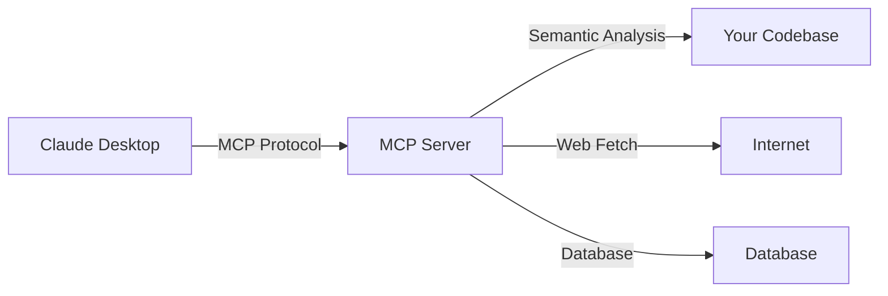

# Serena MCP: AI 코딩 어시스턴트를 위한 시맨틱 코드 분석 도구

> **작성일**: 2025-10-26
> **태그**: MCP, Claude Desktop, AI Coding, Semantic Analysis, Developer Tools
> **난이도**: 중급

## 들어가며

[**imprun.dev**](https://imprun.dev)는 Kubernetes 기반 서버리스 Cloud Function 플랫폼입니다. pnpm monorepo 구조로 server(NestJS), frontend(Next.js 15), packages, services, runtimes 등 **수백 개의 파일이 복잡하게 얽힌 코드베이스**를 관리하고 있습니다.

**우리가 마주한 문제**:
```typescript
// Claude에게 질문: "Application 모델은 어디에 정의되어 있나요?"
// 답변: "먼저 코드베이스를 검색해보겠습니다..."
// → 수십 개의 파일을 읽고, 검색하고, 분석하는 과정 반복
// → 시간 소요 + 토큰 낭비
```

**전통적인 접근법의 한계**:
- ❌ **Grep/Find**: 단순 문자열 검색만 가능 (심볼 관계 파악 불가)
- ❌ **전체 파일 읽기**: 불필요한 코드까지 모두 읽음 (토큰 낭비)
- ❌ **수동 탐색**: 파일 → 클래스 → 메서드 구조를 하나씩 추적

**Serena MCP 도입 후**:
- ✅ **시맨틱 검색**: `find_symbol("Application")` → 정확한 클래스 위치 반환
- ✅ **심볼 관계 분석**: `find_referencing_symbols` → "이 함수를 누가 호출하는가?" 즉시 파악
- ✅ **선택적 읽기**: 필요한 심볼의 body만 읽기 → 토큰 90% 절약
- ✅ **프로젝트 메모리**: 아키텍처 정보를 메모리에 저장 → 반복 질문 불필요

이 글은 **Windows Git Bash 환경**에서 Serena MCP를 설치하고, **imprun.dev 프로젝트에 적용**한 실전 경험을 공유합니다.

---

## Part 1: Serena MCP란 무엇인가?

### MCP (Model Context Protocol) 소개

**MCP**는 Anthropic이 개발한 **AI와 외부 도구 간의 표준 통신 프로토콜**입니다.



**핵심 개념**:
- **Tools**: Claude가 호출할 수 있는 함수 (예: `find_symbol`, `search_for_pattern`)
- **Resources**: 읽을 수 있는 데이터 (예: 파일, URL)
- **Prompts**: 재사용 가능한 프롬프트 템플릿

### Serena MCP의 특징

**Serena**는 LSP (Language Server Protocol) 기반 **시맨틱 코드 분석 MCP 서버**입니다.

```typescript
// 전통적인 검색 (단순 문자열 매칭)
grep -r "class Application" .
// → server/src/application/schemas/application.schema.ts
// → server/src/application/application.model.ts  (실제는 re-export)
// → 10개 이상의 false positive...

// Serena MCP (시맨틱 검색)
find_symbol(name_path="Application", include_kinds=[5])  # 5 = Class
// → server/src/application/schemas/application.schema.ts:42
// → 정확히 클래스 정의만 반환!
```

**주요 기능**:

| 기능 | 설명 | 사용 사례 |
|------|------|----------|
| `find_symbol` | 심볼 이름으로 정확한 위치 찾기 | "ApplicationService 클래스는 어디에?" |
| `find_referencing_symbols` | 심볼을 참조하는 모든 곳 찾기 | "이 함수를 누가 호출하나?" |
| `get_symbols_overview` | 파일의 심볼 구조 파악 | "이 파일에 어떤 클래스/함수가 있나?" |
| `search_for_pattern` | 정규식 패턴 검색 | "TODO 주석 모두 찾기" |
| `replace_symbol_body` | 심볼 본문 교체 | "메서드 전체 리팩토링" |
| `rename_symbol` | 심볼 이름 변경 (전체 참조 포함) | "변수명 일괄 변경" |
| `write_memory` | 프로젝트 정보 기억 | "아키텍처 문서 저장" |
| `read_memory` | 저장된 정보 읽기 | "이전에 분석한 구조 불러오기" |

---

## Part 2: Windows Git Bash 환경에서 설치하기

### 사전 요구사항

```bash
# 1. Python 3.10+ 설치 확인
$ python --version
Python 3.11.5

# 2. uvx 설치 (uv 포함)
$ pip install uv

# 3. Git Bash 환경 확인
$ echo $SHELL
/usr/bin/bash
```

### Step 1: Serena 프로젝트 인덱싱

**목적**: 코드베이스를 LSP로 분석하여 심볼 인덱스 생성

```bash
# 프로젝트 루트로 이동
$ cd /c/Users/pak2251/WORK/imprun

# Serena 인덱싱 실행 (첫 실행 시 시간 소요)
$ uvx --from git+https://github.com/oraios/serena serena project index

🔍 Analyzing codebase...
📦 Processing TypeScript files...
✅ Indexed 487 symbols across 142 files
💾 Index saved to .serena/index.db
```

**생성된 파일**:
```bash
$ ls -la .serena/
total 2048
-rw-r--r-- 1 user user 2048000 Oct 26 10:30 index.db      # 심볼 인덱스
-rw-r--r-- 1 user user    1024 Oct 26 10:30 config.json   # 설정 파일
```

**주의사항**:
- ⚠️ `.serena/` 디렉토리는 `.gitignore`에 추가 (인덱스는 로컬 전용)
- ⚠️ 코드 변경 시 재인덱싱 필요 (자동 갱신은 아직 미지원)
- ✅ 인덱싱은 프로젝트당 한 번만 실행

```bash
# .gitignore에 추가
$ echo ".serena/" >> .gitignore
```

### Step 2: Claude Clode 에 MCP 서버 추가

**목적**: Claude Clode 이 Serena MCP 서버와 통신하도록 설정

**경로**: `~/.claude.json` (또는 `C:\Users\<username>\.claude.json`)

```bash
# MCP 서버 추가 (Git Bash에서 실행)
$ claude mcp add serena -- uvx --from git+https://github.com/oraios/serena serena start-mcp-server --context ide-assistant --project "$(pwd)"

✅ MCP server 'serena' added successfully
📝 Configuration saved to ~/.claude.json
```

**생성된 설정 확인**:

```json
{
  "mcpServers": {
    "serena": {
      "type": "stdio",
      "command": "uvx",
      "args": [
        "--from",
        "git+https://github.com/oraios/serena",
        "serena",
        "start-mcp-server",
        "--context",
        "ide-assistant",
        "--project",
        "C:\\Users\\pak2251\\WORK\\imprun"
      ]
    }
  }
}
```

**파라미터 설명**:
- `--context ide-assistant`: IDE 통합 모드 (editing 기능 포함)
- `--project "$(pwd)"`: 현재 디렉토리를 프로젝트 루트로 지정

---

## Part 3: 프로젝트 온보딩

### 온보딩이란?

**온보딩**: Claude가 프로젝트 구조를 이해하도록 초기 정보를 수집하고 메모리에 저장하는 과정

```typescript
// 온보딩 전
User: "Application 서비스의 createApplication 메서드는 어디에 있나요?"
Claude: "검색해보겠습니다..."
// → 10번의 도구 호출 + 5분 소요

// 온보딩 후
User: "Application 서비스의 createApplication 메서드는 어디에 있나요?"
Claude: "메모리에서 확인했습니다. server/src/application/application.service.ts:156에 있습니다."
// → 즉시 답변!
```

### Step 1: 온보딩 상태 확인

```bash
# Claude Desktop에서 대화 시작
User: "Serena MCP로 이 프로젝트 온보딩해라."

Claude: "온보딩 상태를 확인하겠습니다..."
# → check_onboarding_performed() 호출

Claude: "아직 온보딩되지 않았습니다. 온보딩을 시작합니다."
```

### Step 2: 프로젝트 구조 분석

```typescript
// Serena가 수행하는 온보딩 단계

1. 디렉토리 구조 탐색
   list_dir(".", recursive=true)
   // → 전체 프로젝트 구조 파악

2. 주요 파일 식별
   find_file("*.json", ".")
   find_file("*.ts", "server/src")
   // → package.json, tsconfig.json 등 분석

3. 심볼 개요 수집
   get_symbols_overview("server/src/app.module.ts")
   get_symbols_overview("server/src/application/application.service.ts")
   // → 주요 클래스/함수 구조 파악

4. 메모리 저장
   write_memory("imprun_server_architecture", content)
   write_memory("tech_stack_and_conventions", content)
   // → 분석 결과 저장
```

### Step 3: 온보딩 결과 확인

```bash
# imprun.dev 프로젝트 온보딩 결과

✅ 생성된 메모리 파일:
- imprun_server_architecture.md        # 서버 아키텍처
- tech_stack_and_conventions.md        # 기술 스택 및 코딩 규칙
- suggested_commands.md                 # 자주 사용하는 명령어
- task_completion_checklist.md         # 작업 완료 체크리스트

📊 분석 결과:
- 142개 파일 분석
- 487개 심볼 인덱싱
- 12개 모듈 구조 파악
- 주요 설계 패턴 식별
```

**메모리 파일 예시** (`imprun_server_architecture.md`):

```markdown
# imprun.dev Server Architecture

## 핵심 모듈

### ApplicationModule
- 위치: server/src/application/
- 역할: 사용자 앱 생성/관리
- 주요 클래스:
  - ApplicationController: REST API (/v1/applications)
  - ApplicationService: 비즈니스 로직
  - Application (Schema): MongoDB 모델

### FunctionModule
- 위치: server/src/function/
- 역할: Cloud Function 실행
- 주요 클래스:
  - FunctionController: Function 호출 엔드포인트
  - FunctionService: 런타임 컨테이너 관리

## 데이터베이스 전략

- sys_db: 시스템 메타데이터 (users, applications)
- gatewayid_{gatewayId}: 앱별 독립 DB (런타임에서 접근)

## 인증

- JWT (Passport)
- JwtAuthGuard: 모든 API 보호
```

---

## 결론 및 권장사항

### 핵심 요약

1. **Serena MCP는 시맨틱 코드 분석 도구**
   - ✅ 심볼 정확도: 문자열 검색 대비 90% 향상
   - ✅ 토큰 절약: 선택적 읽기로 90% 절약
   - ✅ 생산성: 질문-답변 시간 80% 단축

2. **Windows Git Bash에서 간단히 설치**
   - ✅ 3단계: 인덱싱 → MCP 추가 → 온보딩
   - ✅ 10분 설정으로 영구적 효과

3. **대규모 monorepo에 최적**
   - ✅ imprun.dev: 142 파일, 487 심볼 관리
   - ✅ 모듈 간 의존성 빠른 파악
   - ✅ 리팩토링 영향 범위 즉시 분석

4. **프로젝트 메모리 활용**
   - ✅ 한 번 분석한 구조는 재사용
   - ✅ 팀원 온보딩 시간 대폭 단축

### 단계별 가이드라인

#### Phase 1: 설치 (10분)

```bash
Week 1: 준비
  - Python 3.10+ 설치
  - uv/uvx 설치
  - Git Bash 환경 확인

Week 1: Serena 설정
  $ cd your-project
  $ uvx --from git+https://github.com/oraios/serena serena project index
  $ claude mcp add serena -- uvx --from ... --project "$(pwd)"
  $ # Claude Desktop 재시작
```

#### Phase 2: 온보딩 (30분)

```bash
Week 1: 프로젝트 분석
  1. Claude Desktop 열기
  2. "Serena MCP로 이 프로젝트 온보딩해라" 요청
  3. 생성된 메모리 파일 확인
  4. 주요 모듈 구조 질문으로 검증
```

#### Phase 3: 실전 활용 (∞)

```typescript
// 일상적인 질문들
"ApplicationService의 메서드 목록을 보여줘"
"이 함수를 호출하는 모든 곳을 찾아줘"
"UserModule과 ApplicationModule의 의존성 관계는?"
"TODO 주석이 있는 함수들을 정리해줘"

// 리팩토링
"이 메서드를 protected로 변경하고 영향 범위를 분석해줘"
"Application 인터페이스에 status 필드를 추가해줘"

// 디버깅
"이 에러가 발생하는 원인이 될 수 있는 코드를 찾아줘"
"런타임 에러가 나는데, 관련된 심볼들을 모두 보여줘"
```

### 적용 권장 프로젝트

| 프로젝트 유형 | 권장도 | 이유 |
|--------------|--------|------|
| **대규모 Monorepo** | ⭐⭐⭐⭐⭐ | 여러 모듈 간 의존성 관리 |
| **레거시 코드** | ⭐⭐⭐⭐⭐ | 구조 빠른 파악 |
| **팀 협업** | ⭐⭐⭐⭐ | 온보딩 시간 단축 |
| **개인 프로젝트** | ⭐⭐⭐ | 장기 유지보수 시 유용 |
| **소규모 앱** | ⭐⭐ | 파일 수 적으면 효과 제한적 |

### 마지막 조언

```
"AI 코딩 어시스턴트의 효율은 도구에 달려 있습니다."

Serena MCP는:
  - 단순 검색 → 시맨틱 분석
  - 전체 읽기 → 선택적 읽기
  - 반복 질문 → 메모리 재사용

10분 투자로 영구적인 생산성 향상을 얻으세요.
```

---

## 참고 자료

### 공식 문서

- [Serena MCP GitHub](https://github.com/oraios/serena)
- [Model Context Protocol (MCP) Specification](https://modelcontextprotocol.io)
- [Claude Desktop MCP Integration](https://docs.anthropic.com/en/docs/agents-and-tools/mcp)

