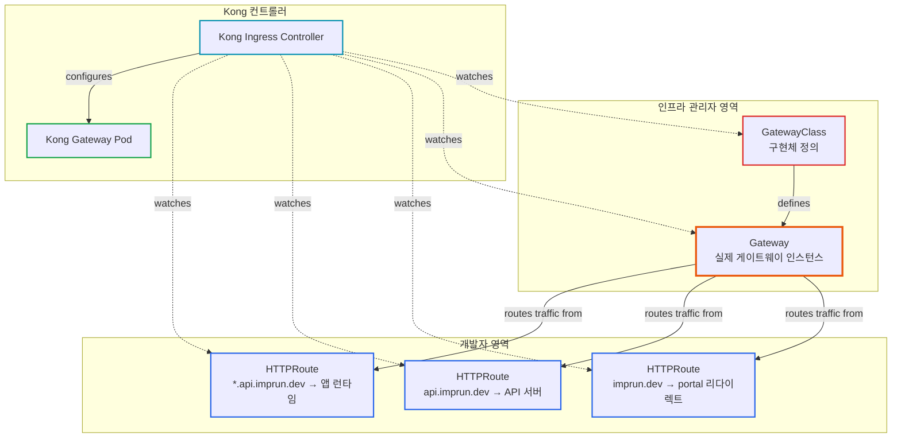
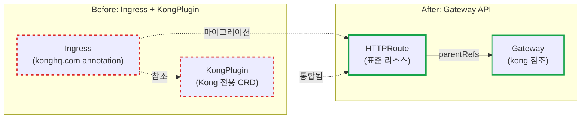
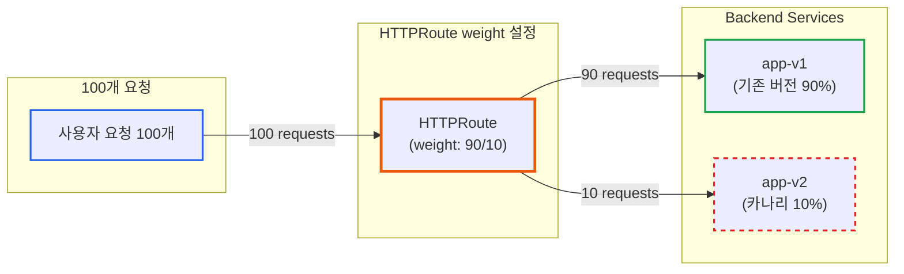
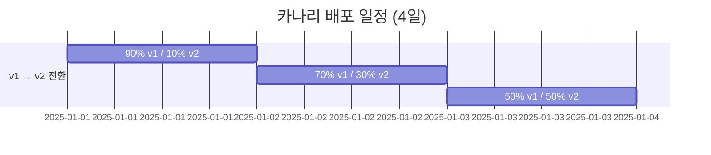

# Kubernetes Gateway API 실전 가이드: Kong Ingress에서 표준 API로 전환하기

**작성일:** 2025년 10월 27일
**카테고리:** Kubernetes, Gateway API, Kong
**난이도:** 중급

---

## TL;DR

- **문제**: Ingress는 각 컨트롤러마다 다른 annotation 문법을 사용하여 vendor lock-in 발생
- **해결**: Kubernetes 표준 Gateway API로 전환하여 포터블하고 명시적인 설정 달성
- **결과**: Kong 전용 `KongPlugin` → 표준 `HTTPRoute`로 전환 완료
- **핵심**: Gateway API는 단순한 리소스 교체가 아닌, **Kubernetes 네트워킹의 패러다임 전환**

---

## 들어가며

[**imprun.dev**](https://imprun.dev)는 Kubernetes 기반 서버리스 Cloud Function 플랫폼입니다. API Gateway로 Kong Ingress Controller를 사용하면서, **vendor 종속적인 annotation과 CRD**에 대한 우려가 있었습니다.

**우리가 마주한 질문**:
- ❓ **Vendor Lock-in**: Kong 전용 `KongPlugin` CRD, 다른 Gateway로 전환하려면?
- ❓ **Ingress의 미래**: NGINX Ingress가 maintenance mode 진입, 계속 사용해도 될까?
- ❓ **Gateway API**: 새로운 표준인데, Kong이 지원하나? 마이그레이션 복잡도는?

**검증 과정**:
1. **현재 상태 분석**
   - `imprun.dev` → `portal.imprun.dev` 리다이렉트
   - `konghq.com/plugins` annotation 사용
   - `KongPlugin` CRD로 301 리다이렉트 설정

2. **Gateway API 조사**
   - Kubernetes SIG-NETWORK 공식 프로젝트
   - 2023년 v1.0 GA, 2024년 NGINX maintenance mode
   - Kong v3.0+에서 Gateway API 기본 지원 확인

3. **마이그레이션 실행** ← **5단계 프로세스**
   - Step 1: Gateway API CRDs 설치 (v1.2.0)
   - Step 2: GatewayClass 생성 (Kong 컨트롤러 정의)
   - Step 3: Gateway 생성 (HTTP listener 80 포트)
   - Step 4: HTTPRoute 생성 (표준 `RequestRedirect` 필터)
   - Step 5: 기존 Ingress + KongPlugin 제거

4. **트러블슈팅 경험**
   - ❌ TLS mode 오류 → HTTP만 사용 (Kong이 TLS 자체 처리)
   - ❌ `feature_gates` 오류 → Kong v3.0+는 기본 활성화
   - ❌ `publish_service` 불일치 → 실제 Service 이름 확인
   - ❌ hostNetwork 포트 충돌 → 수동 Pod 삭제

**결론**:
- ✅ **표준화 달성** (Ingress annotation → HTTPRoute)
- ✅ **Vendor 독립성** (KongPlugin 제거, 표준 리소스만 사용)
- ✅ **무중단 전환** (기존 Kong 재사용, unmanaged mode)
- ✅ **향후 확장성** (Canary, Header routing 등 표준 기능)

이 글은 **imprun.dev 플랫폼 구축 경험**을 바탕으로, Ingress의 파편화 문제, Gateway API의 필요성, Kong에서의 실제 마이그레이션 과정과 트러블슈팅을 상세히 공유합니다.

---

## 배경: Ingress의 파편화 문제

### Ingress의 현실

Kubernetes에서 HTTP 라우팅을 설정하는 가장 일반적인 방법은 Ingress 리소스입니다. 하지만 실무에서는 큰 문제가 있습니다.

**같은 기능, 세 가지 다른 문법:**

```yaml
# NGINX Ingress Controller
apiVersion: networking.k8s.io/v1
kind: Ingress
metadata:
  annotations:
    nginx.ingress.kubernetes.io/limit-rps: "100"
    nginx.ingress.kubernetes.io/cors-allow-origin: "*"

---
# Kong Ingress Controller
apiVersion: networking.k8s.io/v1
kind: Ingress
metadata:
  annotations:
    konghq.com/plugins: rate-limiting-plugin
---
apiVersion: configuration.konghq.com/v1
kind: KongPlugin
metadata:
  name: rate-limiting-plugin
config:
  minute: 100

---
# HAProxy Ingress
apiVersion: networking.k8s.io/v1
kind: Ingress
metadata:
  annotations:
    haproxy.org/rate-limit: "100"
```

**동일한 기능(rate limiting)을 구현하는데 세 개 컨트롤러 모두 문법이 다릅니다!**

### 실무에서 겪는 문제

1. **Vendor Lock-in**: NGINX에서 Kong으로 전환하려면 모든 Ingress 리소스를 재작성해야 함
2. **학습 비용**: 각 컨트롤러마다 annotation 문서를 따로 학습
3. **표준 부재**: "Kubernetes 표준"이 아닌 각 vendor의 확장에 의존
4. **유지보수 어려움**: 팀원마다 다른 컨트롤러 경험으로 인한 혼란

### imprun.dev의 사례

저희 프로젝트에서도 동일한 문제를 겪었습니다:

```yaml
# imprun.dev → portal.imprun.dev 리다이렉트 (Kong 전용)
apiVersion: networking.k8s.io/v1
kind: Ingress
metadata:
  name: imprun-root-redirect
  namespace: imprun-system
  annotations:
    konghq.com/plugins: imprun-root-redirect  # Kong 전용!
---
apiVersion: configuration.konghq.com/v1  # Kong CRD
kind: KongPlugin
metadata:
  name: imprun-root-redirect
config:
  location: "https://portal.imprun.dev"
  status_code: 301
plugin: redirect
```

**문제점:**
- `konghq.com` annotation은 Kong에서만 작동
- `KongPlugin` CRD는 Kong 전용
- 향후 다른 Gateway로 전환 시 모두 재작성 필요

---

## Gateway API: Kubernetes 네트워킹의 미래

### Gateway API란?

Kubernetes SIG-NETWORK가 2019년부터 개발한 **차세대 표준 네트워킹 API**입니다.

**핵심 개념:**
- **표준화**: 모든 구현체에서 동일한 리소스 타입 사용
- **역할 지향**: 인프라 관리자(Gateway)와 개발자(Route) 역할 분리
- **확장성**: L4/L7뿐 아니라 TCP, UDP, gRPC 지원
- **명시성**: annotation 대신 명시적인 리소스 타입

### 왜 지금 Gateway API인가?

**2024년 중요한 변화:**

```
2019년: Gateway API 프로젝트 시작
2023년: Gateway API v1.0 GA (정식 릴리즈)
2024년: ingress-nginx maintenance mode 전환 발표 ⚠️
2025년: Gateway API가 사실상 표준
```

Kubernetes 공식 문서에 따르면:

> "With the emergence of the Kubernetes InGate project, the **ingress-nginx project will transition to maintenance mode**, with **no new features** from the core maintainers."

**더 이상 Ingress는 발전하지 않습니다.** 모든 신규 기능은 Gateway API에만 추가됩니다.

### NGINX가 디펙토 스탠다드 아니었나?

맞습니다, **"였습니다"** (과거형).

**2024년 현재 통계:**
- 54%의 Kubernetes 워크로드가 NGINX Ingress Controller 사용
- 시장 점유율 1위

**하지만:**
- ingress-nginx는 더 이상 새 기능 개발 안 함
- 커뮤니티는 Gateway API로 이동 중
- Kong, Envoy, Istio 모두 Gateway API 지원

**비유:**
- Ingress = jQuery 시대 (각자 다른 플러그인)
- Gateway API = React/Vue 시대 (표준 컴포넌트 모델)

---

## Gateway API 핵심 리소스

### 리소스 구조 개요



**핵심 개념:**
- ✅ **역할 분리**: 인프라(GatewayClass, Gateway)와 앱(HTTPRoute) 분리
- ✅ **재사용**: 하나의 Gateway에 여러 HTTPRoute 연결 가능
- ✅ **명시적**: annotation이 아닌 독립된 리소스로 관계 명확화

### 1. GatewayClass

Gateway 구현체를 정의합니다 (메타 리소스).

```yaml
apiVersion: gateway.networking.k8s.io/v1
kind: GatewayClass
metadata:
  name: kong
spec:
  controllerName: konghq.com/kic-gateway-controller
```

**역할:**
- 어떤 컨트롤러를 사용할지 선언
- Kong, NGINX, Envoy 등 구현체별로 하나씩 생성
- **클러스터 레벨 리소스** (namespace 없음)

### 2. Gateway

실제 Gateway 인스턴스를 정의합니다.

```yaml
apiVersion: gateway.networking.k8s.io/v1
kind: Gateway
metadata:
  name: kong
  namespace: kong-system
spec:
  gatewayClassName: kong
  listeners:
    - name: http
      protocol: HTTP
      port: 80
      allowedRoutes:
        namespaces:
          from: All  # 모든 namespace에서 Route 연결 가능
```

**역할:**
- Listener (포트 80, 443 등) 정의
- Cross-namespace 라우팅 허용 여부 설정
- **인프라 관리자 영역**

### 3. HTTPRoute

실제 라우팅 규칙을 정의합니다.

```yaml
apiVersion: gateway.networking.k8s.io/v1
kind: HTTPRoute
metadata:
  name: my-route
  namespace: my-app
spec:
  parentRefs:
    - name: kong
      namespace: kong-system
  hostnames:
    - app.example.com
  rules:
    - matches:
        - path:
            type: PathPrefix
            value: /api
      backendRefs:
        - name: api-service
          port: 8080
```

**역할:**
- 호스트, 경로 매칭
- 백엔드 서비스 지정
- 필터 (리다이렉트, 헤더 변환 등) 적용
- **개발자 영역**

### 역할 분리의 장점

| 역할 | 리소스 | 권한 범위 |
|------|--------|----------|
| 인프라 관리자 | GatewayClass, Gateway | 클러스터 전체 |
| 개발자 | HTTPRoute | 본인 namespace |

**보안 이점:**
- 개발자는 Gateway 설정을 수정할 수 없음
- Gateway 관리자는 개별 Route를 관리할 필요 없음
- RBAC로 명확한 권한 분리

---

## 실전: Kong에서 Gateway API 사용하기

### 환경 정보

- **Kubernetes:** v1.28+
- **Kong Ingress Controller:** v3.9 (Gateway API GA 지원)
- **Gateway API:** v1.2.0
- **목표:** `imprun.dev` → `portal.imprun.dev` HTTP 301 리다이렉트

### 1단계: Gateway API CRDs 설치

```bash
kubectl apply -f https://github.com/kubernetes-sigs/gateway-api/releases/download/v1.2.0/standard-install.yaml
```

**설치되는 CRD:**
- GatewayClass
- Gateway
- HTTPRoute
- GRPCRoute
- ReferenceGrant

### 2단계: Kong 설정 확인

Kong v3.0+는 Gateway API를 기본 지원합니다.

```yaml
# kong-values.yaml
ingressController:
  enabled: true
  env:
    # Kong이 Gateway 상태를 업데이트할 Service 지정
    publish_service: kong-system/kong-kong-proxy
```

**주의사항:**
- `feature_gates: Gateway=true`는 **필요 없음** (v3.0+는 기본 활성화)
- `publish_service`는 실제 Kong proxy Service명과 일치해야 함

### 3단계: GatewayClass 생성

```yaml
apiVersion: gateway.networking.k8s.io/v1
kind: GatewayClass
metadata:
  name: kong
  annotations:
    # Unmanaged mode: 기존 Kong deployment 재사용
    konghq.com/gatewayclass-unmanaged: "true"
spec:
  controllerName: konghq.com/kic-gateway-controller
  description: Kong Ingress Controller for Gateway API
```

**Unmanaged mode:**
- 기존 Kong deployment를 재사용
- Gateway 리소스 생성 시 새 Pod를 만들지 않음
- **무중단 전환 가능**

### 4단계: Gateway 생성

```yaml
apiVersion: gateway.networking.k8s.io/v1
kind: Gateway
metadata:
  name: kong
  namespace: kong-system
  annotations:
    konghq.com/publish-service: kong-system/kong-kong-proxy
spec:
  gatewayClassName: kong
  listeners:
    - name: http
      protocol: HTTP
      port: 80
      allowedRoutes:
        namespaces:
          from: All
```

**검증:**
```bash
kubectl get gateway -n kong-system kong
# NAME   CLASS   ADDRESS   PROGRAMMED   AGE
# kong   kong              True         1m
```

`PROGRAMMED: True`가 나와야 성공!

### 5단계: HTTPRoute로 리다이렉트 구현

**마이그레이션 비교:**



**Before (Ingress + KongPlugin):**
```yaml
apiVersion: networking.k8s.io/v1
kind: Ingress
metadata:
  annotations:
    konghq.com/plugins: imprun-root-redirect  # Kong 전용!
---
apiVersion: configuration.konghq.com/v1  # Kong CRD
kind: KongPlugin
config:
  location: "https://portal.imprun.dev"
  status_code: 301
plugin: redirect
```

**After (Gateway API - 표준):**
```yaml
apiVersion: gateway.networking.k8s.io/v1
kind: HTTPRoute
metadata:
  name: imprun-root-redirect
  namespace: imprun-system
spec:
  parentRefs:
    - name: kong
      namespace: kong-system
      sectionName: http
  hostnames:
    - imprun.dev
  rules:
    - filters:
        - type: RequestRedirect
          requestRedirect:
            hostname: portal.imprun.dev
            statusCode: 301
```

**차이점:**
- ❌ `konghq.com` annotation 제거
- ❌ `KongPlugin` CRD 제거
- ✅ 표준 `HTTPRoute` + `RequestRedirect` filter 사용
- ✅ **다른 Gateway 구현체에서도 동일하게 작동!**

### 검증

```bash
# HTTPRoute 상태 확인
kubectl describe httproute -n imprun-system imprun-root-redirect

# Status:
#   Conditions:
#     Type: Accepted       Status: True
#     Type: ResolvedRefs   Status: True
#     Type: Programmed     Status: True  ✅

# 실제 리다이렉트 테스트
curl -I http://imprun.dev
# HTTP/1.1 301 Moved Permanently
# Location: https://portal.imprun.dev
```

---

## 트러블슈팅 실전 사례

### Case 1: Gateway PROGRAMMED: Unknown

**증상:**
```bash
kubectl get gateway -n kong-system
# NAME   CLASS   PROGRAMMED   AGE
# kong   kong    Unknown      5m
```

**Kong 로그 확인:**
```bash
kubectl logs -n kong-system -l app.kubernetes.io/name=kong -c ingress-controller
```

**에러:**
```
error: publish service reference "kong-system/kong-kong-proxy" from Gateway's
annotations did not match configured controller manager's publish services
("kong-system/kong-proxy")
```

**원인:**
- Helm values의 `publish_service`와 Gateway annotation이 불일치
- 실제 Service명: `kong-kong-proxy`
- Helm values: `kong-proxy` (잘못됨)

**해결:**
```yaml
# kong-values.yaml
ingressController:
  env:
    publish_service: kong-system/kong-kong-proxy  # 실제 Service명
```

### Case 2: feature_gates 에러

**증상:**
```
Error: environment binding failed for variable CONTROLLER_FEATURE_GATES:
Gateway is not a valid feature
```

**원인:**
- Kong v3.0+에서는 Gateway API가 기본 활성화됨
- `feature_gates: Gateway=true` 설정이 불필요하고 에러 발생

**해결:**
```yaml
# kong-values.yaml
ingressController:
  env:
    # feature_gates: Gateway=true  # 제거!
    publish_service: kong-system/kong-kong-proxy
```

### Case 3: hostNetwork 포트 충돌

**증상:**
```
0/3 nodes are available: 1 node(s) didn't have free ports for the
requested pod ports
```

**원인:**
- hostNetwork 사용 시 Rolling Update 불가
- 기존 Pod가 80/443 포트 점유 중

**임시 해결:**
```bash
# 기존 Pod 수동 삭제
kubectl delete pod -n kong-system <old-pod-name>
```

**근본 해결 (권장):**
```yaml
# MetalLB 설치 후
proxy:
  type: LoadBalancer  # hostNetwork 제거
deployment:
  hostNetwork: false
autoscaling:
  enabled: true  # 이제 가능!
  minReplicas: 2
```

---

## Gateway API vs Ingress 비교

### 기능 비교

| 기능 | Ingress | Gateway API |
|------|---------|-------------|
| HTTP/HTTPS 라우팅 | ✅ | ✅ |
| TCP/UDP 라우팅 | ❌ | ✅ (TCPRoute, UDPRoute) |
| gRPC 라우팅 | ❌ | ✅ (GRPCRoute) |
| 표준화된 설정 | ❌ (annotation 파편화) | ✅ |
| 역할 기반 접근제어 | ⚠️ (부분적) | ✅ (명확한 분리) |
| 헤더 변환 | ⚠️ (annotation) | ✅ (Filter) |
| 리다이렉트 | ⚠️ (annotation) | ✅ (RequestRedirect) |
| URL Rewrite | ⚠️ (annotation) | ✅ (URLRewrite) |
| 미러링 | ❌ | ✅ (RequestMirror) |
| 가중치 기반 라우팅 | ❌ | ✅ (BackendRef weights) |

### 마이그레이션 체크리스트

**언제 전환해야 하나?**

✅ **지금 바로 전환 권장:**
- 새 프로젝트 시작
- Gateway 교체 예정 (vendor lock-in 회피)
- TCP/UDP 라우팅 필요
- 명시적인 설정 관리 선호

⚠️ **천천히 고려:**
- 기존 Ingress가 안정적으로 작동 중
- 단순한 HTTP 라우팅만 사용
- 팀 학습 비용 고려 필요

❌ **아직 이르다:**
- Kubernetes < v1.26 (Gateway API v1 미지원)
- Kong < v3.0 (Gateway API GA 미지원)

---

## 실전 활용 패턴

### 패턴 1: HTTPS 리다이렉트

**HTTP → HTTPS 자동 리다이렉트:**

```yaml
apiVersion: gateway.networking.k8s.io/v1
kind: HTTPRoute
metadata:
  name: https-redirect
spec:
  parentRefs:
    - name: kong
      sectionName: http
  hostnames:
    - app.example.com
  rules:
    - filters:
        - type: RequestRedirect
          requestRedirect:
            scheme: https
            statusCode: 301
```

### 패턴 2: 경로 기반 라우팅

**`/api` → backend-api, `/web` → frontend:**

```yaml
apiVersion: gateway.networking.k8s.io/v1
kind: HTTPRoute
metadata:
  name: path-based-routing
spec:
  parentRefs:
    - name: kong
  hostnames:
    - app.example.com
  rules:
    # /api → backend
    - matches:
        - path:
            type: PathPrefix
            value: /api
      backendRefs:
        - name: backend-api
          port: 8080

    # /web → frontend
    - matches:
        - path:
            type: PathPrefix
            value: /web
      backendRefs:
        - name: frontend
          port: 3000
```

### 패턴 3: 가중치 기반 카나리 배포

**트래픽 분산 시각화:**



**90% → v1, 10% → v2 (카나리):**

```yaml
apiVersion: gateway.networking.k8s.io/v1
kind: HTTPRoute
metadata:
  name: canary-deployment
spec:
  parentRefs:
    - name: kong
  rules:
    - backendRefs:
        - name: app-v1
          port: 8080
          weight: 90  # 90% 트래픽
        - name: app-v2
          port: 8080
          weight: 10  # 10% 트래픽 (카나리)
```

**점진적 배포 전략:**


### 패턴 4: 헤더 기반 라우팅

**`X-Version: v2` 헤더 → 새 버전:**

```yaml
apiVersion: gateway.networking.k8s.io/v1
kind: HTTPRoute
metadata:
  name: header-based-routing
spec:
  parentRefs:
    - name: kong
  rules:
    # X-Version: v2 → 새 버전
    - matches:
        - headers:
            - name: X-Version
              value: v2
      backendRefs:
        - name: app-v2
          port: 8080

    # 기본 → 기존 버전
    - backendRefs:
        - name: app-v1
          port: 8080
```

---

## 성능 및 운영 고려사항

### 성능 비교

**Ingress vs Gateway API:**
- ✅ **동일한 처리 성능** (같은 Kong 엔진 사용)
- ✅ **동일한 메모리 사용량**
- ✅ **추가 오버헤드 없음**

Gateway API는 **설정 방식**만 다를 뿐, 실행 시 성능은 Ingress와 동일합니다.

### 운영 체크리스트

**배포 전:**
- [ ] Gateway API CRDs 버전 확인 (v1.2.0+)
- [ ] Kong 버전 확인 (v3.0+)
- [ ] Kubernetes 버전 확인 (v1.26+)

**배포 후:**
- [ ] Gateway `PROGRAMMED: True` 확인
- [ ] HTTPRoute `Accepted: True` 확인
- [ ] 실제 트래픽 테스트 (curl, 브라우저)
- [ ] Kong 로그 확인 (에러 없음)

**모니터링:**
```bash
# Gateway 상태 모니터링
kubectl get gateway -A -w

# HTTPRoute 상태 모니터링
kubectl get httproute -A -w

# Kong 메트릭 확인
kubectl top pod -n kong-system
```

---

## 마무리

### 핵심 요약

1. **Ingress의 한계**: annotation 파편화로 vendor lock-in 발생
2. **Gateway API의 필요성**: Kubernetes 표준, 명시적 리소스, 역할 분리
3. **현재 상황**: ingress-nginx maintenance mode, Gateway API가 미래
4. **전환 방법**: GatewayClass → Gateway → HTTPRoute 순서
5. **주의사항**: hostNetwork, publish_service, feature_gates 설정 확인

### 다음 단계

**학습:**
- [Gateway API 공식 문서](https://gateway-api.sigs.k8s.io/)
- [Kong Gateway API 가이드](https://docs.konghq.com/kubernetes-ingress-controller/latest/guides/using-gateway-api/)

**실습:**
1. 테스트 클러스터에서 Gateway API CRDs 설치
2. 간단한 HTTPRoute 생성 (echo 서버)
3. RequestRedirect 필터 실습
4. 가중치 기반 라우팅 실습

**프로덕션 적용:**
1. 새 서비스부터 Gateway API 사용
2. 기존 Ingress는 점진적 전환
3. 팀 교육 및 문서화
4. 모니터링 대시보드 구축

### 실제 프로젝트에 적용하기

**imprun.dev에서의 경험:**
- ✅ Kong 전용 annotation 제거
- ✅ 표준 HTTPRoute로 리다이렉트 구현
- ✅ 무중단 전환 완료
- ✅ 향후 Gateway 교체 유연성 확보

**소요 시간:**
- CRD 설치: 1분
- 리소스 작성: 10분
- 배포 및 검증: 15분
- 트러블슈팅: 20분
- **총 소요: 약 46분**

**어려움:**
- hostNetwork 포트 충돌 (Kong Pod 재시작 필요)
- publish_service 불일치 (Helm values 수정)
- feature_gates 에러 (불필요한 설정 제거)

**얻은 것:**
- Kubernetes 표준 API 사용
- Kong → 다른 Gateway 전환 가능성
- 명시적이고 관리하기 쉬운 설정
- Gateway API 실전 경험

---

## 참고 자료

### 공식 문서
- [Kubernetes Gateway API](https://gateway-api.sigs.k8s.io/)
- [Kong Gateway API Guide](https://docs.konghq.com/kubernetes-ingress-controller/latest/guides/using-gateway-api/)
- [Gateway API v1.2.0 Release](https://github.com/kubernetes-sigs/gateway-api/releases/tag/v1.2.0)

### 관련 글
- [Gateway API vs Ingress - Kong Blog](https://konghq.com/blog/engineering/gateway-api-vs-ingress)
- [Why Gateway API is the Future - Tetrate](https://tetrate.io/blog/why-the-gateway-api-is-the-unified-future-of-ingress-for-kubernetes-and-service-mesh)

### 실습 자료
- [HTTPRoute 예제](https://gateway-api.sigs.k8s.io/guides/http-routing/)
- [HTTP Redirect/Rewrite](https://gateway-api.sigs.k8s.io/guides/http-redirect-rewrite/)

---

**태그:** #Kubernetes #GatewayAPI #Kong #Ingress #CloudNative #DevOps

**저자:** imprun.dev 팀
**저장소:** [github.com/your-org/imprun](https://github.com/your-org/imprun)

---

> "Gateway API는 단순한 Ingress의 대체가 아닙니다. Kubernetes 네트워킹의 **패러다임 전환**입니다."

🤖 *이 블로그는 실제 프로덕션 환경에서 Gateway API를 전환한 경험을 바탕으로 작성되었습니다.*
