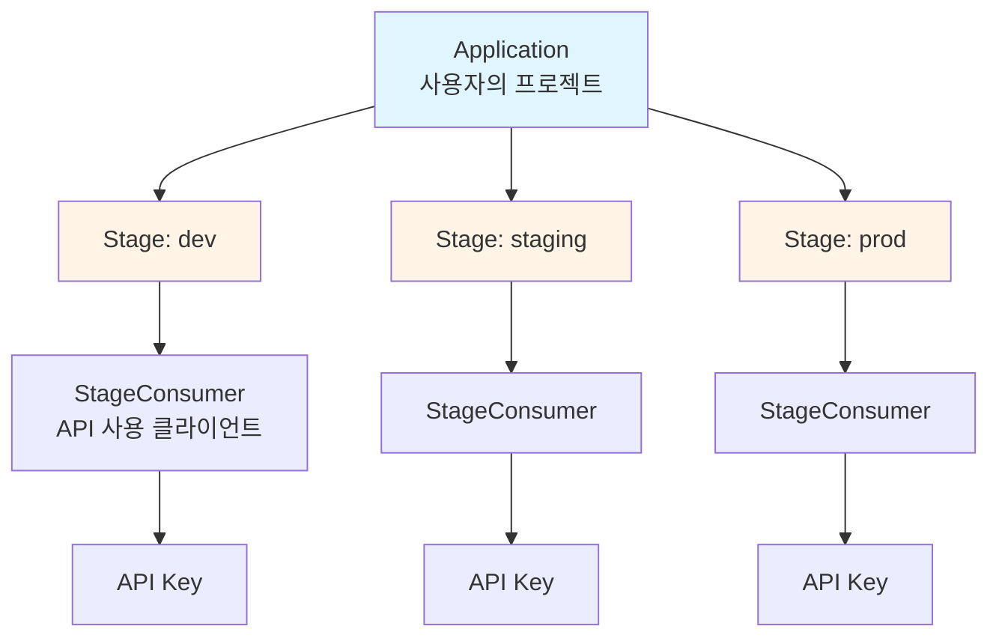
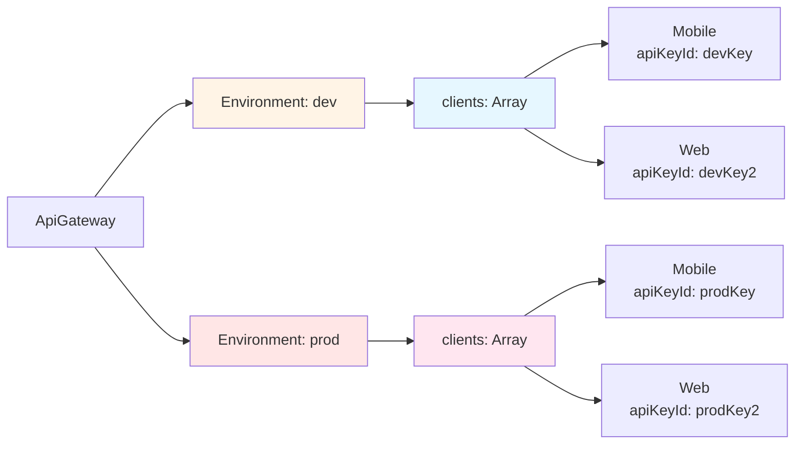
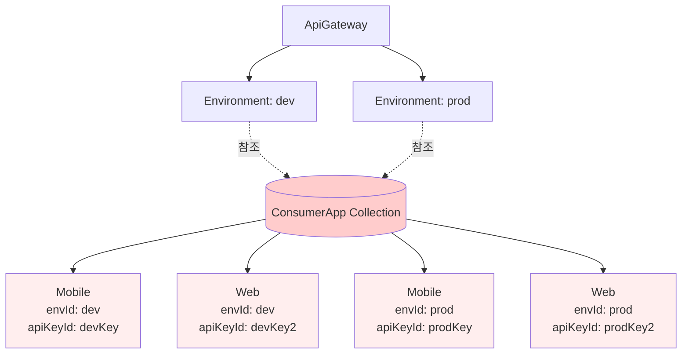
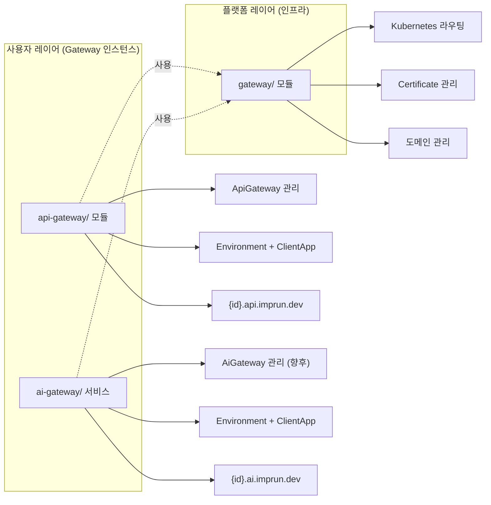
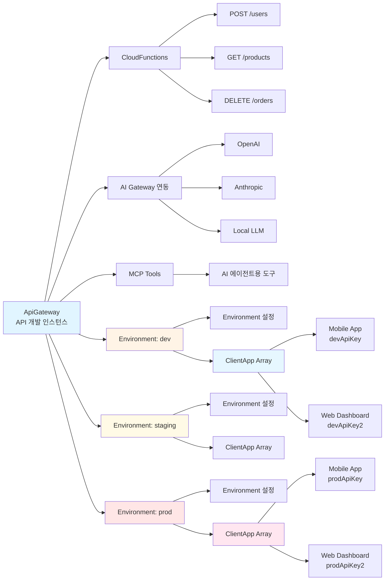
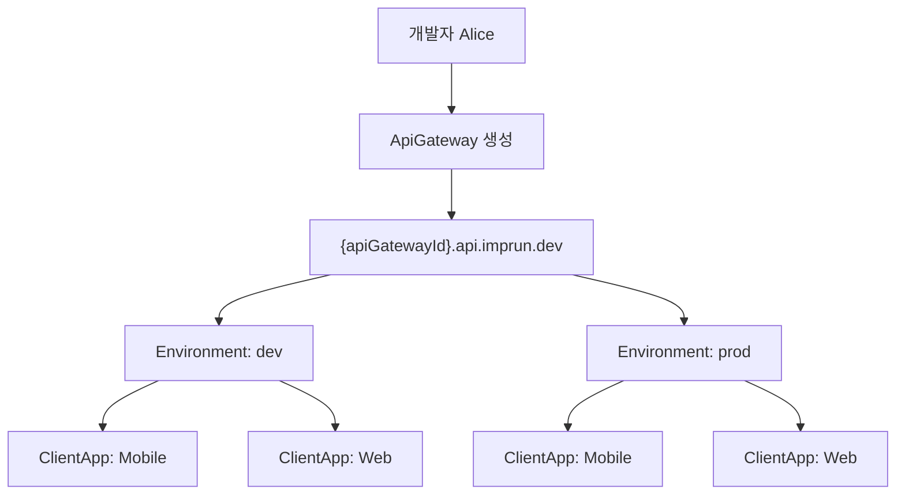
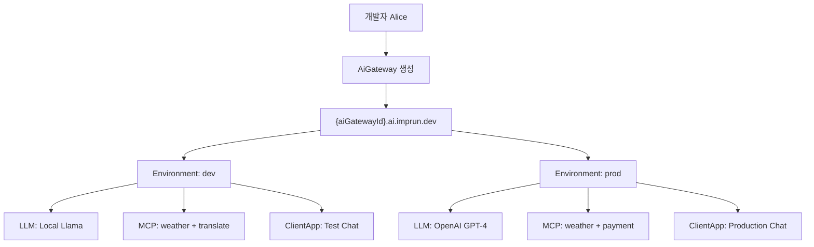
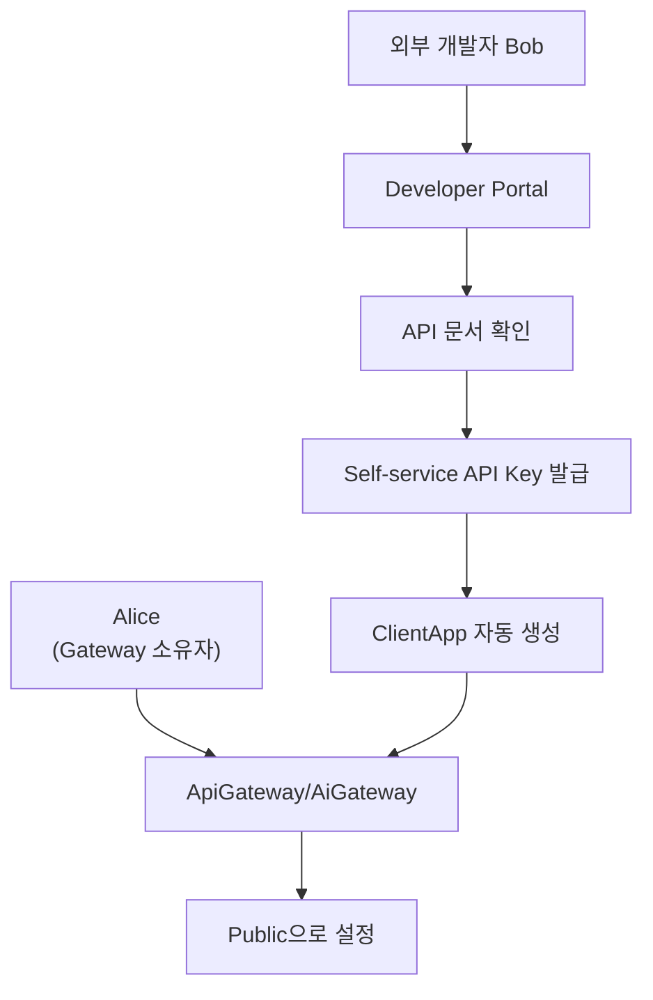
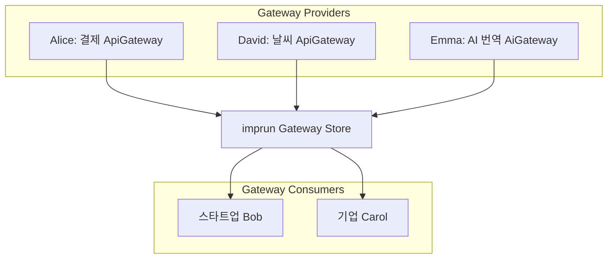

# imprun의 진화: Serverless에서 API Gateway Platform으로

> **작성일**: 2025년 10월 30일
> **대상 독자**: 백엔드 아키텍트, 플랫폼 엔지니어
> **난이도**: 중급~고급

---

## TL;DR

[imprun](https://imprun.dev)은 **Serverless 플랫폼에서 Gateway 플랫폼으로** 진화했습니다. 이 글은 그 여정에서 마주한 설계 고민들과 해결 방법, 그리고 최종 결정에 이르기까지의 과정을 공유합니다.

**핵심 변화**:
- ❌ Serverless 플랫폼 (Vercel/Netlify 같은)
- ✅ **"Gateway 플랫폼"** - 다양한 게이트웨이를 제공
- **ApiGateway**: CloudFunction 기반 REST API 개발 (`{id}.api.imprun.dev`)
- **AiGateway**: MCP+LLM 조합 AI 채팅 (`{id}.ai.imprun.dev`, 향후)
- 모든 Gateway는 동일한 패턴: Environment + ClientApp

**리팩토링 결과**:
- 용어: `Application` → `ApiGateway` (Gateway 패턴의 첫 구현)
- 아키텍처: Embedded ClientApp (보안 격리)
- API: `/v1/api-gateways` (명확성 우선)

---

## 🌱 Chapter 1: Serverless 플랫폼으로 시작

[imprun](https://imprun.dev)은 **Vercel이나 Netlify 같은 Serverless 플랫폼**을 지향하며 시작했습니다. CloudFunction을 배포하면 자동으로 API가 되는 구조였죠.

자연스럽게 다음과 같은 용어를 사용했습니다:



**Serverless 플랫폼의 전형적인 구조**였습니다. Vercel의 "Project → Environment"와 비슷하죠.

하지만 프로젝트가 진화하면서 문제가 드러났습니다:

## 🔄 Chapter 2: 정체성의 전환점

프로젝트가 진화하면서, imprun은 더 이상 **단순한 Serverless 플랫폼이 아니게** 되었습니다.

### 전환점 1: API Gateway 기능의 등장

Environment(dev/staging/prod)별로 다른 설정이 필요했습니다:
- CORS 설정
- Rate Limiting
- Authentication
- API Key 관리

이건 Vercel이 아니라 **AWS API Gateway나 Kong 같은 API Management 플랫폼**의 영역이었습니다.

### 전환점 2: "Gateway 플랫폼" 비전

[imprun](https://imprun.dev)은 이제 **여러 종류의 Gateway를 제공하는 플랫폼**이 되었습니다:

1. **ApiGateway**: CloudFunction 기반 REST API 개발
  - `{apiGatewayId}.api.imprun.dev`
  - Environment별 설정 (dev/staging/prod)
  - ClientApp 관리 (API 소비자)

2. **AiGateway** (향후 적용 예정):
  - MCP Tool 조합 + LLM 선택
  - `{aiGatewayId}.ai.imprun.dev`
  - 동일한 Environment + ClientApp 패턴

**"Application"이라는 용어는 이 새로운 정체성을 전혀 표현하지 못했습니다.**

Serverless의 "Application"이 아니라, **"Gateway 인스턴스"**가 더 정확한 표현이었죠.
사용자는 API Gateway든 AI Gateway든, 각각 독립적인 Gateway를 생성하고 관리합니다.

### 전환점 3: Consumer의 정체 깨달음

`StageConsumer`라는 이름을 보면 "외부 개발자"를 떠올리기 쉽습니다. AWS API Gateway의 Developer Portal처럼요.

하지만 imprun의 현실은 달랐습니다:

```javascript
// 실제 사용 패턴
개발자 Alice:
└── "my-api" Application
    ├── dev Stage
    │   ├── "Mobile App" Consumer (Alice 본인의 모바일 앱)
    │   └── "Test Script" Consumer (Alice 본인의 테스트 도구)
    └── prod Stage
        ├── "Mobile App" Consumer
        └── "Web Dashboard" Consumer
```

**"북치고 장구치기"** - Alice는 API를 만들고, 그걸 사용할 클라이언트 앱도 직접 관리합니다. Consumer는 외부 개발자가 아니라 **Alice 본인의 클라이언트 앱**이었죠.

---

## 💡 Chapter 3: 깨달음의 순간

리팩토링 계획을 세우던 중, Landing 페이지를 다시 봤습니다:

```typescript
// InteractiveFeatureSection.tsx
{
id: 'api',
title: 'API Gateway',  // 🤔 이게 맞나?
description: '코드만 작성하면 즉시 프로덕션 API가 됩니다',
}
```

이 순간 깨달았습니다. **Application이 아니라 "API Gateway"가 핵심 개념**이라는 것을요.

imprun은 사용자에게 **"Gateway 인스턴스"**를 제공하는 플랫폼입니다:
- 사용자가 Gateway를 만들고
- CloudFunction으로 API 엔드포인트를 정의하고
- 환경별로 다른 설정과 클라이언트를 관리하는 구조

---

## 🎯 Chapter 4: 새로운 정체성 정립

Serverless → API Gateway로의 전환을 받아들이고, 이에 맞는 용어를 재정의했습니다.

### Before → After

| 기존 | 새 용어 | 이유 |
|------|--------|------|
| Application | **ApiGateway** | 정체성 명확화, AI Gateway와 일관성 |
| Stage | **Environment** | 업계 표준 용어 (dev/staging/prod) |
| StageConsumer | **ClientApp** | 본질 표현: 개발자 본인의 클라이언트 앱 |

### 명명 철학

**"사용자 관점"을 최우선**으로 했습니다:

```javascript
// 사용자가 이렇게 생각한다면
"내 API Gateway를 만들고..."
"dev 환경에 Mobile 앱을 등록하고..."

// 코드도 이렇게 표현되어야 한다
POST /api-gateways
POST /api-gateways/{id}/environments/dev/clients
```

---

## 🚨 Chapter 5: 리팩토링 계획의 모순 발견

초안을 완성하고 검토하던 중, **치명적인 모순**을 발견했습니다.

### Phase 1.1의 선언
```typescript
// "핵심 결정: Environment별 ClientApp 유지"
export class Environment {
clients?: ClientApp[];  // ✅ Embedded array
}
```

### Phase 2.1의 실제 코드
```typescript
// ConsumerAppModule 생성?!
@Module({
imports: [
  MongooseModule.forFeature([
    { name: ConsumerApp.name, schema: ConsumerAppSchema }  // ❌ 별도 컬렉션!
  ])
]
})
export class ConsumerAppModule {}
```

**같은 문서에서 두 가지 다른 설계를 동시에 제안**하고 있었습니다! 😱

---

## 🔍 Chapter 6: 아키텍처 결정 - Embedded vs Separate Collection

### Option A: Embedded Array (Phase 1.1)



```typescript
Environment.clients[] = [
{ name: "Mobile", apiKeyId: devKey },
{ name: "Web", apiKeyId: devKey2 }
]
```

**장점**:
- ✅ **보안 격리**: dev 환경 침해 시 prod Key는 안전
- ✅ **구현 단순**: 서브도큐먼트 CRUD만 (`$push`, `$pull`)
- ✅ **환경 중심 사고**: "dev 환경 → 클라이언트 추가" (자연스러움)
- ✅ **마이그레이션 최소화**: 필드명만 변경

### Option B: Separate Collection (Phase 2.1)



```typescript
ConsumerApp {
environmentId: ObjectId,
name: "Mobile",
apiKeyId: prodKey  // ⚠️ 모든 환경 Key가 한 컬렉션에!
}
```

**장점**:
- ClientApp별 전체 이력 조회 가능
- 환경 간 이동 용이 (?)

**단점**:
- ❌ **보안 위험**: 단일 컬렉션 쿼리로 모든 환경 Key 노출 가능
- ❌ **복잡도 증가**: 3개 파일 추가 (module/service/controller)
- ❌ **UX 혼동**: 별도 페이지 필요, 환경 컨텍스트 약화
- ❌ **"북치고 장구치기" 패턴에 부적합**: 환경별 관리가 더 자연스러움

### 결정: Option A 채택

Alice의 실제 워크플로우를 상상해봤습니다:

```
1. dev 환경 페이지 진입
2. "Mobile 앱 추가" 버튼 클릭
3. API Key 발급받고 테스트
4. staging으로 Promotion
5. staging 환경 페이지에서 "Mobile 앱 추가"
6. 별도 API Key로 테스트
```

**환경이 컨텍스트의 중심**입니다. Option A가 이 패턴에 완벽히 부합했습니다.

---

## ⚠️ Chapter 7: 3가지 "Gateway"의 혼란

리팩토링 계획을 세우다 또 다른 문제를 발견했습니다.

[imprun](https://imprun.dev)에는 **3가지 다른 "Gateway" 개념**이 이미 공존하고 있었습니다:

```typescript
// 기존 코드베이스
server/src/
├── gateway/              // 이미 존재! (인프라 레이어)
│   ├── runtime-domain.service.ts
│   ├── certificate.service.ts
│   └── ... (Kubernetes 인프라 관리)
```

**기존 `gateway/` 모듈은 Kubernetes 인프라를 담당**합니다. 여기에 `GatewayModule`을 또 만들면? 충돌!

### 해결: 3계층 Gateway 아키텍처



| 계층 | 모듈 | 역할 | 패턴 |
|-----|------|------|------|
| **사용자** | `api-gateway/` | ApiGateway 관리 | Environment + ClientApp ✅ |
| **사용자** | `ai-gateway/` | AiGateway 관리 (향후) | Environment + ClientApp ✅ |
| **플랫폼** | `gateway/` | Kubernetes 인프라 | 하부 레이어 |

**핵심 인사이트**:
- `api-gateway/`와 `ai-gateway/`는 **같은 레이어, 같은 패턴**
- 둘 다 Environment + ClientApp 구조를 공유
- `gateway/`는 이들이 사용하는 인프라 레이어

**네이밍 규칙**:
```typescript
// ❌ 충돌 발생
export class GatewayModule {}  // 이미 존재!

// ✅ 명확히 구분
export class ApiGatewayModule {}  // Application 대체
```

---

## 🛣️ Chapter 8: API 설계 - 명확성 우선

API 경로를 설계할 때 중요한 선택의 순간이 있었습니다.

### 경로 `/gateways` vs `/api-gateways`?

**Option 1: `/v1/gateways`** (짧고 간결)
```typescript
@Controller('gateways')
export class ApiGatewayController {}
```

- 장점: 짧고 간결
- 단점: 3가지 Gateway 중 어떤 건지 불명확

**Option 2: `/v1/api-gateways`** (명확하고 일관)
```typescript
// 내부 모듈: api-gateway/
// API 경로: /api-gateways
// 완벽한 일관성!
```

- 장점: 명확함, 내부-외부 일치
- 단점: 약간 길다

### 결정: `/v1/api-gateways`

**명확성 > 간결성**

3가지 Gateway가 공존하는 상황에서, 명확한 구분이 더 중요하다고 판단했습니다:

```javascript
// imprun의 Gateway 계층
사용자 레이어:
1. /v1/api-gateways    ← ApiGateway 관리 (CloudFunction)
2. /v1/ai-gateways     ← AiGateway 관리 (향후, MCP+LLM)

플랫폼 레이어:
3. gateway/ 모듈       ← Kubernetes 인프라 (내부)
```

약간 긴 경로지만, 개발자가 API를 호출할 때 **어떤 Gateway인지 혼동하지 않는 것**이 더 중요합니다.

---

## ✅ Chapter 9: 최종 아키텍처 - API Gateway Platform

### 아키텍처



```
ApiGateway (API 개발 + 관리 인스턴스)
├── CloudFunctions (API 엔드포인트들)
├── AI Gateway 연동 (여러 LLM 통합)
├── MCP Tools (AI에게 제공)
└── Environment (dev/staging/prod)
  ├── 환경별 설정 (plugins, rate-limit)
  └── ClientApp (개발자 본인의 클라이언트 앱들) [Embedded]
      └── API Key (Environment별 독립)
```

### 용어 매핑

| 현재 용어 | 새 용어 | 데이터 구조 |
|---------|--------|------------|
| Application | **ApiGateway** | `gateways` 컬렉션 |
| Stage | **Environment** | `environments` 컬렉션 |
| StageConsumer | **ClientApp** | `Environment.clients[]` (embedded) |

### API 구조

```
/v1/api-gateways
├─ GET, POST, GET /{id}, PATCH /{id}, DELETE /{id}
└─ /{gatewayId}/environments
    ├─ GET, POST, GET /{envName}, PATCH /{envName}, DELETE /{envName}
    └─ /{envName}/clients
        ├─ GET, POST, GET /{clientId}, PATCH /{clientId}, DELETE /{clientId}
        └─ /{clientId}/regenerate-key (POST)
```

### 모듈 구조

```typescript
server/src/
├── gateway/              // 기존 (라우팅 인프라)
│   ├── runtime-domain.service.ts
│   ├── certificate.service.ts
│   └── ... (인프라 관리)
└── api-gateway/          // 신규 (Application 대체)
  ├── api-gateway.module.ts
  ├── api-gateway.service.ts
  ├── api-gateway.controller.ts
  └── entities/
      └── api-gateway.entity.ts
```

---

## 🎯 Chapter 10: Serverless에서 API Gateway로 - 설계 원칙의 변화

이번 리팩토링을 통해 확립한 설계 원칙들입니다:

### 1. 사용자 관점 우선 (User-Centric Naming)

```typescript
// ❌ 기술 중심
POST /applications
POST /applications/{id}/stages/{stage}/consumers

// ✅ 사용자 관점
POST /api-gateways  // "내 API Gateway를 만든다"
POST /api-gateways/{id}/environments/dev/clients  // "dev 환경에 클라이언트를 추가한다"
```

### 2. 보안 설계 우선 (Security by Design)

```typescript
// Embedded Array로 환경별 격리 보장
dev.clients = [{ apiKeyId: devKey }]
prod.clients = [{ apiKeyId: prodKey }]

// dev 환경 침해 시에도 prod Key는 안전!
```

### 3. 명확성 > 간결성 (Clarity over Brevity)

```typescript
// 조금 길어도 명확하게
/v1/api-gateways/{id}/environments/{env}/clients

// 3가지 Gateway 중 어떤 건지 한눈에!
```

### 4. 내부-외부 일관성 (Internal-External Consistency)

```typescript
// 내부 모듈: api-gateway/
// API 경로: /api-gateways
// 타입: ApiGateway
// 서비스: ApiGatewayService
// 완벽한 일관성!
```

### 5. 실제 사용 패턴 반영 (Real Usage Pattern)

```typescript
// "북치고 장구치기" 패턴
개발자 Alice:
└── ApiGateway "my-api"
    └── Environment "dev"
        └── ClientApp "Mobile"  // Alice 본인의 앱
            └── API Key (dev용)
```

---

## 🔄 Chapter 11: 마이그레이션 전략

### DB 리셋 시나리오

기존 데이터를 버리고 새로 시작하기로 했습니다:

**이유**:
1. 초기 단계 (사용자 적음)
2. 데이터 마이그레이션 복잡도 > 재입력 비용
3. 깨끗한 구조로 시작

**전략**:
```javascript
// 1단계: 기존 v1 API 제거
- /v1/applications (삭제)
- /v1/stages (삭제)

// 2단계: 새 v1 API 배포
+ /v1/api-gateways (신규)
+ /v1/api-gateways/{id}/environments (신규)

// 3단계: MongoDB 초기화
- applications → gateways (컬렉션 재생성)
- stages → environments (컬렉션 재생성)
```

### 점진적 마이그레이션 불필요

```typescript
// ❌ 복잡한 병행 운영 불필요
v1 API (기존) + v2 API (신규) 동시 지원 X

// ✅ 클린 배포
기존 v1 제거 → 새 v1 배포 → 완료
```

---

## 📊 Chapter 12: Breaking Changes & 영향 분석

### Breaking Changes

1. **API 경로 전면 변경**
  - `/v1/applications` → `/v1/api-gateways`
  - 모든 클라이언트 코드 업데이트 필요

2. **데이터 모델 변경**
  - `applications` → `gateways` 컬렉션
  - `stages` → `environments` 컬렉션
  - `Stage.consumers` → `Environment.clients` (embedded)

3. **라우팅 리소스 재생성**
  - Route: `{gatewayId}-{stageName}` → `{gatewayId}-{envName}`
  - Consumer: `{gatewayId}-{stageName}-{consumerId}` → `{gatewayId}-{envName}-{clientId}`

### 완화 전략

- DB 리셋으로 마이그레이션 없음
- 초기 사용자 대상 안내
- 문서 전면 업데이트

---

## 💭 Chapter 13: 여정을 통해 배운 것들

### 1. 계획서도 비판적으로 검토하라

초안을 완성했다고 안심하면 안 됩니다. **Phase 1.1과 Phase 2.1 사이의 모순**을 발견한 것처럼, 문서 내부의 일관성도 철저히 검증해야 합니다.

```typescript
// 비판적 검토 프로세스
1. 각 Phase가 서로 모순되지 않는가?
2. 엔티티 구조와 API 설계가 일치하는가?
3. 모든 결정에 명확한 근거가 있는가?
```

### 2. "북치고 장구치기" 패턴을 이해하라

초기 가정은 틀릴 수 있습니다. imprun을 "외부 개발자를 위한 API Gateway"로 생각했지만, 실제로는 **"개발자 본인이 모든 걸 관리하는 플랫폼"**이었습니다.

사용자의 실제 사용 패턴을 깊이 이해하는 것이 중요합니다.

### 3. 명확성은 투자할 가치가 있다

`/gateways` vs `/api-gateways` 논쟁에서, 약간 긴 경로를 선택했습니다. **명확성이 간결성보다 중요**하기 때문입니다.

특히 여러 비슷한 개념이 공존할 때는 더욱 그렇습니다.

### 4. 보안은 아키텍처에서 시작된다

Embedded Array vs Separate Collection 논쟁에서, 보안이 결정적인 요인이었습니다. **환경별 격리는 데이터 구조 레벨에서 보장**되어야 합니다.

### 5. 업계 표준은 이유가 있다

`Stage` → `Environment`, `Application` → `ApiGateway`. 업계에서 널리 쓰는 용어에는 이유가 있습니다. 바퀴를 다시 발명하지 마세요.

---

## 🎉 결론: Serverless는 끝이 아니라 시작이었다

imprun의 리팩토링은 단순한 코드 정리가 아니었습니다. **Serverless 플랫폼에서 API Gateway 플랫폼으로의 진화**였습니다.

### Serverless vs API Gateway - 무엇이 달라졌나?

| 관점 | Serverless 시절 | API Gateway로 진화 |
|------|----------------|-------------------|
| **정체성** | "함수 배포 플랫폼" | "API 개발 + 관리 플랫폼" |
| **핵심 개념** | Application (프로젝트) | ApiGateway (Gateway 인스턴스) |
| **사용자 목표** | "함수를 배포하고 싶어요" | "API를 만들고 관리하고 싶어요" |
| **주요 기능** | CloudFunction 실행 | API 개발 + AI 통합 + MCP Tool |
| **환경 관리** | Stage (배포 단계) | Environment (API Gateway 환경) |
| **클라이언트** | (개념 없음) | ClientApp (환경별 API Key 관리) |

### 이 여정이 우리에게 남긴 것

### 최종 결정 요약

```yaml
명명:
기존: Application / Stage / StageConsumer
신규: ApiGateway / Environment / ClientApp

API:
버전: v1 (새로운 시작)
경로: /v1/api-gateways (명확성 우선)

아키텍처:
데이터: Embedded Array (보안 격리)
모듈: api-gateway/ (충돌 방지)

철학:
- 사용자 관점 우선
- 보안 설계 우선
- 명확성 > 간결성
- 실제 패턴 반영
```

### 다음 단계

이제 실제 구현 단계로 넘어갑니다:

1. **Phase 1**: ApiGateway 구현 (현재)
  - Backend: ApiGatewayModule, EnvironmentModule 생성
  - Frontend: `/v1/api-gateways` API 연동
  - Testing: E2E 테스트 작성

2. **Phase 2**: AiGateway에 동일 패턴 적용 (향후)
  - Backend: AiGatewayModule (Environment + ClientApp 패턴 재사용)
  - API: `/v1/ai-gateways`
  - 도메인: `{aiGatewayId}.ai.imprun.dev`

---

## 🔮 Chapter 14: 미래 로드맵

### Gateway 패턴의 확장

현재 [imprun](https://imprun.dev)은 **ApiGateway 패턴을 확립하는 단계**입니다.
하지만 이 패턴은 **AiGateway를 비롯한 모든 Gateway 유형**에 적용됩니다.

#### Gateway 패턴의 핵심

```typescript
// 모든 Gateway가 공유하는 구조
interface Gateway {
id: string;
name: string;
domain: string;  // {gatewayId}.{type}.imprun.dev
environments: Environment[];  // dev/staging/prod
}

interface Environment {
name: string;
config: Record<string, any>;
clients: ClientApp[];  // Embedded!
}

interface ClientApp {
name: string;
apiKeyId: ObjectId;  // 환경별 독립
enabled: boolean;
}
```

### Phase 1A: ApiGateway - CloudFunction 기반 (현재)



**사용 사례**: REST API 개발
- CloudFunction으로 엔드포인트 작성 (`POST /users`, `GET /products`)
- Environment별 독립적인 설정 (dev에서 테스트, prod에서 운영)
- ClientApp = Alice가 만든 모바일/웹 앱들
- API Key = 환경별로 독립 (dev Key ≠ prod Key)

### Phase 1B: AiGateway - MCP+LLM 조합 (향후 적용)



**사용 사례**: AI 채팅 서비스
- MCP Tool 조합 선택 (날씨 API + 결제 API + 번역 API)
- LLM 선택 (dev: Local Llama, prod: OpenAI GPT-4)
- Environment별 독립적인 설정 (dev에서 저렴한 LLM, prod에서 고성능 LLM)
- ClientApp = Alice가 만든 채팅 앱들
- API Key = 환경별로 독립

**동일한 패턴**:
- ✅ Environment (dev/staging/prod)
- ✅ ClientApp (Embedded Array)
- ✅ API Key (환경별 독립)
- ✅ 도메인 (`{gatewayId}.{type}.imprun.dev`)

### Phase 2: 외부 공개 - 개발자 포털 (Developer Portal)

**"북치고 장구치기"에서 "외부 공유"로**

현재는 Alice가 직접 ClientApp을 등록합니다. 하지만 Alice가 자신의 Gateway를 **외부에 공개**하고 싶다면?



**변화**:
- Alice가 Gateway를 Public으로 설정
- Bob은 Developer Portal에서:
- API 문서 확인
- 직접 API Key 신청
- 자동으로 ClientApp 생성됨
- Alice는 사용량 모니터링 및 제어

**필요한 기능**:
- Public API Documentation Generator
- Self-service API Key 발급
- Usage Quota 및 Rate Limiting
- Billing & Analytics
- Developer Community

**중요**: Environment + ClientApp 구조는 그대로!
- Bob의 ClientApp도 `Environment.clients[]`에 저장
- 단지 등록 방식만 변경 (수동 → 자동)

### Phase 3: 궁극 - Gateway 마켓플레이스

**여러 Gateway 제공자들의 경쟁 시장**



**Gateway 마켓플레이스**의 특징:

- 🔍 **Gateway Discovery**: "결제 API" 또는 "AI 번역" 검색
- 💰 **가격 비교**: Alice의 ApiGateway vs David의 ApiGateway
- ⭐ **평점 시스템**: 사용자 리뷰 및 평가
- 🚀 **원클릭 연동**: ClientApp 자동 생성 + API Key 발급
- 💳 **수익화**: 종량제, 구독제, Freemium 모델
- 📊 **애널리틱스**: 제공자용 대시보드

**[imprun](https://imprun.dev)의 진화**:
```
Phase 1A: ApiGateway 패턴 확립 (현재)
Phase 1B: AiGateway에 동일 패턴 적용 (향후)
  ↓
Phase 2: Gateway를 외부에 공개 (Developer Portal)
  ↓
Phase 3: Gateway 마켓플레이스 (수익화)
```

**모든 Phase에서 동일한 패턴**:
- Environment (dev/staging/prod)
- ClientApp (Embedded Array)
- API Key (환경별 독립)

### 기술적 도전과제

**Phase 2 (Developer Portal)를 위해 필요한 것**:
- OAuth 2.0 기반 외부 개발자 인증
- Self-service API Key 관리
- Usage Tracking 및 Rate Limiting
- Public API Documentation Generator
- Developer Portal Frontend

**Phase 3 (Marketplace)를 위해 필요한 것**:
- API Monetization (Stripe/PG 연동)
- API Analytics & Reporting
- Rating & Review 시스템
- API Versioning 및 Deprecation 관리
- SLA & Uptime Monitoring
- Dispute Resolution 시스템

### 언제쯤 가능할까?

**현실적인 로드맵**:

```
2025 Q4: Phase 1 완성 (현재 리팩토링) ✅
2026 Q1-Q2: Phase 2 착수 (Developer Portal MVP)
2026 Q3-Q4: Phase 2 완성 (외부 개발자 온보딩)
2027+: Phase 3 검토 (Marketplace 타당성 분석)
```

하지만 **우리는 지금 당장 Phase 3를 준비하고 있습니다**:

- ✅ **Environment별 격리**: 이미 외부 개발자를 위한 구조
- ✅ **ClientApp 개념**: Developer Portal의 "Application" 개념과 동일
- ✅ **API Key 관리**: Self-service 발급 시스템으로 확장 가능
- ✅ **인프라 구조**: Rate Limiting, Quota 관리 이미 가능

**아키텍처 설계는 이미 미래를 준비하고 있습니다.** 🚀

---

**이 글이 비슷한 정체성 전환을 고민하는 분들에게 도움이 되길 바랍니다.**

제품이 진화하면, 코드도 함께 진화해야 합니다. Serverless로 시작했다고 해서 영원히 Serverless일 필요는 없습니다.

때로는 **정체성을 재정의하는 용기**가 필요합니다. 그리고 그 정체성은 **더 큰 미래를 향한 첫걸음**일 수 있습니다. 🌟

---

### 다음 이야기

다음 포스트에서는 실제 구현 과정과 마주한 기술적 도전들을 다룰 예정입니다:
- NestJS에서 대규모 리팩토링 진행하기
- MongoDB Embedded Documents vs Collections 성능 비교
- Frontend 라우팅 전면 변경 전략
- 무중단 배포는 가능한가?

Stay tuned! 📮

---

## 📚 참고 자료

- [API Gateway 패턴](https://microservices.io/patterns/apigateway.html)
- [MongoDB Embedded Documents](https://www.mongodb.com/docs/manual/core/data-model-design/#embedded-data-models)
- [NestJS Best Practices](https://docs.nestjs.com/fundamentals/testing)
- [REST API 네이밍 컨벤션](https://restfulapi.net/resource-naming/)

---

**작성**: imprun 팀
**날짜**: 2025년
**태그**: #리팩토링 #설계결정 #API설계 #MongoDB #NestJS
