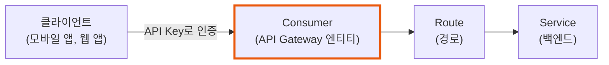
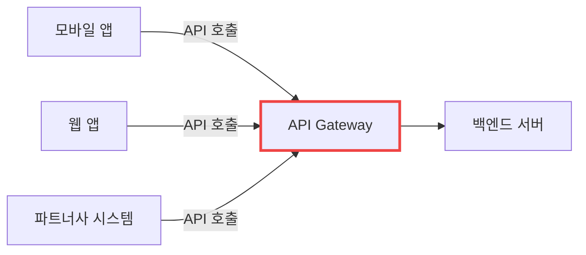
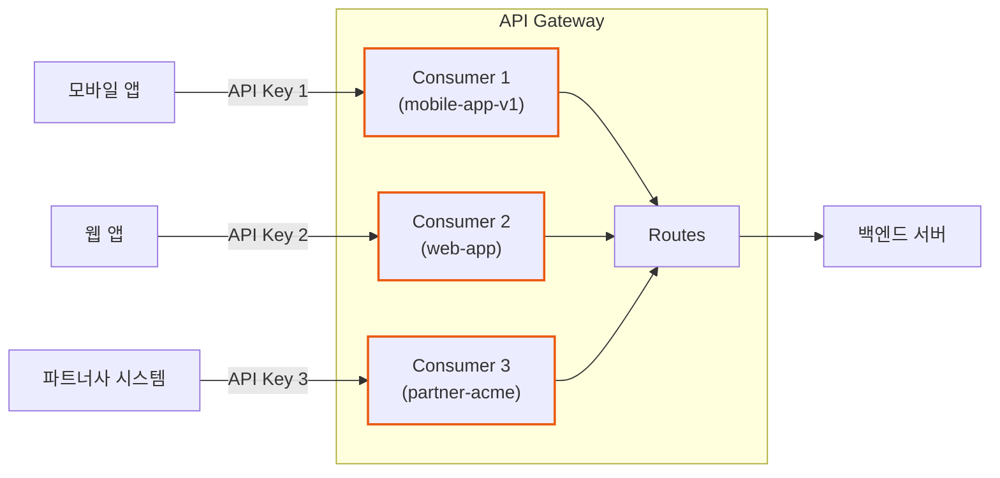
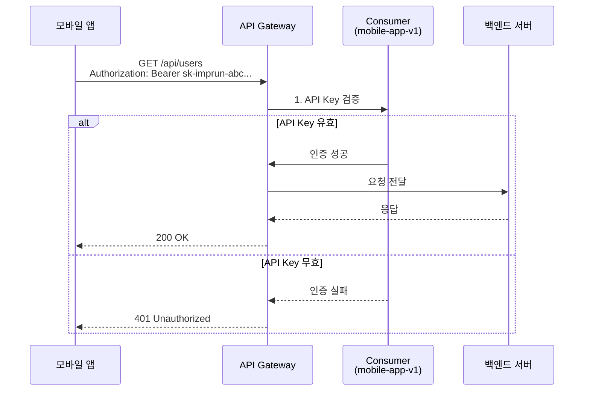
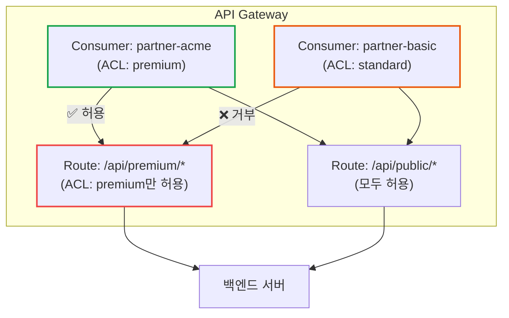
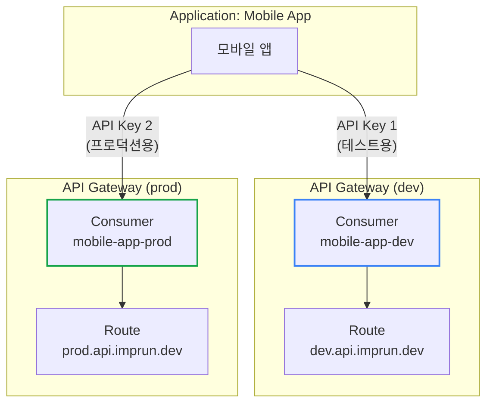
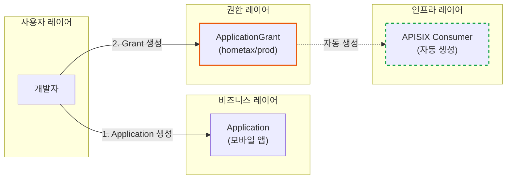

# API Gateway의 Consumer: 인증의 시작점

**작성일:** 2025-11-01
**카테고리:** API Gateway, Authentication, APISIX, Kong
**난이도:** 초급

---

## TL;DR

- **Consumer란?**: API Gateway에서 API를 호출하는 클라이언트(사용자, 애플리케이션)를 식별하는 엔티티
- **핵심 개념**:
  - Consumer는 인증(Authentication)의 주체
  - API Key, JWT, OAuth 등 다양한 인증 방식과 연결
  - Rate Limiting, ACL 등 정책 적용의 기준점
- **실제 사례**: 모바일 앱, 웹 앱, 파트너사 시스템 등이 Consumer
- **imprun.dev 적용**: ApplicationGrant를 통해 APISIX Consumer를 자동 생성하여 관리

---

## 들어가며

API Gateway를 처음 접하면 가장 헷갈리는 개념 중 하나가 바로 **Consumer**입니다.

"왜 API 호출하는데 Consumer라는 개념이 필요한가요?"
"User와 Consumer는 뭐가 다른가요?"
"Route, Service, Upstream은 알겠는데 Consumer는 언제 쓰는 건가요?"

이런 질문들, 저도 API Gateway를 도입하면서 똑같이 했습니다. 이 글에서는 **imprun.dev Platform**을 구축하면서 배운 Consumer 개념을 실제 사례와 함께 설명합니다.

---

## Consumer란 무엇인가?

### 기본 정의

**Consumer**는 API Gateway에서 **API를 사용(consume)하는 클라이언트**를 나타내는 엔티티입니다.



### Consumer vs User

혼동하기 쉬운 두 개념을 비교해보겠습니다:

| 구분 | Consumer | User |
|------|----------|------|
| **정의** | API를 호출하는 클라이언트 엔티티 | 비즈니스 로직상의 실제 사용자 |
| **존재 위치** | API Gateway 레이어 | Application 레이어 |
| **식별 방법** | API Key, JWT, OAuth Token | User ID, Email, 세션 |
| **관심사** | 인증, Rate Limiting, ACL | 권한, 프로필, 비즈니스 로직 |
| **예시** | "모바일 앱 v1.0" | "홍길동 (user@example.com)" |

**핵심**: Consumer는 **애플리케이션 레벨**의 인증, User는 **비즈니스 레벨**의 인증입니다.

---

## 왜 Consumer가 필요한가?

### 문제 상황: Consumer 없이 API Gateway 운영

Consumer 개념 없이 API Gateway를 운영한다고 가정해봅시다:



**문제점**:
1. ❌ 누가 API를 호출했는지 구분 불가
2. ❌ 클라이언트별 Rate Limiting 불가능
3. ❌ 파트너사에만 특정 API 허용 불가
4. ❌ 모바일 앱 v1.0과 v2.0 구분 불가
5. ❌ API Key 유출 시 어떤 클라이언트인지 추적 불가

### 해결: Consumer로 클라이언트 식별



**해결**:
- ✅ 각 클라이언트를 Consumer로 명확히 식별
- ✅ Consumer별 Rate Limiting 적용 가능
- ✅ Consumer별 ACL(접근 제어) 설정 가능
- ✅ Consumer별 트래픽 모니터링 가능
- ✅ API Key 유출 시 해당 Consumer만 비활성화

---

## Consumer의 구성 요소

### 1. Consumer Identity (식별자)

Consumer를 구분하는 고유 이름입니다.

```yaml
# APISIX Consumer 예시
apiVersion: apisix.apache.org/v2
kind: ApisixConsumer
metadata:
  name: mobile-app-v1  # Consumer 식별자
spec:
  authParameter:
    keyAuth:
      value:
        key: sk-imprun-abc123...  # API Key
```

**네이밍 규칙** (imprun.dev):
- 형식: `{애플리케이션}-{환경}-{ID}`
- 예시: `myapp-prod-67a1b2c3`, `partner-acme-staging-xyz456`

### 2. Authentication Credentials (인증 정보)

Consumer가 API를 호출할 때 사용하는 인증 정보입니다.

**API Key 방식**:
```yaml
spec:
  authParameter:
    keyAuth:
      value:
        key: sk-imprun-abc123def456...
```

**JWT 방식**:
```yaml
spec:
  authParameter:
    jwtAuth:
      value:
        key: jwt-key-123
        secret: jwt-secret-xyz
        algorithm: HS256
```

**Basic Auth 방식**:
```yaml
spec:
  authParameter:
    basicAuth:
      value:
        username: mobile-app
        password: secret-password
```

### 3. Metadata (메타데이터)

Consumer에 대한 추가 정보입니다.

```yaml
metadata:
  name: mobile-app-prod
  labels:
    app.kubernetes.io/name: mobile-app
    app.kubernetes.io/version: "1.0"
    imprun.dev/application-id: "abc123"
    imprun.dev/environment: "prod"
```

---

## Consumer의 실제 사용 사례

### 사례 1: 모바일 앱 인증

**시나리오**: 모바일 앱이 API Gateway를 통해 백엔드 API를 호출



**Consumer 설정**:
```yaml
apiVersion: apisix.apache.org/v2
kind: ApisixConsumer
metadata:
  name: mobile-app-v1
  labels:
    app-version: "1.0"
spec:
  authParameter:
    keyAuth:
      value:
        key: sk-imprun-mobile-app-key-123
```

**Rate Limiting** (초당 100 요청):
```yaml
apiVersion: apisix.apache.org/v2
kind: ApisixRoute
metadata:
  name: api-route
spec:
  http:
    - name: api
      match:
        paths:
          - /api/*
      plugins:
        - name: limit-count
          enable: true
          config:
            count: 100
            time_window: 1
            key_type: consumer
```

### 사례 2: 파트너사 API 접근 제어

**시나리오**: 특정 파트너사에만 특정 API 접근 허용



**Consumer 설정** (Premium 파트너):
```yaml
apiVersion: apisix.apache.org/v2
kind: ApisixConsumer
metadata:
  name: partner-acme
spec:
  authParameter:
    keyAuth:
      value:
        key: sk-imprun-partner-acme-key
    # ACL 그룹
    groups:
      - premium
```

**Route 설정** (Premium API):
```yaml
apiVersion: apisix.apache.org/v2
kind: ApisixRoute
metadata:
  name: premium-api
spec:
  http:
    - name: premium
      match:
        paths:
          - /api/premium/*
      plugins:
        - name: consumer-restriction
          enable: true
          config:
            whitelist:
              - premium  # premium 그룹만 허용
```

### 사례 3: 환경별 Consumer 분리

**시나리오**: dev/staging/prod 환경별 독립적인 Consumer 관리



**장점**:
- ✅ dev 환경 API Key 유출 시 prod 영향 없음
- ✅ 환경별 독립적인 Rate Limiting 설정
- ✅ dev에서 충분히 테스트 후 prod 전환

---

## APISIX vs Kong: Consumer 비교

### APISIX Consumer

**Kubernetes CRD 방식**:
```yaml
apiVersion: apisix.apache.org/v2
kind: ApisixConsumer
metadata:
  name: my-consumer
  namespace: default
spec:
  authParameter:
    keyAuth:
      value:
        key: my-api-key
  ingressClassName: apisix
```

**특징**:
- ✅ Kubernetes 네이티브 (CRD)
- ✅ GitOps 친화적 (YAML로 관리)
- ✅ Namespace 단위 격리
- ✅ 선언적(Declarative) 관리

### Kong Consumer

**Admin API 방식**:
```bash
# Consumer 생성
curl -X POST http://kong:8001/consumers \
  --data "username=my-consumer"

# API Key 추가
curl -X POST http://kong:8001/consumers/my-consumer/key-auth \
  --data "key=my-api-key"
```

**특징**:
- ✅ REST API 기반 관리
- ✅ 다양한 플러그인 생태계
- ✅ 명령형(Imperative) 관리
- ⚠️ Kubernetes와 별도 관리 필요

### 비교 요약

| 항목 | APISIX | Kong |
|------|--------|------|
| **관리 방식** | Kubernetes CRD | Admin REST API |
| **GitOps** | 완벽 지원 | DB 백업 필요 |
| **선언적 관리** | ✅ | ⚠️ (decK 사용 시) |
| **Namespace 격리** | ✅ | ❌ |
| **학습 곡선** | 중간 (K8s 지식 필요) | 낮음 (REST API) |

---

## imprun.dev의 Consumer 관리

### Application-Grant → Consumer 자동 생성

imprun.dev에서는 Application-Grant 아키텍처를 통해 APISIX Consumer를 자동으로 생성합니다.



### 자동 생성 플로우

```typescript
// ApplicationGrant 생성 시
async createGrant(
  applicationId: string,
  gatewayId: string,
  environment: 'dev' | 'staging' | 'prod',
) {
  // 1. API Key 생성
  const apiKey = this.generateApiKey()  // sk-imprun-abc123...
  const encryptedKey = this.encrypt(apiKey)

  // 2. Grant 저장 (MongoDB)
  const grant = await this.db.collection('ApplicationGrant').insertOne({
    applicationId,
    gatewayId,
    environment,
    credentialId: `${gatewayId}-${environment}-${applicationId}`,
    credentialSecret: encryptedKey,  // 암호화 저장
    active: true,
  })

  // 3. APISIX Consumer 자동 생성 (Kubernetes CRD)
  await this.syncConsumerToApisix(gatewayId, environment, {
    name: grant.credentialId,
    apiKey: apiKey,  // 평문으로 전달
  })

  // ⚠️ 사용자에게는 생성 시 1회만 평문 키 반환
  return {
    ...grant,
    plaintextKey: apiKey,  // 이후 조회 시 없음!
  }
}
```

### APISIX Consumer CRD 생성

```typescript
async syncConsumerToApisix(
  gatewayId: string,
  environment: string,
  consumer: { name: string; apiKey: string },
) {
  const namespace = `imprun-${gatewayId}`

  // Kubernetes CRD 생성
  const consumerCRD = {
    apiVersion: 'apisix.apache.org/v2',
    kind: 'ApisixConsumer',
    metadata: {
      name: consumer.name,
      namespace,
      labels: {
        'imprun.dev/gateway-id': gatewayId,
        'imprun.dev/environment': environment,
        'app.kubernetes.io/managed-by': 'imprun',
      },
    },
    spec: {
      authParameter: {
        keyAuth: {
          value: {
            key: consumer.apiKey,  // API Key (평문)
          },
        },
      },
      ingressClassName: 'apisix',
    },
  }

  await this.k8sApi.create(consumerCRD)
}
```

### 사용자 경험

```bash
# 1. Application 생성
POST /v1/applications
{
  "name": "My Mobile App"
}
# → appId: "abc123"

# 2. Grant 생성 (Consumer 자동 생성!)
POST /v1/applications/abc123/grants
{
  "gatewayId": "hometax",
  "environment": "prod"
}
# → {
#     "grantId": "...",
#     "plaintextKey": "sk-imprun-xyz789..."  # ⚠️ 1회만!
#   }

# 3. 모바일 앱에서 API 호출
curl https://hometax.prod.api.imprun.dev/getTaxInfo \
  -H "Authorization: Bearer sk-imprun-xyz789..."
```

**핵심**:
- ✅ 사용자는 Consumer를 직접 관리하지 않음
- ✅ Grant 생성 = Consumer 자동 생성
- ✅ Grant 삭제 = Consumer 자동 삭제
- ✅ 완전한 GitOps 워크플로우

---

## Consumer 모범 사례

### 1. 명확한 네이밍 규칙

```yaml
# ✅ 좋은 예: 애플리케이션-환경-ID
mobile-app-prod-67a1b2c3
web-app-dev-xyz456
partner-acme-staging-abc789

# ❌ 나쁜 예: 불명확한 이름
consumer1
test-consumer
my-app
```

### 2. 환경별 Consumer 분리

```yaml
# dev 환경 Consumer
apiVersion: apisix.apache.org/v2
kind: ApisixConsumer
metadata:
  name: myapp-dev
  namespace: dev-gateway
spec:
  authParameter:
    keyAuth:
      value:
        key: sk-imprun-dev-key-123

---
# prod 환경 Consumer
apiVersion: apisix.apache.org/v2
kind: ApisixConsumer
metadata:
  name: myapp-prod
  namespace: prod-gateway
spec:
  authParameter:
    keyAuth:
      value:
        key: sk-imprun-prod-key-456
```

### 3. 메타데이터 활용

```yaml
metadata:
  name: mobile-app-v1
  labels:
    app.kubernetes.io/name: mobile-app
    app.kubernetes.io/version: "1.0"
    app.kubernetes.io/component: consumer
    app.kubernetes.io/managed-by: imprun
    imprun.dev/application-id: "abc123"
    imprun.dev/environment: "prod"
    imprun.dev/created-by: "user@example.com"
  annotations:
    description: "Mobile App v1.0 Production Consumer"
    contact: "mobile-team@company.com"
```

### 4. Rate Limiting 설정

```yaml
# Consumer별 Rate Limiting
apiVersion: apisix.apache.org/v2
kind: ApisixRoute
metadata:
  name: api-route
spec:
  http:
    - name: api
      match:
        paths:
          - /api/*
      plugins:
        - name: limit-count
          enable: true
          config:
            count: 100       # 초당 100 요청
            time_window: 1   # 1초
            key_type: consumer  # Consumer별 제한
            rejected_code: 429
```

### 5. API Key 보안

```typescript
// ✅ 좋은 예: 암호화 저장, 평문 1회 노출
const apiKey = generateApiKey()
const encrypted = encrypt(apiKey)
await db.save({ credentialSecret: encrypted })
return { plaintextKey: apiKey }  // 생성 시에만 반환

// ❌ 나쁜 예: 평문 저장
await db.save({ credentialSecret: apiKey })  // 위험!
```

---

## 자주 하는 실수

### 1. Consumer와 User 혼동

```yaml
# ❌ 잘못된 예: User를 Consumer로 생성
apiVersion: apisix.apache.org/v2
kind: ApisixConsumer
metadata:
  name: user-john-doe  # User ≠ Consumer!
spec:
  authParameter:
    keyAuth:
      value:
        key: johns-personal-key

# ✅ 올바른 예: Application을 Consumer로 생성
apiVersion: apisix.apache.org/v2
kind: ApisixConsumer
metadata:
  name: mobile-app-v1  # Application = Consumer
spec:
  authParameter:
    keyAuth:
      value:
        key: sk-imprun-mobile-app-key
```

**핵심**: Consumer는 애플리케이션 레벨, User는 비즈니스 레벨!

### 2. 모든 환경에서 동일한 API Key 사용

```bash
# ❌ 잘못된 예
dev/staging/prod 모두 동일한 API Key 사용
→ dev 키 유출 시 prod도 위험!

# ✅ 올바른 예
dev:   sk-imprun-dev-key-123
staging: sk-imprun-staging-key-456
prod:  sk-imprun-prod-key-789
→ 환경별 독립적인 키 관리
```

### 3. Consumer 없이 인증 플러그인만 사용

```yaml
# ❌ 잘못된 예: Consumer 없이 key-auth 사용
apiVersion: apisix.apache.org/v2
kind: ApisixRoute
metadata:
  name: api-route
spec:
  http:
    - name: api
      plugins:
        - name: key-auth
          enable: true
          config:
            key: sk-imprun-hardcoded-key  # 하드코딩!

# ✅ 올바른 예: Consumer 생성 후 연결
# 1. Consumer 생성
apiVersion: apisix.apache.org/v2
kind: ApisixConsumer
metadata:
  name: my-app
spec:
  authParameter:
    keyAuth:
      value:
        key: sk-imprun-my-app-key

# 2. Route에 key-auth 플러그인 활성화
apiVersion: apisix.apache.org/v2
kind: ApisixRoute
metadata:
  name: api-route
spec:
  http:
    - name: api
      plugins:
        - name: key-auth
          enable: true  # Consumer의 키 검증
```

---

## 마무리

### 핵심 요약

**Consumer**는 API Gateway에서 API를 호출하는 클라이언트를 식별하는 엔티티입니다:

1. **인증의 주체**: API Key, JWT 등 인증 정보와 연결
2. **정책 적용 기준**: Rate Limiting, ACL 등 Consumer별 정책 적용
3. **모니터링 단위**: Consumer별 트래픽, 에러율 추적
4. **환경별 분리**: dev/staging/prod 각각 독립적인 Consumer

**imprun.dev 접근**:
- Application-Grant 아키텍처로 Consumer 자동 생성
- 사용자는 Consumer를 직접 관리하지 않음
- Grant 생성 = Consumer 자동 생성, Grant 삭제 = Consumer 자동 삭제

### 다음 읽을거리

- [API Platform의 Consumer 인증 설계: Application-Grant 아키텍처](https://blog.imprun.dev/49) - Consumer 개념을 실제 프로덕션에 적용한 3-Layer 아키텍처 설계
- [APISIX Ingress Controller 2.0: CRD 선택 가이드](https://blog.imprun.dev/40)
- [imprun의 진화: Serverless에서 API Gateway Platform으로](https://blog.imprun.dev/43)

---

## 참고 자료

### 공식 문서
- [APISIX Consumer Documentation](https://apisix.apache.org/docs/apisix/terminology/consumer/)
- [APISIX Consumer CRD](https://apisix.apache.org/docs/ingress-controller/concepts/apisix_consumer/)
- [Kong Consumer Object](https://docs.konghq.com/gateway/latest/admin-api/consumer-object/)

### imprun.dev
- [공식 사이트](https://imprun.dev)
- [GitHub 저장소](https://github.com/zio4272/imprun)

---

**태그:** #APIGateway #Consumer #Authentication #APISIX #Kong #Architecture

---

> "Consumer는 API Gateway의 인증 시작점이다. Consumer를 이해하면 API Gateway의 절반을 이해한 것이다."

🤖 *이 블로그는 APISIX와 Kong을 실제로 운영하면서 배운 Consumer 개념을 정리한 내용입니다.*
