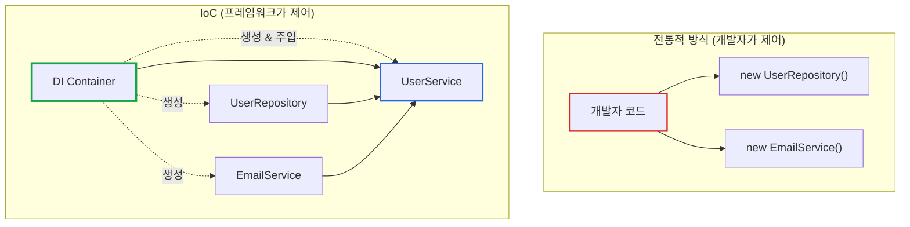
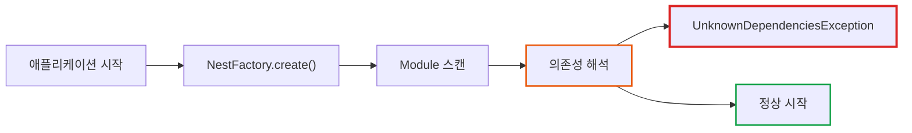
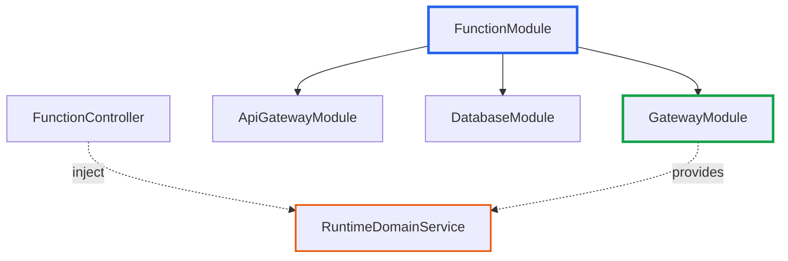

# NestJS UnknownDependenciesException 완벽 해결 가이드

**작성일:** 2025-11-01
**카테고리:** NestJS, Dependency Injection, Backend
**난이도:** 중급

---

## TL;DR

- **문제**: NestJS에서 `Nest can't resolve dependencies of the [Service]` 에러 발생
- **원인**: Module의 imports에 필요한 Provider를 제공하는 Module이 누락됨
- **해결**: 체계적인 디버깅 전략으로 의존성 체인 추적 후 Module imports 추가
- **핵심**: 에러 메시지의 첫 번째 의존성을 추적하면 해결의 실마리를 찾을 수 있음

---

## 들어가며

[**imprun.dev**](https://imprun.dev)는 "API 개발부터 AI 통합까지, 모든 것을 하나로 제공"하는 Kubernetes 기반 API Gateway 플랫폼입니다. NestJS로 백엔드를 구축하면서 **환경별 subdomain 구조 구현** 과정에서 `UnknownDependenciesException`을 마주했습니다.

**우리가 마주한 상황**:
```
Error: Nest can't resolve dependencies of the FunctionController (
  FunctionService,
  BundleService,
  FunctionRecycleBinService,
  I18nService,
  ?  ← 이게 뭘까?
). Please make sure that the argument RuntimeDomainService at index [4]
is available in the FunctionModule context.
```

**우리가 마주한 질문**:
- ❓ `RuntimeDomainService`는 분명 존재하는데 왜 찾을 수 없을까?
- ❓ 다른 Controller에서는 잘 작동하는데 왜 여기서만 안 될까?
- ❓ 의존성 체인을 어떻게 추적해야 할까?

**검증 과정**:
1. **Provider 직접 추가** (`providers` 배열에 `RuntimeDomainService` 추가)
   - ❌ "This provider is already provided"
   - ❌ 순환 참조 위험

2. **forwardRef() 사용** (순환 참조 해결 시도)
   - ❌ 근본 원인 해결 아님
   - ❌ 불필요한 복잡도 증가

3. **Module imports 추가** ← **최종 선택**
   - ✅ `GatewayModule`을 `FunctionModule`의 imports에 추가
   - ✅ 의존성 체인 명확화
   - ✅ 모듈화 구조 유지

**결론**:
- ✅ 에러 메시지의 "index [N]" 정보를 활용한 체계적 디버깅
- ✅ Module 간 의존성 관계를 Mermaid로 시각화
- ✅ 5분 내 해결 (처음에는 30분 이상 헤맸지만 패턴을 알고 나니 빠름)

이 글은 **imprun.dev 플랫폼 개발 경험**을 바탕으로, NestJS DI 문제를 체계적으로 해결하는 방법을 공유합니다.

---

## DI의 역사: 왜 의존성 주입을 사용하게 되었나?

### 초기: new 키워드의 지옥

2000년대 초반, 객체 지향 프로그래밍에서 의존성 관리는 **개발자의 몫**이었습니다.

```java
// 2000년대 초반 Java 코드
public class UserService {
    private UserRepository repository;
    private EmailService emailService;
    private Logger logger;

    public UserService() {
        // 모든 의존성을 직접 생성
        this.repository = new UserRepository();
        this.emailService = new EmailService();
        this.logger = new Logger();
    }
}
```

**문제점**:
- ❌ **Tight Coupling**: UserService가 구체적인 구현체에 강하게 결합됨
- ❌ **테스트 불가능**: Mock 객체 주입이 불가능 → 단위 테스트 작성 불가
- ❌ **설정 변경 어려움**: 다른 EmailService 구현체를 사용하려면 코드 수정 필요
- ❌ **순환 참조**: A가 B를 생성하고 B가 A를 생성하는 경우 Stack Overflow

### Service Locator 패턴의 등장

이런 문제를 해결하기 위해 **Service Locator** 패턴이 등장했습니다.

```java
// Service Locator 패턴 (2000년대 중반)
public class UserService {
    private UserRepository repository;
    private EmailService emailService;

    public UserService() {
        // 중앙 Registry에서 꺼내오기
        this.repository = ServiceLocator.get(UserRepository.class);
        this.emailService = ServiceLocator.get(EmailService.class);
    }
}
```

**개선됨**:
- ✅ 중앙 집중식 관리: 모든 서비스를 한 곳에서 관리

**하지만 여전히 문제**:
- ❌ **숨겨진 의존성**: Constructor를 봐도 어떤 의존성이 필요한지 알 수 없음
- ❌ **런타임 에러**: 의존성 누락 시 컴파일 타임이 아닌 런타임에 에러 발생
- ❌ **전역 상태**: ServiceLocator가 전역 상태를 가지므로 테스트 격리가 어려움

### Dependency Injection의 혁명 (2004년)

**2004년, Martin Fowler**가 쓴 글 ["Inversion of Control Containers and the Dependency Injection pattern"](https://martinfowler.com/articles/injection.html)이 업계를 바꿨습니다.

> "의존성을 직접 생성하지 말고, 외부에서 주입받자"

같은 해 **Spring Framework 1.0**이 출시되며 DI가 대중화되기 시작했습니다.

```java
// Spring Framework (2004~)
@Service
public class UserService {
    private final UserRepository repository;
    private final EmailService emailService;

    // Constructor Injection: 의존성이 명확히 드러남
    @Autowired
    public UserService(UserRepository repository, EmailService emailService) {
        this.repository = repository;
        this.emailService = emailService;
    }
}
```

**혁신적인 변화**:
- ✅ **Constructor Injection**: 의존성이 명시적으로 드러남
- ✅ **Compile-time Safety**: 의존성 누락 시 컴파일 타임에 감지
- ✅ **테스트 가능**: Mock 객체를 쉽게 주입 가능
- ✅ **느슨한 결합**: 인터페이스 기반 개발 촉진

### IoC (Inversion of Control)의 핵심

DI의 핵심 개념은 **제어의 역전(IoC)**입니다.



**전통적 방식**: 개발자가 의존성 생성과 생명주기를 제어

**IoC 방식**: **프레임워크(DI Container)**가 객체 생성과 의존성 주입을 제어

### 왜 업계 표준이 되었나?

**1. 테스트 주도 개발(TDD)의 부상** (2000년대 중반)
- 단위 테스트를 위해서는 의존성을 Mock으로 교체할 수 있어야 함
- DI 없이는 테스트 가능한 코드 작성이 거의 불가능

**2. 대규모 애플리케이션의 복잡도 증가**
- 100개 이상의 Service가 얽힌 Enterprise 애플리케이션
- 의존성을 수동으로 관리하는 것은 사실상 불가능
- DI Container가 자동으로 의존성 그래프를 해결

**3. 마이크로서비스 아키텍처** (2010년대)
- 서비스 간 느슨한 결합이 필수
- DI는 인터페이스 기반 개발을 강제하여 교체 가능성 확보

**4. 클라우드 네이티브 시대** (2015~)
- 환경별 설정 변경이 빈번 (dev, staging, prod)
- DI를 통해 코드 수정 없이 설정만으로 구현체 교체

### 현대 프레임워크의 DI

**2010년대 중반 이후**, DI는 모든 주요 백엔드 프레임워크의 핵심 기능이 되었습니다:

| 연도 | 프레임워크 | DI 방식 |
|------|-----------|---------|
| 2004 | **Spring (Java)** | Annotation + XML Config → IoC Container |
| 2010 | **ASP.NET Core (C#)** | Built-in DI Container |
| 2016 | **Angular (TypeScript)** | Hierarchical Injector (Zone 기반) |
| 2017 | **NestJS (TypeScript)** | Decorator + Reflect Metadata (Spring 영감) |

**NestJS의 경우**:
```typescript
// NestJS (2017~) - Spring의 철학을 TypeScript로
@Injectable()
export class UserService {
  constructor(
    private readonly repository: UserRepository,  // 자동 주입
    private readonly emailService: EmailService,  // 자동 주입
  ) {}
}

@Module({
  providers: [UserService, UserRepository, EmailService],
  exports: [UserService],
})
export class UserModule {}
```

**NestJS가 DI를 채택한 이유** ([imprun.dev](https://imprun.dev) 플랫폼에서 경험한 이점):

1. **모듈화**: 기능별로 Module을 분리하고 재사용
2. **테스트 용이성**: Mock 주입으로 단위 테스트 작성 용이
3. **확장성**: 새로운 Provider 추가 시 기존 코드 수정 최소화
4. **타입 안전성**: TypeScript + Reflect Metadata로 컴파일 타임 검증
5. **Kubernetes 환경**: 환경별 설정을 DI로 관리 (ConfigService 등)

### DI가 어려운 이유

하지만 **DI는 강력한 만큼 복잡**합니다:

1. **높은 진입 장벽**: Module, Provider, Exports, Imports 개념 이해 필요
2. **숨겨진 매직**: Decorator와 Reflect Metadata가 뒤에서 작동
3. **디버깅 어려움**: 의존성 해석 실패 시 에러 메시지 이해 어려움 (← 이 글의 주제!)
4. **순환 참조**: Module 간 순환 참조는 해결이 까다로움

바로 이런 어려움 때문에 **`UnknownDependenciesException`**이 NestJS 개발자들에게 가장 큰 난관이 됩니다.

### DI의 Trade-off: 언제 사용하고, 언제 피해야 할까?

**개인적인 경험과 선택**:

DI의 강력함을 인정하지만, **모든 프로젝트에서 DI가 정답은 아닙니다**.

- ✅ **DI를 사용하는 경우**:
  - NestJS, Spring 등 DI 기반 프레임워크 사용 시 (선택의 여지가 없음)
  - 대규모 팀 프로젝트 (10명 이상)
  - 장기 유지보수가 필요한 Enterprise 애플리케이션
  - 테스트 커버리지가 중요한 프로젝트

- ⚠️ **DI를 피하는 경우**:
  - 작은 프로젝트 (1-3명, 3개월 이하)
  - 사내 도구나 일회성 스크립트
  - 프로토타입이나 MVP
  - 팀원들이 DI에 익숙하지 않은 경우

**현실적인 조언**:

> "DI는 강력한 도구지만, **학습 곡선**과 **초기 설정 비용**이 있습니다.
> 프로젝트 규모와 팀 상황을 고려해서 선택하세요.
> 작은 프로젝트에서 무리하게 DI를 도입하면 오히려 생산성이 떨어질 수 있습니다."

[imprun.dev](https://imprun.dev)는 Kubernetes 기반 플랫폼으로 **확장성과 테스트 가능성**이 핵심이었기 때문에 NestJS + DI가 최선의 선택이었습니다. 하지만 모든 프로젝트가 그런 것은 아닙니다.

---

## UnknownDependenciesException이란?

### 에러 메시지 해부

NestJS는 의존성 주입(DI)을 자동으로 처리하지만, 필요한 Provider를 찾지 못하면 다음과 같은 에러를 발생시킵니다:

```
Error: Nest can't resolve dependencies of the <Target> (
  DependencyA,
  DependencyB,
  ?  ← 문제가 발생한 위치
). Please make sure that the argument <MissingDependency> at index [N]
is available in the <CurrentModule> context.
```

**에러 메시지 핵심 정보**:
- `<Target>`: 의존성을 주입받으려는 Class (Controller 또는 Service)
- `<MissingDependency>`: 찾을 수 없는 Provider의 이름
- `index [N]`: Constructor의 몇 번째 매개변수인지 (0부터 시작)
- `<CurrentModule>`: 현재 DI Container Context (Module)

### 에러가 발생하는 시점



**중요**: 이 에러는 **런타임이 아닌 부트스트랩 시점**에 발생합니다. 즉, 앱이 시작조차 되지 않습니다.

---

## 발생 원인 Top 3

### 1. Module imports 누락 (90%)

**가장 흔한 원인**입니다. Provider를 사용하려면 해당 Provider를 제공하는 Module을 imports에 추가해야 합니다.

```typescript
// ❌ 잘못된 예시
@Module({
  imports: [
    // RuntimeDomainService를 제공하는 GatewayModule이 없음!
  ],
  controllers: [FunctionController],
  providers: [FunctionService],
})
export class FunctionModule {}
```

```typescript
// ✅ 올바른 예시
@Module({
  imports: [
    GatewayModule,  // RuntimeDomainService를 export함
  ],
  controllers: [FunctionController],
  providers: [FunctionService],
})
export class FunctionModule {}
```

### 2. Provider exports 누락 (5%)

Provider를 다른 Module에서 사용하려면 반드시 **exports**에 추가해야 합니다.

```typescript
// ❌ 잘못된 예시
@Module({
  providers: [RuntimeDomainService],
  exports: [],  // exports에 추가하지 않음!
})
export class GatewayModule {}
```

```typescript
// ✅ 올바른 예시
@Module({
  providers: [RuntimeDomainService],
  exports: [RuntimeDomainService],  // 다른 Module에서 사용 가능
})
export class GatewayModule {}
```

### 3. 순환 참조 (5%)

Module A가 Module B를 import하고, Module B도 Module A를 import하는 경우입니다.

```typescript
// 순환 참조 해결: forwardRef() 사용
@Module({
  imports: [
    forwardRef(() => ApiGatewayModule),  // 순환 참조 방지
  ],
})
export class FunctionModule {}
```

---

## 체계적인 디버깅 전략

### Step 1: 에러 메시지 분석

에러 메시지에서 핵심 정보 3가지를 추출합니다:

```
Error: Nest can't resolve dependencies of the FunctionController (
  FunctionService,
  BundleService,
  FunctionRecycleBinService,
  I18nService,
  ?  ← index [4]
). Please make sure that the argument RuntimeDomainService at index [4]
is available in the FunctionModule context.
```

**추출 정보**:
1. **Target**: `FunctionController`
2. **Missing Dependency**: `RuntimeDomainService`
3. **Index**: `[4]` (5번째 매개변수)

### Step 2: Constructor 확인

Target Class의 constructor를 확인하여 index가 정확한지 검증합니다.

```typescript
// function.controller.ts
export class FunctionController {
  constructor(
    private readonly functionsService: FunctionService,           // [0]
    private readonly bundleService: BundleService,                // [1]
    private readonly functionRecycleBinService: FunctionRecycleBinService,  // [2]
    private readonly i18n: I18nService<I18nTranslations>,        // [3]
    private readonly runtimeDomainService: RuntimeDomainService,  // [4] ← 여기!
  ) {}
}
```

✅ **검증 완료**: index [4]가 정확히 `RuntimeDomainService`를 가리킴

### Step 3: Provider를 제공하는 Module 찾기

`RuntimeDomainService`를 어느 Module이 제공하는지 찾습니다.

```bash
# 빠르게 찾는 방법
cd server/src
grep -r "providers:.*RuntimeDomainService" --include="*.module.ts"
```

**결과**:
```typescript
// gateway/gateway.module.ts
@Module({
  providers: [
    RuntimeDomainService,  // 여기서 제공!
    // ...
  ],
  exports: [RuntimeDomainService],  // export도 되어 있음 ✅
})
export class GatewayModule {}
```

### Step 4: 현재 Module의 imports 확인

`FunctionModule`의 imports에 `GatewayModule`이 있는지 확인합니다.

```typescript
// function/function.module.ts (수정 전)
@Module({
  imports: [
    forwardRef(() => ApiGatewayModule),
    forwardRef(() => DatabaseModule),
    HttpModule,
    forwardRef(() => DependencyModule),
    // GatewayModule이 없음! ❌
  ],
  controllers: [FunctionController],
  providers: [FunctionService, ...],
})
export class FunctionModule {}
```

**🎯 원인 발견**: `GatewayModule`이 imports에 없음!

### Step 5: Module imports 추가

```typescript
// function/function.module.ts (수정 후)
import { GatewayModule } from 'src/gateway/gateway.module'  // import 추가

@Module({
  imports: [
    forwardRef(() => ApiGatewayModule),
    forwardRef(() => DatabaseModule),
    HttpModule,
    forwardRef(() => DependencyModule),
    GatewayModule,  // ✅ 추가!
  ],
  controllers: [FunctionController],
  providers: [FunctionService, ...],
})
export class FunctionModule {}
```

✅ **해결 완료!**

---

## 실전 예시: imprun.dev에서 마주한 케이스

### 배경

[**imprun.dev**](https://imprun.dev)에서 환경별 subdomain 구조를 구현하던 중:
- `{gatewayId}.{env}.api.imprun.dev/{env}/*` (기존)
- `{gatewayId}.{env}.api.imprun.dev/*` (신규) ← 이렇게 변경

`FunctionController`에서 환경별 도메인 정보를 가져오기 위해 `RuntimeDomainService`를 주입하려고 했습니다.

### 에러 발생

```bash
$ pnpm start

Error: Nest can't resolve dependencies of the FunctionController (
  FunctionService,
  BundleService,
  FunctionRecycleBinService,
  I18nService,
  ?
). Please make sure that the argument RuntimeDomainService at index [4]
is available in the FunctionModule context.
```

### 디버깅 과정

**1단계: Controller 확인**

```typescript
// function.controller.ts
@Controller('api-gateways/:gatewayId/functions')
export class FunctionController {
  constructor(
    private readonly functionsService: FunctionService,
    private readonly bundleService: BundleService,
    private readonly functionRecycleBinService: FunctionRecycleBinService,
    private readonly i18n: I18nService<I18nTranslations>,
    private readonly runtimeDomainService: RuntimeDomainService,  // ← 추가한 의존성
  ) {}

  @Get(':functionName/url')
  async getFunctionUrl(
    @Param('gatewayId') gatewayId: string,
    @Param('functionName') functionName: string,
  ) {
    // RuntimeDomainService를 사용하여 환경별 URL 생성
    const domain = await this.runtimeDomainService.findOne(gatewayId);
    return {
      dev: `https://${domain.devDomain}/${functionName}`,
      staging: `https://${domain.stagingDomain}/${functionName}`,
      prod: `https://${domain.prodDomain}/${functionName}`,
    };
  }
}
```

**2단계: RuntimeDomainService가 어디서 제공되는지 확인**

```bash
$ grep -r "providers:.*RuntimeDomainService" src --include="*.module.ts"

src/gateway/gateway.module.ts:  providers: [RuntimeDomainService, ...],
```

**3단계: GatewayModule이 exports하는지 확인**

```typescript
// gateway/gateway.module.ts
@Module({
  imports: [HttpModule, forwardRef(() => DatabaseModule), RegionModule],
  providers: [
    RuntimeDomainService,
    RuntimeDomainTaskService,
    CertificateService,
    ApisixIngressService,
    ApisixRouteService,
  ],
  exports: [RuntimeDomainService, ApisixRouteService],  // ✅ export 확인
})
export class GatewayModule {}
```

**4단계: FunctionModule의 imports 확인**

```typescript
// function/function.module.ts (수정 전)
@Module({
  imports: [
    forwardRef(() => ApiGatewayModule),
    forwardRef(() => DatabaseModule),
    HttpModule,
    forwardRef(() => DependencyModule),
    // GatewayModule이 없음! ← 문제 발견!
  ],
  controllers: [FunctionController],
  providers: [FunctionService, ...],
})
export class FunctionModule {}
```

**5단계: 해결**

```typescript
// function/function.module.ts (수정 후)
import { GatewayModule } from 'src/gateway/gateway.module'

@Module({
  imports: [
    forwardRef(() => ApiGatewayModule),
    forwardRef(() => DatabaseModule),
    HttpModule,
    forwardRef(() => DependencyModule),
    GatewayModule,  // ✅ 추가!
  ],
  controllers: [FunctionController],
  providers: [FunctionService, ...],
})
export class FunctionModule {}
```

### Module 의존성 구조 (수정 후)



### 결과

```bash
$ pnpm start

[Nest] INFO  [NestFactory] Starting Nest application...
[Nest] INFO  [InstanceLoader] FunctionModule dependencies initialized ✅
[Nest] INFO  [RoutesResolver] FunctionController {/api-gateways/:gatewayId/functions}:
[Nest] INFO  [RouterExplorer] Mapped {/api-gateways/:gatewayId/functions/:functionName/url, GET}
[Nest] INFO  [NestApplication] Nest application successfully started
```

✅ **정상 작동!**

---

## 고급 디버깅 팁

### 1. 의존성 그래프 시각화

복잡한 Module 구조에서는 의존성 그래프를 그려보는 것이 도움됩니다.

```typescript
// 의존성 추적 스크립트 (TS Node)
import { NestFactory } from '@nestjs/core';
import { AppModule } from './app.module';

async function analyzeDependencies() {
  const app = await NestFactory.create(AppModule);
  const moduleRef = app.get(ModuleRef);

  // Module 의존성 출력
  console.log('Module Dependencies:');
  // ... 분석 로직
}
```

### 2. 순환 참조 탐지

```bash
# madge 사용 (순환 참조 탐지 도구)
npm install -g madge
madge --circular --extensions ts src/
```

### 3. Module 구조 리팩토링 체크리스트

Module 간 의존성이 복잡해지면 다음을 검토합니다:

- [ ] **SharedModule 분리**: 여러 Module이 공통으로 사용하는 Provider는 SharedModule로 분리
- [ ] **Barrel Exports**: `index.ts`로 export 정리
- [ ] **순환 참조 제거**: forwardRef() 사용을 최소화
- [ ] **책임 분리**: 하나의 Module이 너무 많은 Provider를 제공하면 분리 고려

### 4. 흔한 실수 패턴

#### 패턴 1: Global Module 오해

```typescript
// ❌ 잘못된 생각: @Global()이면 imports 없이 사용 가능?
@Global()
@Module({
  providers: [ConfigService],
  exports: [ConfigService],
})
export class ConfigModule {}

// ✅ 정답: Global Module도 최소 한 번은 AppModule에 import 필요!
@Module({
  imports: [ConfigModule],  // 한 번은 import 해야 함
  controllers: [AppController],
})
export class AppModule {}
```

#### 패턴 2: Dynamic Module 잘못 사용

```typescript
// ❌ 잘못된 예시
@Module({
  imports: [
    DatabaseModule,  // Dynamic Module을 static import
  ],
})
export class AppModule {}

// ✅ 올바른 예시
@Module({
  imports: [
    DatabaseModule.forRoot({  // Dynamic Module의 factory method 사용
      host: 'localhost',
      port: 27017,
    }),
  ],
})
export class AppModule {}
```

#### 패턴 3: Provider 중복 선언

```typescript
// ❌ 잘못된 예시
@Module({
  imports: [GatewayModule],  // RuntimeDomainService를 export함
  providers: [
    RuntimeDomainService,  // 중복 선언! 에러 발생
  ],
})
export class FunctionModule {}

// ✅ 올바른 예시
@Module({
  imports: [GatewayModule],  // 이것만으로 충분
  providers: [],
})
export class FunctionModule {}
```

---

## 마무리

### 핵심 요약

NestJS `UnknownDependenciesException` 해결 5단계:

1. **에러 메시지 분석**: Target, Missing Dependency, Index 추출
2. **Constructor 확인**: index가 정확한지 검증
3. **Provider 제공 Module 찾기**: `grep -r "providers:.*<Service>"` 사용
4. **exports 확인**: Provider가 export되어 있는지 확인
5. **imports 추가**: 필요한 Module을 imports에 추가

### 언제 이 가이드를 사용하나?

**이 가이드가 도움되는 상황:**
- ✅ 새로운 Controller/Service에 의존성 추가 시
- ✅ Module 구조 리팩토링 시
- ✅ 다른 팀원의 코드를 통합할 때
- ✅ 처음 NestJS를 배우는 개발자

**다른 접근이 필요한 경우:**
- ⚠️ Custom Provider (useFactory, useClass 등) 사용 시 → [NestJS 공식 문서](https://docs.nestjs.com/fundamentals/custom-providers)
- ⚠️ 대규모 Monorepo 환경 → [Nx + NestJS](https://nx.dev/recipes/nest)
- ⚠️ Microservices 아키텍처 → [NestJS Microservices](https://docs.nestjs.com/microservices/basics)

### 실제 적용 결과

**imprun.dev 환경:**
- ✅ 환경별 subdomain 구조 성공적으로 구현
- ✅ FunctionController에 RuntimeDomainService 주입 완료
- ✅ 추가 리팩토링 없이 기존 코드 유지

**개발 경험:**
- 🎯 **첫 시도**: 30분 소요 (에러 메시지 이해 + 시행착오)
- 🎯 **패턴 학습 후**: 5분 이내 해결
- 🎯 **만족도**: 매우 높음 😊 (체계적 접근의 중요성 깨달음)

### 예방 전략

**의존성 주입 에러를 미리 방지하려면:**

1. **Module 설계 시 명확한 책임 정의**
   ```typescript
   // GatewayModule: 도메인 관련 로직
   // FunctionModule: CloudFunction 관련 로직
   // 각 Module의 역할을 명확히!
   ```

2. **Provider 추가 시 즉시 export 여부 결정**
   ```typescript
   @Module({
     providers: [NewService],
     exports: [NewService],  // 다른 Module에서 사용할까? → Yes면 즉시 추가
   })
   ```

3. **Controller에 의존성 추가 시 Module imports 확인**
   ```typescript
   // 1. Controller에 의존성 추가
   constructor(private readonly newService: NewService) {}

   // 2. 즉시 Module의 imports 확인
   @Module({
     imports: [NewServiceModule],  // ← 잊지 말고 추가!
   })
   ```

4. **IDE 활용**: TypeScript의 "Auto Import" 기능을 사용하되, Module imports도 함께 확인

---

## 참고 자료

### 공식 문서
- [NestJS Modules](https://docs.nestjs.com/modules)
- [NestJS Custom Providers](https://docs.nestjs.com/fundamentals/custom-providers)
- [NestJS Circular Dependency](https://docs.nestjs.com/fundamentals/circular-dependency)

### 관련 글
- [NestJS Module 설계 모범 사례](https://docs.nestjs.com/faq/modules)
- [TypeScript Dependency Injection 패턴](https://www.typescriptlang.org/docs/handbook/decorators.html)

### imprun.dev 관련 글
- 환경별 Subdomain 구조 구현기 (작성 예정)
- NestJS + Kubernetes 아키텍처 (작성 예정)

---

**태그:** #NestJS #DependencyInjection #UnknownDependenciesException #Backend #TypeScript #imprundev

**저자:** imprun.dev 팀
**저장소:** [github.com/your-org/imprun](https://github.com/your-org/imprun)

---

> "에러 메시지의 index [N]이 알려주는 것: 정확한 위치를 알면 해결은 쉽다"

🤖 *이 블로그는 [**imprun.dev**](https://imprun.dev) 플랫폼 개발 과정에서 실제로 마주한 NestJS DI 문제를 해결한 경험을 바탕으로 작성되었습니다.*
