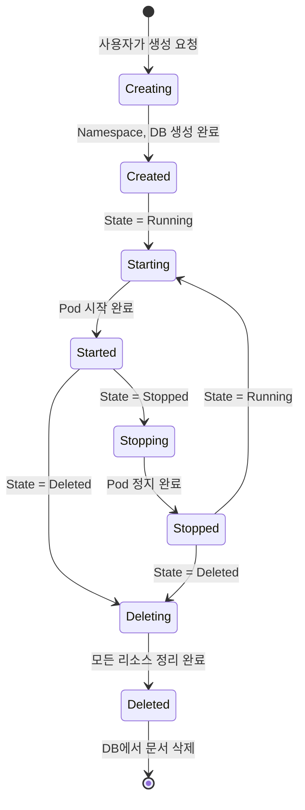
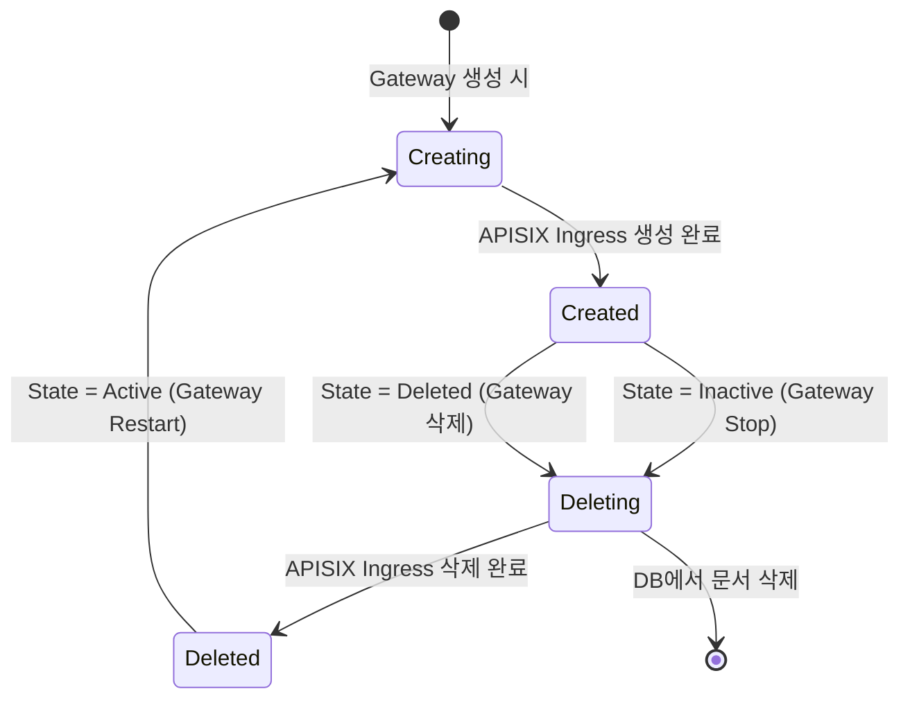
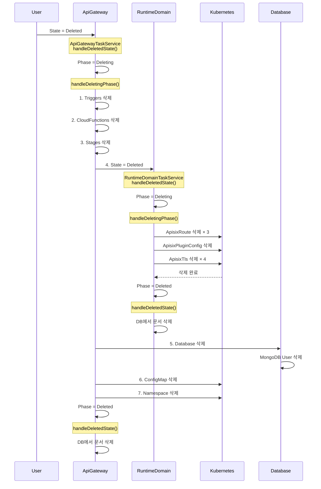

# State Machine 패턴으로 Kubernetes 리소스 생명주기 관리하기

> MongoDB + Kubernetes 환경에서 복잡한 리소스 의존성을 상태 머신으로 관리한 실제 사례

## TL;DR

- ✅ **State vs Phase** 분리: 사용자 의도(State)와 시스템 실행 상태(Phase)를 독립적으로 관리
- ✅ **자율적인 Document**: 각 Document가 자체 상태 머신을 가지고 연관 리소스를 정리
- ✅ **선언적 삭제**: `State = Deleted`로 설정하면 TaskService가 자동으로 Phase 전이 처리
- ✅ **안전한 Cascade**: MongoDB는 외래키가 없지만, 상태 머신으로 안전한 Cascade 삭제 구현
- ✅ **재시도 가능**: 각 단계마다 체크포인트로 실패 시 자동 재시도

이 글은 **[imprun.dev](https://imprun.dev)** 플랫폼에서 API Gateway, Pod, Database, Ingress 등 복잡한 Kubernetes 리소스를 상태 머신 패턴으로 관리한 경험을 공유합니다.

---

## 들어가며: MongoDB는 외래키가 없다

[imprun.dev](https://imprun.dev)는 Kubernetes 기반 API Gateway 플랫폼입니다. 하나의 API Gateway를 생성하면 다음과 같은 리소스가 함께 생성됩니다:

```
ApiGateway (MongoDB)
├── RuntimeDomain (MongoDB)
│   ├── ApisixRoute (K8s CRD) - dev
│   ├── ApisixRoute (K8s CRD) - staging
│   ├── ApisixRoute (K8s CRD) - prod
│   ├── ApisixPluginConfig (K8s CRD)
│   └── ApisixTls (K8s CRD) × 3
├── Instance (K8s Pod)
│   ├── Deployment (K8s)
│   ├── Service (K8s)
│   └── ConfigMap (K8s)
├── Database (MongoDB)
│   └── MongoDB User (Runtime)
├── Environment (MongoDB) × 3
│   └── ClientApp (MongoDB) × N
├── CloudFunction (MongoDB) × N
└── Stage (MongoDB) × 3
```

**문제**: API Gateway를 삭제할 때, 이 모든 리소스를 **안전하게 정리**해야 합니다.

하지만:
- ❌ **MongoDB에는 외래키가 없음** → CASCADE DELETE 불가
- ❌ **Kubernetes 리소스 삭제는 비동기** → 즉시 완료되지 않음
- ❌ **삭제 순서가 중요** → Ingress 먼저 삭제 후 Pod
- ❌ **실패 시 재시도 필요** → 네트워크 오류 등으로 실패 가능

관계형 DB라면 `ON DELETE CASCADE`로 간단하지만, MongoDB + Kubernetes 환경에서는 **애플리케이션 레벨에서 직접 구현**해야 합니다.

---

## State Machine 패턴으로 해결

imprun.dev는 **State Machine 패턴**으로 이 문제를 해결했습니다.

### 핵심 아이디어

각 Document가 **자체 상태 머신**을 가지고, TaskService가 1초마다 상태를 확인하며 자동으로 리소스를 정리합니다.

```typescript
@Cron(CronExpression.EVERY_SECOND)
async tick() {
  this.handleCreatingPhase()  // Phase: Creating → Created
  this.handleDeletingPhase()  // Phase: Deleting → Deleted
  this.handleInactiveState()  // State: Inactive → Phase: Deleting
  this.handleDeletedState()   // State: Deleted → Phase: Deleting
}
```

### State vs Phase: 핵심 설계

**State**: 사용자의 의도 (목표 상태)
- `Running`: 실행 중
- `Stopped`: 일시 정지
- `Deleted`: 완전 삭제

**Phase**: 시스템의 실행 상태 (현재 진행 중인 작업)
- `Creating` → `Created`: 리소스 생성 중
- `Starting` → `Started`: 시작 중
- `Stopping` → `Stopped`: 정지 중
- `Deleting` → `Deleted`: 삭제 중

**왜 분리했나요?**

```typescript
// ❌ State만 사용하면 문제 발생
gateway.state = 'Running'

// Pod 생성 중 어디까지 진행했는지 모름
// - Deployment 생성 완료?
// - Service 생성 완료?
// - Pod Ready 확인 완료?

// ✅ State + Phase로 분리하면 명확
gateway.state = 'Running'    // 사용자가 원하는 것
gateway.phase = 'Starting'   // 시스템이 하는 일
```

**예시**: Gateway Stop 요청
```
사용자 액션: State = Stopped
         ↓
TaskService: Phase = Stopping (Pod 삭제 시작)
         ↓
TaskService: Phase = Stopped (Pod 삭제 완료)
```

---

## Document별 상태 머신 설계

### 1. ApiGateway

**State**: `Running | Stopped | Restarting | Deleted`
**Phase**: `Creating | Created | Starting | Started | Stopping | Stopped | Deleting | Deleted`



**TaskService 핸들러**:
- `handleCreatingPhase()`: Namespace, Database, RuntimeDomain 생성
- `handleDeletingPhase()`: Trigger, Function, Stage, Database, RuntimeDomain 순차 삭제
- `handleDeletedState()`: Phase: Created/Started/Stopped → Deleting 전환

**MongoDB 스키마**:
```typescript
export class ApiGateway {
  gatewayId: string

  state: 'Running' | 'Stopped' | 'Restarting' | 'Deleted'
  phase: 'Creating' | 'Created' | 'Starting' | 'Started' |
         'Stopping' | 'Stopped' | 'Deleting' | 'Deleted'

  lockedAt: Date       // 동시성 제어용
  createdAt: Date
  updatedAt: Date
}
```

### 2. RuntimeDomain

**State**: `Active | Inactive | Deleted`
**Phase**: `Creating | Created | Deleting | Deleted`



**왜 RuntimeDomain이 독립적인 상태 머신을 가지나요?**

```typescript
// ApiGatewayTaskService
async handleDeletingPhase() {
  // RuntimeDomain 삭제 로직을 알 필요 없음!
  if (runtimeDomain) {
    await this.runtimeDomainService.deleteOne(gatewayId)
    // → runtimeDomain.state = 'Deleted' 설정만
  }
}

// RuntimeDomainTaskService가 알아서 처리
async handleDeletingPhase() {
  // K8s APISIX Ingress 삭제
  await deleteApisixRoute() // × 3 (dev, staging, prod)
  await deleteApisixPluginConfig()
  await deleteApisixTls() // × 4 (wildcard 3 + custom 1)
  await deleteCertificate() // customDomain이 있으면
}
```

**결합도 감소**: ApiGateway는 RuntimeDomain의 내부 구현을 몰라도 됩니다.

### 3. Database

**State**: `Active | Inactive | Deleted`
**Phase**: `Creating | Created | Deleting | Deleted`

```typescript
// DatabaseTaskService는 없음!
// ApiGatewayTaskService.handleDeletingPhase()에서 직접 삭제
if (database) {
  await this.databaseService.delete(database)
  // MongoDB database + user 삭제
}
```

**왜 별도 TaskService가 없나요?**
- Database는 다른 리소스에 의존성이 없음 (leaf node)
- 즉시 삭제 가능
- 상태 전이가 필요 없음

### 4. Instance (Pod)

**State/Phase 없음** - ApiGateway.phase에 따라 직접 관리

```typescript
// InstanceTaskService.handleStartingPhase()
if (gateway.phase === ApiGatewayPhase.Starting) {
  await instanceService.create(gatewayId)
  // → Deployment, Service 생성

  // Pod Ready 확인
  if (deployment.status.availableReplicas > 0) {
    gateway.phase = 'Started'
  }
}

// InstanceTaskService.handleStoppingPhase()
if (gateway.phase === ApiGatewayPhase.Stopping) {
  await instanceService.remove(gatewayId)
  // → Deployment 삭제 (Pod 종료)

  if (!deployment && !service) {
    gateway.phase = 'Stopped'
  }
}
```

**왜 Instance는 상태 머신이 없나요?**
- Instance는 ApiGateway의 부속품
- ApiGateway의 Phase가 곧 Instance의 상태
- 독립적인 생명주기가 없음

---

## Cascade 삭제: 상태 머신의 협력

Gateway 삭제 요청 시 다음과 같은 **상태 전이 체인**이 발생합니다:



### 단계별 동작

**1단계**: 사용자가 Gateway 삭제
```typescript
// API: PATCH /api-gateways/:id
await apiGatewayService.remove(gatewayId)
// → gateway.state = 'Deleted'
```

**2단계**: ApiGatewayTaskService 감지 (1초 이내)
```typescript
@Cron(CronExpression.EVERY_SECOND)
async tick() {
  this.handleDeletedState()
}

async handleDeletedState() {
  // State: Deleted, Phase: Stopped → Phase: Deleting
  await db.collection('ApiGateway').updateMany(
    {
      state: 'Deleted',
      phase: { $in: ['Created', 'Started', 'Stopped'] }
    },
    { $set: { phase: 'Deleting' } }
  )
}
```

**3단계**: ApiGatewayTaskService.handleDeletingPhase() 실행
```typescript
async handleDeletingPhase() {
  const gateway = await findAndLock()

  // 순차 삭제 (각 단계마다 체크포인트)
  const hadTriggers = await db.collection('CronTrigger')
    .countDocuments({ gatewayId })
  if (hadTriggers > 0) {
    await this.triggerService.removeAll(gatewayId)
    return // 다음 tick에 계속
  }

  const hadFunctions = await db.collection('CloudFunction')
    .countDocuments({ gatewayId })
  if (hadFunctions > 0) {
    await this.functionService.removeAll(gatewayId)
    return
  }

  const hadStages = await db.collection('Stage')
    .countDocuments({ gatewayId })
  if (hadStages > 0) {
    await this.stageService.removeAll(gatewayId)
    await this.apisixRouteService.deleteAllEnvironmentRoutes(region, gatewayId)
    return
  }

  // RuntimeDomain 삭제 (중요!)
  const runtimeDomain = await db.collection('RuntimeDomain')
    .findOne({ gatewayId })
  if (runtimeDomain) {
    await this.runtimeDomainService.deleteOne(gatewayId)
    // → runtimeDomain.state = 'Deleted' 마킹
    // → RuntimeDomainTaskService가 K8s 리소스 정리
    return
  }

  // Database 삭제
  const database = await db.collection('Database')
    .findOne({ gatewayId })
  if (database) {
    await this.databaseService.delete(database)
    return
  }

  // ConfigMap, Namespace 삭제
  await this.clusterService.deleteConfigMap(region, namespace)
  await this.clusterService.deleteNamespace(region, namespace)

  // 모든 리소스 삭제 완료 → Phase = Deleted
  await db.collection('ApiGateway').updateOne(
    { _id: gateway._id },
    { $set: { phase: 'Deleted' } }
  )
}
```

**4단계**: RuntimeDomainTaskService 감지
```typescript
// RuntimeDomain.state = 'Deleted'가 되면
async handleDeletedState() {
  // State: Deleted, Phase: Created → Phase: Deleting
  await db.collection('RuntimeDomain').updateMany(
    { state: 'Deleted', phase: { $in: ['Created', 'Creating'] } },
    { $set: { phase: 'Deleting' } }
  )
}
```

**5단계**: RuntimeDomainTaskService.handleDeletingPhase() 실행
```typescript
async handleDeletingPhase() {
  const domain = await findAndLock()

  // K8s APISIX CRD 삭제
  const environments = ['dev', 'staging', 'prod']
  for (const env of environments) {
    await k8s.deleteApisixRoute(`${gatewayId}-${env}`)
    await k8s.deleteApisixTls(`${gatewayId}-${env}-tls`)
  }
  await k8s.deleteApisixPluginConfig(`${gatewayId}-plugins`)

  // Custom domain TLS
  if (domain.customDomain) {
    await k8s.deleteApisixTls(`${gatewayId}-custom-tls`)
    await k8s.deleteCertificate(`${gatewayId}-runtime-custom-domain`)
  }

  // Phase = Deleted
  await db.collection('RuntimeDomain').updateOne(
    { _id: domain._id },
    { $set: { phase: 'Deleted' } }
  )
}
```

**6단계**: 최종 정리
```typescript
// ApiGatewayTaskService.handleDeletedState()
await db.collection('ApiGateway').deleteMany({
  state: 'Deleted',
  phase: 'Deleted'
})

// RuntimeDomainTaskService.handleDeletedState()
await db.collection('RuntimeDomain').deleteMany({
  state: 'Deleted',
  phase: 'Deleted'
})
```

---

## 이 패턴의 장점

### 1. 안전한 순차 삭제

```typescript
// ❌ 잘못된 방식: 한번에 삭제 시도
async delete(gatewayId) {
  await Promise.all([
    deleteTriggers(),
    deleteFunctions(),
    deleteDatabase(),
    deleteIngress(),  // ← Pod보다 먼저 삭제되면 트래픽 유실!
  ])
}

// ✅ 올바른 방식: 상태 머신으로 순차 처리
async handleDeletingPhase() {
  if (hadTriggers) return deleteTriggers()     // 1단계
  if (hadFunctions) return deleteFunctions()   // 2단계
  if (hadStages) return deleteStages()         // 3단계 (Ingress 먼저)
  if (runtimeDomain) return deleteDomain()     // 4단계 (K8s CRD)
  if (database) return deleteDatabase()        // 5단계
}
```

**왜 순차 삭제가 중요한가요?**

1. **트래픽 유실 방지**: Ingress 삭제 → Pod 삭제 순서
2. **DB 접근 오류 방지**: Pod 종료 → Database 삭제 순서
3. **의존성 관리**: 부모 리소스 먼저 정리 후 자식 리소스

### 2. 자동 재시도

```typescript
async handleDeletingPhase() {
  const gateway = await findAndLock()

  try {
    await deleteKubernetesResource()
  } catch (err) {
    // ❌ 실패해도 괜찮음!
    // Phase는 여전히 'Deleting'이므로
    // 다음 tick(1초 후)에 자동 재시도
    this.logger.error('Failed to delete resource', err)
  }
}
```

**실패 시나리오**:
```
Tick 1: ApisixRoute 삭제 시도 → 네트워크 오류
Tick 2: ApisixRoute 재시도 → 성공
Tick 3: ApisixPluginConfig 삭제 → 성공
```

### 3. 부분 실패 복구

중간에 서버가 재시작되어도 문제없습니다:

```
Phase: Deleting (Triggers 삭제 완료)
      ↓ 서버 재시작!
Phase: Deleting (다음 tick에서 Functions 삭제 계속)
      ↓
Phase: Deleting (Stages 삭제)
      ↓
Phase: Deleted
```

**왜 가능한가요?**
- 각 단계마다 `if (hadXXX) return deleteXXX()` 체크
- 이미 삭제된 리소스는 count = 0이므로 skip
- 남은 리소스부터 다시 시작

### 4. 독립적인 Document

각 Document가 자체 상태 머신을 가지므로 **결합도가 낮습니다**:

```typescript
// ApiGatewayTaskService는 RuntimeDomain 삭제 로직을 모름
await this.runtimeDomainService.deleteOne(gatewayId)
// → runtimeDomain.state = 'Deleted' 설정만

// RuntimeDomainTaskService가 알아서 처리
// → K8s Ingress 삭제
// → Certificate 삭제
// → DB 문서 삭제
```

**장점**:
- 각 Document의 책임이 명확
- RuntimeDomain 삭제 로직 변경 시 ApiGateway는 영향 없음
- 테스트가 쉬움 (독립적으로 테스트 가능)

### 5. 선언적 API

```typescript
// ❌ 명령형 (어떻게 삭제할지 명시)
await apiGateway.stopPod()
await apiGateway.deleteIngress()
await apiGateway.deleteDomain()
await apiGateway.deleteDatabase()

// ✅ 선언형 (무엇을 원하는지만 명시)
apiGateway.state = 'Deleted'
// TaskService가 알아서 처리
```

**사용자 코드**:
```typescript
// Gateway 정지
await apiGatewayService.stop(gatewayId)
// → gateway.state = 'Stopped'
// → InstanceTaskService가 Pod 종료

// Gateway 삭제
await apiGatewayService.remove(gatewayId)
// → gateway.state = 'Deleted'
// → ApiGatewayTaskService가 모든 리소스 정리
```

---

## 실제 사례: vn8ofl Gateway 정리 문제

개발 중 다음과 같은 문제가 발생했습니다:

```bash
# MongoDB 상태 확인
> db.ApiGateway.findOne({ gatewayId: 'vn8ofl' })
{
  gatewayId: 'vn8ofl',
  state: 'Stopped',     # ← 문제!
  phase: 'Stopped'
}

> db.RuntimeDomain.findOne({ gatewayId: 'vn8ofl' })
{
  gatewayId: 'vn8ofl',
  state: 'Inactive',
  phase: 'Deleted'
}

> db.Stage.find({ gatewayId: 'vn8ofl' }).count()
3  # ← 정리 안됨!

> db.Database.find({ gatewayId: 'vn8ofl' }).count()
1  # ← 정리 안됨!
```

**원인**: `State: Stopped`인 Gateway는 어떤 핸들러도 처리하지 않음!

```typescript
// ApiGatewayTaskService
handleDeletedState() {
  // State: Deleted만 처리
  updateMany(
    { state: 'Deleted', ... },  // ← Stopped는 매칭 안됨!
    { $set: { phase: 'Deleting' } }
  )
}

handleStoppedState() {
  // State: Stopped → Phase: Stopping만 처리
  updateMany(
    { state: 'Stopped', phase: 'Started' },
    { $set: { phase: 'Stopping' } }
  )
}
```

**해결**: 수동으로 State 변경
```bash
> db.ApiGateway.updateOne(
    { gatewayId: 'vn8ofl' },
    { $set: { state: 'Deleted' } }
  )

# → handleDeletedState()가 감지
# → Phase: Deleting 전환
# → 모든 리소스 정리
```

**교훈**:
- State Machine은 **State 기반**으로 동작
- State가 잘못 설정되면 아무 일도 일어나지 않음
- 디버깅 시 State/Phase 모두 확인 필요

---

## 주의사항

### 1. 삭제 순서 중요

```typescript
// ❌ 잘못된 순서
deleteDatabase()  // MongoDB User 삭제
deletePod()       // ← 실행 중인 Pod가 DB 접근 불가!

// ✅ 올바른 순서
deleteStages()     // Ingress 먼저 (트래픽 차단)
deletePod()        // Pod 종료
deleteDatabase()   // DB 정리
```

### 2. State vs Phase 혼동 방지

```typescript
// ❌ 잘못된 사용
if (gateway.phase === 'Stopped') {  // Phase 확인
  // 실행 중인지 판단
}

// ✅ 올바른 사용
if (gateway.state === 'Running') {  // State 확인
  // 사용자가 실행 중으로 설정했는지 판단
}

if (gateway.phase === 'Started') {  // Phase 확인
  // Pod가 실제로 실행 중인지 판단
}
```

### 3. Phase 전이는 단방향

```typescript
// ❌ 잘못된 전이
phase: 'Deleting' → 'Created'  // 삭제 중에 생성으로 돌아갈 수 없음!

// ✅ 올바른 전이
phase: 'Deleting' → 'Deleted'  // 삭제 완료
state: 'Active' → phase: 'Creating'  // 새로 생성 시작
```

**예외**: RuntimeDomain은 Stop/Start 시 재생성
```typescript
// Gateway Stop
state: 'Active' → 'Inactive'
phase: 'Created' → 'Deleting' → 'Deleted'

// Gateway Restart
state: 'Inactive' → 'Active'
phase: 'Deleted' → 'Creating' → 'Created'
```

---

## 동시성 제어는?

이 블로그에서는 State Machine 패턴에 집중했습니다. 하지만 실제 구현에서는 **동시성 제어**도 중요합니다:

```typescript
async handleDeletingPhase() {
  // 여러 서버에서 동시에 tick() 실행 시
  // 같은 Gateway를 중복 처리하면?
  const gateway = await findAndLock()  // ← 이 부분!
}
```

이 문제는 **Optimistic Lock 패턴**으로 해결합니다. 자세한 내용은 다음 블로그를 참고하세요:
- [분산 환경에서 Optimistic Lock으로 동시성 제어하기](https://blog.imprun.dev/47)

---

## 결론

MongoDB + Kubernetes 환경에서 복잡한 리소스 의존성을 관리하는 것은 어려운 문제입니다.

imprun.dev는 **State Machine 패턴**으로:
- ✅ 안전한 Cascade 삭제 구현 (순차 삭제)
- ✅ 자동 재시도로 안정성 확보 (네트워크 오류 대응)
- ✅ 독립적인 Document로 결합도 감소 (유지보수 용이)
- ✅ 선언적 API로 간결한 코드 (State 설정만)

**핵심 설계**:
1. **State vs Phase 분리**: 사용자 의도 vs 시스템 실행 상태
2. **각 Document가 상태 머신**: 자율적인 리소스 관리
3. **TaskService로 자동화**: 1초마다 상태 확인 및 전이
4. **순차 삭제**: 각 단계마다 체크포인트로 안전성 확보

외래키 없는 NoSQL + 비동기 Kubernetes 환경에서도 **안전하고 예측 가능한 리소스 관리**가 가능합니다.

---

**다음 읽을거리**:
- [분산 환경에서 Optimistic Lock으로 동시성 제어하기](https://blog.imprun.dev/47) - findAndLock() 구현 방법
- [imprun.dev GitHub](https://github.com/imprun-dev/imprun)
- [State Pattern - Refactoring.Guru](https://refactoring.guru/design-patterns/state)
- [Kubernetes API Conventions - State Machines](https://github.com/kubernetes/community/blob/master/contributors/devel/sig-architecture/api-conventions.md#spec-and-status)

---

> "각 Document가 자체 상태 머신을 가지면, 복잡한 의존성도 독립적으로 관리할 수 있다"

🤖 *이 블로그는 [**imprun.dev**](https://imprun.dev) 플랫폼 개발 과정에서 실제로 구현한 State Machine 기반 리소스 관리 시스템을 소개합니다.*
