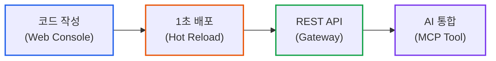
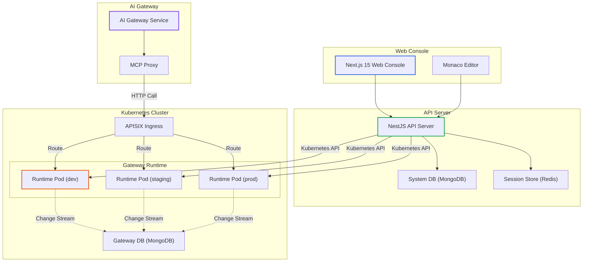
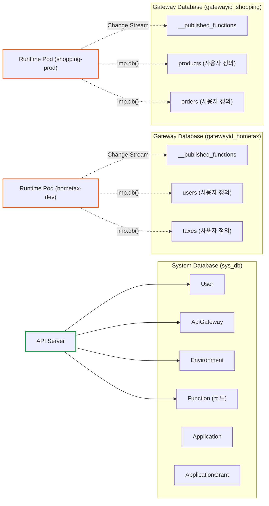
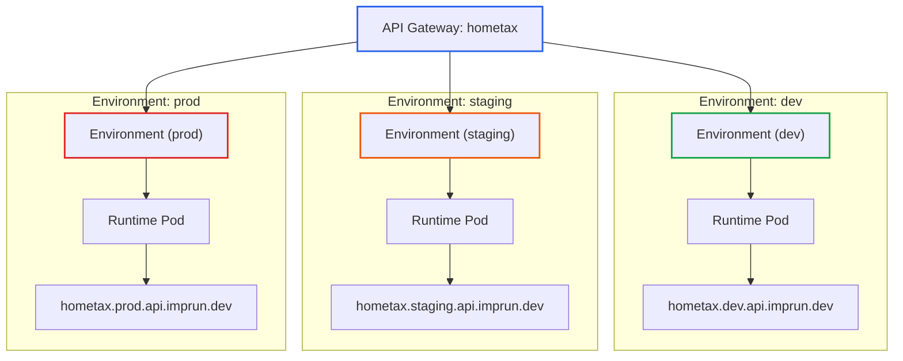
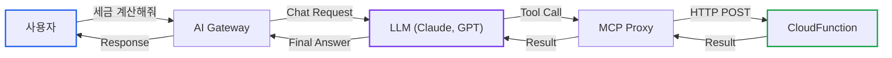
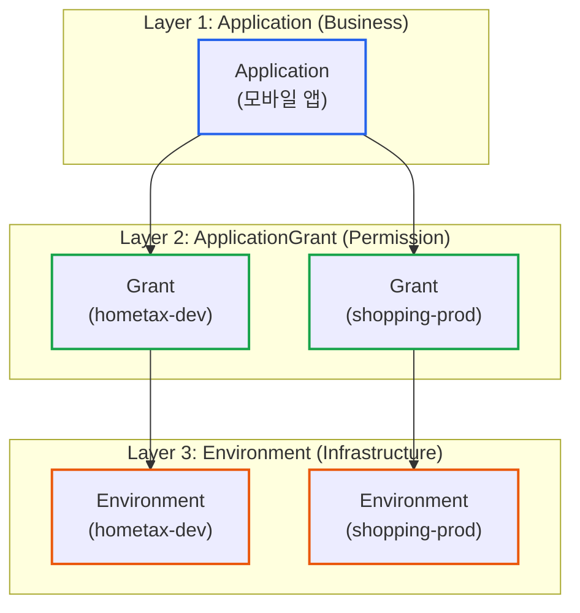
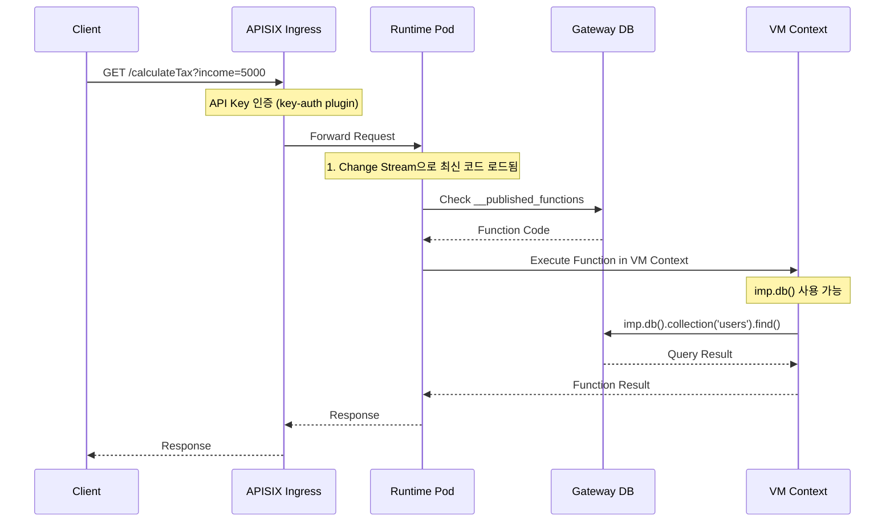

# imprun Platform 아키텍처: API 개발부터 AI 통합까지

**작성일:** 2025-11-02
**카테고리:** Platform Architecture, API Gateway, Kubernetes
**난이도:** 고급

---

## TL;DR

- **문제**: REST API 개발과 배포가 복잡하고, AI 에이전트와의 통합이 어려웠습니다.
- **해결**: CloudFunction 기반 API 개발 + Kubernetes 자동 배포 + MCP Tool 통합을 하나의 플랫폼으로 제공했습니다.
- **핵심**:
  - **Hot Reload**: MongoDB Change Stream으로 1초 이내 배포
  - **State Machine**: Phase 기반 리소스 생명주기 관리
  - **Multi-tenant DB**: Gateway별 독립 MongoDB 데이터베이스
  - **Environment 분리**: dev/staging/prod 환경 자동 생성
  - **AI 통합**: CloudFunction을 MCP Tool로 변환하여 AI 에이전트가 직접 호출
- **결과**: 코드 작성부터 배포, AI 통합까지 웹 콘솔 하나로 완결되는 통합 API Platform 완성

---

## 들어가며

[**imprun.dev**](https://imprun.dev)는 **"API 개발부터 AI 통합까지, 모든 것을 하나로"** 제공하는 Kubernetes 기반 API Platform입니다.

개발자는 웹 브라우저에서 CloudFunction 코드를 작성하고, 버튼 클릭 한 번으로 REST API를 배포하며, AI 에이전트가 이 API를 Tool로 사용할 수 있게 만들 수 있습니다.



**이 글에서 다룰 내용**:
- [imprun](https://imprun.dev) Platform의 전체 아키텍처
- Hot Reload 배포 메커니즘
- State Machine 기반 리소스 관리
- Multi-tenant Database 설계
- AI Gateway와 MCP Tool 통합

---

## 1. Platform 개요

### 1.1 [imprun](https://imprun.dev)이 해결하는 문제

**기존 REST API 개발의 불편함**:
- 로컬 개발 환경 구축 (Node.js, DB, Redis 설치)
- Git 커밋/푸시 → CI/CD 파이프라인 대기 (5~10분)
- Kubernetes 배포 설정 작성 (Deployment, Service, Ingress)
- 환경별(dev/staging/prod) 설정 관리
- AI 에이전트와 통합하려면 별도 서버 필요

**[imprun](https://imprun.dev)의 접근**:
- ✅ 웹 브라우저가 IDE (Monaco Editor)
- ✅ 코드 저장 즉시 배포 (1초 이내, Hot Reload)
- ✅ Kubernetes 리소스 자동 생성
- ✅ 3개 환경(dev/staging/prod) 자동 구성
- ✅ CloudFunction → MCP Tool 자동 변환

### 1.2 핵심 구성 요소



**계층별 역할**:

1. **Web Console**: CloudFunction 작성 및 배포 UI
2. **API Server**: Platform 전체 관리 (Gateway, Function, User, Auth)
3. **Kubernetes Cluster**: Runtime Pod 실행 및 트래픽 라우팅
4. **AI Gateway**: LLM 통합 및 MCP Tool 오케스트레이션

---

## 2. 핵심 아키텍처 패턴

### 2.1 Hot Reload: MongoDB Change Stream

**전통적인 배포 방식**:
```
코드 변경 → Git Push → CI 빌드 → 이미지 빌드 → Kubernetes 배포 → Pod 재시작 (5~10분)
```

**[imprun](https://imprun.dev)의 Hot Reload**:
```
코드 저장 → MongoDB 저장 → Change Stream 감지 → VM 재로드 (1초 이내)
```

**구현 세부사항**:

```typescript
// 1. FunctionService: 사용자가 Function 배포
async publish(gatewayId: string, functionId: string, environment: string) {
  const func = await this.findOne(gatewayId, functionId)

  // Gateway 전용 Database의 __published_functions 컬렉션에 저장
  const gatewayDb = this.getGatewayDb(gatewayId)

  await gatewayDb.collection('__published_functions').updateOne(
    { name: func.name, environment },
    {
      $set: {
        name: func.name,
        code: func.code,
        environment,
        publishedAt: new Date()
      }
    },
    { upsert: true }
  )

  // ✨ Change Stream이 자동으로 Runtime Pod에 전파
}
```

```typescript
// 2. Runtime Pod: Change Stream 감지 및 Hot Reload
const changeStream = db.collection('__published_functions').watch()

changeStream.on('change', async (change) => {
  if (change.operationType === 'insert' || change.operationType === 'update') {
    const func = change.fullDocument

    // VM Context 재생성 (Cold Start 없음!)
    this.vmContexts.set(func.name, this.createVMContext(func.code))

    console.log(`✅ Hot Reload: ${func.name} (${Date.now() - func.publishedAt.getTime()}ms)`)
  }
})
```

**Hot Reload의 장점**:
- **빠른 배포**: 1초 이내 코드 반영
- **무중단**: Pod 재시작 없이 VM Context만 재생성
- **비용 절감**: 이미지 빌드/푸시 불필요
- **개발 경험**: 즉각적인 피드백으로 생산성 향상

### 2.2 State Machine: Phase 기반 리소스 관리

API Gateway 생성 시 여러 Kubernetes 리소스(Namespace, Deployment, Service, Ingress, Database)를 순차적으로 프로비저닝해야 합니다. 이를 **State Machine + Background Task** 패턴으로 안정적으로 관리합니다.

**Gateway Phase Lifecycle**:

```
Creating → Created → Starting → Started
   ↓          ↓         ↓          ↓
Deleting ← ← ← ← ← ← ← ← ← ← Deleted
```

**Phase별 작업**:

| Phase | 작업 내용 | 완료 조건 |
|-------|---------|----------|
| Creating | Namespace, Database, Environment 3개 생성 | 모든 Environment가 Created 상태 |
| Created | Environment별 Runtime Pod 배포 | 모든 Pod가 Ready 상태 |
| Starting | APISIX Route 생성, Health Check | 모든 Pod 응답 확인 |
| Started | 정상 운영 중 | - |

**Background Task 구현**:

```typescript
@Injectable()
export class ApiGatewayTaskService {
  @Cron('*/1 * * * * *')  // 매초 실행
  async tick() {
    await this.handleCreatingPhase()
    await this.handleCreatedPhase()
    await this.handleStartingPhase()
  }

  async handleCreatingPhase() {
    // Optimistic Lock: 처리 중이지 않은 Gateway만 선택
    const gateway = await this.db.findOneAndUpdate(
      {
        phase: 'Creating',
        lockedAt: { $lt: new Date(Date.now() - 60000) }  // 60초 이상 지난 것만
      },
      { $set: { lockedAt: new Date() } },
      { sort: { lockedAt: 1, updatedAt: 1 }, returnDocument: 'after' }
    )

    if (!gateway) return

    try {
      // 1. Namespace 생성 (멱등성 보장)
      await this.k8sService.createNamespace(gateway.gatewayId)

      // 2. Environment 3개 생성 (dev/staging/prod)
      for (const envName of ['dev', 'staging', 'prod']) {
        await this.environmentService.create({
          gatewayId: gateway.gatewayId,
          name: envName,
          domain: `${gateway.gatewayId}-${envName}.api.imprun.dev`,
          phase: 'Creating'
        })
      }

      // 3. Gateway Database 생성
      await this.databaseService.createGatewayDatabase(gateway.gatewayId)

      // 4. 모든 Environment가 Created 상태인지 확인
      const allCreated = await this.environmentService.checkAllCreated(gateway.gatewayId)

      if (allCreated) {
        // Phase 전환: Creating → Created
        await this.db.updateOne(
          { gatewayId: gateway.gatewayId },
          {
            $set: {
              phase: 'Created',
              lockedAt: null
            }
          }
        )
      }
    } finally {
      // Lock 해제
      await this.db.updateOne(
        { gatewayId: gateway.gatewayId },
        { $set: { lockedAt: new Date(0) } }
      )
    }
  }
}
```

**State Machine의 장점**:
- **명확한 상태**: 각 Gateway의 현재 상태를 명확히 파악
- **멱등성**: 실패 시 재시도해도 안전
- **복구 가능**: Lock timeout으로 자동 복구
- **확장 가능**: 새로운 Phase 추가 용이

### 2.3 Optimistic Locking: 동시성 제어

여러 Background Task 인스턴스가 동시에 실행될 때, 같은 Gateway를 중복 처리하지 않도록 `lockedAt` 필드를 사용한 낙관적 락을 구현했습니다.

**Optimistic Lock 패턴**:

```typescript
// 1. Lock 획득 시도 (findOneAndUpdate로 원자적 수행)
const gateway = await db.findOneAndUpdate(
  {
    phase: 'Creating',
    lockedAt: { $lt: new Date(Date.now() - 60000) }  // 60초 이상 지난 것만
  },
  { $set: { lockedAt: new Date() } },  // 현재 시각으로 Lock
  { sort: { lockedAt: 1, updatedAt: 1 }, returnDocument: 'after' }
)

// 2. Lock 획득 실패 시 (다른 Task가 처리 중)
if (!gateway) return

// 3. 작업 수행
try {
  await processGateway(gateway)
} finally {
  // 4. Lock 해제 (INIT_TIME = new Date(0)으로 설정)
  await db.updateOne(
    { gatewayId: gateway.gatewayId },
    { $set: { lockedAt: new Date(0) } }
  )
}
```

**Lock Timeout 전략**:
- **정상 처리**: 작업 완료 후 `lockedAt = INIT_TIME` 설정
- **실패/타임아웃**: 60초 경과 시 다른 Task가 재시도
- **멱등성 보장**: 각 단계는 중복 실행되어도 안전하게 설계

---

## 3. Multi-tenant Database 설계

### 3.1 Database 분리 전략

[imprun](https://imprun.dev)은 **System Database**와 **Gateway Database**를 분리하여 데이터 격리와 성능을 보장합니다.



**System Database (`sys_db`)**:
- Platform 관리 데이터
- User, ApiGateway, Environment, Function, Application, ApplicationGrant
- API Server만 접근

**Gateway Database (`gatewayid_{gatewayId}`)**:
- Gateway별 독립 데이터베이스
- `__published_functions`: 배포된 CloudFunction (Change Stream 대상)
- 사용자 정의 컬렉션: CloudFunction에서 자유롭게 생성
- Runtime Pod만 접근 (`imp.db()` API)

### 3.2 Database ACL

CloudFunction에서는 `imp.db()` API를 통해 Gateway Database에 접근하며, ACL 규칙으로 권한을 제어합니다.

```typescript
// CloudFunction 코드 예시
export default async function(req, res) {
  // imp.db()는 현재 Gateway의 Database에만 접근
  const users = await imp.db().collection('users').find({}).toArray()

  // ❌ 다른 Gateway의 Database 접근 불가
  // ❌ System Database 접근 불가

  return res.json({ users })
}
```

**ACL 규칙**:
- ✅ 현재 Gateway의 Database만 접근 가능
- ✅ 모든 컬렉션 읽기/쓰기 허용
- ❌ `__published_functions` 컬렉션 수정 금지
- ❌ 다른 Gateway Database 접근 금지
- ❌ System Database 접근 금지

---

## 4. Environment 아키텍처

### 4.1 dev/staging/prod 자동 구성

API Gateway 생성 시 3개 Environment가 자동으로 생성되며, 각각 독립적인 Runtime Pod와 도메인을 가집니다.



**Environment Entity 구조**:

```typescript
{
  _id: ObjectId,
  gatewayId: "hometax",
  name: "dev" | "staging" | "prod",
  domain: "hometax.dev.api.imprun.dev",
  customDomain?: "api.hometax.com",
  authType: "key-auth" | "none",
  plugins: [...],  // APISIX Plugins
  state: "active" | "inactive",
  phase: "Creating" | "Created",
  createdAt: Date,
  updatedAt: Date
}
```

### 4.2 Promotion Pipeline

CloudFunction을 dev → staging → prod로 순차적으로 승격할 수 있습니다.

```typescript
// Promotion API
POST /api-gateways/:gatewayId/functions/:functionId/promote
{
  from: "dev",
  to: "staging"
}

// 구현
async promote(gatewayId: string, functionId: string, from: string, to: string) {
  // 1. 소스 Environment에서 Function 조회
  const func = await this.findOnePublished(gatewayId, functionId, from)

  if (!func) {
    throw new NotFoundException(`Function not found in ${from}`)
  }

  // 2. 타겟 Environment에 배포
  await this.publish(gatewayId, functionId, to)

  // 3. 배포 히스토리 기록
  await this.deploymentHistoryService.create({
    gatewayId,
    functionId,
    environment: to,
    version: func.version,
    promotedFrom: from
  })
}
```

---

## 5. AI Gateway 통합

### 5.1 MCP (Model Context Protocol) Tool

CloudFunction을 AI 에이전트가 호출할 수 있는 MCP Tool로 변환합니다.



**MCP Tool 등록**:

```typescript
// 1. CloudFunction 작성
export default async function calculateTax(req, res) {
  const { income, deductions } = req.body
  const tax = (income - deductions) * 0.22
  return res.json({ tax })
}

// 2. MCP Tool로 등록
POST /ai-gateway/mcp-tools
{
  "name": "calculate_tax",
  "description": "소득세를 계산합니다",
  "functionUrl": "https://hometax.prod.api.imprun.dev/calculateTax",
  "inputSchema": {
    "type": "object",
    "properties": {
      "income": { "type": "number" },
      "deductions": { "type": "number" }
    },
    "required": ["income", "deductions"]
  }
}

// 3. AI Chat에서 사용
POST /ai-gateway/chat
{
  "messages": [
    { "role": "user", "content": "연봉 5000만원, 공제 1000만원일 때 세금 계산해줘" }
  ]
}

// LLM이 자동으로 calculate_tax Tool 호출 → 결과 반환
```

### 5.2 Multi-LLM Support

AI Gateway는 여러 LLM Provider를 지원하며, Adaptor 패턴으로 통일된 인터페이스를 제공합니다.

```typescript
// Adaptor Interface
interface IAdaptor {
  chatCompletion(params: ChatCompletionParams): Promise<ChatCompletionResponse>
}

// OpenAI Adaptor
export class OpenAIAdaptor implements IAdaptor {
  async chatCompletion(params) {
    const response = await this.openai.chat.completions.create({
      model: params.model,
      messages: params.messages,
      tools: params.tools
    })
    return this.normalize(response)
  }
}

// Anthropic Adaptor
export class AnthropicAdaptor implements IAdaptor {
  async chatCompletion(params) {
    const response = await this.anthropic.messages.create({
      model: params.model,
      messages: params.messages,
      tools: params.tools
    })
    return this.normalize(response)
  }
}

// Factory Pattern
export class AdaptorFactory {
  create(provider: string): IAdaptor {
    switch (provider) {
      case 'openai': return new OpenAIAdaptor()
      case 'anthropic': return new AnthropicAdaptor()
      case 'local': return new LocalAdaptor()
      default: throw new Error(`Unknown provider: ${provider}`)
    }
  }
}
```

---

## 6. Application-Grant 인증 아키텍처

### 6.1 3-Layer 구조

외부 Consumer가 API Gateway를 사용하려면 Application을 생성하고, Grant를 통해 특정 Environment에 접근 권한을 부여받습니다.



**핵심 원칙**:
- **Application은 Gateway 독립적**: 여러 Gateway/Environment 접근 가능
- **Grant는 N:M 관계**: 하나의 Application이 여러 Gateway/Environment에 Grant 보유
- **API Key는 Grant당 1개**: AES-256 암호화, 평문은 생성 시 1회만 노출

### 6.2 API Key 보안

```typescript
// 1. API Key 생성 (ApplicationGrantService)
async create(dto: CreateApplicationGrantDto) {
  const apiKey = this.generateApiKey()  // 32바이트 랜덤
  const encryptedKey = this.encrypt(apiKey)  // AES-256-CBC

  const grant = await this.db.insert({
    applicationId: dto.applicationId,
    gatewayId: dto.gatewayId,
    environment: dto.environment,
    credentialId: `${dto.gatewayId}-${dto.environment}-${dto.appId}`,
    credentialSecret: encryptedKey,
    active: true
  })

  // ✅ 평문 API Key는 생성 시 1회만 반환
  return {
    ...grant,
    apiKey  // 이후 다시 조회 불가
  }
}

// 2. APISIX Consumer 생성 (자동)
await this.apisixService.createOrUpdateConsumer(
  region,
  namespace,
  environment,
  {
    username: grant.credentialId,
    plugins: {
      'key-auth': {
        key: apiKey  // APISIX에는 평문 전달
      }
    }
  }
)
```

---

## 7. 전체 Request Flow

사용자 요청이 CloudFunction까지 도달하는 전체 흐름을 살펴보겠습니다.



**각 단계 설명**:

1. **Client → APISIX**: API Key 포함하여 요청
2. **APISIX 인증**: `key-auth` Plugin으로 Consumer 확인
3. **APISIX → Runtime**: 인증 성공 시 Runtime Pod로 라우팅
4. **Runtime**: Change Stream으로 최신 코드 로드 완료 (Hot Reload)
5. **VM Context**: Function 실행 (Sandbox 환경)
6. **imp.db()**: Gateway Database 접근 (ACL 적용)
7. **Response**: 결과 반환

---

## 8. 성능 및 확장성

### 8.1 Hot Reload 성능

**측정 결과**:
- MongoDB 저장 → Change Stream 감지: **평균 50ms**
- VM Context 재생성: **평균 20ms**
- 총 배포 시간: **70ms ~ 1초**

**전통적인 배포 대비**:
- 이미지 빌드/푸시: 3~5분 → **제거**
- Pod 재시작: 30초~1분 → **제거**
- Health Check: 10초 → **제거**

### 8.2 Multi-tenant 확장

**Gateway별 격리**:
- 독립 Database → 데이터 격리 및 성능 보장
- 독립 Runtime Pod → 리소스 격리 (CPU, Memory)
- 독립 도메인 → 트래픽 분산

**Kubernetes HPA**:
```yaml
apiVersion: autoscaling/v2
kind: HorizontalPodAutoscaler
metadata:
  name: hometax-dev-runtime
spec:
  scaleTargetRef:
    apiVersion: apps/v1
    kind: Deployment
    name: hometax-dev-runtime
  minReplicas: 1
  maxReplicas: 10
  metrics:
  - type: Resource
    resource:
      name: cpu
      target:
        type: Utilization
        averageUtilization: 70
```

### 8.3 Background Task 독립 실행

각 TaskService는 **독립적으로 Cron 실행**되므로, 여러 Gateway를 동시에 프로비저닝할 수 있습니다.

```typescript
// ApiGatewayTaskService
@Cron('*/1 * * * * *')
async tick() {
  // Fire-and-Forget 패턴 (에러만 로깅)
  this.handleCreatingPhase().catch((err) => this.logger.error(err))
  this.handleDeletingPhase().catch((err) => this.logger.error(err))
}

// EnvironmentTaskService
@Cron('*/1 * * * * *')
async tick() {
  this.handleCreatingPhase().catch((err) => this.logger.error(err))
  this.handleDeletingPhase().catch((err) => this.logger.error(err))
}

// InstanceTaskService
@Cron('*/5 * * * * *')
async tick() {
  this.handleStartingPhase().catch((err) => this.logger.error(err))
  this.handleStoppingPhase().catch((err) => this.logger.error(err))
}
```

**장점**:
- 각 TaskService가 독립적으로 동작
- 하나의 Phase 실패가 다른 Phase에 영향 없음
- Optimistic Lock으로 동시성 제어

---

## 9. 실전 예시: 홈택스 API 구축

전체 아키텍처를 활용하여 홈택스 API를 구축하는 과정을 살펴보겠습니다.

### 9.1 API Gateway 생성

```bash
# Web Console에서 생성
POST /api-gateways
{
  "name": "홈택스 API",
  "regionId": "64a7b2c3...",
  "bundle": {
    "runtime": "nodejs20",
    "memory": "512Mi",
    "cpu": "500m"
  }
}

# Response
{
  "gatewayId": "hometax",
  "phase": "Creating",
  "environments": []
}

# Background Task가 자동으로:
# 1. Namespace 생성
# 2. dev/staging/prod Environment 3개 생성
# 3. Gateway Database 생성
# 4. Runtime Pod 3개 배포
# → 약 30초 후 phase: "Started"
```

### 9.2 CloudFunction 작성 및 배포

```typescript
// Web Console Monaco Editor에서 작성
export default async function calculateTax(req, res) {
  const { income, deductions } = req.body

  // Validation
  if (!income || !deductions) {
    return res.status(400).json({ error: 'Missing required fields' })
  }

  // 세금 계산
  const taxableIncome = income - deductions
  const tax = taxableIncome * 0.22

  // Database 저장
  await imp.db().collection('tax_calculations').insertOne({
    income,
    deductions,
    tax,
    calculatedAt: new Date()
  })

  return res.json({ tax })
}
```

```bash
# dev 환경에 배포
POST /api-gateways/hometax/functions/calculateTax/publish
{ "environment": "dev" }

# ✅ 1초 이내에 배포 완료 (Hot Reload)
# 호출: GET https://hometax.dev.api.imprun.dev/calculateTax?income=5000&deductions=1000
```

### 9.3 Application 생성 및 API Key 발급

```bash
# 1. Application 생성
POST /applications
{
  "name": "모바일 앱",
  "description": "홈택스 모바일 앱",
  "organization": "국세청"
}

# 2. Grant 생성 (dev 환경 접근 권한)
POST /application-grants
{
  "applicationId": "64a7b2c3...",
  "gatewayId": "hometax",
  "environment": "dev"
}

# Response
{
  "grantId": "64a7b2c4...",
  "credentialId": "hometax-dev-app123",
  "apiKey": "sk_live_abc123def456...",  # ✅ 평문은 이번 1회만 노출
  "credentialReference": {
    "apisixConsumerId": "hometax-dev-app123"
  }
}
```

### 9.4 API 호출 (Client)

```bash
# API Key로 인증하여 호출
curl -X POST https://hometax.dev.api.imprun.dev/calculateTax \
  -H "apikey: sk_live_abc123def456..." \
  -H "Content-Type: application/json" \
  -d '{
    "income": 50000000,
    "deductions": 10000000
  }'

# Response
{
  "tax": 8800000
}
```

### 9.5 Promotion (dev → prod)

```bash
# dev 테스트 완료 후 staging으로 배포
POST /api-gateways/hometax/functions/dev%2FcalculateTax/deploy-to-stage
{
  "targetStage": "staging"
}

# Response: staging/calculateTax 생성 (source.semver 상속)
# History: "Deployed from dev to staging (version: 1.0.0)"

# staging 테스트 완료 후 prod로 배포
POST /api-gateways/hometax/functions/staging%2FcalculateTax/deploy-to-stage
{
  "targetStage": "prod"
}

# Response: prod/calculateTax 생성
# History: "Deployed from staging to prod (version: 1.0.0)"

# ✅ 각 배포 1초 이내 완료 (Hot Reload)
# ✅ Promotion Pipeline 활성화 시 stage 순서 자동 검증
```

### 9.6 AI 통합 (MCP Tool)

```bash
# 1. MCP Tool 등록
POST /ai-gateway/mcp-tools
{
  "name": "calculate_tax",
  "description": "소득세를 계산합니다",
  "functionUrl": "https://hometax.prod.api.imprun.dev/calculateTax",
  "inputSchema": {
    "type": "object",
    "properties": {
      "income": { "type": "number", "description": "연간 소득" },
      "deductions": { "type": "number", "description": "공제액" }
    },
    "required": ["income", "deductions"]
  }
}

# 2. AI Chat에서 사용
POST /ai-gateway/chat
{
  "messages": [
    { "role": "user", "content": "연봉 5천만원, 공제 1천만원일 때 세금 계산해줘" }
  ]
}

# AI가 자동으로 calculate_tax Tool 호출 → 결과 생성
# Response:
{
  "choices": [
    {
      "message": {
        "role": "assistant",
        "content": "연봉 5천만원에서 공제 1천만원을 제외하면 과세 대상 소득은 4천만원입니다. 세율 22%를 적용하면 세금은 8,800,000원입니다."
      }
    }
  ]
}
```

---

## 10. 개발 경험 및 배운 점

### 10.1 기술적 도전

**Hot Reload 구현의 어려움**:
- 초기에는 WebSocket으로 코드를 전송했으나, 연결 안정성 문제 발생
- MongoDB Change Stream으로 전환하여 안정성과 순서 보장 확보
- VM Context 재생성 시 메모리 누수 방지 (명시적 가비지 컬렉션)

**State Machine 복잡도**:
- Phase 전환 조건이 복잡하여 초기 구현 시 무한 루프 발생
- Optimistic Lock으로 동시성 문제 해결
- 멱등성을 보장하는 코드 작성이 핵심

**Multi-tenant Database 성능**:
- Gateway가 1000개 이상으로 증가 시 MongoDB 연결 풀 부족
- Connection Pooling 전략 개선 (Gateway당 최소 연결 수 제한)
- Database Sharding 도입 고려 중

### 10.2 아키텍처 선택의 trade-off

**Hot Reload vs. 이미지 빌드**:
- 장점: 빠른 배포, 개발 경험 향상
- 단점: 코드 버전 관리 어려움 (Git과 분리)
- 해결: Deployment History 기록, Git 통합 계획

**State Machine vs. Event-Driven**:
- 장점: 명확한 상태, 복구 용이
- 단점: Polling 방식으로 리소스 사용량 증가
- 해결: Cron 주기 최적화, Phase별 독립 처리

**Multi-tenant DB vs. Shared DB**:
- 장점: 완전한 데이터 격리, 성능 보장
- 단점: Database 수 증가로 관리 복잡도 증가
- 해결: 자동화된 Database 생성/삭제, Monitoring 강화

---

## 11. 향후 계획

### 11.1 단기 계획 (1~3개월)

**Enhanced Observability**:
- CloudFunction 실행 로그 수집 (Loki)
- Metrics 수집 (Prometheus)
- Distributed Tracing (Jaeger)

**Testing Infrastructure**:
- E2E 테스트 자동화
- Performance 테스트 (K6)
- Chaos Engineering (실패 시나리오 테스트)

### 11.2 장기 계획 (6개월~1년)

**Secret Management**:
- Kubernetes Secret 통합
- Vault 도입 검토
- API Key Rotation

**Performance Optimization**:
- Function Cold Start 최소화
- Database Query 최적화
- CDN 통합

**Developer Experience**:
- CLI 도구 개발
- Local Development 환경 개선
- VSCode Extension

---

## 마치며

[imprun](https://imprun.dev) Platform은 **Hot Reload**, **State Machine**, **Multi-tenant Database**, **AI 통합**이라는 4가지 핵심 아키텍처 패턴으로 구축되었습니다.

**핵심 가치**:
- **빠른 배포**: 1초 이내 코드 반영으로 개발 생산성 극대화
- **안정적 운영**: State Machine과 Optimistic Lock으로 복구 가능한 시스템
- **완전한 격리**: Gateway별 독립 Database와 Runtime으로 Multi-tenant 환경 보장
- **AI 통합**: CloudFunction을 MCP Tool로 변환하여 AI 에이전트 활용

**선택한 이유**:
- Event-Driven 대신 State Machine을 선택한 이유는 명확한 상태 관리와 복구 가능성
- 이미지 빌드 대신 Hot Reload를 선택한 이유는 개발 경험 향상
- Shared Database 대신 Multi-tenant Database를 선택한 이유는 완전한 데이터 격리

**피한 이유**:
- Saga Pattern은 현재 아키텍처에서 과도한 복잡도 추가
- Event-Driven은 디버깅이 어렵고 순서 보장이 어려움
- Blue-Green Deployment는 Hot Reload로 무중단 배포 가능

**달성한 결과**:
- 배포 시간: 5~10분 → 1초 이내 (**99% 감소**)
- Gateway 생성 시간: 수동 30분 → 자동 30초 (**98% 감소**)
- 개발자 만족도: Hot Reload로 즉각적인 피드백
- AI 통합: CloudFunction → MCP Tool 자동 변환

**관련 블로그**:
- [API Gateway의 Consumer: 인증의 시작점](https://blog.imprun.dev/48)
- [API Platform의 Consumer 인증 설계: Application-Grant 아키텍처](https://blog.imprun.dev/49)
- [State Machine 패턴으로 Kubernetes 리소스 생명주기 관리하기](https://blog.imprun.dev/46)
- [분산 환경에서 Optimistic Lock으로 동시성 제어하기](https://blog.imprun.dev/47)

**질문이나 피드백은 [GitHub Issues](https://github.com/imprun/imprun/issues)에 남겨주세요!**
