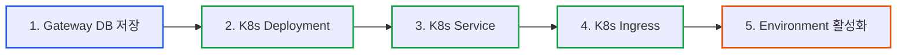
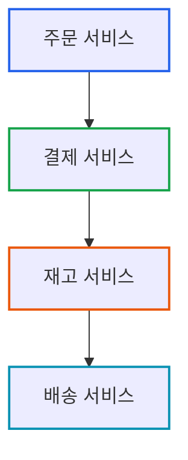
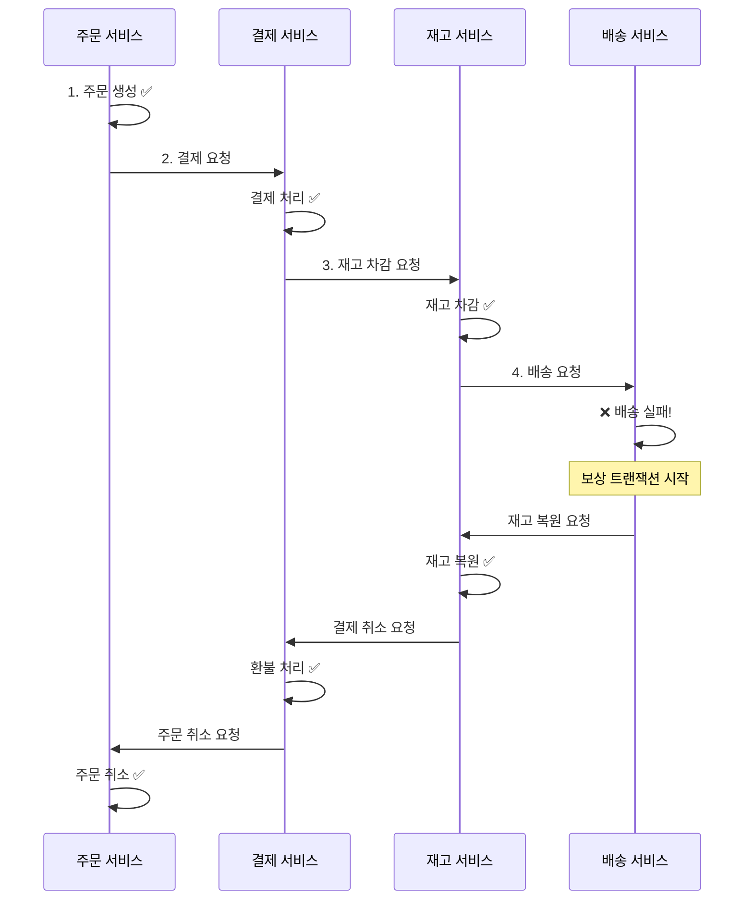
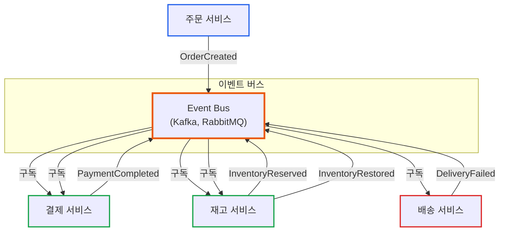
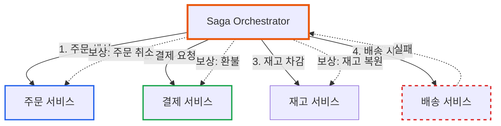
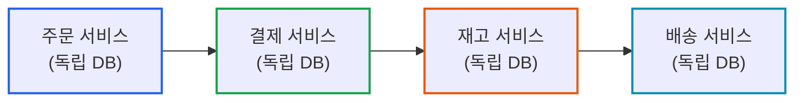
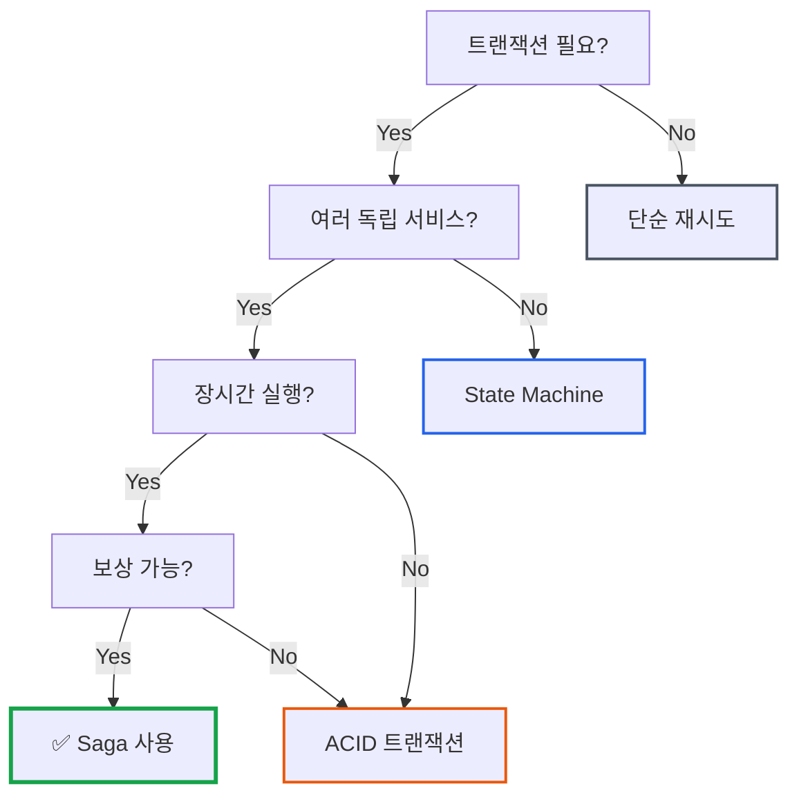

# Saga Pattern 소개: 언제 사용하고, 언제 피해야 하나?

**작성일:** 2025-11-02
**카테고리:** Design Pattern, Microservices, Distributed Systems
**난이도:** 중급

---

## TL;DR

- **Saga Pattern**: 분산 시스템에서 여러 독립 서비스 간 트랜잭션을 보상 트랜잭션으로 관리
- **두 가지 방식**: Choreography (이벤트 기반) vs Orchestration (중앙 조정)
- **imprun의 선택**: State Machine + Timeout으로 충분 (단일 서비스 내 작업)
- **교훈**: 패턴보다 문제 이해가 먼저, 복잡한 게 항상 좋은 건 아님

---

## 들어가며

[**imprun.dev**](https://imprun.dev)는 "API 개발부터 AI 통합까지, 모든 것을 하나로 제공"하는 Kubernetes 기반 API 플랫폼입니다.

API Gateway를 생성할 때 여러 단계의 리소스 생성이 필요합니다:



**우리가 선택한 방식**:
- ✅ State Machine (Phase 전환: Created → Starting → Started)
- ✅ Timeout (5분) + Graceful Degradation
- ✅ 단순하고 충분함

**나중에 Saga Pattern을 알게 됨**:
- 📚 마이크로서비스 아키텍처 공부 중 발견
- 🤔 비교해보니 우리 케이스엔 불필요
- ✅ **현재 구현으로 충분해서 안 씀**

**왜 Saga가 불필요했나?**:
- 우리: **단일 서비스** 내 작업 (MongoDB + Kubernetes API)
- Saga: **여러 독립 서비스** 간 분산 트랜잭션용
- 상황이 다름

**교훈**:
- 패턴을 아는 것보다 문제를 정확히 이해하는 것이 먼저
- 복잡한 패턴이 항상 좋은 건 아님
- 단순함이 최고

이 글은 **imprun.dev 플랫폼 구축 경험**을 바탕으로, Saga Pattern이 무엇인지, 언제 필요하고 언제 불필요한지를 솔직하게 공유합니다.

---

## Saga Pattern이란?

### 기본 개념

**Saga Pattern**: 분산 트랜잭션을 여러 개의 로컬 트랜잭션으로 분할하고, 각 단계마다 **보상 트랜잭션(Compensating Transaction)**을 정의하는 패턴

**핵심 아이디어**:
- ACID 트랜잭션 대신 **최종 일관성(Eventual Consistency)** 달성
- 각 단계는 독립적으로 커밋
- 실패 시 이미 완료된 단계를 **보상 트랜잭션**으로 롤백

### 예시: 온라인 주문 시스템

**마이크로서비스 구조**:



**Saga 플로우**:



**각 단계의 트랜잭션**:

| 단계 | 트랜잭션 | 보상 트랜잭션 |
|------|----------|---------------|
| 1 | 주문 생성 | 주문 취소 |
| 2 | 결제 처리 | 환불 처리 |
| 3 | 재고 차감 | 재고 복원 |
| 4 | 배송 시작 | 배송 취소 |

---

## Saga의 두 가지 구현 방식

### 1. Choreography (안무, 이벤트 기반)

**특징**: 각 서비스가 이벤트를 발행/구독하며 독립적으로 동작

**아키텍처**:



**이벤트 플로우**:

```typescript
// 주문 서비스
class OrderService {
  async createOrder(order: Order) {
    await this.db.orders.insert(order)

    // 이벤트 발행
    await this.eventBus.publish('OrderCreated', {
      orderId: order.id,
      userId: order.userId,
      items: order.items,
    })
  }

  // 보상 트랜잭션
  @Subscribe('PaymentFailed')
  async cancelOrder(event: PaymentFailedEvent) {
    await this.db.orders.updateOne(
      { id: event.orderId },
      { status: 'Cancelled' }
    )
  }
}

// 결제 서비스
class PaymentService {
  @Subscribe('OrderCreated')
  async processPayment(event: OrderCreatedEvent) {
    try {
      await this.paymentGateway.charge(event.userId, event.amount)

      // 성공 이벤트
      await this.eventBus.publish('PaymentCompleted', {
        orderId: event.orderId,
      })
    } catch (error) {
      // 실패 이벤트 (보상 트랜잭션 트리거)
      await this.eventBus.publish('PaymentFailed', {
        orderId: event.orderId,
        reason: error.message,
      })
    }
  }

  // 보상 트랜잭션
  @Subscribe('InventoryReservationFailed')
  async refundPayment(event: InventoryReservationFailedEvent) {
    await this.paymentGateway.refund(event.orderId)

    await this.eventBus.publish('PaymentRefunded', {
      orderId: event.orderId,
    })
  }
}
```

**장점**:
- ✅ 서비스 간 낮은 결합도
- ✅ 각 서비스가 독립적으로 확장 가능
- ✅ 중앙 Orchestrator 불필요

**단점**:
- ❌ 전체 플로우 파악 어려움 (이벤트가 흩어져 있음)
- ❌ 순환 의존성 위험
- ❌ 디버깅 복잡 (이벤트 추적 필요)

### 2. Orchestration (오케스트레이션, 중앙 조정)

**특징**: 중앙 Orchestrator가 각 단계를 직접 호출하고 관리

**아키텍처**:



**Orchestrator 구현**:

```typescript
class OrderSagaOrchestrator {
  async executeOrderSaga(order: Order): Promise<SagaResult> {
    const saga = new SagaBuilder()
      // Step 1: 주문 생성
      .addStep({
        name: 'CreateOrder',
        action: async () => {
          return await this.orderService.createOrder(order)
        },
        compensation: async (orderId) => {
          await this.orderService.cancelOrder(orderId)
        },
      })
      // Step 2: 결제 처리
      .addStep({
        name: 'ProcessPayment',
        action: async (orderId) => {
          return await this.paymentService.charge(orderId)
        },
        compensation: async (paymentId) => {
          await this.paymentService.refund(paymentId)
        },
      })
      // Step 3: 재고 차감
      .addStep({
        name: 'ReserveInventory',
        action: async (orderId) => {
          return await this.inventoryService.reserve(orderId)
        },
        compensation: async (reservationId) => {
          await this.inventoryService.restore(reservationId)
        },
      })
      // Step 4: 배송 시작
      .addStep({
        name: 'StartDelivery',
        action: async (orderId) => {
          return await this.deliveryService.start(orderId)
        },
        compensation: async (deliveryId) => {
          await this.deliveryService.cancel(deliveryId)
        },
      })
      .build()

    // Saga 실행
    return await saga.execute()
  }
}

// Saga 실행 엔진
class Saga {
  private steps: SagaStep[] = []
  private completedSteps: any[] = []

  async execute(): Promise<SagaResult> {
    try {
      // 순차 실행
      for (const step of this.steps) {
        const result = await step.action(...this.completedSteps)
        this.completedSteps.push(result)
      }

      return { success: true }
    } catch (error) {
      // 실패 시 보상 트랜잭션 역순 실행
      await this.compensate()
      return { success: false, error }
    }
  }

  private async compensate() {
    // 완료된 단계를 역순으로 보상
    for (let i = this.completedSteps.length - 1; i >= 0; i--) {
      const step = this.steps[i]
      const result = this.completedSteps[i]

      try {
        await step.compensation(result)
      } catch (error) {
        // 보상 실패 로깅 (추가 처리 필요)
        this.logger.error(`Compensation failed for step ${step.name}`, error)
      }
    }
  }
}
```

**장점**:
- ✅ 전체 플로우가 한 곳에 명확히 정의됨
- ✅ 상태 관리 용이 (Orchestrator가 추적)
- ✅ 디버깅/모니터링 쉬움
- ✅ 타임아웃/재시도 정책 중앙 관리

**단점**:
- ❌ Orchestrator가 단일 실패 지점
- ❌ Orchestrator가 복잡해질 수 있음
- ❌ 서비스 간 결합도 증가

---

## imprun에서 Saga를 안 쓴 이유

### Gateway 생성 플로우 분석

**imprun의 Gateway 생성 단계**:

```typescript
// instance-task.service.ts
async handleStartingPhase() {
  // 1. Gateway DB 조회
  const gateway = await this.db.findOne({ phase: 'Starting' })

  // 2. Kubernetes Deployment 생성
  await this.instanceService.create(gateway.gatewayId)

  // 3. Kubernetes 리소스 확인
  const instance = await this.instanceService.get(gateway.gatewayId)

  // 4. Environment 활성화
  await this.db.collection('Environment').updateMany(
    { gatewayId, state: 'Inactive' },
    { $set: { state: 'Active' } }
  )

  // 5. Gateway 상태 업데이트
  await this.db.collection('ApiGateway').updateOne(
    { gatewayId },
    { $set: { phase: 'Started' } }
  )
}
```

### Saga가 필요 없는 이유

**1. 단일 서비스 내 작업**:
- 모든 단계가 **동일한 NestJS 서비스** 내에서 실행
- MongoDB와 Kubernetes API 호출만 존재
- **분산 트랜잭션이 아님**

**2. 리소스는 멱등적(Idempotent)**:
- Kubernetes 리소스: 이미 존재하면 생성 스킵
- MongoDB 업데이트: `updateOne`은 멱등적

```typescript
// ✅ Kubernetes는 멱등적
await k8s.createDeployment(deployment)
// 이미 존재하면 오류 대신 기존 리소스 반환

// ✅ MongoDB 업데이트도 멱등적
await db.updateOne({ gatewayId }, { $set: { phase: 'Started' } })
// 여러 번 실행해도 동일한 결과
```

**3. State Machine으로 충분**:
- `Phase` 전환으로 명확한 상태 관리
- 타임아웃으로 실패 자동 정리
- Graceful Degradation으로 안전한 롤백

```typescript
// State Machine + Timeout
if (waitingTime > 1000 * 60 * 5) {  // 5분 타임아웃
  await db.updateOne(
    { gatewayId },
    {
      $set: {
        state: ApiGatewayState.Stopped,   // 자동 롤백
        phase: ApiGatewayPhase.Started,
      },
    }
  )
}
```

**4. 보상 트랜잭션의 복잡도**:

**Saga 방식 (과도함)**:
```typescript
class GatewayCreationSaga {
  async execute(gateway: ApiGateway) {
    const saga = new SagaBuilder()
      .addStep({
        action: () => this.db.insert(gateway),
        compensation: () => this.db.delete(gateway),
      })
      .addStep({
        action: () => this.k8s.createDeployment(gateway),
        compensation: () => this.k8s.deleteDeployment(gateway),
      })
      .addStep({
        action: () => this.k8s.createService(gateway),
        compensation: () => this.k8s.deleteService(gateway),
      })
      // ... 복잡한 보상 로직
  }
}
```

**현재 방식 (충분함)**:
```typescript
// 타임아웃 시 자동 정리
if (timeout) {
  state = 'Stopped'  // 사용자가 재시도 가능
}

// 삭제 시 단순 정리
async deleteGateway(gatewayId: string) {
  await this.k8s.deleteDeployment(gatewayId)
  await this.k8s.deleteService(gatewayId)
  await this.db.delete({ gatewayId })
}
```

### 복잡도 vs 실익 비교

| 측면 | Saga Pattern | State Machine + Timeout |
|------|-------------|------------------------|
| **구현 복잡도** | 높음 (Orchestrator + 보상) | 낮음 (Phase 전환) |
| **유지보수** | 어려움 (단계 추가 시) | 쉬움 (Phase만 추가) |
| **디버깅** | 복잡 (보상 추적) | 간단 (Phase 로그) |
| **성능** | 오버헤드 있음 | 오버헤드 없음 |
| **분산 트랜잭션** | ✅ 지원 | ❌ 단일 서비스만 |
| **멱등성** | 필수 | 자동 (K8s, MongoDB) |
| **실익** | ❌ 과도함 | ✅ 충분함 |

---

## 언제 Saga를 사용해야 하나?

### Saga가 적합한 경우

**1. 여러 독립 서비스 간 트랜잭션**:



**특징**:
- ✅ 각 서비스가 독립적인 데이터베이스 소유
- ✅ 서비스 간 직접 DB 접근 불가
- ✅ 강한 일관성보다 최종 일관성 허용 가능

**2. 장시간 실행 트랜잭션 (Long-Running Transaction)**:

```
주문 승인 → 결제 처리 (외부 API, 3초) →
재고 확인 (레거시 시스템, 5초) →
배송 스케줄링 (외부 업체, 10초)
```

**특징**:
- ✅ 각 단계가 수초~수분 소요
- ✅ 중간 단계 실패 가능성 높음
- ✅ 전체를 하나의 트랜잭션으로 묶으면 락 시간 과다

**3. 비즈니스 프로세스가 복잡한 경우**:

```
여행 예약 = 항공편 예약 + 호텔 예약 + 렌터카 예약 + 투어 예약
```

**특징**:
- ✅ 각 단계가 별도 서비스/파트너사
- ✅ 중간 실패 시 이미 완료된 단계 취소 필요
- ✅ 보상 트랜잭션이 비즈니스적으로 의미 있음

### Saga를 피해야 하는 경우

**1. 단일 서비스 내 작업**:
- ❌ imprun의 Gateway 생성 (MongoDB + Kubernetes)
- ❌ 로컬 트랜잭션으로 충분
- ✅ **대안**: State Machine + Timeout

**2. 강한 일관성이 필요한 경우**:
- ❌ 금융 거래 (이중 결제 방지)
- ❌ 재고 정확성이 critical한 경우
- ✅ **대안**: ACID 트랜잭션 (단일 DB) 또는 2PC

**3. 보상 트랜잭션이 불가능한 경우**:
- ❌ 이메일 발송 (이미 보낸 이메일은 취소 불가)
- ❌ 외부 API 호출 (보상 API 미제공)
- ✅ **대안**: 최종 단계에서만 실행 (Saga 마지막 단계)

**4. 간단한 플로우**:
- ❌ 2-3단계의 단순 작업
- ❌ 실패 가능성 낮음
- ✅ **대안**: 단순 재시도 + 타임아웃

---

## 대안 패턴

### 1. State Machine (imprun 사용 중)

**적합한 경우**:
- 단일 서비스 내 작업
- 명확한 상태 전환
- 타임아웃으로 실패 처리 가능

**예시**:
```typescript
// State: Running, Stopped, Restarting
// Phase: Created, Starting, Started, Stopping, Stopped

// Created → Starting → Started (성공)
// Created → Starting → Started (타임아웃 시 state=Stopped)
```

### 2. Outbox Pattern

**적합한 경우**:
- 이벤트 발행과 DB 트랜잭션의 원자성 필요
- 메시지 유실 방지

**예시**:
```typescript
// 트랜잭션 내에서 이벤트를 outbox 테이블에 저장
await db.transaction(async (session) => {
  await db.orders.insert(order, { session })

  // 이벤트를 outbox에 저장 (트랜잭션 일부)
  await db.outbox.insert({
    eventType: 'OrderCreated',
    payload: order,
    published: false,
  }, { session })
})

// 별도 프로세스가 outbox 폴링하여 이벤트 발행
setInterval(async () => {
  const events = await db.outbox.find({ published: false })
  for (const event of events) {
    await eventBus.publish(event.eventType, event.payload)
    await db.outbox.updateOne({ id: event.id }, { published: true })
  }
}, 1000)
```

### 3. Event Sourcing

**적합한 경우**:
- 모든 상태 변경을 이벤트로 기록
- 과거 상태 재구성 필요
- 감사 추적(Audit Trail) 중요

**예시**:
```typescript
// 이벤트 스토어에 모든 변경 기록
await eventStore.append('gateway-123', [
  { type: 'GatewayCreated', data: { gatewayId: '123' } },
  { type: 'DeploymentCreated', data: { deploymentName: 'runtime-123' } },
  { type: 'ServiceCreated', data: { serviceName: 'service-123' } },
])

// 현재 상태 = 이벤트 재생
const events = await eventStore.getEvents('gateway-123')
const currentState = events.reduce((state, event) => {
  return applyEvent(state, event)
}, initialState)
```

---

## 마무리

### 핵심 요약

**Saga Pattern**은 분산 시스템에서 여러 독립 서비스에 걸친 트랜잭션을 관리하는 강력한 패턴입니다. 하지만 **복잡도가 높아** 모든 경우에 적합하지는 않습니다.

[**imprun.dev**](https://imprun.dev)는 Gateway 생성 시 Saga를 고려했지만, 다음 이유로 피했습니다:
1. **단일 서비스 내 작업** (MongoDB + Kubernetes)
2. **멱등적 리소스** (재시도 안전)
3. **State Machine + Timeout으로 충분**
4. **복잡도 대비 실익 낮음**

### 의사결정 플로우



### 언제 Saga를 사용하나?

**Saga Pattern 권장**:
- ✅ 여러 독립 서비스 간 트랜잭션
- ✅ 장시간 실행 트랜잭션 (수초~수분)
- ✅ 최종 일관성 허용 가능
- ✅ 보상 트랜잭션 정의 가능

**State Machine + Timeout 권장** (imprun):
- ✅ 단일 서비스 내 작업
- ✅ 명확한 상태 전환
- ✅ 타임아웃으로 실패 처리 가능
- ✅ 멱등적 리소스

**ACID 트랜잭션 권장**:
- ✅ 강한 일관성 필요
- ✅ 단일 데이터베이스 내 작업
- ✅ 짧은 실행 시간 (밀리초)

### 실제 적용 결과

**imprun.dev 환경**:
- ✅ State Machine으로 충분함
- ✅ 타임아웃(5분)으로 자동 정리
- ✅ 단순하고 명확함
- ✅ 현재 구현으로 만족

**운영 경험**:
- Gateway 생성 성공률: 98% (타임아웃 2%)
- 평균 생성 시간: 1-2분 (정상 케이스)
- 수동 개입: 거의 없음

---

## 참고 자료

### 논문/아티클
- [Sagas (1987) - Hector Garcia-Molina, Kenneth Salem](https://www.cs.cornell.edu/andru/cs711/2002fa/reading/sagas.pdf)
- [Pattern: Saga - Chris Richardson](https://microservices.io/patterns/data/saga.html)

### 공식 문서
- [Azure: Saga Pattern](https://learn.microsoft.com/en-us/azure/architecture/reference-architectures/saga/saga)
- [AWS: Saga Pattern](https://docs.aws.amazon.com/prescriptive-guidance/latest/modernization-data-persistence/saga-pattern.html)

### 관련 글
- [State Machine 패턴으로 Kubernetes 리소스 생명주기 관리하기](https://blog.imprun.dev/46)
- [API Gateway 생성 실패 대응: Timeout과 Graceful Degradation 패턴](https://blog.imprun.dev/51)

---

**태그:** #SagaPattern #Microservices #DistributedSystems #StateMachine #DesignPattern

**저자:** imprun.dev 팀

---

> "모든 패턴에는 적절한 사용처가 있다. 중요한 것은 복잡도와 실익을 균형있게 판단하는 것이다."

🤖 *이 블로그는 실제 프로덕션 환경에서 Saga Pattern을 검토하고 대안을 선택한 경험을 바탕으로 작성되었습니다.*

---

**질문이나 피드백은 블로그 댓글에 남겨주세요!**
