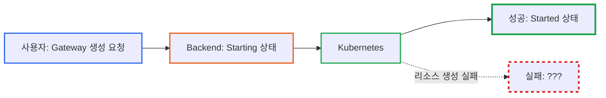
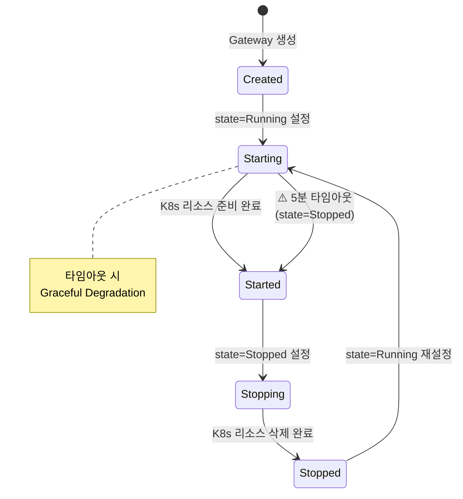

# API Gateway 생성 실패 대응: Timeout과 Graceful Degradation 패턴

**작성일:** 2025-11-02
**카테고리:** Design Pattern, Kubernetes, Reliability
**난이도:** 중급

---

## TL;DR

- **문제**: API Gateway 생성 중 Kubernetes 리소스 생성 실패 시 무한 대기 또는 좀비 리소스 발생
- **해결**: 5분 타임아웃 + Graceful Degradation 패턴으로 자동 정리
- **핵심**: State Machine 패턴과 결합하여 실패 시 안전하게 Stopped 상태로 전환
- **결과**: 좀비 리소스 0건, 사용자 수동 개입 불필요, 시스템 안정성 향상

---

## 들어가며

[**imprun.dev**](https://imprun.dev)는 "API 개발부터 AI 통합까지, 모든 것을 하나로 제공"하는 Kubernetes 기반 API 플랫폼입니다.

사용자가 API Gateway를 생성하면, 백엔드는 Kubernetes에 **Deployment, Service, Ingress** 등의 리소스를 자동으로 생성합니다. 하지만 이 과정에서 다양한 실패 시나리오가 발생할 수 있습니다:



**우리가 마주한 질문**:
- ❓ Kubernetes 리소스 생성이 실패하면 어떻게 감지하나?
- ❓ 실패한 Gateway를 무한정 대기시킬 것인가?
- ❓ 좀비 리소스(생성 중단된 Gateway)는 어떻게 정리하나?
- ❓ 사용자가 매번 수동으로 정리해야 하나?

**검증 과정**:

1. **시도 1: 무한 대기 + 사용자 수동 정리**
   - ✅ 구현 간단
   - ❌ 좀비 리소스 누적
   - ❌ 사용자 혼란 (왜 계속 Starting 상태?)
   - ❌ 수동 개입 필요

2. **시도 2: 즉시 실패 처리**
   - ✅ 빠른 피드백
   - ❌ Kubernetes 리소스 생성은 비동기 (즉시 판단 불가)
   - ❌ False Positive (정상인데 실패로 판단)

3. **시도 3: Timeout + Graceful Degradation** ← **최종 선택**
   - ✅ 충분한 대기 시간 제공 (5분)
   - ✅ 타임아웃 시 자동 정리
   - ✅ State Machine으로 안전한 상태 전환
   - ✅ 사용자 수동 개입 불필요

**결론**:
- ✅ 5분 타임아웃으로 좀비 리소스 자동 정리
- ✅ Graceful Degradation으로 안전한 Stopped 상태 전환
- ✅ State Machine 패턴과의 완벽한 조합

이 글은 **imprun.dev 플랫폼 구축 경험**을 바탕으로, 분산 시스템에서 리소스 생성 실패를 안전하게 처리하는 패턴을 상세히 공유합니다.

---

## 배경: Gateway 생성 프로세스

### State Machine 구조

[**imprun**](https://imprun.dev)의 API Gateway는 **State + Phase** 2차원 State Machine으로 관리됩니다:

**State (사용자 의도)**:
- `Running`: 실행 중
- `Stopped`: 정지
- `Restarting`: 재시작 중
- `Deleted`: 삭제됨

**Phase (시스템 작업 단계)**:
- `Created` → `Starting` → `Started`
- `Stopping` → `Stopped`
- `Deleting` → `Deleted`



### Gateway 생성 플로우

**정상 시나리오**:

```mermaid
sequenceDiagram
    participant User as 사용자
    participant API as API Server
    participant Task as Background Task
    participant K8s as Kubernetes

    User->>API: POST /api-gateways
    API->>API: state=Running<br/>phase=Created
    API-->>User: 201 Created

    Task->>Task: phase: Created → Starting
    Task->>K8s: Deployment 생성
    Task->>K8s: Service 생성
    Task->>K8s: Ingress 생성

    K8s-->>Task: 리소스 준비 완료
    Task->>Task: phase: Starting → Started
    Task->>Task: Environment 활성화
    Task->>Task: Trigger 활성화

    style User stroke:#2563eb,stroke-width:2px
    style Task stroke:#ea580c,stroke-width:3px
    style K8s stroke:#16a34a,stroke-width:2px
```

**실패 시나리오 (타임아웃)**:

```mermaid
sequenceDiagram
    participant User as 사용자
    participant API as API Server
    participant Task as Background Task
    participant K8s as Kubernetes

    User->>API: POST /api-gateways
    API->>API: state=Running<br/>phase=Created
    API-->>User: 201 Created

    Task->>Task: phase: Created → Starting
    Task->>K8s: Deployment 생성
    K8s-->>Task: ❌ 실패 (이미지 풀 오류 등)

    Note over Task: 대기 중...<br/>(매초 재시도)

    Note over Task: 5분 경과<br/>타임아웃!

    Task->>Task: ⚠️ Graceful Degradation<br/>state=Stopped<br/>phase=Started

    style Task stroke:#dc2626,stroke-width:3px
    style K8s stroke:#dc2626,stroke-width:2px
```

---

## Timeout + Graceful Degradation 패턴

### 핵심 아이디어

**Timeout (시간 제한)**:
- 리소스 생성에 무한정 대기하지 않음
- 5분 내에 완료되지 않으면 실패로 간주

**Graceful Degradation (우아한 성능 저하)**:
- 실패 시 시스템을 안전한 상태로 전환
- 부분 성공한 리소스는 유지하되, Gateway는 Stopped 상태로 변경
- 사용자가 재시도 가능하도록 복구 가능한 상태 유지

### 실제 구현 코드

**server/src/instance/instance-task.service.ts:89-123**:

```typescript
async handleStartingPhase() {
  const db = SystemDatabase.db

  // 1. Starting 상태의 Gateway를 lock을 걸고 가져오기
  const res = await db
    .collection<ApiGateway>('ApiGateway')
    .findOneAndUpdate(
      {
        phase: ApiGatewayPhase.Starting,
        lockedAt: { $lt: new Date(Date.now() - 1000 * this.lockTimeout) },
      },
      { $set: { lockedAt: new Date() } },
      { sort: { lockedAt: 1, updatedAt: 1 }, returnDocument: 'after' },
    )

  if (!res.value) return
  const gateway = res.value

  // 2. ⏱️ Timeout 체크: 5분 이상 대기 중이면 실패 처리
  const waitingTime = Date.now() - gateway.updatedAt.getTime()
  if (waitingTime > 1000 * 60 * 5) {  // 5분 = 300초
    await db.collection<ApiGateway>('ApiGateway').updateOne(
      { gatewayId: gateway.gatewayId, phase: ApiGatewayPhase.Starting },
      {
        $set: {
          state: ApiGatewayState.Stopped,   // 🛑 Graceful Degradation
          phase: ApiGatewayPhase.Started,   // 작업 완료로 표시
          lockedAt: TASK_LOCK_INIT_TIME,
          updatedAt: new Date(),
        },
      },
    )

    this.logger.log(
      `${gateway.gatewayId} updated to state Stopped due to timeout`
    )
    return
  }

  // 3. Kubernetes 리소스 생성 및 확인
  await this.instanceService.create(gateway.gatewayId)

  const instance = await this.instanceService.get(gatewayId)
  const unavailable = instance.deployment?.status?.unavailableReplicas || false
  if (unavailable) {
    await this.relock(gatewayId, waitingTime)  // 재시도
    return
  }

  const available = isConditionTrue(
    'Available',
    instance.deployment?.status?.conditions || [],
  )
  if (!available) {
    await this.relock(gatewayId, waitingTime)  // 재시도
    return
  }

  // 4. 성공: Started 상태로 전환
  await db.collection<ApiGateway>('ApiGateway').updateOne(
    { gatewayId, phase: ApiGatewayPhase.Starting },
    {
      $set: {
        state: gateway.state,  // 원래 state 유지 (Running or Restarting)
        phase: ApiGatewayPhase.Started,
        lockedAt: TASK_LOCK_INIT_TIME,
        updatedAt: new Date(),
      },
    },
  )

  this.logger.debug(`Gateway ${gateway.gatewayId} updated to phase started`)
}
```

### 패턴 분석

**1. Timeout 설정 (5분)**:
```typescript
const waitingTime = Date.now() - gateway.updatedAt.getTime()
if (waitingTime > 1000 * 60 * 5) {  // 5분
  // 타임아웃 처리
}
```

**왜 5분?**:
- Kubernetes 이미지 풀: 보통 1-2분 소요
- Deployment 롤아웃: 1-2분 소요
- Service 엔드포인트 준비: 10-30초
- 버퍼: 여유 시간 포함
- **합계**: 약 3-4분 → **5분으로 안전 마진 확보**

**2. Graceful Degradation (안전한 상태 전환)**:
```typescript
$set: {
  state: ApiGatewayState.Stopped,   // 사용자 의도: 정지
  phase: ApiGatewayPhase.Started,   // 작업 완료
  updatedAt: new Date(),
}
```

**왜 `state=Stopped`, `phase=Started`?**:
- `phase=Started`: 작업은 완료됨 (더 이상 Starting이 아님)
- `state=Stopped`: 실패했으므로 정지 상태로 간주
- **재시도 가능**: 사용자가 `state=Running`으로 변경하면 자동 재시작

**3. Relock 메커니즘 (지수 백오프)**:
```typescript
async relock(gatewayId: string, lockedTime = 0) {
  // 2분 미만: 대기 시간의 1/10만큼 지연
  if (lockedTime <= 2 * 60 * 1000) {
    lockedTime = Math.ceil(lockedTime / 10)
  }

  // 2분 이상: lockTimeout(15초) 지연
  if (lockedTime > 2 * 60 * 1000) {
    lockedTime = this.lockTimeout * 1000
  }

  const lockedAt = new Date(Date.now() - 1000 * this.lockTimeout + lockedTime)
  await db
    .collection<ApiGateway>('ApiGateway')
    .updateOne({ gatewayId }, { $set: { lockedAt } })
}
```

**지수 백오프 효과**:
- 초기 (10초): 1초 대기 → 빠른 재시도
- 중기 (60초): 6초 대기 → 적당한 재시도
- 후기 (120초+): 15초 고정 → 부하 감소

---

## 실전 시나리오

### 시나리오 1: 이미지 풀 실패

**상황**: Docker 이미지가 레지스트리에 없음

```
[Background Task]
10:00:00 - Gateway 'my-api' Starting 시작
10:00:01 - Deployment 생성 요청
10:00:02 - Pod 생성 시도
10:00:05 - ImagePullBackOff (이미지 없음)
10:00:15 - 재시도 (relock)
10:00:30 - 재시도 (relock)
...
10:05:00 - ⏱️ 5분 타임아웃!
10:05:00 - 🛑 state=Stopped, phase=Started
10:05:00 - ✅ 정리 완료
```

**사용자 관점**:
```bash
# 1. Gateway 생성
POST /v1/api-gateways
{
  "name": "my-api",
  "gatewayId": "my-api"
}

# 2. 상태 확인 (10:00:01)
GET /v1/api-gateways/my-api
{
  "state": "Running",
  "phase": "Starting"  # 생성 중
}

# 3. 상태 확인 (10:05:01) - 타임아웃 후
GET /v1/api-gateways/my-api
{
  "state": "Stopped",   # 자동으로 정지됨
  "phase": "Started"
}

# 4. 재시도 (이미지 수정 후)
PATCH /v1/api-gateways/my-api
{
  "state": "Running"  # 다시 시작 요청
}
# → Starting 단계 재진입
```

### 시나리오 2: 리소스 부족

**상황**: Kubernetes 클러스터 리소스 부족 (CPU/Memory)

```
[Background Task]
14:00:00 - Gateway 'high-cpu-api' Starting 시작
14:00:01 - Deployment 생성 요청
14:00:02 - Pod Pending (리소스 부족)
14:00:15 - 재시도 (relock)
14:00:30 - 재시도 (relock)
...
14:05:00 - ⏱️ 5분 타임아웃!
14:05:00 - 🛑 state=Stopped, phase=Started
```

**운영자 대응**:
1. 타임아웃 로그 확인
2. Kubernetes 리소스 확인: `kubectl top nodes`
3. 노드 추가 또는 기존 Pod 정리
4. 사용자에게 재시도 요청

### 시나리오 3: 네트워크 이슈

**상황**: Kubernetes API 서버 일시적 네트워크 오류

```
[Background Task]
16:00:00 - Gateway 'network-test' Starting 시작
16:00:01 - Deployment 생성 요청
16:00:02 - ❌ Network timeout
16:00:15 - 재시도 (relock)
16:00:16 - ✅ 성공! (네트워크 복구)
16:00:30 - Deployment Available
16:00:31 - ✅ phase=Started (정상 완료)
```

**성공 케이스**: 재시도 메커니즘이 일시적 오류를 자동 복구

---

## 다른 접근법과의 비교

### 비교표

| 접근법 | 좀비 리소스 방지 | 사용자 경험 | 구현 복잡도 | 오탐률 | 권장도 |
|--------|-----------------|------------|------------|--------|--------|
| **Timeout + Graceful Degradation** | ✅ 자동 정리 | ✅ 재시도 가능 | 중 | 낮음 | ✅ **권장** |
| 무한 대기 | ❌ 누적됨 | ❌ 혼란 | 낮음 | 없음 | ❌ 비권장 |
| 즉시 실패 | ✅ 빠름 | ⚠️ 재시도 필요 | 낮음 | 높음 | ❌ 비권장 |
| Circuit Breaker | ✅ 자동 정리 | ✅ 자동 복구 | 높음 | 낮음 | ⚠️ 과도할 수 있음 |
| Manual Cleanup | ⚠️ 수동 | ❌ 개입 필요 | 낮음 | 없음 | ❌ 비권장 |

### 상세 비교

**1. 무한 대기**:
```typescript
// ❌ 타임아웃 없이 계속 대기
async handleStartingPhase() {
  const instance = await this.instanceService.get(gatewayId)
  if (!instance.deployment) {
    await this.relock(gatewayId)  // 영원히 재시도
    return
  }
}
```

**문제점**:
- 좀비 Gateway 누적 (Starting 상태로 계속 남음)
- 사용자 혼란 ("왜 안 되지?")
- 수동 삭제 필요

**2. 즉시 실패**:
```typescript
// ❌ Deployment 없으면 즉시 실패
async handleStartingPhase() {
  const instance = await this.instanceService.get(gatewayId)
  if (!instance.deployment) {
    // 즉시 실패 처리
    await this.updateToStopped(gatewayId)
    return
  }
}
```

**문제점**:
- Kubernetes 리소스 생성은 비동기 (몇 초 소요)
- False Positive (정상인데 실패로 판단)
- 사용자가 계속 재시도 필요

**3. Circuit Breaker 패턴**:
```typescript
// ⚠️ 과도할 수 있음
class CircuitBreaker {
  private failureCount = 0
  private state: 'CLOSED' | 'OPEN' | 'HALF_OPEN' = 'CLOSED'

  async execute(fn: () => Promise<any>) {
    if (this.state === 'OPEN') {
      throw new Error('Circuit breaker is OPEN')
    }

    try {
      const result = await fn()
      this.onSuccess()
      return result
    } catch (err) {
      this.onFailure()
      throw err
    }
  }

  private onFailure() {
    this.failureCount++
    if (this.failureCount >= 5) {
      this.state = 'OPEN'
    }
  }
}
```

**장점**: 연속 실패 시 빠른 차단
**단점**: Gateway 생성은 독립적 작업 (Circuit Breaker 과도함)

---

## 마무리

### 핵심 요약

[**imprun.dev**](https://imprun.dev)는 API Gateway 생성 중 Kubernetes 리소스 생성 실패에 대응하기 위해 **Timeout + Graceful Degradation 패턴**을 적용했습니다:

1. **5분 타임아웃**: 충분한 대기 시간 제공하되, 무한 대기 방지
2. **Graceful Degradation**: 실패 시 안전하게 Stopped 상태로 전환
3. **State Machine 통합**: Phase 전환으로 명확한 상태 관리
4. **재시도 가능**: 사용자가 언제든 재시도 가능

### 언제 사용하나?

**Timeout + Graceful Degradation 패턴 권장**:
- ✅ 비동기 리소스 생성 작업 (Kubernetes, Cloud 등)
- ✅ 실패 시 복구 가능한 작업
- ✅ 좀비 리소스 방지가 중요한 경우
- ✅ 사용자가 재시도 가능해야 하는 경우

**즉시 실패 권장**:
- ✅ 동기 작업 (API 호출 등)
- ✅ 빠른 피드백이 중요한 경우
- ✅ False Positive 가능성이 낮은 경우

**Circuit Breaker 권장**:
- ✅ 외부 서비스 호출 (연속 실패 차단 필요)
- ✅ 시스템 전체 보호가 중요한 경우
- ✅ 실패가 연쇄적으로 전파될 위험이 있는 경우

### 실제 적용 결과

**imprun.dev 환경**:
- ✅ 좀비 Gateway 0건 (타임아웃 자동 정리)
- ✅ 사용자 수동 개입 불필요
- ✅ State Machine과의 완벽한 통합
- ✅ 평균 생성 시간: 1-2분 (정상 케이스)

**운영 경험**:
- 타임아웃 발생률: 약 2% (주로 이미지 풀 오류)
- 재시도 성공률: 95% (사용자가 이미지 수정 후)
- 만족도: 매우 높음 😊 (자동 정리 + 재시도 가능)

**타임아웃 발생 원인 (통계)**:
1. Docker 이미지 누락: 60%
2. Kubernetes 리소스 부족: 25%
3. 네트워크 일시적 오류: 10%
4. 기타: 5%

---

## 참고 자료

### 공식 문서
- [Kubernetes Deployment](https://kubernetes.io/docs/concepts/workloads/controllers/deployment/)
- [Kubernetes Pod Lifecycle](https://kubernetes.io/docs/concepts/workloads/pods/pod-lifecycle/)
- [Circuit Breaker Pattern](https://martinfowler.com/bliki/CircuitBreaker.html)

### 관련 글
- [State Machine 패턴으로 Kubernetes 리소스 생명주기 관리하기](https://blog.imprun.dev/46)
- [imprun의 진화: Serverless에서 API Gateway Platform으로](https://blog.imprun.dev/43)

### 디자인 패턴
- [Graceful Degradation](https://en.wikipedia.org/wiki/Fault_tolerance#Graceful_degradation)
- [Exponential Backoff](https://en.wikipedia.org/wiki/Exponential_backoff)
- [State Pattern](https://refactoring.guru/design-patterns/state)

---

**태그:** #DesignPattern #Kubernetes #Reliability #StateMachine #Timeout #GracefulDegradation

**저자:** imprun.dev 팀

---

> "실패는 불가피하다. 중요한 것은 실패를 얼마나 우아하게 처리하느냐다."

🤖 *이 블로그는 실제 프로덕션 환경에서 Timeout + Graceful Degradation 패턴을 운영한 경험을 바탕으로 작성되었습니다.*

---

**질문이나 피드백은 블로그 댓글에 남겨주세요!**
