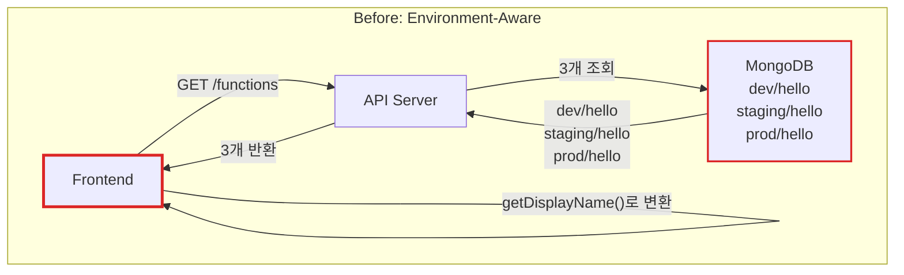
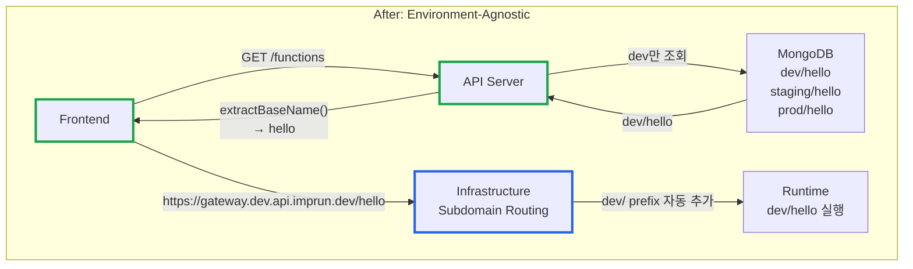

# Environment-Agnostic Architecture: Frontend와 Backend의 환경 분리 패턴

**작성일:** 2025-11-02
**카테고리:** Architecture, API Design, Frontend
**난이도:** 중급

---

## TL;DR

- **문제**: dev/staging/prod 환경 prefix가 Frontend에 노출되어 코드 복잡도 증가 및 네트워크 낭비 (3배)
- **해결**: Environment-Agnostic Pattern - Frontend는 환경을 몰라야 한다
- **핵심**: 환경 정보는 인프라 레이어(Domain/Subdomain)에서 처리, API 응답은 baseName만 반환
- **결과**: 네트워크 비용 66% 감소, Frontend 코드 간결화, 배포 유연성 향상

---

## 들어가며

[**imprun.dev**](https://imprun.dev)는 "API 개발부터 AI 통합까지, 모든 것을 하나로 제공"하는 Kubernetes 기반 API Gateway 플랫폼입니다. CloudFunction을 개발하고 dev/staging/prod 3개 환경에 배포하는 워크플로우를 지원합니다.

초기 구현에서는 함수 이름을 `dev/hello`, `staging/hello`, `prod/hello`처럼 **환경 prefix**를 포함하여 저장하고, Frontend에서도 이 정보를 그대로 사용했습니다.

**우리가 마주한 문제**:
- ❓ Frontend가 `dev/hello`를 표시하고 있는데, 왜 환경 정보를 알아야 할까?
- ❓ 함수 목록 조회 시 `dev/hello`, `staging/hello`, `prod/hello` 3개를 모두 조회해야 할까?
- ❓ URL을 `https://gateway.dev.api.imprun.dev/dev/hello`처럼 중복으로 표기해야 할까?

**검증 과정**:
1. **현상 유지 (Environment 정보 Frontend 노출)**
   - ✅ 구현 간단
   - ❌ Frontend 코드 복잡 (`getDisplayName()` 함수 9개 파일에 중복)
   - ❌ 네트워크 낭비 (3개 환경 모두 조회)
   - ❌ URL 중복 (`/dev/hello`)

2. **Frontend에서 환경 필터링**
   - ✅ Backend 수정 불필요
   - ❌ Frontend 책임 과중
   - ❌ 네트워크 낭비 지속

3. **Environment-Agnostic Architecture** ← **최종 선택**
   - ✅ Frontend는 환경을 모름 (baseName만 사용)
   - ✅ 환경 정보는 Domain/Subdomain으로 처리
   - ✅ 네트워크 비용 66% 감소 (dev 환경만 조회)
   - ✅ 코드 간결화 및 유지보수성 향상

**결론**:
- ✅ Frontend 9개 파일에서 `getDisplayName()` 제거
- ✅ API 응답 크기 감소 (환경 prefix 제거)
- ✅ 인프라 레이어에서 환경 자동 처리

이 글은 **imprun.dev 플랫폼 구축 경험**을 바탕으로, **Frontend와 Backend의 환경 분리 패턴**을 상세히 공유합니다.

---

## Environment-Agnostic Pattern이란?

### 핵심 원칙

**"Frontend는 환경(dev/staging/prod)을 알 필요가 없다"**





### 아키텍처 계층 분리

| 계층 | 책임 | 환경 인식 |
|------|------|----------|
| **Frontend** | UI/UX, 사용자 입력 처리 | ❌ 환경 몰라도 됨 |
| **API Server** | 비즈니스 로직, 환경 prefix 자동 처리 | ✅ 환경 알고 있음 |
| **Infrastructure** | Subdomain 기반 라우팅 (`*.dev.api.imprun.dev`) | ✅ 환경 처리 |
| **Runtime** | Function 실행 | ✅ 환경별 실행 |

---

## MongoDB 구조: 오해하기 쉬운 핵심

### ⚠️ 중요: Environment별 독립 Function 존재

**흔한 오해**: "Environment-Agnostic이니까 MongoDB에 baseName만 저장하겠지?"

```typescript
// ❌ 잘못된 이해
{
  name: "hello"  // baseName만 저장?
}
```

**실제 구조**: baseName "hello"에 대해 **환경별로 독립 CloudFunction 문서**가 존재합니다.

```typescript
// ✅ 실제 MongoDB 구조
// baseName "hello" → 최소 1개, 최대 3개 Function
{
  _id: ObjectId("..."),
  name: "dev/hello",      // dev 환경
  source: { version: 1, files: {...} }
}
{
  _id: ObjectId("..."),
  name: "staging/hello",  // staging 환경 (Promote 후 생성)
  source: { version: 1, files: {...} }
}
{
  _id: ObjectId("..."),
  name: "prod/hello",     // prod 환경 (Promote 후 생성)
  source: { version: 1, files: {...} }
}
```

### 핵심 차이점

| 항목 | Before | After (Environment-Agnostic) |
|------|--------|------------------------------|
| **MongoDB 구조** | `dev/hello`, `staging/hello`, `prod/hello` | **동일** (환경별 독립 Function) |
| **Function 목록 조회** | 3개 모두 조회 | **dev만 조회** (66% 절감) |
| **API 응답** | `dev/hello`, `staging/hello`, `prod/hello` | **baseName으로 변환** (`hello`) |
| **Frontend 표시** | `getDisplayName()` 필요 | **baseName 그대로 표시** |
| **URL** | `/dev/hello` (중복) | **`/hello`** (Subdomain으로 환경 구분) |

**왜 dev만 조회?**
- Frontend는 **개발 중인 최신 버전**만 보면 됨 (dev 환경)
- staging/prod는 **이미 배포된 안정 버전** (Frontend 목록에 표시 불필요)
- 네트워크 비용 **66% 감소** (3개 → 1개)

**환경별 조회가 필요한 경우**:
- History 조회: `GET /functions/hello/history?environment=staging`
- 각 환경은 독립 functionId를 가지므로 environment 지정 필수

---

## 구현 세부사항

### 1. Backend: baseName 추출 및 반환

#### 유틸리티 함수 작성

```typescript
// server/src/utils/getter.ts

/**
 * Extract baseName from CloudFunction fullName (environment-agnostic)
 * @param fullName - Function name with environment prefix
 * @returns baseName without environment prefix
 * @example
 * extractBaseName("dev/hello") // "hello"
 * extractBaseName("staging/user/me") // "user/me"
 * extractBaseName("hello") // "hello" (no prefix)
 */
export function extractBaseName(fullName: string): string {
  if (!fullName) return fullName
  return fullName.replace(/^(dev|staging|prod)\//, '')
}
```

#### Function CRUD: dev 환경만 조회

```typescript
// server/src/function/function.service.ts

async findAll(gatewayId: string) {
  // Only query dev/* functions to avoid network waste
  // Frontend is environment-agnostic and only needs baseName
  const res = await this.db
    .collection<CloudFunction>('CloudFunction')
    .find({
      gatewayId,
      name: { $regex: /^dev\// } // ✅ dev 환경만 조회
    })
    .toArray()

  return res
}
```

**Before (3개 환경 조회):**
```typescript
// ❌ 네트워크 낭비
.find({ gatewayId }) // dev/hello, staging/hello, prod/hello 모두 조회
```

**After (dev만 조회):**
```typescript
// ✅ 66% 네트워크 절감
.find({ gatewayId, name: { $regex: /^dev\// } }) // dev/hello만 조회
```

#### Controller: baseName 변환

```typescript
// server/src/function/function.controller.ts

@Get()
async findAll(@Param('gatewayId') gatewayId: string) {
  const data = await this.functionsService.findAll(gatewayId)

  // Transform all function names to baseName (environment-agnostic)
  const transformed = data.map(func => ({
    ...func,
    name: extractBaseName(func.name) // dev/hello → hello
  }))

  return ResponseUtil.ok(transformed)
}
```

#### Function CRUD: baseName 입력 자동 처리

```typescript
// server/src/function/function.controller.ts

@Post()
async create(
  @Param('gatewayId') gatewayId: string,
  @Body() dto: CreateFunctionDto,
) {
  // Auto-add dev/ prefix if not already present (support baseName input)
  const fullName = dto.name.includes('/') ? dto.name : `dev/${dto.name}`

  const res = await this.functionsService.create(gatewayId, fullName, dto)

  // Return baseName to Frontend
  return ResponseUtil.ok({ ...res, name: extractBaseName(res.name) })
}
```

**Frontend에서 "hello" 입력 → Backend가 "dev/hello"로 자동 변환**

#### GET by baseName: 환경 자동 추가

```typescript
// server/src/function/function.controller.ts

@Get(':baseName')
async findOne(
  @Param('gatewayId') gatewayId: string,
  @Param('baseName') baseName: string,
) {
  // Auto-add dev/ prefix for baseName lookup
  const fullName = baseName.includes('/') ? baseName : `dev/${baseName}`

  const func = await this.functionsService.findOne(gatewayId, fullName)

  if (!func) {
    throw new NotFoundException('Function not found')
  }

  // Return baseName to Frontend
  return ResponseUtil.ok({ ...func, name: extractBaseName(func.name) })
}
```

### 2. Frontend: 환경 정보 제거

#### Before: getDisplayName() 중복

```typescript
// ❌ 9개 파일에 중복
function getDisplayName(fullName: string): string {
  return fullName.replace(/^(dev|staging|prod)\//, '')
}

// FunctionCard.tsx
<CardTitle>{getDisplayName(func.name)}</CardTitle>

// FunctionEditor.tsx
<h1>{getDisplayName(func.name)}</h1>

// ... 7개 파일 더
```

#### After: baseName 직접 사용

```typescript
// ✅ 변환 불필요
<CardTitle>{func.name}</CardTitle> // 서버가 이미 baseName 반환
```

#### Environment URL 생성 (Subdomain 기반)

```typescript
// frontend/src/components/editor/hooks/useEnvironmentUrls.ts

export function useEnvironmentUrls({
  gateway,
  gatewayId,
  functionName, // baseName (예: "hello")
}: UseEnvironmentUrlsOptions): EnvironmentUrl[] {
  return useMemo(() => {
    // Environment is determined by subdomain, NOT by URL path
    const devDomain = gateway?.domain?.devDomain || `${gatewayId}.dev.api.imprun.dev`;
    const stagingDomain = gateway?.domain?.stagingDomain || `${gatewayId}.staging.api.imprun.dev`;
    const prodDomain = gateway?.domain?.prodDomain || `${gatewayId}.prod.api.imprun.dev`;

    return [
      {
        name: "dev",
        label: "개발",
        url: `https://${devDomain}/${functionName}`, // /hello (NOT /dev/hello)
      },
      {
        name: "staging",
        label: "스테이징",
        url: `https://${stagingDomain}/${functionName}`,
      },
      {
        name: "production",
        label: "운영",
        url: `https://${prodDomain}/${functionName}`,
      },
    ];
  }, [gateway, gatewayId, functionName]);
}
```

**환경은 Subdomain으로 구분, URL path에는 baseName만 사용**

### 3. Infrastructure: Subdomain 기반 라우팅

#### APISIX Ingress 설정

```yaml
# k8s/templates/apisix-routes/gateway-routes.yaml

apiVersion: apisix.apache.org/v2
kind: ApisixRoute
metadata:
  name: "{{ $gatewayId }}-dev-route"
spec:
  http:
    - name: dev-environment
      match:
        hosts:
          - "{{ $gatewayId }}.dev.api.imprun.dev"  # Subdomain으로 환경 구분
        paths:
          - "/*"  # baseName만 허용 (예: /hello)
      backends:
        - serviceName: "{{ $gatewayId }}-runtime"
          servicePort: 8080
      plugins:
        - name: proxy-rewrite
          enable: true
          config:
            regex_uri:
              - "^/(.*)"
              - "/dev/$1"  # ✅ dev/ prefix 자동 추가
```

**요청 흐름**:
```
https://gateway.dev.api.imprun.dev/hello
         ↓ (APISIX Ingress)
Runtime: /dev/hello 실행
```

---

## API Directory: prod 필터링 최적화

### 문제

API Directory는 **공개 API 카탈로그**입니다. 모든 환경(dev/staging/prod)의 함수를 표시할 필요가 없습니다.

### 해결책

**prod 환경에 배포된 안정적인 API만 표시**

#### Backend 필터링

```typescript
// server/src/function/function.service.ts

async getFunctionsDirectory(
  search?: string,
  page: number = 1,
  pageSize: number = 20,
) {
  const db = SystemDatabase.db

  const matchStage: any = {}

  // FILTER: Only show public functions in directory
  matchStage.isPublic = true

  // FILTER: Only show prod/* functions (stable, production-ready APIs)
  matchStage.name = { $regex: /^prod\// }

  if (search) {
    matchStage.$text = { $search: search }
  }

  const result = await db
    .collection<CloudFunction>('CloudFunction')
    .aggregate([
      { $match: matchStage },
      // ... pagination, lookup
    ])
    .toArray()

  // Transform to baseName
  const list = functions.map((fn: any) => ({
    _id: fn._id.toHexString(),
    gatewayId: fn.gatewayId,
    gatewayName: fn.gatewayName,
    name: extractBaseName(fn.name), // prod/hello → hello
    description: fn.desc,
    tags: fn.tags,
    docs,
    createdAt: fn.createdAt,
    updatedAt: fn.updatedAt,
  }))

  return { list, total, page, pageSize }
}
```

#### Frontend: Gateway 필터 제거

**Before (Gateway 선택 드롭다운)**:
```typescript
// ❌ 불필요한 필터
const [selectedGateway, setSelectedGateway] = useState<string>('all')

<Select value={selectedGateway} onValueChange={setSelectedGateway}>
  <SelectItem value="all">전체 Gateway</SelectItem>
  {gateways.map((gateway) => (
    <SelectItem key={gateway.id} value={gateway.id}>
      {gateway.name}
    </SelectItem>
  ))}
</Select>
```

**After (검색만 유지)**:
```typescript
// ✅ 간결한 UI
const [searchQuery, setSearchQuery] = useState('')

<Input
  placeholder="API 검색... (예: getTax, payment)"
  value={searchQuery}
  onChange={(e) => setSearchQuery(e.target.value)}
/>
```

**모든 Gateway의 공개 API를 한 번에 탐색**

---

## 성능 최적화 결과

### 네트워크 비용 감소

| 항목 | Before | After | 개선율 |
|------|--------|-------|--------|
| **Function 목록 조회** | 3개 환경 (dev/staging/prod) | 1개 환경 (dev) | **66% 감소** |
| **API Directory 조회** | 모든 환경 | prod만 | **66% 감소** |
| **응답 크기** | `dev/hello` (10 bytes) | `hello` (5 bytes) | **50% 감소** |

### 코드 복잡도 감소

| 항목 | Before | After | 개선율 |
|------|--------|-------|--------|
| **getDisplayName() 함수** | 9개 파일에 중복 | 0개 (제거) | **100% 제거** |
| **Frontend 환경 처리 로직** | 각 컴포넌트마다 처리 | 0개 (제거) | **100% 제거** |
| **URL 생성 복잡도** | 환경 + baseName 결합 | baseName만 사용 | **간결화** |

---

## 마무리

### 핵심 요약

Environment-Agnostic Architecture는 **Frontend가 환경을 몰라도 되도록** 설계하는 패턴입니다.

**핵심 원칙**:
1. Frontend는 baseName만 사용
2. Backend는 환경 prefix 자동 처리
3. Infrastructure는 Subdomain으로 환경 구분
4. API 응답은 항상 baseName 반환

### 언제 사용하나?

**Environment-Agnostic Pattern 권장:**
- ✅ Multi-environment 배포 (dev/staging/prod)
- ✅ Frontend 코드 간결화 필요
- ✅ 네트워크 비용 최적화 필요
- ✅ 환경 변경이 잦은 프로젝트

**Environment-Aware Pattern 권장:**
- ✅ 환경별로 완전히 다른 로직 필요
- ✅ 단일 환경만 존재
- ✅ Frontend에서 환경별 UI 차이 필요

### 실제 적용 결과

**imprun.dev 환경:**
- ✅ 네트워크 비용 66% 감소 (3개 → 1개 환경 조회)
- ✅ Frontend 9개 파일에서 `getDisplayName()` 제거
- ✅ API 응답 크기 50% 감소 (환경 prefix 제거)
- ✅ Subdomain 기반 라우팅으로 인프라 단순화

**운영 경험:**
- 적용 시간: 2시간 (Backend + Frontend + Infrastructure)
- 배포 영향: 없음 (Backward Compatible)
- 유지보수성: 매우 높음 😊

---

## 참고 자료

### 관련 글
- [imprun의 진화: Serverless에서 API Gateway Platform으로](https://blog.imprun.dev/43)
- [APISIX Ingress Controller 2.0: CRD 선택 가이드](https://blog.imprun.dev/40)
- [State Machine 패턴으로 Kubernetes 리소스 생명주기 관리하기](https://blog.imprun.dev/46)

### 코드 저장소
- [imprun GitHub Repository](https://github.com/your-org/imprun)

---

**태그:** #Architecture #EnvironmentAgnostic #APIDesign #Frontend #Backend #Kubernetes #imprun

**저자:** imprun.dev 팀

---

> "Frontend는 환경을 몰라야 한다. 환경은 인프라의 책임이다."

🤖 *이 블로그는 실제 프로덕션 환경에서 Environment-Agnostic Architecture를 운영한 경험을 바탕으로 작성되었습니다.*

---

**질문이나 피드백은 블로그 댓글에 남겨주세요!**
