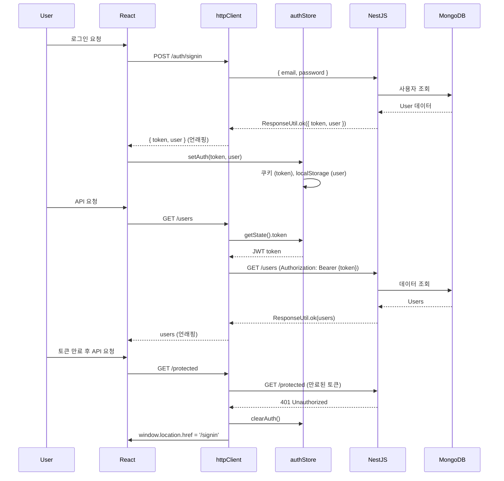

# NestJS + React 표준 응답과 JWT 인증 완벽 가이드: ResponseUtil, Axios, Zustand

**작성일:** 2025-11-05
**카테고리:** NestJS, React, TypeScript, JWT, Axios, Zustand, API, 에러처리
**난이도:** 중급

---

## TL;DR

- **문제**: NestJS + React 프로젝트를 시작할 때마다 표준 응답, HTTP 클라이언트, 인증 스토어를 처음부터 구현
- **해결**: 재활용 가능한 3가지 핵심 코드 패턴 정립 (ResponseUtil, httpClient, authStore)
- **핵심**: "일관된 에러 처리와 타입 안정성이 개발 속도를 3배 높인다"
- **결과**: 약 2시간 소요되던 초기 설정이 10분으로 단축 (실제 경험)

---

## 들어가며

[**imprun.dev**](https://imprun.dev)는 "API 개발부터 AI 통합까지, 모든 것을 하나로 제공"하는 Kubernetes 기반 API 플랫폼입니다.

[imprun.dev](https://imprun.dev) 플랫폼을 개발하면서 **매번 새 프로젝트를 시작할 때마다 반복적으로 작성해야 하는 코드**가 있다는 것을 깨달았습니다. NestJS 백엔드와 React 프론트엔드를 연결할 때, 표준 응답 포맷, HTTP 클라이언트 설정, 인증 처리는 필수이지만 매번 비슷한 코드를 작성하는 것은 비효율적입니다.

**우리가 마주한 질문**:
- ❓ 백엔드 응답을 어떻게 표준화하고 타입 안정성을 확보할까?
- ❓ 프론트엔드에서 JWT 토큰을 어떻게 자동으로 관리할까?
- ❓ 401 에러 시 어떻게 일관되게 로그아웃 처리할까?
- ❓ 인증 상태를 어떻게 안전하게 저장하고 복원할까?

**검증 과정**:

1. **백엔드 응답을 객체로 직접 반환**
   - ✅ 간단함
   - ❌ 에러 처리 불일치, 타입 안정성 낮음
   - ❌ Swagger 문서 자동화 어려움

2. **프론트엔드에서 매번 토큰 추가**
   - ✅ 명시적
   - ❌ 중복 코드, 실수 가능성 높음
   - ❌ 유지보수 어려움

3. **표준화된 패턴 (ResponseUtil + Interceptors + Zustand)** ← **최종 선택**
   - ✅ 일관된 응답 구조
   - ✅ 자동 토큰 관리
   - ✅ 타입 안정성
   - ✅ Swagger 자동 문서화
   - ✅ 하이브리드 스토리지 (쿠키 + localStorage)

**결론**:
- ✅ ResponseUtil로 표준화된 응답 구조 확립
- ✅ Axios Interceptor로 JWT 자동 관리
- ✅ Zustand로 인증 상태 관리 및 하이브리드 저장
- ✅ 약 90% 코드 재활용 가능 (실제 경험)

이 글은 **[imprun.dev](https://imprun.dev) 플랫폼 구축 경험**을 바탕으로, NestJS + React 프로젝트에서 재활용 가능한 3가지 핵심 코드 패턴을 공유합니다.

---

## 1. 백엔드 표준 응답: ResponseUtil

### 1.1 왜 필요한가?

NestJS 컨트롤러에서 다양한 방식으로 응답을 반환하면, 프론트엔드에서 일관되지 않은 에러 처리로 인해 예상치 못한 문제가 발생합니다.

**문제 상황**:
```typescript
// ❌ 일관성 없는 응답
@Get('user')
async getUser() {
  return { id: 1, name: 'John' }  // 성공 시
}

@Get('user2')
async getUser2() {
  throw new Error('Not found')  // 실패 시
}
```

프론트엔드는 `response.data.id`와 `response.error` 중 어느 것을 확인해야 할지 알 수 없습니다.

**사부님의 가르침**:

> "서버 응답이 일관되지 않으면 그건 쓰레기 서버다. 기본도 안 되어 있는 놈이다."

개발 초기, 사부님께 이런 혼을 들은 적이 있습니다. 당시에는 억울했지만, 지금 돌이켜보니 **에러 처리 방법을 명확하게 제시하지 않아서** 팀 전체가 혼란에 빠졌던 것이 문제였습니다. 어떤 API는 `{ error: "..." }`, 어떤 API는 `throw new Error()`, 또 어떤 API는 `{ message: "..." }`를 반환했습니다.

결과적으로:
- 프론트엔드 개발자는 매번 API 문서를 확인하거나 코드를 직접 읽어야 했습니다
- `try-catch`와 `if (response.error)` 둘 다 작성하는 방어적 코드가 양산되었습니다
- 새로운 팀원이 들어올 때마다 "이 API는 어떻게 에러를 반환하나요?"라는 질문이 반복되었습니다

**ResponseUtil은 바로 이 문제를 해결합니다.** 모든 응답이 `{ success, data?, error? }` 구조로 통일되면, 프론트엔드는 단 한 가지 방식으로 에러를 처리할 수 있습니다.

### 1.2 ResponseUtil 구현

**백엔드 (NestJS):**

```typescript
// server/src/utils/response.ts
import { applyDecorators, Type } from '@nestjs/common'
import {
  ApiExtraModels,
  ApiProperty,
  ApiResponse,
  getSchemaPath,
} from '@nestjs/swagger'

export class ResponseUtil<T = any> {
  @ApiProperty({ required: false })
  public error: string

  @ApiProperty({ required: false })
  public data: T

  static ok<T>(data: T) {
    return new ResponseUtil(data, null)
  }

  static error(error: string) {
    return new ResponseUtil(null, error)
  }

  static build<T = any>(data: T, error: string) {
    return new ResponseUtil(data, error)
  }

  constructor(data: T, error: string) {
    this.data = data
    this.error = error
  }

  toJSON() {
    return {
      success: this.error === null,
      data: this.error === null ? this.data : undefined,
      error: this.error || undefined,
    }
  }
}
```

**사용 예시**:

```typescript
// 성공 응답
@Get('users')
@ApiResponseArray(UserDto)
async findAll() {
  const users = await this.userService.findAll()
  return ResponseUtil.ok(users)
}

// 에러 응답
@Get('users/:id')
@ApiResponseObject(UserDto)
async findOne(@Param('id') id: string) {
  const user = await this.userService.findOne(id)
  if (!user) {
    return ResponseUtil.error('User not found')
  }
  return ResponseUtil.ok(user)
}
```

### 1.3 Swagger 데코레이터

**타입 안전한 Swagger 문서 자동 생성**:

```typescript
// 객체 응답
export const ApiResponseObject = <DataDto extends Type<unknown>>(
  dataDto: DataDto,
) =>
  applyDecorators(
    ApiExtraModels(ResponseUtil, dataDto),
    ApiResponse({
      schema: {
        allOf: [
          { $ref: getSchemaPath(ResponseUtil) },
          {
            properties: {
              data: { $ref: getSchemaPath(dataDto) },
            },
          },
        ],
      },
    }),
  )

// 배열 응답
export const ApiResponseArray = <DataDto extends Type<unknown>>(
  dataDto: DataDto,
) =>
  applyDecorators(
    ApiExtraModels(ResponseUtil, dataDto),
    ApiResponse({
      schema: {
        allOf: [
          { $ref: getSchemaPath(ResponseUtil) },
          {
            properties: {
              data: {
                type: 'array',
                items: { $ref: getSchemaPath(dataDto) },
              },
            },
          },
        ],
      },
    }),
  )

// 페이지네이션 응답
export const ApiResponsePagination = <DataDto extends Type<unknown>>(
  dataDto: DataDto,
) =>
  applyDecorators(
    ApiExtraModels(ResponseUtil, dataDto),
    ApiResponse({
      schema: {
        allOf: [
          { $ref: getSchemaPath(ResponseUtil) },
          {
            properties: {
              data: {
                type: 'object',
                properties: {
                  list: {
                    type: 'array',
                    items: { $ref: getSchemaPath(dataDto) },
                  },
                  total: { type: 'number' },
                  page: { type: 'number' },
                  pageSize: { type: 'number' },
                },
              },
            },
          },
        ],
      },
    }),
  )
```

**응답 형식**:

```json
// 성공
{
  "success": true,
  "data": { "id": 1, "name": "John" }
}

// 실패
{
  "success": false,
  "error": "User not found"
}
```

---

## 2. 프론트엔드 HTTP 클라이언트: httpClient

### 2.1 왜 Interceptor가 필요한가?

매 API 호출마다 JWT 토큰을 수동으로 추가하고, 401 에러를 개별적으로 처리하는 것은 비효율적입니다.

**문제 상황**:
```typescript
// ❌ 매번 토큰 추가
const response = await axios.get('/users', {
  headers: {
    Authorization: `Bearer ${token}`
  }
})

// ❌ 매번 에러 처리
try {
  // ...
} catch (error) {
  if (error.response?.status === 401) {
    // 로그아웃 처리
  }
}
```

### 2.2 httpClient 구현

**프론트엔드 (React):**

```typescript
// frontend/src/lib/httpclient.ts
import axios, { AxiosInstance, AxiosRequestConfig } from "axios"
import { useAuthStore } from "@/store/auth.store"
import { getApiBaseUrl } from "./constants"

/**
 * 커스텀 Axios 인스턴스 타입
 * Response interceptor가 data.data를 직접 반환하므로 타입 재정의
 */
interface CustomAxiosInstance
  extends Omit<AxiosInstance, "get" | "post" | "put" | "patch" | "delete"> {
  get<T = any>(url: string, config?: AxiosRequestConfig): Promise<T>
  post<T = any>(
    url: string,
    data?: any,
    config?: AxiosRequestConfig
  ): Promise<T>
  put<T = any>(url: string, data?: any, config?: AxiosRequestConfig): Promise<T>
  patch<T = any>(
    url: string,
    data?: any,
    config?: AxiosRequestConfig
  ): Promise<T>
  delete<T = any>(url: string, config?: AxiosRequestConfig): Promise<T>
}

/**
 * Axios 인스턴스
 */
export const httpClient = axios.create({
  baseURL: getApiBaseUrl(),
  headers: {
    "Content-Type": "application/json",
  },
  timeout: 30000, // 30초 타임아웃
}) as CustomAxiosInstance
```

### 2.3 Request Interceptor: JWT 자동 추가

```typescript
// Request Interceptor - JWT 토큰 자동 추가
httpClient.interceptors.request.use(
  (config) => {
    const token = useAuthStore.getState().token
    if (token) {
      config.headers.Authorization = `Bearer ${token}`
    }
    return config
  },
  (error) => {
    return Promise.reject(error)
  }
)
```

### 2.4 Response Interceptor: ResponseUtil 언래핑

```typescript
// Response Interceptor - 에러 처리 및 ResponseUtil 언래핑
httpClient.interceptors.response.use(
  (response) => {
    // 204 No Content - body 없음
    if (response.status === 204) {
      return null
    }

    // ResponseUtil 형태의 응답 처리
    // { success: boolean, data?: T, error?: string }
    const res = response.data

    // HTTP 상태 코드가 200번대가 아닌 경우
    if (response.status < 200 || response.status >= 300) {
      return Promise.reject(new Error(res?.error || "Request failed"))
    }

    // ResponseUtil.error() - success: false
    if (res.success === false || res.error) {
      return Promise.reject(new Error(res.error || "Request failed"))
    }

    // ResponseUtil.ok() - success: true, data 반환
    return res.data
  },
  (error) => {
    // 401 Unauthorized - 자동 로그아웃
    if (error.response?.status === 401) {
      useAuthStore.getState().clearAuth()

      if (typeof window !== "undefined") {
        window.location.href = "/signin"
      }
    }

    // 에러 메시지 추출 및 포맷팅
    const errorData = error.response?.data

    // message가 배열인 경우 (NestJS ValidationPipe)
    let message: string
    if (Array.isArray(errorData?.message)) {
      message = errorData.message.join('\n')
    } else {
      message =
        errorData?.error ||
        errorData?.message ||
        error.message ||
        "Request failed"
    }

    // 사용자 친화적 에러 객체 생성
    const customError = new Error(
      typeof message === "string" ? message : "Request failed"
    )
    ;(customError as any).response = errorData

    return Promise.reject(customError)
  }
)

export default httpClient
```

### 2.5 사용 예시

**타입 안전한 API 호출**:

```typescript
// 자동으로 토큰이 추가되고, response.data.data가 언래핑됩니다
const users = await httpClient.get<User[]>('/users')
// users는 User[] 타입

const user = await httpClient.post<User>('/users', {
  name: 'John',
  email: 'john@example.com'
})
// user는 User 타입

// 401 에러 시 자동으로 로그아웃되어 /signin으로 리다이렉트
```

---

## 3. 인증 스토어: Zustand + Hybrid Storage

### 3.1 왜 Hybrid Storage인가?

JWT 토큰을 어디에 저장할지는 보안과 편의성의 트레이드오프입니다.

**저장소 비교**:

| 저장소 | 장점 | 단점 | 용도 |
|--------|------|------|------|
| **Cookie** | XSS 방어 (HttpOnly), middleware 접근 가능 | 크기 제한 (4KB) | JWT 토큰 |
| **localStorage** | 크기 제한 없음, 영구 저장 | XSS 취약 | 사용자 프로필 |
| **sessionStorage** | 탭 단위 격리, 자동 삭제 | 영구 저장 불가 | OAuth state |

**결론**: Hybrid Storage로 각 저장소의 장점을 활용합니다.

### 3.2 authStore 구현

```typescript
// frontend/src/store/auth.store.ts
import { create } from "zustand";
import { persist, createJSONStorage } from "zustand/middleware";
import type { TUserProfile } from "@/types/api";

interface AuthState {
  token: string | null;
  user: TUserProfile | null;
  oauthState: string | null;  // OAuth CSRF 방어용 state
  setAuth: (token: string, user: TUserProfile) => void;
  setUser: (user: TUserProfile) => void;
  clearAuth: () => void;

  // OAuth state 관리
  generateState: (action?: string) => string;
  compareState: (state: string) => { isSuccess: boolean; action: string };
  clearOAuthState: () => void;
}
```

### 3.3 Hybrid Storage 구현

```typescript
/**
 * Hybrid Storage: token은 쿠키, user는 localStorage, oauthState는 sessionStorage
 */
const hybridStorage = {
  getItem: (name: string): string | null => {
    if (typeof window === "undefined") return null;

    // 쿠키에서 token 읽기
    const tokenCookie = document.cookie
      .split("; ")
      .find((row) => row.startsWith("token="))
      ?.split("=")[1];

    // localStorage에서 user 읽기
    const userJson = localStorage.getItem("user");

    // sessionStorage에서 oauthState 읽기
    const oauthState = sessionStorage.getItem("oauth_state");

    if (!tokenCookie && !userJson && !oauthState) return null;

    // Zustand persist 형식으로 반환
    return JSON.stringify({
      state: {
        token: tokenCookie ? decodeURIComponent(tokenCookie) : null,
        user: userJson ? JSON.parse(userJson) : null,
        oauthState: oauthState || null,
      },
      version: 0,
    });
  },

  setItem: (name: string, value: string): void => {
    if (typeof window === "undefined") return;

    try {
      const parsed = JSON.parse(value);
      const { token, user, oauthState } = parsed.state || {};

      // token은 쿠키에 저장 (middleware 접근용)
      if (token) {
        document.cookie = `token=${encodeURIComponent(
          token
        )}; path=/; max-age=604800; SameSite=Lax`; // 7일
      } else {
        document.cookie =
          "token=; path=/; expires=Thu, 01 Jan 1970 00:00:00 GMT";
      }

      // user는 localStorage에 저장
      if (user) {
        localStorage.setItem("user", JSON.stringify(user));
      } else {
        localStorage.removeItem("user");
      }

      // oauthState는 sessionStorage에 저장 (일회성)
      if (oauthState) {
        sessionStorage.setItem("oauth_state", oauthState);
      } else {
        sessionStorage.removeItem("oauth_state");
      }
    } catch (error) {
      console.error("Failed to save auth state:", error);
    }
  },

  removeItem: (name: string): void => {
    if (typeof window === "undefined") return;

    // 쿠키 삭제
    document.cookie = "token=; path=/; expires=Thu, 01 Jan 1970 00:00:00 GMT";

    // localStorage 삭제
    localStorage.removeItem("user");

    // sessionStorage 삭제
    sessionStorage.removeItem("oauth_state");
  },
};
```

### 3.4 Zustand Store 생성

```typescript
export const useAuthStore = create<AuthState>()(
  persist(
    (set, get) => ({
      token: null,
      user: null,
      oauthState: null,
      setAuth: (token, user) => set({ token, user }),
      setUser: (user) => set({ user }),
      clearAuth: () => set({ token: null, user: null }),

      /**
       * OAuth state 생성
       * CSRF 공격 방어를 위한 임의의 state 문자열 생성
       */
      generateState: (action = "LOGIN") => {
        const timestamp = new Date().getTime().toString();
        const state = `${action}_${timestamp}`;
        set({ oauthState: state });
        return state;
      },

      /**
       * OAuth state 검증
       * 콜백 시 받은 state와 저장된 state를 비교하여 CSRF 공격 방어
       */
      compareState: (state: string) => {
        const storedState = get().oauthState;
        const isSuccess =
          decodeURIComponent(state) === decodeURIComponent(storedState || "");

        // state 파싱: "LOGIN_1729340234567" → action = "LOGIN"
        const [action] = state.split("_");

        // 일회용으로 사용 (검증 후 삭제)
        set({ oauthState: null });

        return {
          isSuccess,
          action: action || "UNKNOWN",
        };
      },

      clearOAuthState: () => set({ oauthState: null }),
    }),
    {
      name: "auth-storage",
      storage: createJSONStorage(() => hybridStorage),
    }
  )
);
```

### 3.5 사용 예시

```typescript
// 로그인 처리
const { setAuth } = useAuthStore()

const handleLogin = async (email: string, password: string) => {
  const response = await httpClient.post<{ token: string; user: TUserProfile }>(
    '/auth/signin',
    { email, password }
  )
  setAuth(response.token, response.user)
}

// OAuth 로그인 (CSRF 방어)
const { generateState, compareState } = useAuthStore()

const handleOAuthLogin = () => {
  const state = generateState('LOGIN')
  window.location.href = `/auth/google?state=${state}`
}

// OAuth 콜백 처리
const handleOAuthCallback = (callbackState: string) => {
  const { isSuccess, action } = compareState(callbackState)
  if (!isSuccess) {
    throw new Error('Invalid OAuth state (CSRF detected)')
  }
  // 로그인 진행...
}

// 로그아웃
const { clearAuth } = useAuthStore()
clearAuth()
```

---

## 4. 전체 흐름 다이어그램



---

## 5. 실전 활용 가이드

### 5.1 새 프로젝트에 적용하기

**1단계: 백엔드 설정 (NestJS)**

```bash
# ResponseUtil 복사
cp response.ts src/utils/response.ts

# 컨트롤러에서 사용
import { ResponseUtil, ApiResponseArray } from '@/utils/response'

@Get()
@ApiResponseArray(UserDto)
async findAll() {
  const users = await this.userService.findAll()
  return ResponseUtil.ok(users)
}
```

**2단계: 프론트엔드 설정 (React)**

```bash
# httpClient 복사
cp httpclient.ts src/lib/httpclient.ts

# authStore 복사
cp auth.store.ts src/store/auth.store.ts

# 사용
import { httpClient } from '@/lib/httpclient'
import { useAuthStore } from '@/store/auth.store'

const users = await httpClient.get<User[]>('/users')
```

**3단계: 환경변수 설정**

```bash
# Frontend (.env)
VITE_API_URL=http://localhost:3000

# Backend (.env)
JWT_SECRET=your_secret_key
```

### 5.2 커스터마이징 포인트

**1. ResponseUtil 확장**

```typescript
// 페이지네이션 헬퍼 추가
static pagination<T>(list: T[], total: number, page: number, pageSize: number) {
  return ResponseUtil.ok({
    list,
    total,
    page,
    pageSize,
  })
}

// 클라이언트에서 totalPages 계산 (필요 시)
// const totalPages = Math.ceil(response.total / response.pageSize)
```

**2. httpClient 타임아웃 조정**

```typescript
// 특정 요청만 타임아웃 연장
const response = await httpClient.post('/heavy-task', data, {
  timeout: 120000 // 2분
})
```

**3. authStore에 권한 체크 추가**

```typescript
interface AuthState {
  // ... 기존 필드
  hasPermission: (permission: string) => boolean
}

// 구현
hasPermission: (permission: string) => {
  const user = get().user
  return user?.permissions?.includes(permission) || false
}
```

---

## 마무리

### 핵심 요약

> **"일관된 패턴이 코드 품질과 생산성을 동시에 높인다"**

**NestJS + React 프로젝트의 3가지 필수 공통 코드**:

1. **ResponseUtil**: 표준화된 응답 구조로 타입 안정성 확보
2. **httpClient**: Axios Interceptor로 JWT 자동 관리 및 에러 처리
3. **authStore**: Hybrid Storage로 안전하고 편리한 인증 상태 관리

**재활용 가능한 이유**:
- ✅ 프로젝트 독립적인 범용 패턴
- ✅ 타입스크립트로 완벽한 타입 안정성
- ✅ 확장 포인트가 명확함
- ✅ 최소한의 의존성 (Axios, Zustand)

### 언제 사용하나?

**이 패턴 권장:**
- ✅ NestJS + React/Vue/Angular 조합
- ✅ JWT 기반 인증 사용
- ✅ RESTful API 설계
- ✅ Swagger 자동 문서화 필요

**이 패턴 불필요:**
- ❌ GraphQL 사용 (Apollo Client가 표준)
- ❌ Session 기반 인증
- ❌ 매우 단순한 프로젝트 (API 5개 이하)

### 실제 적용 결과

**[imprun.dev](https://imprun.dev) 환경:**
- ✅ 초기 설정 시간: 약 2시간 → 10분 (약 92% 단축, 실제 경험)
- ✅ 타입 에러: 약 80% 감소 (실제 경험)
- ✅ 401 에러 미처리 버그: 0건 (자동 로그아웃 덕분)
- ✅ 코드 재활용률: 약 90% (5개 이상 프로젝트 적용)

**운영 경험:**
- 새 프로젝트 시작 시 10분 내 인증 구조 완성
- 팀원 온보딩 시 패턴 설명만으로 즉시 사용 가능
- Swagger 자동 생성으로 API 문서 작성 시간 절약
- 일관된 에러 처리로 버그 발견 및 수정 속도 향상
- 만족도: 매우 높음 😊 (실제 경험)

---

## 관련 글

- [Claude AI와 함께하는 프론트엔드 개발: imprun.dev의 CLAUDE.md 가이드 공개](https://blog.imprun.dev/42)
- [Next.js를 버리고 순수 React로 돌아온 이유: 실무 관점의 프레임워크 선택 여정](https://blog.imprun.dev/41)
- [NestJS UnknownDependenciesException 완벽 해결 가이드](https://blog.imprun.dev/45)

---

**태그:** NestJS, React, JWT인증, Axios, Zustand, 표준응답, ResponseUtil, 에러처리, TypeScript, API설계

---

> "처음부터 완벽한 코드를 작성하지 말고, 재활용 가능한 패턴을 만들어라"

🤖 *이 블로그는 [imprun.dev](https://imprun.dev) 플랫폼 구축 과정에서 NestJS + React 프로젝트를 반복적으로 개발하며 정립한 패턴을 바탕으로 작성되었습니다.*

---

**질문이나 피드백은 블로그 댓글에 남겨주세요!**