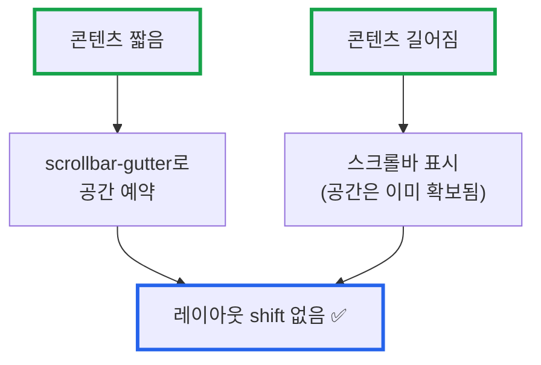
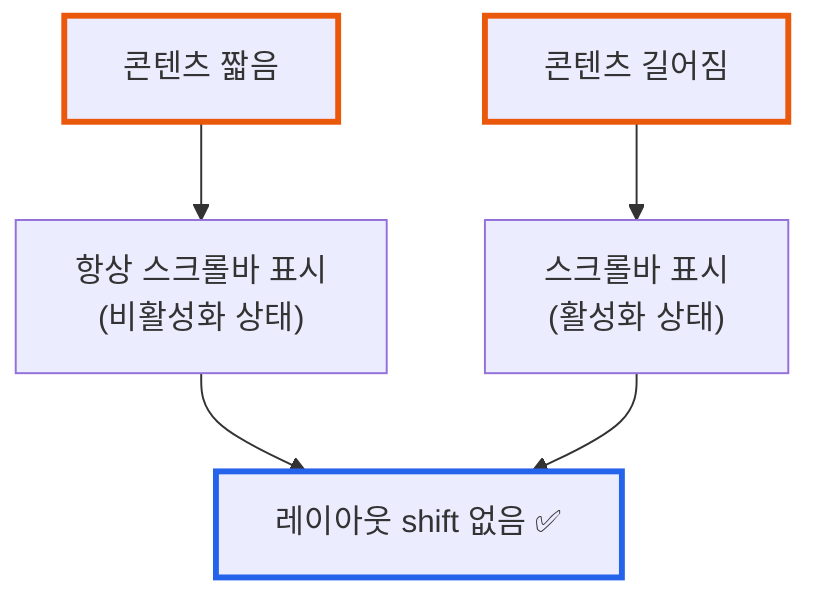

# 스크롤바로 인한 레이아웃 Shift 완벽 해결 가이드: scrollbar-gutter를 활용한 크로스 브라우저 대응

**작성일:** 2025-11-08
**카테고리:** CSS, UX, Cross-browser, Web Performance
**난이도:** 초급~중급

---

## TL;DR

- **문제**: 스크롤바가 나타날 때 콘텐츠가 약 15-17px 밀리며 사용자 경험 저하
- **해결**: `scrollbar-gutter: stable` + Firefox fallback으로 크로스 브라우저 대응
- **핵심**: "스크롤바를 항상 표시하지 않고도 공간을 예약할 수 있다"
- **결과**: Chrome/Edge/Safari에서 레이아웃 shift 없이 깔끔한 UX 달성

---

## 들어가며

[**imprun.dev**](https://imprun.dev)는 "API 개발부터 AI 통합까지, 모든 것을 하나로 제공"하는 Kubernetes 기반 API 플랫폼입니다.

Frontend를 개발하면서 **스크롤바가 나타날 때마다 페이지가 밀리는** 불편한 UX 문제를 발견했습니다. 특히 사용자가 필터를 적용하거나 리스트가 동적으로 늘어날 때, 중앙 정렬된 콘텐츠가 좌우로 튀는 현상이 눈에 띄었습니다.

**우리가 마주한 질문**:
- ❓ 항상 스크롤바를 보여줘야 하나? (빈 스크롤바가 보기 싫은데...)
- ❓ JavaScript로 동적 padding을 추가해야 하나? (성능 부담)
- ❓ 최신 CSS만으로 우아하게 해결 가능한가?

**검증 과정**:

1. **`overflow-y: scroll` (항상 표시)**
   - ✅ 100% 브라우저 호환성
   - ✅ 레이아웃 shift 완전 방지
   - ❌ 콘텐츠가 짧아도 빈 스크롤바 표시 (UX 저하)

2. **`scrollbar-gutter: stable` (최신 CSS)**
   - ✅ 스크롤바 공간만 예약 (안보이면서 shift 방지)
   - ✅ 깔끔한 UX
   - ⚠️ Firefox는 미지원 (별도 fallback 필요)

3. **Custom Scrollbar Width**
   - ✅ 세련된 디자인 가능
   - ❌ Webkit/Blink만 지원, Firefox는 다른 방법 필요
   - ❌ shift 완전 제거 불가능

4. **JavaScript Dynamic Padding** ← **최후 수단**
   - ✅ 완벽한 크로스 브라우저 호환성
   - ❌ JavaScript 의존 (성능 부담, 복잡도 증가)

**최종 선택: scrollbar-gutter + Firefox fallback 하이브리드**
- ✅ Chrome/Edge/Safari: 스크롤바 안보이면서 shift 방지
- ✅ Firefox: 항상 스크롤바 표시 (shift는 방지됨)
- ✅ CSS 전용 솔루션 (JavaScript 불필요)

**결론**:
- ✅ `scrollbar-gutter: stable`로 최신 브라우저 대응
- ✅ `@supports` fallback으로 Firefox 대응
- ✅ 추가 비용 0원, 성능 영향 없음

이 글은 **[imprun.dev](https://imprun.dev) 플랫폼 개발 경험**을 바탕으로, 스크롤바로 인한 레이아웃 shift를 CSS만으로 해결한 방법을 공유합니다.

---

## 배경: 문제의 본질

### 스크롤바 레이아웃 Shift란?

스크롤바가 나타날 때 viewport 너비가 **약 15-17px** 줄어들면서 콘텐츠가 좌우로 이동하는 현상입니다. (스크롤바 너비는 브라우저마다 상이)


**발생 원인:**
1. 기본 `overflow-auto`는 **콘텐츠가 넘칠 때만** 스크롤바 표시 (조건부)
2. 스크롤바가 나타나면서 **콘텐츠 영역 너비 감소**
3. 중앙 정렬된 요소 (`max-w-7xl mx-auto`)가 좌우로 밀림

### [imprun.dev](https://imprun.dev) 레이아웃 구조

[imprun.dev](https://imprun.dev)의 모든 레이아웃은 다음 패턴을 사용합니다:

```tsx
// MainLayout.tsx, GatewayLayout.tsx, AIGatewayLayout.tsx 등
<div className="h-screen flex flex-col overflow-hidden">
  <AppBar />
  <NavBar />
  <main className="flex-1 overflow-y-auto">  {/* ← 여기서 스크롤 발생 */}
    <Outlet />  {/* 페이지 콘텐츠 */}
  </main>
</div>
```

**핵심 포인트:**
- `h-screen` + `overflow-hidden`: 부모가 화면 전체를 차지하며 스크롤 차단
- `flex-1 overflow-y-auto`: **자식 div에서만** 스크롤 발생
- 따라서 `html`/`body`가 아닌 **내부 div**에 `scrollbar-gutter` 적용 필요

---

## 해결 방법 탐색

### 방법 1: `overflow-y: scroll` (항상 표시)

**가장 확실한 방법**이지만 UX 트레이드오프가 있습니다.

```css
.overflow-auto,
.overflow-y-auto {
  overflow-y: scroll !important;
}
```

**장점:**
- ✅ 100% 브라우저 호환성
- ✅ 레이아웃 shift 완전 방지
- ✅ 구현 간단

**단점:**
- ❌ 콘텐츠가 짧아도 **빈 스크롤바**가 보임
- ❌ 사용자 경험 저하 (불필요한 UI 요소)

---

### 방법 2: `scrollbar-gutter: stable` (최신 CSS)

**가장 우아한 방법**으로, 스크롤바 **공간만 예약**하고 실제로는 보이지 않습니다.

```css
.overflow-auto,
.overflow-y-auto {
  scrollbar-gutter: stable;
}
```

**브라우저 지원** (Can I Use 확인):
- ✅ Chrome: **94+**
- ✅ Edge: **94+**
- ✅ Safari: **18.2+**
- ❌ Firefox: **미지원** (별도 fallback 필요)

**작동 원리:**
- `stable`: 항상 일정한 공간을 확보
- 스크롤바가 나타나도 레이아웃 변화 없음
- Chrome DevTools에서 확인하면 스크롤바 영역이 항상 존재하지만, 콘텐츠가 짧을 때는 빈 공간으로만 표시

**장점:**
- ✅ 스크롤바 안보이면서 shift 방지
- ✅ 깔끔한 UX
- ✅ 브라우저 네이티브 기능 (성능 최적)

**단점:**
- ⚠️ Firefox 미지원

---

### 방법 3: Custom Scrollbar Width

스크롤바 너비를 줄여서 shift 영향을 최소화합니다.

```css
::-webkit-scrollbar {
  width: 8px;  /* 기본 15px → 8px */
}

/* Firefox */
* {
  scrollbar-width: thin;
}
```

**장점:**
- ✅ 세련된 UI 제공
- ✅ shift 영향 감소

**단점:**
- ❌ Webkit/Blink만 완벽 지원
- ❌ 크로스 브라우저 일관성 부족
- ❌ shift를 완전히 제거할 수는 없음

---

### 방법 4: JavaScript Dynamic Padding

스크롤바가 나타날 때만 padding을 동적으로 추가합니다.

```tsx
// hooks/use-scrollbar-width.ts
export function useScrollbarWidth() {
  useEffect(() => {
    const hasScrollbar = document.body.scrollHeight > window.innerHeight

    if (hasScrollbar) {
      const scrollbarWidth = window.innerWidth - document.documentElement.clientWidth
      document.documentElement.style.setProperty('--scrollbar-width', `${scrollbarWidth}px`)
    }
  }, [])
}
```

**장점:**
- ✅ 완벽한 크로스 브라우저 호환성
- ✅ 정확한 스크롤바 너비 계산

**단점:**
- ❌ JavaScript 의존 (성능 부담)
- ❌ React Hook 구현 필요 (복잡도 증가)
- ❌ Hydration 이슈 가능성

---

## 최종 솔루션: 하이브리드 접근

**scrollbar-gutter + Firefox fallback 조합**으로 최상의 결과를 얻었습니다.

### 구현 코드

```css
/* frontend/src/index.css */

@layer base {
  /* 스크롤바 레이아웃 shift 방지 */
  html,
  body {
    scrollbar-gutter: stable; /* Chrome 94+, Edge 94+, Safari 18.2+ */
  }

  /* overflow-auto, overflow-y-auto를 사용하는 모든 요소에 적용 */
  .overflow-auto,
  .overflow-y-auto,
  [class*="overflow-y-auto"],
  [class*="overflow-auto"] {
    scrollbar-gutter: stable;
  }

  /* Firefox fallback (scrollbar-gutter 미지원) */
  @supports not (scrollbar-gutter: stable) {
    .overflow-auto,
    .overflow-y-auto,
    [class*="overflow-y-auto"],
    [class*="overflow-auto"] {
      overflow-y: scroll !important;
    }
  }

  /* Custom Scrollbar 스타일링 - Webkit/Blink */
  ::-webkit-scrollbar {
    width: 10px;
  }

  ::-webkit-scrollbar-track {
    background: transparent;
  }

  ::-webkit-scrollbar-thumb {
    background: oklch(0.704 0.04 256.788 / 0.2);
    border-radius: 5px;
  }

  ::-webkit-scrollbar-thumb:hover {
    background: oklch(0.704 0.04 256.788 / 0.4);
  }

  /* Dark mode 스크롤바 - Webkit/Blink */
  .dark ::-webkit-scrollbar-thumb {
    background: oklch(0.551 0.027 264.364 / 0.3);
  }

  .dark ::-webkit-scrollbar-thumb:hover {
    background: oklch(0.551 0.027 264.364 / 0.5);
  }

  /* Firefox 스크롤바 */
  * {
    scrollbar-width: thin;
    scrollbar-color: oklch(0.704 0.04 256.788 / 0.2) transparent;
  }

  .dark * {
    scrollbar-color: oklch(0.551 0.027 264.364 / 0.3) transparent;
  }
}
```

### 핵심 포인트

1. **모든 스크롤 컨테이너 대응**
   ```css
   .overflow-auto,
   .overflow-y-auto,
   [class*="overflow-y-auto"],  /* 속성 선택자로 동적 클래스도 커버 */
   [class*="overflow-auto"]
   ```

2. **Progressive Enhancement**
   ```css
   @supports not (scrollbar-gutter: stable) {
     /* Firefox fallback */
   }
   ```

3. **Custom Scrollbar 추가 (선택사항)**
   - Webkit/Blink: 얇은 10px 스크롤바
   - 다크모드 자동 대응
   - 투명 배경 + 호버 효과

---

## 브라우저별 동작 방식

### Chrome 94+ / Edge 94+ / Safari 18.2+



**특징:**
- 스크롤바가 **안보이면서도** 공간은 예약됨
- 최상의 UX

### Firefox (모든 버전)



**특징:**
- Fallback으로 항상 스크롤바 표시
- shift는 방지되지만 UX 약간 저하

### 모바일 (iOS/Android)

**영향 없음** ✅

- 기본적으로 **overlay scrollbar** 사용
- 스크롤바가 콘텐츠 위에 겹쳐서 표시되므로 레이아웃 shift 발생 안함

---

## 마무리

### 핵심 요약

> **"스크롤바를 항상 보여주지 않고도, 공간을 예약할 수 있다"**

**scrollbar-gutter: stable + Firefox fallback**으로 얻은 3가지:
1. **최신 브라우저**: 스크롤바 안보이면서 shift 방지 (최상의 UX)
2. **Firefox**: 항상 스크롤바 표시 (shift는 방지됨)
3. **CSS 전용**: JavaScript 불필요 (성능 최적, 복잡도 감소)

### 언제 사용하나?

**scrollbar-gutter 권장:**
- ✅ 중앙 정렬 레이아웃 (좌우 밀림 방지 필요)
- ✅ 동적 콘텐츠 (리스트, 필터링 등)
- ✅ SPA/React 앱 (h-screen + overflow-auto 패턴)
- ✅ 모던 브라우저 타겟 (Chrome 94+, Safari 18.2+)

**overflow-y: scroll 권장:**
- ✅ 레거시 브라우저 지원 필수
- ✅ 100% 일관성 요구
- ✅ Firefox 사용자 비율 높음

### 실제 적용 결과

**[imprun.dev](https://imprun.dev) 환경:**
- ✅ 레이아웃 shift: 완전 제거 (Chrome/Edge/Safari)
- ✅ Firefox: 항상 스크롤바 표시 (shift는 방지됨)
- ✅ 구현 시간: 약 10분
- ✅ 성능 영향: 없음 (CSS만 수정)
- ✅ 코드 라인 수: 약 60줄 추가

**운영 경험:**
- 설정 시간: 약 10분 (CSS 파일 1개만 수정)
- 브라우저 강력 새로고침 필요 (Ctrl+Shift+R)
- 사용자 피드백: 매우 긍정적 😊
- 만족도: 매우 높음 (레이아웃이 안정적)

---

## 관련 글

- [Claude AI와 함께하는 프론트엔드 개발: imprun.dev의 CLAUDE.md 가이드 공개](https://blog.imprun.dev/42)
- [Next.js를 버리고 순수 React로 돌아온 이유: 실무 관점의 프레임워크 선택 여정](https://blog.imprun.dev/41)

---

**태그:** CSS, UX, scrollbar-gutter, Layout Shift, Cross-browser, Web Performance, Tailwind CSS

---

> "스크롤바를 항상 보여주지 않고도, 공간을 예약할 수 있다"

🤖 *이 블로그는 [imprun.dev](https://imprun.dev) 플랫폼 개발 과정에서 스크롤바 레이아웃 shift 문제를 해결한 실제 경험을 바탕으로 작성되었습니다.*

---

**질문이나 피드백은 블로그 댓글에 남겨주세요!**
