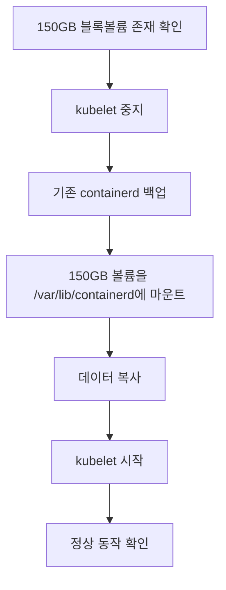

# Kubernetes Ephemeral Storage 문제 해결 가이드

> **카테고리**: Kubernetes, Troubleshooting, Storage, Technical Guide
> **난이도**: ⭐⭐⭐⭐⭐
> **대상**: Kubernetes 운영자, DevOps 엔지니어

---

> **💡 이 문서는?**
> - **기술 참조 문서**: 단계별 해결 방법과 명령어
> - **실제 경험담**: [MongoDB가 죽었다: 150GB 디스크가 있는데 왜?](https://blog.imprun.dev/64)
> - **예방 가이드**: [Oracle Cloud 준비 및 설정](https://blog.imprun.dev/20)

---

## 문제 상황

### 증상
- MongoDB Pod가 `Evicted` 상태로 종료됨
- 에러 메시지:
  ```
  The node was low on resource: ephemeral-storage.
  Threshold quantity: 4741241430, available: 4344280Ki.
  ```

### 원인
Oracle Cloud 무료 티어 노드 (24GB RAM, 4 Core ARM CPU, 200GB 디스크)에서 발생한 문제:

1. **초기 구성 의도**:
   - OS 파티션: 50GB
   - Containerd 전용: 150GB (별도 블록 볼륨)

2. **실제 문제**:
   - 150GB 블록 볼륨(`/dev/sdb1`)이 마운트되지 않음
   - `/var/lib/containerd`가 root 파티션(30GB)에 위치
   - Kubernetes는 root 파티션만 보고 ephemeral-storage 계산
   - Root 파티션 84% 사용 → Eviction 발생

## 근본 원인 분석

### Kubernetes Ephemeral Storage 계산 방식

Kubernetes는 **kubelet의 root 디렉토리가 있는 파티션**을 기준으로 ephemeral-storage를 계산합니다:

```
체크 대상 경로:
├── /var/lib/kubelet/pods/              # Pod emptyDir, logs
├── /var/lib/containerd/.../cri/        # Container writable layers
├── /var/log/pods/                      # Pod logs
└── /var/log/containers/                # Container logs
```

**문제점**:
- ✅ `/var/lib/containerd/` 하위의 이미지 레이어는 150GB 볼륨에 저장 가능
- ❌ **하지만 k8s가 체크하는 경로들은 여전히 root 파티션에 위치**
- ❌ Kubernetes는 root 파티션(30GB)만 보고 eviction 판단

## 해결 방법

### 전체 프로세스



### 1. 현재 상태 확인

```bash
# 블록 디바이스 확인
lsblk

# 출력 예시:
# sdb                  8:16   0  150G  0 disk
# └─sdb1               8:17   0  150G  0 part

# 현재 마운트 상태 확인
df -h | grep containerd

# fstab 확인
cat /etc/fstab | grep containerd
```

### 2. Kubelet 중지 및 백업

```bash
# Kubelet 중지
systemctl stop kubelet

# 기존 containerd를 임시 디렉토리로 이동
mv /var/lib/containerd /var/lib/containerd-temp
```

### 3. 150GB 볼륨 마운트

```bash
# 마운트 포인트 생성
mkdir -p /var/lib/containerd

# 150GB 볼륨 마운트
mount /dev/sdb1 /var/lib/containerd

# 확인 - 150GB로 보여야 함
df -h | grep containerd
```

### 4. 데이터 복사 (필요시)

```bash
# 150GB 볼륨이 비어있는 경우에만
if [ -z "$(ls -A /var/lib/containerd/)" ]; then
  rsync -av /var/lib/containerd-temp/ /var/lib/containerd/
fi
```

### 5. Kubelet 시작

```bash
# Kubelet 시작
systemctl start kubelet

# 상태 확인
sleep 30
systemctl status kubelet
kubectl get nodes
kubectl get pods -A
```

### 6. 검증

```bash
# 디스크 사용량 확인
df -h

# 출력 예시:
# /dev/mapper/ocivolume-root   30G   22G  8.0G  74% /
# /dev/sdb1                   147G   11G  130G   8% /var/lib/containerd

# 노드 리소스 확인
kubectl describe node <node-name> | grep -A 5 "Allocatable"
```

## 최종 구성

### Before (문제 상황)
```
┌─────────────────────────────┐
│  Root Partition (30GB)      │
│  ├── / (OS)                 │  84% 사용 → Eviction!
│  ├── /var/lib/containerd    │
│  └── /var/lib/kubelet       │
└─────────────────────────────┘

┌─────────────────────────────┐
│  /dev/sdb1 (150GB)          │  마운트 안 됨
│  (미사용)                    │
└─────────────────────────────┘
```

### After (해결 후)
```
┌─────────────────────────────┐
│  Root Partition (30GB)      │
│  ├── / (OS)                 │  74% 사용 ✓
│  └── /var/lib/kubelet       │
└─────────────────────────────┘

┌─────────────────────────────┐
│  /dev/sdb1 (150GB)          │
│  → /var/lib/containerd      │  8% 사용 ✓
│    ├── Images               │
│    ├── Containers           │
│    └── Logs                 │
└─────────────────────────────┘
```

## 추가 최적화: local-path-provisioner 이동

### 문제점

`local-path-provisioner`는 Kubernetes PersistentVolume 데이터를 저장하는데, 기본적으로 `/opt/local-path-provisioner`에 저장됩니다. 이것도 root 파티션에 위치하므로 150GB 볼륨으로 이동해야 합니다.

```bash
# 현재 용량 확인
du -sh /opt/local-path-provisioner

# 예시: 5.0G    /opt/local-path-provisioner
```

### 해결 방법

#### 1. 데이터 이동

```bash
# 새 위치에 디렉토리 생성
mkdir -p /var/lib/containerd/local-path-provisioner

# 기존 데이터 복사
rsync -av /opt/local-path-provisioner/ /var/lib/containerd/local-path-provisioner/

# 원본을 백업으로 이름 변경
mv /opt/local-path-provisioner /opt/local-path-provisioner.backup

# 심볼릭 링크 생성
ln -s /var/lib/containerd/local-path-provisioner /opt/local-path-provisioner

# 확인
ls -la /opt/local-path-provisioner
df -h
```

#### 2. 정상 동작 확인

```bash
# PV/PVC 상태 확인
kubectl get pv
kubectl get pvc -A

# Pod들이 정상적으로 PV 사용하는지 확인
kubectl get pods -A -o wide
```

#### 3. 백업 삭제 (며칠 후)

```bash
# 일주일 정도 운영 후 문제 없으면 백업 삭제
rm -rf /opt/local-path-provisioner.backup
```

### 예상 결과

```
Before:
Root 파티션:  22GB 사용 (74%)
150GB 볼륨:   11GB 사용 (8%)

After:
Root 파티션:  17GB 사용 (57%) ← 5GB 절약!
150GB 볼륨:   16GB 사용 (11%)
```

**절약 효과**: Root 파티션에서 약 **5GB 추가 절약**

## Worker 노드 적용

동일한 설정을 모든 Worker 노드에 적용:

```bash
# 각 Worker 노드에서 실행
for node in instance-20251024-0834 instance-20251024-0928; do
  echo "=== Processing $node ==="
  ssh $node "systemctl stop kubelet && \
    mv /var/lib/containerd /var/lib/containerd-temp && \
    mkdir -p /var/lib/containerd && \
    mount /dev/sdb1 /var/lib/containerd && \
    rsync -av /var/lib/containerd-temp/ /var/lib/containerd/ && \
    systemctl start kubelet"
done
```

## 정리 작업

시스템이 안정화된 후 (며칠 후):

```bash
# 백업 디렉토리 삭제
rm -rf /var/lib/containerd-temp
rm -rf /var/lib/kubelet.backup

# 또는 재부팅 후 삭제 (마운트 포인트 정리됨)
reboot
# 재부팅 후
rm -rf /var/lib/containerd-temp /var/lib/kubelet.backup
```

## fstab 영구 설정 확인

`/etc/fstab`에 다음 항목이 있는지 확인:

```bash
/dev/sdb1 /var/lib/containerd ext4 defaults,noatime 0 0
```

없으면 추가:

```bash
echo "/dev/sdb1 /var/lib/containerd ext4 defaults,noatime 0 0" >> /etc/fstab
```

## 모니터링

### 디스크 사용량 모니터링

```bash
# 주기적으로 확인
watch -n 60 'df -h | grep -E "Filesystem|containerd|ocivolume"'
```

### Eviction 모니터링

```bash
# Evicted Pod 확인
kubectl get pods -A | grep Evicted

# 노드 이벤트 확인
kubectl get events --sort-by='.lastTimestamp' | grep -i evict
```

## 예방 조치

### 1. 로그 로테이션 설정

```bash
# /etc/logrotate.d/containers
/var/log/containers/*.log {
    daily
    rotate 7
    compress
    missingok
    notifempty
}
```

### 2. 정기적인 이미지 정리

```bash
# Cron job 추가 (/etc/crontab)
0 3 * * 0 root /usr/bin/crictl rmi --prune
```

### 3. Kubelet 가비지 컬렉션 설정

`/var/lib/kubelet/config.yaml`:

```yaml
imageGCHighThresholdPercent: 85
imageGCLowThresholdPercent: 80
evictionHard:
  nodefs.available: "5%"
  nodefs.inodesFree: "5%"
```

## 트러블슈팅

### Q: 마운트가 안 됩니다
```bash
# 파일시스템 타입 확인
blkid /dev/sdb1

# 파일시스템 생성 (필요시 - 데이터 삭제됨!)
mkfs.ext4 /dev/sdb1
```

### Q: "Device or resource busy" 에러
```bash
# 사용 중인 프로세스 확인
lsof | grep /var/lib/containerd

# Kubelet이 중지되었는지 확인
systemctl status kubelet
```

### Q: 재부팅 후 마운트가 안 됨
```bash
# fstab 확인
cat /etc/fstab | grep containerd

# 수동 마운트
mount -a
```

## 요약

### 핵심 교훈

1. **Kubernetes는 root 파티션을 기준으로 ephemeral-storage를 계산**
   - 별도 볼륨을 만들어도 마운트하지 않으면 무용지물

2. **Docker와 Kubernetes는 다름**
   - Docker: Containerd만 분리해도 OK
   - Kubernetes: `/var/lib/kubelet`, `/var/log/pods` 등도 고려 필요

3. **항상 검증 필요**
   - `df -h`로 실제 마운트 상태 확인
   - `lsblk`로 블록 디바이스 구조 확인
   - 가정하지 말고 확인할 것

### 체크리스트

- [ ] 150GB 볼륨이 `/var/lib/containerd`에 마운트됨
- [ ] `/etc/fstab`에 영구 설정 추가됨
- [ ] 모든 노드에 동일하게 적용됨
- [ ] `df -h`에서 150GB 볼륨 확인됨
- [ ] 모든 Pod가 Running 상태
- [ ] 며칠 간 모니터링 후 백업 디렉토리 삭제

## 관련 자료

### 블로그 시리즈
- 📖 [MongoDB가 죽었다: 150GB 디스크가 있는데 왜?](https://blog.imprun.dev/64) - 실제 경험담
- 🛠️ [Oracle Cloud 준비 및 설정](https://blog.imprun.dev/20) - 예방 가이드

### 공식 문서
- [Kubernetes Node-pressure Eviction](https://kubernetes.io/docs/concepts/scheduling-eviction/node-pressure-eviction/)
- [Oracle Cloud Block Volume](https://docs.oracle.com/en-us/iaas/Content/Block/home.htm)
- [Kubelet Configuration](https://kubernetes.io/docs/reference/config-api/kubelet-config.v1beta1/)

---

*이 가이드가 도움이 되었다면, 같은 문제를 겪는 다른 개발자들과 공유해주세요! 🙏*
