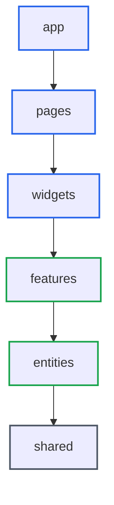

# Feature-Sliced Design: 프론트엔드 아키텍처의 표준화된 접근법

> **작성일**: 2025년 11월 24일
> **카테고리**: Frontend Architecture
> **키워드**: Feature-Sliced Design, FSD, React, 프론트엔드 아키텍처, 모듈화, 레이어드 아키텍처

## 요약

Feature-Sliced Design(FSD)은 프론트엔드 프로젝트의 구조를 표준화하는 아키텍처 방법론입니다. 기술 중심이 아닌 비즈니스 기능 중심으로 코드를 조직하며, 7개의 레이어와 엄격한 의존성 규칙을 통해 확장 가능하고 유지보수하기 쉬운 코드베이스를 구축합니다. 현재 20,000개 이상의 오픈소스 프로젝트에서 채택되고 있습니다.

## FSD가 해결하는 문제

### 전통적인 프론트엔드 구조의 한계

대부분의 React 프로젝트는 다음과 같은 기술 중심 구조로 시작합니다:

```
src/
├── components/
│   ├── Button.tsx
│   ├── Header.tsx
│   ├── UserCard.tsx
│   └── ProductList.tsx
├── hooks/
├── utils/
├── services/
└── pages/
```

프로젝트가 성장하면서 발생하는 문제들:

- **컴포넌트 폴더 비대화**: 100개 이상의 컴포넌트가 flat하게 나열됨
- **의존성 혼란**: `UserCard`가 `ProductList`를 import하고, `ProductList`가 다시 `UserCard`를 import하는 순환 참조
- **재사용성 판단 어려움**: 어떤 컴포넌트가 전역적이고, 어떤 것이 특정 기능에 종속되는지 불명확
- **팀 협업 문제**: 새로운 개발자가 코드 구조를 파악하는 데 오랜 시간 소요

### FSD의 해결 방식

FSD는 다음 원칙으로 이 문제들을 해결합니다:

1. **비즈니스 기능 중심 조직**: 기술이 아닌 도메인 기준으로 코드 그룹화
2. **명시적 의존성 규칙**: 하위 레이어만 import 가능
3. **Public API를 통한 캡슐화**: 모듈의 내부 구현을 숨기고 명확한 인터페이스 제공

## 7개의 레이어 구조

FSD는 7개의 표준화된 레이어를 정의합니다. 상위 레이어는 하위 레이어에만 의존할 수 있습니다.


*출처: [Feature-Sliced Design 공식 문서](https://feature-sliced.design/docs/get-started/overview)*

| 레이어 | 역할 |
|--------|------|
| **app** | 애플리케이션 초기화, 라우터, 전역 프로바이더 |
| **pages** | 라우팅되는 전체 화면 |
| **widgets** | 독립적으로 동작하는 큰 UI 블록 |
| **features** | 사용자 상호작용 기능 (로그인, 좋아요, 댓글 작성) |
| **entities** | 비즈니스 엔티티 (User, Product, Order) |
| **shared** | 재사용 가능한 유틸리티, UI 킷, API 클라이언트 |

> **참고**: `processes` 레이어는 deprecated 되었으며, 대부분의 프로젝트에서 6개 레이어로 충분합니다.

### 각 레이어의 역할

#### 1. Shared (공유 레이어)

프로젝트 전반에서 사용되는 기초 모듈입니다. 비즈니스 로직을 포함하지 않습니다.

```
shared/
├── api/          # API 클라이언트, 요청/응답 타입
├── ui/           # 버튼, 입력, 모달 등 기본 UI 컴포넌트
├── lib/          # 날짜 포맷, 유효성 검사 등 유틸리티
├── config/       # 환경 변수, 상수
└── types/        # 공통 타입 정의
```

**예시**: `shared/ui/Button.tsx`

```typescript
interface ButtonProps {
  variant: 'primary' | 'secondary' | 'danger';
  size: 'sm' | 'md' | 'lg';
  children: React.ReactNode;
  onClick?: () => void;
}

export function Button({ variant, size, children, onClick }: ButtonProps) {
  return (
    <button className={cn(buttonVariants({ variant, size }))} onClick={onClick}>
      {children}
    </button>
  );
}
```

#### 2. Entities (엔티티 레이어)

비즈니스 도메인의 핵심 개념을 표현합니다. User, Product, Order 등 실제 비즈니스 객체를 모델링합니다.

```
entities/
├── user/
│   ├── model/    # 사용자 스키마, 타입
│   ├── api/      # 사용자 관련 API 호출
│   └── ui/       # UserAvatar, UserCard 등
├── product/
│   ├── model/
│   ├── api/
│   └── ui/
└── order/
    ├── model/
    ├── api/
    └── ui/
```

**예시**: `entities/user/ui/UserCard.tsx`

```typescript
import { User } from '../model/types';

interface UserCardProps {
  user: User;
}

export function UserCard({ user }: UserCardProps) {
  return (
    <div className="flex items-center gap-3">
      
      <div>
        <p className="font-medium">{user.name}</p>
        <p className="text-sm text-muted-foreground">{user.email}</p>
      </div>
    </div>
  );
}
```

#### 3. Features (기능 레이어)

사용자가 수행하는 구체적인 상호작용을 구현합니다. 각 feature는 하나의 사용자 액션을 담당합니다.

```
features/
├── auth/
│   ├── login/
│   │   ├── ui/       # LoginForm
│   │   ├── model/    # 로그인 상태, 유효성 검사
│   │   └── api/      # 로그인 API 호출
│   └── logout/
├── cart/
│   ├── add-to-cart/
│   └── remove-from-cart/
└── product/
    ├── create-review/
    └── toggle-favorite/
```

**예시**: `features/auth/login/ui/LoginForm.tsx`

```typescript
import { Button } from '@/shared/ui';
import { useLoginMutation } from '../api/login';
import { loginSchema } from '../model/schema';

export function LoginForm() {
  const { mutate: login, isPending } = useLoginMutation();

  const handleSubmit = (data: LoginFormData) => {
    const validated = loginSchema.parse(data);
    login(validated);
  };

  return (
    <form onSubmit={handleSubmit}>
      <Input name="email" type="email" placeholder="이메일" />
      <Input name="password" type="password" placeholder="비밀번호" />
      <Button type="submit" disabled={isPending}>
        {isPending ? '로그인 중...' : '로그인'}
      </Button>
    </form>
  );
}
```

#### 4. Widgets (위젯 레이어)

독립적으로 동작하는 큰 UI 블록입니다. 여러 entities와 features를 조합하여 완성된 기능 단위를 구성합니다.

```
widgets/
├── header/
│   └── ui/
│       └── Header.tsx
├── sidebar/
├── product-card/
└── user-profile/
```

**예시**: `widgets/header/ui/Header.tsx`

```typescript
import { UserCard } from '@/entities/user';
import { LogoutButton } from '@/features/auth/logout';
import { Logo, Navigation } from '@/shared/ui';

export function Header() {
  const { user } = useCurrentUser();

  return (
    <header className="flex items-center justify-between px-6 py-4">
      <Logo />
      <Navigation />
      <div className="flex items-center gap-4">
        {user && <UserCard user={user} />}
        <LogoutButton />
      </div>
    </header>
  );
}
```

#### 5. Pages (페이지 레이어)

라우팅되는 전체 화면을 구성합니다. widgets, features, entities를 조합하여 완성된 페이지를 만듭니다.

```
pages/
├── home/
│   └── ui/
│       └── HomePage.tsx
├── product/
│   └── ui/
│       └── ProductPage.tsx
├── cart/
└── checkout/
```

**예시**: `pages/product/ui/ProductPage.tsx`

```typescript
import { ProductDetails } from '@/entities/product';
import { AddToCartButton } from '@/features/cart/add-to-cart';
import { CreateReviewForm } from '@/features/product/create-review';
import { Header } from '@/widgets/header';
import { ProductReviews } from '@/widgets/product-reviews';

export function ProductPage() {
  const { productId } = useParams();
  const { data: product } = useProduct(productId);

  return (
    <>
      <Header />
      <main className="container mx-auto py-8">
        <ProductDetails product={product} />
        <AddToCartButton productId={productId} />
        <ProductReviews productId={productId} />
        <CreateReviewForm productId={productId} />
      </main>
    </>
  );
}
```

#### 6. App (앱 레이어)

애플리케이션 초기화와 전역 설정을 담당합니다. 슬라이스 없이 세그먼트로만 구성됩니다.

```
app/
├── providers/    # React Query, Theme, Auth 프로바이더
├── routes/       # 라우터 설정
├── styles/       # 전역 스타일
└── main.tsx      # 진입점
```

**예시**: `app/providers/index.tsx`

```typescript
import { QueryClientProvider } from '@tanstack/react-query';
import { ThemeProvider } from './theme';
import { AuthProvider } from './auth';

export function Providers({ children }: { children: React.ReactNode }) {
  return (
    <QueryClientProvider client={queryClient}>
      <ThemeProvider>
        <AuthProvider>
          {children}
        </AuthProvider>
      </ThemeProvider>
    </QueryClientProvider>
  );
}
```

## 슬라이스와 세그먼트

### 슬라이스 (Slice)

슬라이스는 레이어 내에서 비즈니스 도메인별로 코드를 분리하는 단위입니다.

```
entities/
├── user/       ← 슬라이스
├── product/    ← 슬라이스
└── order/      ← 슬라이스
```

**규칙**: 같은 레이어의 슬라이스 간에는 직접 import할 수 없습니다.

```typescript
// entities/order/ui/OrderCard.tsx

// 허용: 하위 레이어 import
import { formatDate } from '@/shared/lib';

// 금지: 같은 레이어의 다른 슬라이스 직접 import
import { UserCard } from '@/entities/user';  // ❌ 금지
```

같은 레이어의 슬라이스를 사용해야 할 경우, 상위 레이어에서 조합합니다:

```typescript
// widgets/order-card/ui/OrderCard.tsx

import { OrderDetails } from '@/entities/order';
import { UserCard } from '@/entities/user';  // ✅ widgets에서 조합

export function OrderCard({ order }: { order: Order }) {
  return (
    <div>
      <UserCard user={order.customer} />
      <OrderDetails order={order} />
    </div>
  );
}
```

### 세그먼트 (Segment)

세그먼트는 슬라이스 내에서 기술적 역할별로 코드를 분리하는 단위입니다.

| 세그먼트 | 역할 | 예시 |
|---------|------|------|
| `ui` | React 컴포넌트, 스타일 | `UserCard.tsx`, `styles.css` |
| `model` | 비즈니스 로직, 타입, 스키마 | `types.ts`, `schema.ts`, `store.ts` |
| `api` | API 호출, 데이터 fetching | `queries.ts`, `mutations.ts` |
| `lib` | 유틸리티 함수 | `formatters.ts`, `validators.ts` |
| `config` | 설정, 상수 | `constants.ts` |

```
entities/user/
├── ui/
│   ├── UserCard.tsx
│   ├── UserAvatar.tsx
│   └── index.ts
├── model/
│   ├── types.ts
│   ├── schema.ts
│   └── index.ts
├── api/
│   ├── queries.ts
│   └── index.ts
└── index.ts        ← Public API
```

## Public API 규칙

각 슬라이스는 `index.ts`를 통해 Public API를 노출합니다. 외부에서는 반드시 이 Public API를 통해서만 접근해야 합니다.

### 잘못된 방식

```typescript
// ❌ 내부 경로 직접 import
import { UserCard } from '@/entities/user/ui/UserCard';
import { userSchema } from '@/entities/user/model/schema';
```

### 올바른 방식

```typescript
// ✅ Public API를 통한 import
import { UserCard, userSchema } from '@/entities/user';
```

### Public API 작성 예시

```typescript
// entities/user/index.ts

// UI 컴포넌트
export { UserCard } from './ui/UserCard';
export { UserAvatar } from './ui/UserAvatar';

// 타입과 스키마
export type { User, UserRole } from './model/types';
export { userSchema } from './model/schema';

// API hooks
export { useUser, useUsers } from './api/queries';
```

**주의**: 와일드카드 export(`export * from './ui'`)는 지양합니다. 의도치 않게 내부 구현이 노출될 수 있습니다.

## 의존성 규칙

FSD의 핵심은 엄격한 의존성 규칙입니다.



### 규칙 1: 하위 레이어만 import 가능

```typescript
// features/auth/login/ui/LoginForm.tsx

import { Button, Input } from '@/shared/ui';     // ✅ shared 가능
import { User } from '@/entities/user';          // ✅ entities 가능
import { Header } from '@/widgets/header';       // ❌ widgets 불가
import { ProductPage } from '@/pages/product';   // ❌ pages 불가
```

### 규칙 2: 같은 레이어의 다른 슬라이스 import 금지

```typescript
// entities/order/model/types.ts

import { Product } from '@/entities/product';  // ❌ 금지
import { formatCurrency } from '@/shared/lib'; // ✅ 허용
```

### 규칙 3: Cross-import가 필요한 경우

엔티티 간 관계가 필요할 때는 상위 레이어에서 조합하거나, shared에 공통 타입을 정의합니다.

```typescript
// shared/types/order.ts
export interface OrderItem {
  productId: string;
  quantity: number;
  price: number;
}

// entities/order/model/types.ts
import { OrderItem } from '@/shared/types/order';

export interface Order {
  id: string;
  items: OrderItem[];
  customerId: string;
}
```

## 실제 프로젝트 구조 예시

```
src/
├── app/
│   ├── providers/
│   │   ├── query.tsx
│   │   ├── theme.tsx
│   │   └── index.tsx
│   ├── routes/
│   │   └── router.tsx
│   ├── styles/
│   │   └── globals.css
│   └── main.tsx
│
├── pages/
│   ├── home/
│   │   └── ui/
│   │       └── HomePage.tsx
│   ├── products/
│   │   └── ui/
│   │       ├── ProductListPage.tsx
│   │       └── ProductDetailPage.tsx
│   └── cart/
│       └── ui/
│           └── CartPage.tsx
│
├── widgets/
│   ├── header/
│   │   └── ui/
│   │       └── Header.tsx
│   ├── footer/
│   ├── product-card/
│   └── cart-summary/
│
├── features/
│   ├── auth/
│   │   ├── login/
│   │   │   ├── ui/
│   │   │   ├── model/
│   │   │   └── api/
│   │   └── logout/
│   ├── cart/
│   │   ├── add-to-cart/
│   │   ├── remove-from-cart/
│   │   └── update-quantity/
│   └── product/
│       ├── search/
│       └── filter/
│
├── entities/
│   ├── user/
│   │   ├── ui/
│   │   ├── model/
│   │   ├── api/
│   │   └── index.ts
│   ├── product/
│   │   ├── ui/
│   │   ├── model/
│   │   ├── api/
│   │   └── index.ts
│   └── cart/
│       ├── model/
│       ├── api/
│       └── index.ts
│
└── shared/
    ├── api/
    │   ├── client.ts
    │   └── types.ts
    ├── ui/
    │   ├── button/
    │   ├── input/
    │   ├── modal/
    │   └── index.ts
    ├── lib/
    │   ├── cn.ts
    │   ├── format.ts
    │   └── index.ts
    └── config/
        └── env.ts
```

## 프레임워크별 FSD 적용

FSD는 특정 프레임워크에 종속되지 않지만, 각 프레임워크의 라우팅 방식에 따라 구조 조정이 필요합니다.

### Next.js App Router

Next.js App Router는 `app` 폴더를 라우팅에 사용하므로 FSD의 `app`, `pages` 레이어와 충돌합니다.

**해결 방법**: Next.js의 `app` 폴더는 프로젝트 루트에, FSD 레이어는 `src` 폴더에 배치합니다.

```
project-root/
├── app/                    # Next.js 라우팅 전용
│   ├── dashboard/
│   │   └── page.tsx       # FSD 페이지 재내보내기
│   └── layout.tsx
├── pages/                  # 빈 폴더 (빌드 오류 방지용)
│   └── .gitkeep
└── src/
    ├── app/               # FSD app 레이어
    │   └── providers/
    ├── pages/             # FSD pages 레이어
    │   └── dashboard/
    │       └── ui/
    │           └── DashboardPage.tsx
    ├── widgets/
    ├── features/
    ├── entities/
    └── shared/
```

**페이지 재내보내기 패턴**:

```typescript
// app/dashboard/page.tsx
export { DashboardPage as default } from '@/pages/dashboard';
export { metadata } from '@/pages/dashboard';
```

**주의사항**:
- 루트에 빈 `pages` 폴더가 필요합니다. 그렇지 않으면 Next.js가 `src/pages`를 Pages Router로 인식하여 빌드 오류가 발생합니다.
- `.gitkeep` 또는 `README.md`를 추가하여 빈 폴더가 Git에서 추적되도록 합니다.

### React Router v7 / Remix

React Router v7은 Remix와 통합되어 파일 기반 라우팅을 지원합니다. FSD 공식 튜토리얼은 Remix를 사용합니다.

```
src/
├── app/
│   ├── routes/            # React Router 라우팅
│   │   ├── _index.tsx
│   │   └── dashboard.tsx
│   └── root.tsx
├── pages/
│   └── dashboard/
│       └── ui/
├── widgets/
├── features/
├── entities/
└── shared/
```

**라우트 파일에서 FSD 페이지 사용**:

```typescript
// app/routes/dashboard.tsx
import { DashboardPage } from '@/pages/dashboard';

export default function Dashboard() {
  return <DashboardPage />;
}
```

### Vite + React (SPA)

순수 React SPA에서는 FSD를 가장 자연스럽게 적용할 수 있습니다.

```
src/
├── app/
│   ├── providers/
│   ├── routes/
│   │   └── router.tsx     # React Router 설정
│   └── main.tsx
├── pages/
├── widgets/
├── features/
├── entities/
└── shared/
```

### shadcn/ui 통합

shadcn/ui 컴포넌트는 `shared/ui` 세그먼트에 배치합니다.

```
shared/
├── ui/
│   ├── button.tsx         # shadcn/ui Button
│   ├── input.tsx          # shadcn/ui Input
│   ├── dialog.tsx         # shadcn/ui Dialog
│   └── index.ts
└── lib/
    └── utils.ts           # cn() 함수
```

shadcn/ui CLI로 컴포넌트 추가 시 경로 설정:

```json
// components.json
{
  "aliases": {
    "components": "@/shared/ui",
    "utils": "@/shared/lib/utils"
  }
}
```

### 실용적 변형: 선택적 레이어 사용

모든 레이어를 사용할 필요는 없습니다. 프로젝트 규모에 따라 선택적으로 적용합니다.

**소규모 프로젝트** (레이어 3-4개):

```
src/
├── pages/
├── features/
└── shared/
```

**중규모 프로젝트** (레이어 5개):

```
src/
├── app/
├── pages/
├── features/
├── entities/
└── shared/
```

**대규모 프로젝트** (전체 레이어):

```
src/
├── app/
├── pages/
├── widgets/
├── features/
├── entities/
└── shared/
```

## FSD 도입 시 고려사항

### 적합한 프로젝트

- 다수의 개발자가 협업하는 중대형 프로젝트
- 장기간 유지보수가 필요한 프로덕트
- 도메인 로직이 복잡한 비즈니스 애플리케이션

### 적합하지 않은 프로젝트

- 단기 프로토타입이나 MVP
- 1-2명이 개발하는 소규모 프로젝트
- 단순한 랜딩 페이지나 정적 사이트

### 마이그레이션 전략

기존 프로젝트에 FSD를 도입할 때는 점진적 마이그레이션을 권장합니다:

1. **Shared 레이어 정리**: 기존 `utils`, `components` 폴더를 shared로 이동
2. **Entities 식별**: 핵심 비즈니스 객체를 entities로 분리
3. **Features 추출**: 사용자 상호작용을 features로 분리
4. **Widgets 구성**: 재사용 가능한 큰 UI 블록을 widgets로 이동
5. **Pages 정리**: 라우팅되는 화면을 pages로 구성

## 린팅 도구

FSD 규칙을 강제하기 위해 [Steiger](https://github.com/feature-sliced/steiger) 린터를 사용할 수 있습니다.

```bash
npm install -D @feature-sliced/steiger
```

```json
// .eslintrc.json
{
  "extends": ["@feature-sliced/steiger"]
}
```

주요 검사 항목:

- 레이어 간 잘못된 import 감지
- 같은 레이어 슬라이스 간 cross-import 감지
- Public API를 우회한 내부 모듈 접근 감지

## 참고 자료

### 공식 문서
- [Feature-Sliced Design 공식 사이트](https://feature-sliced.design/) - 전체 문서와 가이드
- [Usage with Next.js](https://feature-sliced.design/docs/guides/tech/with-nextjs) - Next.js App Router 통합 가이드
- [FSD Examples](https://feature-sliced.design/examples) - 실제 프로젝트 예시
- [Awesome Feature-Sliced Design](https://github.com/feature-sliced/awesome) - FSD 관련 자료 모음

### 도구
- [Steiger](https://github.com/feature-sliced/steiger) - 공식 아키텍처 린터
- [feature-sliced/cli](https://github.com/feature-sliced/cli) - 레이어, 슬라이스, 세그먼트 생성 CLI
- [ESLint Config](https://github.com/feature-sliced/eslint-config) - ESLint 플러그인

### 한국어 자료
- [Frontend Clean Architecture (with FSD & DDD)](https://github.com/feature-sliced/awesome#articles) - 이민기 (Lapidix)
- [FSD 관점으로 바라보는 코드 경계 찾기](https://github.com/feature-sliced/awesome#articles) - 유용태 (테오)
- [프론트엔드 개발자 관점으로 바라보는 관심사의 분리와 좋은 폴더 구조 (feat. FSD)](https://github.com/feature-sliced/awesome#articles) - 유용태 (테오)
- [FSD(Feature-Sliced Design) 완벽 가이드](https://velog.io/@clydehan/FSDFeature-Sliced-Design-완벽-가이드) - Next.js App Router 문제점 포함

### 영문 자료
- [How to deal with NextJS App Router and FSD](https://dev.to/m_midas/how-to-deal-with-nextjs-using-feature-sliced-design-4c67) - Next.js 통합 상세 가이드
- [Feature-Sliced Design: The Best Frontend Architecture](https://dev.to/m_midas/feature-sliced-design-the-best-frontend-architecture-4noj) - FSD 개요

### 관련 블로그
- [AI Agent를 위한 Frontend 개발 가이드](https://blog.imprun.dev/68) - AGENTS.md와 FSD의 조합
