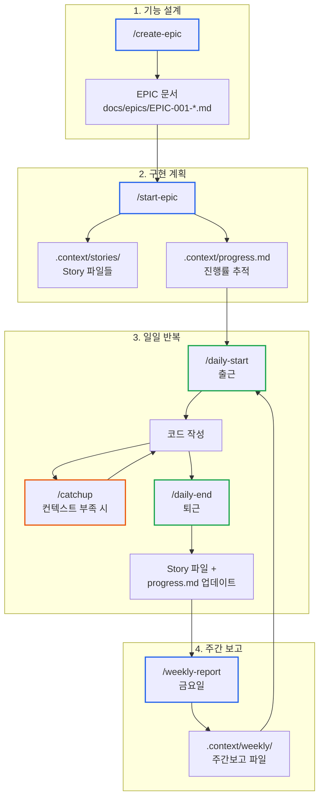
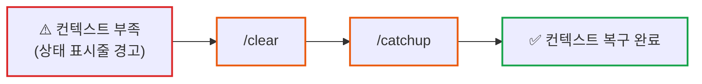
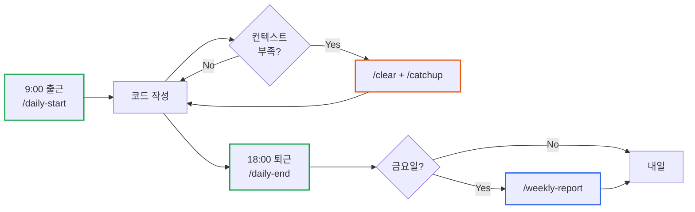

# Claude Code 실무 개발 워크플로우: EPIC부터 일일 개발, 주간보고까지

> **작성일**: 2025년 11월 25일
> **카테고리**: Developer Tools, AI, Productivity
> **키워드**: Claude Code, AI Coding, Workflow, Context Management, EPIC, Story, Daily Workflow

## 요약

imprun 팀에서 프로젝트 전체 기간 동안 매일 사용하는 Claude Code 실무 개발 워크플로우를 공유합니다. 새 기능 설계부터 구현, 일일 진행상황 추적, 주간보고까지 모든 과정을 자동화합니다. AI 질문으로 EPIC 문서 생성(`/create-epic`), EPIC을 Story로 분해(`/start-epic`), 매일 출근 시 Serena MCP로 코드 분석(`/daily-start`), 작업 중 `/clear` + `/catchup`으로 컨텍스트 복구, 퇴근 시 Story 진행률 자동 업데이트(`/daily-end`), 주간보고 자동 생성(`/weekly-report`)합니다. 프로젝트 종료까지 매일 반복되는 핵심 워크플로우입니다.

## 배경: 실무 프로젝트의 전체 생명주기 관리

CLAUDE.md나 AGENTS.md는 프로젝트 초기 설정으로 몇 시간이면 완성됩니다. 하지만 실제 개발은 그 이후부터 시작됩니다.

### 프로젝트 전체 기간 동안 반복되는 작업들

실무 프로젝트는 수개월에서 수년간 지속됩니다. 매일 반복되는 작업들:

1. **새 기능 설계** - EPIC 문서 작성, 팀 리뷰
2. **구현 계획** - EPIC을 Story로 분해, Task 정의
3. **일일 개발** - 어제 작업 이어받기, 코드 작성, 진행상황 기록
4. **진행상황 추적** - Story 진행률 업데이트, 일일 로그 작성
5. **주간보고** - 이번 주 성과 정리, 다음 주 목표 설정

이 모든 과정이 **프로젝트 종료까지 매일 반복**됩니다.

### 생성형 AI의 근본적 한계

생성형 AI는 **단기 기억 상실증**을 앓고 있습니다. 모든 채팅 요청은 세션이 없는 독립적인 처리입니다. 어제 대화한 내용도, 방금 전 작업 맥락도 기억하지 못합니다.

이 문제를 해결하기 위한 다양한 기법들이 나오고 있습니다:
- RAG (Retrieval-Augmented Generation)
- Vector DB 기반 메모리
- 컨텍스트 윈도우 확장
- 외부 메모리 시스템

하지만 실무에서는 **컨텍스트 관리**만으로는 부족합니다.

### 실무 개발의 추가 요구사항

회사에서 개발자는 코드만 작성하지 않습니다:

- **설계 문서 작성** - EPIC, RFC, 설계서
- **진행상황 추적** - Story 진행률, Task 완료 여부
- **팀 협업** - 코드 리뷰, 설계 논의, 의사결정 기록
- **보고** - 일일 진행상황, 주간보고, 월간 리포트

AI가 아무리 코드를 잘 작성해도, 이런 실무 프로세스는 여전히 수동입니다:

- EPIC 문서를 어떻게 작성할까?
- 구현 계획을 어떻게 세울까?
- 진행상황을 어떻게 추적할까?
- 주간보고를 어떻게 준비할까?

매번 같은 프롬프트를 반복하거나, 수동으로 문서를 작성하게 됩니다.

### 해결 방법: 워크플로우 자동화

imprun 팀에서는 **커스텀 명령어**로 이 모든 과정을 자동화했습니다:

- `/create-epic`: AI 질문으로 EPIC 문서 자동 생성
- `/start-epic`: EPIC → Story 자동 분해
- `/daily-start` / `/daily-end`: 일일 진행상황 자동 추적
- `/weekly-report`: 주간보고 자동 생성

**문서 기반 컨텍스트 관리**(`.context/` 폴더)와 **Git 기반 코드 컨텍스트**를 조합하여, 프로젝트 전체 기간 동안 지속 가능한 워크플로우를 구축했습니다.

## 커스텀 명령어 다운로드

이 블로그에서 소개한 모든 커스텀 명령어를 첨부파일로 제공합니다. 다운로드 후 `.claude/commands/` 디렉토리에 복사하여 바로 사용할 수 있습니다.

**포함된 명령어:**
- `create-epic.md` - EPIC 문서 생성
- `start-epic.md` - EPIC → Story 분해
- `daily-start.md` - 출근 시 컨텍스트 복구
- `catchup.md` - 작업 중 빠른 복구
- `daily-end.md` - 퇴근 시 상태 저장
- `weekly-report.md` - 주간보고 생성

**사용 방법:**
```bash
# 1. 프로젝트 루트에 .claude/commands 디렉토리 생성
mkdir -p .claude/commands

# 2. 다운로드한 파일들을 복사
cp *.md .claude/commands/

# 3. Claude Code에서 바로 사용
claude
/daily-start
```

### 워크플로우 전체 흐름


---

## 핵심 구성요소

### 1. .context/ 폴더 구조

`.context/` 폴더를 `.gitignore`에 추가하고 개인 컨텍스트 저장소로 사용합니다:

```bash
# .gitignore
.context/
```

Git에 커밋되지 않으므로 개인적인 메모, WIP 상태, 팀원 확인사항 등을 자유롭게 기록할 수 있습니다.

### 2. progress.md 템플릿

`.context/progress.md`:

<details>
<summary><strong>예제 전체 보기</strong></summary>

```markdown
# EPIC-001: API Gateway 기능 진행상황

**EPIC 문서**: [docs/epics/EPIC-001-api-gateway.md](../docs/epics/EPIC-001-api-gateway.md)
**시작일**: 2025-11-20

---

## 📊 전체 진행률

| Story | 상태 | Tasks | 완료 | 진행률 | 담당 |
|-------|------|-------|------|--------|------|
| [Story 1.1](stories/EPIC-001-story-1.1.md) | ✅ Completed | 6 | 6 | 100% | - |
| [Story 1.2](stories/EPIC-001-story-1.2.md) | 🏗️ In Progress | 4 | 2 | 50% | - |
| [Story 1.3](stories/EPIC-001-story-1.3.md) | ⏳ Not Started | 5 | 0 | 0% | - |
| **Total** | - | **15** | **8** | **53%** | - |

---

## ✅ Task 체크리스트 (Single Source of Truth)

**progress.md에서만 Task를 체크합니다.** Story 파일은 참조용입니다.

### Story 1.1: Backend API
- [x] Subscription 모델 확장
- [x] Repository 메서드 구현
- [x] API 핸들러 작성
- [x] 유닛 테스트 작성
- [x] API 문서 작성
- [x] 통합 테스트

### Story 1.2: Frontend Hooks
- [x] Dashboard Stats Hook 구현
- [x] Subscription Table Hook 구현
- [ ] Approval Actions Hook 구현
- [ ] Error Handling 추가

### Story 1.3: UI Components
- [ ] Dashboard Stats Card
- [ ] Subscription Table
- [ ] Approval Dialog
- [ ] Status Badge
- [ ] Loading States

---

## 🔀 우선순위 및 의존성

Story 1.1 (P0: Backend API) ✅
    ↓
Story 1.2 (P0: Frontend Hooks) 🏗️ ←── Story 1.1 필요
    ↓
Story 1.3 (P1: UI Components) ⏳ ←── Story 1.2 필요

---

## 📝 일일 로그

### 2025-11-25 (월)
- Story 1.2: Dashboard Stats Hook 구현 완료
- Story 1.2: Subscription Table Hook 구현 완료
- 다음: Story 1.2 남은 2개 Task 진행

### 2025-11-24 (일)
- Story 1.1 완료 ✅ (6/6 tasks)
- 모든 Backend API 구현 및 테스트 완료

---

## 📌 메모

- MongoDB 연결 타임아웃 → Connection Pool 분리로 해결
- 팀원 확인 필요: Dashboard Stats API 스키마 확정
```

</details>

Story 기반 진행률 추적과 일일 로그를 단일 파일로 관리합니다.

---

## 핵심 명령어

### /create-epic: EPIC 문서 생성

새로운 기능 설계를 시작할 때 가장 먼저 실행하는 명령어입니다. Kubernetes KEP (Enhancement Proposal) 스타일을 따릅니다.

**주요 기능:**
- AI 질문을 통해 EPIC 문서 자동 생성
- **엣지케이스 탐색**: 5가지 관점(사용자 시나리오, 시스템 제약, 통합, 보안, 대안)에서 AI가 능동적으로 질문
- **Open Questions / Answered Questions** 섹션 자동 생성
- Background, Motivation, Goals, Alternatives 섹션 작성
- "Merge early and iterate" 원칙: 초기 버전 PR 후 점진적 개선

<details>
<summary><strong>명령어 전체 보기</strong></summary>

`.claude/commands/create-epic.md`:

~~~markdown
새로운 EPIC 문서를 작성합니다. 오픈소스 분석 결과를 바탕으로 EPIC을 생성합니다.

## 1단계: 개발자에게 질문

다음 질문에 답변해주세요:

1. 어떤 기능을 구현하고 싶으신가요? (간단한 설명)
2. 참고한 오픈소스나 분석 문서가 있나요?
   - `.context/[프로젝트명]-analysis.md` 파일이 있으면 경로를 알려주세요
3. GitHub 이슈 번호가 있나요? (없으면 스킵)

## 2단계: 분석 문서 읽기 (있는 경우)

개발자가 제공한 분석 문서를 읽어서:
- 기존 시스템의 문제점 파악
- 참고 오픈소스의 핵심 개념 이해
- 우리 프로젝트에 적용 가능한 부분 추출

**없으면 개발자 설명만으로 진행**

## 3단계: EPIC 번호 할당

다음 절차로 EPIC 번호를 결정합니다:

1. `docs/epics/` 디렉토리의 기존 EPIC 파일 확인
2. 가장 큰 번호 + 1로 새 번호 할당
3. GitHub 이슈 번호가 있으면 일치시키기 (권장)

**예시**: 기존 EPIC-001, EPIC-002 → 새로 생성: EPIC-003

## 4단계: EPIC 문서 작성

`docs/epics/EPIC-[번호]-[기능명].md` 파일을 생성합니다.

`docs/epics/template.md`를 기반으로:

### 필수 섹션 (반드시 작성)

1. **Background**
   - 현재 시스템의 문제점
   - 왜 이 기능이 필요한가?
   - 분석 문서 내용 요약

2. **Motivation**
   - 사용자 관점의 동기
   - 기대 효과

3. **Goals**
   - 구체적이고 측정 가능한 목표
   - "무엇을 달성하려 하는가?"

4. **Non-Goals**
   - 이번 EPIC의 범위 밖인 것
   - 향후 EPIC에서 다룰 내용

5. **Implementation Details**
   - API 변경 사항 (Backend)
   - 데이터베이스 스키마 변경
   - UI 변경 사항 (Frontend)
   - Kubernetes 리소스 변경

### 선택 섹션 (필요 시)

6. **Test Plan**
   - 테스트 전략

7. **Alternatives**
   - 다른 접근 방식과 선택 이유

8. **Open Questions**
   - 미해결 질문

### ⚠️ EPIC 작성 원칙

**"Merge early and iterate"**:
- 처음부터 완벽하게 작성하지 않아도 됨
- 최소한 Background, Motivation, Goals만 작성
- PR 생성 후 리뷰를 통해 점진적 개선

**미결 섹션 표시**:
<<[UNRESOLVED]>>
논의 중인 내용
<<[/UNRESOLVED]>>

## 5단계: 결과 요약

생성된 EPIC 문서를 보고합니다:

**파일 경로**:
- `docs/epics/EPIC-[번호]-[기능명].md`

**다음 단계**:
1. EPIC 문서 리뷰 및 개선
2. GitHub 이슈와 연결 (없으면 생성)
3. PR 생성 및 병합
4. `/start-epic` 명령어로 Story 분해 시작

**참고 문서** (자동 링크 추가):
- 분석 문서가 있으면 EPIC의 Background 섹션에 링크 추가
- `.context/[프로젝트명]-analysis.md`
~~~

</details>

---

### /start-epic: EPIC을 Story로 분해

EPIC 문서 작성 후, Story 단위로 분해하는 명령어입니다.

**주요 기능:**
- EPIC 문서를 Story별 구현 계획으로 분해
- `.context/progress.md`에 진행률 추적 테이블 생성
- **Epic**: 큰 기능 단위 (KEP 스타일 문서)
- **Story**: 구현 가능한 작은 단위 (User Story 형식)
- **Task**: Story 내 구체적인 작업 항목

**중요 원칙**: Story는 "무엇을(What)" 해야 하는지만 작성합니다. "어떻게(How)"는 작성하지 않습니다.

<details>
<summary><strong>명령어 전체 보기</strong></summary>

`.claude/commands/start-epic.md`:

~~~markdown
EPIC 문서를 Story별 구현 계획으로 분해하고, `.context/progress.md`에 체크리스트를 생성합니다.

**구조**:
- **Epic**: 큰 기능 단위 (KEP 스타일 문서, `docs/epics/EPIC-001-*.md`)
- **Story**: Epic을 구현 가능한 작은 단위로 분해 (User Story 형식)
- **Task**: Story 내 구체적인 작업 항목 (체크리스트)

이 커맨드는 Epic → Story 분해를 수행합니다.

---

## ⚠️ 중요: Story 작성 원칙

**Story는 "무엇을(What)" 해야 하는지만 작성합니다. "어떻게(How)"는 작성하지 않습니다.**

### ❌ 나쁜 예 (구현 코드 수준)
## Story 1.1: JWT 토큰 생성

### Tasks
- [ ] `jwt.sign()` 함수로 토큰 생성
- [ ] `crypto.randomBytes(32)` 로 nonce 생성
- [ ] `expiresIn: '7d'` 옵션 설정

→ **이 정도 상세하면 Story가 아니라 직접 코드를 작성하세요!**

### ✅ 좋은 예 (What만 명시)
## Story 1.1: Agent 인증 토큰 시스템

**As a** System Administrator,
**I want** Agent가 JWT 토큰으로 인증할 수 있도록,
**So that** 승인된 Agent만 설정 스냅샷에 접근할 수 있다.

### Acceptance Criteria
**Given** Agent ID와 Gateway ID가 주어지면
**When** 토큰 발급 API를 호출하면
**Then** 유효한 JWT 토큰이 반환된다

**And** 토큰에는 nonce가 포함되어 재사용 방지가 가능하다
**And** 토큰 검증 시 DB의 nonce와 대조한다

### Tasks
- [ ] Agent 토큰 발급 API 구현
- [ ] JWT 토큰 생성 로직 (nonce 포함)
- [ ] 토큰 검증 로직 (nonce DB 대조)
- [ ] nonce 테이블 설계 및 생성

**차이점**:
- ❌ 나쁜 예: `jwt.sign()`, `crypto.randomBytes()` 같은 함수명과 파라미터 명시 → **복붙 수준**
- ✅ 좋은 예: "JWT 토큰 생성 로직", "nonce DB 대조" → **What만 명시**, 구현은 개발자 재량

---

## 1단계: EPIC 문서 선택

다음 중 하나를 선택하세요:

1. 기존 EPIC 문서 번호 입력 (예: `EPIC-001`)
2. 새로 작성할 EPIC 번호 입력 (예: `EPIC-003`) - 이 경우 `docs/epics/template.md` 기반으로 EPIC 작성 시작

## 2단계: EPIC 문서 읽기 및 분석

1. **EPIC 문서 읽기**
   - `docs/epics/EPIC-[번호]-*.md` 파일 읽기
   - Background, Motivation, Goals, Implementation Details 파악

2. **구현 범위 분석**
   - API 변경 사항 (Backend)
   - 데이터베이스 스키마 변경
   - UI 변경 사항 (Frontend)
   - Kubernetes 리소스 변경
   - 테스트 계획

## 3단계: 개발자에게 질문

다음 질문에 답변해주세요:

1. 이 EPIC을 몇 개의 Story로 나누고 싶으신가요?
2. 각 Story의 목표를 간단히 설명해주세요.
3. Story 간 의존성이 있나요? (예: Story 1.2는 Story 1.1 완료 후 시작)
4. 우선순위가 높은 Story는 어떤 것인가요?

**Note**: 답변이 없으면 EPIC의 Implementation Details를 기반으로 자동으로 Story를 제안합니다.

## 4단계: Story 파일 및 진행상황 파일 생성

EPIC과 개발자 답변을 바탕으로 다음 파일들을 생성합니다:

1. **Story 파일들** (`.context/stories/EPIC-[번호]-story-[번호].md`)
   - 각 Story마다 별도 파일로 상세 정의
   - User Story 형식, Acceptance Criteria, Tasks 포함

2. **진행상황 파일** (`.context/progress.md`)
   - Story 진행률 추적 (완료/미완료)
   - 우선순위 및 의존성
   - 일일 로그

### ⚠️ Story 작성 시 금지사항

**절대 작성하지 말 것**:
- ❌ 함수명, 변수명, 파라미터 이름
- ❌ 구체적인 라이브러리 함수 호출 (`jwt.sign()`, `bcrypt.hash()` 등)
- ❌ 코드 스니펫 (10줄 이상의 구현 코드)
- ❌ 정확한 SQL 쿼리
- ❌ 정확한 API 엔드포인트 경로
- ❌ 정확한 React 컴포넌트 구조

**작성해도 되는 것**:
- ✅ 기능 설명 ("JWT 토큰 생성", "nonce 검증")
- ✅ 데이터 흐름 ("Agent ID → 토큰 발급 → DB 저장")
- ✅ Acceptance Criteria (Given/When/Then)
- ✅ 영향받는 파일 경로
- ✅ 기술 스택 언급 ("Go", "React", "JWT")
- ✅ 아키텍처 패턴 ("Service 계층에서 처리", "Repository 패턴 사용")

## 5단계: 결과 요약

생성된 파일들을 보고합니다:

**Story 파일들**:
- `.context/stories/EPIC-[번호]-story-1.1.md`
- `.context/stories/EPIC-[번호]-story-1.2.md`
- `.context/stories/EPIC-[번호]-story-1.3.md`
- ...

**진행상황 파일**:
- `.context/progress.md` (진행률 추적 + 일일 로그)

**요약**:
- 총 X개 Story, Y개 Task
- **Story는 What만 포함** (How는 개발 시 결정)
- 다음 작업: `/daily-start`로 하루 시작, `/daily-end`로 진행상황 업데이트
~~~

</details>

---

### /daily-start: 출근 시 컨텍스트 복구

어제 작업을 이어받아 오늘 개발을 시작합니다.

**주요 기능:**
- `.context/progress.md` 및 Story 파일 읽기
- Git 상태 확인 (최근 커밋, 변경 파일)
- **Serena MCP** 우선 사용: 파일 전체가 아닌 심볼 목록만 확인
- 오늘 해야 할 작업 제안

<details>
<summary><strong>명령어 전체 보기</strong></summary>

`.claude/commands/daily-start.md`:

~~~markdown
어제 작업을 이어받아 오늘 개발을 시작합니다.

## 1단계: 진행상황 파악

1. **컨텍스트 문서 읽기**
   - `.context/progress.md` 읽기 (Story 진행률 + 일일 로그)
   - 진행 중인 Story 파일 읽기 (`.context/stories/EPIC-*-story-*.md`)
   - `.context/daily/` 에서 가장 최근 파일 확인 (있는 경우)
   - 어제 완료한 작업과 오늘 P0 목표 파악

2. **Git 상태 확인**
   - `git status` 로 uncommitted 변경사항 확인
   - `git log --oneline -5` 로 최근 커밋 확인
   - `git diff --name-only HEAD~1..HEAD` 로 최근 변경 파일 목록

## 2단계: 코드 컨텍스트 복구 (Serena MCP 우선)

**중요**: 코드 파일을 읽을 때는 **반드시 Serena MCP 도구를 우선 사용**하세요.

### Serena MCP가 활성화된 경우

1. **변경된 파일 심볼 개요**
   - Git에서 변경된 파일들에 대해 `mcp__serena__get_symbols_overview` 사용
   - 파일 전체를 읽지 말고 **심볼 목록만** 먼저 확인

2. **주요 심볼 본문 읽기** (필요 시에만)
   - 진행 중인 작업과 관련된 심볼만 `mcp__serena__find_symbol` 으로 읽기
   - `include_body=true`는 최소한으로만 사용

3. **관련 심볼 탐색**
   - 작업 중인 함수/클래스의 참조를 `mcp__serena__find_referencing_symbols`로 확인
   - 영향 범위 파악

**예시**:
변경 파일: services/imprun-server/internal/api/v1/provider/subscriptions.go
→ get_symbols_overview로 함수 목록만 확인
→ 진행 중인 "ApproveSubscription" 함수만 find_symbol로 읽기
→ 전체 파일 Read는 피함 (토큰 절약)

### Serena MCP가 없는 경우

- Git diff 출력과 progress.md만으로 상태 파악
- **코드 파일은 읽지 않음** (토큰 낭비 방지)
- 필요하면 개발자에게 "어떤 파일 작업 중이셨나요?" 질문

## 3단계: 오늘 계획 제안

- **어제 미완료 작업 우선**
- **새로운 P0 목표 제시**
- **팀원 확인 필요사항 리마인드** (progress.md에 있는 경우)

## 출력 형식

간결하게 보고하고, 바로 작업을 시작할 수 있도록 준비하세요.

**예시**:
📋 어제 진행 상황
- Story 1.1 완료 (6/6 tasks) ✅
- Story 1.2 시작 (0/4 tasks)

📝 최근 커밋
- feat: Add subscription approval API
- test: Add subscription repo unit tests

🔍 작업 중인 코드 (Serena 분석)
- subscriptions.go: ApproveSubscription, RejectSubscription 함수
- subscription_repo.go: ListByProviderTenant 메서드

🎯 오늘 목표 (P0)
- [ ] Story 1.2: Dashboard Stats API 시작
- [ ] GET /v1/provider/dashboard/stats 엔드포인트 구현

⚠️ 확인 필요
- 없음

**Note**: 한국어로 답변하고, Serena MCP를 최대한 활용하여 토큰을 절약하세요.
~~~

</details>

---

### /catchup: 작업 중 빠른 컨텍스트 복구

현재 브랜치의 작업 상태를 빠르게 파악합니다.

**주요 기능:**
- Git diff로 변경된 파일 목록 확인
- `.context/progress.md` 읽기
- 다음 작업 제안

이 명령어가 **가장 자주 사용**됩니다. 작업 중 컨텍스트가 부족해지면 `/clear` + `/catchup`으로 빠르게 복구합니다.

#### 컨텍스트 관리 전략

**토큰 사용량 모니터링**

```bash
/context
```



VSCode 확장에서는 컨텍스트가 부족해지면 상태 표시줄에 경고 아이콘이 나타납니다.

**/clear + /catchup 패턴**

```bash
/clear           # 상태 완전 초기화
/catchup         # Git diff + progress.md 기반 빠른 복구
```

`/catchup`은 Git diff와 `.context/progress.md`를 함께 읽어서 코드 변경사항과 작업 맥락을 동시에 파악합니다.

<details>
<summary><strong>명령어 전체 보기</strong></summary>

`.claude/commands/catchup.md`:

~~~markdown
현재 브랜치의 작업 상태를 빠르게 파악합니다.

1. Git 상태 확인
   - `git diff --name-only main...HEAD`로 변경된 파일 목록 확인
   - 각 파일을 Read 도구로 읽기
   - 변경 내용 요약

2. 진행상황 문서 확인
   - `.context/progress.md` 읽기
   - 현재 P0 목표 파악

3. 다음 작업 제안
   - 이어서 할 작업 제시

파일이 많으면 주요 파일 위주로 읽고, 나머지는 목록만 보고하세요.
~~~

</details>

---

### /daily-end: 퇴근 시 상태 저장

오늘 작업을 정리하고 내일을 위해 상태를 저장합니다.

**주요 기능:**
- Git 상태와 progress.md를 자동 분석 (질문 전에 먼저 파악)
- `.context/progress.md`만 업데이트 (이중 관리 방지)
- 간결한 보고 형식 (오늘 진행 + 내일 우선순위)
- Uncommitted 변경사항 있으면 AI가 커밋 메시지 작성 후 커밋

<details>
<summary><strong>명령어 전체 보기</strong></summary>

`.claude/commands/daily-end.md`:

~~~markdown
오늘 작업을 정리하고 내일을 위해 상태를 저장합니다.

## 1단계: 자동 분석 (질문 없이 먼저 진행)

1. **Git 상태 분석**
   - `git status`로 변경된 파일 확인
   - `git log --oneline --since="8 hours ago"`로 오늘 커밋 확인

2. **진행 중인 Story 파악**
   - `.context/progress.md` 읽기
   - 🏗️ In Progress 상태인 Story 확인

## 2단계: 개발자에게 간단히 질문

> 오늘 완료한 Task가 있나요? (Story 번호와 Task 번호만 알려주세요)
> 예: "Story 1.2의 Task 3, 4 완료" 또는 "없음"

## 3단계: progress.md만 업데이트

**⚠️ Story 파일은 수정하지 않습니다.** (이중 관리 방지)

`.context/progress.md`만 업데이트:
- 전체 진행률 테이블의 완료 Tasks 수, 진행률 갱신
- 일일 로그에 오늘 날짜 섹션 추가 (1-2줄)

## 4단계: 간결한 보고

다음 형식으로 짧게 보고:

```
📋 오늘 진행
- Story X.X: N개 Task 완료 (Z% → W%)

🎯 내일 우선순위
- Story X.X 계속 (N개 Task 남음)
```

## 5단계: Uncommitted 변경사항 처리

`git status`로 uncommitted 변경사항이 있으면:

```
⚠️ Uncommitted 변경사항: N개 파일

커밋하시겠습니까? (y/n)
```

**y 응답 시**: 변경사항을 분석하여 커밋 메시지 작성 후 커밋 실행
**n 응답 시**: 스킵
~~~

</details>

---

### /weekly-report: 주간 보고용 정리

이번 주 작업을 주간보고 형식으로 정리합니다.

**주요 기능:**
- AI가 질문을 통해 주간 성과, 다음 주 목표 수집
- 이전 주간보고 읽어서 연속성 유지
- `.context/progress.md`, Git 커밋 히스토리 분석
- `.context/weekly/YYYY-MM-DD_YYYY-MM-DD.md` 파일 생성

<details>
<summary><strong>명령어 전체 보기</strong></summary>

`.claude/commands/weekly-report.md`:

~~~markdown
이번 주 작업을 주간보고 형식으로 정리합니다. 간결하게 작성합니다.

## 1단계: 개발자에게 질문

다음 질문에 답변해주세요:

1. 이번 주에 완료한 주요 성과는 무엇인가요? (Story/Task 단위로)
2. 현재 진행 중인 작업과 진행률은 어떻게 되나요?
3. 다음 주에 완료할 목표는 무엇인가요?
4. 차단 이슈나 리스크가 있나요?
5. 다음 주 휴가 계획이 있나요?

## 2단계: 컨텍스트 수집

1. **이전 주간보고 확인** (연속성 유지)
   - `.context/weekly/` 폴더 존재 여부 확인
   - 존재하면 가장 최근 주간보고 파일 읽기 → 지난주 목표와 이번 주 성과 비교
   - 없으면 첫 주간보고로 간주

2. **현재 상태 파악**
   - `.context/progress.md` 읽기 (Story 진행률 + 일일 로그 확인)
   - 완료된 Story 파일 확인 (`.context/stories/` 내 ✅ Completed 상태)
   - Git 커밋 히스토리 확인 (`git log --oneline --since="1 week ago"`)
   - 변경된 파일 개수 및 주요 파일 확인 (`git diff --stat main...HEAD`)

3. **일일 로그 참고** (선택)
   - `.context/daily/` 폴더에 이번 주 파일이 있으면 읽기
   - 상세 이슈, 의사결정 맥락 파악

## 3단계: 주간보고 작성

`.context/weekly/` 폴더를 생성하고 (없는 경우), 다음 형식으로 `YYYY-MM-DD_YYYY-MM-DD.md` 파일을 생성합니다.

**예시**: `.context/weekly/2025-11-25_2025-12-01.md`

**전체 프로젝트 진행률** (첫 보고 시 또는 전주 대비 변경 시):
- Story 1.1: Foundation Setup (X/Y tasks 완료, Z%)
- Story 1.2: Backend API (X/Y tasks 완료, Z%)
- Story 1.3-1.5: ...

**지난주 목표 달성률** (두 번째 보고부터):
- ✅ Story 1.1 완료 (목표: Story 1.1 완료)
- ⚠️ Story 1.2 30% (목표: Story 1.2 완료) - 지연 사유: ...

**이번 주 완료**:
- Story 1.1: Provider Subscriptions API 완료 (6/6 tasks)
- Subscription 모델 확장, Repository 메서드 구현, API 핸들러 작성
- 유닛 테스트 및 API 문서 작성 완료

**진행 중**:
- Story 1.2: Dashboard Stats API (30% 진행)

**다음 주 목표**:
- Story 1.2 완료
- Story 1.3 Frontend Hooks 시작

**이슈/리스크**:
- 없음 (또는 구체적 이슈 기재)

**휴가 계획**:
- 없음 (또는 날짜 기재)

## 4단계: progress.md 업데이트 (선택)

주간보고 작성 후, `.context/progress.md`의 Story 진행률 테이블을 최신 상태로 업데이트합니다.
~~~

</details>

## 전체 워크플로우

### 새 기능 시작 (EPIC 기반)

```bash
# 1. EPIC 문서 생성 (AI 질문 기반)
claude
/create-epic
# → docs/epics/EPIC-001-api-gateway.md 생성
# → Background, Motivation, Goals 자동 작성

# 2. EPIC 문서 리뷰 및 병합
git add docs/epics/EPIC-001-api-gateway.md
git commit -m "docs: add EPIC-001 API Gateway"
# PR 생성 및 팀 리뷰

# 3. EPIC을 Story로 분해
/start-epic
# → .context/stories/EPIC-001-story-*.md 생성
# → .context/progress.md 생성 (Story 진행률 테이블)

# 4. 첫 Story 시작
/daily-start
```

### 일일 워크플로우



**명령어 비교**:
- `/create-epic`: EPIC 문서 생성 (KEP 스타일, 새 기능 설계 시 1회)
- `/start-epic`: EPIC → Story 분해 (새 기능 구현 시작 시 1회)
- `/daily-start`: 하루 시작 시 사용. Story 진행률 + Git 상태 + Serena MCP 코드 분석
- `/catchup`: 작업 중 컨텍스트 복구 시 사용. Git diff 중심의 빠른 복구
- `/daily-end`: progress.md만 업데이트 + 커밋 자동화
- `/weekly-report`: 전체 Story 진행률 기반 주간보고 생성
- `/sync-progress`: Story 파일과 progress.md 동기화

## 추가 커스텀 명령어

### /sync-progress - 진행률 동기화

Story 파일과 progress.md가 불일치할 때 동기화합니다. 주간보고 전 정확한 진행률 확인 시 유용합니다.

### /pr - PR 준비 자동화

PR을 준비합니다: 코드 정리, 테스트 실행, 변경사항 스테이징, PR 제목/본문 작성.

### /review - 코드 리뷰

현재 브랜치의 변경사항을 리뷰합니다: 보안, 성능, 코드 스타일, 테스트 커버리지 검토.

## 실무 적용 팁

### 1. 점진적 도입

처음부터 모든 명령어를 사용하지 않습니다. `/daily-start`와 `/daily-end`부터 시작해서 점진적으로 확장합니다.

### 2. 팀 공유

`.claude/` 디렉토리를 git에 커밋하여 팀 전체가 동일한 워크플로우를 사용합니다. `.context/`는 개인용이므로 `.gitignore`에 추가합니다.

### 3. progress.md 단순하게 유지

복잡한 구조보다 단순한 체크리스트가 효과적입니다. AI가 읽고 쓰기 쉬운 형태를 유지합니다.

### 4. /daily-end 습관화

퇴근 전 5분 투자가 다음 날 아침 30분을 절약합니다. AI가 질문하고 문서를 작성하므로 개발자는 답변만 하면 됩니다.

## 참고 자료

### 영감을 받은 글
- [How I Use Every Claude Code Feature](https://blog.sshh.io/p/how-i-use-every-claude-code-feature) - Shrivu Shankar

### 공식 문서
- [Claude Code Documentation](https://docs.anthropic.com/claude-code)
- [Claude Code Custom Commands](https://docs.anthropic.com/claude-code/commands)

### 관련 블로그
- [CLAUDE.md 최적화 여정: AI가 패턴을 무시하는 이유와 해결책](https://blog.imprun.dev/57)
- [AI Agent를 위한 Frontend 개발 가이드](https://blog.imprun.dev/68)
- [Claude, Gemini, Codex에서 AGENTS.md 설정하기](https://blog.imprun.dev/69)
