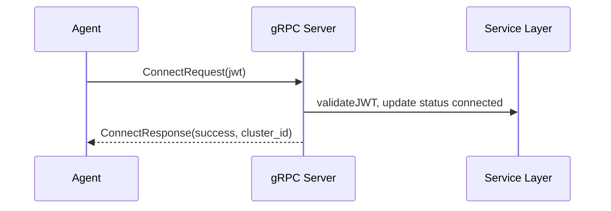

# Claude Opus 4.5 vs Gemini 3.0 Pro vs Gemini 2.5 vs GPT-5.1: 백엔드 설계문서 비교

> **작성일**: 2025년 11월 27일
> **카테고리**: AI, Backend, Architecture
> **키워드**: Claude Opus 4.5, Gemini 3.0, GPT-5.1, Go, Gin, gRPC, Clean Architecture

## 요약

프론트엔드 설계문서 비교에 이어, 동일한 프롬프트로 백엔드 설계문서 작성 능력을 비교했습니다. Go/Gin/GORM 기반의 Control Plane과 gRPC Agent 통신을 포함하는 복잡한 백엔드 아키텍처 설계를 테스트한 결과, Claude Opus 4.5가 프론트엔드와 마찬가지로 문서 구조, 코드 예시, 실무 적용 가능성에서 압도적 우위를 보였습니다.

---

## 테스트 환경

### 입력 자료

- **architecture.md**: Imp-Gateway v2 아키텍처 설계서 (논리/배포/물리 계층 분리, 엔티티 관계, Agent 동작 방식)
- **prd.md**: 제품 요구사항 정의서 (Personas, 핵심 사용자 흐름, 기능 요구사항)
- **backend-spec.md**: 백엔드 API 명세서
- **data-model.md**: 데이터 모델 정의서

### 프롬프트

[프론트엔드 설계문서 작성](https://blog.imprun.dev/72) 직후, 특별한 지침 없이 간단히 요청:

```
그럼 이제 backend-plan-v2-xxxx.md 를 작성해보자.
```

각 모델이 프론트엔드 문서 작성 시 참조했던 architecture.md, prd.md 컨텍스트를 유지한 상태에서 백엔드 문서를 생성.

### 테스트 대상

| 모델 | 버전 | 실행 환경 |
|------|------|------|
| Claude | Opus 4.5 | Claude Code CLI |
| Gemini | 3.0 Pro | Antigravity IDE |
| Gemini | 2.5 | Gemini CLI |
| GPT | 5.1 | Codex CLI |

### 공통 MCP 설정

모든 AI 에이전트는 동일한 MCP(Model Context Protocol) 서버가 활성화된 상태에서 테스트되었습니다:

- **context7**: 컨텍스트 관리 및 문서 참조
- **sequential-thinking**: 단계별 추론 강화
- **serena**: 코드베이스 분석 및 이해

---

## 정량적 비교

| 항목 | Claude Opus 4.5 | Gemini 3.0 Pro | Gemini 2.5 | GPT-5.1 |
|------|-----------------|----------------|------------|---------|
| 문서 길이 | 1,544줄 | 195줄 | 222줄 | 172줄 |
| 섹션 수 | 13개 | 8개 | 7개 | 11개 |
| Mermaid 다이어그램 | 6개 | 0개 | 0개 | 3개 |
| 코드 예시 | 30+ 블록 | 3 블록 | 2 블록 | 0 블록 |
| Go 코드 상세도 | 함수 구현체 포함 | 주석 수준 | SQL DDL | 없음 |
| gRPC Proto 정의 | 완전한 메시지 정의 | 개요 수준 | 개요 수준 | 시퀀스만 |
| API 엔드포인트 명세 | Request/Response 포함 | 목록 수준 | 목록 수준 | 목록 수준 |

---

## 정성적 분석

### 1. 문서 구조 및 완성도

#### Claude Opus 4.5

13개 섹션으로 백엔드 시스템의 모든 측면을 다룸:

1. Executive Summary (v1→v2 변경사항 표)
2. 시스템 아키텍처 (레이어 구조, 의존성 다이어그램)
3. 도메인 모델 (ER 다이어그램, Go struct 코드)
4. API 설계 (엔드포인트 그룹, Request/Response 예시)
5. gRPC Agent 통신 (완전한 Proto 정의)
6. 서비스 계층 (Deploy Service, Credential Service 구현)
7. 미들웨어 (인증, 테넌트, Agent 인증)
8. 데이터 접근 계층 (Repository 패턴, 트랜잭션)
9. 테스트 전략 (단위/통합/E2E)
10. 에러 처리 (표준 응답 포맷, 에러 코드)
11. 개발 일정 (Gantt 차트)
12. 성능 고려사항 (인덱스, 캐싱)
13. 참고 문서

#### Gemini 3.0 Pro

8개 섹션으로 구성되나 각 섹션이 개요 수준:

1. Overview (Tech Stack)
2. Architecture (Clean Architecture)
3. Database Schema & Migration
4. API Implementation Plan
5. Authentication & Authorization
6. Implementation Roadmap
7. Testing Strategy
8. API Specification (Swagger)

전체적으로 영어로 작성되어 있으며, 구조는 체계적이나 구체적인 구현 코드 부재.

#### Gemini 2.5

7개 섹션으로 간결하게 구성:

1. 개요 및 목표
2. 프로젝트 구조 (Clean Architecture)
3. 개발 단계 (Phases)
4. 데이터베이스 스키마 (SQL DDL 포함)
5. Agent 통신 프로토콜 (Proto 정의)
6. 테스트 전략
7. 마이그레이션 가이드

#### GPT-5.1

11개 섹션이나 코드 예시 없이 설명 위주:

1. 목표와 범위
2. 아키텍처/레이어 설계
3. 도메인/데이터 모델 변경
4. API 설계 (요약)
5. Agent gRPC 흐름
6. 인증/테넌시/RBAC
7. 서비스/모듈 작업 항목
8. 테스트 전략
9. 관측성/운영
10. 단계별 실행 플랜
11. 리스크 및 대응

---

### 2. Go 코드 상세도

#### Claude Opus 4.5: 실무 적용 가능한 구현체

**Deploy Service 구현**:

```go
// services/deploysvc/service.go

type Service struct {
    deployJobRepo *repo.DeployJobRepo
    productRepo   *repo.ProductRepo
    agentServer   *grpc.AgentServiceServer
    snapshotSvc   *SnapshotService
}

// TriggerProductPublish: ProductPublish 변경 시 DeployJob 생성
func (s *Service) TriggerProductPublish(ctx context.Context, tenantID, publishID, reason string) error {
    // 1. ProductPublish에서 ClusterID 조회
    pub, err := s.productRepo.GetPublishByID(ctx, publishID)
    if err != nil {
        return fmt.Errorf("get publish: %w", err)
    }

    // 2. DeployJob 생성 (v2: ClusterID 포함)
    job := &models.DeployJob{
        TenantID:         tenantID,
        ProductPublishID: publishID,
        ClusterID:        pub.ClusterID,  // v2: 핵심!
        ResourceType:     "product_publish",
        ResourceID:       publishID,
        TriggerReason:    reason,
        Status:           "pending",
    }

    if err := s.deployJobRepo.Enqueue(ctx, job); err != nil {
        return fmt.Errorf("enqueue: %w", err)
    }

    // 3. 연결된 Agent에 즉시 푸시 (선택적)
    if s.agentServer != nil {
        go s.PushDeployCommand(ctx, job)
    }

    return nil
}
```

**Repository 패턴 구현**:

```go
// data/repo/product_publish_repo.go

// PublishProduct: DRAFT → PUBLISHED 상태 전이
func (r *ProductPublishRepo) PublishProduct(ctx context.Context, publishID, userID string) error {
    return r.db.WithContext(ctx).Transaction(func(tx *gorm.DB) error {
        var pub models.ProductPublish
        if err := tx.First(&pub, "id = ?", publishID).Error; err != nil {
            return err
        }

        if pub.Status != models.ProductPublishStatusDraft {
            return errors.New("can only publish from DRAFT status")
        }

        now := time.Now()
        pub.Status = models.ProductPublishStatusPublished
        pub.PublishedAt = &now
        pub.PublishedBy = userID

        if err := tx.Save(&pub).Error; err != nil {
            return err
        }

        event := &models.ProductPublishEvent{
            ProductPublishID: publishID,
            FromStatus:       models.ProductPublishStatusDraft,
            ToStatus:         models.ProductPublishStatusPublished,
            ChangedBy:        userID,
        }
        return tx.Create(event).Error
    })
}
```

#### Gemini 3.0 Pro: 주석 수준

```go
// @Summary Create Product Publish
// @Description Publish a product to a specific cluster
// @Tags provider
// @Accept json
// @Produce json
// @Param body body CreateProductPublishRequest true "Publish Request"
// @Success 201 {object} ProductPublishResponse
// @Router /v1/provider/product-publishes [post]
func (h *ProductHandler) CreatePublish(c *gin.Context) { ... }
```

Swagger 주석만 제시하고 실제 구현 코드는 `{ ... }`로 생략.

#### Gemini 2.5: SQL DDL 위주

```sql
-- v2: Product Publishes (Alter)
ALTER TABLE product_publishes ADD COLUMN cluster_id UUID REFERENCES clusters(id);
ALTER TABLE product_publishes ALTER COLUMN cluster_id SET NOT NULL;
```

Go 코드보다 SQL 스키마 변경에 집중.

#### GPT-5.1: 코드 없음

구조와 전략만 설명하고 실제 Go 코드 예시는 제공하지 않음.

---

### 3. gRPC Proto 정의

#### Claude Opus 4.5: 완전한 메시지 정의

```protobuf
syntax = "proto3";

package agent;

service AgentService {
    rpc ConnectAgent(stream AgentMessage) returns (stream ServerCommand);
}

message AgentMessage {
    oneof payload {
        ConnectRequest connect_request = 1;
        TokenReplaced token_replaced = 2;
        Heartbeat heartbeat = 3;
        DeployResult deploy_result = 4;
    }
}

message ConnectRequest {
    string agent_id = 1;
    string jwt_token = 2;
    string agent_version = 3;
    string cluster_id = 4;            // v2: Agent의 클러스터
}

message DeployResult {
    string deploy_job_id = 1;
    string status = 2;                // succeeded/failed/partial
    string message = 3;
    repeated AppliedResource resources = 4;
}

message AppliedResource {
    string kind = 1;
    string name = 2;
    string namespace = 3;
    string status = 4;                // created/updated/deleted/failed
    int64 generation = 5;
}

message ServerCommand {
    oneof payload {
        Ack ack = 1;
        ReplaceTokenRequest replace_token = 2;
        RevokeTokenRequest revoke_token = 3;
        DeployCommand deploy = 4;
    }
}

message DeployCommand {
    string deploy_job_id = 1;
    string snapshot_url = 2;
    int32 priority = 3;
}
```

모든 메시지 타입, 필드, 주석까지 완전하게 정의.

#### Gemini 3.0 Pro / Gemini 2.5: 개요 수준

```protobuf
service AgentService {
  rpc Connect (stream AgentMessage) returns (stream ServerMessage);
}

message DeployCommand {
  string product_publish_id = 1;
  // Agent는 ID만 받고, 상세 정보는 REST API로 조회
}
```

기본 구조만 제시하고 상세 메시지 정의는 부재.

#### GPT-5.1: 시퀀스 다이어그램만



Proto 정의 없이 흐름만 시각화.

---

### 4. API 명세 상세도

#### Claude Opus 4.5: Request/Response 전체 포함

**ProductPublish API**:

```http
POST /v1/provider/product-publishes
Authorization: Bearer {token}
X-Tenant-Slug: my-org

{
    "product_id": "uuid",
    "gateway_id": "uuid",
    "cluster_id": "uuid",           // v2: 필수!
    "environment": "prod",
    "services": ["uuid1", "uuid2"],
    "auth_mode": "apikey",
    "hostname_base": "my-api.prod.kr-seoul.api.imprun.dev"
}
```

```http
HTTP/1.1 201 Created

{
    "success": true,
    "data": {
        "product_publish": {
            "id": "uuid",
            "product_id": "uuid",
            "cluster_id": "uuid",
            "status": "DRAFT"
        }
    }
}
```

**Agent API**:

```http
GET /v1/agent/deploy-jobs?cluster_id={cluster_id}&status=pending
Authorization: Bearer {agent_jwt}
```

```http
HTTP/1.1 200 OK

{
    "success": true,
    "data": {
        "deploy_jobs": [
            {
                "id": "uuid",
                "product_publish_id": "uuid",
                "cluster_id": "uuid",
                "status": "pending",
                "trigger_reason": "create"
            }
        ]
    }
}
```

#### Gemini 3.0 Pro / Gemini 2.5 / GPT-5.1: 목록 수준

```
#### Provider APIs (`/v1/provider`)
-   **API Service**: `POST`, `GET`, `PUT`, `DELETE`
-   **ProductPublish**: `POST` (Must include `cluster_id`), `GET`
```

엔드포인트 목록만 나열하고 실제 페이로드 구조는 미제시.

---

### 5. v1→v2 변경사항 반영

#### Claude Opus 4.5

v2 변경사항을 표로 명확히 정리하고 코드에 주석으로 반복 강조:

| 항목 | v1 | v2 | 영향 범위 |
|------|----|----|-----------|
| APIService.GatewayID | 필수 | **제거** | Model, API, Repository |
| ProductPublish.ClusterID | 없음 | **필수** | Model, API, Repository, Deploy Service |
| Gateway 역할 | 배포 타겟 | 설정 템플릿 | 개념적 변화 |
| 멀티 클러스터 | 미지원 | **완전 지원** | Agent 라우팅, Deploy Job |

코드 내 주석:

```go
type ProductPublish struct {
    ClusterID string `gorm:"type:uuid;index;not null"` // v2 추가!
}
```

```go
job := &models.DeployJob{
    ClusterID: pub.ClusterID,  // v2: 핵심!
}
```

#### 다른 모델들

변경사항을 언급했으나 코드 내 반복 강조는 부재.

---

### 6. 미들웨어 및 인증

#### Claude Opus 4.5: 3가지 미들웨어 구현체

**인증 미들웨어**:

```go
func AuthRequired(authenticator *auth.Authenticator) gin.HandlerFunc {
    return func(c *gin.Context) {
        token := extractBearerToken(c)
        if token == "" {
            c.AbortWithStatusJSON(401, gin.H{"error": "missing token"})
            return
        }

        claims, err := authenticator.ValidateToken(c.Request.Context(), token)
        if err != nil {
            c.AbortWithStatusJSON(401, gin.H{"error": "invalid token"})
            return
        }

        c.Set("user_id", claims.Subject)
        c.Set("tenant_slugs", claims.TenantSlugs)
        c.Set("roles", claims.RealmRoles)
        c.Next()
    }
}
```

**테넌트 컨텍스트 미들웨어**:

```go
func TenantContext(tenantRepo *repo.TenantRepo) gin.HandlerFunc {
    return func(c *gin.Context) {
        tenantSlug := c.GetHeader("X-Tenant-Slug")
        if tenantSlug == "" {
            c.AbortWithStatusJSON(400, gin.H{"error": "X-Tenant-Slug header required"})
            return
        }
        // ...
    }
}
```

**Agent 인증 미들웨어**:

```go
func AgentAuthRequired(tokenService *services.AgentTokenService) gin.HandlerFunc {
    return func(c *gin.Context) {
        claims, err := tokenService.ValidateToken(c.Request.Context(), token)
        c.Set("agent_id", claims.AgentID)
        c.Set("cluster_id", claims.ClusterID)
        c.Next()
    }
}
```

#### 다른 모델들

미들웨어 필요성은 언급했으나 구현 코드는 미제시.

---

### 7. 테스트 코드

#### Claude Opus 4.5: 단위/통합 테스트 예시

**단위 테스트**:

```go
func TestAgentTokenService_ValidateToken(t *testing.T) {
    tokenRepo := &mockTokenRepo{}
    eventRepo := &mockEventRepo{}
    svc := services.NewAgentTokenService(tokenRepo, eventRepo, "test-secret")

    token, err := svc.GenerateConnectionToken(context.Background(), "agent-123")
    require.NoError(t, err)

    claims, err := svc.ValidateToken(context.Background(), token)
    require.NoError(t, err)
    assert.Equal(t, "agent-123", claims.AgentID)
    assert.Equal(t, "connection", claims.Type)
}
```

**통합 테스트**:

```go
func TestProductPublishAPI_CreateWithClusterID(t *testing.T) {
    db := setupTestDB(t)
    defer teardownTestDB(t, db)

    cluster := createTestCluster(t, db)

    req := createPublishReq{
        ProductID:   product.ID,
        ClusterID:   cluster.ID,  // v2 필수!
        Environment: "prod",
    }

    w := performRequest(router, "POST", "/provider/product-publishes", req, tenant.ID)

    assert.Equal(t, 200, w.Code)
}
```

#### 다른 모델들

테스트 전략을 설명했으나 실제 테스트 코드는 미제시.

---

## 결론

### 평가 요약

| 평가 항목 | Claude Opus 4.5 | Gemini 3.0 Pro | Gemini 2.5 | GPT-5.1 |
|-----------|-----------------|----------------|------------|---------|
| 문서 완성도 | ★★★★★ | ★★★☆☆ | ★★★☆☆ | ★★★☆☆ |
| Go 코드 상세도 | ★★★★★ | ★★☆☆☆ | ★★☆☆☆ | ★☆☆☆☆ |
| gRPC 명세 | ★★★★★ | ★★★☆☆ | ★★★☆☆ | ★★☆☆☆ |
| API 명세 상세도 | ★★★★★ | ★★☆☆☆ | ★★☆☆☆ | ★★☆☆☆ |
| 테스트 코드 | ★★★★★ | ★★☆☆☆ | ★★☆☆☆ | ★★☆☆☆ |
| 실무 적용 가능성 | ★★★★★ | ★★★☆☆ | ★★★☆☆ | ★★☆☆☆ |

### 분석

1. **Claude Opus 4.5가 백엔드에서도 압도적 우위**: 1,544줄의 상세한 문서에 Go 구현체, gRPC Proto 정의, API 페이로드, 테스트 코드까지 포함. 실제 개발팀에 바로 전달할 수 있는 수준.

2. **프론트엔드 대비 격차 확대**: 백엔드는 Go 언어 특성상 타입 정의, 에러 처리, 트랜잭션 관리 등 더 많은 코드가 필요한데, Claude만 이를 충족.

3. **Gemini/GPT는 아키텍처 개요 수준**: Clean Architecture 구조나 레이어 분리는 설명했으나, 실제 구현에 필요한 코드 예시가 부족.

4. **GPT-5.1의 관측성/운영 섹션**: 다른 모델이 다루지 않은 Metrics, Logging, Health Check를 언급한 점은 독특하나, 구현 코드 없이 항목 나열에 그침.

### 프론트엔드 vs 백엔드 비교

| 항목 | 프론트엔드 | 백엔드 |
|------|-----------|--------|
| Claude Opus 4.5 | 1,700줄 | 1,544줄 |
| Gemini 3.0 Pro | 346줄 | 195줄 |
| Gemini 2.5 | 327줄 | 222줄 |
| GPT-5.1 | 225줄 | 172줄 |

백엔드에서 Claude와 다른 모델 간의 격차가 더 크게 나타남.

---

## 부록: 테스트 자료

- [architecture.md](https://github.com/imprun/blogs/blob/main/2025/11/26/architecture.md) - 입력 아키텍처 문서
- [prd.md](https://github.com/imprun/blogs/blob/main/2025/11/26/prd.md) - 입력 PRD 문서
- [backend-plan-v2-opus45.md](https://github.com/imprun/blogs/blob/main/2025/11/26/backend-plan-v2-opus45.md) - Claude Opus 4.5 결과물
- [backend-plan-v2-gemini3pro.md](https://github.com/imprun/blogs/blob/main/2025/11/26/backend-plan-v2-gemini3pro.md) - Gemini 3.0 Pro 결과물 (Antigravity IDE)
- [backend-plan-v2-gemini25.md](https://github.com/imprun/blogs/blob/main/2025/11/26/backend-plan-v2-gemini25.md) - Gemini 2.5 결과물 (Gemini CLI)
- [backend-plan-v2-gpt5.1.md](https://github.com/imprun/blogs/blob/main/2025/11/26/backend-plan-v2-gpt5.1.md) - GPT-5.1 결과물 (Codex CLI)

---

## 참고 자료

### 관련 글
- [AI 모델 프론트엔드 설계문서 비교](https://blog.imprun.dev/72) - 프론트엔드 설계문서 비교

### 공식 문서
- [Gin Web Framework](https://gin-gonic.com/)
- [GORM](https://gorm.io/)
- [gRPC Go](https://grpc.io/docs/languages/go/)
