# Claude Opus 4.5 vs Gemini 3.0 Pro vs Gemini 2.5 Pro vs GPT-5.1 Codex Max: 프론트엔드 설계문서 비교

> **작성일**: 2025년 11월 26일
> **카테고리**: AI, Frontend, Architecture
> **키워드**: Claude Opus 4.5, Gemini 3.0, GPT-5.1, Feature-Sliced Design, Next.js, AI 코딩

## 요약

Gemini 3.0, GPT-5.1 Codex Max, Claude Opus 4.5가 연이어 출시된 직후, 동일한 프롬프트로 프론트엔드 설계문서 작성 능력을 비교했습니다. 동료가 공유한 LinkedIn 글에서 "디자인 영역에서 Gemini 3.0이 압승"이라는 평가를 보고 Gemini Ultra를 결제하여 직접 테스트해봤습니다. 실무 개발자 관점에서 복잡한 B2B SaaS 프론트엔드 설계문서 작성 테스트를 진행한 결과, Claude Opus 4.5가 문서 구조, 기술적 깊이, 실무 적용 가능성에서 명확한 우위를 보였습니다.


*출처: [Anthropic - Introducing Claude Opus 4.5](https://www.anthropic.com/news/claude-opus-4-5)*

---

## 테스트 환경

### 입력 자료

- **architecture.md**: Imp-Gateway v2 아키텍처 설계서 (논리/배포/물리 계층 분리, 엔티티 관계, Agent 동작 방식)
- **prd.md**: 제품 요구사항 정의서 (Personas, 핵심 사용자 흐름, 기능 요구사항, 기술 스택)

### 프롬프트

```
frontend는 기존 v1 아키텍처 기준으로 개발이 되었는데, 새로운 아키텍처
architecture.md와 prd.md를 기준으로 v2용 운영자용과 API 제공자용,
API 소비자용 프론트엔드를 web 폴더에 구현하려고 한다.

구현계획을 frontend-plan-v2-xxx.md로 작성해라.
feature-sliced design + nextjs app router를 적용할 것이다.

기획문서에는 컴포넌트 상세 명세, 상태관리 전략, API 연동 상세 시나리오,
사용자흐름 (User flow) 기반 기능 설명을 포함해. mermaid 시각화 적극 활용해라.
```

### 테스트 대상

| 모델 | 버전 | 실행 환경 |
|------|------|------|
| Claude | Opus 4.5 | Claude Code CLI |
| Gemini | 3.0 Pro | Antigravity IDE |
| Gemini | 2.5 Pro | Gemini CLI |
| GPT | 5.1 Codex Max | Codex CLI |

### 공통 MCP 설정

모든 AI 에이전트는 동일한 MCP(Model Context Protocol) 서버가 활성화된 상태에서 테스트되었습니다:

- **context7**: 컨텍스트 관리 및 문서 참조
- **sequential-thinking**: 단계별 추론 강화
- **serena**: 코드베이스 분석 및 이해

### 가격 정보 (2025년 11월 기준)

이번 테스트는 모두 구독제로 진행했습니다.

**구독제 가격**

| 서비스 | 플랜 | 월 가격 | 사용량 한도 |
|--------|------|---------|-------------|
| Claude | Max | $200 | Pro 대비 5x~20x |
| Gemini | Ultra | ₩60,000 (3개월 ₩180,000 프로모션) | 2.5 Pro 일 500회, 1M 토큰 컨텍스트 |
| ChatGPT | Pro | $200 | 무제한 (공정 사용 정책 적용) |

**API 직접 호출 가격 (참고)**

| 모델 | Input (per 1M tokens) | Output (per 1M tokens) | 출처 |
|------|----------------------|------------------------|------|
| Claude Opus 4.5 | $5.00 | $25.00 | [Anthropic Docs](https://platform.claude.com/docs/en/about-claude/models) |
| Gemini 3.0 Pro | $2.00 | $12.00 | [Google AI Pricing](https://ai.google.dev/gemini-api/docs/pricing) |
| Gemini 2.5 Pro | $1.25 | $10.00 | [Google AI Pricing](https://ai.google.dev/gemini-api/docs/pricing) |

Gemini API는 200K 토큰 초과 시 2배 요금이 적용됩니다.

---

## 정량적 비교

| 항목 | Claude Opus 4.5 | Gemini 3.0 Pro | Gemini 2.5 Pro | GPT-5.1 Codex Max |
|------|-----------------|----------------|----------------|-------------------|
| 문서 길이 | 1,700줄 | 346줄 | 327줄 | 225줄 |
| 섹션 수 | 13개 | 8개 | 3개 | 11개 |
| Mermaid 다이어그램 | 12개 | 6개 | 5개 | 5개 |
| 코드 예시 | 40+ 블록 | 3 블록 | 8 블록 | 5 블록 |
| 컴포넌트 명세 | 상세 (Props, 내부 로직) | 목록 수준 | 기본 | 간략 |
| API 연동 시나리오 | 5개 상세 시퀀스 | 1개 | 2개 | 3개 간략 |

---

## 정성적 분석

### 1. 문서 구조 및 완성도

#### Claude Opus 4.5

13개 섹션으로 체계적 구성:

1. Executive Summary (v1→v2 변경사항 시각화)
2. 기술 스택 상세
3. Feature-Sliced Design 구조 (400줄 디렉토리 트리)
4. 상태 관리 전략 (Query Key 설계, Mutation 패턴)
5. 컴포넌트 상세 명세
6. API 연동 상세 시나리오 (5개 시퀀스 다이어그램)
7. 사용자 흐름 (Operator/Provider/Consumer 각각 flowchart)
8. 인증 및 권한 관리 (RBAC 모델, NextAuth 설정)
9. 에러 처리 및 로딩 상태
10. 개발 일정 (Gantt 차트)
11. 테스트 전략
12. 성능 최적화
13. 참고 문서

#### Gemini 3.0 Pro

8개 섹션으로 균형 잡힌 구조:

1. Overview (Tech Stack)
2. Architecture (FSD)
3. User Flows & Features
4. Component Specifications
5. State Management Strategy
6. API Integration Scenarios
7. Implementation Roadmap
8. Visualizations

전체적으로 영어로 작성되어 있으며, 구조는 체계적이나 각 섹션의 깊이가 얕음.

#### Gemini 2.5 Pro (CLI)

3개 Phase로 구분된 간결한 구조:

1. FSD 아키텍처 원칙 (계층 다이어그램)
2. 상태 관리 전략 (간략)
3. 사용자 흐름 기반 기능 명세 (Phase 1~3)

#### GPT-5.1 Codex Max

11개 섹션이나 각 섹션이 간략:

1. 목표와 범위
2. FSD + App Router 매핑
3. 포털별 기능 맵
4. 상태관리 전략
5. API 연동 상세 시나리오
6. 사용자 흐름 (Mermaid)
7. 라우팅/내비게이션 설계
8. UX/컴포넌트 가이드
9. 품질/보안
10. 마이그레이션 체크리스트
11. 작업 우선순위

---

### 2. Feature-Sliced Design 이해도

#### Claude Opus 4.5: 실무 적용 가능한 수준

400줄의 상세한 디렉토리 구조를 제시하고, 각 레이어의 역할과 의존성 규칙을 명확히 설명:

```
web/src/
├── app/                    # Layer 1: 라우팅, 진입점
│   ├── (operator)/         # Operator 포털 라우트 그룹
│   │   ├── clusters/
│   │   │   ├── page.tsx
│   │   │   └── [id]/
│   │   │       ├── page.tsx
│   │   │       └── agents/page.tsx
├── widgets/
│   ├── product-publish-wizard/
│   │   ├── ProductPublishWizard.tsx
│   │   ├── steps/
│   │   │   ├── ClusterSelectStep.tsx
│   │   │   └── ReviewStep.tsx
├── features/
│   ├── cluster-management/
│   │   ├── api/clusterApi.ts
│   │   ├── hooks/useClusters.ts
│   │   └── components/ClusterList.tsx
├── entities/
│   ├── cluster/
│   │   ├── model.ts
│   │   ├── api.ts
│   │   └── lib.ts
└── shared/
    ├── api/client.ts
    └── ui/button.tsx
```

레이어 간 의존성 규칙도 다이어그램으로 명시:

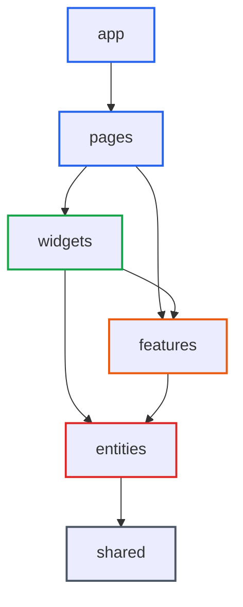

#### Gemini 3.0 Pro: 기본 구조 제시

디렉토리 구조를 제시했으나 Claude 대비 상세도가 낮음:

```
web/src/
├── app/                  # App setup
│   ├── (auth)/           # Auth related routes
│   ├── (dashboard)/      # Protected dashboard routes
│   │   ├── operator/
│   │   ├── provider/
│   │   └── consumer/
├── pages/
├── widgets/
├── features/
├── entities/
└── shared/
```

Route Groups를 활용한 역할별 분리는 언급했으나, 각 레이어 내부의 세부 구조는 미제시.

#### Gemini 2.5 Pro (CLI): 개념 설명 수준

FSD 계층 구조를 다이어그램으로 설명했으나, 실제 프로젝트에 적용할 수 있는 구체적인 디렉토리 구조는 부재:

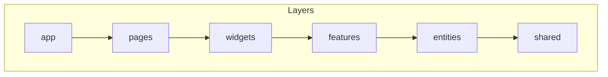

슬라이스와 세그먼트 개념은 언급했으나, 실제 파일 구조 예시가 부족.

#### GPT-5.1 Codex Max: 간략한 개요

```
web/src/
├── app/
├── pages/
├── widgets/
├── features/
├── entities/
├── shared/
└── processes/
```

`processes` 레이어를 추가로 제안했으나, 각 레이어의 상세 구조는 미제시.

---

### 3. 상태 관리 전략

#### Claude Opus 4.5: TanStack Query 중심의 체계적 설계

**Query Key 설계 패턴** 상세 제시:

```typescript
export const clusterKeys = {
  all: ['clusters'] as const,
  lists: () => [...clusterKeys.all, 'list'] as const,
  list: (filters: ClusterFilters) => [...clusterKeys.lists(), filters] as const,
  details: () => [...clusterKeys.all, 'detail'] as const,
  detail: (id: string) => [...clusterKeys.details(), id] as const,
  agents: (clusterId: string) => [...clusterKeys.detail(clusterId), 'agents'] as const,
};
```

**Mutation 및 캐시 무효화 전략**:

```typescript
export function useCreateProductPublish() {
  const queryClient = useQueryClient();

  return useMutation({
    mutationFn: (data: CreateProductPublishRequest) =>
      productApi.createProductPublish(data),
    onSuccess: (newPublish) => {
      queryClient.invalidateQueries({ queryKey: productPublishKeys.all });
      queryClient.setQueryData(
        productPublishKeys.detail(newPublish.id),
        newPublish
      );
      toast.success('배포가 생성되었습니다');
    },
  });
}
```

**Zustand Store 설계**:

```typescript
export const useUIStore = create<UIState>()(
  persist(
    (set) => ({
      sidebarOpen: true,
      toggleSidebar: () => set((state) => ({ sidebarOpen: !state.sidebarOpen })),
      theme: 'system',
      activeTenantId: null,
    }),
    { name: 'imp-gateway-ui' }
  )
);
```

#### Gemini 3.0 Pro: 전략 설명

상태 관리 분류와 전략을 설명했으나 코드 예시 부족:

- Server State: TanStack Query (Keys Factory 패턴 언급)
- Client State: URL State (nuqs), Form State (react-hook-form), Global UI (zustand)
- Authentication State: NextAuth.js

캐시 무효화 전략은 "Mutations: Invalidate queries on success"로 한 줄 언급에 그침.

#### Gemini 2.5 Pro (CLI): 개념적 설명

```typescript
// TanStack Query 예시
export const getClustersQueryOptions = queryOptions({
  queryKey: clusterKeys.list(),
  queryFn: () => apiClient.get<Cluster[]>('/operator/clusters'),
});
```

Query Key 패턴을 보여주었으나, 캐시 무효화 전략이나 복잡한 mutation 패턴은 미제시.

#### GPT-5.1 Codex Max: 전략 나열

상태 관리 전략을 나열했으나 구체적인 코드 예시 부족:

- TanStack Query v5 사용
- Query keys 도메인별 네임스페이스
- Optimistic update
- React Hook Form + Zod

---

### 4. API 연동 시나리오

#### Claude Opus 4.5: 5개 상세 시퀀스 다이어그램

**클러스터 등록 및 Agent 토큰 발급**:

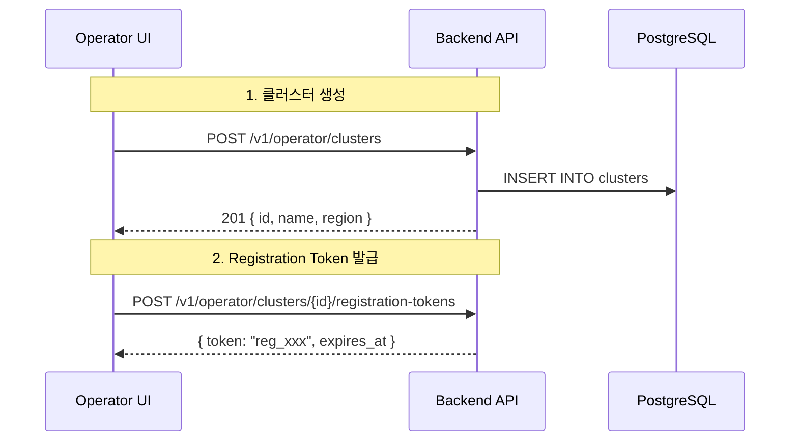

**Product 배포 (ProductPublish) 전체 흐름**:

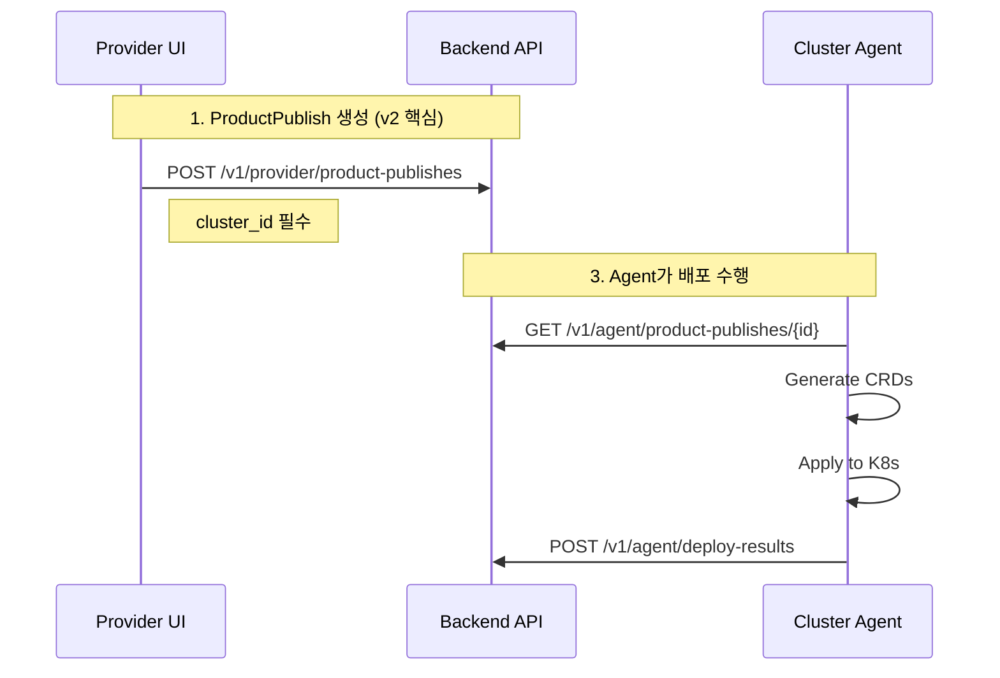

각 시나리오에 대한 TypeScript API 클라이언트 코드도 함께 제공:

```typescript
export const clusterApi = {
  getClusters: async (params?: ClusterFilters): Promise<PagedResponse<Cluster>> => {
    const { data } = await apiClient.get('/v1/operator/clusters', { params });
    return data;
  },
  createRegistrationToken: async (clusterId: string): Promise<RegistrationToken> => {
    const { data } = await apiClient.post(
      `/v1/operator/clusters/${clusterId}/registration-tokens`
    );
    return data;
  },
};
```

#### Gemini 3.0 Pro: 1개 상세 시퀀스

배포 플로우에 대한 시퀀스 다이어그램 1개 제시:

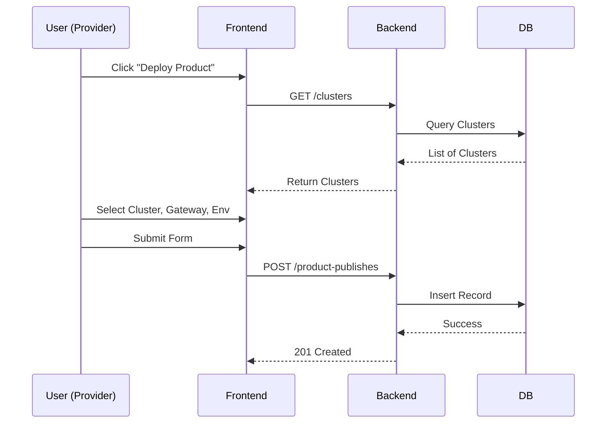

시퀀스 다이어그램은 상세하나, API 클라이언트 코드 예시는 JSON payload 수준에 그침.

#### Gemini 2.5 Pro (CLI): 2개 시퀀스 다이어그램

클러스터 생성과 상품 배포 플로우 2개만 제시. API 클라이언트 코드는 간략.

#### GPT-5.1 Codex Max: 3개 간략 다이어그램

Provider, Consumer, Operator 플로우를 간략하게 제시. 상세 API 코드는 미제시.

---

### 5. 사용자 흐름 (User Flow)

#### Claude Opus 4.5: 3개 포털 각각 상세 flowchart

**Operator: 클러스터 등록 및 Agent 연결**:

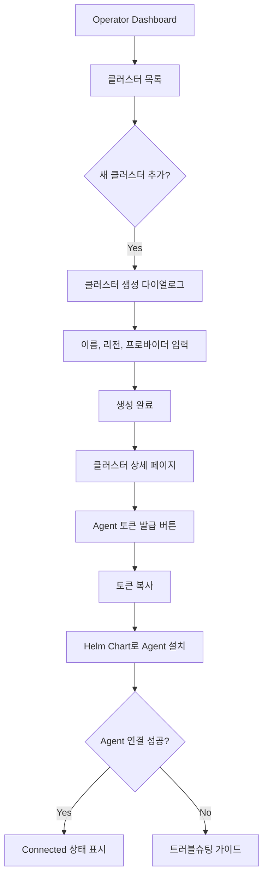

**Provider: API 정의 → 제품화 → 배포**:

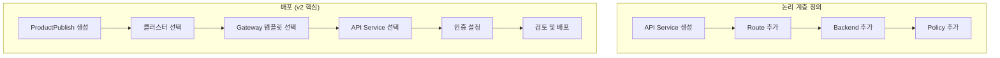

**ProductPublish Wizard 상태 머신**:

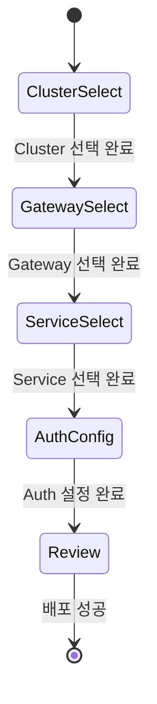

#### Gemini 3.0 Pro: 3개 포털 기본 flowchart

각 포털(Operator, Provider, Consumer)에 대해 간단한 flowchart 제시:

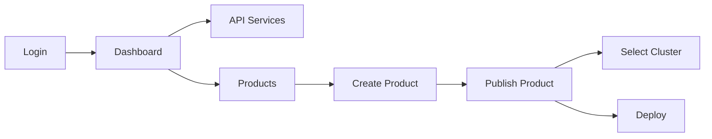

흐름은 명확하나, 분기 처리나 에러 케이스는 미포함.

#### Gemini 2.5 Pro (CLI) / GPT-5.1 Codex Max

각각 기본적인 시퀀스/플로우 다이어그램만 제시. 상태 머신이나 복잡한 분기 처리 미포함.

---

### 6. 컴포넌트 명세 상세도

#### Claude Opus 4.5: Props, 내부 로직, 표시 정보까지 상세

```typescript
// widgets/product-publish-wizard/ProductPublishWizard.tsx
interface ProductPublishWizardProps {
  productId: string;
  onComplete?: (publish: ProductPublish) => void;
  onCancel?: () => void;
}

type WizardStep =
  | 'cluster'      // 1. 클러스터 선택 (필수)
  | 'gateway'      // 2. Gateway 템플릿 선택
  | 'services'     // 3. API Service 선택
  | 'auth'         // 4. 인증 설정
  | 'review';      // 5. 검토 및 확인

interface WizardState {
  currentStep: WizardStep;
  data: {
    cluster_id: string | null;
    gateway_id: string | null;
    api_services: string[];
    environment: 'dev' | 'staging' | 'prod';
    auth_mode: 'none' | 'apikey' | 'oauth2';
  };
}
```

**Entity 컴포넌트 표시 정보**:

```typescript
// entities/cluster/ui/ClusterCard.tsx
interface ClusterCardProps {
  cluster: Cluster;
  onSelect?: (cluster: Cluster) => void;
  selected?: boolean;
}

// 표시 정보:
// - 이름, 리전
// - 클라우드 프로바이더 아이콘 (AWS/GCP/Azure/On-premise)
// - 연결된 Agent 수
// - 상태 (Online/Offline)
// - 최근 동기화 시간
```

#### Gemini 3.0 Pro: 카테고리별 목록

컴포넌트를 4개 카테고리로 분류하여 목록 형태로 제시:

```
### Shared UI Components (Atomic)
- Button, Input, Select, Table, Dialog, Card (from Shadcn/UI)
- StatusBadge: Reusable component to show status

### Entity Components
- ClusterCard: Displays Cluster info
- AgentStatus: Displays Agent connection status
- ApiServiceRow: Table row for API Service list

### Feature Components (Forms/Actions)
- CreateClusterForm: Form with validation (Zod)
- ProductPublishWizard: Multi-step modal
    - Step 1: Select Product & Version
    - Step 2: Select Environment & Cluster
    - Step 3: Select Gateway Template
    - Step 4: Review & Deploy
```

ProductPublishWizard의 단계는 명시했으나, Props나 내부 상태 관리 로직은 미제시.

#### Gemini 2.5 Pro (CLI): 기본 Props와 로직 설명

```typescript
// features/operator/create-cluster
// - ui/CreateClusterButton.tsx: Modal을 열기 위한 버튼
// - ui/CreateClusterModal.tsx: 클러스터 생성 폼을 담는 모달
// - ui/CreateClusterForm.tsx: 실제 입력 폼
```

#### GPT-5.1 Codex Max: 한 줄 설명

```
- widgets/shell/Sidebar: props { sections: NavSection[], activePath }
- features/clusters/cluster-form: RHF+Zod, create/update 모드
```

---

### 7. v1→v2 변경사항 반영

#### Claude Opus 4.5

v2 아키텍처 변경사항을 문서 전반에 걸쳐 명확히 반영:

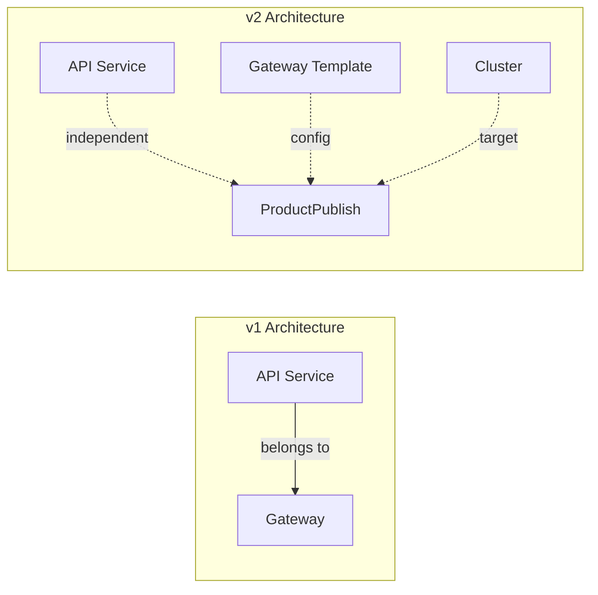

| 항목 | v1 | v2 |
|------|----|----|
| API Service | Gateway에 종속 | **독립적 청사진** |
| Gateway | 배포 타겟 | **설정 템플릿** |
| ProductPublish | cluster_id 없음 | **cluster_id 필수** |

API Service 생성 다이얼로그에서 `gateway_id` 필드 제거를 명시:

```typescript
// v2 변경: gateway_id 필드 제거
const apiServiceCreateSchema = z.object({
  name: z.string().min(1).max(255),
  version: z.string().optional(),
  description: z.string().optional(),
  // gateway_id 없음!
});
```

#### Gemini 3.0 Pro

v2의 핵심인 ProductPublish와 Cluster 선택을 언급:

```
4.  **Product Publishing (Deployment)**:
    -   **Crucial Step**: Create `ProductPublish`.
    -   Select `Cluster` (Physical Target).
    -   Select `Gateway` (Template).
```

"Crucial Step"으로 강조했으나, v1과의 차이점이나 마이그레이션 고려사항은 미언급.

#### Gemini 2.5 Pro (CLI) / GPT-5.1 Codex Max

v2 변경사항을 언급했으나, 문서 전반에 걸친 일관된 반영은 부족.

---

## 결론

### 평가 요약

| 평가 항목 | Claude Opus 4.5 | Gemini 3.0 Pro | Gemini 2.5 Pro | GPT-5.1 Codex Max |
|-----------|-----------------|----------------|----------------|-------------------|
| 문서 완성도 | ★★★★★ | ★★★☆☆ | ★★★☆☆ | ★★★☆☆ |
| FSD 이해도 | ★★★★★ | ★★★☆☆ | ★★★☆☆ | ★★☆☆☆ |
| 상태관리 설계 | ★★★★★ | ★★★☆☆ | ★★★☆☆ | ★★★☆☆ |
| API 연동 상세도 | ★★★★★ | ★★★☆☆ | ★★★☆☆ | ★★☆☆☆ |
| 컴포넌트 명세 | ★★★★★ | ★★★☆☆ | ★★★☆☆ | ★★☆☆☆ |
| 실무 적용 가능성 | ★★★★★ | ★★★☆☆ | ★★★☆☆ | ★★☆☆☆ |

### 분석

1. **Claude Opus 4.5가 압도적 우위**: 1,700줄의 상세한 문서는 실제 개발팀에 바로 전달할 수 있는 수준. Query Key 설계, Mutation 패턴, 컴포넌트 Props까지 상세 명세.

2. **Gemini 3.0 Pro vs 2.5 Pro**: 3.0이 구조화 측면에서 약간 개선되었으나, 둘 다 상세도 면에서는 Claude에 크게 못 미침. 3.0은 영어로 작성되어 한국어 프로젝트에서 번역 작업 필요.

3. **GPT-5.1 Codex Max는 간결함이 장점이자 단점**: 11개 섹션으로 구조화했으나, 각 섹션의 깊이가 얕음. 빠른 개요 파악에는 유용.

4. **LinkedIn 평가와의 차이**: "디자인 영역에서 Gemini 압승"이라는 평가는 UI/UX 디자인 생성 태스크에 한정된 것으로 보임. 복잡한 기술 문서 작성에서는 Claude가 여전히 압도적 우위.

### 용도별 추천

| 태스크 유형 | 추천 모델 |
|------------|----------|
| 상세 설계 문서 작성 | Claude Opus 4.5 |
| 빠른 개요 파악 | GPT-5.1 Codex Max |
| 아키텍처 개념 설명 | Gemini 2.5 Pro |
| UI/UX 디자인 생성 | Gemini 3.0 (별도 테스트 필요) |

### 실무 활용: 멀티 에이전트 워크플로우

위 비교에서 보듯 각 모델은 서로 다른 강점을 가지고 있습니다. Claude가 압도적인 문서 생성 능력을 보여주지만, 실무에서는 여러 에이전트를 조합하여 더 완성도 높은 결과물을 만들 수 있습니다.

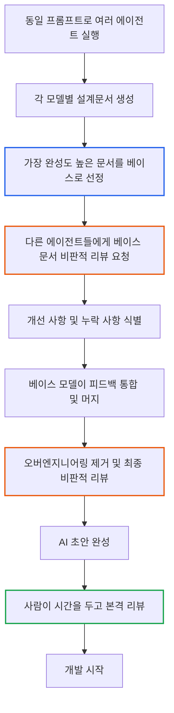

**워크플로우 상세**:

1. **베이스 문서 선정**: 동일 프롬프트로 여러 모델을 실행하고, 가장 완성도 높은 결과물을 베이스로 선정합니다. 이번 테스트에서는 Claude Opus 4.5가 베이스가 됩니다.

2. **멀티 에이전트 비판적 리뷰**: 베이스 문서를 다른 에이전트(Codex, Gemini 등)에게 전달하여 비판적으로 리뷰하게 합니다. 각 모델이 자신의 관점에서 개선 사항과 누락된 부분을 지적합니다.

3. **피드백 통합**: 베이스 모델이 다른 에이전트들의 피드백을 검토하고, 유효한 개선 사항을 문서에 반영합니다.

4. **오버엔지니어링 제거**: 마지막으로 과도한 복잡성이나 불필요한 추상화를 제거하고, 실현 가능한 수준으로 정제합니다.

5. **사람 리뷰**: AI 초안이 완성되면 사람이 충분한 시간을 가지고 검토합니다. 이 단계에서 비즈니스 맥락, 팀 역량, 일정 등 AI가 알 수 없는 요소들을 반영합니다.

Codex는 단독 문서 생성에서는 Claude에 못 미치지만, 리뷰어 역할에서는 Claude가 놓칠 수 있는 운영 관점이나 엔터프라이즈 패턴을 짚어주는 경우가 많습니다. 이런 상호보완 효과가 멀티 에이전트 워크플로우의 핵심입니다.

---

## 부록: 테스트 자료

- [architecture.md](https://github.com/imprun/blogs/blob/main/2025/11/26/architecture.md) - 입력 아키텍처 문서
- [prd.md](https://github.com/imprun/blogs/blob/main/2025/11/26/prd.md) - 입력 PRD 문서
- [frontend-plan-v2-opus45.md](https://github.com/imprun/blogs/blob/main/2025/11/26/frontend-plan-v2-opus45.md) - Claude Opus 4.5 결과물
- [frontend-plan-v2-gemini3pro.md](https://github.com/imprun/blogs/blob/main/2025/11/26/frontend-plan-v2-gemini3pro.md) - Gemini 3.0 Pro 결과물 (Antigravity IDE)
- [frontend-plan-v2-gemini25pro.md](https://github.com/imprun/blogs/blob/main/2025/11/26/frontend-plan-v2-gemini25pro.md) - Gemini 2.5 Pro 결과물 (Gemini CLI)
- [frontend-plan-v2-gpt51codexmax.md](https://github.com/imprun/blogs/blob/main/2025/11/26/frontend-plan-v2-gpt51codexmax.md) - GPT-5.1 Codex Max 결과물

---

## 참고 자료

### 관련 글
- [AI 모델 백엔드 설계문서 비교](https://blog.imprun.dev/73) - 백엔드 설계문서 비교
- [Claude Code 실무 개발 워크플로우](https://blog.imprun.dev/71) - EPIC부터 일일 개발, 주간보고까지
- [LinkedIn: 디자이너로써 바라본 Claude 4.5 Opus와 Gemini 3.0](https://www.linkedin.com/posts/uxjosh_%EB%94%94%EC%9E%90%EC%9D%B4%EB%84%88%EB%A1%9C%EC%8D%A8-%EB%B0%94%EB%9D%BC%EB%B3%B8-claude-45-opus%EC%99%80-gemini-30-%EB%94%94%EC%9E%90%EC%9D%B8-activity-7398935943891812352-vD59) - UX 디자이너 관점의 비교

### 공식 문서
- [Feature-Sliced Design](https://feature-sliced.design/)
- [TanStack Query](https://tanstack.com/query/latest)
- [Next.js App Router](https://nextjs.org/docs/app)
