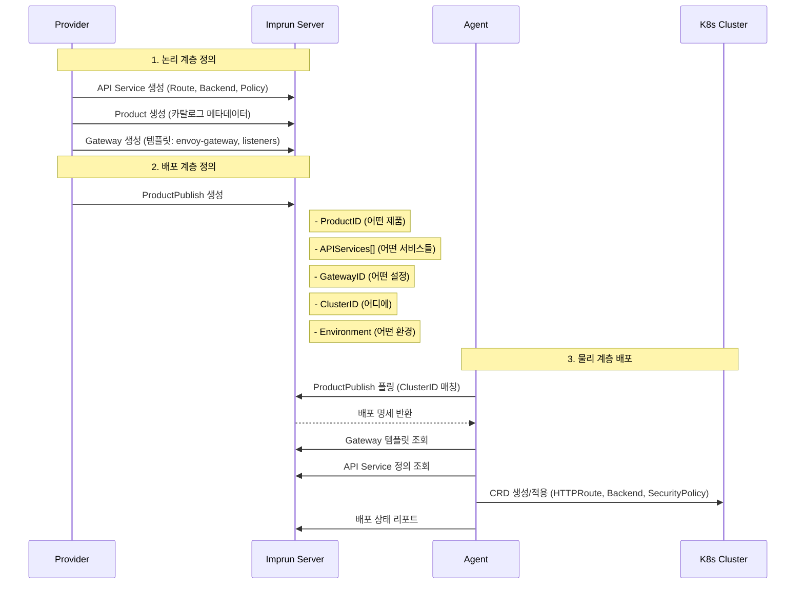

# Imp-Gateway 아키텍처 설계 v2

**버전**: 2.0
**최종 수정**: 2025-11-26
**이전 버전**: [archived/v1/architecture.md](archived/v1/architecture.md)

---

## Executive Summary

Imp-Gateway는 **B2B API Gateway 플랫폼**으로, API 제공자가 API를 정의하고 제품화하여 고객에게 판매할 수 있는 시스템입니다.

**핵심 가치**: Agent가 Gateway로 설정을 주입하여, 논리적으로 정의된 API를 물리적 인프라에 배포하는 것

**아키텍처 원칙**: **논리 계층과 물리 계층의 명확한 분리**

---

## 핵심 설계 원칙

### 1. 논리/물리 계층 분리

| 계층 | 특성 | 엔티티 |
|------|------|--------|
| **논리 계층** | 추상적, 재사용 가능, 인프라 독립 | API Service, Product, Gateway (템플릿) |
| **배포 계층** | 논리 + 물리 연결점 | ProductPublish |
| **물리 계층** | 실제 인프라, 위치 종속 | Cluster, Agent |

### 2. 엔티티별 역할

```
┌─────────────────────────────────────────────────────────────────────────────┐
│                         논리 계층 (Logical Layer)                            │
│                         - 재사용 가능한 청사진                                │
│                         - 인프라와 독립적                                     │
├─────────────────────────────────────────────────────────────────────────────┤
│                                                                             │
│  Tenant (조직)                                                              │
│   │                                                                         │
│   ├── API Service ─────────────────────────────────────────                 │
│   │    │  "API의 청사진 - 어디에 배포될지 모름"                              │
│   │    ├── Route (라우팅 규칙: path, method, headers)                       │
│   │    ├── Backend (업스트림 정의: endpoints, LB, health check)             │
│   │    └── Policy (정책: rate limit, auth, CORS)                            │
│   │                                                                         │
│   ├── Product ─────────────────────────────────────────────                 │
│   │    │  "카탈로그 메타데이터 - 판매할 API 상품 정보"                        │
│   │    ├── Name, Version, Description                                       │
│   │    ├── Categories, Tags                                                 │
│   │    └── Documentation URL                                                │
│   │                                                                         │
│   └── Gateway ─────────────────────────────────────────────                 │
│        │  "게이트웨이 설정 템플릿 - 어떤 종류의 게이트웨이를 원하는가"        │
│        ├── GatewayClass: envoy-gateway | nginx | kong | traefik | apisix    │
│        ├── Listeners (포트, 프로토콜, TLS 설정)                             │
│        └── Labels (메타데이터)                                              │
│                                                                             │
└─────────────────────────────────────────────────────────────────────────────┘
                                    │
                                    │
                                    ▼
┌─────────────────────────────────────────────────────────────────────────────┐
│                         배포 계층 (Deployment Layer)                         │
│                         - 논리와 물리를 연결                                  │
│                         - "무엇을, 어디에, 어떻게" 결정                        │
├─────────────────────────────────────────────────────────────────────────────┤
│                                                                             │
│  ProductPublish ────────────────────────────────────────────                │
│   │  "배포 명세서"                                                          │
│   │                                                                         │
│   ├── ProductID        ← 어떤 Product? (카탈로그 참조)                       │
│   ├── APIServices[]    ← 어떤 서비스들을 노출? (API 청사진 선택)             │
│   ├── GatewayID        ← 어떤 게이트웨이 설정? (템플릿 선택)                 │
│   ├── ClusterID        ← 어디에 배포? (물리 타겟)                            │
│   ├── Environment      ← 어떤 환경? (dev/staging/prod)                      │
│   ├── AuthMode         ← 인증 방식? (none/apikey/oauth2)                    │
│   └── Status           ← 상태 (DRAFT/PUBLISHED/WITHDRAWN)                   │
│                                                                             │
└─────────────────────────────────────────────────────────────────────────────┘
                                    │
                                    │ Agent가 폴링
                                    ▼
┌─────────────────────────────────────────────────────────────────────────────┐
│                         물리 계층 (Physical Layer)                           │
│                         - 실제 인프라                                        │
│                         - 위치/리전 종속                                     │
├─────────────────────────────────────────────────────────────────────────────┤
│                                                                             │
│  Cluster ───────────────────────────────────────────────────                │
│   │  "K8s 클러스터 - 실제 인프라 위치"                                       │
│   │                                                                         │
│   ├── Name (예: kr-seoul-prod, us-virginia-dev)                             │
│   ├── Region                                                                │
│   ├── CloudProvider (AWS, GCP, Azure, On-premise)                           │
│   └── Capabilities                                                          │
│                                                                             │
│  Agent ─────────────────────────────────────────────────────                │
│   │  "클러스터에 설치된 컴포넌트 - CRD 주입기"                               │
│   │                                                                         │
│   ├── ClusterID (소속 클러스터)                                             │
│   ├── Status (connected/disconnected)                                       │
│   └── Version                                                               │
│                                                                             │
│  ⭐ Agent의 핵심 역할:                                                      │
│   1. ProductPublish 폴링 (자신의 ClusterID와 매칭)                          │
│   2. Gateway 템플릿 참조 (GatewayClass, Listeners)                          │
│   3. API Service 정의 참조 (Route, Backend, Policy)                         │
│   4. 실제 CRD 생성/적용 (Envoy Gateway, Nginx Ingress 등)                   │
│                                                                             │
└─────────────────────────────────────────────────────────────────────────────┘
```

---

## 핵심 흐름

### Provider 워크플로우: API 정의 → 제품화 → 배포



### 멀티 클러스터 배포 예시

```
Product: "Payment API v1.0"

ProductPublish #1 (한국 프로덕션)
├── ClusterID: cluster-kr-seoul
├── GatewayID: gateway-envoy-prod
├── Environment: prod
└── APIServices: [payment-service, refund-service]

ProductPublish #2 (미국 프로덕션)
├── ClusterID: cluster-us-virginia
├── GatewayID: gateway-envoy-prod
├── Environment: prod
└── APIServices: [payment-service, refund-service]

ProductPublish #3 (한국 개발)
├── ClusterID: cluster-kr-seoul
├── GatewayID: gateway-envoy-dev
├── Environment: dev
└── APIServices: [payment-service, refund-service, debug-service]
```

**결과**: 같은 API Service 청사진이 3개의 다른 환경/클러스터에 배포됨

---

## 도메인 모델

### 엔티티 관계도

```
┌─────────────────────────────────────────────────────────────────────────────┐
│                                Tenant                                        │
│                          (조직 - 최상위 격리 단위)                            │
└─────────────────────────────────────────────────────────────────────────────┘
         │                      │                      │
         │                      │                      │
         ▼                      ▼                      ▼
┌─────────────┐         ┌─────────────┐         ┌─────────────┐
│ API Service │         │   Product   │         │   Gateway   │
│  (청사진)   │         │  (카탈로그)  │         │  (템플릿)   │
├─────────────┤         ├─────────────┤         ├─────────────┤
│ - name      │         │ - name      │         │ - name      │
│ - version   │         │ - version   │         │ - class     │
│ - status    │         │ - categories│         │ - listeners │
└──────┬──────┘         └──────┬──────┘         └──────┬──────┘
       │                       │                       │
       │                       │                       │
       ▼                       ▼                       │
┌─────────────┐         ┌─────────────┐               │
│    Route    │         │   Product   │               │
│   Backend   │         │   Publish   │◄──────────────┘
│   Policy    │         ├─────────────┤
└─────────────┘         │ - productID │
       ▲                │ - services[]│
       │                │ - gatewayID │
       └────────────────│ - clusterID │
        (참조)          │ - env       │
                        │ - authMode  │
                        └──────┬──────┘
                               │
                               │ Agent 폴링
                               ▼
                        ┌─────────────┐
                        │   Cluster   │
                        ├─────────────┤
                        │ - region    │
                        │ - provider  │
                        └──────┬──────┘
                               │
                               ▼
                        ┌─────────────┐
                        │    Agent    │
                        ├─────────────┤
                        │ - clusterID │
                        │ - status    │
                        └─────────────┘
```

### 핵심 관계 설명

| 관계 | 설명 |
|------|------|
| Tenant → API Service | 1:N - 조직이 여러 API 서비스 소유 |
| API Service → Route/Backend/Policy | 1:N - 서비스가 여러 라우트/백엔드/정책 포함 |
| Tenant → Product | 1:N - 조직이 여러 제품 소유 |
| Product → ProductPublish | 1:N - 제품이 여러 환경/클러스터에 배포 가능 |
| ProductPublish → API Services | N:M - 배포 시 여러 서비스 선택 |
| ProductPublish → Gateway | N:1 - 배포 시 하나의 게이트웨이 템플릿 선택 |
| ProductPublish → Cluster | N:1 - 배포 시 하나의 클러스터 선택 |
| Cluster → Agent | 1:N - 클러스터에 여러 Agent 가능 (HA) |

---

## 컴포넌트 아키텍처

### 시스템 구성

```
┌─────────────────────────────────────────────────────────────────────────────┐
│                              Imprun Server                                   │
│                         (Control Plane - Go/Gin)                            │
├─────────────────────────────────────────────────────────────────────────────┤
│                                                                             │
│  ┌─────────────┐  ┌─────────────┐  ┌─────────────┐  ┌─────────────┐        │
│  │ Provider    │  │ Customer    │  │ Operator    │  │ Agent       │        │
│  │ API         │  │ API         │  │ API         │  │ gRPC        │        │
│  └─────────────┘  └─────────────┘  └─────────────┘  └─────────────┘        │
│         │                │                │                │                │
│         └────────────────┴────────────────┴────────────────┘                │
│                                    │                                        │
│                          ┌─────────┴─────────┐                              │
│                          │   PostgreSQL DB   │                              │
│                          │   (Source of      │                              │
│                          │    Truth)         │                              │
│                          └───────────────────┘                              │
└─────────────────────────────────────────────────────────────────────────────┘
         │                                                    │
         │ REST API                                          │ gRPC Stream
         ▼                                                    ▼
┌─────────────────┐                               ┌─────────────────┐
│    Frontend     │                               │   Imp-Agent     │
│   (Next.js)     │                               │   (Cluster)     │
├─────────────────┤                               ├─────────────────┤
│ - Provider UI   │                               │ - gRPC Client   │
│ - Customer UI   │                               │ - CRD Generator │
│ - Operator UI   │                               │ - K8s Client    │
└─────────────────┘                               └────────┬────────┘
                                                           │
                                                           │ Apply CRDs
                                                           ▼
                                                  ┌─────────────────┐
                                                  │  K8s Cluster    │
                                                  ├─────────────────┤
                                                  │ - Envoy Gateway │
                                                  │ - HTTPRoute     │
                                                  │ - Backend       │
                                                  │ - SecurityPolicy│
                                                  └─────────────────┘
```

### Agent 동작 상세

```
┌─────────────────────────────────────────────────────────────────────────────┐
│                              Imp-Agent                                       │
├─────────────────────────────────────────────────────────────────────────────┤
│                                                                             │
│  1. 연결 및 인증                                                            │
│     ├── gRPC 스트림으로 Imprun Server 연결                                   │
│     ├── JWT 토큰으로 인증                                                    │
│     └── 자신의 ClusterID 등록                                               │
│                                                                             │
│  2. ProductPublish 폴링                                                     │
│     ├── 자신의 ClusterID와 매칭되는 ProductPublish 조회                      │
│     ├── 변경 감지 (last_updated 비교)                                        │
│     └── 배포 작업 큐잉                                                       │
│                                                                             │
│  3. CRD 생성                                                                │
│     ├── Gateway 템플릿 조회 → GatewayClass, Listeners 정보                  │
│     ├── API Service 정의 조회 → Route, Backend, Policy 정보                 │
│     ├── CRD 변환:                                                           │
│     │   ├── Gateway → K8s Gateway API Gateway CRD                          │
│     │   ├── Route → HTTPRoute CRD                                           │
│     │   ├── Backend → Backend CRD (Envoy) 또는 Service                      │
│     │   └── Policy → SecurityPolicy, RateLimitPolicy 등                     │
│     └── SSA (Server-Side Apply) 적용                                        │
│                                                                             │
│  4. 상태 리포트                                                             │
│     ├── 배포 성공/실패 상태 전송                                             │
│     ├── CRD 상태 모니터링                                                   │
│     └── Drift 감지 및 자동 교정                                             │
│                                                                             │
└─────────────────────────────────────────────────────────────────────────────┘
```

---

## 인증/인가 아키텍처

### 레이어별 인증

| 레이어 | 인증 방식 | 설명 |
|--------|----------|------|
| **UI → Server** | Keycloak OIDC | 사용자 로그인 (SSO) |
| **Agent → Server** | JWT (self-signed) | Agent 등록 시 발급된 토큰 |
| **Consumer → Gateway** | API Key / OAuth2 | ProductPublish.AuthMode에 따름 |

### RBAC 모델

```
Roles:
├── system-admin      (시스템 전체 관리)
├── org-admin         (조직 관리)
├── gateway-owner     (게이트웨이 관리)
├── api-developer     (API 서비스 개발)
├── business-manager  (제품/구독 관리)
├── customer-admin    (고객사 관리)
└── api-consumer      (API 소비)

Scopes:
├── system            (시스템 레벨)
├── org               (조직 레벨)
├── gateway           (게이트웨이 레벨)
├── product           (제품 레벨)
├── customer          (고객 레벨)
└── subscription      (구독 레벨)
```

---

## 배포 환경

### Environment 개념

```
Environment는 논리적 격리 단위:
├── dev      (개발 환경)
├── staging  (스테이징 환경)
└── prod     (프로덕션 환경)

각 Environment별:
├── 다른 호스트명: {product}.{env}.api.example.com
├── 다른 인증 정책: dev는 느슨, prod는 엄격
├── 다른 Rate Limit: dev는 높음, prod는 제한적
└── 다른 API Services 조합: dev는 전체, prod는 일부
```

### 호스트명 규칙

```
ProductPublish 배포 시 자동 생성:

{product-name}.{environment}.{cluster-region}.api.{domain}

예시:
├── payment-api.dev.kr-seoul.api.imprun.dev
├── payment-api.staging.kr-seoul.api.imprun.dev
├── payment-api.prod.kr-seoul.api.imprun.dev
└── payment-api.prod.us-virginia.api.imprun.dev
```

---

## 기술 스택

### Backend
- **언어**: Go 1.21+
- **프레임워크**: Gin
- **ORM**: GORM
- **데이터베이스**: PostgreSQL 15+
- **캐시**: Redis (선택)
- **인증**: Keycloak (OIDC)

### Frontend
- **프레임워크**: Next.js 15 (App Router)
- **UI**: shadcn/ui, Tailwind CSS
- **상태관리**: TanStack Query
- **인증**: NextAuth.js

### Agent
- **언어**: Go 1.21+
- **통신**: gRPC (bidirectional stream)
- **K8s Client**: client-go
- **CRD 적용**: Server-Side Apply (SSA)

### Infrastructure
- **데이터플레인**: Envoy Gateway (주력), Nginx/Kong 지원 예정
- **인증 서버**: Keycloak
- **관측성**: VictoriaMetrics, Grafana

---

## 마이그레이션 노트 (v1 → v2)

### 주요 변경사항

| 항목 | v1 | v2 |
|------|----|----|
| APIService.GatewayID | 필수 (Gateway 종속) | **제거** (독립) |
| ProductPublish.ClusterID | 없음 | **추가** (물리 타겟) |
| Gateway | 배포 타겟 | **설정 템플릿** |

### 마이그레이션 단계

1. **DB 스키마 변경**
   - api_services 테이블에서 gateway_id 컬럼 제거
   - product_publishes 테이블에 cluster_id 컬럼 추가

2. **데이터 마이그레이션**
   - 기존 APIService.GatewayID 값은 무시
   - 기존 ProductPublish에 default ClusterID 할당

3. **API 변경**
   - API Service 생성 API에서 gateway_id 파라미터 제거
   - ProductPublish 생성 API에 cluster_id 파라미터 추가

4. **UI 변경**
   - API Service 생성 폼에서 Gateway 선택 제거
   - ProductPublish 생성 폼에 Cluster 선택 추가

---

## 참고 문서

- [PRD v2](prd.md) - 제품 요구사항
- [Data Model v2](data-model.md) - 데이터 모델 상세
- [Agent Spec v2](agent-spec.md) - Agent 명세
- [Backend Spec v2](backend-spec.md) - Backend API 명세
- [Frontend Spec v2](frontend-spec.md) - Frontend 명세
- [이전 버전](archived/v1/) - v1 문서 아카이브
