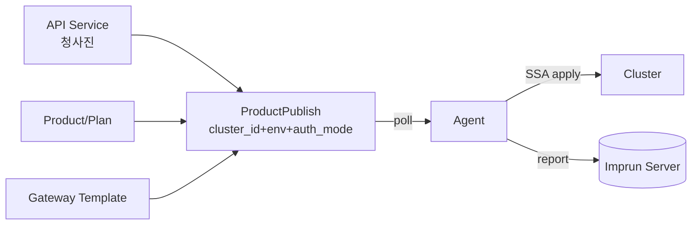
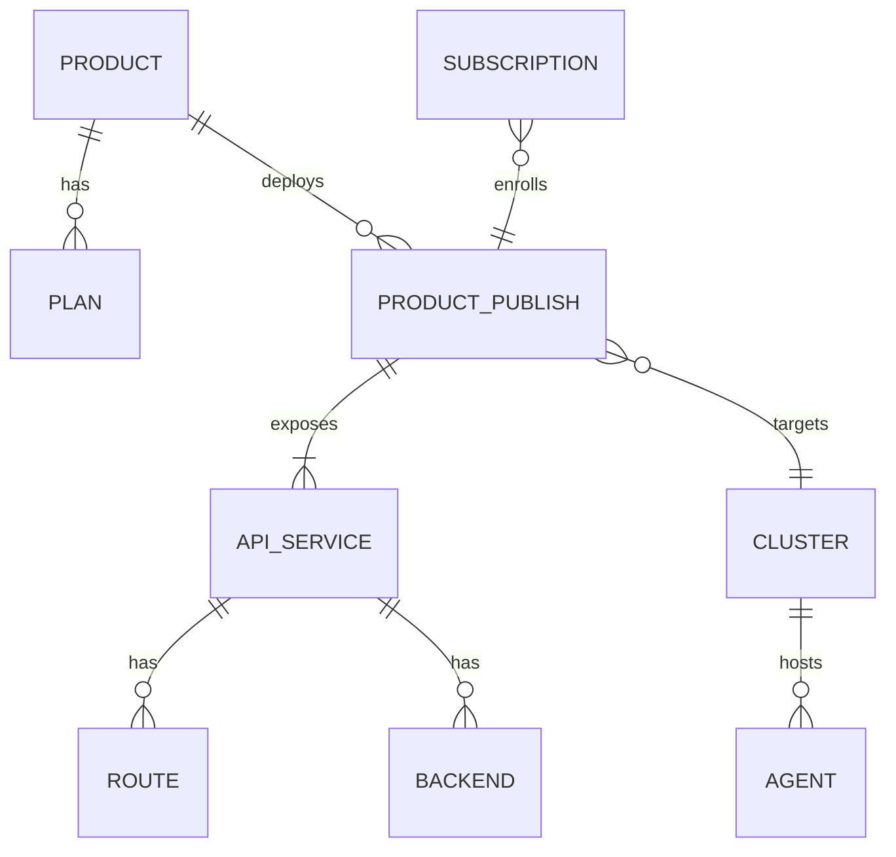
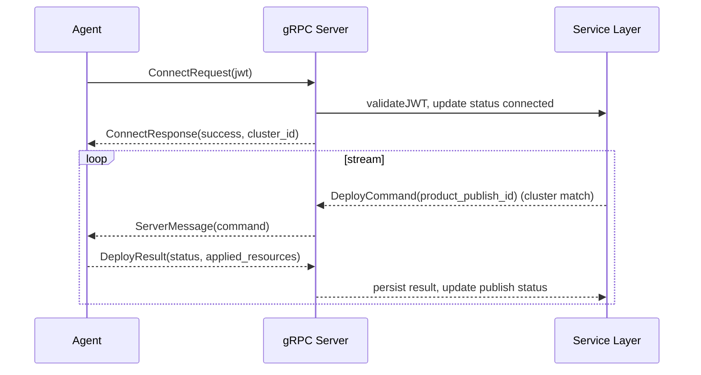

# Imp-Gateway Backend Plan v2 (GPT-5.1)

- **작성일**: 2025-11-26
- **대상**: `services/imprun-server` (Go/Gin/GORM), gRPC Agent 서비스
- **기반 문서**: `docs/architecture.md`, `docs/prd.md`, `docs/backend-spec.md`, `docs/data-model.md`
- **핵심 v2 변경점**: API Service ↔ Gateway 분리, `ProductPublish.cluster_id` 필수, Agent 배포 매칭/보고, 멀티 클러스터/환경 지원

---

## 1) 목표와 범위
- v1 백엔드에서 v2 도메인/스펙을 반영하고 운영자/제공자/소비자/에이전트 API를 안정화.
- 멀티 테넌트/멀티 클러스터 배포 흐름 완성: ProductPublish → Agent poll → CRD 적용 → 상태 리포트.
- DB 스키마 마이그레이션, gRPC/REST 인터페이스, 인증·테넌트·RBAC 강화를 포함.

---

## 2) 아키텍처/레이어 설계 (서비스 내부)
- **transport**: Gin HTTP (REST), gRPC (Agent). Versioned `/v1/{provider|customer|operator|agent|public}`.
- **services**: 유스케이스 오케스트레이션, 트랜잭션 경계.
- **domain**: 순수 도메인 모델/포트, 정책/밸리데이션.
- **data**: GORM repo, DB 스키마, migrations.
- **integrations**: Keycloak(OIDC/JWT), OTel, Redis(옵션).
- **middleware**: AuthN/JWT, Tenant scope, RBAC.
- **agent runtime**: gRPC bidi stream, deploy command routing by `cluster_id`.

---

## 3) 도메인/데이터 모델 변경 및 마이그레이션
- **APIService**: `gateway_id` 컬럼/필드 제거. 라우트/백엔드/폴리시는 JSONB.
- **ProductPublish**: `cluster_id` 추가(not null), `ProviderTenantID` 유지, `AuthConfig`, `APIServices` JSONB.
- **Cluster/Agent**: Capabilities JSONB, registration tokens 테이블 필요 시.
- **Migrations**
  - drop `api_services.gateway_id`
  - add `product_publishes.cluster_id uuid not null references clusters(id)`
  - seed 기본 클러스터/게이트웨이(옵션) + backfill publishes with default cluster if legacy data.
- **Indexing**
  - `product_publishes(cluster_id, environment, status)`
  - `agents(cluster_id, status, last_seen_at)`
  - `api_services(tenant_id, name)`

---

## 4) API 설계 (요약)
- **Provider**
  - `/v1/provider/api-services` CRUD (gateway_id 없음), sub-routes for routes/backends/policies.
  - `/v1/provider/gateways` 템플릿 CRUD.
  - `/v1/provider/products`, `/plans`, `/product-publishes` (필수: `cluster_id`, `environment`, `auth_mode`, `api_services[]`, `gateway_id`).
  - `/v1/provider/subscriptions` 승인/거절 (Phase 3).
- **Operator**
  - `/v1/operator/clusters` CRUD, capabilities.
  - `/v1/operator/clusters/{id}/registration-tokens`, `/agents` 목록/상세.
  - `/v1/operator/fleet` (배포/상태 집계, SSE 준비).
- **Customer**
  - `/v1/customer/products?published=true` 마켓.
  - `/v1/customer/subscriptions` 신청/조회.
  - `/v1/customer/credentials` 발급/회전 (apikey/oauth2).
- **Agent**
  - `/v1/agent/register` (registration token → JWT).
  - `/v1/agent/product-publishes/{id}` 배포 명세 조회.
  - `/v1/agent/deploy-results` 결과 보고.
- **Public**
  - 헬스/메트릭/버전.

---

## 5) Agent gRPC 흐름

- 클러스터 매칭: `ProductPublish.cluster_id == claims.cluster_id`.
- 백프레셔: 큐 사이즈 제한, ack/timeout 재시도, idempotent 명령 ID.
- Drift 감지 훅: `deploy-results`에 desired vs applied hash 비교 필드 추가 고려.

---

## 6) 인증/테넌시/RBAC
- **AuthN**: Keycloak JWT 미들웨어, public/public-tenant 분기.
- **TenantScope**: `X-Tenant-Slug` → `tenant_id` 주입, 모든 repo GORM scope로 필터.
- **RBAC**: `RequirePermission(resource, action)` 미들웨어; persona 맵핑 (operator/provider/customer). Resource 예: `api_service`, `product_publish`, `cluster`, `credential`.
- **Agent Auth**: registration token → JWT 발급 → gRPC/REST 양쪽 검증.

---

## 7) 서비스/모듈 작업 항목
- **Transport**
  - Gin 라우터 재구성: 그룹별 미들웨어(RBAC/tenant), OpenAPI 리비전.
  - gRPC 서버: bidi stream, metrics interceptors, auth interceptor.
- **Services**
  - ProductPublishService: 생성/검증(필수 필드), 상태 전이(publish/withdraw), Agent dispatch hook.
  - APIServiceService: gateway_id 제거, 라우트/백엔드/정책 탭별 업데이트.
  - ClusterService/AgentService: 등록 토큰, heartbeat/last_seen 업데이트.
  - Subscription/Credential 서비스 (Phase 3 준비, 최소 CRUD).
- **Data/Repo**
  - Migrations (sql or gormigrate).
  - Repos with cluster/env filters; status updates transactional.
- **Integrations**
  - Keycloak client refresh, role mapping.
  - OTel trace/span + request/DB metrics (Prometheus).
  - Optional Redis for registration token / deploy command queue.

---

## 8) 테스트 전략
- **단위**: 서비스/도메인 레벨(비즈니스 규칙), repo mocking.
- **통합**: Gin handlers with httptest, JWT/tenant headers, RBAC matrix.
- **gRPC**: stream harness tests (connect, command, result).
- **마이그레이션**: migrate up/down in CI against test PG, ensure cluster_id not null.
- **회귀**: v1->v2 breaking cases (APIService create without gateway_id, ProductPublish requires cluster_id).

---

## 9) 관측성/운영
- **Metrics**: request latency/error by route, gRPC command queue depth, deploy success rate, agent heartbeat staleness.
- **Logging**: structured zap/logrus, correlation IDs, agent_id/cluster_id tagging.
- **Health**: `/healthz`, `/readyz`; DB/Keycloak connectivity checks.
- **Config**: `config/` env-first, per persona limits (pagination defaults).

---

## 10) 단계별 실행 플랜 (우선순위)
1. 스키마/마이그레이션 적용: drop gateway_id, add cluster_id + indexes.
2. Repo/도메인 업데이트: 모델/DTO 정리, validation 추가.
3. ProductPublish 서비스/핸들러 v2화 + cluster/env/auth_mode 검증.
4. Agent gRPC 매칭 로직 구현 + deploy-results 처리/상태 저장.
5. Cluster/Agent API 정비(등록 토큰, heartbeat) + Fleet 집계 엔드포인트.
6. APIService/Gateway 핸들러 정리(v2 계약) + OpenAPI 업데이트.
7. Subscription/Credential 최소 기능 (Phase 3 토대).
8. 관측성/메트릭/헬스체크 확장, RBAC 매트릭스 테스트.

---

## 11) 리스크 및 대응
- **데이터 이관**: 기존 publishes에 cluster 미배정 → 기본값 배정/마이그레이션 스크립트 제공.
- **에이전트 호환성**: gRPC 메시지 버전 스키마 체크, feature flag로 v1/v2 명령 분리 가능.
- **성능**: 대량 ProductPublish 필터링 → 인덱스/페이징, stream backpressure.
- **보안**: registration token 유효기간/1회성, JWT 스코프 검증, tenant header 강제.

