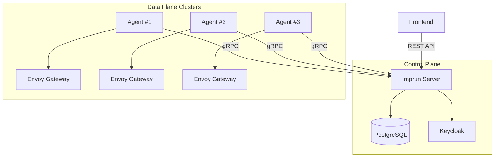
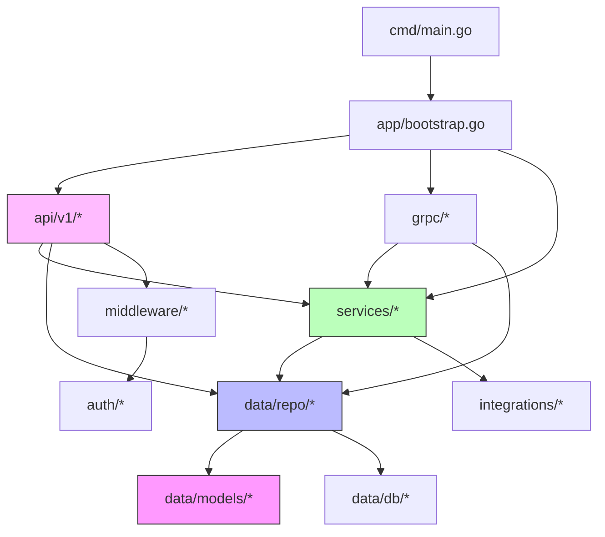
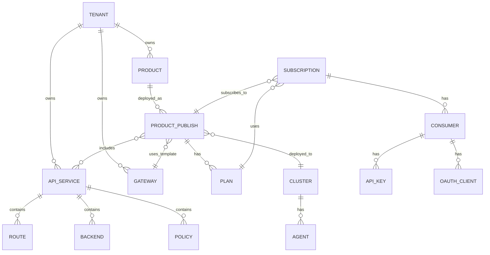
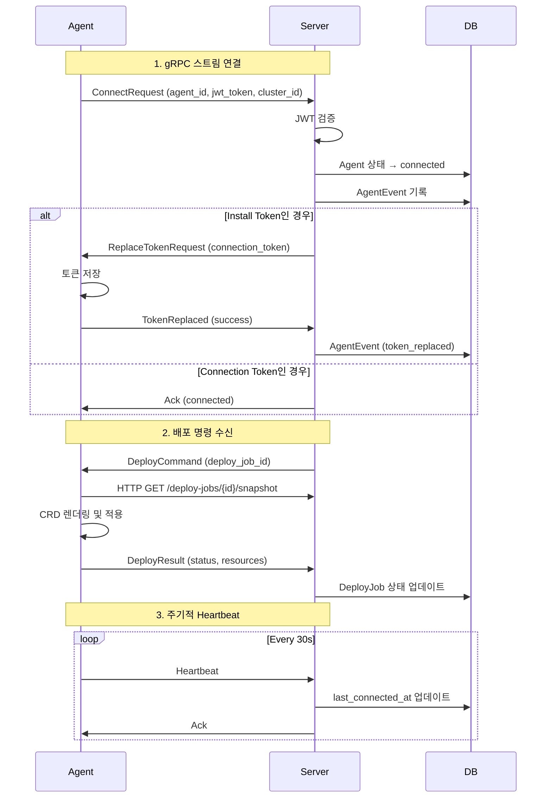
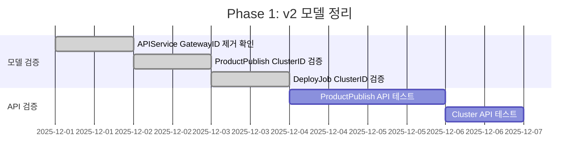
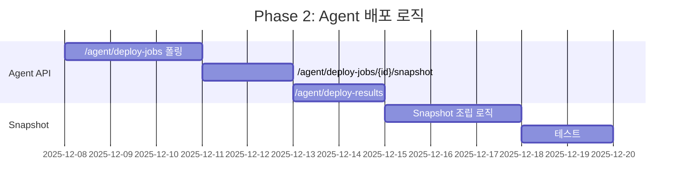
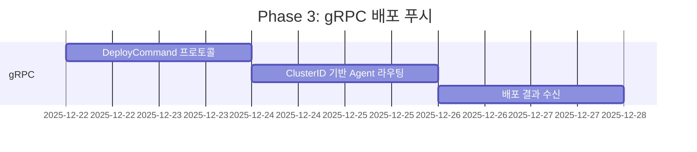
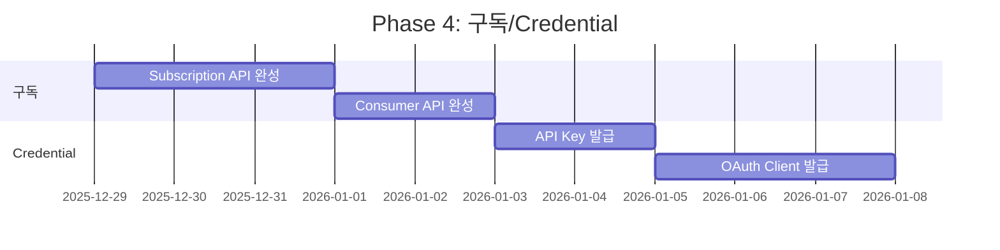

# Imp-Gateway Backend Plan v2 (Opus 4.5)

**버전**: 2.0
**작성일**: 2025-11-27
**대상 폴더**: `services/imprun-server/`
**기반 아키텍처**: `docs/architecture.md`, `docs/prd.md`, `docs/backend-spec.md`

---

## 1. Executive Summary

### 1.1 프로젝트 개요

Imp-Gateway v2 백엔드는 **Go/Gin/GORM** 기반의 Control Plane으로, 멀티 클러스터 API Gateway 플랫폼을 제어합니다.



### 1.2 v2 핵심 변경사항

| 항목 | v1 | v2 | 영향 범위 |
|------|----|----|-----------|
| APIService.GatewayID | 필수 | **제거** | Model, API, Repository |
| ProductPublish.ClusterID | 없음 | **필수** | Model, API, Repository, Deploy Service |
| Gateway 역할 | 배포 타겟 | 설정 템플릿 | 개념적 변화 |
| 멀티 클러스터 | 미지원 | **완전 지원** | Agent 라우팅, Deploy Job |

### 1.3 현재 구현 상태

기존 코드 분석 결과, **v2 변경사항이 이미 대부분 반영됨**:

- ✅ `APIService` 모델에서 `GatewayID` 제거됨
- ✅ `ProductPublish` 모델에 `ClusterID` 추가됨
- ✅ `createPublishReq`에 `cluster_id` 필수 필드 포함
- ✅ `DeployJob`에 `ClusterID` 포함
- ✅ gRPC Agent 서비스 구현됨 (JWT 인증)

**추가 구현 필요 사항**:
- 🔲 Agent가 ClusterID 기반으로 배포 작업 폴링
- 🔲 Snapshot 생성 및 CRD 렌더링 로직
- 🔲 배포 결과 리포팅 API
- 🔲 Drift 감지 및 자동 교정

---

## 2. 시스템 아키텍처

### 2.1 레이어 구조

```
services/imprun-server/
├── cmd/
│   └── imprun-server/           # 진입점
│       └── main.go
│
├── internal/
│   ├── app/                     # Application Bootstrap
│   │   └── bootstrap.go         # 의존성 주입, 라우터 설정
│   │
│   ├── api/v1/                  # API Handlers (Transport Layer)
│   │   ├── provider/            # Provider API (API 제공자용)
│   │   │   ├── apiservices.go
│   │   │   ├── backends.go
│   │   │   ├── routes.go
│   │   │   ├── policies.go
│   │   │   ├── gateways.go
│   │   │   ├── products.go      # Product + ProductPublish
│   │   │   ├── plans.go
│   │   │   ├── subscriptions.go
│   │   │   └── dashboard.go
│   │   │
│   │   ├── customer/            # Customer API (API 소비자용)
│   │   │   ├── subscriptions.go
│   │   │   ├── client_apps.go
│   │   │   ├── consumers.go
│   │   │   └── credentials.go
│   │   │
│   │   ├── operator/            # Operator API (운영자용)
│   │   │   ├── clusters.go
│   │   │   ├── agents.go
│   │   │   └── registration_tokens.go
│   │   │
│   │   ├── agent/               # Agent API (Agent 전용)
│   │   │   └── register.go
│   │   │
│   │   ├── admin/               # System Admin API
│   │   │   └── admin.go
│   │   │
│   │   ├── tenant/              # Tenant 관리
│   │   │   └── tenants.go
│   │   │
│   │   ├── market/              # Public Marketplace
│   │   │   └── products.go
│   │   │
│   │   └── auth/                # 인증 관련
│   │       └── auth.go
│   │
│   ├── services/                # Domain Services (Use Cases)
│   │   ├── deploysvc/           # 배포 작업 서비스
│   │   │   └── service.go
│   │   ├── credentialsvc/       # Credential 발급 서비스
│   │   │   └── service.go
│   │   └── agent_token_service.go
│   │
│   ├── data/                    # Data Layer
│   │   ├── models/              # GORM 모델
│   │   │   └── models.go
│   │   ├── repo/                # Repository 구현
│   │   │   ├── tenant_repo.go
│   │   │   ├── user_repo.go
│   │   │   ├── cluster_repo.go
│   │   │   ├── agent_repo.go
│   │   │   ├── api_service_repo.go
│   │   │   ├── product_repo.go
│   │   │   ├── product_publish_repo.go
│   │   │   └── ...
│   │   └── db/                  # 데이터베이스 연결
│   │       ├── db.go
│   │       └── migrate.go
│   │
│   ├── grpc/                    # gRPC Services
│   │   ├── agent_service.go     # Agent 양방향 스트림
│   │   └── pb/                  # Protobuf 생성 코드
│   │       ├── agent.proto
│   │       ├── agent.pb.go
│   │       └── agent_grpc.pb.go
│   │
│   ├── auth/                    # 인증 로직
│   │   ├── oidc.go              # Keycloak OIDC
│   │   └── agent_jwt.go         # Agent JWT
│   │
│   ├── middleware/              # HTTP 미들웨어
│   │   ├── auth.go
│   │   ├── tenant.go
│   │   ├── agent_auth.go
│   │   └── cors.go
│   │
│   ├── integrations/            # 외부 시스템 연동
│   │   └── keycloak/
│   │       └── admin.go         # Keycloak Admin API
│   │
│   ├── config/                  # 설정
│   │   └── config.go
│   │
│   └── common/                  # 공용 유틸리티
│       └── response/
│           └── envelope.go      # 표준 응답 포맷
│
└── go.mod
```

### 2.2 의존성 방향



**규칙**:
- `api` → `services` → `repo` → `models` (단방향)
- `grpc` → `services` → `repo` (단방향)
- `middleware` → `auth` (인증 로직 재사용)

---

## 3. 도메인 모델

### 3.1 엔티티 관계도



### 3.2 v2 모델 변경 상세

#### APIService (v2 - Gateway 독립)

```go
// v1: GatewayID 필수
type APIService struct {
    Base
    TenantID    string `gorm:"type:uuid;index;not null"`
    GatewayID   string `gorm:"type:uuid;index;not null"` // v1
    Name        string
    // ...
}

// v2: GatewayID 제거 - 독립적 청사진
type APIService struct {
    Base
    TenantID    string         `gorm:"type:uuid;index;not null"`
    // GatewayID 제거됨!
    Name        string         `gorm:"not null"`
    Version     string
    Description string
    Labels      datatypes.JSON `gorm:"type:jsonb"`
    Status      string         `gorm:"type:text"`
}
```

#### ProductPublish (v2 - ClusterID 추가)

```go
// v2: ClusterID 필수 - 물리 배포 타겟
type ProductPublish struct {
    Base
    ProductID        string               `gorm:"type:uuid;index;not null"`
    ProviderTenantID string               `gorm:"type:uuid;index;not null"`
    GatewayID        string               `gorm:"type:uuid;index;not null"` // 템플릿
    ClusterID        string               `gorm:"type:uuid;index;not null"` // v2 추가!
    Environment      string               `gorm:"type:text;not null"`       // dev/staging/prod
    HostnameBase     string
    APIServices      datatypes.JSON       `gorm:"type:jsonb"` // UUID 배열
    RouteIDs         datatypes.JSON       `gorm:"type:jsonb"`
    AuthMode         string               `gorm:"type:text;not null"` // none/apikey/oauth2
    AuthConfig       datatypes.JSON       `gorm:"type:jsonb"`
    Visibility       string               `gorm:"type:text"`
    ApprovalRequired bool
    Status           ProductPublishStatus `gorm:"type:text;default:'DRAFT'"`
    PublishedAt      *time.Time
    PublishedBy      string               `gorm:"type:uuid"`
    WithdrawnAt      *time.Time
    WithdrawnBy      string               `gorm:"type:uuid"`
}

type ProductPublishStatus string

const (
    ProductPublishStatusDraft     ProductPublishStatus = "DRAFT"
    ProductPublishStatusPublished ProductPublishStatus = "PUBLISHED"
    ProductPublishStatusWithdrawn ProductPublishStatus = "WITHDRAWN"
)
```

#### DeployJob (v2 - ClusterID 라우팅)

```go
// v2: ClusterID로 Agent 라우팅
type DeployJob struct {
    Base
    TenantID         string         `gorm:"type:uuid;index;not null"`
    ProductPublishID string         `gorm:"type:uuid;index"`
    ClusterID        string         `gorm:"type:uuid;index"` // v2: Agent 라우팅용
    SnapshotID       string         `gorm:"type:uuid;index"`
    Revision         int64          `gorm:"index"`
    Checksum         string
    ResourceType     string         `gorm:"type:text;not null"` // product_publish, plan, subscription
    ResourceID       string         `gorm:"index;not null"`
    Status           string         `gorm:"type:text"` // pending/running/succeeded/failed
    TriggerReason    string         `gorm:"type:text"`
    Summary          datatypes.JSON `gorm:"type:jsonb"`
    SnapshotURL      string
    Priority         int
    ExpiresAt        *time.Time
    DesiredState     datatypes.JSON `gorm:"type:jsonb"`
    GCList           datatypes.JSON `gorm:"type:jsonb"`
    StartedAt        *time.Time
    CompletedAt      *time.Time
}
```

---

## 4. API 설계

### 4.1 엔드포인트 그룹

```
/v1/
├── auth/                          # 인증 (공개)
│   ├── POST /callback             # OIDC 콜백
│   └── GET  /me                   # 현재 사용자
│
├── tenants/                       # 테넌트 관리
│   ├── POST /                     # 테넌트 생성
│   ├── GET  /                     # 테넌트 목록
│   └── ...
│
├── provider/                      # Provider API (인증+테넌트 필요)
│   ├── api-services/              # API 서비스 (v2: GatewayID 없음)
│   ├── gateways/                  # Gateway 템플릿
│   ├── products/                  # 제품 카탈로그
│   ├── product-publishes/         # 배포 명세 (v2: ClusterID 필수)
│   ├── plans/                     # 요금제
│   └── subscriptions/             # 구독 관리
│
├── customer/                      # Customer API (인증+테넌트 필요)
│   ├── subscriptions/             # 구독 신청
│   ├── client-apps/               # 클라이언트 앱
│   ├── consumers/                 # Consumer
│   └── credentials/               # API Key, OAuth
│
├── operator/                      # Operator API (시스템 관리자)
│   ├── clusters/                  # 클러스터 관리
│   ├── agents/                    # 에이전트 관리
│   └── registration-tokens/       # 등록 토큰
│
├── agent/                         # Agent API (Agent 전용)
│   ├── POST /register             # Agent 등록
│   ├── GET  /deploy-jobs          # 배포 작업 폴링 (v2: ClusterID 필터)
│   └── POST /deploy-results       # 배포 결과 리포트
│
├── market/                        # Marketplace (공개)
│   └── products/                  # 공개 제품 조회
│
└── admin/                         # System Admin API
    ├── tenants/
    └── users/
```

### 4.2 ProductPublish API (v2 핵심)

#### 생성

```http
POST /v1/provider/product-publishes
Authorization: Bearer {token}
X-Tenant-Slug: my-org

{
    "product_id": "uuid",
    "gateway_id": "uuid",           // Gateway 템플릿
    "cluster_id": "uuid",           // v2: 물리 배포 타겟 (필수!)
    "environment": "prod",          // dev/staging/prod
    "services": ["uuid1", "uuid2"], // API Service IDs
    "route_ids": ["uuid3"],         // 선택적 Route 필터
    "auth_mode": "apikey",          // none/apikey/oauth2
    "auth_config": { ... },
    "visibility": "public",
    "approval_required": true,
    "hostname_base": "my-api.prod.kr-seoul.api.imprun.dev"
}
```

```http
HTTP/1.1 201 Created

{
    "success": true,
    "data": {
        "product_publish": {
            "id": "uuid",
            "product_id": "uuid",
            "gateway_id": "uuid",
            "cluster_id": "uuid",       // v2
            "environment": "prod",
            "status": "DRAFT",
            "created_at": "2025-01-01T00:00:00Z"
        }
    }
}
```

#### 상태 변경

```http
# 배포 실행 (DRAFT → PUBLISHED)
POST /v1/provider/product-publishes/{id}/publish

# 배포 철회 (PUBLISHED → WITHDRAWN)
POST /v1/provider/product-publishes/{id}/withdraw
```

### 4.3 Agent API (v2 핵심)

#### 배포 작업 폴링

```http
# Agent가 자신의 ClusterID에 해당하는 작업만 조회
GET /v1/agent/deploy-jobs?cluster_id={cluster_id}&status=pending
Authorization: Bearer {agent_jwt}
```

```http
HTTP/1.1 200 OK

{
    "success": true,
    "data": {
        "deploy_jobs": [
            {
                "id": "uuid",
                "product_publish_id": "uuid",
                "cluster_id": "uuid",         // v2: 매칭용
                "resource_type": "product_publish",
                "resource_id": "uuid",
                "status": "pending",
                "trigger_reason": "create"
            }
        ]
    }
}
```

#### 배포 작업 상세 조회 (Snapshot 포함)

```http
GET /v1/agent/deploy-jobs/{id}/snapshot
Authorization: Bearer {agent_jwt}
```

```http
HTTP/1.1 200 OK

{
    "success": true,
    "data": {
        "deploy_job": { ... },
        "snapshot": {
            "product_publish": {
                "id": "uuid",
                "cluster_id": "uuid",
                "environment": "prod",
                "auth_mode": "apikey"
            },
            "gateway": {
                "id": "uuid",
                "gateway_class": "envoy-gateway",
                "listeners": [
                    { "name": "https", "port": 443, "protocol": "HTTPS" }
                ]
            },
            "api_services": [
                {
                    "id": "uuid",
                    "name": "payment-service",
                    "routes": [ ... ],
                    "backends": [ ... ],
                    "policies": [ ... ]
                }
            ]
        }
    }
}
```

#### 배포 결과 리포트

```http
POST /v1/agent/deploy-results
Authorization: Bearer {agent_jwt}

{
    "deploy_job_id": "uuid",
    "status": "succeeded",          // succeeded/failed/partial
    "message": "All resources applied successfully",
    "applied_resources": [
        {
            "kind": "Gateway",
            "name": "my-gateway",
            "namespace": "tenant-abc",
            "status": "created",
            "generation": 1
        },
        {
            "kind": "HTTPRoute",
            "name": "payment-route",
            "namespace": "tenant-abc",
            "status": "updated",
            "generation": 2
        }
    ],
    "errors": []
}
```

---

## 5. gRPC Agent 통신

### 5.1 Proto 정의

```protobuf
syntax = "proto3";

package agent;

option go_package = "github.com/imprun/imp-gateway/services/imprun-server/internal/grpc/pb";

service AgentService {
    // 양방향 스트림: Agent ↔ Server 실시간 통신
    rpc ConnectAgent(stream AgentMessage) returns (stream ServerCommand);
}

// Agent → Server 메시지
message AgentMessage {
    oneof payload {
        ConnectRequest connect_request = 1;
        TokenReplaced token_replaced = 2;
        Heartbeat heartbeat = 3;
        DeployResult deploy_result = 4;  // v2: 배포 결과
    }
}

message ConnectRequest {
    string agent_id = 1;
    string jwt_token = 2;
    string agent_version = 3;
    string cluster_id = 4;            // v2: Agent의 클러스터
}

message TokenReplaced {
    bool success = 1;
    string error_message = 2;
}

message Heartbeat {
    int64 timestamp = 1;
}

message DeployResult {
    string deploy_job_id = 1;
    string status = 2;                // succeeded/failed/partial
    string message = 3;
    repeated AppliedResource resources = 4;
}

message AppliedResource {
    string kind = 1;
    string name = 2;
    string namespace = 3;
    string status = 4;                // created/updated/deleted/failed
    int64 generation = 5;
}

// Server → Agent 명령
message ServerCommand {
    oneof payload {
        Ack ack = 1;
        ReplaceTokenRequest replace_token = 2;
        RevokeTokenRequest revoke_token = 3;
        DeployCommand deploy = 4;     // v2: 배포 명령
    }
}

message Ack {
    bool success = 1;
    string message = 2;
}

message ReplaceTokenRequest {
    string new_connection_token = 1;
}

message RevokeTokenRequest {
    string reason = 1;
}

// v2: 배포 명령
message DeployCommand {
    string deploy_job_id = 1;
    string snapshot_url = 2;          // Snapshot JSON 다운로드 URL
    int32 priority = 3;
}
```

### 5.2 Agent 연결 흐름



### 5.3 배포 명령 푸시 (v2)

```go
// services/deploysvc/push.go
func (s *Service) PushDeployCommand(ctx context.Context, job *models.DeployJob) error {
    // 1. 해당 클러스터에 연결된 Agent 찾기
    agents := s.agentServer.GetConnectedAgentsByCluster(job.ClusterID)
    if len(agents) == 0 {
        log.Printf("No connected agents for cluster %s, job will be polled", job.ClusterID)
        return nil
    }

    // 2. 첫 번째 연결된 Agent에 배포 명령 전송
    cmd := &pb.ServerCommand{
        Payload: &pb.ServerCommand_Deploy{
            Deploy: &pb.DeployCommand{
                DeployJobId: job.ID,
                SnapshotUrl: fmt.Sprintf("/v1/agent/deploy-jobs/%s/snapshot", job.ID),
                Priority:    int32(job.Priority),
            },
        },
    }

    return s.agentServer.SendCommand(agents[0], cmd)
}
```

---

## 6. 서비스 계층

### 6.1 Deploy Service

```go
// services/deploysvc/service.go

type Service struct {
    deployJobRepo *repo.DeployJobRepo
    productRepo   *repo.ProductRepo
    agentServer   *grpc.AgentServiceServer
    snapshotSvc   *SnapshotService
}

// TriggerProductPublish: ProductPublish 변경 시 DeployJob 생성
func (s *Service) TriggerProductPublish(ctx context.Context, tenantID, publishID, reason string) error {
    // 1. ProductPublish에서 ClusterID 조회
    pub, err := s.productRepo.GetPublishByID(ctx, publishID)
    if err != nil {
        return fmt.Errorf("get publish: %w", err)
    }

    // 2. DeployJob 생성 (v2: ClusterID 포함)
    job := &models.DeployJob{
        TenantID:         tenantID,
        ProductPublishID: publishID,
        ClusterID:        pub.ClusterID,  // v2: 핵심!
        ResourceType:     "product_publish",
        ResourceID:       publishID,
        TriggerReason:    reason,
        Status:           "pending",
    }

    if err := s.deployJobRepo.Enqueue(ctx, job); err != nil {
        return fmt.Errorf("enqueue: %w", err)
    }

    // 3. 연결된 Agent에 즉시 푸시 (선택적)
    if s.agentServer != nil {
        go s.PushDeployCommand(ctx, job)
    }

    return nil
}

// CreateSnapshot: 배포에 필요한 모든 정보를 JSON으로 조립
func (s *Service) CreateSnapshot(ctx context.Context, publishID string) (*Snapshot, error) {
    pub, err := s.productRepo.GetPublishWithRelations(ctx, publishID)
    if err != nil {
        return nil, err
    }

    return &Snapshot{
        ProductPublish: pub,
        Gateway:        pub.Gateway,
        APIServices:    pub.APIServices,
        // Routes, Backends, Policies는 APIServices에 포함
    }, nil
}
```

### 6.2 Credential Service

```go
// services/credentialsvc/service.go

type Service struct {
    db      *gorm.DB
    kcAdmin *keycloak.AdminClient
}

// IssueAPIKey: Consumer에 대한 API Key 발급
func (s *Service) IssueAPIKey(ctx context.Context, consumerID, label string) (*APIKeyResult, error) {
    // 1. Consumer 및 권한 확인
    consumer, err := s.getConsumer(ctx, consumerID)
    if err != nil {
        return nil, err
    }

    // 2. 랜덤 Key 생성
    keyPrefix := generateKeyPrefix()  // imp_xxxxx (8자)
    keySecret := generateKeySecret()  // 32바이트 랜덤
    keyHash := hashKey(keySecret)

    // 3. DB 저장
    apiKey := &models.APIKey{
        ConsumerID: consumerID,
        KeyPrefix:  keyPrefix,
        KeyHash:    keyHash,
        Label:      label,
        Status:     "active",
    }
    if err := s.db.Create(apiKey).Error; err != nil {
        return nil, err
    }

    // 4. 평문 키 반환 (1회만 노출)
    return &APIKeyResult{
        ID:        apiKey.ID,
        KeyPrefix: keyPrefix,
        APIKey:    fmt.Sprintf("%s.%s", keyPrefix, keySecret),  // imp_xxxxx.secret
        CreatedAt: apiKey.CreatedAt,
    }, nil
}

// IssueOAuthClient: Consumer에 대한 OAuth Client 발급
func (s *Service) IssueOAuthClient(ctx context.Context, consumerID string, redirectURIs []string) (*OAuthClientResult, error) {
    // 1. Consumer 및 권한 확인
    consumer, err := s.getConsumer(ctx, consumerID)
    if err != nil {
        return nil, err
    }

    // 2. Keycloak에 Client 생성
    clientID := fmt.Sprintf("consumer-%s", consumer.ID[:8])
    clientSecret, err := s.kcAdmin.CreateClient(ctx, clientID, redirectURIs)
    if err != nil {
        return nil, err
    }

    // 3. DB 저장 (암호화된 secret)
    oauthClient := &models.OAuthClient{
        ConsumerID:       consumerID,
        KeycloakClientID: clientID,
        ClientID:         clientID,
        ClientSecretEnc:  encrypt(clientSecret),
        RedirectURIs:     toJSON(redirectURIs),
        Status:           "active",
    }
    if err := s.db.Create(oauthClient).Error; err != nil {
        return nil, err
    }

    return &OAuthClientResult{
        ID:           oauthClient.ID,
        ClientID:     clientID,
        ClientSecret: clientSecret,  // 1회만 노출
        CreatedAt:    oauthClient.CreatedAt,
    }, nil
}
```

### 6.3 Agent Token Service

```go
// services/agent_token_service.go

type AgentTokenService struct {
    tokenRepo  *repo.AgentTokenRepo
    eventRepo  *repo.AgentEventRepo
    jwtSecret  string
}

type AgentTokenClaims struct {
    AgentID   string `json:"agent_id"`
    ClusterID string `json:"cluster_id"`
    Type      string `json:"type"`      // install/connection
    Nonce     string `json:"nonce"`
    jwt.RegisteredClaims
}

// GenerateInstallToken: 최초 설치용 토큰 (1회용, 만료 있음)
func (s *AgentTokenService) GenerateInstallToken(ctx context.Context, agentID, clusterID string, expiresIn time.Duration) (string, error) {
    nonce := generateNonce()

    claims := AgentTokenClaims{
        AgentID:   agentID,
        ClusterID: clusterID,
        Type:      "install",
        Nonce:     nonce,
        RegisteredClaims: jwt.RegisteredClaims{
            ExpiresAt: jwt.NewNumericDate(time.Now().Add(expiresIn)),
            IssuedAt:  jwt.NewNumericDate(time.Now()),
        },
    }

    token := jwt.NewWithClaims(jwt.SigningMethodHS256, claims)
    signedToken, err := token.SignedString([]byte(s.jwtSecret))
    if err != nil {
        return "", err
    }

    // DB에 토큰 메타데이터 저장
    expiresAt := time.Now().Add(expiresIn)
    agentToken := &models.AgentToken{
        AgentID:   agentID,
        Nonce:     nonce,
        Type:      "install",
        ExpiresAt: &expiresAt,
    }
    if err := s.tokenRepo.Create(ctx, agentToken); err != nil {
        return "", err
    }

    return signedToken, nil
}

// GenerateConnectionToken: 장기 연결용 토큰 (만료 없음)
func (s *AgentTokenService) GenerateConnectionToken(ctx context.Context, agentID string) (string, error) {
    agent, err := s.getAgent(ctx, agentID)
    if err != nil {
        return "", err
    }

    nonce := generateNonce()

    claims := AgentTokenClaims{
        AgentID:   agentID,
        ClusterID: agent.ClusterID,
        Type:      "connection",
        Nonce:     nonce,
        RegisteredClaims: jwt.RegisteredClaims{
            IssuedAt: jwt.NewNumericDate(time.Now()),
            // ExpiresAt 없음 - 영구 토큰
        },
    }

    token := jwt.NewWithClaims(jwt.SigningMethodHS256, claims)
    signedToken, err := token.SignedString([]byte(s.jwtSecret))
    if err != nil {
        return "", err
    }

    // DB에 토큰 저장 (ExpiresAt = nil)
    agentToken := &models.AgentToken{
        AgentID: agentID,
        Nonce:   nonce,
        Type:    "connection",
    }
    if err := s.tokenRepo.Create(ctx, agentToken); err != nil {
        return "", err
    }

    // 이벤트 기록
    event := &models.AgentEvent{
        AgentID:   agentID,
        Type:      "token_replaced",
        Timestamp: time.Now(),
    }
    s.eventRepo.Create(ctx, event)

    return signedToken, nil
}

// ValidateToken: JWT 검증 + Nonce 확인
func (s *AgentTokenService) ValidateToken(ctx context.Context, tokenString string) (*AgentTokenClaims, error) {
    token, err := jwt.ParseWithClaims(tokenString, &AgentTokenClaims{}, func(token *jwt.Token) (interface{}, error) {
        return []byte(s.jwtSecret), nil
    })
    if err != nil {
        return nil, err
    }

    claims, ok := token.Claims.(*AgentTokenClaims)
    if !ok || !token.Valid {
        return nil, errors.New("invalid token")
    }

    // Nonce가 DB에 존재하고 revoke되지 않았는지 확인
    agentToken, err := s.tokenRepo.FindByNonce(ctx, claims.Nonce)
    if err != nil {
        return nil, errors.New("token not found or revoked")
    }

    if agentToken.RevokedAt != nil {
        return nil, errors.New("token revoked")
    }

    return claims, nil
}
```

---

## 7. 미들웨어

### 7.1 인증 미들웨어

```go
// middleware/auth.go

func AuthRequired(authenticator *auth.Authenticator) gin.HandlerFunc {
    return func(c *gin.Context) {
        token := extractBearerToken(c)
        if token == "" {
            c.AbortWithStatusJSON(401, gin.H{"error": "missing token"})
            return
        }

        claims, err := authenticator.ValidateToken(c.Request.Context(), token)
        if err != nil {
            c.AbortWithStatusJSON(401, gin.H{"error": "invalid token"})
            return
        }

        c.Set("user_id", claims.Subject)
        c.Set("email", claims.Email)
        c.Set("tenant_slugs", claims.TenantSlugs)
        c.Set("roles", claims.RealmRoles)
        c.Set("system_roles", claims.SystemRoles)

        c.Next()
    }
}
```

### 7.2 테넌트 컨텍스트 미들웨어

```go
// middleware/tenant.go

func TenantContext(tenantRepo *repo.TenantRepo) gin.HandlerFunc {
    return func(c *gin.Context) {
        tenantSlug := c.GetHeader("X-Tenant-Slug")
        if tenantSlug == "" {
            c.AbortWithStatusJSON(400, gin.H{"error": "X-Tenant-Slug header required"})
            return
        }

        // 사용자의 tenant_slugs에 포함되어 있는지 확인
        userTenants := c.GetStringSlice("tenant_slugs")
        if !contains(userTenants, tenantSlug) {
            c.AbortWithStatusJSON(403, gin.H{"error": "not a member of this tenant"})
            return
        }

        // Tenant 조회
        tenant, err := tenantRepo.GetBySlug(c.Request.Context(), tenantSlug)
        if err != nil {
            c.AbortWithStatusJSON(404, gin.H{"error": "tenant not found"})
            return
        }

        // Membership 조회
        userID := c.GetString("user_id")
        membership, err := tenantRepo.GetMembership(c.Request.Context(), tenant.ID, userID)
        if err != nil {
            c.AbortWithStatusJSON(403, gin.H{"error": "membership not found"})
            return
        }

        c.Set("tenant_id", tenant.ID)
        c.Set("tenant_slug", tenant.Slug)
        c.Set("membership", membership)

        c.Next()
    }
}
```

### 7.3 Agent 인증 미들웨어

```go
// middleware/agent_auth.go

func AgentAuthRequired(tokenService *services.AgentTokenService) gin.HandlerFunc {
    return func(c *gin.Context) {
        token := extractBearerToken(c)
        if token == "" {
            c.AbortWithStatusJSON(401, gin.H{"error": "missing agent token"})
            return
        }

        claims, err := tokenService.ValidateToken(c.Request.Context(), token)
        if err != nil {
            c.AbortWithStatusJSON(401, gin.H{"error": "invalid agent token"})
            return
        }

        c.Set("agent_id", claims.AgentID)
        c.Set("cluster_id", claims.ClusterID)
        c.Set("token_type", claims.Type)

        c.Next()
    }
}
```

---

## 8. 데이터 접근 계층

### 8.1 Repository 패턴

```go
// data/repo/product_publish_repo.go

type ProductPublishRepo struct {
    db *gorm.DB
}

func NewProductPublishRepo(db *gorm.DB) *ProductPublishRepo {
    return &ProductPublishRepo{db: db}
}

// CreatePublishWithDraft: DRAFT 상태로 생성 + 이벤트 기록
func (r *ProductPublishRepo) CreatePublishWithDraft(ctx context.Context, pub *models.ProductPublish, userID string) error {
    return r.db.WithContext(ctx).Transaction(func(tx *gorm.DB) error {
        pub.Status = models.ProductPublishStatusDraft
        if err := tx.Create(pub).Error; err != nil {
            return err
        }

        event := &models.ProductPublishEvent{
            ProductPublishID: pub.ID,
            ToStatus:         models.ProductPublishStatusDraft,
            ChangedBy:        userID,
            Reason:           "created",
        }
        return tx.Create(event).Error
    })
}

// PublishProduct: DRAFT → PUBLISHED 상태 전이
func (r *ProductPublishRepo) PublishProduct(ctx context.Context, publishID, userID string) error {
    return r.db.WithContext(ctx).Transaction(func(tx *gorm.DB) error {
        var pub models.ProductPublish
        if err := tx.First(&pub, "id = ?", publishID).Error; err != nil {
            return err
        }

        if pub.Status != models.ProductPublishStatusDraft {
            return errors.New("can only publish from DRAFT status")
        }

        now := time.Now()
        pub.Status = models.ProductPublishStatusPublished
        pub.PublishedAt = &now
        pub.PublishedBy = userID

        if err := tx.Save(&pub).Error; err != nil {
            return err
        }

        event := &models.ProductPublishEvent{
            ProductPublishID: publishID,
            FromStatus:       models.ProductPublishStatusDraft,
            ToStatus:         models.ProductPublishStatusPublished,
            ChangedBy:        userID,
        }
        return tx.Create(event).Error
    })
}

// ListByCluster: v2 - 클러스터별 배포 목록
func (r *ProductPublishRepo) ListByCluster(ctx context.Context, clusterID string) ([]*models.ProductPublish, error) {
    var publishes []*models.ProductPublish
    err := r.db.WithContext(ctx).
        Where("cluster_id = ?", clusterID).
        Order("created_at DESC").
        Find(&publishes).Error
    return publishes, err
}
```

### 8.2 DeployJob Repository

```go
// data/repo/deploy_job_repo.go

type DeployJobRepo struct {
    db *gorm.DB
}

// Enqueue: 새 배포 작업 생성
func (r *DeployJobRepo) Enqueue(ctx context.Context, job *models.DeployJob) error {
    job.Status = "pending"
    return r.db.WithContext(ctx).Create(job).Error
}

// PollByCluster: v2 - 클러스터별 pending 작업 조회
func (r *DeployJobRepo) PollByCluster(ctx context.Context, clusterID string, limit int) ([]*models.DeployJob, error) {
    var jobs []*models.DeployJob
    err := r.db.WithContext(ctx).
        Where("cluster_id = ? AND status = ?", clusterID, "pending").
        Order("priority DESC, created_at ASC").
        Limit(limit).
        Find(&jobs).Error
    return jobs, err
}

// LockJob: 배포 작업 잠금 (optimistic locking)
func (r *DeployJobRepo) LockJob(ctx context.Context, jobID string) error {
    now := time.Now()
    result := r.db.WithContext(ctx).
        Model(&models.DeployJob{}).
        Where("id = ? AND status = ?", jobID, "pending").
        Updates(map[string]interface{}{
            "status":     "running",
            "started_at": now,
        })

    if result.RowsAffected == 0 {
        return errors.New("job already claimed or not found")
    }
    return result.Error
}

// CompleteJob: 배포 완료 처리
func (r *DeployJobRepo) CompleteJob(ctx context.Context, jobID string, status string, summary map[string]interface{}) error {
    now := time.Now()
    summaryJSON, _ := json.Marshal(summary)
    return r.db.WithContext(ctx).
        Model(&models.DeployJob{}).
        Where("id = ?", jobID).
        Updates(map[string]interface{}{
            "status":       status,
            "completed_at": now,
            "summary":      summaryJSON,
        }).Error
}
```

---

## 9. 테스트 전략

### 9.1 테스트 레이어

```
테스트 피라미드:

        /\
       /  \
      / E2E \           (Testcontainers)
     /--------\
    /  통합    \         (httptest + 실제 DB)
   /--------------\
  /     단위       \      (mocks)
 /------------------\
```

### 9.2 단위 테스트 예시

```go
// services/agent_token_service_test.go

func TestAgentTokenService_ValidateToken(t *testing.T) {
    // Setup
    tokenRepo := &mockTokenRepo{}
    eventRepo := &mockEventRepo{}
    svc := services.NewAgentTokenService(tokenRepo, eventRepo, "test-secret")

    // Generate a valid token
    token, err := svc.GenerateConnectionToken(context.Background(), "agent-123")
    require.NoError(t, err)

    // Test validation
    claims, err := svc.ValidateToken(context.Background(), token)
    require.NoError(t, err)
    assert.Equal(t, "agent-123", claims.AgentID)
    assert.Equal(t, "connection", claims.Type)
}

func TestAgentTokenService_ValidateToken_Revoked(t *testing.T) {
    // Setup with revoked token
    tokenRepo := &mockTokenRepo{
        revokedNonces: map[string]bool{"test-nonce": true},
    }
    eventRepo := &mockEventRepo{}
    svc := services.NewAgentTokenService(tokenRepo, eventRepo, "test-secret")

    // Generate token and then mark as revoked
    token, _ := svc.GenerateConnectionToken(context.Background(), "agent-123")
    tokenRepo.RevokeByAgentID(context.Background(), "agent-123")

    // Validation should fail
    _, err := svc.ValidateToken(context.Background(), token)
    assert.Error(t, err)
    assert.Contains(t, err.Error(), "revoked")
}
```

### 9.3 통합 테스트 예시

```go
// api/v1/provider/products_test.go

func TestProductPublishAPI_CreateWithClusterID(t *testing.T) {
    // Setup test database
    db := setupTestDB(t)
    defer teardownTestDB(t, db)

    // Create test data
    tenant := createTestTenant(t, db)
    product := createTestProduct(t, db, tenant.ID)
    gateway := createTestGateway(t, db, tenant.ID)
    cluster := createTestCluster(t, db)

    // Setup router
    router := gin.New()
    handler := provider.NewProductHandler(db, nil)
    handler.Register(router.Group("/provider"))

    // v2: ClusterID 필수
    req := createPublishReq{
        ProductID:   product.ID,
        GatewayID:   gateway.ID,
        ClusterID:   cluster.ID,  // v2 필수!
        Environment: "prod",
        AuthMode:    "apikey",
    }

    // Execute
    w := performRequest(router, "POST", "/provider/product-publishes", req, tenant.ID)

    // Assert
    assert.Equal(t, 200, w.Code)
    var resp map[string]interface{}
    json.Unmarshal(w.Body.Bytes(), &resp)
    pubData := resp["data"].(map[string]interface{})["product_publish"].(map[string]interface{})
    assert.Equal(t, cluster.ID, pubData["cluster_id"])
}

func TestProductPublishAPI_CreateWithoutClusterID_Fails(t *testing.T) {
    // v2: ClusterID 없으면 실패해야 함
    req := createPublishReq{
        ProductID:   "uuid",
        GatewayID:   "uuid",
        // ClusterID 없음!
        Environment: "prod",
        AuthMode:    "apikey",
    }

    w := performRequest(router, "POST", "/provider/product-publishes", req, tenantID)

    assert.Equal(t, 400, w.Code)
    assert.Contains(t, w.Body.String(), "cluster_id")
}
```

---

## 10. 에러 처리

### 10.1 표준 응답 포맷

```go
// common/response/envelope.go

type SuccessResponse struct {
    Success bool        `json:"success"`
    Data    interface{} `json:"data,omitempty"`
}

type ErrorResponse struct {
    Success bool       `json:"success"`
    Error   ErrorBody  `json:"error"`
}

type ErrorBody struct {
    Code    string      `json:"code"`
    Message string      `json:"message"`
    Details interface{} `json:"details,omitempty"`
    Reason  string      `json:"reason,omitempty"`
}

func Success(c *gin.Context, data interface{}) {
    c.JSON(http.StatusOK, SuccessResponse{
        Success: true,
        Data:    data,
    })
}

func Fail(c *gin.Context, status int, code, message string, details *ErrorBody) {
    resp := ErrorResponse{
        Success: false,
        Error: ErrorBody{
            Code:    code,
            Message: message,
        },
    }
    if details != nil {
        resp.Error.Details = details.Details
        resp.Error.Reason = details.Reason
    }
    c.JSON(status, resp)
}
```

### 10.2 에러 코드 정의

```go
// common/errors/codes.go

const (
    // Validation Errors (400)
    ErrValidation      = "ERR_VALIDATION"
    ErrTenantRequired  = "ERR_TENANT_REQUIRED"
    ErrClusterRequired = "ERR_CLUSTER_REQUIRED"  // v2

    // Auth Errors (401/403)
    ErrUnauthorized = "ERR_UNAUTHORIZED"
    ErrForbidden    = "ERR_FORBIDDEN"

    // Not Found (404)
    ErrNotFound        = "ERR_NOT_FOUND"
    ErrClusterNotFound = "ERR_CLUSTER_NOT_FOUND"  // v2

    // Conflict (409)
    ErrConflict    = "ERR_CONFLICT"
    ErrPublished   = "ERR_PUBLISHED"  // 배포된 제품 삭제 시도

    // Internal (500)
    ErrInternal = "ERR_INTERNAL"
    ErrDatabase = "ERR_DB"
    ErrDeploy   = "ERR_DEPLOY"
)
```

---

## 11. 개발 일정

### Phase 1: v2 모델 정리 및 검증 (Week 1)



**체크리스트**:
- [x] APIService 모델에서 GatewayID 제거됨
- [x] ProductPublish 모델에 ClusterID 추가됨
- [x] createPublishReq에 cluster_id 필수 필드 포함
- [ ] 기존 데이터 마이그레이션 스크립트

### Phase 2: Agent 배포 로직 (Week 2-3)



**구현 항목**:
- [ ] `GET /v1/agent/deploy-jobs?cluster_id={id}` - ClusterID 기반 폴링
- [ ] `GET /v1/agent/deploy-jobs/{id}/snapshot` - 배포 Snapshot
- [ ] `POST /v1/agent/deploy-results` - 결과 리포트
- [ ] Snapshot JSON 조립 로직

### Phase 3: gRPC 배포 푸시 (Week 4)



**구현 항목**:
- [ ] `DeployCommand` protobuf 메시지
- [ ] `GetConnectedAgentsByCluster()` 구현
- [ ] `SendDeployCommand()` 구현
- [ ] 배포 결과 처리

### Phase 4: 구독/Credential (Week 5-6)



### Phase 5: 통합 테스트 및 문서화 (Week 7)

- [ ] E2E 테스트 작성
- [ ] API 문서 (OpenAPI 3.0)
- [ ] 운영 가이드

---

## 12. 성능 고려사항

### 12.1 데이터베이스 인덱스

```sql
-- v2: ClusterID 기반 조회를 위한 인덱스
CREATE INDEX idx_product_publishes_cluster_env
    ON product_publishes(cluster_id, environment);

CREATE INDEX idx_deploy_jobs_cluster_status
    ON deploy_jobs(cluster_id, status);

CREATE INDEX idx_agents_cluster_status
    ON agents(cluster_id, status);
```

### 12.2 캐싱 전략

```go
// 향후 Redis 캐시 적용 시
type CachedSnapshotService struct {
    cache    *redis.Client
    delegate *SnapshotService
    ttl      time.Duration
}

func (s *CachedSnapshotService) GetSnapshot(ctx context.Context, publishID string) (*Snapshot, error) {
    // 1. 캐시 확인
    cached, err := s.cache.Get(ctx, "snapshot:"+publishID).Bytes()
    if err == nil {
        var snapshot Snapshot
        json.Unmarshal(cached, &snapshot)
        return &snapshot, nil
    }

    // 2. DB에서 조회
    snapshot, err := s.delegate.CreateSnapshot(ctx, publishID)
    if err != nil {
        return nil, err
    }

    // 3. 캐시 저장
    data, _ := json.Marshal(snapshot)
    s.cache.Set(ctx, "snapshot:"+publishID, data, s.ttl)

    return snapshot, nil
}
```

---

## 13. 참고 문서

- [Architecture v2](architecture.md)
- [PRD v2](prd.md)
- [Backend Spec v2](backend-spec.md)
- [Data Model v2](data-model.md)
- [Agent Spec v2](agent-spec.md)
- [Frontend Plan v2](frontend-plan-v2-claude.md)
