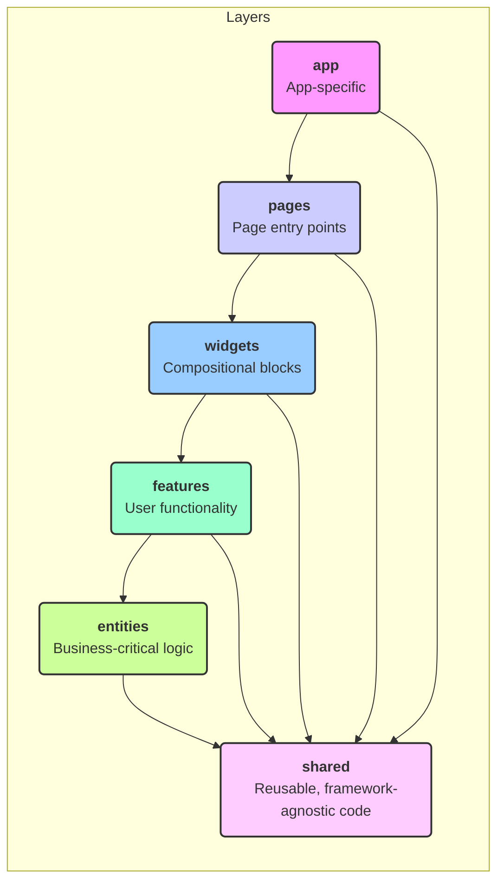
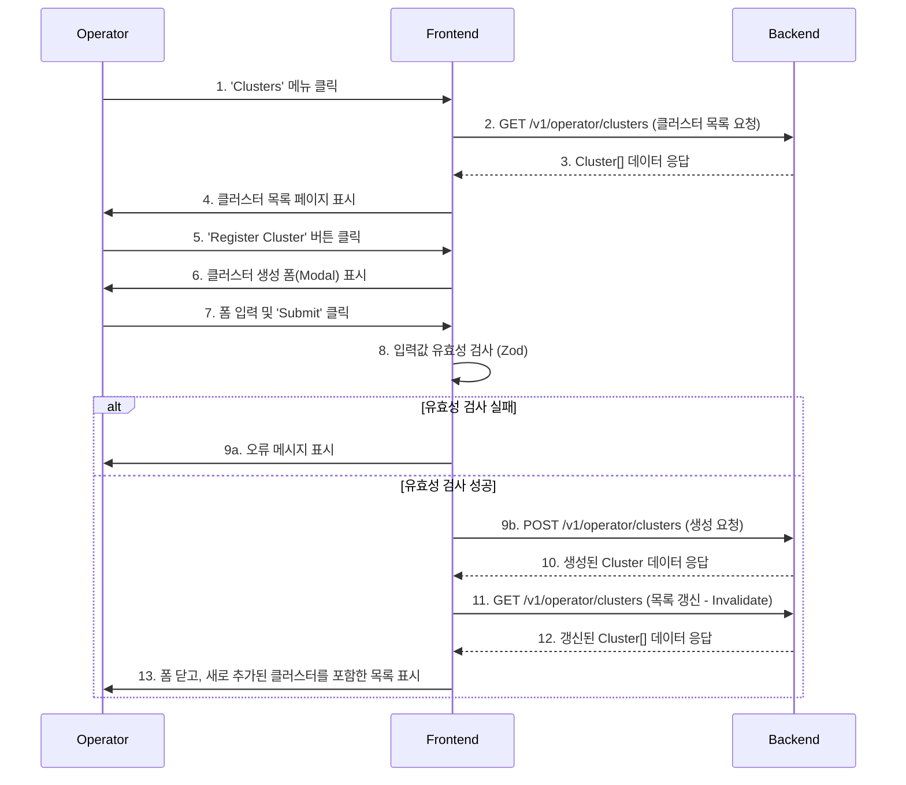
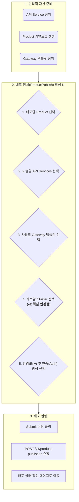
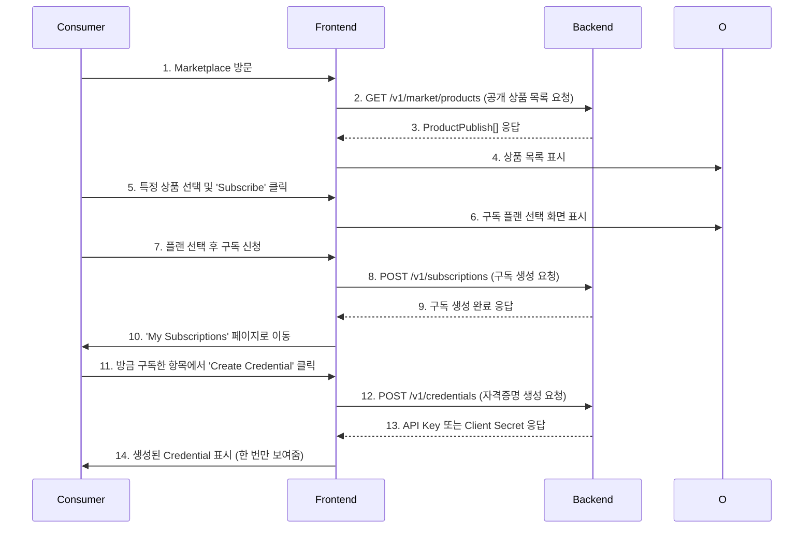

# Imp-Gateway v2 통합 프론트엔드 개발 기획서

**버전**: 2.5 (Gemini Pro)
**작성일**: 2025-11-26
**문서 목적**: v2 아키텍처 및 PRD 기반, 운영자/제공자/소비자용 통합 프론트엔드 상세 개발 기획. 본 문서는 다른 프론트엔드 개발자가 즉시 개발에 착수할 수 있는 수준의 상세함을 목표로 한다.
**핵심 아키텍처**: **Feature-Sliced Design (FSD)** + **Next.js App Router**

---

## 1. 아키텍처 원칙: Feature-Sliced Design (FSD)

본 프로젝트는 코드의 규모가 커져도 예측 가능하고 유지보수하기 쉬운 구조를 유지하기 위해 FSD를 채택합니다.

### 1.1. FSD 계층 구조

모든 코드는 7개의 계층(Layer) 중 하나에 속하며, 상위 계층은 하위 계층에만 의존할 수 있습니다. (예: `features`는 `entities`와 `shared`를 사용할 수 있지만, `widgets`는 사용할 수 없음)



### 1.2. 슬라이스 (Slices)

`features`, `entities`와 같은 계층은 **슬라이스(Slice)** 로 구성됩니다. 슬라이스는 특정 비즈니스 도메인을 캡슐화한 수직적 모듈입니다. (예: `entities/Cluster`, `features/CreateCluster`)

각 슬라이스는 `ui`, `model`, `api`, `lib` 등의 세그먼트로 구성될 수 있습니다.

---

## 2. 상태 관리 전략

1.  **서버 상태 (Server State)**: **TanStack Query (React Query)**
    - 모든 API 데이터 Fetching, Caching, 동기화를 담당합니다.
    - `entities` 슬라이스의 `api` 세그먼트에서 `queryOptions`, `mutationOptions`를 정의하여 재사용성을 높입니다.
    - 데이터 변경이 필요한 Mutation 후에는 `queryClient.invalidateQueries`를 사용하여 관련 쿼리를 최신 상태로 갱신합니다.

2.  **UI 상태 (UI State)**: **React-Hook-Form** (폼) & **Zustand** (전역)
    - **폼 상태**: 복잡한 폼은 `react-hook-form`을 사용하여 입력, 유효성 검사, 제출 상태를 관리합니다. Zod와 연동하여 유효성 검사 스키마를 `entities`의 `model` 세그먼트에서 관리합니다.
    - **전역 상태**: 여러 페이지/위젯에 걸쳐 공유되어야 하는 상태(예: 테마, 사이드바 접힘 여부, 공지사항 팝업 상태)는 `Zustand`를 사용합니다. `shared/stores`에 store를 정의합니다.
    - **지역 상태**: 컴포넌트 내부의 간단한 상태는 `useState`를 사용합니다.

---

## 3. 사용자 흐름(User Flow) 기반 기능 명세

### <u>Phase 1: 🧑‍💻 운영자(Operator) - 클러스터 관리</u>

#### **Flow 1.1: 운영자가 새 클러스터를 등록하고 목록에서 확인한다.**



#### **API 연동 상세 시나리오 (Flow 1.1)**

1.  **`entities/cluster`**: 클러스터 엔티티 정의
    -   **`model/types.ts`**:
        ```typescript
        // API 응답과 UI에서 사용할 타입
        export interface Cluster {
          id: string; // UUID
          name: string;
          region: string;
          cloudProvider: 'aws' | 'gcp' | 'azure' | 'on-premise';
          status: 'connected' | 'disconnected' | 'pending';
          agentCount: number;
          createdAt: string; // ISO 8601
        }
        ```
    -   **`model/schema.ts`**:
        ```typescript
        // 폼 유효성 검사를 위한 Zod 스키마
        import { z } from 'zod';
        export const createClusterSchema = z.object({
          name: z.string().min(3, 'Name must be at least 3 characters'),
          region: z.string().min(2, 'Region is required'),
          cloudProvider: z.enum(['aws', 'gcp', 'azure', 'on-premise']),
        });
        ```
    -   **`api/clusterApi.ts`**:
        ```typescript
        // TanStack Query를 위한 API 정의
        import { queryOptions, mutationOptions } from '@tanstack/react-query';
        import { apiClient } from '@/shared/api'; // axios instance
        import { Cluster } from '../model/types';

        const clusterKeys = {
          all: ['clusters'] as const,
          list: () => [...clusterKeys.all, 'list'] as const,
          detail: (id: string) => [...clusterKeys.all, 'detail', id] as const,
        };

        export const getClustersQueryOptions = queryOptions({
          queryKey: clusterKeys.list(),
          queryFn: () => apiClient.get<Cluster[]>('/operator/clusters'),
        });

        export const createClusterMutationOptions = mutationOptions({
          mutationFn: (newCluster: z.infer<typeof createClusterSchema>) => 
            apiClient.post<Cluster>('/operator/clusters', newCluster),
        });
        ```

#### **컴포넌트 상세 명세 (Flow 1.1)**

1.  **`pages/operator/clusters/list`**
    -   **역할**: 클러스터 목록 페이지의 진입점. 위젯을 조합하여 페이지 레이아웃을 구성.
    -   **컴포넌트 조합**: `ClusterListWidget`을 렌더링.

2.  **`widgets/operator/cluster-list-widget`**
    -   **역할**: 클러스터 목록과 관련 액션(생성 버튼)을 포함하는 독립적인 UI 블록.
    -   **Props**: 없음.
    -   **내부 로직**:
        -   `useSuspenseQuery(getClustersQueryOptions)`를 사용하여 클러스터 목록 데이터를 가져온다.
        -   `CreateClusterFeature` 버튼을 포함하여 렌더링한다.
        -   데이터가 없으면 `ClusterEmptyState`를 보여준다.
        -   데이터가 있으면 `ClusterDataTable`에 데이터를 전달하여 목록을 보여준다.
    -   **컴포넌트 조합**:
        -   `CreateClusterFeature`
        -   `ClusterDataTable` (or `ClusterCardList`)
        -   `ClusterEmptyState`

3.  **`features/operator/create-cluster`**
    -   **역할**: 새 클러스터를 등록하는 기능을 제공.
    -   **구성**:
        -   `ui/CreateClusterButton.tsx`: Modal을 열기 위한 버튼.
        -   `ui/CreateClusterModal.tsx`: 클러스터 생성 폼을 담는 모달.
        -   `ui/CreateClusterForm.tsx`: 실제 입력 폼.
    -   **상세 명세 (`CreateClusterForm.tsx`)**:
        -   **Props**: `onSuccess: () => void`, `onCancel: () => void`.
        -   **내부 상태 및 로직**:
            -   `useForm` (from `react-hook-form`)으로 폼 상태 관리. `zodResolver`로 `createClusterSchema`와 연동.
            -   `useMutation(createClusterMutationOptions)`로 클러스터 생성 API 호출.
            -   Mutation `isPending` 상태일 때 Submit 버튼 비활성화 및 로딩 스피너 표시.
            -   Mutation `isSuccess`일 때:
                -   `queryClient.invalidateQueries({ queryKey: clusterKeys.list() })` 호출하여 목록 갱신.
                -   `onSuccess()` 호출하여 모달 닫기.
                -   성공 토스트 메시지 표시.
            -   Mutation `isError`일 때, 에러 메시지 표시.

4.  **`entities/cluster`**
    -   **역할**: `Cluster` 비즈니스 엔티티를 표현.
    -   **구성**:
        -   `ui/ClusterCard.tsx`: 단일 클러스터 정보를 표시하는 카드.
            -   **Props**: `cluster: Cluster`.
            -   **표시 로직**: 이름, 리전, 제공자 아이콘, 상태 배지, Agent 수를 표시.
        -   `ui/ClusterStatusBadge.tsx`: 클러스터 상태를 시각적으로 표현.
            -   **Props**: `status: Cluster['status']`.
            -   **표시 로직**: `status` 값에 따라 다른 색상(green, gray, yellow)의 배지 표시.

---

### <u>Phase 2: 🏭 제공자(Provider) - 상품 배포</u>

#### **Flow 2.1: 제공자가 API Service와 Gateway 템플릿을 조합하여 Product를 Cluster에 배포한다.**

v2 아키텍처의 핵심 흐름으로, `ProductPublish` 엔티티를 생성하는 과정.


#### **API 연동 상세 시나리오 (Flow 2.1)**

1.  **`features/provider/publish-product`**: 상품 배포 기능
    -   **API 의존성**:
        -   `GET /v1/products`: 내가 만든 Product 목록
        -   `GET /v1/api-services`: 내가 만든 API Service 목록
        -   `GET /v1/gateways`: 내가 만든 Gateway 템플릿 목록
        -   `GET /v1/operator/clusters`: **배포 가능한 전체 클러스터 목록** (운영자가 등록한)
        -   `POST /v1/product-publishes`: 배포 명세 생성
    -   **`model/schema.ts`**:
        ```typescript
        // ProductPublish 폼 유효성 검사 스키마
        export const publishProductSchema = z.object({
          productId: z.string().uuid(),
          apiServiceIds: z.array(z.string().uuid()).min(1),
          gatewayId: z.string().uuid(),
          clusterId: z.string().uuid(), // v2 핵심 필드
          environment: z.enum(['dev', 'staging', 'prod']),
          authMode: z.enum(['none', 'apikey', 'oauth2']),
        });
        ```

#### **컴포넌트 상세 명세 (Flow 2.1)**

1.  **`widgets/provider/product-publish-form-widget`**
    -   **역할**: 상품 배포를 위한 전체 폼 플로우를 위젯으로 캡슐화. 여러 단계의 폼일 경우 Stepper UI 포함.
    -   **내부 로직**:
        -   `useForm`으로 `publishProductSchema`와 연동된 폼 상태 관리.
        -   각 Select 컴포넌트에 필요한 데이터(Product, APIService, Gateway, Cluster 목록)를 TanStack Query로 Fetch.
        -   모든 필드가 채워지면 `useMutation`을 사용하여 `POST /v1/product-publishes` 호출.
    -   **컴포넌트 조합**:
        -   `EntityMultiSelect<APIService>`
        -   `EntitySelect<Product>`
        -   `EntitySelect<Gateway>`
        -   `EntitySelect<Cluster>`
        -   `EnvironmentSelect`

2.  **`shared/ui/EntitySelect.tsx`**
    -   **역할**: 다양한 엔티티(Product, Gateway, Cluster 등) 목록을 비동기적으로 가져와 선택할 수 있게 하는 제네릭 컴포넌트.
    -   **Props**:
        -   `queryOptions`: TanStack Query의 `queryOptions` 객체.
        -   `value`, `onChange`: `react-hook-form`의 `field`와 연동.
        -   `renderOption: (entity: T) => React.ReactNode`: 각 옵션을 어떻게 렌더링할지 결정하는 함수.
    -   **내부 로직**:
        -   `useQuery(props.queryOptions)`로 데이터 Fetch.
        -   `shadcn/ui`의 `Combobox` 또는 `Select` 컴포넌트를 사용하여 UI 구현.

---

### <u>Phase 3: 🛍️ 소비자(Consumer) - 상품 구독</u>

#### **Flow 3.1: 소비자가 Marketplace에서 상품을 찾아 구독하고 Credential을 발급받는다.**



#### **컴포넌트 상세 명세 (Flow 3.1)**

1.  **`features/consumer/subscribe-to-product`**
    -   **역할**: 상품 구독 플로우 전체를 담당.
    -   **내부 로직**:
        -   `useMutation`으로 `POST /v1/subscriptions` API 호출.
        -   성공 시 `queryClient.invalidateQueries`로 내 구독 목록 갱신 및 페이지 이동.
    -   **컴포넌트 조합**:
        -   `ui/PlanSelectionModal.tsx`
        -   `ui/SubscribeButton.tsx`

2.  **`features/consumer/create-credential`**
    -   **역할**: 특정 구독(Subscription)에 대한 Credential(API Key 등)을 생성.
    -   **내부 로직**:
        -   `useMutation`으로 `POST /v1/credentials` API 호출.
        -   API 응답으로 받은 `secret`을 `useState`에 잠시 저장하여 화면에 표시.
        -   "복사" 버튼과 "닫기" 버튼을 제공. 닫으면 `secret` 상태를 초기화하여 다시 볼 수 없게 함.
