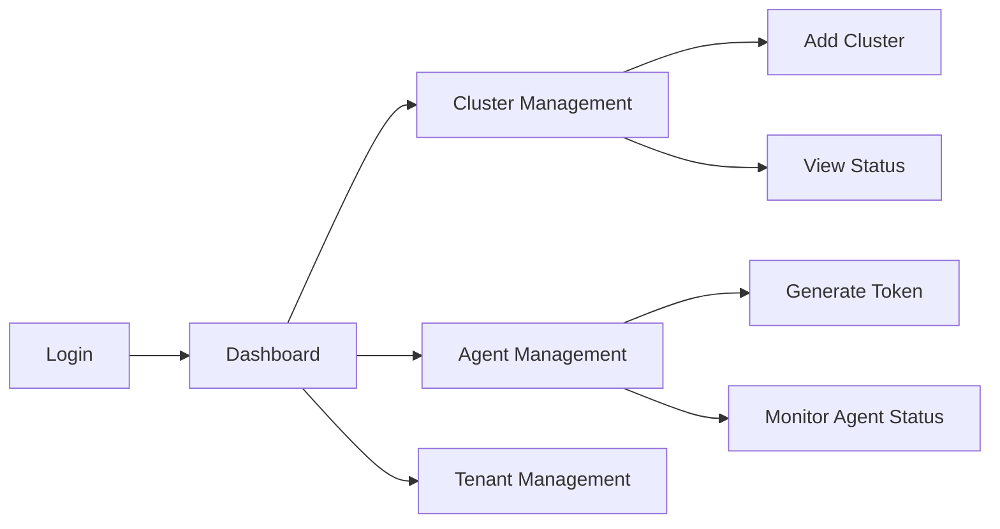
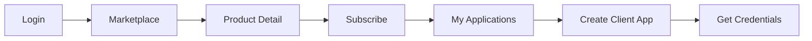
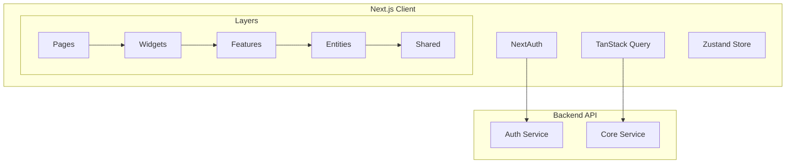
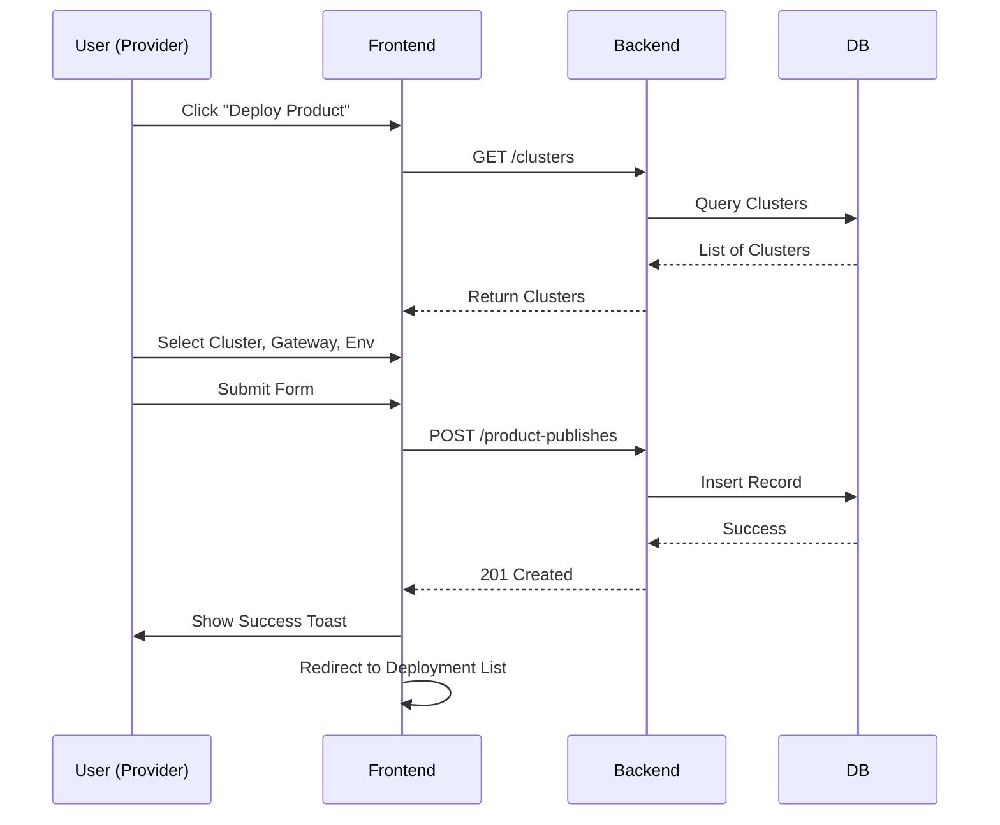

# Frontend Implementation Plan v2 (Gemini 3 Pro)

**Version**: 1.0
**Date**: 2025-11-26
**Author**: Gemini 3 Pro
**Based on**: [Architecture v2](architecture.md), [PRD v2](prd.md)

---

## 1. Overview

This document outlines the implementation plan for the **Imp-Gateway v2 Frontend**. The goal is to build a robust, scalable, and user-friendly interface for three distinct user personas: **Operator**, **Provider**, and **Consumer**.

The project will be implemented in the `web/` directory, adhering to **Feature-Sliced Design (FSD)** principles and utilizing **Next.js 15 App Router**.

### 1.1 Tech Stack

- **Framework**: Next.js 15 (App Router)
- **Language**: TypeScript
- **Styling**: Tailwind CSS, Shadcn/UI
- **State Management**: TanStack Query (Server State), Zustand (Client Global State), React Hook Form (Form State)
- **Authentication**: NextAuth.js (Keycloak OIDC)
- **Icons**: Lucide React
- **Charts**: Recharts (for monitoring/analytics)
- **Diagrams**: Mermaid (for visualization within the app if needed)

---

## 2. Architecture (Feature-Sliced Design)

We will follow the FSD methodology to ensure maintainability and scalability.

### 2.1 Layer Structure

```
web/src/
├── app/                  # App setup (styles, providers, routing)
│   ├── (auth)/           # Auth related routes
│   ├── (dashboard)/      # Protected dashboard routes
│   │   ├── operator/     # Operator specific routes
│   │   ├── provider/     # Provider specific routes
│   │   └── consumer/     # Consumer specific routes
│   └── api/              # Next.js API routes (auth handlers)
│
├── pages/                # Page components (composition of widgets)
│   ├── home/
│   ├── login/
│   ├── provider-dashboard/
│   ├── api-service-list/
│   └── ...
│
├── widgets/              # Big standalone blocks (Sidebar, Header, Tables with filters)
│   ├── sidebar/
│   ├── header/
│   ├── api-service-table/
│   ├── product-publish-form/
│   └── ...
│
├── features/             # Business actions (CreateApiService, DeployProduct)
│   ├── auth/             # Login, Logout
│   ├── api-service/      # Create, Edit, Delete actions
│   ├── product/          # Publish, Withdraw actions
│   └── ...
│
├── entities/             # Business domain models (UI components for data display)
│   ├── user/
│   ├── api-service/      # Cards, Chips, Status badges
│   ├── product/
│   ├── cluster/
│   └── ...
│
└── shared/               # Reusable infrastructure code
    ├── api/              # API client, endpoints
    ├── ui/               # Shadcn UI components (Button, Input, etc.)
    ├── lib/              # Utils, hooks, constants
    └── config/           # Environment variables
```

### 2.2 Routing Strategy (App Router)

We will use Route Groups to separate layouts for different roles:

- `app/(auth)/layout.tsx`: Simple layout for login/register.
- `app/(dashboard)/layout.tsx`: Main dashboard layout with Sidebar and Header.
- `app/(dashboard)/operator/...`: Routes accessible only to users with `operator` role.
- `app/(dashboard)/provider/...`: Routes for `provider` role.
- `app/(dashboard)/consumer/...`: Routes for `consumer` role.

---

## 3. User Flows & Features

### 3.1 Operator (System Admin)

**Goal**: Manage physical infrastructure (Clusters, Agents) and Tenants.

#### User Flow


#### Key Features
1.  **Cluster Management**:
    -   List Clusters (Region, Provider).
    -   Register new Cluster.
2.  **Agent Management**:
    -   Generate Registration Token for new Agents.
    -   Monitor Agent connection status (Connected/Disconnected).
    -   View Agent version and last heartbeat.

### 3.2 Provider (API Owner)

**Goal**: Define APIs, create Products, and Deploy them to Clusters.

#### User Flow
```mermaid
graph LR
    Login --> Dashboard
    Dashboard --> APIServices[API Services]
    Dashboard --> Gateways[Gateway Templates]
    Dashboard --> Products[Products]
    
    APIServices --> CreateAPI[Define API (Route/Backend/Policy)]
    Gateways --> CreateGateway[Define Gateway Template]
    
    Products --> CreateProduct[Create Product]
    CreateProduct --> Publish[Publish Product]
    
    Publish --> SelectCluster[Select Cluster]
    Publish --> SelectGateway[Select Gateway]
    Publish --> Deploy[Deploy]
```

#### Key Features
1.  **API Service Management**:
    -   CRUD API Services.
    -   Manage Routes (Path, Methods), Backends (Endpoints), Policies (RateLimit).
2.  **Gateway Template Management**:
    -   CRUD Gateway Templates.
    -   Configure Listeners (Port, Protocol).
3.  **Product Management**:
    -   Create Products (Name, Version).
    -   Manage Plans (Quotas).
4.  **Product Publishing (Deployment)**:
    -   **Crucial Step**: Create `ProductPublish`.
    -   Select `Cluster` (Physical Target).
    -   Select `Gateway` (Template).
    -   Select `Environment` (Dev/Prod).
    -   Select `AuthMode`.

### 3.3 Consumer (API Customer)

**Goal**: Discover APIs, Subscribe, and Consume.

#### User Flow


#### Key Features
1.  **Marketplace**:
    -   Browse/Search Products.
    -   View API Documentation.
2.  **Subscription**:
    -   Select Plan and Subscribe.
3.  **Credential Management**:
    -   Create Client Apps.
    -   Generate API Keys or OAuth Credentials.

---

## 4. Component Specifications

### 4.1 Shared UI Components (Atomic)
- `Button`, `Input`, `Select`, `Table`, `Dialog`, `Card` (from Shadcn/UI).
- `StatusBadge`: Reusable component to show status (Active, Inactive, Pending) with colors.

### 4.2 Entity Components
- `ClusterCard`: Displays Cluster info (Name, Region, Provider).
- `AgentStatus`: Displays Agent connection status with blinking indicator.
- `ApiServiceRow`: Table row for API Service list.
- `ProductCard`: Card for Marketplace display.

### 4.3 Feature Components (Forms/Actions)
- `CreateClusterForm`: Form with validation (Zod).
- `CreateApiServiceForm`: Complex form with dynamic fields for Routes and Backends.
- `ProductPublishWizard`: Multi-step modal/page for deployment.
    - Step 1: Select Product & Version.
    - Step 2: Select Environment & Cluster.
    - Step 3: Select Gateway Template.
    - Step 4: Review & Deploy.

### 4.4 Widget Components (Page Sections)
- `OperatorSidebar`: Navigation for Operators.
- `ProviderSidebar`: Navigation for Providers.
- `ClusterListTable`: Composed of `ClusterRow` (Entity) and `AddClusterButton` (Feature).
- `DeploymentStatusBoard`: Dashboard widget showing recent deployments and their status.

---

## 5. State Management Strategy

### 5.1 Server State (TanStack Query)
We will use TanStack Query for all asynchronous data fetching.
- **Keys**: Factory pattern (e.g., `apiKeys.services.list(filters)`).
- **Caching**: 5 minutes default stale time.
- **Mutations**: Invalidate queries on success to auto-refresh UI.

### 5.2 Client State
- **URL State**: Filters, Pagination, Sorting will be synced with URL Search Params (using `nuqs` or native hooks) to ensure shareable links.
- **Form State**: `react-hook-form` with `zod` resolvers.
- **Global UI State**: `zustand` for things like Sidebar collapse state, Theme toggle (if not handled by next-themes).

### 5.3 Authentication State
- **NextAuth.js**: Handles session management.
- **Middleware**: Protects routes based on roles in the session token.

---

## 6. API Integration Scenarios

### 6.1 API Client Setup
- Create a custom `axios` instance or `fetch` wrapper in `shared/api`.
- **Interceptors**:
    - **Request**: Attach `Authorization: Bearer <token>` from NextAuth session.
    - **Response**: Handle 401 (Redirect to login), 403 (Forbidden), 500 (Server Error).

### 6.2 Scenario: Deploying a Product (Provider)
1.  **Fetch Data**:
    -   `GET /clusters`: List available clusters.
    -   `GET /gateways`: List available gateway templates.
    -   `GET /api-services`: List available services.
2.  **User Action**: Selects items in `ProductPublishWizard`.
3.  **Mutation**:
    -   `POST /product-publishes` with payload:
        ```json
        {
          "product_id": "...",
          "cluster_id": "...",
          "gateway_id": "...",
          "api_service_ids": ["..."],
          "environment": "prod",
          "auth_mode": "apikey"
        }
        ```
4.  **Optimistic Update**: (Optional) Add to list immediately with "Pending" status.
5.  **On Success**: Invalidate `['product-publishes']` query.
6.  **On Error**: Show Toast notification.

---

## 7. Implementation Roadmap

### Phase 1: Foundation & Operator
- [ ] Setup Next.js, Tailwind, Shadcn.
- [ ] Configure FSD directory structure.
- [ ] Setup NextAuth with Keycloak.
- [ ] Implement Operator Dashboard (Cluster/Agent CRUD).

### Phase 2: Provider Core
- [ ] Implement API Service Management (Complex Forms).
- [ ] Implement Gateway Template Management.
- [ ] Implement Product Management.

### Phase 3: Deployment Flow
- [ ] Implement ProductPublish logic (The core value prop).
- [ ] Connect with Cluster selection.

### Phase 4: Consumer & Marketplace
- [ ] Implement Marketplace UI.
- [ ] Implement Subscription & Credential flows.

---

## 8. Visualizations

### 8.1 Architecture Diagram



### 8.2 Deployment Flow Diagram


