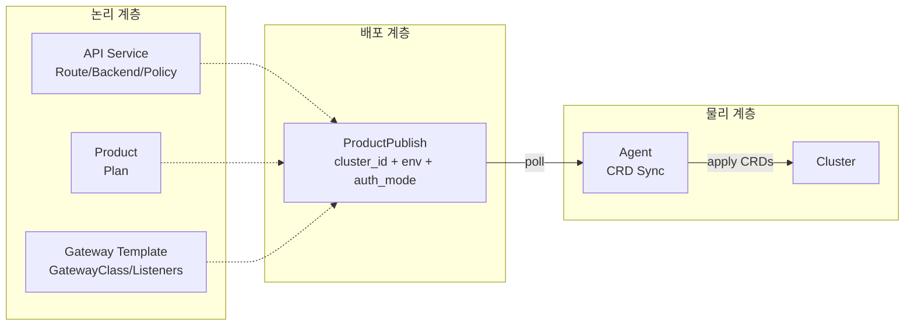
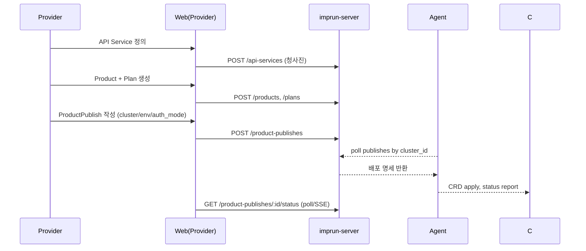
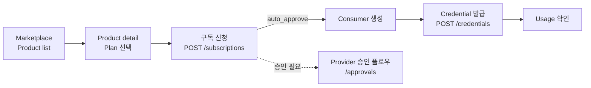
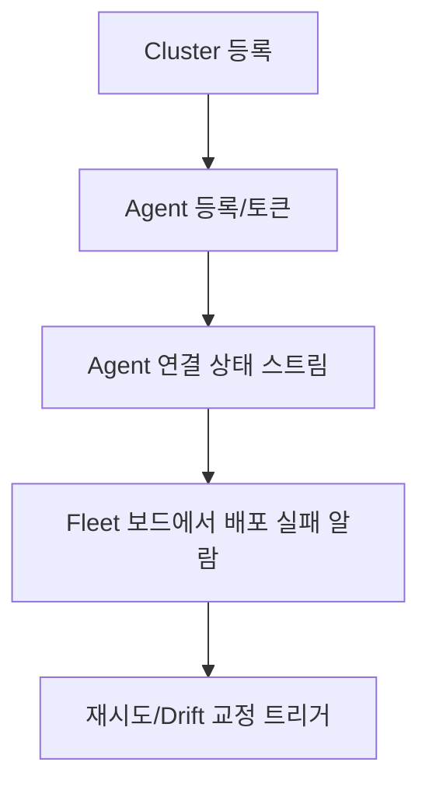

# Imp-Gateway Frontend Plan v2 (GPT-5.1 Codex Max)

- **작성일**: 2025-11-26
- **대상 폴더**: `web/`
- **기반 문서**: `docs/architecture.md`, `docs/prd.md`, `docs/frontend-spec.md`
- **아키텍처 키포인트**: API Service ←독립 청사진, Gateway ←템플릿, ProductPublish ←`cluster_id` 필수 + 환경/인증 + 서비스 묶음

---

## 1) 목표와 범위
- v1 프론트(legacy `frontend/`)를 대체하는 **v2 운영자/제공자/소비자 3포털**을 Next.js App Router + Feature-Sliced Design(FSD)로 `web/`에 구현.
- v2 도메인 변경 반영: API Service는 Gateway와 분리, ProductPublish는 `cluster_id` 포함 배포 단위, 멀티 클러스터/환경 우선.
- UX 일관성: 공통 Shell(Nav/Sidebar/Breadcrumb) + 토폴로지/상태 대시보드 중심. BFF 없이 직접 서버 API 연동(Next server actions/route handlers는 인증 래퍼 정도만 사용).



---

## 2) Feature-Sliced Design + App Router 매핑

```
web/src/
├── app/                    # App Router 진입, 서버 컴포넌트 우선
│   ├── (auth)/             # 로그인/콜백/로그아웃
│   ├── (operator)/...      # 운영자 포털
│   ├── (provider)/...      # API 제공자 포털
│   ├── (consumer)/...      # API 소비자 포털
│   ├── api/                # route handlers (NextAuth, health)
│   ├── layout.tsx
│   └── providers.tsx       # QueryClient, Theme, Auth
├── pages/                  # Page composition (client) - 세부 props 조립
├── widgets/                # Shell/Sidebar/Topbar/Stats/Charts
├── features/               # 유즈케이스 단위 (폼/테이블/업데이트)
├── entities/               # Domain 모델 단위 UI+data (apiService, product...)
├── shared/                 # UI primitives, hooks, api client, lib, config
└── processes/              # Cross-feature 프로세스 (배포 플로우, 가입 플로우)
```

- **서버/클라이언트 분리**: `app/*`는 서버 컴포넌트 기본, 데이터 페칭을 server actions + React Query hydration 패턴으로 구성. Form/상호작용은 client boundary를 최하위로.
- **경로 네임스페이스**: `(operator)`, `(provider)`, `(consumer)` 각 레이아웃에 Shell 적용, 공통 breadcrumb/nav는 widgets에서 주입.
- **도메인별 entity slice**: `entities/api-service`, `entities/product`, `entities/publish`, `entities/cluster`, `entities/agent`, `entities/subscription`, `entities/credential` 등.

---

## 3) 포털별 기능 맵 + 주요 컴포넌트 명세

### 3.1 Operator Portal (SRE)
- **대시보드**: Fleet health, 연결된 Agent/Cluster 수, 최근 배포 실패 카드.
- **Clusters**: 목록/필터(region, provider), 상세(노드/리전/Capabilities), 등록/수정 모달.
- **Agents**: 목록(상태, 버전, 마지막 핑), 상세(연결 로그, 배포 이력).
- **Fleet 모니터링**: ProductPublish 배포 상태 스트림, Drift 경고.
- **Audit/Settings**: 시스템 설정, 테넌트 스위칭, 전역 정책 placeholder.

### 3.2 Provider Portal (API 제공자)
- **API Services**: CRUD, Route/Backend/Policy 탭 편집. Gateway 선택 없음(청사진).
- **Gateways**: 템플릿 CRUD, Listener 설정.
- **Products & Plans**: Product 메타, Plan(레이트/쿼터/스코프) 정의.
- **Product Publishes**: 배포 명세 CRUD - 필수 `cluster_id`, `environment`, `auth_mode`, `api_services[]`, `gateway_id`.
- **Deploy/Sync View**: 배포 상태 모니터링, 재시도/중단 액션.
- **Subscription Requests**: 소비자 구독 승인/거절(Phase 3+).

### 3.3 Consumer Portal (API 소비자)
- **Marketplace**: 공개 Product 탐색/필터/검색, 버전/Plan 비교.
- **Subscription Flow**: Plan 선택 → 구독 신청 → 상태 확인.
- **Client Apps & Consumers**: 앱 생성, Consumer 관리(구독×앱×환경).
- **Credentials**: API Key 발급/회전, OAuth Client 생성/재발급.
- **Usage/Analytics**: 단순 호출/쿼터 뷰(placeholder).

#### 주요 컴포넌트 스펙 (발췌)
- `widgets/shell/Sidebar`: props `{ sections: NavSection[], activePath }`
- `features/clusters/cluster-form`: RHF+Zod, create/update 모드, outputs `ClusterPayload`.
- `features/agents/agent-table`: columns 상태/버전/cluster/lastSeen, row actions inspect/logs.
- `features/api-services/service-editor`: 탭(Overview, Routes, Backends, Policies), `onSave` emits API payloads per section.
- `features/products/publish-form`: selects product, apiServices[], gateway, **cluster**, environment, auth_mode. Validates required v2 fields.
- `features/marketplace/product-card`: shows plans, CTA subscribe; accepts `onSelect(planId)`.
- `features/credentials/key-rotator`: shows active key, rotate action with optimistic UI.

---

## 4) 상태관리 전략
- **데이터 원천**: TanStack Query v5, `apiClient`(fetch wrapper) + typed DTO. Query keys 도메인별 네임스페이스(`["clusters"]`, `["product-publishes", id]`, `["subscriptions", tenantId]`).
- **서버 컴포넌트 선호**: 리스트/상세는 서버에서 prefetch 후 dehydrated state 전달. 클라이언트 상호작용 영역만 boundary 지정.
- **뮤테이션 패턴**: Optimistic update (토글/승인류), invalidate on success for detail-critical 리소스 (`product-publishes`, `credentials`). Error boundary + toast 파이프라인 `shared/lib/notifications`.
- **폼**: React Hook Form + Zod schema 공유(`entities/*/model.ts`). Reusable `FormSection` wrapper for label/description.
- **오프라인/중복 요청 방지**: Query dedupInterval, retry 1-2회, `suspense` 사용 자제(명시적 로딩 스피너).
- **실시간/스트림**: Agent/Fleet 상태는 `EventSource` or WebSocket hook (`shared/lib/realtime`) with fallback polling.

---

## 5) API 연동 상세 시나리오

### 5.1 인증/컨텍스트
- NextAuth(Keycloak OIDC) route handler `app/api/auth/[...nextauth]/route.ts`.
- `getServerSession` → tenant context + `X-Tenant-Slug` 헤더 주입하는 `apiClient`.
- 토큰 만료시: 401 인터셉트 → silent refresh → 실패 시 로그인 리다이렉트.

### 5.2 API Service & Gateway (논리 계층)
- 목록/검색: `GET /api/v1/api-services?query=&status=` → 캐시 `["api-services", filters]`.
- 생성: `POST /api/v1/api-services` (no gateway_id). 성공 시 상세 페이지로 라우트.
- Route/Backend/Policy 업데이트: 탭별 `PATCH /api/v1/api-services/:id/{routes|backends|policies}`.
- Gateway 템플릿: `POST/GET/PATCH /api/v1/gateways`, listeners 배열 밸리데이션.

### 5.3 Product/Plan + ProductPublish (배포 계층)
- Product & Plan: `POST /api/v1/products`, `POST /api/v1/products/:id/plans`.
- ProductPublish 생성:
  - 요청: `POST /api/v1/product-publishes` with `{ product_id, api_service_ids[], gateway_id, cluster_id, environment, auth_mode }`.
  - 후처리: invalidate `["product-publishes"]`, trigger toast “Agent sync pending”.
- 배포 상태 조회: `GET /api/v1/product-publishes/:id/status` (poll 5s) + SSE 채널 `/api/v1/product-publishes/:id/stream` when available.

### 5.4 Cluster/Agent (물리 계층)
- Cluster CRUD: `POST/GET/PATCH /api/v1/clusters`.
- Agent 등록/상태: `POST /api/v1/agents` (registration token), `GET /api/v1/agents/:id`, `GET /api/v1/agents?cluster_id=`.
- Fleet 모니터링: SSE `/api/v1/agents/stream` fallback `GET /api/v1/agents/health`.

### 5.5 구독/Credential (소비 계층, Phase 3)
- Marketplace: `GET /api/v1/products?published=true`.
- 구독 신청: `POST /api/v1/subscriptions` (product_publish_id, plan_id, client_app_id?, auto_approve flag).
- Credential: `POST /api/v1/credentials` (api_key/oauth2), `POST /api/v1/credentials/:id/rotate`.

---

## 6) 사용자 흐름 기반 기능 설명 (Mermaid)

### Provider: API 정의 → 제품화 → 배포


### Consumer: Marketplace → 구독 → Credential


### Operator: 클러스터/에이전트 모니터링


---

## 7) 라우팅/내비게이션 설계
- `(auth)`: `/login`, `/callback`, `/logout`.
- `(operator)`: `/dashboard`, `/clusters`, `/clusters/[id]`, `/agents`, `/agents/[id]`, `/fleet`, `/audit`, `/settings`.
- `(provider)`: `/dashboard`, `/api-services`, `/api-services/[id]/routes`, `/gateways`, `/products/[id]`, `/publishes`, `/publishes/new`, `/subscriptions`(승인).
- `(consumer)`: `/home`, `/marketplace`, `/marketplace/[productId]`, `/subscriptions`, `/subscriptions/[id]`, `/apps`, `/credentials`, `/usage`.
- Breadcrumb/Sidebar는 widgets에서 경로 기반 생성, `RouteConfig` 테이블을 shared/config로 분리.

---

## 8) UX/컴포넌트 가이드
- 공통 Layout: Topbar(tenant switch, user menu) + Sidebar(nav) + Content + Toaster.
- 테이블: shadcn table + column definitions in features; bulk action(삭제/승인) 지원.
- 폼: stepper 스타일(특히 ProductPublish, Credential), 필수값 강조(`cluster_id`, `auth_mode`).
- 상태 표시: Badge for env/status, Health dot for agents/clusters, Skeleton/Empty states 표준화.
- 차트: lightweight(react-charts) for Fleet/Usage, lazy load on viewport.

---

## 9) 품질/보안
- 타입 소스 단일화: `entities/*/model.ts` DTO + zod schema.
- 에러 처리: 전역 API error interceptor → domain-aware 메시지 매핑. 401 → 재인증, 403 → RBAC 안내.
- 접근 제어: 페이지 단위 guard(`withRoleGuard`) — operator/provider/consumer 역할 필터.
- 테스트: critical forms jest+rtl smoke, query key regression 테스트 최소화(노이즈 방지).

---

## 10) 마이그레이션 체크리스트 (v1 → v2)
- API Service 생성/편집에서 `gateway_id` 제거.
- ProductPublish 폼/테이블에 `cluster_id` 필드 추가 및 필수 검증.
- Query keys 및 캐시 재구성: `["publishes"]`에 cluster/env 포함.
- 라우팅: 기존 `frontend/` 경로와 분리 배포(`web/`), 환경 변수 동일하게 재사용.

---

## 11) 작업 우선순위 (Phase 1)
1. Shell/레이아웃 + 인증/프로바이더 세팅 (`app/layout.tsx`, `providers.tsx`, NextAuth).
2. Operator: Cluster/Agent 리스트·상세 + Fleet 보드(MVP).
3. Provider: API Service CRUD(탭 포함) → Gateway 템플릿 → Product/Plan → ProductPublish(필수 필드 포함).
4. Consumer: Marketplace 목록/상세 + Subscription 신청 + Credential 발급(키 회전 포함).
5. Realtime/Polling 스토리: Agent health, Publish status.
6. 빈 상태/에러/로딩 컴포넌트 표준화 후 차트/사용량 뷰 추가.

