# Imp-Gateway Frontend Plan v2 (Claude)

**버전**: 2.0
**작성일**: 2025-11-26
**대상 폴더**: `web/`
**기반 아키텍처**: `docs/architecture.md`, `docs/prd.md`

---

## 1. Executive Summary

### 1.1 프로젝트 개요

Imp-Gateway v2 프론트엔드는 **Feature-Sliced Design (FSD)** 아키텍처와 **Next.js 15 App Router**를 기반으로 세 가지 독립 포털을 구현합니다:

| 포털 | 대상 사용자 | 핵심 기능 |
|------|-------------|-----------|
| **Operator Portal** | SRE/운영자 | Cluster/Agent 관리, Fleet 모니터링, 시스템 설정 |
| **Provider Portal** | API 제공자 | API Service 정의, Product 생성, 배포 관리 |
| **Consumer Portal** | API 소비자 | Marketplace 탐색, 구독, Credential 관리 |

### 1.2 v2 핵심 변경사항

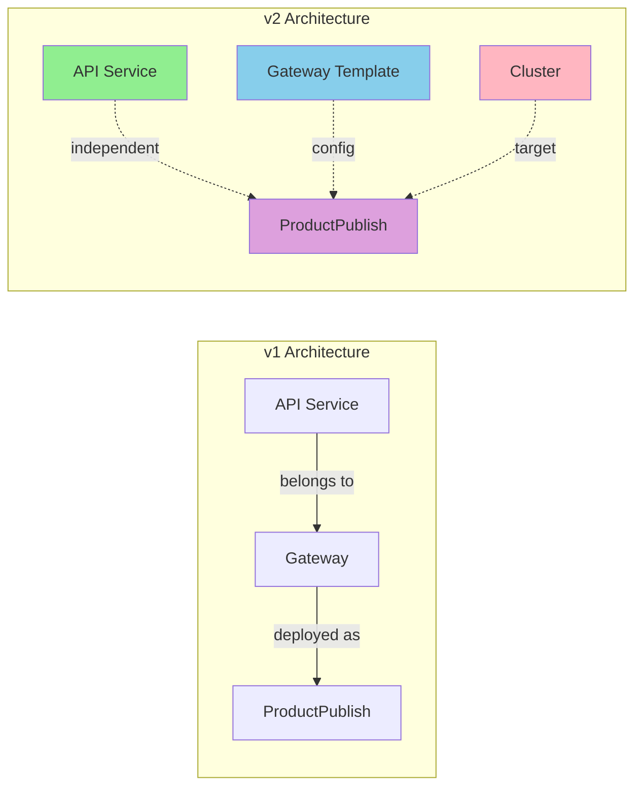

| 항목 | v1 | v2 |
|------|----|----|
| API Service | Gateway에 종속 | **독립적 청사진** |
| Gateway | 배포 타겟 | **설정 템플릿** |
| ProductPublish | cluster_id 없음 | **cluster_id 필수** |
| 멀티 클러스터 | 미지원 | **완전 지원** |

---

## 2. 기술 스택

### 2.1 Core Stack

| 카테고리 | 기술 | 버전 |
|----------|------|------|
| **Framework** | Next.js (App Router) | 15.x |
| **Language** | TypeScript | 5.x |
| **UI Framework** | shadcn/ui | latest |
| **Styling** | Tailwind CSS | 4.x |
| **State Management** | TanStack Query | 5.x |
| **Form** | React Hook Form + Zod | - |
| **Authentication** | NextAuth.js (Keycloak OIDC) | 5.x |
| **Icons** | Lucide React | - |

### 2.2 개발 도구

```bash
# 개발 서버
pnpm dev          # Turbopack (port 3000)

# 빌드
pnpm build        # Production build
pnpm start        # Production server

# 품질 관리
pnpm lint         # ESLint
pnpm format       # Prettier
pnpm type-check   # TypeScript check
```

---

## 3. Feature-Sliced Design 구조

### 3.1 레이어 개요

```
web/src/
├── app/                    # Layer 1: 라우팅, 진입점, 전역 설정
├── pages/                  # Layer 2: 페이지 조립 (Composition)
├── widgets/                # Layer 3: 독립 UI 블록 (Header, Sidebar 등)
├── features/               # Layer 4: 사용자 시나리오/기능 단위
├── entities/               # Layer 5: 비즈니스 도메인 모델
└── shared/                 # Layer 6: 공용 유틸리티, UI 컴포넌트
```

### 3.2 상세 디렉토리 구조

```
web/src/
├── app/
│   ├── (auth)/                      # 인증 라우트 그룹
│   │   ├── sign-in/page.tsx
│   │   ├── sign-out/page.tsx
│   │   └── callback/page.tsx
│   │
│   ├── (operator)/                  # Operator 포털 라우트 그룹
│   │   ├── layout.tsx               # Operator 레이아웃 (Sidebar, Header)
│   │   ├── page.tsx                 # 대시보드
│   │   ├── clusters/
│   │   │   ├── page.tsx             # 클러스터 목록
│   │   │   └── [id]/
│   │   │       ├── page.tsx         # 클러스터 상세
│   │   │       └── agents/page.tsx  # 에이전트 목록
│   │   ├── agents/
│   │   │   ├── page.tsx             # 전체 에이전트 목록
│   │   │   └── [id]/page.tsx        # 에이전트 상세
│   │   ├── fleet/page.tsx           # Fleet 모니터링
│   │   ├── tenants/
│   │   │   ├── page.tsx
│   │   │   └── [id]/page.tsx
│   │   ├── users/page.tsx
│   │   ├── audit/page.tsx
│   │   └── settings/page.tsx
│   │
│   ├── (provider)/                  # Provider 포털 라우트 그룹
│   │   ├── layout.tsx
│   │   ├── page.tsx                 # 대시보드
│   │   ├── api-services/            # API 서비스 관리
│   │   │   ├── page.tsx
│   │   │   ├── new/page.tsx
│   │   │   └── [id]/
│   │   │       ├── page.tsx         # 상세 (개요)
│   │   │       ├── routes/page.tsx
│   │   │       ├── backends/page.tsx
│   │   │       └── policies/page.tsx
│   │   ├── gateways/                # Gateway 템플릿 관리
│   │   │   ├── page.tsx
│   │   │   └── [id]/page.tsx
│   │   ├── products/                # Product 관리
│   │   │   ├── page.tsx
│   │   │   ├── new/page.tsx
│   │   │   └── [id]/
│   │   │       ├── page.tsx
│   │   │       ├── plans/page.tsx
│   │   │       └── publishes/page.tsx
│   │   ├── publishes/               # ProductPublish 관리
│   │   │   ├── page.tsx
│   │   │   ├── new/page.tsx
│   │   │   └── [id]/page.tsx
│   │   ├── subscriptions/page.tsx   # 구독 요청 관리
│   │   └── settings/
│   │       ├── page.tsx
│   │       └── team/page.tsx
│   │
│   ├── (consumer)/                  # Consumer 포털 라우트 그룹
│   │   ├── layout.tsx
│   │   ├── page.tsx                 # 대시보드
│   │   ├── marketplace/
│   │   │   ├── page.tsx             # 제품 탐색
│   │   │   └── [productId]/page.tsx # 제품 상세
│   │   ├── subscriptions/
│   │   │   ├── page.tsx             # 내 구독 목록
│   │   │   └── [id]/page.tsx        # 구독 상세
│   │   ├── apps/
│   │   │   ├── page.tsx             # Client App 관리
│   │   │   └── [id]/page.tsx
│   │   ├── credentials/page.tsx     # Credential 관리
│   │   ├── usage/page.tsx           # 사용량 대시보드
│   │   └── settings/page.tsx
│   │
│   ├── api/                         # API Routes (BFF)
│   │   └── auth/[...nextauth]/route.ts
│   │
│   ├── layout.tsx                   # Root Layout
│   ├── providers.tsx                # Global Providers
│   └── globals.css
│
├── pages/                           # Page Composition Layer
│   ├── operator/
│   │   ├── DashboardPage.tsx
│   │   ├── ClusterListPage.tsx
│   │   ├── ClusterDetailPage.tsx
│   │   └── FleetMonitoringPage.tsx
│   ├── provider/
│   │   ├── DashboardPage.tsx
│   │   ├── APIServiceListPage.tsx
│   │   ├── APIServiceDetailPage.tsx
│   │   ├── ProductListPage.tsx
│   │   ├── ProductDetailPage.tsx
│   │   └── ProductPublishPage.tsx
│   └── consumer/
│       ├── DashboardPage.tsx
│       ├── MarketplacePage.tsx
│       ├── ProductDetailPage.tsx
│       └── SubscriptionDetailPage.tsx
│
├── widgets/
│   ├── layout/
│   │   ├── OperatorSidebar.tsx
│   │   ├── ProviderSidebar.tsx
│   │   ├── ConsumerSidebar.tsx
│   │   ├── Header.tsx
│   │   ├── UserMenu.tsx
│   │   └── TenantSwitcher.tsx
│   ├── cluster-map/
│   │   ├── ClusterWorldMap.tsx
│   │   └── ClusterStatusGrid.tsx
│   ├── product-publish-wizard/
│   │   ├── ProductPublishWizard.tsx
│   │   ├── steps/
│   │   │   ├── ClusterSelectStep.tsx
│   │   │   ├── GatewaySelectStep.tsx
│   │   │   ├── ServiceSelectStep.tsx
│   │   │   ├── AuthConfigStep.tsx
│   │   │   └── ReviewStep.tsx
│   │   └── hooks/usePublishWizard.ts
│   ├── api-service-editor/
│   │   ├── APIServiceEditor.tsx
│   │   ├── RouteEditor.tsx
│   │   ├── BackendEditor.tsx
│   │   └── PolicyEditor.tsx
│   └── deployment-timeline/
│       └── DeploymentTimeline.tsx
│
├── features/
│   ├── auth/
│   │   ├── api/authApi.ts
│   │   ├── hooks/useAuth.ts
│   │   ├── components/
│   │   │   ├── LoginForm.tsx
│   │   │   └── ProtectedRoute.tsx
│   │   └── stores/authStore.ts
│   │
│   ├── cluster-management/
│   │   ├── api/clusterApi.ts
│   │   ├── hooks/
│   │   │   ├── useClusters.ts
│   │   │   ├── useCluster.ts
│   │   │   ├── useCreateCluster.ts
│   │   │   └── useAgents.ts
│   │   ├── components/
│   │   │   ├── ClusterList.tsx
│   │   │   ├── ClusterCard.tsx
│   │   │   ├── ClusterCreateDialog.tsx
│   │   │   ├── AgentList.tsx
│   │   │   ├── AgentStatusBadge.tsx
│   │   │   └── RegistrationTokenDialog.tsx
│   │   └── types.ts
│   │
│   ├── api-service-management/
│   │   ├── api/apiServiceApi.ts
│   │   ├── hooks/
│   │   │   ├── useAPIServices.ts
│   │   │   ├── useAPIService.ts
│   │   │   ├── useCreateAPIService.ts
│   │   │   ├── useRoutes.ts
│   │   │   ├── useBackends.ts
│   │   │   └── usePolicies.ts
│   │   ├── components/
│   │   │   ├── APIServiceList.tsx
│   │   │   ├── APIServiceCard.tsx
│   │   │   ├── APIServiceCreateDialog.tsx
│   │   │   ├── RouteList.tsx
│   │   │   ├── RouteCreateForm.tsx
│   │   │   ├── BackendList.tsx
│   │   │   ├── BackendCreateForm.tsx
│   │   │   ├── PolicyList.tsx
│   │   │   └── PolicyCreateForm.tsx
│   │   └── types.ts
│   │
│   ├── gateway-management/
│   │   ├── api/gatewayApi.ts
│   │   ├── hooks/
│   │   │   ├── useGateways.ts
│   │   │   └── useGateway.ts
│   │   ├── components/
│   │   │   ├── GatewayList.tsx
│   │   │   ├── GatewayCard.tsx
│   │   │   ├── GatewayCreateDialog.tsx
│   │   │   └── ListenerEditor.tsx
│   │   └── types.ts
│   │
│   ├── product-management/
│   │   ├── api/productApi.ts
│   │   ├── hooks/
│   │   │   ├── useProducts.ts
│   │   │   ├── useProduct.ts
│   │   │   ├── usePlans.ts
│   │   │   └── useProductPublishes.ts
│   │   ├── components/
│   │   │   ├── ProductList.tsx
│   │   │   ├── ProductCard.tsx
│   │   │   ├── ProductCreateDialog.tsx
│   │   │   ├── PlanList.tsx
│   │   │   ├── PlanCreateForm.tsx
│   │   │   ├── ProductPublishList.tsx
│   │   │   └── ProductPublishStatusBadge.tsx
│   │   └── types.ts
│   │
│   ├── subscription-management/
│   │   ├── api/subscriptionApi.ts
│   │   ├── hooks/
│   │   │   ├── useSubscriptions.ts
│   │   │   ├── useSubscription.ts
│   │   │   └── useApproveSubscription.ts
│   │   ├── components/
│   │   │   ├── SubscriptionList.tsx
│   │   │   ├── SubscriptionCard.tsx
│   │   │   ├── SubscriptionApprovalDialog.tsx
│   │   │   └── SubscriptionStatusBadge.tsx
│   │   └── types.ts
│   │
│   ├── credential-management/
│   │   ├── api/credentialApi.ts
│   │   ├── hooks/
│   │   │   ├── useCredentials.ts
│   │   │   └── useCreateCredential.ts
│   │   ├── components/
│   │   │   ├── CredentialList.tsx
│   │   │   ├── CredentialCreateDialog.tsx
│   │   │   └── APIKeyDisplay.tsx
│   │   └── types.ts
│   │
│   └── marketplace/
│       ├── api/marketplaceApi.ts
│       ├── hooks/
│       │   ├── useMarketplaceProducts.ts
│       │   └── useSubscribeProduct.ts
│       ├── components/
│       │   ├── ProductGrid.tsx
│       │   ├── ProductSearchFilter.tsx
│       │   ├── ProductDetailView.tsx
│       │   ├── PlanComparisonTable.tsx
│       │   └── SubscribeDialog.tsx
│       └── types.ts
│
├── entities/
│   ├── cluster/
│   │   ├── model.ts                 # Cluster, Agent 타입 정의
│   │   ├── api.ts                   # API 호출 함수
│   │   └── lib.ts                   # 유틸리티 함수
│   ├── api-service/
│   │   ├── model.ts                 # APIService, Route, Backend, Policy 타입
│   │   ├── api.ts
│   │   └── lib.ts
│   ├── gateway/
│   │   ├── model.ts                 # Gateway, Listener 타입
│   │   ├── api.ts
│   │   └── lib.ts
│   ├── product/
│   │   ├── model.ts                 # Product, Plan, ProductPublish 타입
│   │   ├── api.ts
│   │   └── lib.ts
│   ├── subscription/
│   │   ├── model.ts                 # Subscription, Consumer, Credential 타입
│   │   ├── api.ts
│   │   └── lib.ts
│   ├── tenant/
│   │   ├── model.ts                 # Tenant, User 타입
│   │   ├── api.ts
│   │   └── lib.ts
│   └── customer/
│       ├── model.ts                 # Customer, ClientApp 타입
│       ├── api.ts
│       └── lib.ts
│
└── shared/
    ├── api/
    │   ├── client.ts                # Axios 인스턴스
    │   ├── interceptors.ts          # 인터셉터 (Auth, Error)
    │   └── types.ts                 # 공통 API 타입 (Page, Error)
    ├── ui/                          # shadcn/ui 컴포넌트
    │   ├── button.tsx
    │   ├── card.tsx
    │   ├── dialog.tsx
    │   ├── form.tsx
    │   ├── input.tsx
    │   ├── select.tsx
    │   ├── table.tsx
    │   ├── tabs.tsx
    │   ├── badge.tsx
    │   ├── skeleton.tsx
    │   ├── toast.tsx
    │   └── ...
    ├── lib/
    │   ├── utils.ts                 # cn(), formatDate() 등
    │   ├── constants.ts             # 상수
    │   └── validators.ts            # Zod 스키마
    └── config/
        └── env.ts                   # 환경 변수
```

### 3.3 레이어 간 의존성 규칙

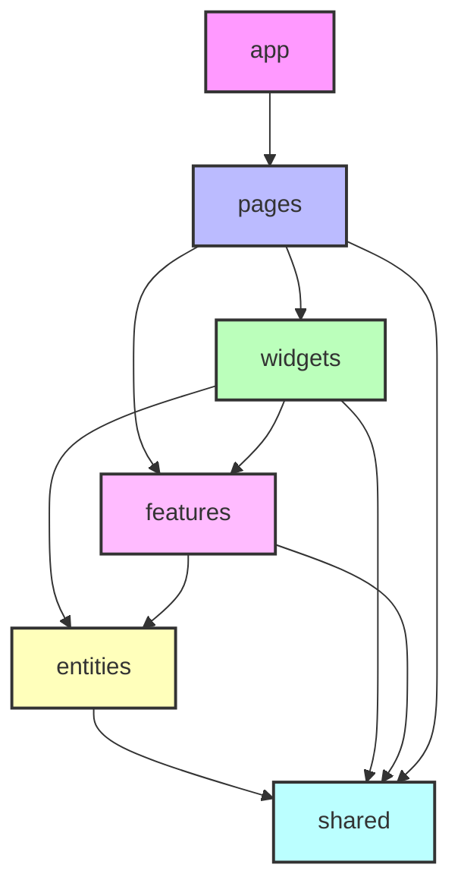

**규칙**:
- 상위 레이어는 하위 레이어만 import 가능
- 같은 레이어 내에서는 slice 간 import 금지
- `shared`는 모든 레이어에서 import 가능

---

## 4. 상태 관리 전략

### 4.1 상태 분류

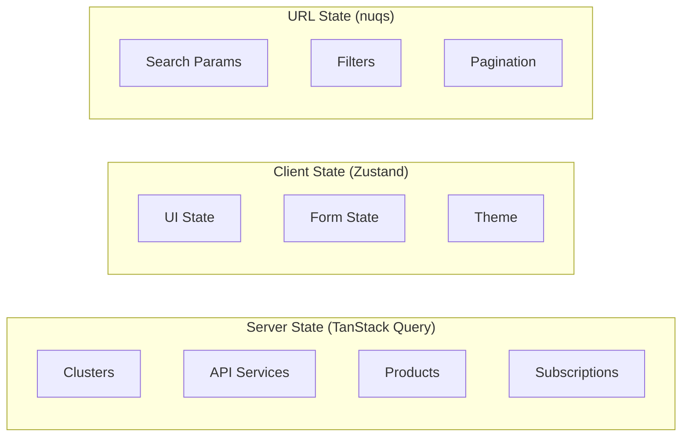

| 상태 유형 | 관리 도구 | 예시 |
|-----------|----------|------|
| **Server State** | TanStack Query | API 데이터, 캐시 |
| **Client State** | Zustand | UI 토글, 모달 상태 |
| **Form State** | React Hook Form | 폼 입력값, 검증 |
| **URL State** | nuqs | 검색, 필터, 페이지네이션 |

### 4.2 Query Key 설계

```typescript
// entities/*/api.ts 에서 정의
export const clusterKeys = {
  all: ['clusters'] as const,
  lists: () => [...clusterKeys.all, 'list'] as const,
  list: (filters: ClusterFilters) => [...clusterKeys.lists(), filters] as const,
  details: () => [...clusterKeys.all, 'detail'] as const,
  detail: (id: string) => [...clusterKeys.details(), id] as const,
  agents: (clusterId: string) => [...clusterKeys.detail(clusterId), 'agents'] as const,
};

export const apiServiceKeys = {
  all: ['api-services'] as const,
  lists: () => [...apiServiceKeys.all, 'list'] as const,
  list: (filters: APIServiceFilters) => [...apiServiceKeys.lists(), filters] as const,
  details: () => [...apiServiceKeys.all, 'detail'] as const,
  detail: (id: string) => [...apiServiceKeys.details(), id] as const,
  routes: (serviceId: string) => [...apiServiceKeys.detail(serviceId), 'routes'] as const,
  backends: (serviceId: string) => [...apiServiceKeys.detail(serviceId), 'backends'] as const,
  policies: (serviceId: string) => [...apiServiceKeys.detail(serviceId), 'policies'] as const,
};

export const productKeys = {
  all: ['products'] as const,
  lists: () => [...productKeys.all, 'list'] as const,
  list: (filters: ProductFilters) => [...productKeys.lists(), filters] as const,
  details: () => [...productKeys.all, 'detail'] as const,
  detail: (id: string) => [...productKeys.details(), id] as const,
  plans: (productId: string) => [...productKeys.detail(productId), 'plans'] as const,
  publishes: (productId: string) => [...productKeys.detail(productId), 'publishes'] as const,
};

export const productPublishKeys = {
  all: ['product-publishes'] as const,
  lists: () => [...productPublishKeys.all, 'list'] as const,
  list: (filters: ProductPublishFilters) => [...productPublishKeys.lists(), filters] as const,
  detail: (id: string) => [...productPublishKeys.all, 'detail', id] as const,
  byCluster: (clusterId: string) => [...productPublishKeys.all, 'cluster', clusterId] as const,
  byProduct: (productId: string) => [...productPublishKeys.all, 'product', productId] as const,
};
```

### 4.3 Mutation 및 캐시 무효화 전략

```typescript
// features/product-management/hooks/useCreateProductPublish.ts
export function useCreateProductPublish() {
  const queryClient = useQueryClient();

  return useMutation({
    mutationFn: (data: CreateProductPublishRequest) =>
      productApi.createProductPublish(data),

    onSuccess: (newPublish) => {
      // 관련 쿼리들 무효화
      queryClient.invalidateQueries({ queryKey: productPublishKeys.all });
      queryClient.invalidateQueries({
        queryKey: productKeys.publishes(newPublish.product_id)
      });

      // 낙관적 업데이트: 목록에 즉시 추가
      queryClient.setQueryData(
        productPublishKeys.detail(newPublish.id),
        newPublish
      );

      toast.success('배포가 생성되었습니다');
    },

    onError: (error) => {
      toast.error('배포 생성 실패: ' + error.message);
    },
  });
}
```

### 4.4 Zustand Store 설계

```typescript
// shared/stores/uiStore.ts
import { create } from 'zustand';
import { persist } from 'zustand/middleware';

interface UIState {
  // Sidebar
  sidebarOpen: boolean;
  toggleSidebar: () => void;

  // Theme
  theme: 'light' | 'dark' | 'system';
  setTheme: (theme: 'light' | 'dark' | 'system') => void;

  // Active Tenant
  activeTenantId: string | null;
  setActiveTenant: (tenantId: string) => void;
}

export const useUIStore = create<UIState>()(
  persist(
    (set) => ({
      sidebarOpen: true,
      toggleSidebar: () => set((state) => ({ sidebarOpen: !state.sidebarOpen })),

      theme: 'system',
      setTheme: (theme) => set({ theme }),

      activeTenantId: null,
      setActiveTenant: (tenantId) => set({ activeTenantId: tenantId }),
    }),
    { name: 'imp-gateway-ui' }
  )
);
```

---

## 5. 컴포넌트 상세 명세

### 5.1 Shared UI 컴포넌트

#### StatusBadge

상태를 시각적으로 표현하는 범용 Badge 컴포넌트

```typescript
// shared/ui/status-badge.tsx
interface StatusBadgeProps {
  status: 'success' | 'warning' | 'error' | 'info' | 'neutral';
  label: string;
  pulse?: boolean;  // 실시간 상태 표시
}

const statusStyles = {
  success: 'bg-green-100 text-green-800 dark:bg-green-900 dark:text-green-300',
  warning: 'bg-yellow-100 text-yellow-800 dark:bg-yellow-900 dark:text-yellow-300',
  error: 'bg-red-100 text-red-800 dark:bg-red-900 dark:text-red-300',
  info: 'bg-blue-100 text-blue-800 dark:bg-blue-900 dark:text-blue-300',
  neutral: 'bg-gray-100 text-gray-800 dark:bg-gray-800 dark:text-gray-300',
};
```

#### DataTable

서버 사이드 페이지네이션/정렬/필터를 지원하는 테이블

```typescript
// shared/ui/data-table.tsx
interface DataTableProps<T> {
  columns: ColumnDef<T>[];
  data: T[];

  // Pagination
  pageCount: number;
  pageIndex: number;
  pageSize: number;
  onPaginationChange: (pagination: PaginationState) => void;

  // Sorting
  sorting?: SortingState;
  onSortingChange?: (sorting: SortingState) => void;

  // Selection
  rowSelection?: RowSelectionState;
  onRowSelectionChange?: (selection: RowSelectionState) => void;

  // Loading
  isLoading?: boolean;

  // Empty state
  emptyMessage?: string;
}
```

### 5.2 Entity 컴포넌트

#### ClusterCard

클러스터 정보를 카드 형태로 표시

```typescript
// entities/cluster/ui/ClusterCard.tsx
interface ClusterCardProps {
  cluster: Cluster;
  onSelect?: (cluster: Cluster) => void;
  selected?: boolean;
}

// 표시 정보:
// - 이름, 리전
// - 클라우드 프로바이더 아이콘 (AWS/GCP/Azure/On-premise)
// - 연결된 Agent 수
// - 상태 (Online/Offline)
// - 최근 동기화 시간
```

#### APIServiceCard

API 서비스 요약 정보 카드

```typescript
// entities/api-service/ui/APIServiceCard.tsx
interface APIServiceCardProps {
  apiService: APIService;
  onClick?: () => void;
}

// 표시 정보:
// - 이름, 버전
// - 상태 (active/inactive/draft)
// - Route 수
// - Backend 수
// - Policy 수
// - 마지막 수정 시간
```

#### ProductPublishStatusBadge

ProductPublish 상태를 표시하는 Badge

```typescript
// entities/product/ui/ProductPublishStatusBadge.tsx
type ProductPublishStatus = 'DRAFT' | 'PUBLISHING' | 'PUBLISHED' | 'WITHDRAWN' | 'FAILED';

const statusConfig: Record<ProductPublishStatus, StatusConfig> = {
  DRAFT: { label: '초안', status: 'neutral', icon: PencilIcon },
  PUBLISHING: { label: '배포 중', status: 'info', pulse: true, icon: RefreshIcon },
  PUBLISHED: { label: '배포됨', status: 'success', icon: CheckIcon },
  WITHDRAWN: { label: '철회됨', status: 'warning', icon: XIcon },
  FAILED: { label: '실패', status: 'error', icon: AlertIcon },
};
```

### 5.3 Feature 컴포넌트

#### ClusterCreateDialog

새 클러스터 등록 다이얼로그

```typescript
// features/cluster-management/components/ClusterCreateDialog.tsx
interface ClusterCreateDialogProps {
  open: boolean;
  onOpenChange: (open: boolean) => void;
  onSuccess?: (cluster: Cluster) => void;
}

// Form Fields:
const clusterCreateSchema = z.object({
  name: z.string().min(1).max(100).regex(/^[a-z0-9-]+$/),
  region: z.string().min(1),
  cloud_provider: z.enum(['aws', 'gcp', 'azure', 'on-premise']),
  k8s_version: z.string().optional(),
  capabilities: z.object({
    envoy_gateway: z.boolean().default(true),
    nginx: z.boolean().default(false),
  }).optional(),
});
```

#### APIServiceCreateDialog

API 서비스 생성 다이얼로그 (v2: Gateway 선택 없음)

```typescript
// features/api-service-management/components/APIServiceCreateDialog.tsx
interface APIServiceCreateDialogProps {
  open: boolean;
  onOpenChange: (open: boolean) => void;
  onSuccess?: (apiService: APIService) => void;
}

// v2 변경: gateway_id 필드 제거
const apiServiceCreateSchema = z.object({
  name: z.string().min(1).max(255),
  version: z.string().optional(),
  description: z.string().optional(),
  labels: z.record(z.string()).optional(),
});
```

### 5.4 Widget 컴포넌트

#### ProductPublishWizard

제품 배포 마법사 (v2 핵심 컴포넌트)

```typescript
// widgets/product-publish-wizard/ProductPublishWizard.tsx
interface ProductPublishWizardProps {
  productId: string;
  onComplete?: (publish: ProductPublish) => void;
  onCancel?: () => void;
}

type WizardStep =
  | 'cluster'      // 1. 클러스터 선택 (필수)
  | 'gateway'      // 2. Gateway 템플릿 선택
  | 'services'     // 3. API Service 선택
  | 'auth'         // 4. 인증 설정
  | 'review';      // 5. 검토 및 확인

interface WizardState {
  currentStep: WizardStep;
  data: {
    cluster_id: string | null;
    gateway_id: string | null;
    api_services: string[];
    environment: 'dev' | 'staging' | 'prod';
    auth_mode: 'none' | 'apikey' | 'oauth2';
    auth_config?: Record<string, unknown>;
  };
}
```

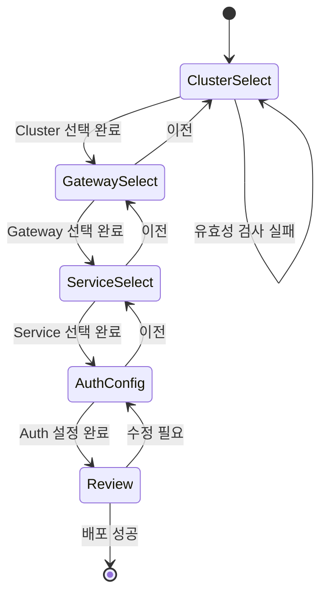

#### ClusterWorldMap

클러스터 위치를 세계 지도에 표시

```typescript
// widgets/cluster-map/ClusterWorldMap.tsx
interface ClusterWorldMapProps {
  clusters: Cluster[];
  onClusterClick?: (cluster: Cluster) => void;
  highlightedClusterId?: string;
}

// 기능:
// - 지역별 클러스터 마커 표시
// - 마커 색상으로 상태 표시 (green: 정상, yellow: 경고, red: 오류)
// - 호버 시 클러스터 정보 툴팁
// - 클릭 시 상세 정보 패널
```

---

## 6. API 연동 상세 시나리오

### 6.1 API 클라이언트 설정

```typescript
// shared/api/client.ts
import axios from 'axios';
import { getSession } from 'next-auth/react';

const API_BASE_URL = process.env.NEXT_PUBLIC_API_BASE;

export const apiClient = axios.create({
  baseURL: API_BASE_URL,
  timeout: 30000,
  headers: {
    'Content-Type': 'application/json',
  },
});

// 인증 인터셉터
apiClient.interceptors.request.use(async (config) => {
  const session = await getSession();
  if (session?.accessToken) {
    config.headers.Authorization = `Bearer ${session.accessToken}`;
  }

  // 테넌트 헤더 추가
  const tenantSlug = getActiveTenantSlug();
  if (tenantSlug) {
    config.headers['X-Tenant-Slug'] = tenantSlug;
  }

  return config;
});

// 에러 인터셉터
apiClient.interceptors.response.use(
  (response) => response,
  (error) => {
    if (error.response?.status === 401) {
      // 인증 만료 처리
      signOut({ redirect: true, callbackUrl: '/sign-in' });
    }

    if (error.response?.status === 403) {
      toast.error('권한이 없습니다');
    }

    return Promise.reject(error);
  }
);
```

### 6.2 시나리오: 클러스터 등록 및 Agent 토큰 발급

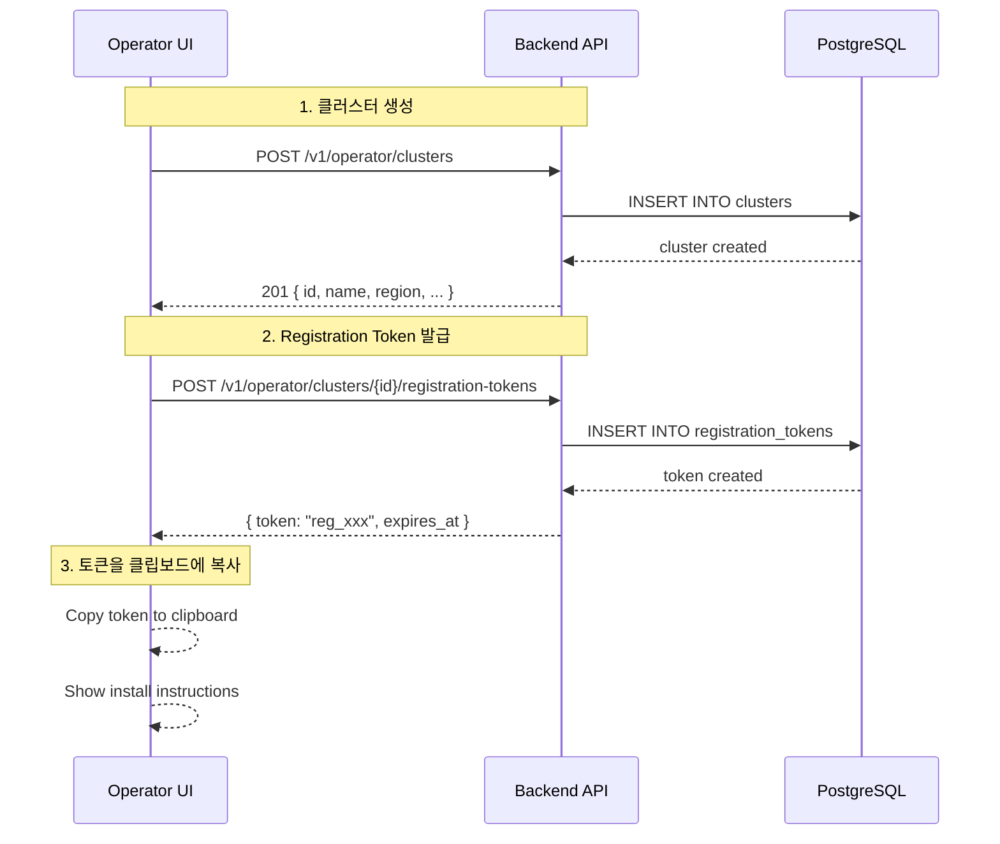

```typescript
// features/cluster-management/api/clusterApi.ts
export const clusterApi = {
  // 클러스터 목록 조회
  getClusters: async (params?: ClusterFilters): Promise<PagedResponse<Cluster>> => {
    const { data } = await apiClient.get('/v1/operator/clusters', { params });
    return data;
  },

  // 클러스터 생성
  createCluster: async (data: CreateClusterRequest): Promise<Cluster> => {
    const { data: cluster } = await apiClient.post('/v1/operator/clusters', data);
    return cluster;
  },

  // Registration Token 발급
  createRegistrationToken: async (
    clusterId: string,
    expiresIn: number = 3600
  ): Promise<RegistrationToken> => {
    const { data } = await apiClient.post(
      `/v1/operator/clusters/${clusterId}/registration-tokens`,
      { expires_in: expiresIn }
    );
    return data;
  },

  // 에이전트 목록 조회
  getAgents: async (clusterId: string): Promise<Agent[]> => {
    const { data } = await apiClient.get(
      `/v1/operator/clusters/${clusterId}/agents`
    );
    return data;
  },
};
```

### 6.3 시나리오: API Service 생성 및 Route/Backend 설정

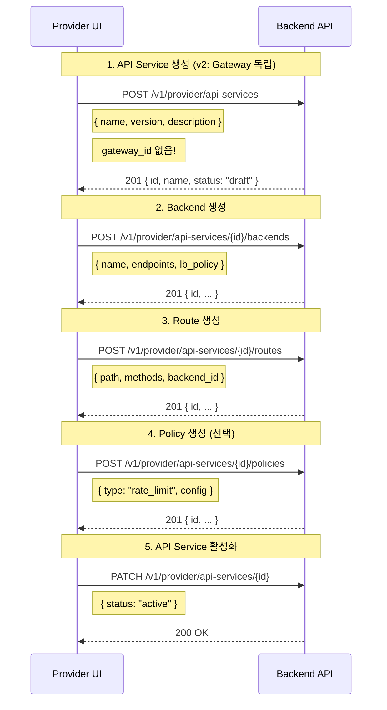

### 6.4 시나리오: Product 배포 (ProductPublish 생성)

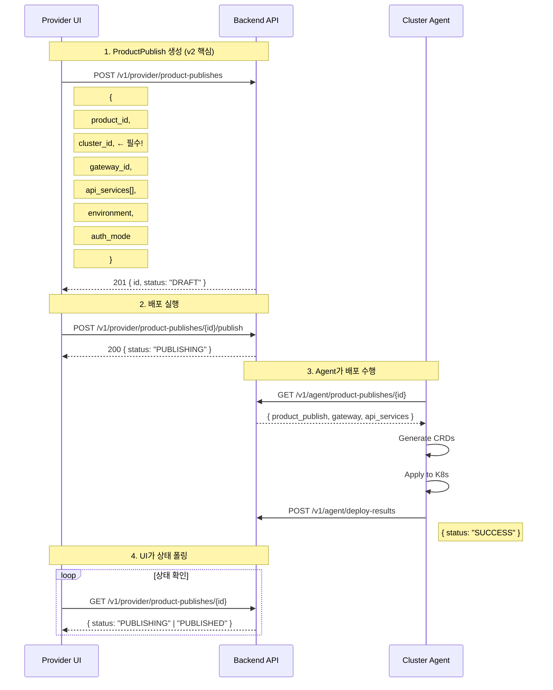

```typescript
// features/product-management/api/productApi.ts
export const productApi = {
  // ProductPublish 생성
  createProductPublish: async (
    data: CreateProductPublishRequest
  ): Promise<ProductPublish> => {
    // v2: cluster_id 필수
    if (!data.cluster_id) {
      throw new Error('cluster_id is required');
    }

    const { data: publish } = await apiClient.post(
      '/v1/provider/product-publishes',
      data
    );
    return publish;
  },

  // 배포 실행
  publishProduct: async (publishId: string): Promise<ProductPublish> => {
    const { data } = await apiClient.post(
      `/v1/provider/product-publishes/${publishId}/publish`
    );
    return data;
  },

  // 배포 철회
  withdrawProduct: async (publishId: string): Promise<ProductPublish> => {
    const { data } = await apiClient.post(
      `/v1/provider/product-publishes/${publishId}/withdraw`
    );
    return data;
  },

  // 상태 조회 (폴링용)
  getProductPublish: async (publishId: string): Promise<ProductPublish> => {
    const { data } = await apiClient.get(
      `/v1/provider/product-publishes/${publishId}`
    );
    return data;
  },
};
```

### 6.5 시나리오: Marketplace 구독 및 Credential 발급

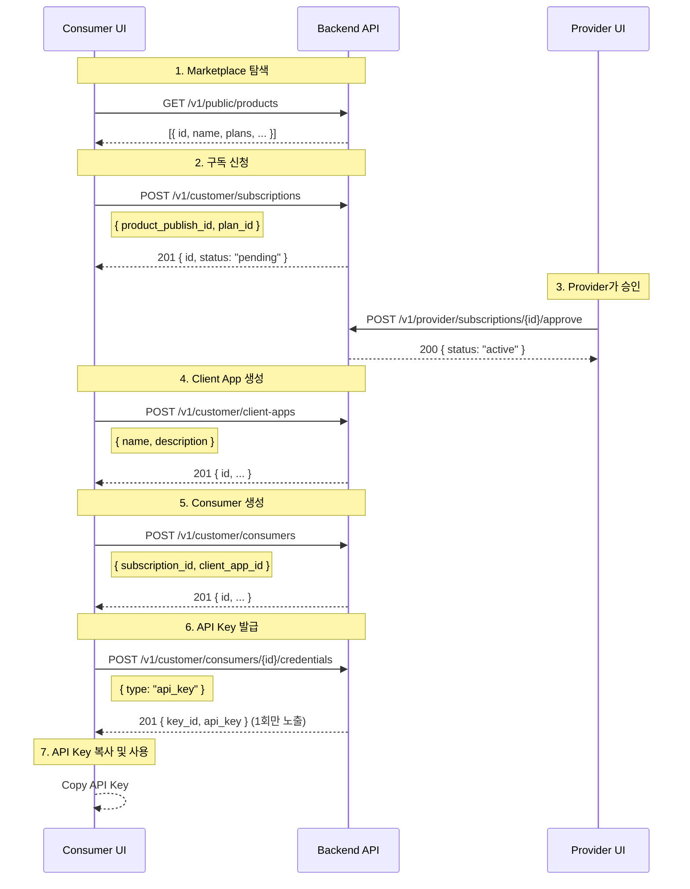

---

## 7. 사용자 흐름 (User Flows)

### 7.1 Operator: 클러스터 등록 및 Agent 연결

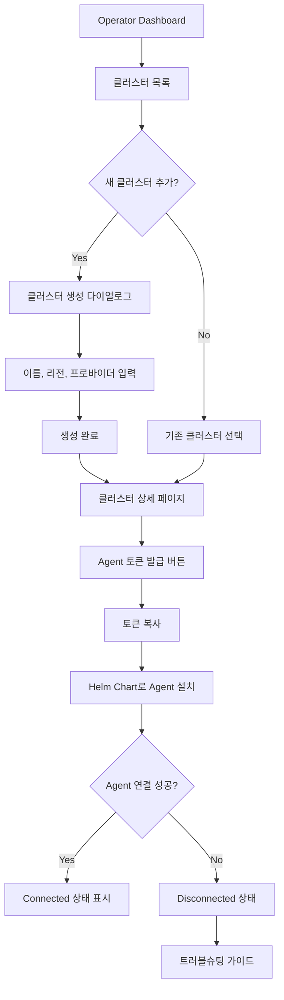

**화면 흐름**:

1. **클러스터 목록 페이지** (`/operator/clusters`)
   - 카드 그리드 또는 테이블 뷰
   - 각 클러스터의 상태, Agent 수, 리전 표시
   - "새 클러스터 추가" 버튼

2. **클러스터 생성 다이얼로그**
   - 이름 (slug 형식): `kr-seoul-prod`
   - 리전 선택: `ap-northeast-2`
   - 클라우드 프로바이더: AWS/GCP/Azure/On-premise
   - 생성 완료 후 상세 페이지로 이동

3. **클러스터 상세 페이지** (`/operator/clusters/{id}`)
   - 클러스터 기본 정보
   - Agent 목록 및 상태
   - Registration Token 발급 카드
   - 이 클러스터로 배포된 ProductPublish 목록

### 7.2 Provider: API 정의 → 제품화 → 배포

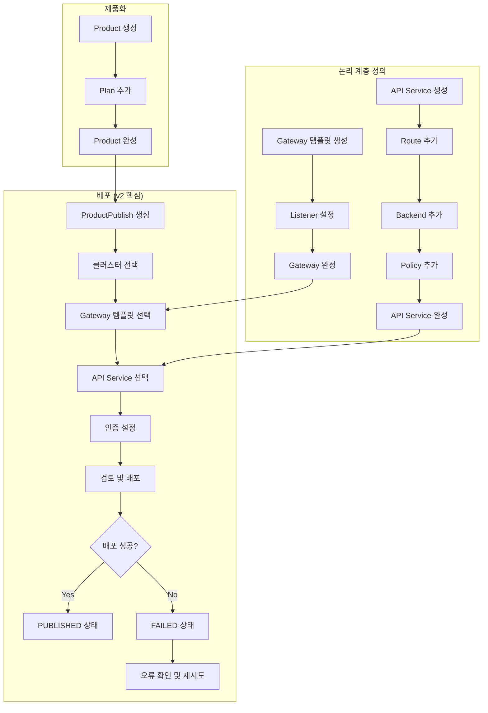

**화면 흐름**:

1. **API Service 목록** (`/provider/api-services`)
   - v2 변경: Gateway 컬럼 제거
   - 필터: 상태, 검색
   - "새 API Service 생성" 버튼

2. **API Service 상세** (`/provider/api-services/{id}`)
   - 탭: Overview / Routes / Backends / Policies
   - 각 탭에서 CRUD 수행
   - v2 변경: Gateway 정보 표시 없음 (독립적)

3. **Product 생성 및 관리** (`/provider/products`)
   - Product 카탈로그 정보 관리
   - Plan 설정 (요금, 쿼터)
   - 배포 현황 (ProductPublish 목록)

4. **ProductPublish 생성** (`/provider/publishes/new`)
   - **Step-by-step 마법사** 형태
   - v2 핵심: 클러스터 선택이 첫 번째 단계

### 7.3 Consumer: 제품 탐색 → 구독 → API 사용

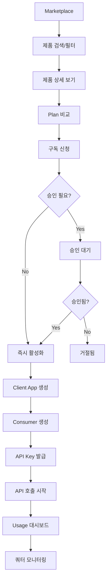

**화면 흐름**:

1. **Marketplace** (`/consumer/marketplace`)
   - 제품 그리드 (카드 형태)
   - 카테고리, 태그 필터
   - 검색

2. **제품 상세** (`/consumer/marketplace/{productId}`)
   - 제품 설명, 문서
   - Plan 비교 테이블
   - 구독 버튼

3. **내 구독** (`/consumer/subscriptions`)
   - 활성 구독 목록
   - 구독별 사용량
   - Credential 관리

4. **Credential 관리** (`/consumer/credentials`)
   - API Key 목록
   - 새 Key 발급
   - Key 비활성화/삭제

---

## 8. 인증 및 권한 관리

### 8.1 NextAuth.js 설정 (Keycloak OIDC)

```typescript
// app/api/auth/[...nextauth]/route.ts
import NextAuth from 'next-auth';
import KeycloakProvider from 'next-auth/providers/keycloak';

const handler = NextAuth({
  providers: [
    KeycloakProvider({
      clientId: process.env.KC_CLIENT_ID!,
      clientSecret: process.env.KC_CLIENT_SECRET!,
      issuer: process.env.KC_ISSUER,
    }),
  ],

  callbacks: {
    async jwt({ token, account, profile }) {
      if (account) {
        token.accessToken = account.access_token;
        token.refreshToken = account.refresh_token;
        token.expiresAt = account.expires_at;
        token.tenantSlugs = (profile as any).tenant_slugs || [];
        token.roles = (profile as any).realm_access?.roles || [];
      }
      return token;
    },

    async session({ session, token }) {
      session.accessToken = token.accessToken as string;
      session.user.tenantSlugs = token.tenantSlugs as string[];
      session.user.roles = token.roles as string[];
      return session;
    },
  },

  pages: {
    signIn: '/sign-in',
    error: '/auth/error',
  },
});

export { handler as GET, handler as POST };
```

### 8.2 역할별 접근 제어

```typescript
// shared/lib/rbac.ts
export const ROLES = {
  SYSTEM_ADMIN: 'system-admin',
  ORG_ADMIN: 'org-admin',
  GATEWAY_OWNER: 'gateway-owner',
  API_DEVELOPER: 'api-developer',
  BUSINESS_MANAGER: 'business-manager',
  CUSTOMER_ADMIN: 'customer-admin',
  API_CONSUMER: 'api-consumer',
} as const;

export const PERMISSIONS = {
  // Operator Portal
  CLUSTERS_READ: 'clusters:read',
  CLUSTERS_WRITE: 'clusters:write',
  AGENTS_READ: 'agents:read',
  TENANTS_READ: 'tenants:read',
  TENANTS_WRITE: 'tenants:write',

  // Provider Portal
  API_SERVICES_READ: 'api-services:read',
  API_SERVICES_WRITE: 'api-services:write',
  GATEWAYS_READ: 'gateways:read',
  GATEWAYS_WRITE: 'gateways:write',
  PRODUCTS_READ: 'products:read',
  PRODUCTS_WRITE: 'products:write',
  PUBLISHES_READ: 'publishes:read',
  PUBLISHES_WRITE: 'publishes:write',

  // Consumer Portal
  MARKETPLACE_READ: 'marketplace:read',
  SUBSCRIPTIONS_READ: 'subscriptions:read',
  SUBSCRIPTIONS_WRITE: 'subscriptions:write',
  CREDENTIALS_READ: 'credentials:read',
  CREDENTIALS_WRITE: 'credentials:write',
} as const;

// 역할 → 권한 매핑
export const ROLE_PERMISSIONS: Record<string, string[]> = {
  [ROLES.SYSTEM_ADMIN]: Object.values(PERMISSIONS),
  [ROLES.ORG_ADMIN]: [
    PERMISSIONS.API_SERVICES_READ,
    PERMISSIONS.API_SERVICES_WRITE,
    PERMISSIONS.GATEWAYS_READ,
    PERMISSIONS.GATEWAYS_WRITE,
    PERMISSIONS.PRODUCTS_READ,
    PERMISSIONS.PRODUCTS_WRITE,
    PERMISSIONS.PUBLISHES_READ,
    PERMISSIONS.PUBLISHES_WRITE,
  ],
  [ROLES.API_DEVELOPER]: [
    PERMISSIONS.API_SERVICES_READ,
    PERMISSIONS.API_SERVICES_WRITE,
    PERMISSIONS.GATEWAYS_READ,
  ],
  [ROLES.API_CONSUMER]: [
    PERMISSIONS.MARKETPLACE_READ,
    PERMISSIONS.SUBSCRIPTIONS_READ,
    PERMISSIONS.SUBSCRIPTIONS_WRITE,
    PERMISSIONS.CREDENTIALS_READ,
    PERMISSIONS.CREDENTIALS_WRITE,
  ],
};
```

### 8.3 Protected Route 컴포넌트

```typescript
// features/auth/components/ProtectedRoute.tsx
interface ProtectedRouteProps {
  children: React.ReactNode;
  requiredPermissions?: string[];
  requiredRoles?: string[];
  fallback?: React.ReactNode;
}

export function ProtectedRoute({
  children,
  requiredPermissions = [],
  requiredRoles = [],
  fallback = <AccessDenied />,
}: ProtectedRouteProps) {
  const { data: session, status } = useSession();

  if (status === 'loading') {
    return <LoadingSpinner />;
  }

  if (!session) {
    redirect('/sign-in');
  }

  const hasRequiredRole = requiredRoles.length === 0 ||
    requiredRoles.some(role => session.user.roles.includes(role));

  const userPermissions = getUserPermissions(session.user.roles);
  const hasRequiredPermission = requiredPermissions.length === 0 ||
    requiredPermissions.every(perm => userPermissions.includes(perm));

  if (!hasRequiredRole || !hasRequiredPermission) {
    return fallback;
  }

  return <>{children}</>;
}
```

---

## 9. 에러 처리 및 로딩 상태

### 9.1 에러 바운더리

```typescript
// app/error.tsx
'use client';

export default function Error({
  error,
  reset,
}: {
  error: Error & { digest?: string };
  reset: () => void;
}) {
  useEffect(() => {
    // 에러 로깅 (Sentry 등)
    console.error(error);
  }, [error]);

  return (
    <div className="flex flex-col items-center justify-center min-h-screen">
      <h2 className="text-2xl font-bold mb-4">문제가 발생했습니다</h2>
      <p className="text-muted-foreground mb-4">{error.message}</p>
      <Button onClick={reset}>다시 시도</Button>
    </div>
  );
}
```

### 9.2 로딩 상태

```typescript
// app/(provider)/api-services/loading.tsx
export default function Loading() {
  return (
    <div className="container mx-auto py-6">
      <Skeleton className="h-10 w-64 mb-6" />
      <div className="grid grid-cols-1 md:grid-cols-2 lg:grid-cols-3 gap-4">
        {Array.from({ length: 6 }).map((_, i) => (
          <Card key={i}>
            <CardHeader>
              <Skeleton className="h-6 w-3/4" />
              <Skeleton className="h-4 w-1/2" />
            </CardHeader>
            <CardContent>
              <Skeleton className="h-4 w-full" />
              <Skeleton className="h-4 w-2/3 mt-2" />
            </CardContent>
          </Card>
        ))}
      </div>
    </div>
  );
}
```

### 9.3 Empty State

```typescript
// shared/ui/empty-state.tsx
interface EmptyStateProps {
  icon?: LucideIcon;
  title: string;
  description?: string;
  action?: {
    label: string;
    onClick: () => void;
  };
}

export function EmptyState({ icon: Icon, title, description, action }: EmptyStateProps) {
  return (
    <div className="flex flex-col items-center justify-center py-12">
      {Icon && <Icon className="h-12 w-12 text-muted-foreground mb-4" />}
      <h3 className="text-lg font-medium">{title}</h3>
      {description && (
        <p className="text-muted-foreground text-sm mt-1">{description}</p>
      )}
      {action && (
        <Button onClick={action.onClick} className="mt-4">
          {action.label}
        </Button>
      )}
    </div>
  );
}
```

---

## 10. 개발 일정 (Milestones)

### Phase 1: 기반 구축 (Week 1-2)

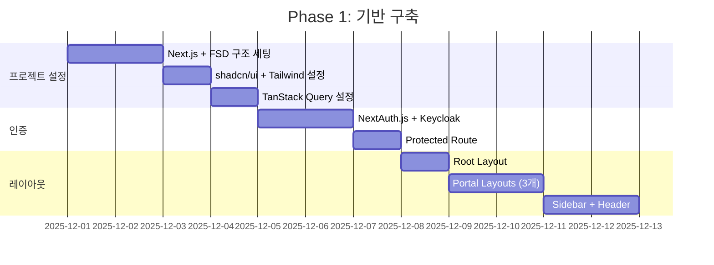

**산출물**:
- [ ] 프로젝트 초기 설정 완료
- [ ] 인증 플로우 동작
- [ ] 3개 포털 기본 레이아웃

### Phase 2: Operator Portal (Week 3-4)

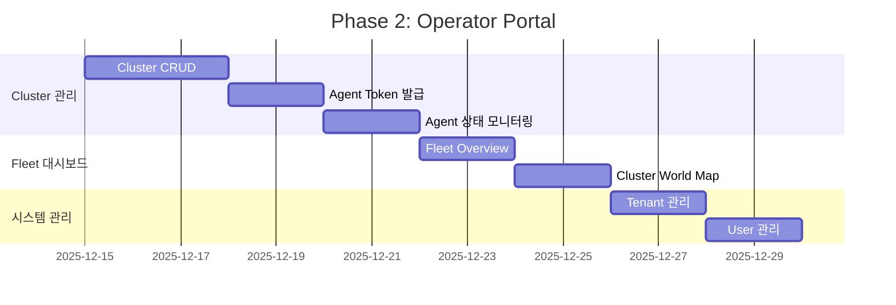

**산출물**:
- [ ] Cluster CRUD 완료
- [ ] Agent 토큰 발급 및 상태 모니터링
- [ ] Fleet 대시보드

### Phase 3: Provider Portal - 논리 계층 (Week 5-6)

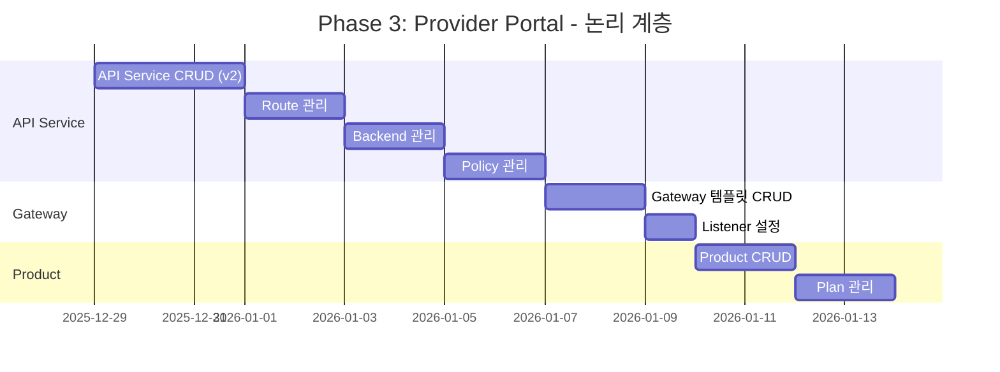

**산출물**:
- [ ] API Service 관리 (Gateway 독립)
- [ ] Gateway 템플릿 관리
- [ ] Product/Plan 관리

### Phase 4: Provider Portal - 배포 계층 (Week 7-8)

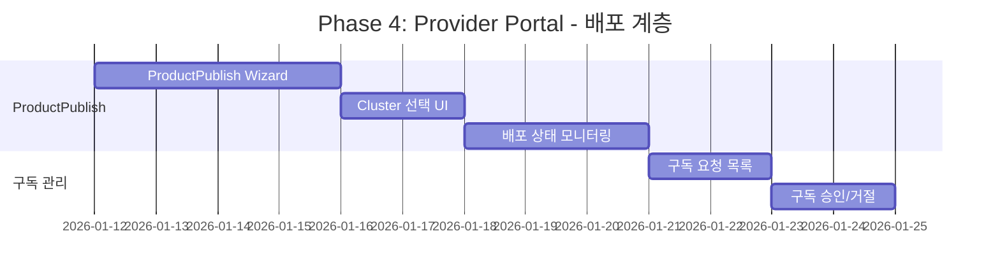

**산출물**:
- [ ] ProductPublish 마법사 (v2 핵심)
- [ ] 멀티 클러스터 배포 현황
- [ ] 구독 요청 관리

### Phase 5: Consumer Portal (Week 9-10)

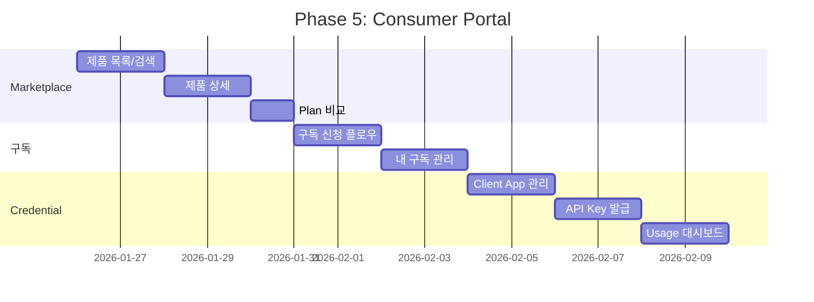

**산출물**:
- [ ] Marketplace 탐색 및 구독
- [ ] Client App / Consumer 관리
- [ ] Credential 발급 및 사용량 확인

---

## 11. 테스트 전략

### 11.1 테스트 피라미드

```
                    /\
                   /  \
                  / E2E \        (Playwright)
                 /--------\
                /   통합    \     (Testing Library)
               /--------------\
              /     단위       \   (Vitest)
             /------------------\
```

### 11.2 주요 테스트 시나리오

| 시나리오 | 테스트 유형 | 도구 |
|----------|-------------|------|
| API 훅 테스트 | 단위 | Vitest + MSW |
| 컴포넌트 렌더링 | 단위 | Vitest + Testing Library |
| 폼 검증 | 통합 | Testing Library |
| 인증 플로우 | E2E | Playwright |
| 배포 마법사 | E2E | Playwright |

---

## 12. 성능 최적화

### 12.1 번들 최적화

```typescript
// next.config.ts
const nextConfig = {
  experimental: {
    optimizePackageImports: ['lucide-react', '@radix-ui/react-*'],
  },

  images: {
    remotePatterns: [
      { protocol: 'https', hostname: '**.imprun.dev' },
    ],
  },
};
```

### 12.2 캐싱 전략

```typescript
// shared/api/queryClient.ts
export const queryClient = new QueryClient({
  defaultOptions: {
    queries: {
      staleTime: 1000 * 60 * 5,      // 5분
      gcTime: 1000 * 60 * 30,        // 30분
      retry: 1,
      refetchOnWindowFocus: false,
    },
  },
});
```

### 12.3 코드 스플리팅

```typescript
// 동적 import 사용
const ProductPublishWizard = dynamic(
  () => import('@/widgets/product-publish-wizard/ProductPublishWizard'),
  {
    loading: () => <WizardSkeleton />,
    ssr: false,
  }
);
```

---

## 13. 참고 문서

- [Architecture v2](architecture.md)
- [PRD v2](prd.md)
- [Backend Spec v2](backend-spec.md)
- [Data Model v2](data-model.md)
- [Agent Spec v2](agent-spec.md)
- [Feature-Sliced Design](https://feature-sliced.design/)
- [TanStack Query](https://tanstack.com/query/latest)
- [shadcn/ui](https://ui.shadcn.com/)
