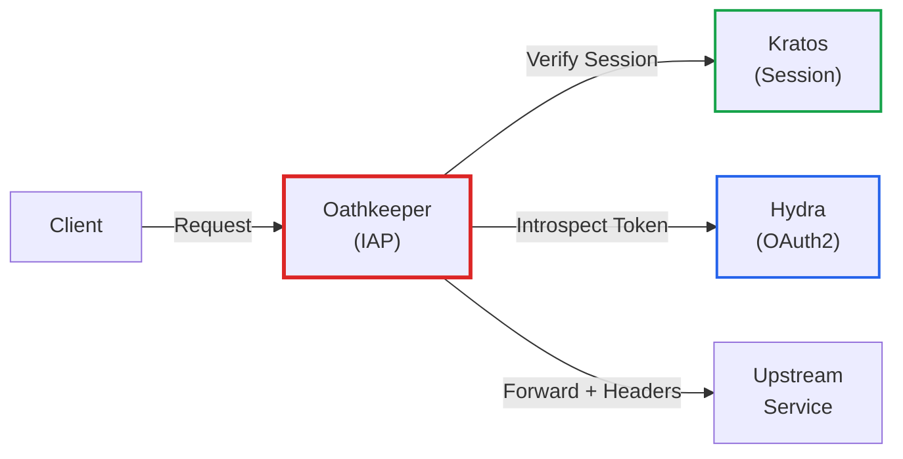
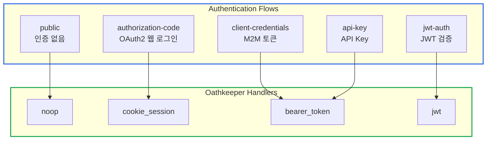
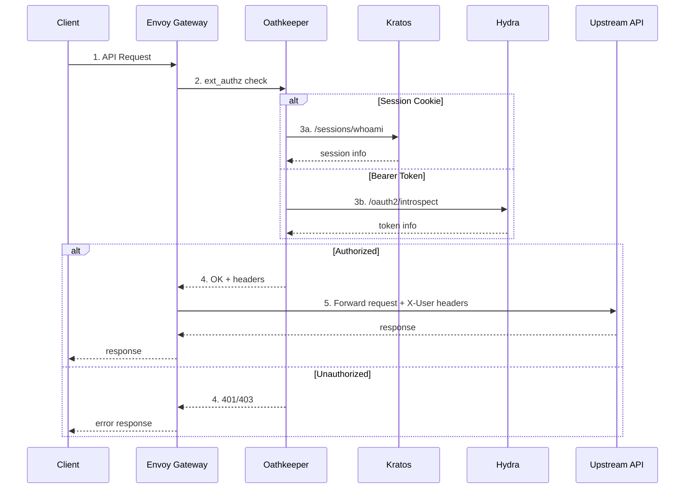
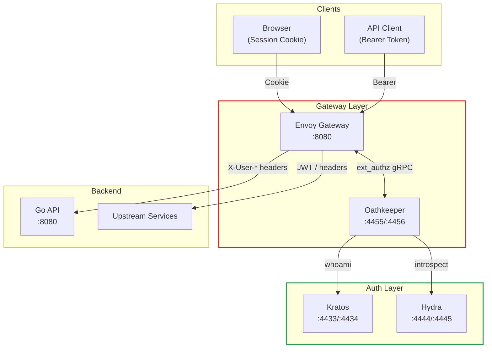

# Ory Oathkeeper를 활용한 Zero Trust IAP 구현 가이드

> **작성일**: 2025년 12월 6일
> **카테고리**: Authentication, Authorization, API Gateway, Security
> **키워드**: Ory Oathkeeper, Zero Trust, IAP, Identity Aware Proxy, Envoy, ext_authz

## 요약

Ory Oathkeeper는 Zero Trust Identity & Access Proxy로, 모든 요청에 대해 인증/인가를 수행하는 게이트키퍼 역할을 한다. Envoy Gateway와 연동하여 ext_authz 패턴으로 동작하며, Kratos 세션과 Hydra OAuth2 토큰을 모두 검증할 수 있다. 이 글에서는 ImpRun 프로젝트에서 Oathkeeper를 활용한 Zero Trust 아키텍처 구현 사례를 다룬다.

## Ory Oathkeeper 개요

### Oathkeeper란

Oathkeeper는 Ory 프로젝트의 Identity & Access Proxy (IAP) 컴포넌트다. 모든 요청을 가로채서 인증/인가를 수행한 후, 통과된 요청만 업스트림 서비스로 전달한다.



### Zero Trust 원칙

Oathkeeper는 Zero Trust 보안 모델을 구현한다:

| 원칙 | 설명 |
|------|------|
| Never Trust, Always Verify | 모든 요청을 검증, 내부 네트워크도 신뢰하지 않음 |
| Least Privilege | 필요한 최소 권한만 부여 |
| Assume Breach | 침해를 가정하고 설계 |

### 핵심 컴포넌트

Oathkeeper는 4가지 핵심 컴포넌트로 구성된다:

```
Request → Authenticator → Authorizer → Mutator → Upstream
```

| 컴포넌트 | 역할 |
|----------|------|
| Authenticator | 요청자 신원 확인 (Session, Bearer Token, JWT 등) |
| Authorizer | 접근 권한 확인 (Allow, Deny, Remote) |
| Mutator | 요청 변환 (Header 추가, JWT 생성 등) |
| Error Handler | 에러 응답 처리 (JSON, Redirect 등) |

## Oathkeeper 설정

### 기본 설정 (oathkeeper.yml)

```yaml
serve:
  proxy:
    port: 4455
  api:
    port: 4456
  prometheus:
    port: 9000

access_rules:
  matching_strategy: regexp
  repositories:
    - file:///etc/config/oathkeeper/access-rules.yml
```

### Authenticators 설정

Oathkeeper는 여러 인증 방식을 지원한다:

```yaml
authenticators:
  # 인증 없음 (Public endpoints)
  noop:
    enabled: true

  # Kratos 세션 쿠키 검증
  cookie_session:
    enabled: true
    config:
      check_session_url: http://kratos:4433/sessions/whoami
      preserve_path: true
      extra_from: "@this"
      subject_from: "identity.id"
      only:
        - ory_kratos_session

  # OAuth2 Bearer Token 검증
  bearer_token:
    enabled: true
    config:
      check_session_url: http://hydra:4445/oauth2/introspect
      token_from:
        header: Authorization
      preserve_host: true

  # JWT 토큰 검증
  jwt:
    enabled: true
    config:
      jwks_urls:
        - http://hydra:4444/.well-known/jwks.json
      scope_strategy: hierarchic
```

### Authorizers 설정

```yaml
authorizers:
  # 모든 요청 허용
  allow:
    enabled: true

  # 모든 요청 거부
  deny:
    enabled: true

  # 원격 서버에 권한 확인 (Keto 연동 가능)
  remote:
    enabled: true
    config:
      remote: http://keto:4466/relation-tuples/check
      headers:
        Content-Type: application/json
```

### Mutators 설정

인증된 요청에 사용자 정보를 추가한다:

```yaml
mutators:
  # 변환 없음
  noop:
    enabled: true

  # HTTP 헤더 추가
  header:
    enabled: true
    config:
      headers:
        X-User-Id: "{{ print .Subject }}"
        X-User-Email: "{{ print .Extra.identity.traits.email }}"
        X-User-Roles: "{{ print .Extra.identity.metadata_public.roles }}"

  # ID Token (JWT) 생성
  id_token:
    enabled: true
    config:
      issuer_url: http://oathkeeper:4455
      jwks_url: file:///etc/config/oathkeeper/jwks.json
      claims: |
        {
          "sub": "{{ print .Subject }}",
          "email": "{{ print .Extra.identity.traits.email }}",
          "roles": {{ .Extra.identity.metadata_public.roles | toJson }}
        }
```

### Error Handlers 설정

```yaml
errors:
  fallback:
    - json
  handlers:
    # JSON 에러 응답
    json:
      enabled: true
      config:
        verbose: true

    # 로그인 페이지로 리다이렉트
    redirect:
      enabled: true
      config:
        to: http://localhost:3000/auth/login
        when:
          - error:
              - unauthorized
              - forbidden
            request:
              header:
                accept:
                  - text/html
```

## Access Rules

### Rule 구조

Access Rule은 URL 패턴별로 인증/인가 정책을 정의한다:

```yaml
- id: "rule-name"
  upstream:
    url: "http://backend:3000"
    preserve_host: true
  match:
    url: "<(http|https)>://<.*>/api/<path>"
    methods:
      - GET
      - POST
  authenticators:
    - handler: cookie_session
    - handler: bearer_token
  authorizer:
    handler: allow
  mutators:
    - handler: header
```

### Public Endpoints

인증이 필요 없는 엔드포인트:

```yaml
- id: "public-api-directory"
  upstream:
    url: "http://api:3000"
  match:
    url: "<(http|https)>://<.*>/api/directory/<.*>"
    methods:
      - GET
  authenticators:
    - handler: noop
  authorizer:
    handler: allow
  mutators:
    - handler: noop
```

### Protected Endpoints

세션 또는 Bearer Token이 필요한 엔드포인트:

```yaml
- id: "protected-api"
  upstream:
    url: "http://api:3000"
  match:
    url: "<(http|https)>://<.*>/api/<(?!directory).*>"
    methods:
      - GET
      - POST
      - PUT
      - DELETE
      - PATCH
  authenticators:
    # 순서대로 시도, 첫 번째 성공한 것 사용
    - handler: cookie_session
    - handler: bearer_token
  authorizer:
    handler: allow
  mutators:
    - handler: header
```

### Gateway Proxy

외부 API Gateway로 프록시하는 경우:

```yaml
- id: "gateway-proxy"
  upstream:
    url: "http://upstream-service:8080"
    preserve_host: true
  match:
    url: "<(http|https)>://<.*>/gateway/<.*>"
    methods:
      - GET
      - POST
      - PUT
      - DELETE
      - PATCH
  authenticators:
    - handler: bearer_token
  authorizer:
    handler: allow
  mutators:
    # JWT 토큰 생성하여 업스트림에 전달
    - handler: id_token
```

## 인증 플로우 타입

ImpRun에서 지원하는 인증 플로우 타입:

| flow_type | 설명 | Oathkeeper Handler |
|-----------|------|-------------------|
| `public` | 인증 불필요 | `noop` |
| `authorization-code` | OAuth2 웹 로그인 | `cookie_session` |
| `client-credentials` | M2M 토큰 | `bearer_token` (introspect) |
| `jwt-auth` | JWT 토큰 검증 | `jwt` |
| `api-key` | API Key 인증 | `bearer_token` |



## Envoy Gateway 연동

### ext_authz 패턴

Oathkeeper는 Envoy의 External Authorization (ext_authz) 필터와 연동된다:



### Envoy 설정

```yaml
static_resources:
  listeners:
    - name: listener_0
      address:
        socket_address:
          address: 0.0.0.0
          port_value: 8080
      filter_chains:
        - filters:
            - name: envoy.filters.network.http_connection_manager
              typed_config:
                "@type": type.googleapis.com/envoy.extensions.filters.network.http_connection_manager.v3.HttpConnectionManager
                stat_prefix: ingress_http
                route_config:
                  name: local_route
                  virtual_hosts:
                    - name: backend
                      domains: ["*"]
                      routes:
                        - match:
                            prefix: "/"
                          route:
                            cluster: upstream_service
                http_filters:
                  # External Authorization with Oathkeeper
                  - name: envoy.filters.http.ext_authz
                    typed_config:
                      "@type": type.googleapis.com/envoy.extensions.filters.http.ext_authz.v3.ExtAuthz
                      grpc_service:
                        envoy_grpc:
                          cluster_name: oathkeeper
                        timeout: 0.5s
                      transport_api_version: V3
                      failure_mode_allow: false
                  - name: envoy.filters.http.router
                    typed_config:
                      "@type": type.googleapis.com/envoy.extensions.filters.http.router.v3.Router

  clusters:
    - name: oathkeeper
      type: STRICT_DNS
      lb_policy: ROUND_ROBIN
      http2_protocol_options: {}
      load_assignment:
        cluster_name: oathkeeper
        endpoints:
          - lb_endpoints:
              - endpoint:
                  address:
                    socket_address:
                      address: oathkeeper
                      port_value: 4456

    - name: upstream_service
      type: STRICT_DNS
      lb_policy: ROUND_ROBIN
      load_assignment:
        cluster_name: upstream_service
        endpoints:
          - lb_endpoints:
              - endpoint:
                  address:
                    socket_address:
                      address: api
                      port_value: 3000
```

### 아키텍처 다이어그램



## 백엔드에서 인증 정보 사용

### X-User 헤더 활용

Oathkeeper가 추가한 헤더를 백엔드에서 활용한다:

```go
// internal/interface/middleware/auth_from_headers.go
func AuthFromHeadersMiddleware() gin.HandlerFunc {
    return func(c *gin.Context) {
        // Oathkeeper가 추가한 헤더에서 사용자 정보 추출
        userID := c.GetHeader("X-User-Id")
        userEmail := c.GetHeader("X-User-Email")
        userRoles := c.GetHeader("X-User-Roles")

        if userID == "" {
            c.AbortWithStatusJSON(http.StatusUnauthorized, gin.H{
                "error": "No user information in request",
            })
            return
        }

        // Context에 사용자 정보 저장
        c.Set("user", &UserInfo{
            ID:    userID,
            Email: userEmail,
            Roles: parseRoles(userRoles),
        })

        c.Next()
    }
}

func parseRoles(rolesHeader string) []string {
    if rolesHeader == "" {
        return []string{}
    }
    // JSON 배열 또는 쉼표 구분 문자열 파싱
    var roles []string
    if err := json.Unmarshal([]byte(rolesHeader), &roles); err != nil {
        return strings.Split(rolesHeader, ",")
    }
    return roles
}
```

### Dual Mode 지원

Oathkeeper 사용 여부에 따라 동적으로 인증 처리:

```go
func AuthMiddleware(kratosClient *client.KratosClient, useOathkeeper bool) gin.HandlerFunc {
    return func(c *gin.Context) {
        // Oathkeeper 모드: 헤더에서 사용자 정보 추출
        if useOathkeeper {
            userID := c.GetHeader("X-User-Id")
            if userID != "" {
                c.Set("user", &UserInfo{ID: userID})
                c.Next()
                return
            }
        }

        // Direct 모드: Kratos 세션 직접 검증
        sessionCookie, err := c.Cookie("ory_kratos_session")
        if err != nil {
            c.AbortWithStatusJSON(http.StatusUnauthorized, gin.H{
                "error": "No authentication provided",
            })
            return
        }

        session, err := kratosClient.WhoAmI(c.Request.Context(), sessionCookie)
        if err != nil {
            c.AbortWithStatusJSON(http.StatusUnauthorized, gin.H{
                "error": "Invalid session",
            })
            return
        }

        c.Set("user", &UserInfo{
            ID:    session.Identity.ID,
            Email: session.Identity.Traits.Email,
        })
        c.Next()
    }
}
```

## JWKS 설정

### 키 생성

ID Token mutator를 사용하려면 JWKS를 생성해야 한다:

```bash
# RSA 키 쌍 생성
openssl genrsa -out private.pem 4096
openssl rsa -in private.pem -pubout -out public.pem

# JWKS 형식으로 변환 (jose 라이브러리 사용)
# 또는 Oathkeeper의 자동 생성 기능 사용
```

### jwks.json 예시

```json
{
  "keys": [
    {
      "kty": "RSA",
      "kid": "oathkeeper-key-1",
      "use": "sig",
      "alg": "RS256",
      "n": "...",
      "e": "AQAB",
      "d": "...",
      "p": "...",
      "q": "...",
      "dp": "...",
      "dq": "...",
      "qi": "..."
    }
  ]
}
```

## Docker Compose 설정

```yaml
services:
  oathkeeper:
    image: oryd/oathkeeper:v0.40.7
    command: serve --config /etc/config/oathkeeper/oathkeeper.yml
    ports:
      - "4455:4455"  # Proxy
      - "4456:4456"  # API
    volumes:
      - ./docker/ory/oathkeeper:/etc/config/oathkeeper
    environment:
      - LOG_LEVEL=debug
    depends_on:
      - kratos
      - hydra

  envoy:
    image: envoyproxy/envoy:v1.32-latest
    ports:
      - "8080:8080"  # Gateway
      - "9901:9901"  # Admin
    volumes:
      - ./docker/envoy/envoy.yaml:/etc/envoy/envoy.yaml
    depends_on:
      - oathkeeper
```

## 운영 고려사항

### 성능

- Oathkeeper는 stateless하므로 수평 확장 가능
- 세션 검증 결과 캐싱으로 Kratos/Hydra 부하 감소
- Envoy와 gRPC 통신으로 낮은 지연시간

### 보안

1. **Admin API 접근 제한**: 4456 포트는 내부 네트워크에서만 접근
2. **JWKS 키 관리**: 프로덕션에서는 외부 키 관리 시스템 사용 권장
3. **failure_mode_allow**: false로 설정하여 Oathkeeper 장애 시 요청 차단

### 모니터링

Prometheus 메트릭 제공:

```yaml
serve:
  prometheus:
    port: 9000
    path: /metrics
```

주요 메트릭:
- `ory_oathkeeper_requests_total`
- `ory_oathkeeper_request_duration_seconds`
- `ory_oathkeeper_authenticator_*`

## 참고 자료

### 공식 문서
- [Ory Oathkeeper Documentation](https://www.ory.sh/docs/oathkeeper)
- [Ory Oathkeeper GitHub](https://github.com/ory/oathkeeper)
- [Access Rules Reference](https://www.ory.sh/docs/oathkeeper/reference/configuration)

### 관련 문서
- [Ory Kratos를 활용한 사용자 인증 시스템 구축](https://blog.imprun.dev/77) - Identity Management 상세 구현
- [Ory Hydra OAuth2/OIDC 구현 가이드](https://blog.imprun.dev/76) - OAuth2 토큰 발급 및 클라이언트 관리
- [Ory Keto를 활용한 ReBAC 기반 권한 관리 시스템 구축](https://blog.imprun.dev/78) - 권한 모델 및 Relation Tuple
- [ImpRun 인증/인가 아키텍처: Ory 스택 통합 구현 가이드](https://blog.imprun.dev/80) - 4개 컴포넌트 통합 아키텍처
