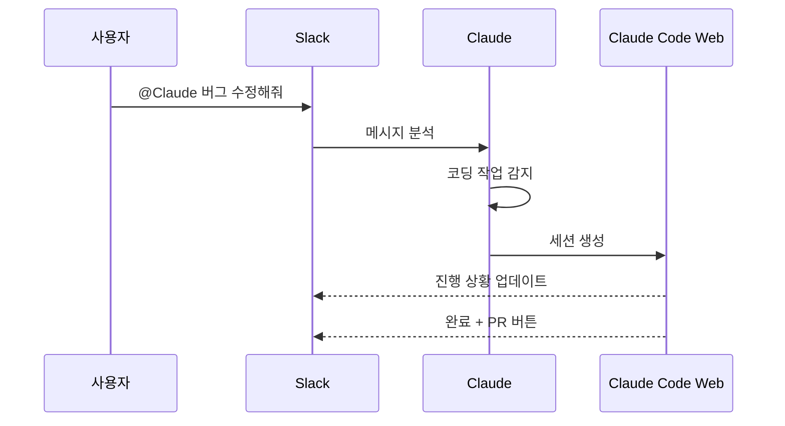

# Claude Code Slack 연동: 팀 대화에서 바로 코딩 작업 위임하기

> **작성일**: 2025년 12월 11일
> **카테고리**: AI, Developer Tools, Claude Code
> **키워드**: Claude Code, Slack, Team Collaboration, AI Coding Assistant

## 요약

Claude Code가 Slack과 연동되었다. Slack에서 `@Claude`를 멘션하면 대화 컨텍스트를 기반으로 Claude Code 웹 세션이 자동 생성된다. GitHub PR 코드리뷰 기능이 GitHub 내에서 직접 동작하는 것과 달리, Slack 연동은 Claude Code for Web(claude.ai/code)을 통해 작업이 수행된다.


*출처: [Claude 공식 블로그](https://www.claude.com/blog/claude-code-and-slack)*

## 데모 영상

[](https://www.youtube.com/watch?v=XpXImenrSPI)

프로덕션 버그 알림이 Slack에 올라오면, `@Claude`를 멘션하여 즉시 조사 및 수정 작업을 위임하는 시나리오를 보여준다. Claude가 코드베이스를 탐색하고, 원인을 분석하고, exponential backoff와 circuit breaker 패턴을 적용한 수정안을 제안한다.

## GitHub vs Slack 연동 비교

| 구분 | GitHub 연동 | Slack 연동 |
|---|---|---|
| 트리거 | PR에서 `@claude` 멘션 | 채널/스레드에서 `@Claude` 멘션 |
| 작업 환경 | GitHub 내에서 직접 처리 | Claude Code for Web 세션 생성 |
| 결과물 | PR 코멘트, 코드 제안 | 세션 링크 + PR 생성 버튼 |
| 컨텍스트 | PR diff, 코멘트 | Slack 스레드/채널 메시지 |

Slack은 GitHub가 아니므로 코드 작업을 위해 Claude Code 웹 환경으로 연결된다. 작업 완료 후 PR 생성 버튼을 통해 GitHub에 반영할 수 있다.

## 동작 방식



1. Slack 채널/스레드에서 `@Claude` 멘션
2. Claude가 메시지 분석 후 코딩 작업 여부 판단
3. 코딩 작업이면 Claude Code 웹 세션 자동 생성
4. 스레드에 진행 상황 업데이트
5. 완료 시 세션 링크 + PR 생성 버튼 제공

## 컨텍스트 수집

Claude는 메시지 주변 컨텍스트를 자동 수집한다:

- **스레드**: 스레드 내 모든 메시지
- **채널**: 최근 채널 메시지
- **저장소**: 이전에 인증된 GitHub 저장소 중 자동 선택

## 설정 방법

### 사전 요구사항

| 항목 | 조건 |
|---|---|
| Claude 플랜 | Pro, Max, Team, Enterprise (Claude Code 접근 권한) |
| Claude Code 웹 | 활성화 필요 |
| GitHub | Claude Code 웹에 최소 1개 저장소 연결 |

### 1. Slack 앱 설치

워크스페이스 관리자가 [Slack App Marketplace](https://slack.com/marketplace/A08SF47R6P4)에서 Claude 앱 설치

### 2. Claude 계정 연결

1. Slack에서 Claude 앱 열기
2. **App Home** 탭에서 "Connect" 클릭
3. 브라우저에서 인증 완료

### 3. 라우팅 모드 설정

App Home → Routing Mode에서 선택:

| 모드 | 동작 |
|---|---|
| **Code only** | 모든 멘션을 Claude Code로 라우팅 |
| **Code + Chat** | 메시지 분석 후 코딩/일반 대화 자동 분기 |

Code + Chat 모드에서 잘못 분류된 경우 "Retry as Code" 버튼으로 재시도 가능.

## 사용 예시

### 인시던트 대응

```
@Claude 프로덕션에서 NullPointerException 발생 중.
로그 보면 UserService.getProfile()에서 터지는데 확인해줘.
```

### 코드 리뷰 요청

```
@Claude PR #142 리뷰해줘. 특히 에러 핸들링 부분 봐줘.
```

### 기능 구현

```
@Claude 로그인 실패 시 3회 후 5분 락아웃 기능 추가해줘.
테스트 코드도 작성하고 PR 만들어줘.
```

## 액션 버튼

세션 완료 시 제공되는 버튼:

| 버튼 | 동작 |
|---|---|
| **View Session** | 전체 세션 트랜스크립트 확인 |
| **Create PR** | 변경사항으로 PR 생성 |
| **Retry as Code** | Chat으로 분류된 경우 Code로 재시도 |
| **Change Repo** | 다른 저장소로 변경 |

## Slack vs 웹 직접 사용

| 상황 | 권장 |
|---|---|
| Slack에 컨텍스트 있음 | Slack |
| 비동기 작업 위임 | Slack |
| 팀원 가시성 필요 | Slack |
| 파일 업로드 필요 | 웹 직접 |
| 실시간 상호작용 | 웹 직접 |
| 복잡한 장시간 작업 | 웹 직접 |

## 제한사항

- GitHub 저장소만 지원 (GitLab, Bitbucket 미지원)
- 세션당 PR 1개 생성 가능
- 개인 플랜의 rate limit 적용
- Claude Code 웹 접근 권한 필수
- 현재 Research Preview (베타) 상태

## 트러블슈팅

| 문제 | 해결 |
|---|---|
| 세션 시작 안 됨 | App Home에서 계정 연결 확인, Claude Code 웹 접근 확인 |
| 저장소 안 보임 | Claude Code 웹에서 저장소 재연결 |
| 잘못된 저장소 선택 | "Change Repo" 버튼 또는 요청에 저장소명 명시 |
| 인증 오류 | App Home에서 계정 연결 해제 후 재연결 |

## 결론

Slack 연동으로 팀 대화에서 개발 작업으로 이어지는 흐름이 자연스러워졌다. 인시던트 스레드에서 바로 수정 작업을 위임하고, PR까지 받을 수 있다.

## 참고 자료

- [Claude Code and Slack](https://www.claude.com/blog/claude-code-and-slack) - Claude 공식 블로그
- [Slack Integration Documentation](https://code.claude.com/docs/en/slack) - 공식 문서
- [Slack App Marketplace](https://slack.com/marketplace/A08SF47R6P4) - Claude 앱 설치
