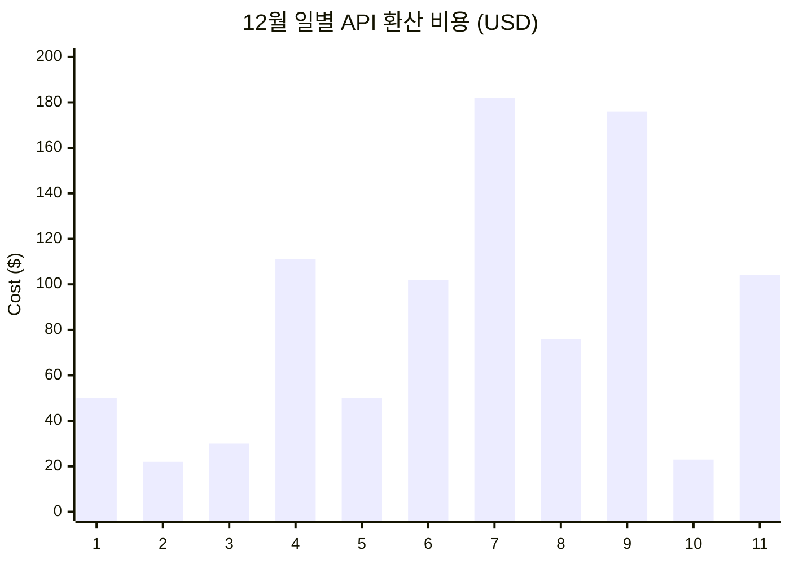
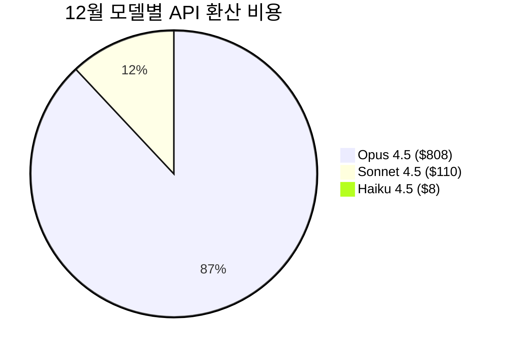
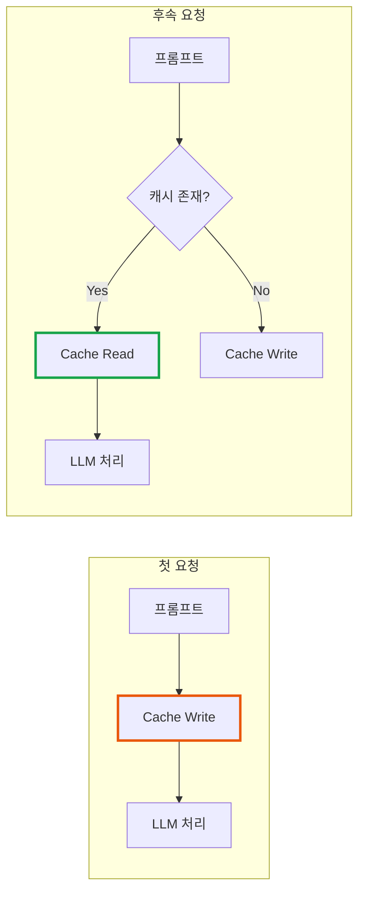

# Claude Code 사용 리포트: 27일간 12억 토큰의 기록

> **작성일**: 2025년 12월 11일
> **카테고리**: AI, Developer Tools, Usage Analysis
> **키워드**: Claude Code, Claude Max, AI Coding Assistant, Token Usage, Prompt Caching

## 요약

27일간 Claude Code로 12.7억 토큰을 사용했다. 프롬프트 캐싱 덕분에 API 환산 비용은 $952 수준이며, 캐싱이 없었다면 약 $6,000에 달했을 사용량이다.

## 배경

최근 한 개발자가 Claude Max 20 계정 4개를 사용해 5억 토큰을 소비했다는 글을 보았다. 나는 얼마나 사용하고 있는지 궁금해져서 ccusage로 측정해보기로 했다. 6월부터 Claude Code를 사용해왔지만, 이전에 문제 해결을 위해 로그를 삭제한 적이 있어서 측정 가능한 기간은 11월 15일 이후뿐이다.

## 사용 환경

- **구독 플랜**: Claude Max 20 ($200/월)
- **측정 기간**: 2025년 11월 15일 ~ 12월 11일 (27일)
- **측정 도구**: [ccusage](https://ccusage.com) - Claude Code 로컬 로그 분석 도구
- **주요 프로젝트**: imprun-apigateway v3 완전 재개발

## Opus 4.5가 기본 모델인 이유

2025년 11월 Anthropic은 Claude Opus 4.5를 출시하면서 가격을 대폭 인하했다.

| 모델 | Input (이전) | Input (현재) | Output (이전) | Output (현재) |
|---|---|---|---|---|
| Opus | $15/1M | **$5/1M** | $75/1M | **$25/1M** |

67% 가격 인하로 Opus급 성능을 더 넓은 범위에서 활용할 수 있게 되었다. Anthropic은 이를 "Opus-class performance broadly accessible"하게 만들기 위한 전략적 결정이라고 밝혔다. SWE-bench Verified에서 80.9%를 달성하며 코딩 작업에서 업계 최고 성능을 기록했다.

Claude Code에서도 Opus 4.5가 기본 모델로 설정되어 있어, 별도 설정 없이 최상위 모델을 사용하게 된다.

## 월별 사용량 분석

### 전체 요약

| 월 | 사용일 | Input | Output | Cache Read | 총 토큰 | API 환산 |
|---|---|---|---|---|---|---|
| 11월 | 7일 | 145K | 230K | 49.6M | 52.7M | $25.49 |
| 12월 | 11일 | 1.36M | 1.8M | 1,144.7M | 1.21B | $926.55 |
| **합계** | **18일** | **1.5M** | **2M** | **1,194.3M** | **1.27B** | **$952.04** |

11월은 간헐적 사용에 그쳤으나, 12월에 imprun-apigateway v3 재개발을 시작하면서 사용량이 36배 증가했다.

### 일별 사용 추이



일별 비용 편차가 크며, $22~$182 범위에서 변동한다. 복잡한 리팩토링이나 대규모 코드베이스 분석 작업일에 비용이 급증하는 패턴을 보인다.

## 모델별 사용 분석

### 12월 모델별 비용



| 모델 | API 환산 비용 | 비율 |
|---|---|---|
| Claude Opus 4.5 | $808.38 | 87.2% |
| Claude Sonnet 4.5 | $110.03 | 11.9% |
| Claude Haiku 4.5 | $8.14 | 0.9% |

Opus 4.5의 가격 인하로 부담 없이 최상위 모델을 사용할 수 있게 되면서, 자연스럽게 Opus 사용 비중이 87%까지 높아졌다.

### 모델별 토큰 사용량 변화

| 모델 | 11월 토큰 | 11월 비중 | 12월 토큰 | 12월 비중 | 증가율 |
|---|---|---|---|---|---|
| **Opus** | 21.4M | 40% | 947M | 78% | 44배 |
| Sonnet | 6.6M | 13% | 237M | 20% | 36배 |
| Haiku | 24.7M | **47%** | 29.4M | 2% | 1.2배 |

11월에 Haiku가 47%로 가장 많이 사용된 것은 의외였다. 원래 9~10월경 Max 구독에 주간 사용량 제한이 생기면서 "설계는 Opus, 개발은 Sonnet"으로 전략을 바꿨었다. 11월에 멀티 Claude Code 환경에서 간단한 작업용으로 하나를 Haiku로 변경했는데, VSCode 확장의 버그로 모델 설정이 전체 인스턴스에 공유되었을 가능성이 있다. (공식 확인된 버그는 아님)

결과적으로 11월 작업 결과물에 만족하지 못해 v2 개발을 중단했는데, 모델 선택이 원인이었던 것으로 보인다. 12월에 Opus 비중이 78%로 높아지면서 작업 품질이 체감될 정도로 개선되었다.

## 프롬프트 캐싱의 비용 절감 효과

Claude Code가 저렴하게 동작하는 핵심은 프롬프트 캐싱이다.

### 캐싱 동작 원리



- **Cache Write**: 새로운 프롬프트를 캐시에 저장 (Input 대비 1.25배 비용)
- **Cache Read**: 캐시된 프롬프트 재사용 (Input 대비 **90% 저렴**)

### 실제 캐시 활용 현황

| 구분 | 12월 토큰 수 | 비율 |
|---|---|---|
| Input (신규) | 1,362,574 | 0.1% |
| Output | 1,803,640 | 0.1% |
| Cache Write | 65,317,653 | 5.4% |
| **Cache Read** | **1,144,662,942** | **94.4%** |

전체 토큰의 94.4%가 캐시에서 읽혀졌다. 이것이 비용 절감의 핵심이다.

### 캐싱 없었다면?

12월 사용량을 캐싱 없이 모두 Opus Input으로 처리했다면:

| 시나리오 | 계산 | 비용 |
|---|---|---|
| 캐싱 적용 (실제) | ccusage 측정값 | **$926.55** |
| 캐싱 미적용 (가정) | 1.21B 토큰 × $5/1M | **$6,050** |

API를 직접 호출했다면 캐싱으로 약 **84% 비용 절감** 효과를 얻은 셈이다. 물론 Max 구독자는 $200/월 고정이므로 실제 지불 비용과는 무관하다. 다만 ccusage가 보여주는 API 환산 비용은 사용량의 규모를 가늠하는 지표로 활용할 수 있다.

## 사용량 규모

Anthropic이 공개한 Claude Code 평균 사용량은 $6/개발자/일이다. 12월 기준 일평균 $84(API 환산)를 사용했으므로, 평균 대비 상당히 높은 사용량이다. v3 재개발이라는 대규모 프로젝트를 진행 중이었기 때문으로 보인다.

## ccusage로 사용량 측정하기

### ccusage란?

[ccusage](https://github.com/ryoppippi/ccusage)는 Claude Code가 로컬에 저장하는 JSONL 로그 파일을 분석하여 사용량과 비용을 계산하는 오픈소스 CLI 도구다.

### 측정 원리


1. **로그 수집**: Claude Code는 모든 대화를 로컬 JSONL 파일에 기록
2. **파일 위치**:
   - macOS/Linux: `~/.config/claude/projects/`
   - Windows: `%APPDATA%\claude\projects\`
3. **분석**: ccusage가 JSONL을 파싱하여 모델별, 일별, 세션별 토큰 사용량 집계
4. **비용 계산**: LiteLLM의 최신 가격 데이터를 참조하여 API 환산 비용 산출

### 사용 방법

```bash
# 설치 없이 즉시 실행
npx ccusage@latest

# 기간 지정 일별 리포트
ccusage daily --since 20251201 --until 20251231

# 월별 리포트
ccusage monthly

# JSON 내보내기 (데이터 분석용)
ccusage monthly --json > usage-report.json

# 실시간 모니터링
ccusage blocks --live
```

### 주요 기능

- **일별/주별/월별 리포트**: 다양한 기간 단위 분석
- **세션별 분석**: 개별 대화 단위 사용량 추적
- **5시간 블록 모니터링**: Claude의 rate limit 구간 단위 추적
- **캐시 토큰 분리**: Cache Write/Read 별도 표시
- **JSON 출력**: 구조화된 데이터 내보내기

## 결론

27일간 12.7억 토큰. ccusage로 처음 측정해봤는데 생각보다 많이 썼다.

## 참고 자료

### 도구
- [ccusage](https://github.com/ryoppippi/ccusage) - Claude Code 사용량 분석 도구
- [ccusage 가이드](https://ccusage.com/guide/getting-started) - 상세 사용법

### 공식 문서
- [Introducing Claude Opus 4.5](https://www.anthropic.com/news/claude-opus-4-5) - Opus 4.5 출시 및 가격 인하 발표
- [Anthropic API Pricing](https://www.anthropic.com/pricing)
- [Prompt Caching](https://docs.anthropic.com/en/docs/build-with-claude/prompt-caching) - 프롬프트 캐싱 기술 문서
