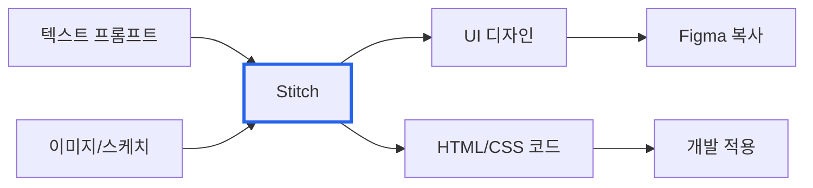
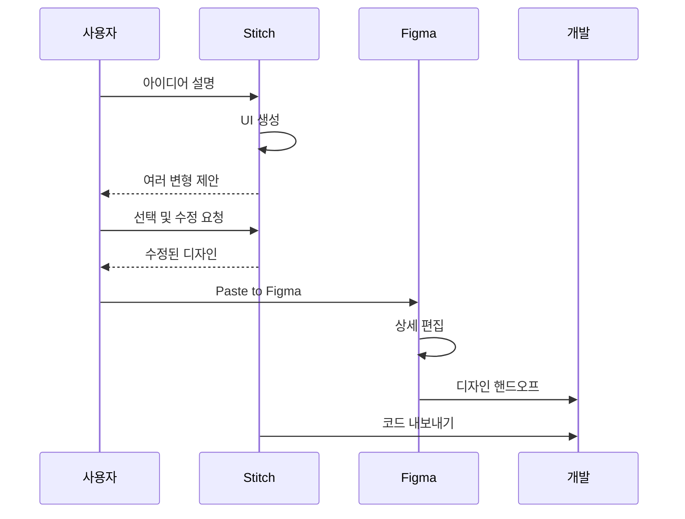

# Google Stitch: 피그마를 몰라도 AI로 UI 디자인하기

> **작성일**: 2025년 12월 11일
> **카테고리**: AI, Design Tools, UI/UX
> **키워드**: Google Stitch, AI Design, UI Generation, Figma, Gemini

## 요약

Google Stitch는 텍스트 프롬프트나 이미지로 UI 디자인과 프론트엔드 코드를 생성하는 AI 도구다. Google I/O 2025에서 발표되었으며, Figma를 대체하기보다는 초기 디자인 단계를 가속화하는 보완 도구로 포지셔닝되어 있다. 현재 Google Labs에서 무료로 제공된다.


*출처: [Google Developers Blog](https://developers.googleblog.com/en/stitch-a-new-way-to-design-uis/)*

## 데모 영상

[](https://www.youtube.com/watch?v=q39uczIW_MY)

텍스트 프롬프트로 UI를 생성하고, 변형을 탐색하고, Figma로 내보내는 전체 워크플로우를 보여준다.

## Stitch란?

Google Labs의 실험적 프로젝트로, Gemini 모델을 활용해 자연어 설명이나 이미지를 UI 디자인으로 변환한다. 2025년 5월 Google I/O에서 발표되었으며, Google이 인수한 Galileo AI의 후속작이다.



### Figma와의 차이점

| 구분 | Figma | Google Stitch |
|---|---|---|
| 접근 방식 | 수동 디자인 | AI 생성 |
| 입력 | 마우스/키보드 조작 | 텍스트/이미지 |
| 출력 | 디자인 파일 | 디자인 + 코드 |
| 학습 곡선 | 높음 | 낮음 |
| 용도 | 상세 디자인 | 빠른 프로토타이핑 |

## 주요 기능

Stitch 공식 홈페이지에서 강조하는 4가지 핵심 가치:

| 기능 | 설명 |
|---|---|
| 빠른 반복 | 여러 변형을 동시 생성하여 다양한 레이아웃/스타일 탐색 |
| 코드 내보내기 | 디자인 및 Figma 내보내기와 일치하는 정적 HTML 코드 생성 |
| Gemini로 빌드 | Google DeepMind의 최신 AI 모델 활용 |
| 소유권 보유 | 생성된 디자인과 코드를 자유롭게 활용 가능 |

### 1. 텍스트 기반 UI 생성

자연어로 앱을 설명하면 UI가 생성된다.

```
예시 프롬프트:
"피트니스 앱 대시보드. 오늘 운동 기록, 칼로리 소모량,
주간 목표 달성률을 카드 형태로 보여줘. 다크 테마."
```

### 2. 이미지 기반 UI 생성

화이트보드 스케치, 스크린샷, 와이어프레임을 업로드하면 디지털 UI로 변환한다.

### 3. 빠른 반복과 디자인 탐색

디자인은 반복적인 프로세스다. Stitch는 하나의 프롬프트로 여러 변형(variants)을 동시에 생성하여 다양한 레이아웃, 컴포넌트, 스타일을 빠르게 탐색할 수 있게 한다.

```
예시:
프롬프트 1개 → 디자인 변형 4개 생성 → 마음에 드는 것 선택 → 추가 수정 요청
```

Figma에서 수동으로 여러 시안을 만드는 대신, AI가 변형을 자동 생성하므로 초기 아이디어 검증 시간이 단축된다. 디자인 도구 사용 경험이 없어도 "이 버튼을 더 크게", "색상을 파란색으로" 같은 자연어로 수정할 수 있다.


*출처: [Google Stitch](https://stitch.withgoogle.com)*

### 4. Figma 연동

생성된 디자인을 Figma에 직접 복사하여 팀 협업 및 추가 편집이 가능하다.

### 5. 코드 내보내기

디자인과 함께 HTML/CSS 프론트엔드 코드가 자동 생성된다.

### 6. Prototypes (2025년 12월 추가)

Gemini 3 업데이트와 함께 추가된 기능으로, 여러 화면을 연결하여 인터랙션과 사용자 플로우를 설계할 수 있다.

## 사용 가능한 모델

| 모드 | 모델 | 월간 생성 횟수 | 특징 |
|---|---|---|---|
| Standard | Gemini 2.5 Flash | 350회 | 빠른 생성 |
| Experimental | Gemini 2.5 Pro | 50회 | 높은 품질, 이미지 입력 지원 |

2025년 12월부터 Gemini 3 모델도 적용되어 UI 생성 품질이 향상되었다.

## Figma AI 현황 (2025년 12월 기준)

Stitch만 AI를 도입한 것이 아니다. Figma도 2025년에 대폭 AI 기능을 강화했다.

### Figma Make

2025년 7월 정식 출시된 프롬프트 기반 프로토타입/웹앱 생성 도구다. Gemini 3 Pro 모델을 선택해서 사용할 수 있으며, Supabase 연동으로 백엔드까지 연결 가능하다.

### Figma Sites

디자인 파일에서 바로 반응형 웹사이트를 발행할 수 있다. CMS 기능도 추가 예정이다.

### AI 이미지 편집 (2025년 12월)

객체 제거/분리, 이미지 확장, 조명/그림자 조정 등 AI 기반 이미지 편집 기능이 추가되었다.

### MCP 서버

Figma MCP 서버가 정식 출시되어 코드 에디터(Claude Code, Cursor 등)와 연동할 수 있다. AI가 Figma 컨텍스트를 참조해서 코드를 생성한다.

## Stitch vs Figma AI

| 구분 | Google Stitch | Figma Make |
|---|---|---|
| 대상 사용자 | 비디자이너, 빠른 프로토타입 | Figma 사용자, 팀 협업 |
| 학습 곡선 | 낮음 | 중간 (Figma 기본 지식 필요) |
| 가격 | 무료 (Google Labs) | Figma 구독 + AI 크레딧 |
| 디자인 시스템 | 미지원 | 기존 라이브러리 import 가능 |
| 코드 출력 | HTML/CSS | React, CSS |
| 백엔드 연동 | 없음 | Supabase 연동 |
| 웹사이트 발행 | 없음 | Figma Sites |

**Stitch 선택 이유**: Figma를 모르거나, 빠르게 아이디어만 검증하고 싶을 때
**Figma AI 선택 이유**: 이미 Figma를 사용 중이거나, 팀 협업/디자인 시스템이 필요할 때

## 워크플로우 예시



Google은 Stitch가 Figma나 Adobe XD를 대체하려는 것이 아님을 명확히 했다.

> "What we want to do is make it super, super easy and approachable for people to do that next level of design thinking."
> — Kathy Korevec, Google Product Manager

## 제한사항

- 영어 프롬프트가 가장 정확한 결과 생성
- 복잡한 인터랙션이나 애니메이션은 지원 제한
- 디자인 시스템 구조나 컴포넌트 네이밍 자동화 미지원
- 프롬프트가 모호하면 일반적인 결과물 생성
- 현재 실험적(Experimental) 단계

## 시작하기

1. [stitch.withgoogle.com](https://stitch.withgoogle.com) 접속
2. Google 계정으로 로그인
3. 텍스트 프롬프트 입력 또는 이미지 업로드
4. 생성된 디자인 확인 및 수정
5. Figma 복사 또는 코드 내보내기

## 결론

Google Stitch는 피그마를 대체하는 도구가 아니라, 디자인 프로세스의 시작점을 낮추는 도구다. 아이디어를 빠르게 시각화하고, 여러 변형을 탐색한 뒤, Figma로 상세 작업을 이어가는 워크플로우에 적합하다.

## 참고 자료

### 공식 문서
- [From idea to app: Introducing Stitch](https://developers.googleblog.com/en/stitch-a-new-way-to-design-uis/) - Google Developers Blog
- [Stitch gets updates with Gemini 3](https://blog.google/technology/google-labs/stitch-gemini-3/) - Google Blog

### Figma AI
- [Figma Make: Create with AI-Powered Design Tools](https://www.figma.com/make/) - Figma Make 공식
- [Config 2025: Pushing Design Further](https://www.figma.com/blog/config-2025-recap/) - Figma Config 2025
- [Figma launches new AI-powered object removal and image extension](https://techcrunch.com/2025/12/10/figma-launches-new-ai-powered-object-removal-and-image-extension/) - TechCrunch

### 뉴스 및 리뷰
- [Stitch is Google's AI-powered tool to help design apps](https://techcrunch.com/2025/05/20/google-launches-stitch-an-ai-powered-tool-to-help-design-apps/) - TechCrunch
- [Google Stitch AI Review: Features, Pricing, Alternatives](https://www.banani.co/blog/google-stitch-ai-review) - Banani
- [Google Stitch vs Figma: AI UI Design Comparison](https://www.geeky-gadgets.com/ai-ui-design-tools-2025/) - Geeky Gadgets
