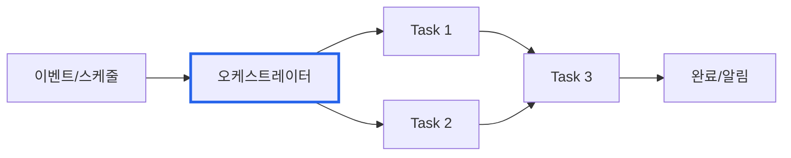
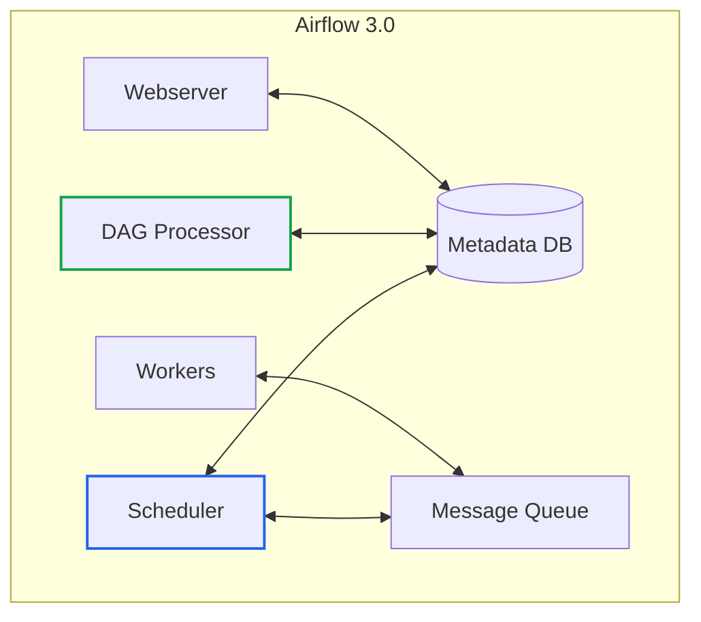
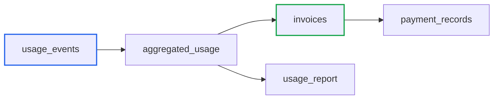
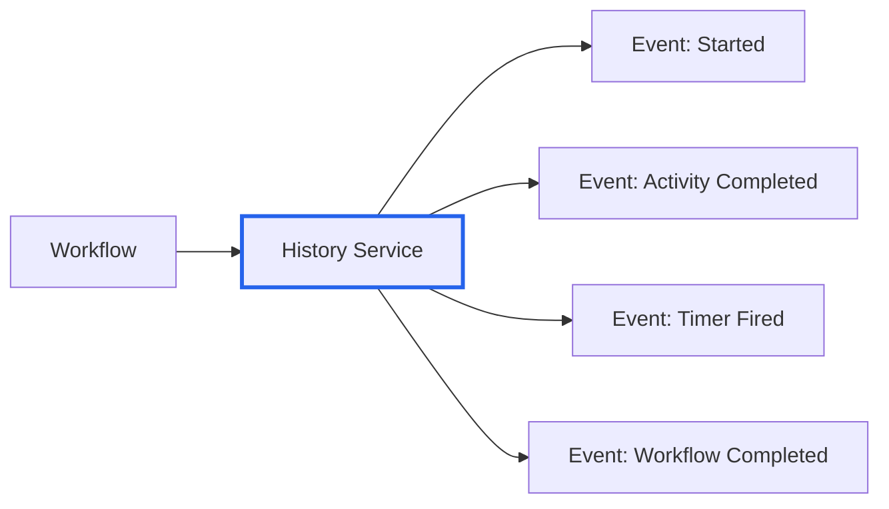
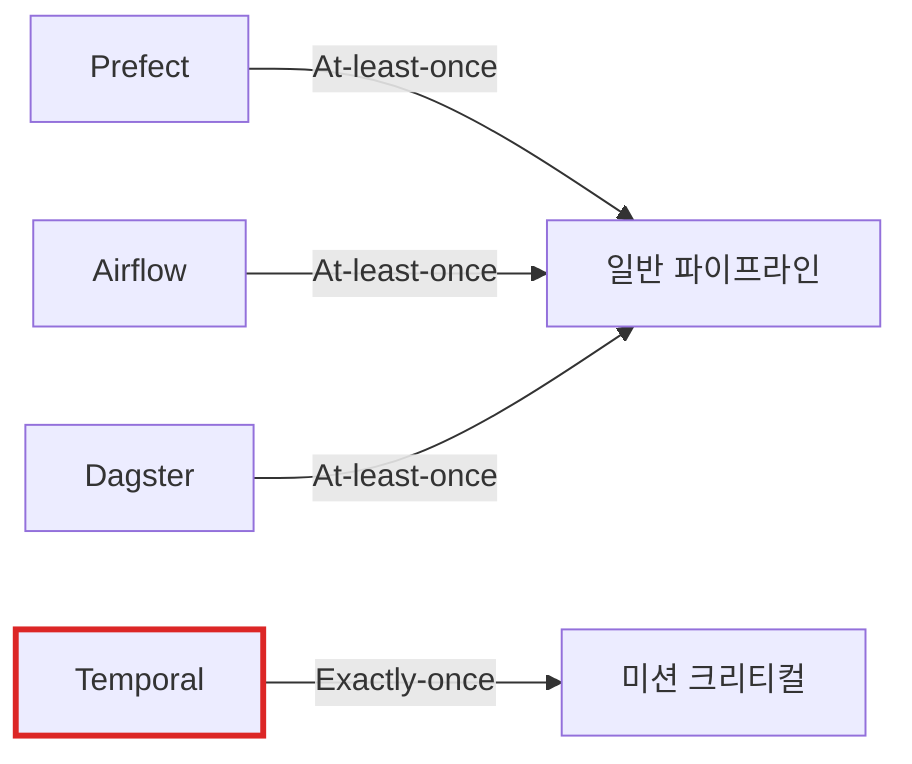
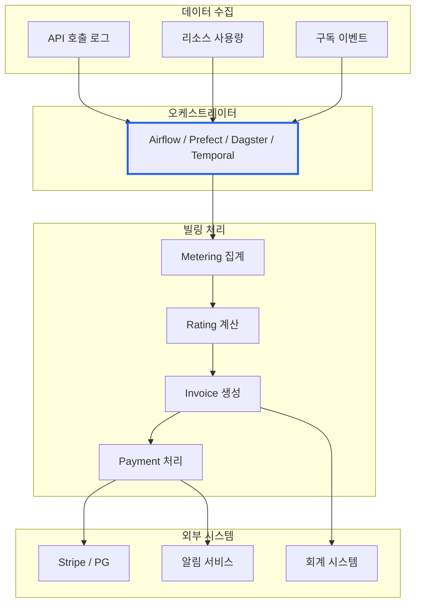

# Airflow vs Prefect vs Dagster vs Temporal: 빌링 SaaS를 위한 워크플로우 오케스트레이션 비교

> **작성일**: 2025년 12월 12일
> **카테고리**: Workflow Orchestration, Billing, SaaS
> **키워드**: Apache Airflow, Prefect, Dagster, Temporal, Billing System, SaaS, Workflow Orchestration, Usage-Based Pricing

## 요약

Apache Airflow, Prefect, Dagster, Temporal은 워크플로우 오케스트레이션에서 널리 사용되는 오픈소스 도구다. Airflow는 성숙한 생태계와 DAG 기반 스케줄링, Prefect는 Python 네이티브 개발자 경험, Dagster는 데이터 자산(Asset) 중심 접근 방식, Temporal은 내구성 실행(Durable Execution)과 Exactly-once 보장을 각각 강점으로 한다. 이 글에서는 네 도구를 비교하고, 특히 빌링 시스템과 SaaS 서비스 구축 관점에서의 활용 방안을 분석한다.

## 워크플로우 오케스트레이션이란?

워크플로우 오케스트레이션은 여러 작업(Task)을 정의된 순서와 의존성에 따라 실행하고, 실패 시 재시도하며, 전체 파이프라인을 모니터링하는 시스템이다.



빌링 시스템에서는 다음과 같은 작업들이 오케스트레이션 대상이 된다:
- 사용량 집계 (Usage Aggregation)
- 요금 계산 (Rating)
- 인보이스 생성 (Invoice Generation)
- 결제 처리 (Payment Processing)
- 정산 및 리포팅 (Settlement & Reporting)

## Apache Airflow 3.x (2025)

### 개요

Apache Airflow는 2014년 Airbnb에서 시작되어 현재 Apache Software Foundation에서 관리하는 오픈소스 워크플로우 오케스트레이션 플랫폼이다. 2025년 4월 Airflow 3.0이 출시되었고, 12월 현재 최신 버전은 **3.1.0**이다. 3.x 시리즈는 4년 반 만의 메이저 업데이트로, 아키텍처를 근본적으로 재설계했다.


*Airflow 3.x의 DAG Graph View - 출처: [Apache Airflow Documentation](https://airflow.apache.org/docs/apache-airflow/stable/ui.html)*

**핵심 지표 (2025년 기준)**:
- 월간 다운로드: 3,000만 이상
- 사용 조직: 80,000개 이상
- MLOps 활용: 30%
- GenAI 활용: 10%

### Airflow 3.x 주요 기능

#### 1. DAG 버전 관리 (DAG Versioning)

가장 요청이 많았던 기능으로, DAG의 구조적 변경을 추적하고 히스토리를 관리할 수 있다.

```python
# DAG 실행 중 새 버전이 업로드되어도
# 시작 시점의 버전으로 완료까지 실행
@dag(schedule="@daily", start_date=datetime(2025, 1, 1))
def billing_pipeline():
    @task
    def aggregate_usage():
        # 사용량 집계 로직
        pass

    @task
    def calculate_charges():
        # 요금 계산 로직
        pass

    aggregate_usage() >> calculate_charges()
```

빌링 시스템에서 DAG 버전 관리는 감사(Audit)와 규정 준수(Compliance)에 필수적이다.

#### 2. 이벤트 기반 스케줄링 (Event-Driven Scheduling)

기존 크론 기반 스케줄링 외에 외부 이벤트에 반응하는 트리거가 추가되었다.

```python
from airflow.assets import Asset

# 사용량 데이터가 S3에 도착하면 파이프라인 시작
usage_data = Asset("s3://billing/usage/")

@dag(schedule=[usage_data])
def process_usage():
    # 사용량 처리 파이프라인
    pass
```

AWS SQS 통합이 기본 제공되며, Kafka, 파일 도착, 데이터베이스 변경 등의 이벤트도 트리거로 사용할 수 있다.

#### 3. Human-in-the-Loop (3.1.0 신규)

Airflow 3.1.0에서 추가된 기능으로, 자동화와 인간의 판단을 결합할 수 있다. 빌링 시스템에서 특히 유용한 시나리오:

- 대규모 인보이스 승인 워크플로우
- 이상 거래 검토 및 승인
- 요금제 변경 승인 프로세스

작업이 일시 중지된 상태에서 Airflow UI의 웹 폼을 통해 검토하고 승인할 수 있다.

#### 4. Task SDK와 멀티 언어 지원

Python 외에 Go, Java 등 다른 언어로 Task를 작성할 수 있는 기반이 마련되었다. Python 3.13을 지원하며, 3.9 지원은 종료되었다.

#### 5. 아키텍처 개선



컴포넌트 간 결합도가 낮아져 DAG Processor가 장애가 나도 전체 시스템이 중단되지 않는다.

### 관리형 Airflow 서비스

| 서비스 | 가격 (시작가) | 특징 |
|---|---|---|
| Astronomer (Astro) | $0.35/hr | Airflow 전문, 최신 버전 즉시 지원 |
| AWS MWAA | $0.08/hr (Large) | AWS 통합, 서버리스 옵션 |
| Google Cloud Composer | 사용량 기반 | GCP 통합, 자동 스케일링 |

## Prefect 3.x (2025)

### 개요

Prefect는 Airflow의 복잡성을 해결하기 위해 설계된 현대적인 워크플로우 오케스트레이션 프레임워크다. "프레임워크가 코드에 맞추는" 철학으로 Python 코드를 최소한의 수정으로 파이프라인화할 수 있다. 12월 현재 최신 버전은 **3.6.6**이다.

**핵심 지표 (2025년 기준)**:
- 월간 자동화 Task: 2억 개 이상
- 커뮤니티: 25,000명 이상
- Fortune 50 고객: Progressive Insurance, Cash App 등
- Python 지원: 3.10 ~ 3.14

### Prefect 주요 기능

#### 1. Python 네이티브 데코레이터

```python
from prefect import flow, task

@task(retries=3, retry_delay_seconds=60)
def fetch_usage_events(customer_id: str):
    """사용량 이벤트 조회"""
    return db.query(f"SELECT * FROM usage WHERE customer_id = '{customer_id}'")

@task
def calculate_invoice(usage_events: list):
    """인보이스 계산"""
    total = sum(event.quantity * event.unit_price for event in usage_events)
    return Invoice(amount=total)

@flow(name="billing-flow")
def monthly_billing(customer_id: str):
    events = fetch_usage_events(customer_id)
    invoice = calculate_invoice(events)
    return invoice
```

기존 Python 함수에 데코레이터만 추가하면 워크플로우로 변환된다.

#### 2. 동적 워크플로우

런타임에 DAG 구조를 결정할 수 있어 빌링 시스템의 다양한 요금제를 유연하게 처리할 수 있다.

```python
@flow
def process_all_customers():
    customers = get_active_customers()

    # 고객 수에 따라 동적으로 Task 생성
    for customer in customers:
        process_customer_billing.submit(customer.id)
```

#### 3. 이벤트 기반 자동화

```python
from prefect.events import emit_event

# 이벤트 발행
emit_event(
    event="billing.usage.threshold.exceeded",
    resource={"customer_id": "cust_123"}
)

# 웹훅, 클라우드 이벤트, 상태 변경으로 워크플로우 트리거 가능
```

#### 4. Work Pools - 실행 환경 분리

코드 변경 없이 Docker, Kubernetes, 서버리스 등 다양한 환경에서 실행할 수 있다.

### Prefect Cloud 가격 정책

| 플랜 | 가격 | 특징 |
|---|---|---|
| Hobby | 무료 | 2 사용자, 5 배포 워크플로우 |
| Starter | $100/월 | 자체 인프라 배포 |
| Team | $400/월 | 확장 팀, 컴플라이언스 |
| Enterprise | 문의 | SSO, RBAC, SLA |

주목할 점은 Prefect가 Task 수가 아닌 워크스페이스 기반 고정 요금제를 사용한다는 것이다. Endpoint 사례에서 Airflow 대비 73% 비용 절감을 달성했다.

## Dagster (2025)

### 개요

Dagster는 데이터 자산(Asset) 중심의 오케스트레이션 플랫폼으로, 전통적인 Task 기반 접근이 아닌 데이터 자산을 일급 객체로 취급한다. 테이블, 리포트, ML 모델 등 데이터 산출물의 의존성과 계보(Lineage)를 명시적으로 관리할 수 있다. Apache 2.0 라이선스로 오픈소스다.

**핵심 지표 (2025년 기준)**:
- 2025년 10월 Components 프레임워크 GA
- dbt 통합 강점
- 데이터 품질 및 계보 추적 특화

### Dagster 주요 기능

#### 1. Asset 중심 모델링

```python
from dagster import asset, Definitions

@asset
def usage_events():
    """사용량 이벤트 수집"""
    return fetch_usage_from_kafka()

@asset
def aggregated_usage(usage_events):
    """고객별 사용량 집계 - usage_events에 의존"""
    return aggregate_by_customer(usage_events)

@asset
def invoices(aggregated_usage):
    """인보이스 생성 - aggregated_usage에 의존"""
    return generate_invoices(aggregated_usage)

defs = Definitions(assets=[usage_events, aggregated_usage, invoices])
```

Asset 간 의존성이 코드에 명시적으로 표현되어 데이터 계보가 자동으로 추적된다.

#### 2. 데이터 계보 (Data Lineage)



빌링 시스템에서 "이 인보이스가 어떤 사용량 데이터에서 계산되었는가?"를 추적할 수 있다.

#### 3. 데이터 품질 검증

```python
from dagster import asset, AssetCheckResult, asset_check

@asset_check(asset=invoices)
def check_invoice_amounts():
    """인보이스 금액이 음수가 아닌지 검증"""
    invalid = get_negative_invoices()
    return AssetCheckResult(
        passed=len(invalid) == 0,
        metadata={"invalid_count": len(invalid)}
    )
```

#### 4. dbt 통합

dbt 모델을 Dagster Asset으로 직접 통합하여, 데이터 변환과 오케스트레이션을 하나의 그래프로 관리할 수 있다.

### Dagster Cloud 가격 정책

| 플랜 | 가격 | 특징 |
|---|---|---|
| Open Source | 무료 | 셀프호스팅, Apache 2.0 |
| Serverless | $0.04/분 | 관리형, 사용량 기반 |
| Hybrid | $0.03/분 | 컨트롤 플레인만 관리형 |
| Enterprise | 문의 | SSO, RBAC, SOC 2, HIPAA |

## Temporal (2025)

### 개요

Temporal은 내구성 실행(Durable Execution) 플랫폼으로, 장애 상황에서도 워크플로우가 중단 없이 실행을 완료할 수 있도록 설계되었다. 다른 도구들이 "At-least-once" 실행을 보장하는 반면, Temporal은 "Exactly-once" 실행을 보장하여 금융 트랜잭션이나 결제 처리 같은 미션 크리티컬 워크플로우에 적합하다. MIT 라이선스로 오픈소스다.

**핵심 지표 (2025년 기준)**:
- SDK 지원: Go, Java, Python, TypeScript, .NET, PHP, Ruby (7개 공식)
- 2025년 Replay 컨퍼런스에서 Temporal Nexus GA, Multi-region Replication GA 발표
- 99.99% SLA (Multi-region 구성 시)

### Temporal 주요 기능

#### 1. 내구성 실행 (Durable Execution)

워크플로우의 모든 상태가 자동으로 저장되어, 서버 충돌, 네트워크 장애, 재시작 후에도 중단된 지점에서 정확히 재개된다.

```python
from temporalio import workflow, activity
from datetime import timedelta

@activity.defn
async def charge_customer(customer_id: str, amount: float) -> str:
    """결제 처리 - 실패 시 자동 재시도"""
    return await payment_gateway.charge(customer_id, amount)

@activity.defn
async def generate_invoice(customer_id: str, charge_id: str) -> dict:
    """인보이스 생성"""
    return await invoice_service.create(customer_id, charge_id)

@workflow.defn
class BillingWorkflow:
    @workflow.run
    async def run(self, customer_id: str, amount: float):
        # 서버가 중간에 죽어도 이전 상태에서 재개
        charge_id = await workflow.execute_activity(
            charge_customer,
            args=[customer_id, amount],
            start_to_close_timeout=timedelta(minutes=5),
        )

        invoice = await workflow.execute_activity(
            generate_invoice,
            args=[customer_id, charge_id],
            start_to_close_timeout=timedelta(minutes=2),
        )

        return invoice
```

#### 2. 이벤트 소싱 아키텍처

모든 워크플로우 이벤트(시작, 완료, 실패 등)가 History Service에 기록되어 결정적(Deterministic) 재실행이 가능하다.



빌링 시스템에서 "이 결제가 어떤 과정을 거쳐 처리되었는가?"를 완전히 재현할 수 있다.

#### 3. 멀티 언어 SDK

Go, Java, Python, TypeScript, .NET, PHP, Ruby를 공식 지원하여 폴리글랏(Polyglot) 환경에서 유연하게 사용할 수 있다.

```go
// Go로 작성한 빌링 워크플로우
func BillingWorkflow(ctx workflow.Context, customerID string) error {
    ao := workflow.ActivityOptions{
        StartToCloseTimeout: 5 * time.Minute,
    }
    ctx = workflow.WithActivityOptions(ctx, ao)

    var chargeID string
    err := workflow.ExecuteActivity(ctx, ChargeCustomer, customerID).Get(ctx, &chargeID)
    if err != nil {
        return err
    }

    return workflow.ExecuteActivity(ctx, GenerateInvoice, customerID, chargeID).Get(ctx, nil)
}
```

#### 4. Saga 패턴 네이티브 지원

복잡한 분산 트랜잭션에서 실패 시 보상 작업(Compensation)을 자동으로 실행한다.

```python
@workflow.defn
class PaymentSagaWorkflow:
    @workflow.run
    async def run(self, order_id: str):
        compensations = []

        try:
            # 1. 재고 예약
            await workflow.execute_activity(reserve_inventory, args=[order_id])
            compensations.append(("release_inventory", order_id))

            # 2. 결제 처리
            await workflow.execute_activity(process_payment, args=[order_id])
            compensations.append(("refund_payment", order_id))

            # 3. 주문 확정
            await workflow.execute_activity(confirm_order, args=[order_id])

        except Exception as e:
            # 실패 시 보상 작업 역순 실행
            for comp_activity, comp_arg in reversed(compensations):
                await workflow.execute_activity(comp_activity, args=[comp_arg])
            raise
```

#### 5. Temporal Nexus (2025 GA)

서로 다른 Namespace의 Temporal 애플리케이션을 연결하여 팀/서비스 간 워크플로우 호출이 가능하다. 빌링 팀과 결제 팀이 각자의 Namespace를 운영하면서도 워크플로우를 연결할 수 있다.

### Temporal Cloud 가격 정책

| 플랜 | 가격 | 포함 사항 |
|---|---|---|
| Free | $1,000 크레딧 | 신규 사용자 (스타트업: $6,000) |
| Essentials | $100/월 | 1M Actions, 1GB Active Storage, 99.9% SLA |
| Business | $500/월 | 2.5M Actions, SAML SSO, 2시간 P0 응답 |
| Enterprise | 문의 | 10M Actions, 24/7 지원, 30분 P0 응답 |
| Mission Critical | Add-on | 전담 엔지니어, 강화된 SLA |

**Actions 가격** (Pay-as-you-go):
- $50/M (첫 5M) → $45/M (다음 5M) → $40/M (다음 10M) → $25/M (100M 이상)

## Airflow vs Prefect vs Dagster vs Temporal 비교

### 핵심 철학의 차이

| 구분 | Apache Airflow | Prefect | Dagster | Temporal |
|---|---|---|---|---|
| 접근 방식 | 프레임워크 (코드가 규칙을 따름) | 라이브러리 (규칙이 코드에 맞춤) | 데이터 플랫폼 (Asset 중심) | 내구성 실행 엔진 (상태 지속) |
| 모델링 | Task/DAG 중심 | Flow/Task 중심 | Asset(데이터 자산) 중심 | Workflow/Activity 중심 |
| 학습 곡선 | 높음 | 낮음 | 중간 (패러다임 전환 필요) | 높음 (분산 시스템 이해 필요) |
| 생태계 | 100+ Operators, 대규모 커뮤니티 | 상대적으로 작은 생태계 | dbt 통합 강점 | 결제/금융 도메인 강점 |
| 성숙도 | 10년+ (검증됨) | 상대적으로 신생 | 2018년 시작, 빠르게 성장 | Uber Cadence 기반, 2019년 시작 |

### 기술 비교

| 기능 | Airflow 3.x | Prefect 3.x | Dagster | Temporal |
|---|---|---|---|---|
| 버전 관리 | DAG 버전 관리 | Git 의존 | Asset 버전 관리 | 워크플로우 버전 관리 |
| 이벤트 기반 | AWS SQS, Kafka | 웹훅, 상태 변경 | Asset Sensors | Signal, Update |
| 동적 워크플로우 | 제한적 | 완전 지원 | Asset 그래프로 표현 | Child Workflow |
| 데이터 계보 | 미지원 | 미지원 | 네이티브 지원 | 이벤트 히스토리 |
| 데이터 품질 | 외부 도구 필요 | 외부 도구 필요 | Asset Checks 내장 | 외부 도구 필요 |
| UI | 실시간 DAG 트리 뷰 | 직관적, 현대적 | Asset 그래프 시각화 | 워크플로우 히스토리 뷰 |
| 멀티 언어 | Go SDK 예정 | Python 전용 | Python 전용 | Go, Java, Python, TS 등 7개 |
| 셀프호스팅 | 복잡함 | 단순함 | 중간 | 복잡함 |
| 실행 보장 | At-least-once | At-least-once | At-least-once | Exactly-once |

### 실행 보장 수준



| 도구 | 실행 보장 | 적합한 용도 |
|---|---|---|
| Airflow | At-least-once | ETL, 배치 처리, 데이터 파이프라인 |
| Prefect | At-least-once | ML 워크플로우, 동적 파이프라인 |
| Dagster | At-least-once | 데이터 품질 관리, dbt 통합 |
| Temporal | Exactly-once | 결제 처리, 금융 트랜잭션, 주문 관리 |

Airflow, Prefect, Dagster는 "At-least-once" 실행을 보장한다. 동일한 작업이 여러 번 실행될 수 있으므로 멱등성(Idempotency) 설계가 필요하다. Temporal은 "Exactly-once" 실행을 보장하여 결제나 금융 트랜잭션처럼 중복 실행이 허용되지 않는 워크플로우에 적합하다.

## 빌링 시스템에서의 활용

### 빌링 파이프라인 아키텍처



### 사용량 기반 빌링 (Usage-Based Billing) 파이프라인

2024년 기준 SaaS 기업의 60% 이상이 사용량 기반 요금제를 제공한다. 이 모델의 핵심 과제:

1. **실시간 미터링**: 초당 수천 건의 이벤트 처리
2. **정확한 집계**: 고객별, 기간별 사용량 계산
3. **유연한 요금제**: 구간별, 누진제, 커밋먼트 등 복잡한 로직
4. **인보이스 자동화**: 월말 대량 처리

#### Airflow로 구현

```python
from airflow import DAG
from airflow.decorators import task
from datetime import datetime

with DAG(
    dag_id="monthly_billing",
    schedule="0 0 1 * *",  # 매월 1일 자정
    start_date=datetime(2025, 1, 1),
    catchup=False,
) as dag:

    @task
    def get_active_customers():
        """활성 고객 목록 조회"""
        return db.query("SELECT id FROM customers WHERE status = 'active'")

    @task
    def aggregate_usage(customer_id: str, billing_period: str):
        """사용량 집계"""
        return metering_service.aggregate(customer_id, billing_period)

    @task
    def apply_pricing(usage: dict, customer_id: str):
        """요금제 적용"""
        plan = get_customer_plan(customer_id)
        return pricing_engine.calculate(usage, plan)

    @task
    def generate_invoice(charges: dict, customer_id: str):
        """인보이스 생성"""
        return invoice_service.create(customer_id, charges)

    @task
    def send_invoice(invoice):
        """인보이스 발송"""
        notification_service.send_invoice(invoice)

    customers = get_active_customers()
    # Airflow 3.0의 동적 Task 매핑
    usage = aggregate_usage.expand(customer_id=customers)
    charges = apply_pricing.expand(usage=usage)
    invoices = generate_invoice.expand(charges=charges)
    send_invoice.expand(invoice=invoices)
```

#### Prefect로 구현

```python
from prefect import flow, task
from prefect.tasks import task_input_hash
from datetime import timedelta

@task(
    retries=3,
    cache_key_fn=task_input_hash,
    cache_expiration=timedelta(hours=1)
)
def aggregate_usage(customer_id: str, billing_period: str):
    """사용량 집계 (캐싱 적용)"""
    return metering_service.aggregate(customer_id, billing_period)

@task
def apply_pricing(usage: dict, customer_id: str):
    """요금제 적용"""
    plan = get_customer_plan(customer_id)
    return pricing_engine.calculate(usage, plan)

@task
def generate_and_send_invoice(charges: dict, customer_id: str):
    """인보이스 생성 및 발송"""
    invoice = invoice_service.create(customer_id, charges)
    notification_service.send_invoice(invoice)
    return invoice

@flow(name="monthly-billing", log_prints=True)
def monthly_billing(billing_period: str):
    customers = get_active_customers()

    for customer in customers:
        usage = aggregate_usage(customer.id, billing_period)
        charges = apply_pricing(usage, customer.id)
        generate_and_send_invoice(charges, customer.id)

# 스케줄 설정
if __name__ == "__main__":
    monthly_billing.serve(
        name="monthly-billing-deployment",
        cron="0 0 1 * *"
    )
```

### 빌링 시스템 선택 가이드

| 상황 | 권장 도구 |
|---|---|
| 기존 Airflow 인프라 보유 | Airflow 3.x 업그레이드 |
| 새로운 프로젝트, 빠른 개발 필요 | Prefect |
| 복잡한 정적 워크플로우 | Airflow |
| 동적 요금제, 다양한 고객 유형 | Prefect |
| 데이터 계보/품질 추적 필수 | Dagster |
| dbt 기반 데이터 변환 사용 | Dagster |
| 강력한 감사/규정 준수 필요 | Airflow 또는 Dagster |
| 결제 처리, 금융 트랜잭션 | Temporal |
| 장기 실행 워크플로우 (수 일~수 주) | Temporal |
| 멀티 언어 환경 (Go, Java, Python 혼용) | Temporal |
| Saga 패턴 분산 트랜잭션 | Temporal |

## SaaS 빌링 서비스 구축 시 고려사항

### 1. 빌드 vs 바이

워크플로우 오케스트레이터만으로 빌링 시스템을 구축하기보다는 전문 빌링 플랫폼과 조합하는 것을 권장한다.

**오픈소스 빌링 플랫폼 (Apache 2.0 License)**:
- [OpenMeter](https://github.com/openmeterio/openmeter) - 실시간 사용량 미터링, AI/DevTool 특화
- [Kill Bill](https://github.com/killbill/killbill) - 구독 및 결제 관리, Java 기반

| 플랫폼 | 특징 | 적합한 환경 |
|---|---|---|
| OpenMeter | Kafka 기반 실시간 이벤트 처리, 초당 수백만 이벤트 | AI, API, IoT 사용량 기반 과금 |
| Kill Bill | 플러그인 생태계, 구독/결제 통합 | 엔터프라이즈, Java 환경 |

**역할 분담**:
- 오케스트레이터: 파이프라인 스케줄링, 실패 복구, 모니터링
- 빌링 플랫폼: 미터링, 요금 계산, 인보이스 생성, 결제

### 2. 멀티테넌시 고려

SaaS에서 여러 고객(테넌트)의 빌링을 처리할 때:

```python
# Prefect Work Pools로 테넌트별 격리
@flow
def tenant_billing(tenant_id: str):
    # 테넌트별 리소스 제한 적용
    with work_pool(f"tenant-{tenant_id}-pool"):
        process_billing(tenant_id)
```

### 3. 장애 복구 전략

빌링은 실패가 허용되지 않는 영역이다.

```python
# Airflow: 실패 콜백 설정
default_args = {
    'on_failure_callback': notify_billing_failure,
    'retries': 3,
    'retry_delay': timedelta(minutes=5),
}

# Prefect: 상태 핸들러
@flow(on_failure=[notify_failure], on_completion=[log_completion])
def billing_flow():
    pass
```

### 4. 모니터링 및 알림

| 메트릭 | 설명 |
|---|---|
| 파이프라인 성공률 | 전체 실행 대비 성공 비율 |
| 처리 시간 | 고객당 빌링 처리 소요 시간 |
| 재시도 횟수 | 실패 후 재시도 빈도 |
| 지연 시간 | 스케줄 대비 실제 실행 지연 |

### 5. 규정 준수 및 감사

- **데이터 보존**: 빌링 데이터 보관 기간 (보통 7년)
- **변경 이력**: DAG 버전 관리로 변경 사항 추적
- **접근 제어**: RBAC으로 민감 데이터 접근 제한

## 결론

### Airflow 선택 시

- 대규모 조직, 검증된 안정성 필요
- 복잡한 정적 워크플로우
- 강력한 커뮤니티와 생태계 활용
- 규정 준수, 감사 추적 필수

### Prefect 선택 시

- 빠른 개발과 반복이 중요
- Python 중심 팀
- 동적 워크플로우 필요
- 비용 효율성 우선

### Dagster 선택 시

- 데이터 계보 추적이 핵심 요구사항
- dbt 기반 데이터 변환 파이프라인 사용
- 데이터 품질 검증이 빌링 정확성에 중요
- "이 인보이스가 어떤 데이터로 계산되었는가?" 추적 필요

### Temporal 선택 시

- 결제 처리, 금융 트랜잭션 등 Exactly-once 실행 필수
- 장기 실행 워크플로우 (은행 송금 처리 등 수 일 소요)
- 멀티 언어 환경 (Go, Java, Python, TypeScript 혼용)
- Saga 패턴으로 분산 트랜잭션 보상 처리 필요
- 워크플로우 상태가 서버 장애 후에도 정확히 복구되어야 하는 경우

### 하이브리드 접근

실제 운영 환경에서는 단일 도구만 사용하기보다 용도에 따라 조합하는 경우가 많다:
- **Airflow/Prefect/Dagster**: 데이터 파이프라인, ETL, 사용량 집계
- **Temporal**: 결제 처리, 주문 관리, 환불 워크플로우

어떤 도구를 선택하든, 워크플로우 오케스트레이터는 빌링 로직 자체가 아닌 "파이프라인 실행과 모니터링"에 집중해야 한다. 빌링 로직은 별도의 서비스나 전문 플랫폼에 위임하고, 오케스트레이터는 이를 조율하는 역할로 한정하는 것이 유지보수와 확장성 측면에서 유리하다.

## 참고 자료

### 공식 문서
- [Apache Airflow 3.0 Release](https://airflow.apache.org/blog/airflow-three-point-oh-is-here/) - Apache Airflow
- [Apache Airflow 3.1.0 Release](https://airflow.apache.org/blog/airflow-3.1.0/) - Human-in-the-Loop 등 신규 기능
- [Prefect Documentation](https://www.prefect.io/) - Prefect
- [Dagster Documentation](https://docs.dagster.io/) - Dagster
- [Dagster Pricing](https://dagster.io/pricing) - Dagster Cloud
- [Temporal Documentation](https://docs.temporal.io/) - Temporal
- [Temporal Pricing](https://temporal.io/pricing) - Temporal Cloud
- [Astronomer Pricing](https://www.astronomer.io/pricing/) - 관리형 Airflow

### 비교 분석
- [Prefect vs Airflow: Which Workflow Orchestrator Should Data Engineers Choose?](https://medium.com/@baheldeepti/prefect-vs-airflow-which-workflow-orchestrator-should-data-engineers-choose-548c8ff6d042) - Medium
- [Orchestration Showdown: Dagster vs Prefect vs Airflow](https://www.zenml.io/blog/orchestration-showdown-dagster-vs-prefect-vs-airflow) - ZenML
- [Temporal vs Airflow: A Comparative Analysis](https://medium.com/@thinhda/temporal-vs-airflow-a-comparative-analysis-915d2954f592) - Medium
- [Workflow Orchestration Platforms: Kestra vs Temporal vs Prefect](https://procycons.com/en/blogs/workflow-orchestration-platforms-comparison-2025/) - ProCyCons
- [State of Open Source Workflow Orchestration Systems 2025](https://www.pracdata.io/p/state-of-workflow-orchestration-ecosystem-2025) - PracData

### Temporal 사례
- [Build a recurring billing subscription system](https://learn.temporal.io/tutorials/typescript/recurring-billing-system/) - Temporal Learn
- [Block: Using Temporal in real-world payments](https://temporal.io/resources/on-demand/block-real-world-payments) - Block (Square)
- [Beyond Airflow: Lessons from Implementing Temporal](https://blog.qburst.com/2025/05/beyond-airflow-lessons-from-implementing-temporal/) - QBurst

### 오픈소스 빌링 플랫폼 (Apache 2.0)
- [OpenMeter](https://github.com/openmeterio/openmeter) - 실시간 사용량 미터링
- [Kill Bill](https://github.com/killbill/killbill) - 구독 및 결제 관리

### 사례 연구
- [Endpoint: Airflow to Prefect Migration](https://www.prefect.io/blog/modern-orchestration-endpoint-s-evolution-from-airflow-to-prefect) - 73% 비용 절감 사례
