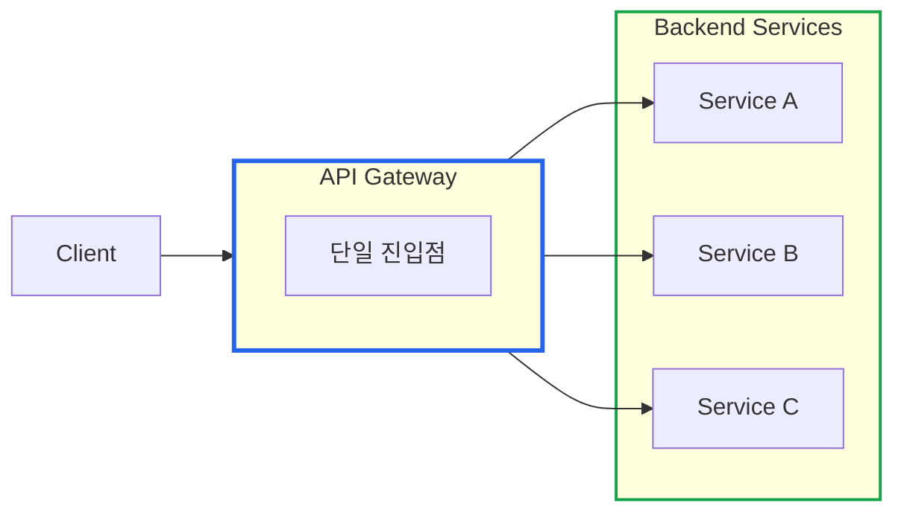
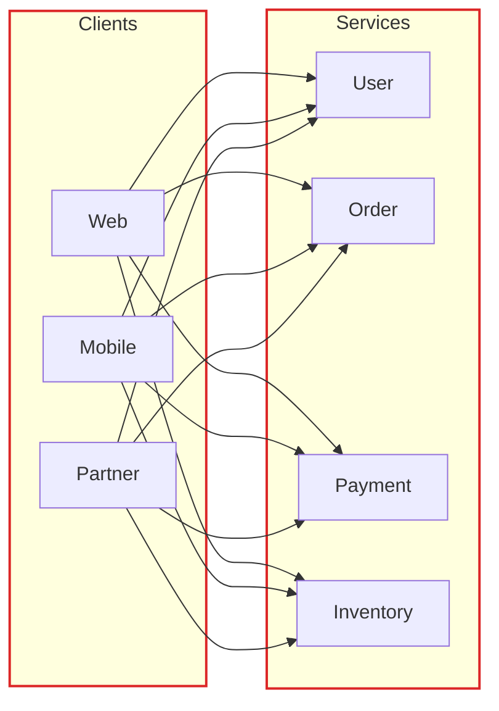
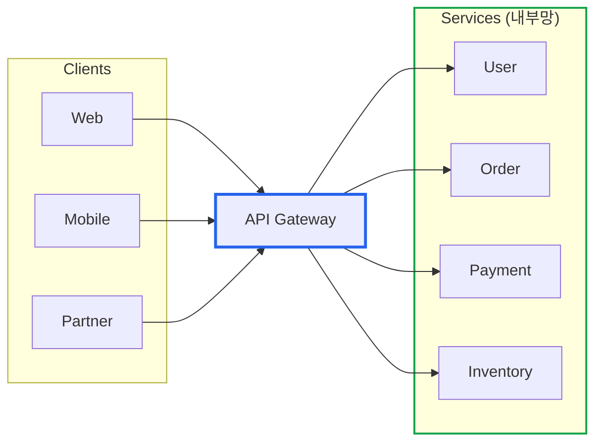
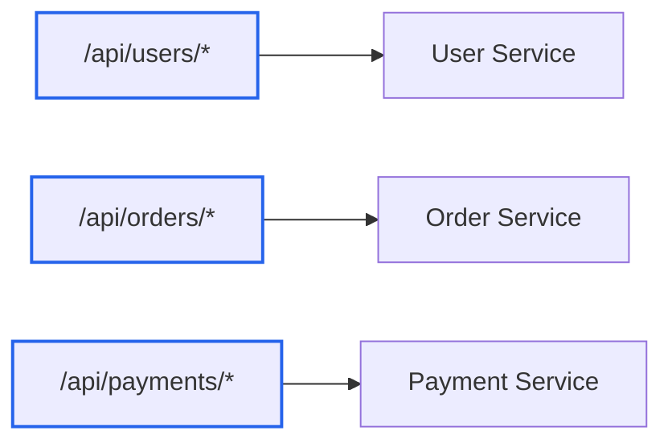
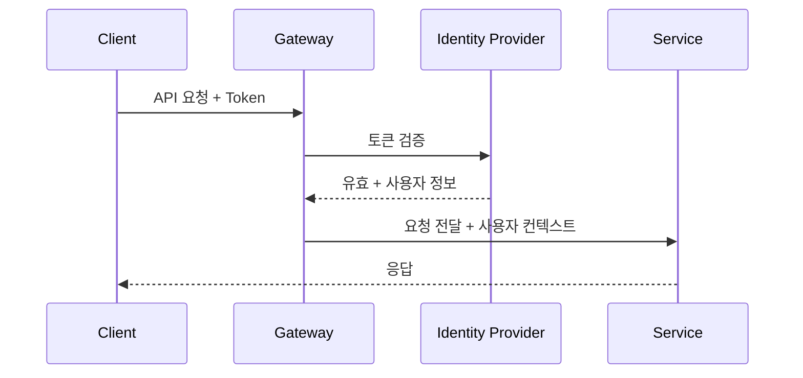
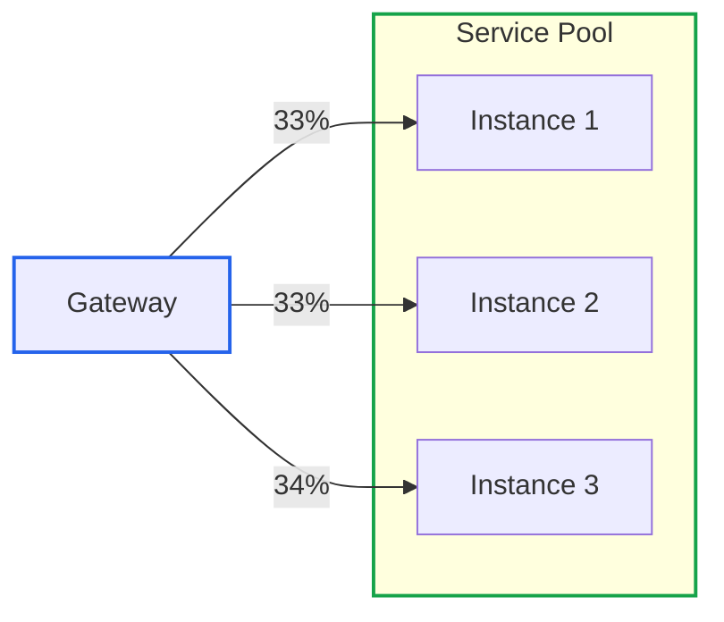
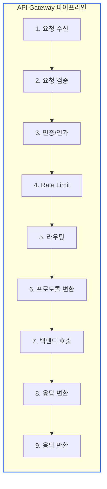
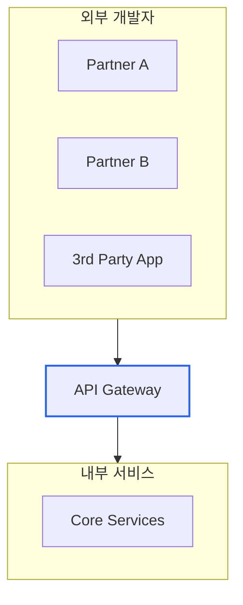
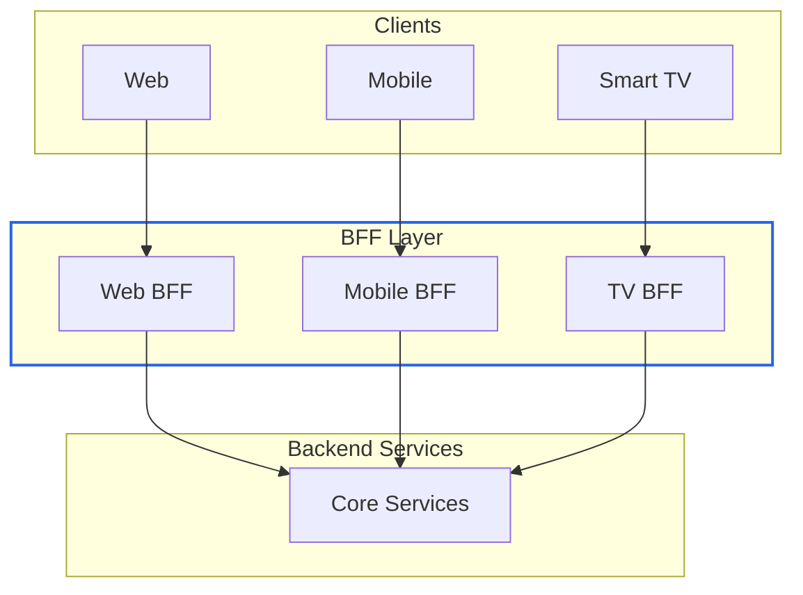

# API Gateway 입문 가이드: 마이크로서비스의 관문

> **작성일**: 2025년 12월 18일
> **카테고리**: Architecture, Microservices, Backend
> **키워드**: API Gateway, Microservices, Routing, Authentication, Rate Limiting, Load Balancing

## 요약

API Gateway는 클라이언트와 백엔드 서비스 사이에 위치하여 모든 API 요청의 단일 진입점 역할을 한다. 라우팅, 인증, Rate Limiting, 로드밸런싱, 캐싱 등 공통 관심사를 중앙에서 처리하여 보안 강화, 운영 단순화, 유연한 확장을 가능하게 한다. 이 글에서는 API Gateway의 필요성, 핵심 기능, 동작 흐름, 주요 사용 사례를 다룬다.

## API Gateway란?

**API Gateway**는 클라이언트와 백엔드 서비스 사이에 위치하여 **모든 API 요청의 단일 진입점** 역할을 하는 서버다.



### 호텔 컨시어지에 비유하면

| 역할 | 호텔 컨시어지 | API Gateway |
|------|--------------|-------------|
| **단일 창구** | 모든 요청을 컨시어지에게 | 모든 API 요청을 Gateway에 |
| **요청 라우팅** | 적절한 부서로 연결 | 적절한 서비스로 라우팅 |
| **접근 통제** | 투숙객 확인 | 인증/인가 처리 |
| **통역** | 언어 통역 | 프로토콜 변환 |

## 왜 API Gateway가 필요한가?

### API Gateway 없이 직접 통신한다면?



**문제점:**

| 문제 | 설명 |
|------|------|
| **복잡한 연결** | 클라이언트가 모든 서비스 주소를 알아야 함 |
| **중복 로직** | 인증, 로깅을 각 서비스마다 구현 |
| **보안 취약** | 모든 서비스가 외부에 노출 |
| **변경 어려움** | 서비스 주소 변경 시 모든 클라이언트 수정 |

### API Gateway를 사용하면



**해결:**

| 해결 | 설명 |
|------|------|
| **단일 진입점** | 클라이언트는 Gateway 주소만 알면 됨 |
| **공통 로직 집중** | 인증, 로깅, Rate Limiting을 한 곳에서 |
| **보안 강화** | 백엔드 서비스는 내부망에 격리 |
| **유연한 변경** | 서비스 변경이 클라이언트에 영향 없음 |

## API Gateway의 핵심 기능

### 1. 요청 라우팅 (Request Routing)

URL 경로를 분석하여 적절한 백엔드 서비스로 요청을 전달한다.

```
GET /api/users/123     → User Service
GET /api/orders/456    → Order Service
POST /api/payments     → Payment Service
```



### 2. 인증 및 인가 (Authentication & Authorization)

모든 요청에 대해 중앙에서 보안을 처리한다.

| 단계 | 역할 | 예시 |
|------|------|------|
| **인증 (Authentication)** | "너 누구야?" | JWT 토큰 검증 |
| **인가 (Authorization)** | "이거 할 수 있어?" | 권한/역할 확인 |



### 3. Rate Limiting (속도 제한)

API 남용을 방지하고 서비스 안정성을 보장한다.

| 정책 | 설명 | 예시 |
|------|------|------|
| **요청 제한** | 시간당 요청 수 제한 | 1000 req/hour |
| **동시 연결** | 동시 연결 수 제한 | 100 concurrent |
| **대역폭** | 데이터 전송량 제한 | 100MB/day |

```
# Rate Limit 응답 예시
HTTP/1.1 429 Too Many Requests
X-RateLimit-Limit: 1000
X-RateLimit-Remaining: 0
X-RateLimit-Reset: 1702800000
Retry-After: 3600
```

### 4. 로드 밸런싱 (Load Balancing)

트래픽을 여러 서버에 분산한다.



### 5. 캐싱 (Caching)

자주 요청되는 응답을 저장하여 성능을 향상시킨다.

| 상황 | 동작 |
|------|------|
| **Cache Hit** | 저장된 응답 즉시 반환 (빠름) |
| **Cache Miss** | 백엔드 호출 후 응답 저장 |

### 6. 프로토콜 변환 (Protocol Translation)

클라이언트와 백엔드 간의 프로토콜 차이를 중재한다.

```
Client (REST/JSON) → Gateway → Backend (gRPC/Protobuf)
Client (GraphQL)   → Gateway → Backend (REST)
```

### 7. 요청/응답 변환 (Request/Response Transformation)

데이터 형식을 변환하거나 필드를 추가/제거한다.

```json
// 클라이언트 요청
{ "user_name": "john" }

// Gateway가 변환하여 백엔드로 전달
{ "userName": "john", "requestId": "uuid-123" }
```

### 8. 모니터링 및 로깅 (Observability)

모든 트래픽에 대한 가시성을 제공한다.

| 기능 | 설명 |
|------|------|
| **로깅** | 모든 요청/응답 기록 |
| **메트릭** | 지연시간, 에러율, 처리량 |
| **트레이싱** | 분산 추적 (Correlation ID) |

## API Gateway 동작 흐름

### 전체 요청 처리 파이프라인



### 각 단계 상세

| 단계 | 설명 | 실패 시 |
|------|------|---------|
| 1. 요청 수신 | HTTP 요청 파싱 | 400 Bad Request |
| 2. 요청 검증 | 필수 헤더, 형식 검증 | 400 Bad Request |
| 3. 인증/인가 | 토큰 검증, 권한 확인 | 401/403 |
| 4. Rate Limit | 요청 한도 확인 | 429 Too Many Requests |
| 5. 라우팅 | 대상 서비스 결정 | 404 Not Found |
| 6. 프로토콜 변환 | REST → gRPC 등 | 500 Internal Error |
| 7. 백엔드 호출 | 실제 서비스 호출 | 502/503/504 |
| 8. 응답 변환 | 응답 형식 변환 | 500 Internal Error |
| 9. 응답 반환 | 클라이언트에 응답 | - |

## 주요 사용 사례

### 1. API 에코시스템 확장 (Ecosystem)

외부 개발자가 API를 활용하여 앱을 만들 수 있게 한다.



**예시**: Stripe, Twilio 같은 API-first 서비스

### 2. API 마켓플레이스 (Marketplace)

API를 상품처럼 판매하고 과금할 수 있다.

| 기능 | 설명 |
|------|------|
| **API 카탈로그** | 사용 가능한 API 목록 |
| **구독 관리** | 플랜별 기능 차별화 |
| **사용량 추적** | 호출 수 기반 과금 |
| **개발자 포털** | 문서, SDK, 테스트 환경 |

### 3. 멀티 플랫폼 지원 (Multi-Platform)

다양한 클라이언트에 맞춤 API를 제공한다.

| 클라이언트 | 요구사항 | Gateway 처리 |
|-----------|----------|-------------|
| **Web** | 풍부한 데이터 | 전체 응답 |
| **Mobile** | 경량 데이터 | 필드 필터링 |
| **IoT** | 최소 데이터 | 압축, 필수만 |

### 4. Backend for Frontend (BFF)

각 클라이언트 유형에 최적화된 API를 제공한다.



## API Gateway 선택 가이드

### 주요 오픈소스 API Gateway

| Gateway | 특징 | 적합한 환경 |
|---------|------|------------|
| **Kong** | 플러그인 생태계, Lua 기반 | 엔터프라이즈, 복잡한 요구사항 |
| **Envoy** | L7 프록시, xDS API, CNCF | Kubernetes, 서비스 메시 |
| **APISIX** | 고성능, Lua/WASM 플러그인 | 고트래픽, 실시간 |
| **Traefik** | 자동 설정, Kubernetes 친화적 | Kubernetes, Docker |

### 클라우드 관리형 서비스

| 서비스 | 특징 |
|--------|------|
| **AWS API Gateway** | Lambda 통합, 서버리스 |
| **Google Cloud Endpoints** | GCP 통합, gRPC 지원 |
| **Azure API Management** | Azure 통합, 개발자 포털 |

### 선택 기준

| 기준 | 고려사항 |
|------|---------|
| **트래픽 규모** | 초당 요청 수, 피크 트래픽 |
| **확장성** | 수평 확장, 멀티 리전 |
| **보안 요구사항** | mTLS, WAF, DDoS 방어 |
| **개발자 경험** | 문서, SDK, 테스트 도구 |
| **운영 복잡도** | 셀프호스팅 vs 관리형 |
| **비용** | 요청당 과금 vs 고정 비용 |

## 결론

### API Gateway의 핵심 가치

| 가치 | 설명 |
|------|------|
| **단순화** | 클라이언트는 단일 엔드포인트만 알면 됨 |
| **보안** | 인증/인가를 중앙에서 처리 |
| **유연성** | 백엔드 변경이 클라이언트에 영향 없음 |
| **가시성** | 모든 트래픽 모니터링 |

### API Gateway가 필요한 경우

- 마이크로서비스 아키텍처
- 외부 개발자에게 API 제공
- 다양한 클라이언트 (웹, 모바일, IoT) 지원
- 중앙 집중식 보안/모니터링 필요

### API Gateway가 과할 수 있는 경우

- 단일 모놀리식 애플리케이션
- 내부 서비스 간 직접 통신만 필요
- 매우 단순한 API 구조

## 참고 자료

### 공식 문서
- [Kong Documentation](https://docs.konghq.com/)
- [Envoy Gateway](https://gateway.envoyproxy.io/)
- [AWS API Gateway](https://aws.amazon.com/api-gateway/)
- [Kubernetes Gateway API](https://gateway-api.sigs.k8s.io/)

### 학습 자료
- [Microservices Patterns - API Gateway](https://microservices.io/patterns/apigateway.html)
- [ByteByteGo - API Gateway 101](https://blog.bytebytego.com/)
- [Martin Fowler - Backends For Frontends](https://martinfowler.com/articles/backends-for-frontends.html)
