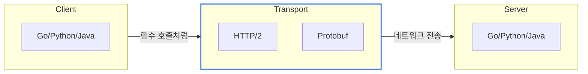
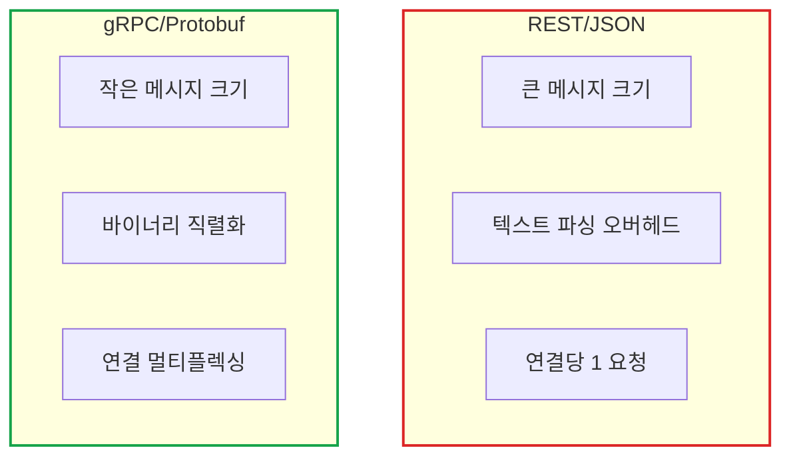
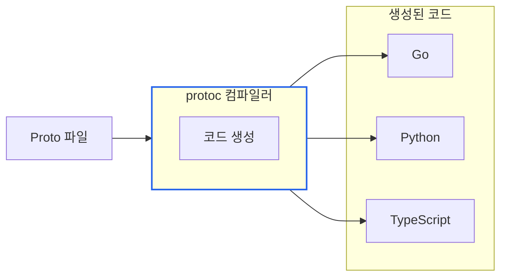
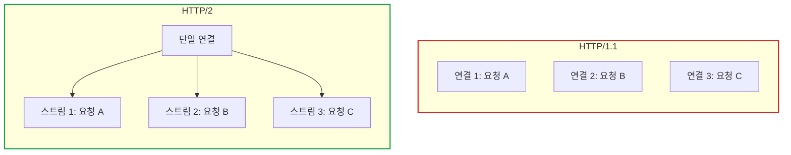
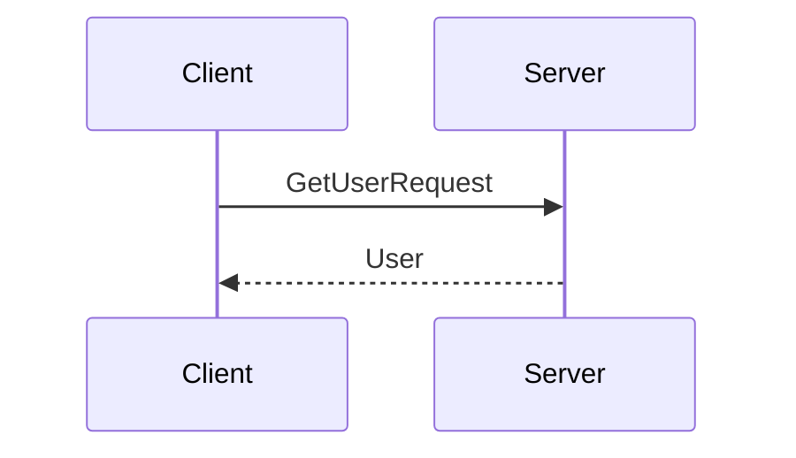
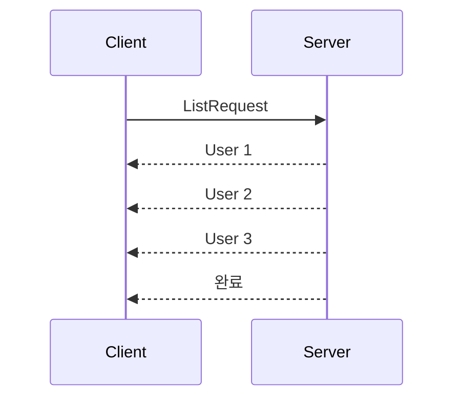
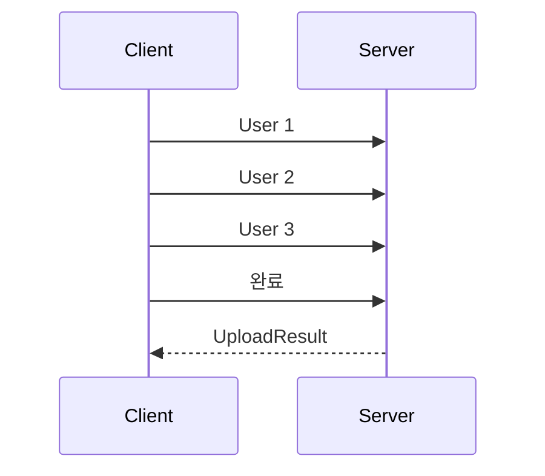
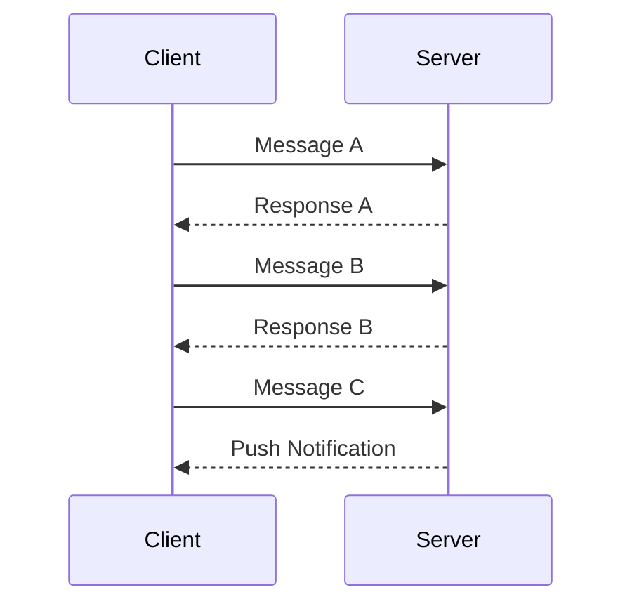
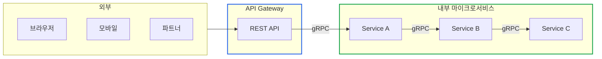

# gRPC 완전 가이드: REST와의 비교부터 실전 활용까지

> **작성일**: 2025년 12월 18일
> **카테고리**: Backend, Protocol, Microservices
> **키워드**: gRPC, REST, Protocol Buffers, HTTP/2, Microservices, Streaming

## 요약

gRPC는 Google이 개발한 고성능 RPC 프레임워크로, Protocol Buffers와 HTTP/2를 기반으로 한다. REST와 비교하여 바이너리 직렬화로 60-70% 작은 메시지 크기, HTTP/2 멀티플렉싱으로 동시 요청 처리, 양방향 스트리밍 등의 장점이 있다. 이 글에서는 gRPC의 핵심 개념, REST와의 차이점, 4가지 통신 패턴, 실전 활용 가이드를 다룬다.

## gRPC란?

**gRPC**는 Google이 개발한 **고성능 원격 프로시저 호출(RPC)** 프레임워크다.



### gRPC의 핵심 구성 요소

| 구성 요소 | 역할 |
|----------|------|
| **Protocol Buffers** | 데이터 직렬화 형식 (IDL) |
| **HTTP/2** | 전송 프로토콜 |
| **Code Generator** | 여러 언어용 클라이언트/서버 코드 생성 |

## REST vs gRPC

### 비교 요약

| 항목 | REST | gRPC |
|------|------|------|
| **프로토콜** | HTTP/1.1 | HTTP/2 |
| **데이터 형식** | JSON (텍스트) | Protobuf (바이너리) |
| **계약 정의** | OpenAPI (선택적) | Proto 파일 (필수) |
| **스트리밍** | 제한적 (SSE, WebSocket) | 네이티브 지원 |
| **브라우저 지원** | 완벽 | 제한적 (gRPC-Web) |
| **사용 사례** | 외부 API, 웹 서비스 | 내부 마이크로서비스 |

### 성능 비교



### 메시지 크기 비교

```json
// REST JSON - 약 82 bytes
{
  "userId": "12345",
  "userName": "John Doe",
  "email": "john@example.com",
  "age": 30
}
```

```protobuf
// gRPC Protobuf - 약 30 bytes (바이너리)
// 필드 번호 + 타입 + 값으로 압축
```

gRPC는 동일한 데이터를 **약 60-70% 더 작게** 전송한다.

### 언제 무엇을 선택할까?

| 상황 | 추천 |
|------|------|
| 외부 개발자용 Public API | **REST** - 접근성, 도구 지원 |
| 브라우저 직접 호출 | **REST** - 네이티브 지원 |
| 내부 마이크로서비스 통신 | **gRPC** - 성능, 타입 안정성 |
| 실시간 양방향 통신 | **gRPC** - 스트리밍 지원 |
| 대용량 데이터 전송 | **gRPC** - 효율적 직렬화 |

## Protocol Buffers

**Protocol Buffers (Protobuf)**는 gRPC의 기본 데이터 형식이다.

### Proto 파일 구조

```protobuf
// user.proto
syntax = "proto3";

package user;

// 메시지 정의 (데이터 구조)
message User {
  string id = 1;        // 필드 번호 = 1
  string name = 2;      // 필드 번호 = 2
  string email = 3;     // 필드 번호 = 3
  int32 age = 4;        // 필드 번호 = 4
}

// 서비스 정의 (API 인터페이스)
service UserService {
  rpc GetUser(GetUserRequest) returns (User);
  rpc CreateUser(CreateUserRequest) returns (User);
  rpc ListUsers(ListUsersRequest) returns (stream User);
}

message GetUserRequest {
  string user_id = 1;
}

message CreateUserRequest {
  string name = 1;
  string email = 2;
  int32 age = 3;
}

message ListUsersRequest {
  int32 page_size = 1;
}
```

### 코드 생성 흐름



### Proto 파일의 장점

| 장점 | 설명 |
|------|------|
| **계약 우선 (Contract First)** | API 스펙이 코드보다 먼저 정의됨 |
| **타입 안정성** | 컴파일 타임에 타입 검증 |
| **다중 언어 지원** | 한 번 정의, 여러 언어로 생성 |
| **버전 호환성** | 필드 번호로 하위 호환성 유지 |

### 필드 번호의 중요성

```protobuf
message User {
  string id = 1;      // 절대 변경 금지!
  string name = 2;    // 절대 변경 금지!
  // string email = 3; // 삭제됨 - 3번은 재사용 금지
  int32 age = 4;
  string phone = 5;   // 새 필드는 새 번호로
}
```

필드 번호는 바이너리 인코딩에 사용된다. 한번 정해진 번호는 **절대 변경하면 안 된다**.

## HTTP/2의 장점

gRPC는 HTTP/2를 사용하여 여러 성능 이점을 얻는다.

### HTTP/1.1 vs HTTP/2

| 특성 | HTTP/1.1 | HTTP/2 |
|------|----------|--------|
| **연결당 요청** | 1개 (Head-of-Line Blocking) | **다중 스트림** |
| **헤더** | 매번 전송 (텍스트) | **HPACK 압축** |
| **서버 → 클라이언트** | 응답만 가능 | **서버 푸시 가능** |
| **데이터 형식** | 텍스트 | **바이너리 프레임** |

### 멀티플렉싱 (Multiplexing)



**HTTP/1.1**: 요청마다 별도 TCP 연결 필요
**HTTP/2**: 하나의 연결에서 여러 요청을 동시에 처리

## gRPC 통신 패턴

gRPC는 **4가지 통신 패턴**을 지원한다.

### 1. Unary RPC (단일 요청-응답)

가장 기본적인 패턴이다. REST API와 유사하다.

```protobuf
rpc GetUser(GetUserRequest) returns (User);
```



### 2. Server Streaming RPC

서버가 여러 응답을 스트림으로 전송한다.

```protobuf
rpc ListUsers(ListRequest) returns (stream User);
```



**사용 사례**: 대용량 데이터 조회, 실시간 피드

### 3. Client Streaming RPC

클라이언트가 여러 요청을 스트림으로 전송한다.

```protobuf
rpc UploadUsers(stream User) returns (UploadResult);
```



**사용 사례**: 파일 업로드, 배치 데이터 전송

### 4. Bidirectional Streaming RPC

**양방향 스트리밍**: 클라이언트와 서버가 동시에 데이터를 주고받는다.

```protobuf
rpc Chat(stream Message) returns (stream Message);
```



**사용 사례**: 채팅, 실시간 게임, Agent 통신

### 패턴 요약

| 패턴 | 요청 | 응답 | 사용 사례 |
|------|------|------|----------|
| **Unary** | 1 | 1 | 일반 API 호출 |
| **Server Streaming** | 1 | N | 대용량 데이터, 피드 |
| **Client Streaming** | N | 1 | 파일 업로드, 배치 |
| **Bidirectional** | N | N | 실시간 통신, 채팅 |

## 실전 활용

### Go에서 gRPC 서버 구현

```go
package main

import (
    "context"
    "log"
    "net"

    pb "example/proto"
    "google.golang.org/grpc"
)

type server struct {
    pb.UnimplementedUserServiceServer
}

func (s *server) GetUser(ctx context.Context, req *pb.GetUserRequest) (*pb.User, error) {
    // 사용자 조회 로직
    return &pb.User{
        Id:    req.UserId,
        Name:  "John Doe",
        Email: "john@example.com",
    }, nil
}

func main() {
    lis, _ := net.Listen("tcp", ":50051")
    s := grpc.NewServer()
    pb.RegisterUserServiceServer(s, &server{})
    log.Printf("gRPC server listening on :50051")
    s.Serve(lis)
}
```

### Go에서 gRPC 클라이언트 구현

```go
package main

import (
    "context"
    "log"

    pb "example/proto"
    "google.golang.org/grpc"
    "google.golang.org/grpc/credentials/insecure"
)

func main() {
    conn, _ := grpc.NewClient("localhost:50051",
        grpc.WithTransportCredentials(insecure.NewCredentials()))
    defer conn.Close()

    client := pb.NewUserServiceClient(conn)

    user, _ := client.GetUser(context.Background(), &pb.GetUserRequest{
        UserId: "123",
    })

    log.Printf("User: %v", user)
}
```

### 양방향 스트리밍 예시

```go
// 서버
func (s *server) Chat(stream pb.ChatService_ChatServer) error {
    for {
        msg, err := stream.Recv()
        if err == io.EOF {
            return nil
        }

        // 응답 전송
        stream.Send(&pb.Message{
            Content: "Echo: " + msg.Content,
        })
    }
}

// 클라이언트
func chat(client pb.ChatServiceClient) {
    stream, _ := client.Chat(context.Background())

    // 송신 고루틴
    go func() {
        for _, msg := range messages {
            stream.Send(&pb.Message{Content: msg})
        }
        stream.CloseSend()
    }()

    // 수신
    for {
        reply, err := stream.Recv()
        if err == io.EOF {
            break
        }
        log.Printf("Received: %s", reply.Content)
    }
}
```

### gRPC Interceptor (미들웨어)

```go
// 서버 인터셉터
func loggingInterceptor(
    ctx context.Context,
    req interface{},
    info *grpc.UnaryServerInfo,
    handler grpc.UnaryHandler,
) (interface{}, error) {
    start := time.Now()

    // 핸들러 실행
    resp, err := handler(ctx, req)

    // 로깅
    log.Printf("Method: %s, Duration: %v, Error: %v",
        info.FullMethod, time.Since(start), err)

    return resp, err
}

// 서버에 인터셉터 등록
s := grpc.NewServer(
    grpc.UnaryInterceptor(loggingInterceptor),
)
```

## 결론

### gRPC를 사용해야 할 때

- 내부 마이크로서비스 통신
- 실시간 양방향 통신이 필요할 때
- 높은 성능이 필요할 때
- 다중 언어 환경

### REST를 사용해야 할 때

- Public API (외부 개발자용)
- 브라우저 직접 호출
- 단순한 CRUD 작업
- 디버깅 용이성이 중요할 때

### 하이브리드 접근

실제 시스템에서는 두 가지를 함께 사용하는 경우가 많다:
- **외부 API**: REST (접근성, 호환성)
- **내부 통신**: gRPC (성능, 타입 안정성)



## 참고 자료

### 공식 문서
- [gRPC 공식 문서](https://grpc.io/docs/)
- [Protocol Buffers 가이드](https://protobuf.dev/overview/)
- [HTTP/2 소개](https://developers.google.com/web/fundamentals/performance/http2)

### 도구
- [grpcurl](https://github.com/fullstorydev/grpcurl) - gRPC용 curl
- [grpc-gateway](https://github.com/grpc-ecosystem/grpc-gateway) - REST ↔ gRPC 변환
- [buf](https://buf.build/) - Protobuf 관리 도구

### 학습 자료
- [Awesome gRPC](https://github.com/grpc-ecosystem/awesome-grpc)
