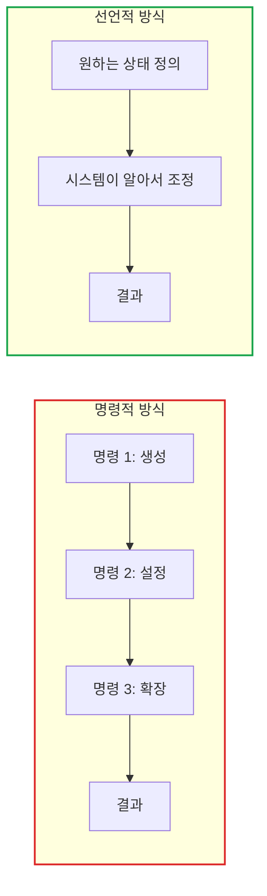
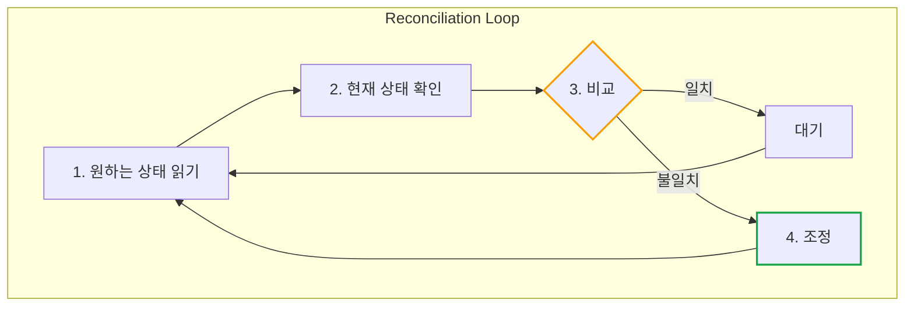
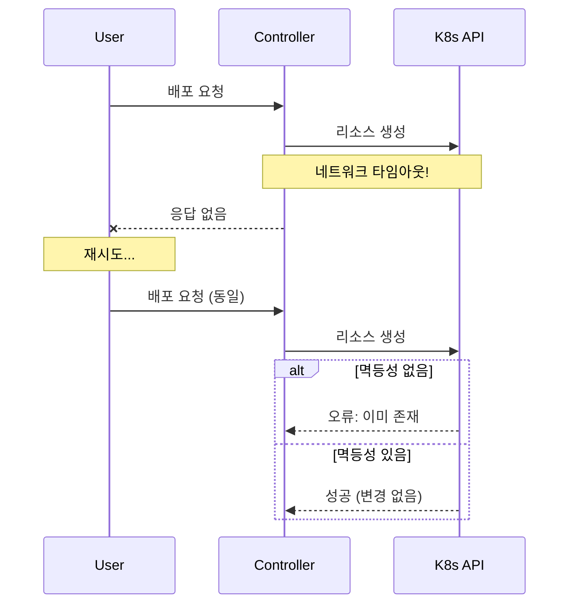
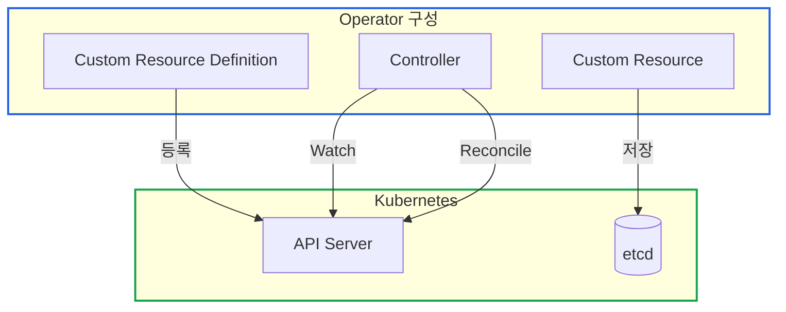

# Kubernetes Operator 패턴과 Reconciliation: 선언적 인프라의 핵심

> **작성일**: 2025년 12월 18일
> **카테고리**: Kubernetes, Infrastructure, Design Pattern
> **키워드**: Kubernetes, Operator, Reconciliation, Controller, Idempotency, CRD

## 요약

Kubernetes의 핵심 철학인 "선언적 상태 관리"가 어떻게 동작하는지 Operator 패턴과 Reconciliation Loop를 통해 설명한다. `kubectl apply`가 왜 `kubectl create`보다 권장되는지, 멱등성(Idempotency)이 분산 시스템에서 왜 필수인지, 그리고 Operator 패턴이 어떤 문제를 해결하는지 다룬다.

## 선언적 vs 명령적

집안 온도 조절에 비유하면:
- **명령적**: "에어컨 켜. 10분 후에 꺼. 추우면 다시 켜."
- **선언적**: "25도로 맞춰줘" → 에어컨이 알아서 조절

Kubernetes는 선언적 방식이다. "Pod 3개가 실행 중이어야 해"라고 말하면, Kubernetes가 알아서 현재 상태를 확인하고 필요한 만큼 조정한다.

### 명령적(Imperative) 방식

```bash
# 명령적: "이렇게 해라"
kubectl run nginx --image=nginx
kubectl scale deployment nginx --replicas=3
kubectl expose deployment nginx --port=80
```

**특징:**
- 순서가 중요 (scale 전에 run 필수)
- 현재 상태를 알아야 함
- 실패 시 어디서 멈췄는지 추적 필요

### 선언적(Declarative) 방식

```yaml
# 선언적: "이 상태가 되어야 한다"
apiVersion: apps/v1
kind: Deployment
metadata:
  name: nginx
spec:
  replicas: 3
  selector:
    matchLabels:
      app: nginx
  template:
    spec:
      containers:
        - name: nginx
          image: nginx
---
apiVersion: v1
kind: Service
metadata:
  name: nginx
spec:
  ports:
    - port: 80
  selector:
    app: nginx
```

```bash
kubectl apply -f nginx.yaml  # 몇 번을 실행해도 같은 결과
```

**특징:**
- 순서 무관 (Kubernetes가 알아서 처리)
- 현재 상태 몰라도 됨
- **멱등성** 보장

### 핵심 차이



| 비교 | 명령적 | 선언적 |
|------|--------|--------|
| 관심사 | **어떻게** (How) | **무엇을** (What) |
| 순서 | 중요 | 무관 |
| 재실행 | 오류 가능 | 안전 (멱등성) |
| 상태 추적 | 직접 관리 | 시스템이 관리 |

## Reconciliation Loop

집 청소 로봇에 비유하면:
1. **원하는 상태**: "거실이 깨끗해야 해"
2. **현재 상태 확인**: 센서로 바닥 스캔
3. **비교**: "먼지가 있네!"
4. **조정**: 먼지 청소
5. **반복**: 다시 스캔 → 깨끗하면 대기

청소 로봇이 "깨끗한 상태"를 유지하려고 계속 확인하는 것처럼, Kubernetes Controller도 "원하는 상태"를 유지하려고 무한 반복한다.

### 기본 구조



### 코드로 보는 Reconciliation

```go
// Kubernetes Controller의 기본 구조
func (r *Reconciler) Reconcile(ctx context.Context, req ctrl.Request) (ctrl.Result, error) {
    // 1. 원하는 상태 (Desired State) 가져오기
    var desired MyResource
    if err := r.Get(ctx, req.NamespacedName, &desired); err != nil {
        return ctrl.Result{}, client.IgnoreNotFound(err)
    }

    // 2. 현재 상태 (Current State) 확인
    var current corev1.Pod
    err := r.Get(ctx, types.NamespacedName{Name: desired.Name}, &current)

    // 3. 비교 (Diff)
    if errors.IsNotFound(err) {
        // 없으면 생성
        return r.createResource(ctx, &desired)
    }

    if !reflect.DeepEqual(desired.Spec, current.Spec) {
        // 다르면 업데이트
        return r.updateResource(ctx, &desired, &current)
    }

    // 4. 일치하면 아무것도 안 함
    return ctrl.Result{}, nil
}
```

### Reconciliation의 트리거

| 트리거 | 설명 | 예시 |
|--------|------|------|
| **Create** | 새 리소스 생성 | `kubectl apply` |
| **Update** | 리소스 수정 | Spec 변경 |
| **Delete** | 리소스 삭제 | `kubectl delete` |
| **Resync** | 주기적 재확인 | 기본 10시간마다 |
| **Dependent** | 의존 리소스 변경 | Pod이 죽었을 때 Deployment 재조정 |

## 멱등성(Idempotency)

### 정의

**멱등성**: 같은 연산을 여러 번 적용해도 결과가 달라지지 않는 성질

```
f(f(x)) = f(x)
```

### 왜 중요한가?



**분산 시스템에서 멱등성이 필수인 이유:**
- 네트워크 실패 시 재시도 안전
- 중복 요청 처리 가능
- At-least-once 전달 보장에서 정확성 유지

### 멱등성 구현 패턴

#### 1. Create-or-Update 패턴

```go
// 비멱등적: 두 번 실행하면 오류
func createPod(pod *corev1.Pod) error {
    return client.Create(ctx, pod)
}

// 멱등적: 몇 번을 실행해도 안전
func createOrUpdatePod(pod *corev1.Pod) error {
    existing := &corev1.Pod{}
    err := client.Get(ctx, types.NamespacedName{Name: pod.Name}, existing)

    if errors.IsNotFound(err) {
        // 없으면 생성
        return client.Create(ctx, pod)
    }

    // 있으면 업데이트
    existing.Spec = pod.Spec
    return client.Update(ctx, existing)
}
```

#### 2. Server-Side Apply (SSA)

```go
// 가장 권장되는 방식
func applyPod(pod *corev1.Pod) error {
    return client.Patch(ctx, pod, client.Apply, client.FieldOwner("my-controller"))
}
```

**SSA의 장점:**
- 자동으로 멱등성 보장
- 필드별 소유권 관리
- 충돌 자동 해결

#### 3. 상태 기반 비교

```go
// 원하는 상태와 현재 상태의 해시 비교
func needsUpdate(desired, current *MyResource) bool {
    desiredHash := hash(desired.Spec)
    currentHash := current.Annotations["spec-hash"]
    return desiredHash != currentHash
}
```

## Operator 패턴

### Operator란?

**Operator** = Custom Resource Definition (CRD) + Custom Controller

Kubernetes의 기본 리소스(Pod, Service)로 표현하기 어려운 애플리케이션을 관리하기 위한 패턴이다.

### Operator의 구성요소



### Operator 예시: PostgreSQL Operator

```yaml
# 1. CRD 정의 (한 번만)
apiVersion: apiextensions.k8s.io/v1
kind: CustomResourceDefinition
metadata:
  name: postgresclusters.postgres-operator.crunchydata.com
spec:
  group: postgres-operator.crunchydata.com
  names:
    kind: PostgresCluster
    plural: postgresclusters
  scope: Namespaced
  versions:
    - name: v1beta1
      schema:
        openAPIV3Schema:
          type: object
          properties:
            spec:
              type: object
              properties:
                postgresVersion:
                  type: integer
                instances:
                  type: array
```

```yaml
# 2. Custom Resource 생성 (사용자가)
apiVersion: postgres-operator.crunchydata.com/v1beta1
kind: PostgresCluster
metadata:
  name: my-postgres
spec:
  postgresVersion: 15
  instances:
    - name: primary
      replicas: 1
      dataVolumeClaimSpec:
        accessModes: ["ReadWriteOnce"]
        resources:
          requests:
            storage: 10Gi
```

```go
// 3. Controller의 Reconcile (Operator가)
func (r *PostgresClusterReconciler) Reconcile(ctx context.Context, req ctrl.Request) (ctrl.Result, error) {
    var cluster PostgresCluster
    r.Get(ctx, req.NamespacedName, &cluster)

    // PostgreSQL StatefulSet 생성/업데이트
    r.reconcileStatefulSet(ctx, &cluster)

    // Service 생성/업데이트
    r.reconcileService(ctx, &cluster)

    // Secret (비밀번호) 생성/업데이트
    r.reconcileSecrets(ctx, &cluster)

    // 백업 CronJob 설정
    r.reconcileBackups(ctx, &cluster)

    return ctrl.Result{}, nil
}
```

### Operator Capability Levels

| Level | 이름 | 기능 |
|-------|------|------|
| 1 | Basic Install | 설치 자동화 |
| 2 | Seamless Upgrades | 업그레이드 자동화 |
| 3 | Full Lifecycle | 백업, 복구, 장애 복구 |
| 4 | Deep Insights | 메트릭, 로깅, 알림 |
| 5 | Auto Pilot | 자동 스케일링, 자가 치유 |

## 실전 적용 가이드

### Operator를 사용해야 하는 경우

| 상황 | 추천 |
|------|------|
| 상태가 있는 애플리케이션 (DB, 캐시) | Operator |
| 복잡한 라이프사이클 관리 필요 | Operator |
| GitOps 워크플로우 | Operator |
| 단일 클러스터 운영 | Operator |

### Operator 대신 다른 패턴을 고려할 경우

| 상황 | 대안 |
|------|------|
| 비개발자가 관리 | Agent + Web UI |
| 멀티 클러스터/멀티 리전 | 중앙 Control Plane + Agent |
| 복잡한 비즈니스 로직 (과금, 권한) | API Server + Agent |
| SaaS 플랫폼 구축 | Agent 패턴 |

### Reconciliation 구현 체크리스트

**멱등성:**
- Create → CreateOrUpdate 패턴 사용
- Server-Side Apply 사용 고려
- 재실행해도 안전한지 테스트

**상태 관리:**
- 원하는 상태(Desired)와 현재 상태(Current) 명확히 분리
- 상태 비교 로직 구현
- 고아 리소스 정리 로직 구현

**에러 처리:**
- 일시적 오류 시 재시도 (Requeue)
- 영구적 오류 시 상태 기록 (Status)
- 재시도 간격 점진적 증가 (Exponential Backoff)

**성능:**
- 불필요한 업데이트 방지 (Generation/ResourceVersion 체크)
- Watch 필터 적용 (Label Selector)
- Rate Limiting 설정

### 완전한 Reconciliation 코드 예시

```go
func (r *Reconciler) Reconcile(ctx context.Context, req ctrl.Request) (ctrl.Result, error) {
    log := log.FromContext(ctx)

    // 1. 원하는 상태 가져오기
    var desired MyResource
    if err := r.Get(ctx, req.NamespacedName, &desired); err != nil {
        if errors.IsNotFound(err) {
            // 리소스가 삭제됨 - 정리 작업
            return ctrl.Result{}, nil
        }
        return ctrl.Result{}, err
    }

    // 2. Finalizer 처리 (삭제 전 정리)
    if !desired.DeletionTimestamp.IsZero() {
        return r.handleDeletion(ctx, &desired)
    }

    // 3. 하위 리소스 Reconcile
    if err := r.reconcileDeployment(ctx, &desired); err != nil {
        // 일시적 오류 - 재시도
        return ctrl.Result{RequeueAfter: time.Second * 30}, err
    }

    if err := r.reconcileService(ctx, &desired); err != nil {
        return ctrl.Result{RequeueAfter: time.Second * 30}, err
    }

    // 4. 고아 리소스 정리
    if err := r.cleanupOrphans(ctx, &desired); err != nil {
        log.Error(err, "Failed to cleanup orphans")
    }

    // 5. 상태 업데이트
    desired.Status.Ready = true
    desired.Status.LastReconciled = metav1.Now()
    if err := r.Status().Update(ctx, &desired); err != nil {
        return ctrl.Result{}, err
    }

    return ctrl.Result{}, nil
}
```

## 결론

### 핵심 개념 정리

| 개념 | 설명 | 중요성 |
|------|------|--------|
| **선언적** | "무엇을"을 정의, "어떻게"는 시스템이 | K8s의 근본 철학 |
| **Reconciliation** | 현재→원하는 상태로 조정하는 루프 | 모든 Controller의 동작 원리 |
| **멱등성** | 여러 번 실행해도 같은 결과 | 분산 시스템의 필수 요소 |
| **Operator** | CRD + Controller | 복잡한 앱 관리 자동화 |

### Operator 패턴의 장점

1. **자동화**: 반복적인 운영 작업 자동화
2. **일관성**: 선언적 방식으로 상태 일관성 보장
3. **복구**: 장애 발생 시 자동 복구
4. **확장성**: Kubernetes 네이티브 확장

### 언제 Operator를 직접 개발할까?

- 기존 Operator가 요구사항을 충족하지 못할 때
- 조직 특화된 운영 로직이 필요할 때
- 복잡한 상태 관리가 필요한 애플리케이션을 운영할 때

## 참고 자료

### 공식 문서
- [Kubernetes Controllers](https://kubernetes.io/docs/concepts/architecture/controller/)
- [Operator Pattern](https://kubernetes.io/docs/concepts/extend-kubernetes/operator/)
- [Server-Side Apply](https://kubernetes.io/docs/reference/using-api/server-side-apply/)

### 개발 도구
- [Kubebuilder Book](https://book.kubebuilder.io/)
- [Operator SDK](https://sdk.operatorframework.io/)
- [controller-runtime](https://github.com/kubernetes-sigs/controller-runtime)

### 학습 자료
- [OperatorHub.io](https://operatorhub.io/) - 기존 Operator 목록
- [Kubernetes API Conventions](https://github.com/kubernetes/community/blob/master/contributors/devel/sig-architecture/api-conventions.md)
