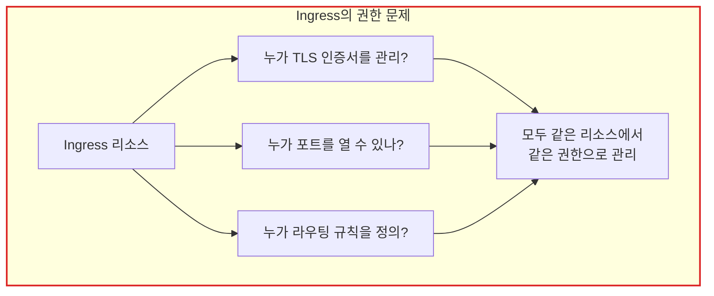
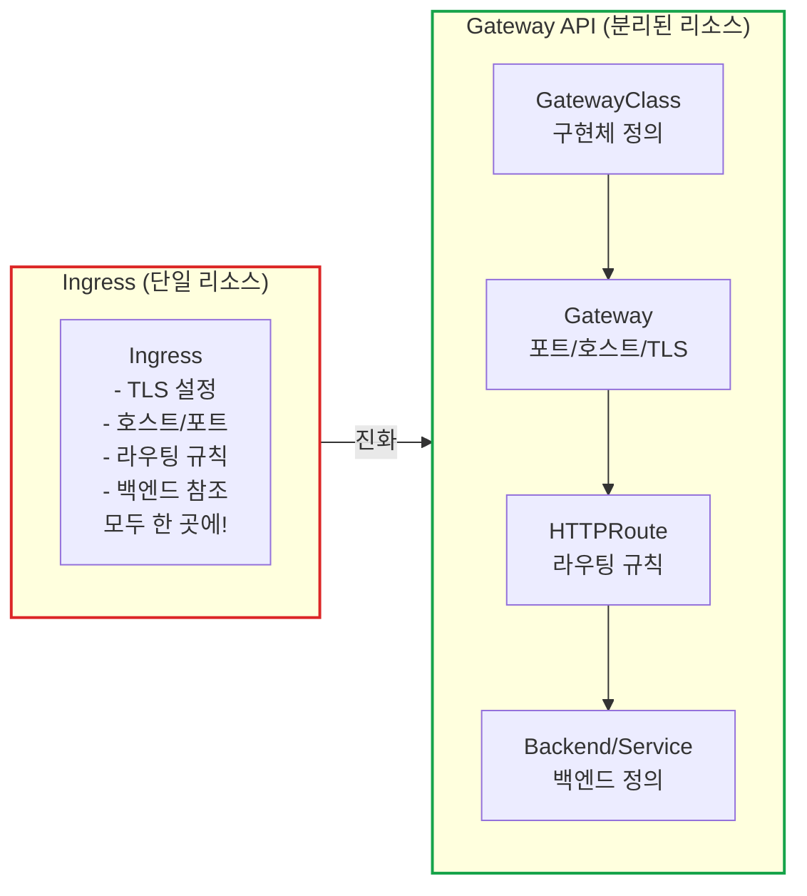
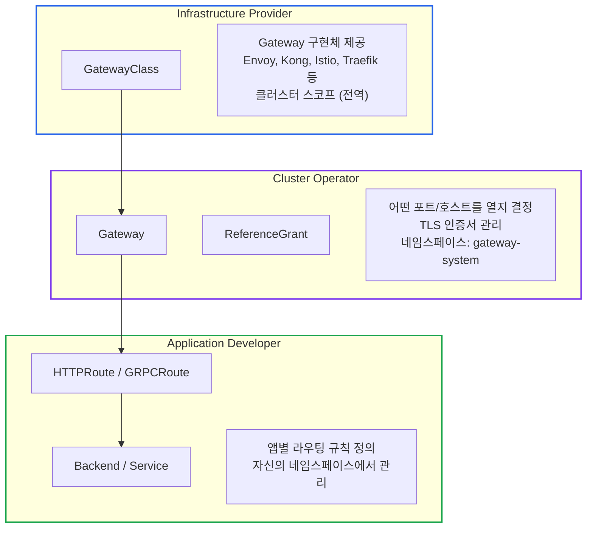
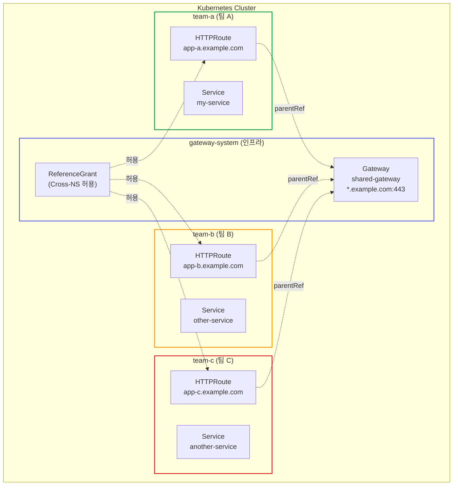
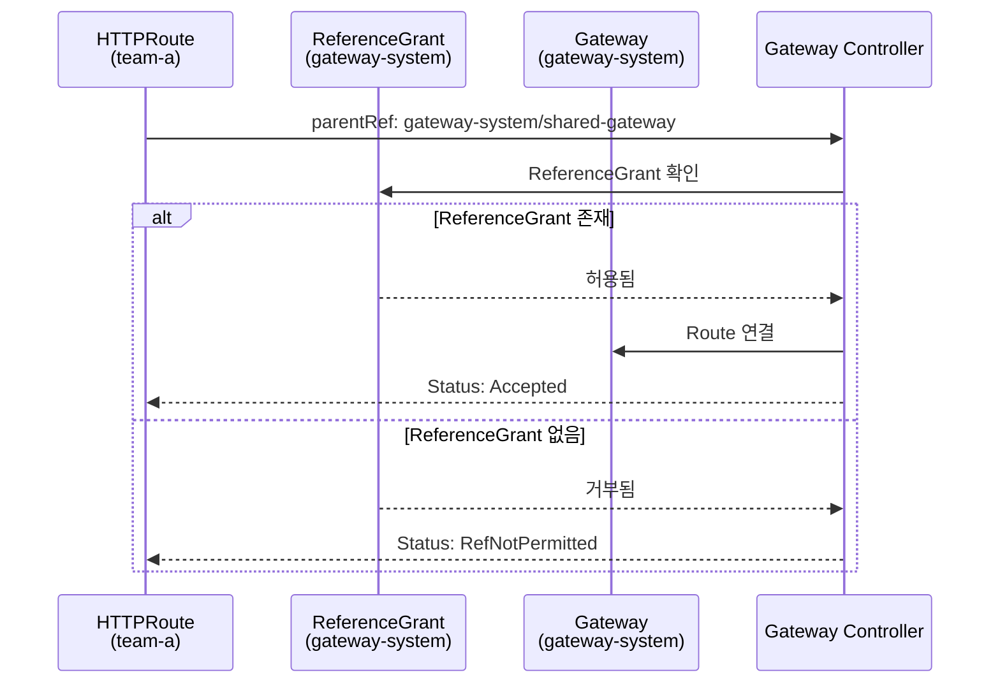
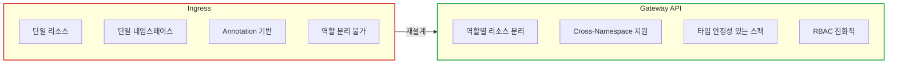
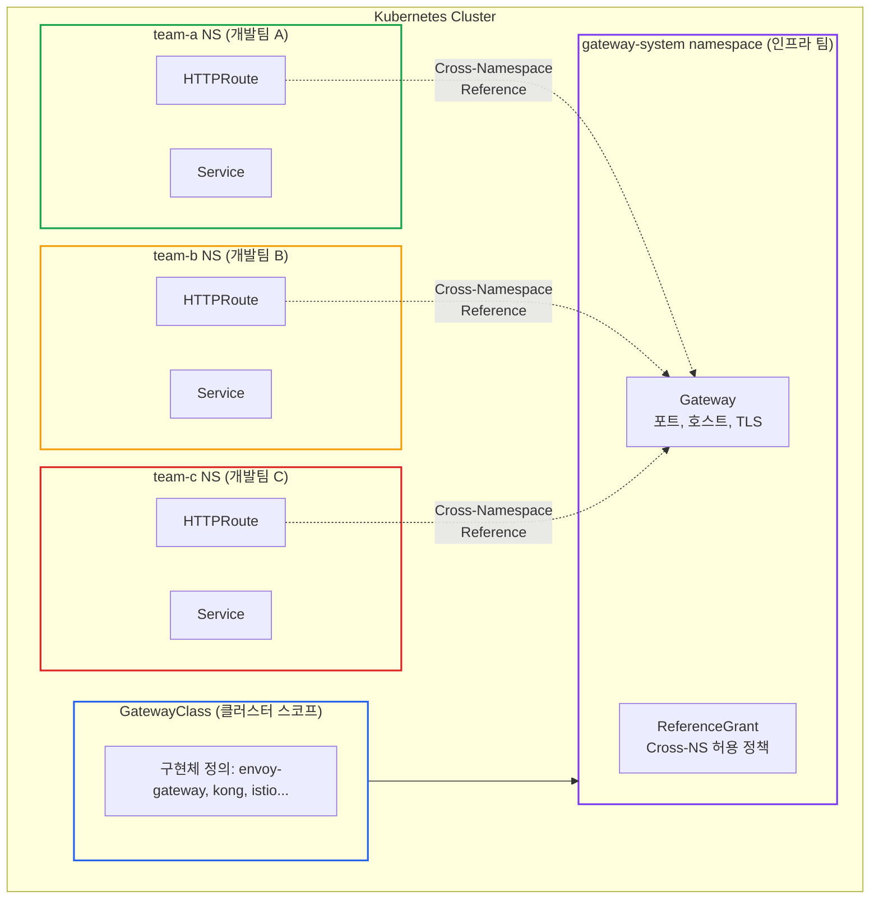

# Kubernetes Gateway API 설계 철학: Ingress를 넘어서

> **작성일**: 2025년 12월 18일
> **카테고리**: Kubernetes, Networking, Architecture
> **키워드**: Gateway API, Ingress, Cross-Namespace Reference, ReferenceGrant, Kubernetes

## 요약

Kubernetes Gateway API는 Ingress의 한계를 해결하기 위해 처음부터 다시 설계된 API다. Role-Oriented Design을 통해 Infrastructure Provider, Cluster Operator, Application Developer 역할을 명확히 분리하고, Cross-Namespace Reference와 ReferenceGrant를 통해 멀티테넌시 환경에서 안전한 리소스 공유를 지원한다. 이 글에서는 Ingress의 문제점, Gateway API의 설계 원칙, 그리고 실제 적용 방법을 다룬다.

## 들어가며

Kubernetes에서 API를 외부에 노출하는 것은 생각보다 복잡하다. 단순히 Service를 LoadBalancer 타입으로 변경하는 것을 넘어, L7 라우팅, TLS 종료, 인증 등 다양한 요구사항을 처리해야 한다.

Kubernetes에서 외부 트래픽을 처리하는 방법은 크게 발전해왔다:

| 년도 | 기술 | 특징 |
|------|------|------|
| 2015 | Service (NodePort, LoadBalancer) | 기본적인 L4 로드밸런싱 |
| 2016 | Ingress (v1beta1) | L7 라우팅 표준화 시도 |
| 2020 | Ingress GA (v1) | 안정화, 하지만 한계 명확 |
| 2021 | Gateway API (v1alpha1) | 완전히 새로운 설계 |
| 2023 | Gateway API GA (v1) | 프로덕션 준비 완료 |

Gateway API는 Ingress의 "개선판"이 아니라, **처음부터 다시 설계된 완전히 새로운 API**다.

## Ingress의 한계

### 문제 1: 단일 네임스페이스 제약

```yaml
# Ingress - 같은 네임스페이스의 Service만 참조 가능
apiVersion: networking.k8s.io/v1
kind: Ingress
metadata:
  name: my-ingress
  namespace: team-a  # 이 네임스페이스에 있는 Service만
spec:
  rules:
    - host: app.example.com
      http:
        paths:
          - path: /
            backend:
              service:
                name: my-service  # team-a 네임스페이스의 서비스만 가능
                port:
                  number: 80
```

**결과**: 중앙 집중식 Gateway 관리가 어려움

### 문제 2: Annotation 지옥

```yaml
# 실제 프로덕션 Ingress 예시 (NGINX)
apiVersion: networking.k8s.io/v1
kind: Ingress
metadata:
  name: my-ingress
  annotations:
    # NGINX 전용
    nginx.ingress.kubernetes.io/rewrite-target: /
    nginx.ingress.kubernetes.io/ssl-redirect: "true"
    nginx.ingress.kubernetes.io/proxy-body-size: "50m"
    nginx.ingress.kubernetes.io/proxy-read-timeout: "3600"
    nginx.ingress.kubernetes.io/proxy-send-timeout: "3600"
    nginx.ingress.kubernetes.io/cors-allow-origin: "*"
    nginx.ingress.kubernetes.io/rate-limit: "100"
    nginx.ingress.kubernetes.io/rate-limit-window: "1m"
    # ... 더 많은 annotation들
```

**문제점:**

| 문제 | 설명 |
|------|------|
| 구현체마다 다른 annotation | NGINX, Traefik, Kong 모두 다름 |
| 타입 안정성 없음 | 모든 값이 문자열 |
| 문서 찾기 어려움 | 각 구현체 문서를 따로 확인 |
| 이식성 제로 | 구현체 변경 시 annotation 전체 수정 |

### 문제 3: 역할 분리 불가



**인프라 팀 vs 개발 팀의 책임 분리가 불가능**

### 문제 요약

| 문제 | 영향 |
|------|------|
| 단일 네임스페이스 | 중앙 Gateway 관리 불가 |
| Annotation 기반 | 이식성 없음, 타입 안정성 없음 |
| 역할 분리 불가 | 보안 및 운영 복잡성 증가 |
| 제한된 기능 | 고급 라우팅, 트래픽 분할 어려움 |

## Gateway API의 탄생

### SIG-Network의 새로운 접근

Kubernetes SIG-Network는 Ingress를 패치하는 대신 **완전히 새로운 API를 설계**하기로 결정했다.

**설계 원칙 (공식):**

| 원칙 | 설명 |
|------|------|
| **Role-oriented** | 역할별 리소스 분리 |
| **Portable** | 구현체 간 이식성 보장 |
| **Expressive** | 복잡한 라우팅 표현 가능 |
| **Extensible** | 확장 가능한 구조 |

### 리소스 분리



## Role-Oriented Design

Gateway API의 핵심 혁신은 **역할 기반 리소스 분리**다.

### 세 가지 역할



### 역할별 책임

| 역할 | 리소스 | 책임 | RBAC 범위 |
|------|--------|------|-----------|
| **Infrastructure Provider** | GatewayClass | Gateway 구현체 배포 | 클러스터 관리자 |
| **Cluster Operator** | Gateway, ReferenceGrant | 진입점 설정, 보안 정책 | 인프라 네임스페이스 |
| **Application Developer** | HTTPRoute, Backend | 앱 라우팅 규칙 | 앱 네임스페이스 |

### 실제 예시: 권한 분리

```yaml
# 인프라 팀만 Gateway 생성 가능
apiVersion: rbac.authorization.k8s.io/v1
kind: Role
metadata:
  name: gateway-admin
  namespace: gateway-system
rules:
  - apiGroups: ["gateway.networking.k8s.io"]
    resources: ["gateways"]
    verbs: ["*"]
---
# 개발 팀은 HTTPRoute만 생성 가능
apiVersion: rbac.authorization.k8s.io/v1
kind: Role
metadata:
  name: route-admin
  namespace: team-a
rules:
  - apiGroups: ["gateway.networking.k8s.io"]
    resources: ["httproutes"]
    verbs: ["*"]
  # gateways 권한 없음!
```

## Cross-Namespace Reference

### 핵심 혁신

Gateway API는 **다른 네임스페이스의 리소스를 참조**할 수 있다:

```yaml
# team-a 네임스페이스의 HTTPRoute
apiVersion: gateway.networking.k8s.io/v1
kind: HTTPRoute
metadata:
  name: my-route
  namespace: team-a  # 개발팀 네임스페이스
spec:
  parentRefs:
    - name: shared-gateway
      namespace: gateway-system  # 인프라 네임스페이스 참조
  hostnames:
    - app-a.example.com
  rules:
    - matches:
        - path:
            type: PathPrefix
            value: /api
      backendRefs:
        - name: my-service
          port: 8080
```

### 이것이 가능하게 하는 아키텍처



### 공식 문서의 설명

> "Gateway API is designed with multi-tenancy in mind."
>
> Routes can attach to Gateways across namespace boundaries. This allows the **infrastructure team** to manage Gateways centrally while **application teams** define their routing rules in their own namespaces.
>
> — [Gateway API Official Documentation](https://gateway-api.sigs.k8s.io/)

## ReferenceGrant: 보안 메커니즘

Cross-Namespace Reference는 강력하지만, 보안이 필요하다. **ReferenceGrant**가 이를 제어한다.

### ReferenceGrant 개념



### ReferenceGrant 예시

```yaml
# gateway-system 네임스페이스에서 정의
# "다른 네임스페이스의 HTTPRoute가 내 Gateway를 참조해도 됨"
apiVersion: gateway.networking.k8s.io/v1beta1
kind: ReferenceGrant
metadata:
  name: allow-routes-from-all
  namespace: gateway-system
spec:
  from:
    - group: gateway.networking.k8s.io
      kind: HTTPRoute
      namespace: team-a      # 특정 네임스페이스만 허용
    - group: gateway.networking.k8s.io
      kind: HTTPRoute
      namespace: team-b
  to:
    - group: gateway.networking.k8s.io
      kind: Gateway
      name: shared-gateway   # 특정 Gateway만 허용 (선택)
```

### 보안 원칙

| 원칙 | 설명 |
|------|------|
| **명시적 허용** | 기본은 거부, ReferenceGrant로 허용 |
| **대상 네임스페이스에서 정의** | 참조 "받는" 쪽에서 허용 결정 |
| **세분화된 제어** | 네임스페이스, 리소스 종류, 이름까지 제한 가능 |

## Gateway API 실전 적용

### 기본 구조

```yaml
# 1. GatewayClass (Envoy Gateway 설치 시 자동)
apiVersion: gateway.networking.k8s.io/v1
kind: GatewayClass
metadata:
  name: envoy-gateway
spec:
  controllerName: gateway.envoyproxy.io/gatewayclass-controller
---
# 2. Gateway (인프라 레이어)
apiVersion: gateway.networking.k8s.io/v1
kind: Gateway
metadata:
  name: shared-gateway
  namespace: gateway-system
spec:
  gatewayClassName: envoy-gateway
  listeners:
    - name: https
      hostname: "*.api.example.com"
      port: 443
      protocol: HTTPS
      tls:
        certificateRefs:
          - name: wildcard-api-tls
---
# 3. ReferenceGrant (Cross-NS 허용)
apiVersion: gateway.networking.k8s.io/v1beta1
kind: ReferenceGrant
metadata:
  name: allow-tenant-routes
  namespace: gateway-system
spec:
  from:
    - group: gateway.networking.k8s.io
      kind: HTTPRoute
      namespace: "*"  # 모든 테넌트 네임스페이스 허용
  to:
    - group: gateway.networking.k8s.io
      kind: Gateway
---
# 4. HTTPRoute (테넌트 레이어)
apiVersion: gateway.networking.k8s.io/v1
kind: HTTPRoute
metadata:
  name: my-api-route
  namespace: team-a
spec:
  parentRefs:
    - name: shared-gateway
      namespace: gateway-system  # Cross-NS Reference
  hostnames:
    - app-a.api.example.com
  rules:
    - matches:
        - path:
            type: PathPrefix
            value: /api
      backendRefs:
        - name: my-backend
          port: 8080
```

### 표준 준수 체크리스트

| Gateway API 원칙 | 구현 방법 | 상태 |
|-----------------|----------|------|
| Role-Oriented | 인프라/테넌트 네임스페이스 분리 | 필수 |
| Cross-Namespace | HTTPRoute → Gateway 참조 | 필수 |
| ReferenceGrant | 테넌트 Route 허용 정책 | 필수 |
| Portable | 표준 CRD 사용 | 권장 |
| Expressive | 고급 라우팅, 필터, 정책 | 선택 |

## 결론

### Gateway API vs Ingress



### 핵심 포인트

**Gateway API의 Cross-Namespace 설계는 "꼼수"가 아니라 표준이다:**

1. **의도적 설계**: SIG-Network가 멀티테넌시를 위해 설계
2. **Role-Oriented**: 인프라 팀과 개발 팀 책임 분리
3. **보안 내장**: ReferenceGrant로 명시적 허용 필요
4. **업계 표준**: Envoy, Kong, Istio, Traefik 모두 지원

### 요약 다이어그램



## 참고 자료

### 공식 문서
- [Gateway API Official Documentation](https://gateway-api.sigs.k8s.io/)
- [KEP-1452: Gateway API](https://github.com/kubernetes/enhancements/tree/master/keps/sig-network/1452-gateway-api)
- [Gateway API Cross-Namespace References](https://gateway-api.sigs.k8s.io/concepts/api-overview/#cross-namespace-references)
- [ReferenceGrant Specification](https://gateway-api.sigs.k8s.io/references/spec/#gateway.networking.k8s.io/v1beta1.ReferenceGrant)

### 구현체
- [Envoy Gateway](https://gateway.envoyproxy.io/)
- [Kong Gateway](https://docs.konghq.com/kubernetes-ingress-controller/)
- [Istio Gateway](https://istio.io/latest/docs/tasks/traffic-management/ingress/gateway-api/)
- [Traefik](https://doc.traefik.io/traefik/routing/providers/kubernetes-gateway/)

