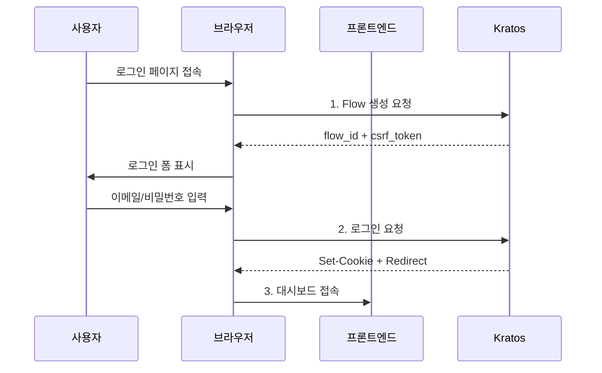
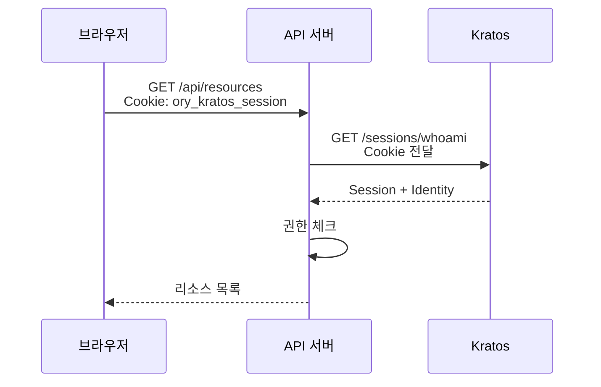
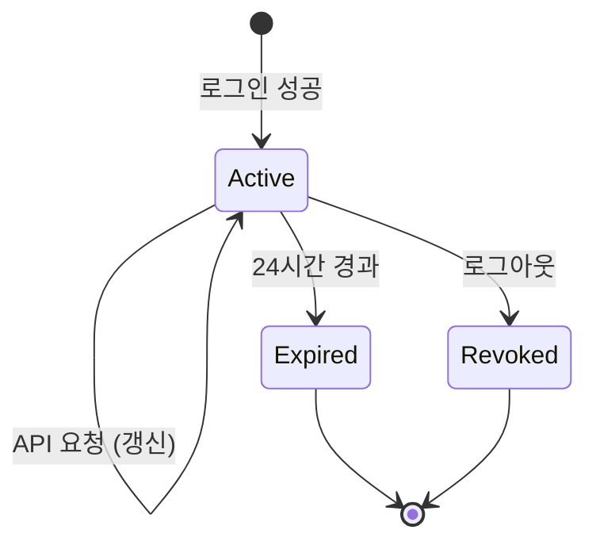
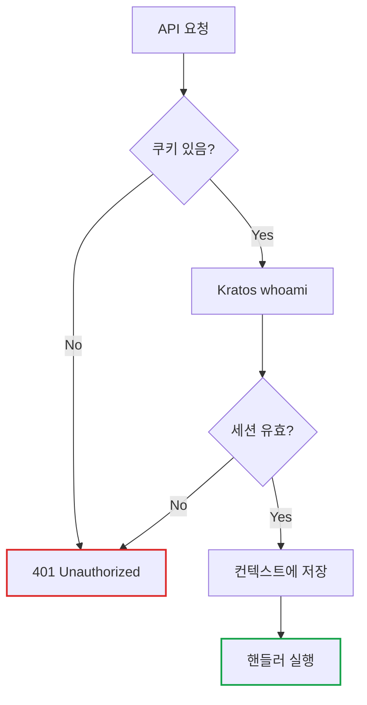
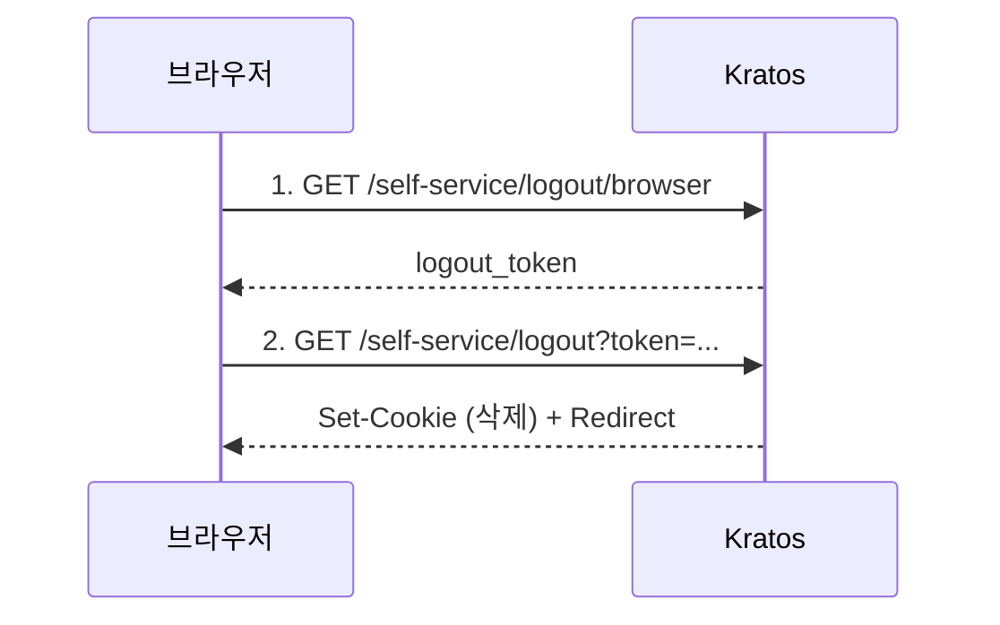

# Ory Kratos 로그인 플로우 Deep Dive

> **작성일**: 2025년 12월 18일
> **카테고리**: Authentication, Security, Backend
> **키워드**: Ory Kratos, Self-Service Flow, Session, Cookie, CSRF, Login

## 요약

Ory Kratos의 Self-Service Login Flow는 CSRF 방어, 세션 관리, SPA 지원을 위해 설계된 상태 기반 인증 플로우다. Flow 생성, 로그인 제출, 세션 확인의 3단계로 구성되며, 각 단계에서 보안 검증이 이루어진다. 이 글에서는 로그인 버튼을 누르면 발생하는 모든 요청과 응답을 추적하고, 세션 쿠키의 보안 속성과 에러 처리 방법을 다룬다.

## 개요

로그인 버튼을 눌렀을 때 뒤에서 무슨 일이 일어나는지 살펴보자.

놀이공원 입장권 발급에 비유하면:
1. **번호표 받기**: 창구에서 대기 번호표를 받는다 (Flow 생성)
2. **신분 확인**: 신분증을 보여주고 정보를 입력한다 (로그인 정보 제출)
3. **입장권 수령**: 확인이 끝나면 팔찌를 받는다 (세션 쿠키 발급)

번호표가 있어야 창구에서 처리가 가능하듯, Kratos도 **Flow ID**가 있어야 로그인 요청을 처리한다.

### 왜 Self-Service Flow인가?

| 방식 | 설명 | 장점 | 단점 |
|------|------|------|------|
| **전통적 방식** | 서버가 로그인 폼 렌더링 | 단순함 | CSRF 취약, 유연성 낮음 |
| **Self-Service Flow** | 클라이언트가 Flow 시작, 서버가 상태 관리 | 보안 강화, SPA 지원 | 복잡함 |

Kratos는 Self-Service Flow를 통해:
- **CSRF 토큰** 자동 생성/검증
- **Flow 상태** 서버에서 관리 (만료, 재시도 제한)
- **SPA/모바일** 앱 지원

## 로그인 플로우 전체 흐름

### 한눈에 보는 시퀀스



### 3단계 요약

| 단계 | 액션 | Kratos 엔드포인트 |
|------|------|-------------------|
| 1 | Flow 생성 | `GET /self-service/login/browser` |
| 2 | 로그인 제출 | `POST /self-service/login` |
| 3 | 세션 확인 | `GET /sessions/whoami` |

## 단계별 상세 분석

### 1단계: Flow 생성

사용자가 `/login` 페이지에 접속하면 Flow가 생성된다.

#### 요청

```http
GET /self-service/login/browser HTTP/1.1
Host: auth.example.com
Accept: application/json
```

#### 응답

```json
{
  "id": "f8e2f3a1-...",
  "type": "browser",
  "expires_at": "2024-01-15T10:30:00Z",
  "issued_at": "2024-01-15T10:00:00Z",
  "request_url": "https://app.example.com/login",
  "ui": {
    "action": "https://auth.example.com/self-service/login",
    "method": "POST",
    "nodes": [
      {
        "type": "input",
        "group": "default",
        "attributes": {
          "name": "csrf_token",
          "type": "hidden",
          "value": "abc123..."
        }
      },
      {
        "type": "input",
        "group": "password",
        "attributes": {
          "name": "identifier",
          "type": "text"
        }
      },
      {
        "type": "input",
        "group": "password",
        "attributes": {
          "name": "password",
          "type": "password"
        }
      }
    ]
  }
}
```

#### Flow 구조 이해

| 필드 | 설명 |
|------|------|
| `id` | 고유 식별자 (`"f8e2f3a1-..."`) |
| `expires_at` | 30분 후 만료 |
| `ui.action` | POST 대상 URL |
| `ui.nodes` | 폼 필드 목록 |
| `csrf_token` | hidden 필드 (CSRF 방어) |
| `identifier` | 이메일 입력 필드 |
| `password` | 비밀번호 입력 필드 |

Flow는 **30분 후 만료**된다. 만료된 Flow로 로그인 시도하면 새 Flow를 생성해야 한다.

### 2단계: 로그인 제출

사용자가 이메일/비밀번호를 입력하고 제출한다.

#### 요청

```http
POST /self-service/login?flow=f8e2f3a1-... HTTP/1.1
Host: auth.example.com
Content-Type: application/json

{
  "method": "password",
  "csrf_token": "abc123...",
  "identifier": "user@example.com",
  "password": "secretPassword123"
}
```

#### 성공 응답

```http
HTTP/1.1 200 OK
Set-Cookie: ory_kratos_session=MTcwNTMxMjAwMHx...;
            Path=/;
            HttpOnly;
            Secure;
            SameSite=Lax

{
  "session": {
    "id": "session-uuid-...",
    "active": true,
    "expires_at": "2024-01-16T10:00:00Z",
    "identity": {
      "id": "user-uuid-...",
      "traits": {
        "email": "user@example.com",
        "name": "홍길동"
      }
    }
  }
}
```

#### 세션 쿠키 분석

| 속성 | 값 | 설명 |
|------|-----|------|
| **쿠키명** | `ory_kratos_session` | Kratos 세션 식별자 |
| `Path` | `/` | 모든 경로에서 전송 |
| `HttpOnly` | 설정됨 | JS에서 접근 불가 (XSS 방어) |
| `Secure` | 설정됨 | HTTPS에서만 전송 |
| `SameSite` | `Lax` | 크로스사이트 제한 (CSRF 방어) |

### 3단계: 세션 확인 (whoami)

로그인 후 API 요청 시 세션을 확인한다.



#### whoami 요청

```http
GET /sessions/whoami HTTP/1.1
Host: auth.example.com
Cookie: ory_kratos_session=MTcwNTMxMjAwMHx...
```

#### whoami 응답

```json
{
  "id": "session-uuid-...",
  "active": true,
  "expires_at": "2024-01-16T10:00:00Z",
  "authenticated_at": "2024-01-15T10:00:00Z",
  "identity": {
    "id": "user-uuid-...",
    "schema_id": "default",
    "traits": {
      "email": "user@example.com",
      "name": "홍길동"
    },
    "created_at": "2024-01-01T00:00:00Z"
  }
}
```

## 세션과 쿠키

### 왜 세션과 쿠키가 필요한가?

HTTP는 **무상태(stateless)** 프로토콜이다. 매 요청마다 서버는 "이 사람 누구지?"를 다시 확인해야 한다.

호텔 객실 카드키에 비유하면:
- 체크인할 때 신분증 확인 후 **카드키(세션 쿠키)** 발급
- 이후에는 카드키만 대면 객실 출입 가능
- 체크아웃하면 카드키가 비활성화됨

매번 신분증을 보여주지 않아도 되는 것처럼, 세션 쿠키가 있으면 매 요청마다 비밀번호를 입력하지 않아도 된다.

### 세션 수명 주기



### 세션 설정

| 항목 | 값 | 설명 |
|------|-----|------|
| 쿠키 이름 | `ory_kratos_session` | Kratos 기본값 |
| 유효 기간 | 24시간 | 설정 가능 |
| HttpOnly | 설정됨 | XSS 방어 |
| Secure | 설정됨 | HTTPS 필수 |
| SameSite | Lax | CSRF 방어 |

### 세션 vs 토큰 비교

| 항목 | 세션 (Kratos) | JWT |
|------|---------------|-----|
| 저장 위치 | 서버 (DB) | 클라이언트 |
| 취소 가능 | 즉시 | 만료까지 대기 |
| 크기 | 작음 (쿠키 ID만) | 큼 (payload 포함) |
| 용도 | 웹 브라우저 | API/모바일 |

일반적으로 **웹 대시보드는 세션**, **API/모바일은 JWT**를 사용한다.

## API 요청 시 인증

### 인증 미들웨어 구현 (Go)

```go
func (m *AuthMiddleware) Authenticate() gin.HandlerFunc {
    return func(c *gin.Context) {
        // 1. 쿠키에서 세션 추출
        cookie, err := c.Cookie("ory_kratos_session")
        if err != nil {
            c.AbortWithStatusJSON(401, gin.H{
                "error": "unauthorized",
            })
            return
        }

        // 2. Kratos whoami 호출
        session, err := m.kratosClient.ToSession(
            c.Request.Context(),
            cookie,
        )
        if err != nil {
            c.AbortWithStatusJSON(401, gin.H{
                "error": "session_invalid",
            })
            return
        }

        // 3. 컨텍스트에 사용자 정보 저장
        c.Set("user_id", session.Identity.Id)
        c.Set("email", session.Identity.Traits["email"])

        c.Next()
    }
}
```

### 인증 흐름 다이어그램



## 로그아웃 플로우

로그아웃도 Self-Service Flow를 따른다.

### 로그아웃 시퀀스



### 단계별 요청

#### 1단계: 로그아웃 URL 요청

```http
GET /self-service/logout/browser HTTP/1.1
Cookie: ory_kratos_session=...
```

```json
{
  "logout_url": "https://auth.example.com/self-service/logout?token=xyz123",
  "logout_token": "xyz123"
}
```

#### 2단계: 로그아웃 실행

```http
GET /self-service/logout?token=xyz123 HTTP/1.1
```

```http
HTTP/1.1 303 See Other
Set-Cookie: ory_kratos_session=; Max-Age=0; Path=/
Location: https://app.example.com/login
```

`Max-Age=0`으로 쿠키가 즉시 삭제된다.

## 에러 처리

### 일반적인 에러 케이스

| 에러 | 원인 | 해결 |
|------|------|------|
| `session_inactive` | 세션 만료 | 재로그인 |
| `csrf_violation` | CSRF 토큰 불일치 | Flow 재생성 |
| `flow_expired` | Flow 30분 초과 | Flow 재생성 |
| `credentials_invalid` | 잘못된 비밀번호 | 재입력 |

### 에러 응답 예시

```json
{
  "error": {
    "code": 400,
    "status": "Bad Request",
    "reason": "The provided credentials are invalid.",
    "message": "The provided credentials are invalid, check for spelling mistakes in your password or username."
  },
  "ui": {
    "messages": [
      {
        "id": 4000006,
        "type": "error",
        "text": "The provided credentials are invalid."
      }
    ]
  }
}
```

### 프론트엔드 에러 처리 (TypeScript)

```typescript
async function handleLogin(email: string, password: string) {
  try {
    const response = await kratos.submitSelfServiceLoginFlow({
      flow: flowId,
      updateLoginFlowBody: {
        method: 'password',
        identifier: email,
        password: password,
        csrf_token: csrfToken,
      },
    });

    // 성공 → 대시보드로 이동
    router.push('/dashboard');

  } catch (error) {
    if (error.response?.status === 400) {
      // UI 메시지 표시
      const messages = error.response.data.ui?.messages;
      setError(messages?.[0]?.text || '로그인 실패');
    } else if (error.response?.status === 410) {
      // Flow 만료 → 새 Flow 생성
      await initializeLoginFlow();
    }
  }
}
```

## 결론

### 로그인 플로우 체크리스트

| 순서 | 항목 |
|------|------|
| 1 | Flow 생성 (`GET /self-service/login/browser`) |
| 2 | 폼 렌더링 (`ui.nodes` 기반) |
| 3 | CSRF 토큰 포함하여 제출 |
| 4 | 세션 쿠키 수신 확인 |
| 5 | `whoami`로 세션 유효성 확인 |

### 핵심 요약

| 항목 | 내용 |
|------|------|
| **Flow 시작** | `GET /self-service/login/browser` |
| **로그인 제출** | `POST /self-service/login?flow={id}` |
| **세션 확인** | `GET /sessions/whoami` |
| **세션 유효기간** | 24시간 (설정 가능) |
| **쿠키 속성** | HttpOnly, Secure, SameSite=Lax |

### 보안 체크포인트

| 위협 | 방어 메커니즘 |
|------|--------------|
| **XSS** | HttpOnly 쿠키 |
| **CSRF** | csrf_token + SameSite |
| **세션 탈취** | Secure (HTTPS) |
| **브루트포스** | Rate Limiting (Kratos 내장) |

## 참고 자료

### 공식 문서
- [Kratos Self-Service Flows](https://www.ory.sh/docs/kratos/self-service)
- [Kratos Login Flow](https://www.ory.sh/docs/kratos/self-service/flows/user-login)
- [Kratos Session Management](https://www.ory.sh/docs/kratos/session-management)
- [Kratos SDK (Go)](https://www.ory.sh/docs/kratos/sdk/go)

### 관련 자료
- [Ory Kratos GitHub](https://github.com/ory/kratos)
- [Ory Kratos Examples](https://github.com/ory/kratos-selfservice-ui-node)

