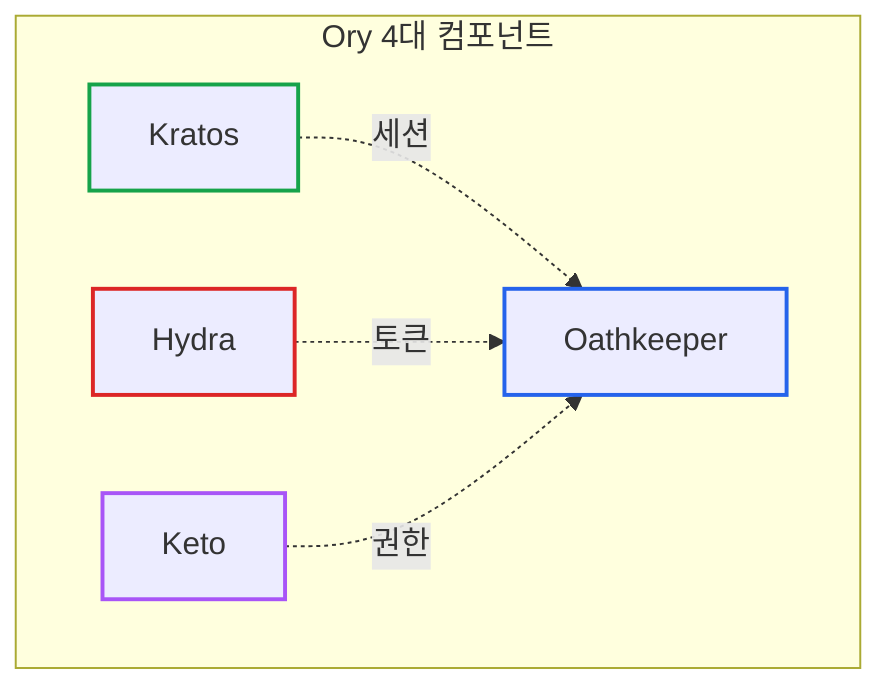
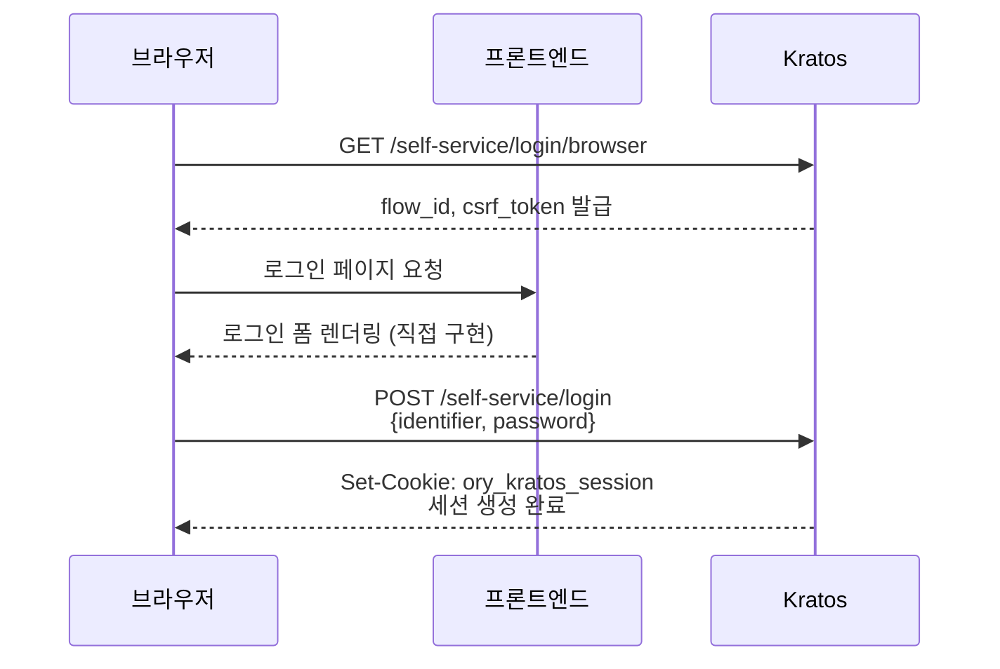
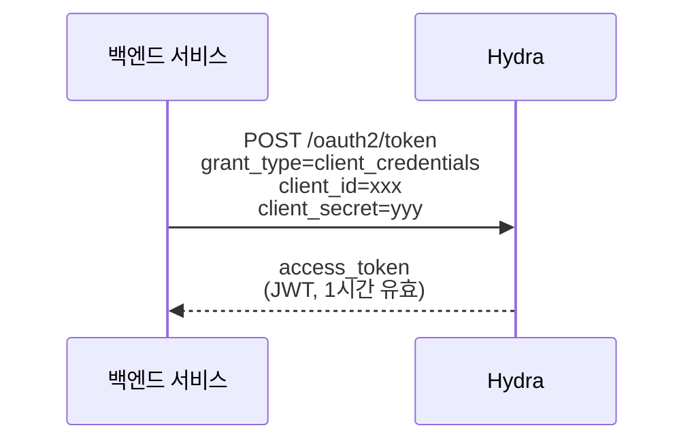
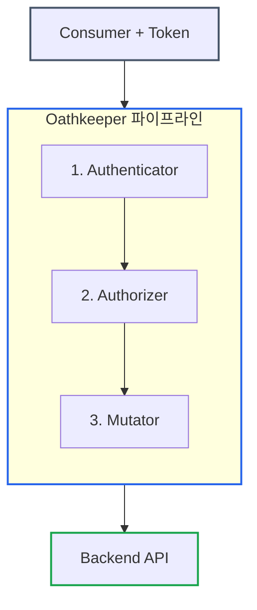
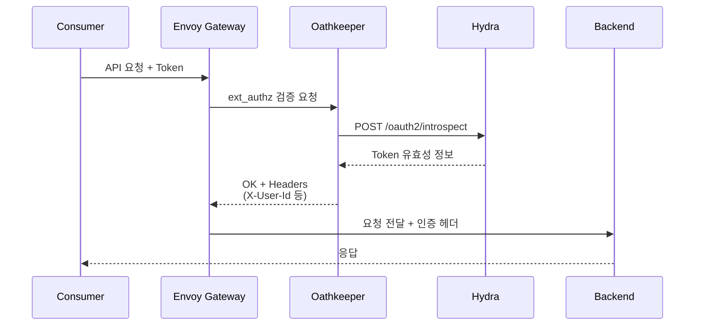
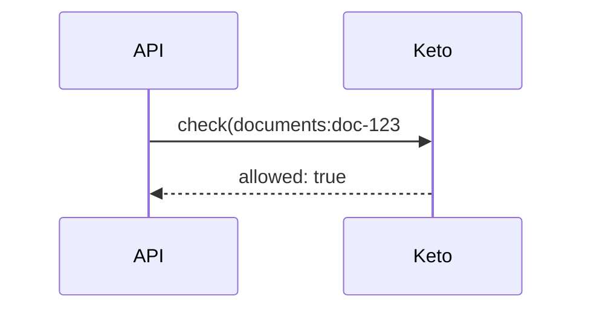
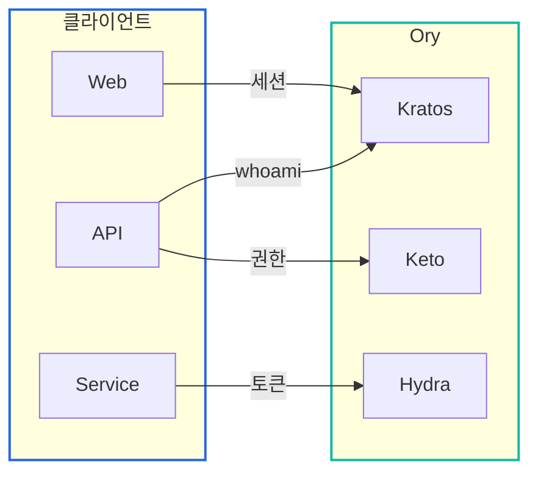
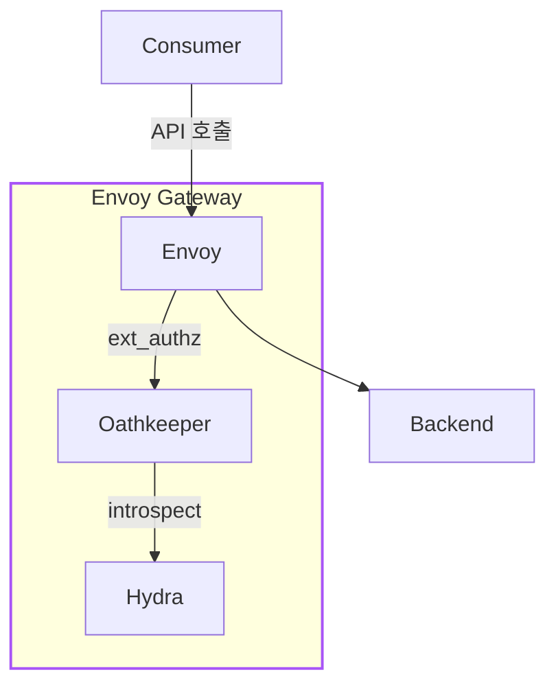

# Ory 스택 완전 가이드: 오픈소스 인증/인가 시스템

> **작성일**: 2025년 12월 18일
> **카테고리**: Authentication, Authorization, Security
> **키워드**: Ory, Kratos, Hydra, Oathkeeper, Keto, OAuth2, OIDC, Identity

## 요약

Ory는 4개의 독립적인 오픈소스 컴포넌트(Kratos, Hydra, Oathkeeper, Keto)로 구성된 인증/인가 시스템이다. 각 컴포넌트는 단일 책임 원칙을 따르며, 필요한 것만 선택적으로 사용할 수 있다. Kratos는 사용자 인증, Hydra는 OAuth2 토큰 발급, Oathkeeper는 API 인증 프록시, Keto는 권한 관리를 담당한다. 이 글에서는 각 컴포넌트의 역할과 동작 방식, 그리고 실전 적용 방법을 다룬다.

## 왜 Ory인가?

인증/인가 시스템을 구축할 때 세 가지 선택지가 있다:

| 방식 | 장점 | 단점 |
|------|------|------|
| **직접 구현** | 완전한 커스터마이징 | 보안 취약점 위험, 유지보수 비용 |
| **올인원 솔루션** (Auth0, Keycloak) | 빠른 도입 | 벤더 종속, 커스터마이징 한계 |
| **마이크로서비스 조합** (Ory) | 필요한 것만 선택, 확장성 | 초기 학습 곡선 |

Ory를 선택해야 하는 이유:

| 선택 이유 | 설명 |
|-----------|------|
| **오픈소스** | Apache 2.0 라이선스 |
| **모듈러 설계** | 필요한 컴포넌트만 선택 사용 |
| **Cloud Native** | Kubernetes 친화적 설계 |
| **보안 검증** | CNCF 프로젝트, 보안 감사 완료 |

### Ory vs 올인원 솔루션

| 특성 | Ory | Keycloak | Auth0 |
|------|-----|----------|-------|
| **라이선스** | Apache 2.0 | Apache 2.0 | 상용 |
| **배포 방식** | 컴포넌트별 | 모놀리식 | SaaS |
| **메모리 사용** | 가벼움 (Go) | 무거움 (Java) | N/A |
| **커스터마이징** | API 기반 | Admin UI | 제한적 |
| **OAuth2/OIDC** | Hydra (별도) | 내장 | 내장 |

## Ory 생태계

Ory는 **4개의 핵심 컴포넌트**로 구성된다:



| 컴포넌트 | 역할 | 비유 |
|----------|------|------|
| **Kratos** | "너 누구야?" | 신분증 발급 창구 |
| **Hydra** | "토큰 발급해줄게" | 출입증 발급기 |
| **Oathkeeper** | "출입증 확인합니다" | 경비실 |
| **Keto** | "이 권한 있어?" | 권한 관리 시스템 |

Ory의 각 컴포넌트는 **하나의 역할**만 담당한다. 이 단일 책임 원칙 덕분에 필요한 것만 선택적으로 사용할 수 있다.

## Kratos: Identity Management

### 왜 별도의 Identity 서비스가 필요한가?

로그인/회원가입을 직접 구현할 때 고려해야 할 것:

| 직접 구현 시 고려사항 | 위험 |
|----------------------|------|
| 비밀번호 암호화 (bcrypt, argon2) | 잘못하면 평문 노출 |
| 세션 관리, CSRF 토큰 | 보안 취약점 |
| 비밀번호 재설정 플로우 | 이메일 인증 연동 |
| MFA (2단계 인증) | 복잡한 구현 |

**Kratos**는 이런 **사용자 신원(Identity)** 관리를 전담한다.

### 핵심 기능

| Self-Service Flows | Identity Data |
|-------------------|---------------|
| Registration | Identity |
| Login | Session |
| Password Recovery | Schema |
| Verification | |
| Settings | |

### Kratos가 하는 일 vs 하지 않는 일

| Kratos가 하는 일 | Kratos가 하지 않는 일 |
|-----------------|---------------------|
| 사용자 등록/로그인 | UI 렌더링 |
| 세션 관리 | OAuth2 토큰 발급 |
| 비밀번호 암호화 | API 인가 |
| 이메일 인증 | 권한 관리 |
| MFA (2FA) | 외부 서비스 연동 |

### Self-Service Flows

Kratos는 **Headless** 아키텍처다. UI가 없고 API만 제공한다.

**Headless란?** 머리(UI)가 없다는 뜻이다. 일반적인 인증 서비스는 로그인 화면까지 제공하지만, Kratos는 **API만 제공**하고 화면은 직접 구현한다. 덕분에 브랜드에 맞는 완전한 커스터마이징이 가능하다.



### Identity Schema

Kratos는 **JSON Schema**로 사용자 프로필을 정의한다:

```json
{
  "$id": "https://example.com/user.schema.json",
  "type": "object",
  "properties": {
    "traits": {
      "type": "object",
      "properties": {
        "email": {
          "type": "string",
          "format": "email",
          "title": "이메일",
          "ory.sh/kratos": {
            "credentials": {
              "password": { "identifier": true }
            },
            "verification": { "via": "email" },
            "recovery": { "via": "email" }
          }
        },
        "name": {
          "type": "string",
          "title": "이름"
        }
      },
      "required": ["email"]
    }
  }
}
```

## Hydra: OAuth2/OIDC Provider

### 왜 토큰이 필요한가?

Kratos로 로그인하면 **세션 쿠키**가 발급된다. 하지만 쿠키만으로는 한계가 있다:

| 상황 | 세션 쿠키 | OAuth2 토큰 |
|------|----------|------------|
| 브라우저에서 API 호출 | 가능 | 가능 |
| 서버에서 API 호출 | 불가 | 가능 |
| 모바일 앱이 API 호출 | 불가 | 가능 |
| 권한 범위(Scope) 제한 | 불가 | 가능 |
| 만료 시간 설정 | 제한적 | 자유롭게 |

**Hydra**는 이런 **OAuth2 토큰 발급**을 전담한다.

### Hydra가 하는 일 vs 하지 않는 일

| Hydra가 하는 일 | Hydra가 하지 않는 일 |
|----------------|---------------------|
| OAuth2 Client 관리 | 사용자 인증 (Kratos 담당) |
| Access/Refresh Token 발급 | 사용자 등록 |
| Token Introspection | 세션 관리 |
| OIDC ID Token 발급 | 권한 결정 |

### Grant Types

Hydra가 지원하는 OAuth2 Grant Types:

| Grant Type | 용도 | 사용자 |
|------------|------|--------|
| **Client Credentials** | 서버-서버 통신 | 백엔드 서비스 |
| **Authorization Code** | 사용자 대신 API 호출 | 웹/모바일 앱 |
| **Refresh Token** | 토큰 갱신 | 모든 클라이언트 |



### Token Introspection

발급된 토큰의 유효성을 검증한다:

```bash
# 토큰 검증 요청
POST /oauth2/introspect
Content-Type: application/x-www-form-urlencoded

token=<access_token>
```

```json
// 응답
{
  "active": true,
  "client_id": "my-service",
  "scope": "read write",
  "sub": "my-service",
  "exp": 1702915200,
  "ext": {
    "custom_claim": "value"
  }
}
```

## Oathkeeper: Identity & Access Proxy

### 왜 API 앞에 경비원이 필요한가?

API 서비스가 10개 있다고 상상해보자. 각 서비스에 인증 로직을 직접 넣으면:

| 문제 | 결과 |
|------|------|
| 인증 코드 복붙 10번 | 한 곳 고치면 9곳도 수정 필요 |
| 실수로 빠뜨린 API | 보안 구멍 발생 |
| 토큰 검증 로직 변경 | 10개 서비스 모두 재배포 |

**Oathkeeper**는 **API Gateway 앞단**에서 모든 인증을 한 곳에서 처리한다.

### 동작 방식



### 처리 파이프라인

| 단계 | 컴포넌트 | 역할 | 예시 |
|------|----------|------|------|
| 1 | **Authenticator** | 토큰 검증 | OAuth2 Introspection |
| 2 | **Authorizer** | 권한 결정 | allow, deny, remote |
| 3 | **Mutator** | 요청 변환 | 헤더 추가, JWT 재서명 |

### Access Rules 예시

```yaml
- id: "api-gateway-oauth2"
  upstream:
    url: "http://backend-service"
  match:
    url: "<https|http>://<.*>/api/<.*>"
    methods: ["GET", "POST", "PUT", "DELETE"]

  # 1. 토큰 검증
  authenticators:
    - handler: oauth2_introspection
      config:
        introspection_url: "http://hydra:4445/oauth2/introspect"

  # 2. 권한 확인 (검증 통과 시 허용)
  authorizers:
    - handler: allow

  # 3. 헤더 변환
  mutators:
    - handler: header
      config:
        headers:
          X-User-Id: "{{ print .Extra.user_id }}"
          X-Client-Id: "{{ print .Subject }}"
```

### ext_authz 모드

Oathkeeper는 **Envoy의 ext_authz** 서버로 동작할 수 있다:



## Keto: Permission Engine

### 왜 별도의 권한 엔진이 필요한가?

Oathkeeper가 "이 사람 토큰이 유효해요"라고 확인해도, 그것만으로는 부족하다:

| 질문 | Oathkeeper | Keto |
|------|------------|------|
| "토큰이 유효한가?" | 가능 | - |
| "이 리소스에 접근할 수 있는가?" | 모름 | 가능 |
| "이 리소스를 삭제할 수 있는가?" | 모름 | 가능 |

**Keto**는 이런 **세밀한 권한(Permission)** 관리를 전담한다.

### RBAC vs ReBAC

| 모델 | 설명 | 예시 |
|------|------|------|
| **RBAC** | 역할 기반 | "admin은 모든 것 가능" |
| **ReBAC** | 관계 기반 | "이 문서의 owner만 삭제 가능" |

Keto는 **ReBAC (Relation-Based Access Control)**을 지원한다:

> **Keto 관계 모델**: `namespace:object#relation@subject`

| 관계 튜플 예시 | 의미 |
|---------------|------|
| `organizations:org-123#owner@user-456` | user-456은 org-123의 owner |
| `documents:doc-789#viewer@user-456` | user-456은 doc-789의 viewer |

### 권한 체크 흐름



## 아키텍처 적용

### Control Plane vs Data Plane

Ory 컴포넌트는 **두 개의 영역**에서 다르게 사용된다:

#### Control Plane (관리 영역)



#### Data Plane (API Gateway 영역)



### 컴포넌트별 사용처

| 컴포넌트 | Control Plane | Data Plane |
|----------|---------------|------------|
| **Kratos** | 웹 로그인 | - |
| **Hydra** | 서비스 인증 | Consumer 토큰 |
| **Oathkeeper** | - | ext_authz |
| **Keto** | RBAC 체크 | - |

### 인증 방식 요약

| 클라이언트 | 인증 방식 | Ory 컴포넌트 |
|------------|----------|--------------|
| **Web App** | Session Cookie | Kratos |
| **백엔드 서비스** | JWT (Client Credentials) | Hydra |
| **외부 Consumer** | OAuth2 / API Key | Hydra + Oathkeeper |

## 결론

### 핵심 요약

| 컴포넌트 | 한 줄 요약 | 용도 |
|----------|-----------|------|
| **Kratos** | 사용자 인증 (로그인, 세션) | 웹 대시보드 로그인 |
| **Hydra** | OAuth2 토큰 발급 | 서비스/Consumer 인증 |
| **Oathkeeper** | API 인증 프록시 | Envoy ext_authz |
| **Keto** | 권한 관리 (ReBAC) | 리소스 접근 제어 |

### 왜 4개 모두 필요한가?

> **Q: Kratos만 쓰면 안 되나요?**
>
> Kratos는 세션 기반이다. API 토큰이 필요하면 Hydra가 필요하다.

> **Q: Hydra만 쓰면 안 되나요?**
>
> Hydra는 토큰만 발급한다. 사용자 등록/로그인 UI Flow는 Kratos가 처리한다.

> **Q: Oathkeeper 없이 직접 검증하면 안 되나요?**
>
> 가능하지만, Envoy ext_authz + 헤더 변환을 Oathkeeper가 표준화해서 처리해준다.

> **Q: Keto 없이 코드로 권한 체크하면 안 되나요?**
>
> 가능하지만, 관계 그래프 기반 권한 상속이 복잡해지면 Keto가 훨씬 유연하다.

## 참고 자료

### 공식 문서
- [Ory Documentation](https://www.ory.sh/docs/)
- [Kratos Quickstart](https://www.ory.sh/docs/kratos/quickstart)
- [Hydra OAuth2 Guide](https://www.ory.sh/docs/hydra/guides)
- [Oathkeeper Configuration](https://www.ory.sh/docs/oathkeeper/configuration)
- [Keto Permission Model](https://www.ory.sh/docs/keto/concepts/relation-tuples)

### 관련 자료
- [Ory GitHub](https://github.com/ory)
- [Ory Cloud](https://www.ory.sh/cloud/)

