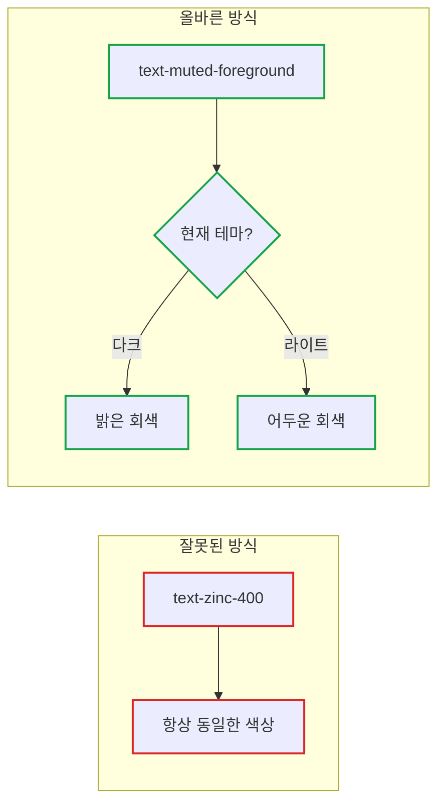

# Next.js + Tailwind CSS v4 + shadcn/ui 테마 시스템 구축 가이드

> **작성일**: 2025년 12월 22일
> **카테고리**: Frontend, Next.js, Tailwind CSS
> **키워드**: Next.js, Tailwind CSS v4, shadcn/ui, next-themes, Dark Mode, CSS Variables

## 요약

shadcn/ui의 zinc 테마를 next-themes로 확장할 때 테마 전환이 동작하지 않는 문제가 발생한다. 근본 원인은 `text-zinc-400` 같은 하드코딩된 Tailwind 색상 클래스가 CSS 변수를 참조하지 않기 때문이다. 이 글에서는 올바른 테마 시스템 설정 방법과 자주 하는 실수, 그리고 색상 사용 가이드를 정리한다.

---

## 문제 상황: 왜 테마가 깨지는가?

### 전형적인 시나리오

1. `shadcn/ui`로 Next.js 프로젝트 초기화 (zinc 테마 선택)
2. `next-themes`로 다크/라이트 모드 전환 기능 추가
3. **문제 발생**: 테마 전환이 안 되거나, 일부 컴포넌트만 변경됨



### 근본 원인

| 방식 | 예시 | 테마 전환 시 |
|------|------|-------------|
| 하드코딩 | `text-zinc-400` | 변경 안 됨 |
| CSS 변수 | `text-muted-foreground` | 자동 변경 |

`zinc-400`은 Tailwind의 고정 색상이고, `muted-foreground`는 CSS 변수를 참조한다.

---

## 핵심 원칙: CSS 변수 vs Tailwind 색상

### Tailwind 색상 팔레트 (하드코딩)

```css
/* 항상 동일한 색상값 */
.text-zinc-400 { color: #a1a1aa; }
.bg-zinc-950 { color: #09090b; }
```

### CSS 변수 (테마 반응형)

```css
/* 다크 모드 */
.dark {
  --foreground: oklch(0.985 0 0);        /* 거의 흰색 */
  --muted-foreground: oklch(0.708 0 0);  /* 밝은 회색 */
  --background: oklch(0.145 0 0);        /* 거의 검정 */
}

/* 라이트 모드 */
:root {
  --foreground: oklch(0.145 0 0);        /* 거의 검정 */
  --muted-foreground: oklch(0.556 0 0);  /* 어두운 회색 */
  --background: oklch(1 0 0);            /* 흰색 */
}
```

**핵심 인사이트**: shadcn/ui가 zinc 테마로 초기화했다고 해서 `zinc-*` 클래스를 사용하라는 의미가 아니다. CSS 변수가 zinc 색상 계열로 설정되어 있고, 코드에서는 `text-foreground` 같은 시맨틱 클래스를 사용해야 한다.

---

## 올바른 설정 방법

### 1. 프로젝트 초기화

```bash
# Next.js + Tailwind CSS v4 프로젝트 생성
pnpm create next-app@latest my-app --typescript --tailwind --eslint

# shadcn/ui 초기화 (zinc 테마 선택)
pnpm dlx shadcn@latest init
```

### 2. next-themes 설정

```bash
pnpm add next-themes
```

```tsx
// app/providers.tsx
'use client';

import { ThemeProvider } from 'next-themes';

export function Providers({ children }: { children: React.ReactNode }) {
  return (
    <ThemeProvider
      attribute="class"
      defaultTheme="system"
      enableSystem
      disableTransitionOnChange
    >
      {children}
    </ThemeProvider>
  );
}
```

```tsx
// app/layout.tsx
import { Providers } from './providers';

export default function RootLayout({ children }: { children: React.ReactNode }) {
  return (
    <html lang="ko" suppressHydrationWarning>
      <body>
        <Providers>{children}</Providers>
      </body>
    </html>
  );
}
```

### 3. CSS 변수 확인 (Tailwind v4)

```css
/* app/globals.css - Tailwind v4 방식 */
@import "tailwindcss";

@layer base {
  :root {
    --background: oklch(1 0 0);
    --foreground: oklch(0.145 0 0);
    --muted: oklch(0.967 0 0);
    --muted-foreground: oklch(0.556 0 0);
    --border: oklch(0.922 0 0);
    /* ... 기타 변수들 */
  }

  .dark {
    --background: oklch(0.145 0 0);
    --foreground: oklch(0.985 0 0);
    --muted: oklch(0.269 0 0);
    --muted-foreground: oklch(0.708 0 0);
    --border: oklch(1 0 0.15);
    /* ... 기타 변수들 */
  }
}
```

---

## 자주 하는 실수와 해결책

### 실수 1: 배경색 하드코딩

```tsx
// 잘못된 방식 - 항상 검은색 배경
<div className="bg-zinc-950 text-zinc-50">

// 올바른 방식 - 테마에 따라 변경
<div className="bg-background text-foreground">
```

### 실수 2: 보조 텍스트 색상

```tsx
// 잘못된 방식
<p className="text-zinc-400">보조 텍스트</p>
<span className="text-zinc-500">설명 텍스트</span>

// 올바른 방식
<p className="text-muted-foreground">보조 텍스트</p>
<span className="text-muted-foreground">설명 텍스트</span>
```

### 실수 3: 테두리 색상

```tsx
// 잘못된 방식
<div className="border border-zinc-700">

// 올바른 방식
<div className="border border-border">
```

### 실수 4: 입력 필드 스타일

```tsx
// 잘못된 방식
<input className="bg-zinc-900 border-zinc-700 text-white placeholder:text-zinc-600" />

// 올바른 방식
<input className="bg-muted/30 border-border text-foreground placeholder:text-muted-foreground/50" />
```

### 실수 5: 역할별 색상 설정

```tsx
// 잘못된 방식 - 기본 역할에 zinc 하드코딩
const ROLE_CONFIG = {
  admin: { color: 'text-blue-400', bgColor: 'bg-blue-500/10 border-blue-500/20' },
  member: { color: 'text-zinc-400', bgColor: 'bg-zinc-500/10 border-zinc-500/20' },
};

// 올바른 방식 - 기본 역할은 테마 변수 사용
const ROLE_CONFIG = {
  admin: { color: 'text-blue-400', bgColor: 'bg-blue-500/10 border-blue-500/20' },
  member: { color: 'text-muted-foreground', bgColor: 'bg-muted/30 border-border' },
};
```

---

## 색상 사용 가이드

### 사용해야 하는 CSS 변수 클래스

| 용도 | 클래스 | 설명 |
|------|--------|------|
| 메인 배경 | `bg-background` | 페이지/카드 배경 |
| 메인 텍스트 | `text-foreground` | 제목, 본문 |
| 보조 텍스트 | `text-muted-foreground` | 설명, 힌트 |
| 테두리 | `border-border` | 카드, 입력 필드 테두리 |
| 비활성 배경 | `bg-muted` | 비활성 상태, 스켈레톤 |
| 카드 배경 | `bg-card` | 카드 컴포넌트 |
| 입력 배경 | `bg-muted/30` | 입력 필드 배경 |

### 하드코딩해도 되는 경우

특정 브랜드 색상이나 상태를 나타내는 경우에만 하드코딩한다:

| 용도 | 예시 | 이유 |
|------|------|------|
| 강조 색상 | `text-amber-400` | 브랜드 액센트 |
| 상태 표시 | `text-red-400`, `text-green-400` | 에러/성공 |
| 역할 색상 | `text-blue-400` (관리자) | 시각적 구분 |

### 변환 치트시트

```
text-zinc-50     → text-foreground
text-zinc-100    → text-foreground/90
text-zinc-300    → text-foreground/80
text-zinc-400    → text-muted-foreground
text-zinc-500    → text-muted-foreground
text-zinc-600    → text-muted-foreground/70

bg-zinc-950      → bg-background
bg-zinc-900      → bg-card 또는 bg-muted
bg-zinc-800      → bg-muted

border-zinc-700  → border-border
border-zinc-800  → border-border/50

placeholder:text-zinc-500 → placeholder:text-muted-foreground/50
placeholder:text-zinc-600 → placeholder:text-muted-foreground/50
```

---

## 체크리스트

### 새 프로젝트 시작 시

- [ ] `next-themes` 설치 및 설정
- [ ] `suppressHydrationWarning` 추가
- [ ] CSS 변수 정의 확인 (라이트/다크)

### 컴포넌트 작성 시

- [ ] `zinc-*` 대신 시맨틱 클래스 사용
- [ ] 배경: `bg-background`, `bg-card`, `bg-muted`
- [ ] 텍스트: `text-foreground`, `text-muted-foreground`
- [ ] 테두리: `border-border`

### 코드 리뷰 시

```bash
# zinc 하드코딩 검색
grep -r "zinc-" --include="*.tsx" --include="*.ts" src/

# 의도적 사용이 아닌 경우 수정 필요
```

### 수정하면 안 되는 경우

1. **색상 팔레트 UI**: 실제 색상을 보여주는 경우 (테마 설정 페이지)
2. **다크 모드 전용 컴포넌트**: 의도적으로 항상 다크 스타일인 경우
3. **비주얼 에디터**: 특수한 디자인 시스템을 가진 경우

---

## 핵심 정리

| 개념 | 설명 |
|------|------|
| CSS 변수 | `:root`와 `.dark`에 정의된 색상값. 테마 전환 시 자동 변경 |
| 시맨틱 클래스 | `text-foreground` 등 CSS 변수를 참조하는 Tailwind 클래스 |
| 하드코딩 | `text-zinc-400` 등 고정 색상. 테마 전환에 반응 안 함 |
| OKLCH | Tailwind v4의 기본 색상 공간. 더 정확한 색상 보간 지원 |

**기억할 것**: shadcn/ui의 "zinc 테마"는 CSS 변수의 기본값이 zinc 계열이라는 의미다. 코드에서는 항상 `text-foreground`, `bg-background` 같은 시맨틱 클래스를 사용해야 한다.

---

## 참고 자료

### 공식 문서
- [next-themes GitHub](https://github.com/pacocoursey/next-themes)
- [shadcn/ui Dark Mode](https://ui.shadcn.com/docs/dark-mode/next)
- [Tailwind CSS v4 Color System](https://tailwindcss.com/docs/customizing-colors)
- [shadcn/ui Theming](https://ui.shadcn.com/docs/theming)
