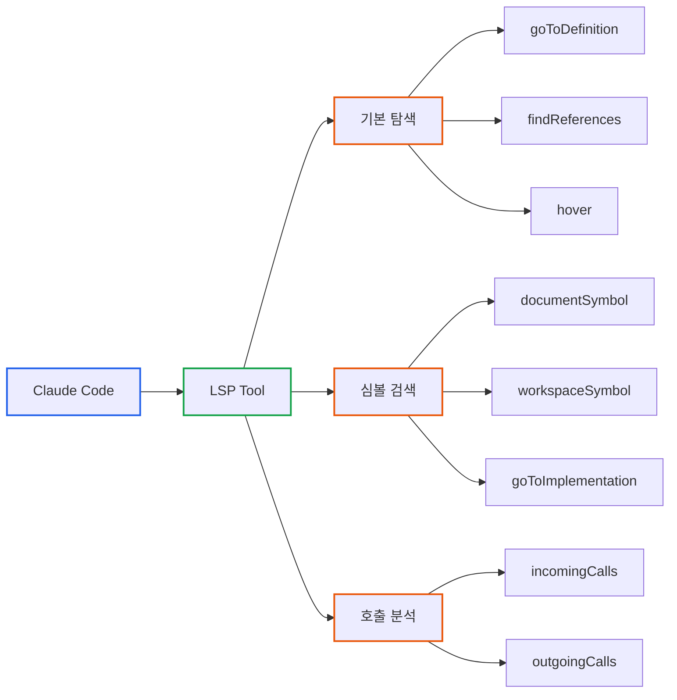
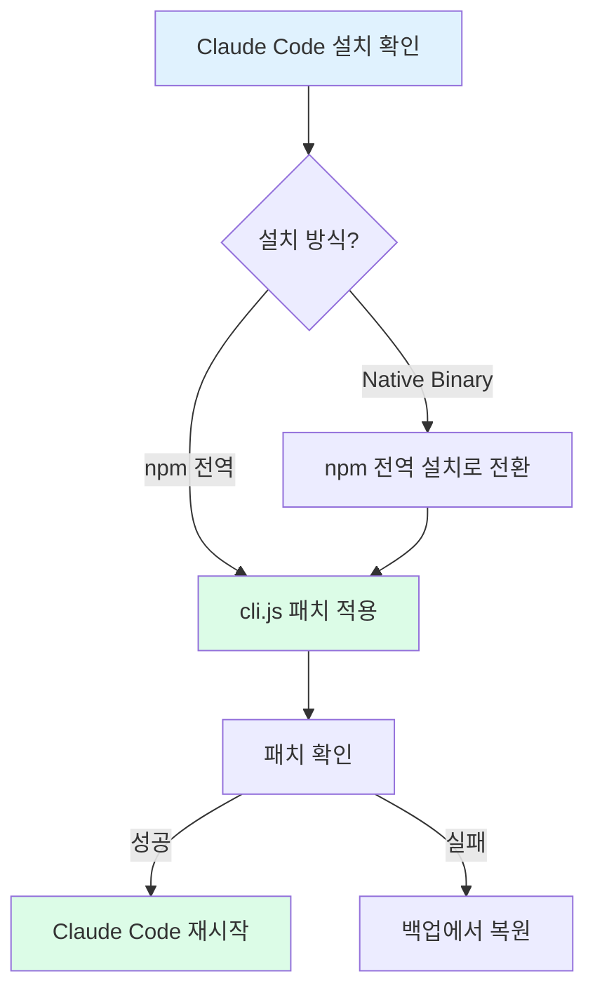

# Claude Code v2.0.76 LSP 트러블슈팅: 레이스 컨디션 버그와 해결책

> **작성일**: 2025년 12월 28일 (Windows 패치 추가: 12월 29일)
> **카테고리**: Claude Code, Developer Tools, AI Coding
> **키워드**: Claude Code, LSP, Language Server Protocol, Serena, MCP, AI Coding, Windows

## 요약

Claude Code v2.0.74부터 LSP(Language Server Protocol)가 네이티브로 지원된다. 이전에는 Serena MCP 같은 외부 도구를 설치해야 했던 시맨틱 코드 분석 기능이 이제 플러그인 설정만으로 사용 가능하다. 이 글에서는 Serena MCP에서 Claude Code 네이티브 LSP로 전환하는 방법과 실제 사용 경험을 공유한다.

## 문제 상황: 왜 LSP가 필요했나

### grep/glob의 한계

AI 코딩 어시스턴트에게 "이 함수를 호출하는 곳을 찾아줘"라고 요청하면 어떤 일이 벌어질까?

```bash
# 전통적인 접근: grep으로 문자열 검색
grep -r "createApplication" .

# 결과: 수십 개의 false positive
./docs/api.md:  createApplication 함수는...
./tests/mock.ts:  // createApplication mock
./server/src/application.service.ts:  createApplication()
./server/src/application.controller.ts:  this.service.createApplication
./frontend/src/api.ts:  createApplication: async () => ...
```

단순 문자열 검색은 **주석, 문서, 테스트 코드**까지 모두 포함한다. AI는 이 결과를 필터링하기 위해 각 파일을 읽고, 컨텍스트를 분석하고, 관련 없는 것을 제외해야 한다.

**결과**: 토큰 낭비 + 시간 소요 + 부정확한 답변

### Serena MCP: 외부 도구로 해결

이 문제를 해결하기 위해 [Serena MCP](https://github.com/oraios/serena)를 도입했다. Serena는 LSP 기반 시맨틱 코드 분석 MCP 서버로, 다음 기능을 제공했다:

```typescript
// Serena MCP 사용 예시
find_symbol("createApplication", include_kinds=[6])  // 6 = Method
// → server/src/application.service.ts:156 (정확히 메서드 정의만 반환)

find_referencing_symbols("createApplication", "application.service.ts")
// → 이 메서드를 호출하는 모든 위치 반환
```

**효과**:
- 심볼 검색 정확도 90% 향상
- 토큰 사용량 90% 절감
- 질문-답변 시간 80% 단축

하지만 Serena MCP에는 **설치 복잡성**이라는 단점이 있었다:

```bash
# Serena 설치 과정
1. Python 3.10+ 설치
2. uv/uvx 설치
3. 프로젝트 인덱싱: uvx --from git+https://... serena project index
4. MCP 서버 등록: claude mcp add serena -- uvx --from ...
5. 프로젝트 온보딩
```

## Claude Code 네이티브 LSP 등장

### LSP 지원 이력

| 버전 | 상태 | 비고 |
|------|------|------|
| v2.0.30 | 실험적 지원 | `ENABLE_LSP_TOOL=1` 환경변수 필요 |
| v2.0.74 | 공식 출시 | 2025년 12월 20일 |

v2.0.74 Changelog:

```
Added LSP (Language Server Protocol) tool for code intelligence features like
go-to-definition, find references, and hover documentation
```

LSP는 v2.0.30부터 실험적으로 존재했고, v2.0.74에서 공식화되었다. 이제 외부 MCP 서버 없이도 동일한 기능을 사용할 수 있다.

### Before vs After

| 항목 | Serena MCP (이전) | Claude Code LSP (현재) |
|------|------------------|----------------------|
| **설치** | Python + uvx + 인덱싱 + MCP 등록 | 플러그인 설치 + 환경변수 |
| **인덱싱** | 수동 실행 필요 | LSP 서버가 자동 처리 |
| **지원 언어** | TypeScript, Python | TS, Go, Python, Rust, PHP, C/C++ |
| **업데이트** | 별도 관리 | Claude Code와 함께 업데이트 |
| **안정성** | MCP 통신 오버헤드 | 네이티브 통합 |

### 지원 기능

Claude Code LSP는 7가지 작업을 지원한다:

| 작업 | 설명 | 사용 예시 |
|------|------|----------|
| **goToDefinition** | 심볼 정의 위치로 이동 | "이 함수 정의 어디야?" |
| **findReferences** | 심볼을 참조하는 모든 위치 | "이 함수 어디서 호출해?" |
| **hover** | 심볼의 타입/문서 정보 | "이 변수 타입이 뭐야?" |
| **documentSymbol** | 파일 내 모든 심볼 목록 | "이 파일 구조 보여줘" |
| **workspaceSymbol** | 프로젝트 전체 심볼 검색 | "UserService 클래스 찾아줘" |
| **goToImplementation** | 인터페이스의 구현체로 이동 | "이 인터페이스 구현 어디야?" |
| **incomingCalls/outgoingCalls** | 호출 체인 분석 | "이 함수를 호출하는 체인 보여줘" |



**토큰 절감 효과**: Milvus 팀 측정 기준, LSP 사용 시 **토큰 소비 40% 이상 절감**. grep 기반 검색 대비 불필요한 파일 읽기와 필터링 과정이 생략되기 때문이다.

## 설정 방법

LSP 설정에는 세 가지 방법이 있다:

| 방법 | 난이도 | VS Code 필요 | 특징 |
|------|--------|-------------|------|
| VS Code 통합 | 쉬움 | O | 가장 간단, 자동 설정 |
| cclsp MCP 서버 | 중간 | X | 줄 번호 자동 보정 기능 |
| 수동 .lsp.json | 어려움 | X | 완전한 커스터마이징 |

### 방법 1: VS Code 통합 (권장)

VS Code를 사용한다면 가장 간단하다.

```bash
# 1. VS Code 터미널에서 Claude Code 실행
claude

# 2. 설정 열기
/config

# 3. 다음 설정 확인
# - Diff tool: auto (IDE 자동 감지)
# - auto-install IDE extensions: true (확장 자동 설치)
```

VS Code가 감지되면 Claude Code가 자동으로 LSP 확장을 설치하고 연동한다.

### 방법 2: cclsp MCP 서버

VS Code 없이 터미널에서 사용하거나, 공식 LSP에서 오류가 발생할 때 대안이다.

```bash
# 원클릭 설치
npx cclsp@latest setup
```

**cclsp 장점**:
- VS Code 불필요
- **줄 번호 자동 보정**: AI가 생성한 위치 정보가 부정확할 때 올바른 심볼을 지능적으로 매칭
- GitHub: https://github.com/ktnyt/cclsp

### 방법 3: 수동 .lsp.json 설정

프로젝트 루트에 `.lsp.json` 파일 생성:

```json
{
  "typescript": {
    "command": "typescript-language-server",
    "args": ["--stdio"],
    "extensionToLanguage": {
      ".ts": "typescript",
      ".tsx": "typescriptreact"
    }
  },
  "python": {
    "command": "pylsp"
  }
}
```

언어별 LSP 서버가 시스템에 설치되어 있어야 한다:

```bash
# TypeScript
npm install -g typescript-language-server typescript

# Python
pip install python-lsp-server  # 또는 pip install pyright

# Go
go install golang.org/x/tools/gopls@latest

# Rust
rustup component add rust-analyzer
```

### 공통: 환경변수 설정

모든 방법에서 환경변수 설정이 필요할 수 있다:

```bash
# LSP 도구 활성화
ENABLE_LSP_TOOL=1 claude
```

또는 설정 파일에 추가:

```json
// ~/.claude/settings.json
{
  "env": {
    "ENABLE_LSP_TOOL": "1"
  }
}
```

## 실제 사용 비교

### Serena MCP 방식 (이전)

```typescript
// 1. MCP 도구 호출
mcp__serena__find_symbol({
  name_path: "ApplicationService/createApplication",
  relative_path: "server/src",
  include_body: true
})

// 2. 참조 검색
mcp__serena__find_referencing_symbols({
  name_path: "createApplication",
  relative_path: "server/src/application/application.service.ts"
})
```

### Claude Code LSP 방식 (현재)

```
User: "createApplication 메서드의 정의와 이를 호출하는 모든 곳을 찾아줘"

Claude: LSP 도구를 사용하여 분석하겠습니다.

[LSP go-to-definition]
→ server/src/application/application.service.ts:156

[LSP find-references]
→ application.controller.ts:45
→ application.handler.ts:78
→ application.spec.ts:23
```

**차이점**:
- MCP 도구 이름 대신 자연어로 요청
- 별도 파라미터 형식 없이 Claude가 자동 처리
- 결과 형식이 더 직관적

## Serena MCP에서 전환하기

### Step 1: Serena MCP 비활성화 (필수)

Serena MCP가 활성화되어 있으면 Claude는 네이티브 LSP 대신 **Serena를 우선 사용**한다. LSP를 테스트하려면 Serena를 비활성화해야 한다.

```bash
# MCP 서버 목록 확인
claude mcp list

# Serena 제거
claude mcp remove serena
```

> **주의**: Serena MCP와 Claude Code LSP를 동시에 활성화하면 Claude가 Serena 도구를 우선 호출한다. 네이티브 LSP를 사용하려면 Serena를 제거하거나 비활성화해야 한다.

### Step 2: 기존 워크플로우 수정

| Serena MCP | Claude Code LSP |
|------------|-----------------|
| `find_symbol("Foo")` | "Foo 클래스 정의 찾아줘" |
| `find_referencing_symbols` | "이 함수를 호출하는 곳 찾아줘" |
| `get_symbols_overview` | "이 파일의 구조를 보여줘" |
| `replace_symbol_body` | 기존 Edit 도구 사용 |
| `write_memory` | CLAUDE.md 또는 별도 문서 관리 |

### Step 3: 유지해야 할 Serena 기능

다음 기능은 Claude Code LSP에서 직접 대체되지 않는다:

- **프로젝트 메모리** (`write_memory`, `read_memory`): CLAUDE.md 파일로 대체
- **심볼 본문 교체** (`replace_symbol_body`): Edit 도구 사용
- **프로젝트 온보딩**: 수동으로 CLAUDE.md 작성

## 제한사항 및 주의사항

### 현재 알려진 제약

1. **읽기 전용**: LSP 도구는 코드 분석만 가능, 수정은 불가
2. **명시적 요청 필요**: Claude가 자동으로 LSP를 사용하지 않음
3. **전체 심볼 목록 미지원**: 파일 전체 심볼 조회 시 grep으로 폴백
4. **버전 호환성**: 일부 버전에서 플러그인 로딩 불안정 보고

### 프로젝트 설정이 사용자 설정을 오버라이드하는 문제

Claude Code는 **두 레벨의 설정 파일**을 사용한다:

| 레벨 | 경로 | 적용 범위 |
|------|------|----------|
| 사용자 레벨 | `~/.claude/settings.json` | 모든 프로젝트 |
| 프로젝트 레벨 | `.claude/settings.json` | 해당 프로젝트만 |

**문제**: 프로젝트 레벨 `settings.json`에서 `enabledPlugins`를 정의하면, 사용자 레벨 설정이 **완전히 무시**된다.

**증상 예시**:

```bash
# 사용자 설정 (~/.claude/settings.json)
{
  "enabledPlugins": {
    "typescript-lsp@claude-plugins-official": true,  # ✅ 활성화됨
    "gopls-lsp@claude-plugins-official": true
  }
}

# 프로젝트 설정 (.claude/settings.json)
{
  "enabledPlugins": {
    "gopls-lsp@claude-plugins-official": true  # Go만 정의됨
  }
}

# 결과: TypeScript LSP가 비활성화됨!
# → spawn typescript-language-server ENOENT 에러 발생
```

**진단 방법**:

```bash
# 1. LSP 도구 테스트
LSP(operation: "hover", filePath: "src/app.ts", line: 10, character: 5)

# 2. 에러 메시지 확인
# "spawn typescript-language-server ENOENT" → 플러그인 미활성화
# "server is error" → LSP 서버 연결 실패
```

**해결 방법**:

프로젝트 레벨 `settings.json`에 필요한 모든 LSP 플러그인을 명시적으로 추가한다:

```json
// .claude/settings.json
{
  "enabledPlugins": {
    "gopls-lsp@claude-plugins-official": true,
    "typescript-lsp@claude-plugins-official": true  // 추가!
  }
}
```

**또는** 프로젝트 설정에서 `enabledPlugins` 섹션을 완전히 제거하면 사용자 레벨 설정이 적용된다.

> **핵심**: 프로젝트 설정에서 `enabledPlugins`를 정의하면 사용자 설정을 **병합**하지 않고 **덮어씌운다**. 필요한 플러그인이 모두 포함되어 있는지 확인해야 한다.

### LSP 플러그인 로딩 레이스 컨디션 버그

v2.0.74에서 LSP가 공식 추가된 직후부터 **레이스 컨디션 버그**가 발견되었다. ([GitHub Issue #13952](https://github.com/anthropics/claude-code/issues/13952))

**문제 원인**: LSP Manager가 플러그인 로딩 완료를 기다리지 않고 먼저 초기화를 완료한다.

```
08:57:37.371Z LSP Manager 초기화 완료 (서버 0개)
08:57:37.425Z 플러그인 로딩 시작 (52ms 늦음)
```

**영향 받는 버전**: v2.0.74 ~ v2.0.76 (2025년 12월 기준)

**증상**:
- LSP 플러그인이 설치되어 있어도 인식되지 않음
- "No LSP server available for .py" 에러 발생
- `.lsp.json` 설정 파일이 읽혀지지 않음

### v2.0.76 추가 버그

v2.0.76에서는 레이스 컨디션과 별개로 LSP 서버 관리자 팩토리의 초기화 함수가 비어있는 버그도 발견되었다.

**패치 방법** ([gist](https://gist.github.com/Zamua/f7ca58ce5dd9ba61279ea195a01b190c)):

#### macOS / Linux

```bash
# 패치 스크립트 다운로드 및 실행
curl -O https://gist.githubusercontent.com/Zamua/f7ca58ce5dd9ba61279ea195a01b190c/raw/apply-claude-code-2.0.76-lsp-fix.sh
chmod +x apply-claude-code-2.0.76-lsp-fix.sh
./apply-claude-code-2.0.76-lsp-fix.sh
```

#### Windows 환경에서의 패치

Windows에서는 Gist 스크립트가 직접 작동하지 않는다. 설치 방식에 따라 다른 접근이 필요하다.

**1. 설치 방식 확인**

```powershell
# Claude Code 버전 및 실행 파일 위치 확인
claude --version
where claude
```

| 설치 방식 | 실행 파일 위치 | 패치 가능 여부 |
|----------|---------------|--------------|
| Native Installer | `%USERPROFILE%\.local\bin\claude` (234MB 바이너리) | ❌ 불가 |
| npm 전역 설치 | `%APPDATA%\npm\node_modules\@anthropic-ai\claude-code\cli.js` | ✅ 가능 |

> **핵심 차이점**: Native Installer는 Bun으로 번들된 단일 바이너리(~234MB)로 배포된다. JavaScript 코드가 컴파일되어 있어 `cli.js`를 직접 수정할 수 없다.

**2. Native → npm 전환 후 패치 (권장)**

Native Installer로 설치된 경우, npm 전역 설치로 전환해야 패치가 가능하다.

```bash
# Git Bash에서 실행

# 1. 기존 바이너리 백업
cp ~/.local/bin/claude ~/.local/bin/claude.backup-$(date +%Y%m%d-%H%M%S)

# 2. npm으로 동일 버전 설치
npm install -g @anthropic-ai/claude-code@2.0.76

# 3. 설치 확인
claude --version  # 2.0.76 (Claude Code)

# 4. cli.js 위치 확인
npm root -g  # 예: C:\nvm4w\nodejs\node_modules
```

**3. 패치 적용 (Git Bash)**

```bash
# cli.js 경로 설정
CLI_PATH="$(npm root -g)/@anthropic-ai/claude-code/cli.js"

# 패치 대상 패턴 확인
grep -q 'async function G(){return}async function Z()' "$CLI_PATH" && echo "패치 필요" || echo "패치 불필요"

# 백업 생성
cp "$CLI_PATH" "${CLI_PATH}.backup-$(date +%Y%m%d-%H%M%S)"

# 패치 적용 (perl 사용)
perl -i -pe 's/async function G\(\)\{return\}async function Z\(\)/async function G(){let{servers:F}=await v52();for(let[E,z]of Object.entries(F)){let \$=T52(E,z);A.set(E,\$);for(let[L,N]of Object.entries(z.extensionToLanguage)){let M=Q.get(L)||[];M.push(E);Q.set(L,M)}}}async function Z()/g' "$CLI_PATH"

# 패치 확인
grep -q 'async function G(){let{servers:F}=await v52()' "$CLI_PATH" && echo "✓ 패치 성공" || echo "✗ 패치 실패"
```

**4. 패치 복원 (필요시)**

```bash
CLI_PATH="$(npm root -g)/@anthropic-ai/claude-code/cli.js"
cp "${CLI_PATH}.backup-YYYYMMDD-HHMMSS" "$CLI_PATH"
```

**Windows 패치 요약**:



> **주의**: Claude Code 업데이트 시 패치가 덮어씌워진다. 업데이트 후 LSP가 작동하지 않으면 패치를 다시 적용해야 한다.

### Windows 패치 후 실행 시 주의사항

패치를 적용했는데도 LSP가 작동하지 않는 경우, **실행 방식**을 확인해야 한다.

**문제 상황**: `claude` 명령어로 실행 시 패치 전 바이너리가 실행될 수 있다.

```powershell
# 어떤 claude가 실행되는지 확인
where claude

# 출력 예시 (여러 경로가 있을 수 있음)
# C:\Users\{user}\.local\bin\claude     ← Native 바이너리 (패치 불가)
# C:\nvm4w\nodejs\claude.cmd            ← npm 전역 설치 (패치된 버전)
```

**해결 방법**: `npx claude`로 실행하면 npm 패키지의 최신 버전(패치된 cli.js)이 실행된다.

```bash
# 패치된 버전 실행
npx claude

# 또는 PATH 우선순위 변경
# npm 전역 경로가 .local/bin보다 먼저 오도록 설정
```

### Windows에서 TypeScript LSP 미작동 문제

Windows 환경에서 `typescript-language-server`가 정상 설치되어 있어도 Claude Code LSP가 작동하지 않는 문제가 있다.

**증상**:

```bash
# Bash에서는 정상 작동
$ typescript-language-server --version
5.1.3

# Claude Code LSP 호출 시 실패
LSP(operation: "documentSymbol", filePath: "src/app.ts", line: 1, character: 1)
→ Error: spawn typescript-language-server ENOENT
```

**원인**: Windows에서 npm 전역 설치는 3가지 래퍼 파일을 생성한다:

```
C:\nvm4w\nodejs\
├── typescript-language-server       # Unix bash 스크립트
├── typescript-language-server.cmd   # Windows CMD용
└── typescript-language-server.ps1   # PowerShell용
```

Claude Code가 내부적으로 Node.js의 `child_process.spawn()`을 사용할 때, Windows에서는 `.cmd` 확장자 없이 실행 파일을 찾지 못한다. Git Bash에서는 Unix 스크립트가 실행되지만, Claude Code의 spawn은 Windows 네이티브 방식으로 동작하기 때문이다.

**현재 상태** (2025년 12월 29일 기준):

| 언어 | Windows 지원 | 비고 |
|------|--------------|------|
| Go (gopls) | ✅ 작동 | Go 바이너리는 확장자 없이도 실행 가능 |
| TypeScript | ❌ 미작동 | npm wrapper 문제 |
| Python (pylsp) | ⚠️ 미확인 | pip wrapper 동일 문제 가능성 |

**임시 해결책**:

1. **VS Code 통합 사용**: VS Code 내에서 Claude Code 실행 시 VS Code의 LSP를 활용
2. **Serena MCP 사용**: 외부 MCP 서버는 별도 프로세스로 실행되어 이 문제를 우회
3. **Grep/Glob 활용**: LSP 대신 텍스트 기반 검색 사용 (정확도는 낮음)

> **결론**: Windows에서 TypeScript LSP를 사용하려면 Claude Code의 Windows 호환성 패치가 필요하다. [GitHub Issues](https://github.com/anthropics/claude-code/issues)에서 해당 이슈를 확인하고, 없다면 새로 등록하는 것을 권장한다.

### LSP 서버 초기화 지연

LSP가 작동하더라도 **첫 번째 요청은 실패**할 수 있다. gopls 등 LSP 서버가 완전히 초기화되기 전에 요청이 전송되기 때문이다.

```
# 초기화 중 실패 예시
Error performing hover: Cannot send notification to LSP server 'plugin:gopls-lsp:gopls': server is starting
```

**해결**: 몇 초 후 재시도하면 정상 작동한다.

```
# 재시도 시 성공 예시
LSP(operation: "hover", symbol: "persistence")
→ Hover info at 53:13:
  package persistence
  [`persistence` on pkg.go.dev](https://pkg.go.dev/...)

LSP(operation: "goToDefinition", position: 116:25)
→ Defined in main.go:17:2
```

> **팁**: LSP 요청이 처음에 실패하면 Claude에게 "다시 시도해줘"라고 요청하면 된다. 서버 초기화 완료 후에는 안정적으로 작동한다.

### 권장 사항

```bash
# 환경변수 명시적 설정
export ENABLE_LSP_TOOL=1
```

> **결론**: 현재(2025년 12월 기준) Claude Code LSP는 레이스 컨디션 버그로 인해 **정상 작동하지 않는다**. 패치를 직접 적용하거나, 버그 수정이 릴리스될 때까지 기다려야 한다. 안정적인 시맨틱 코드 분석이 필요하면 당분간 **Serena MCP**를 계속 사용하는 것이 현실적이다.

## 결론

### 핵심 요약

1. **Claude Code v2.0.74부터 LSP 네이티브 지원 발표**
   - 외부 MCP 서버 없이 시맨틱 코드 분석 가능 (설계상)
   - go-to-definition, find references, hover documentation 제공

2. **현재 상태 (2025년 12월)**
   - **레이스 컨디션 버그로 정상 작동하지 않음**
   - v2.0.74 ~ v2.0.76 모두 영향 받음
   - 비공식 패치 적용 또는 버그 수정 대기 필요

3. **현실적 권장사항**
   - 안정적인 시맨틱 코드 분석이 필요하면 **Serena MCP 유지**
   - 버그 수정 후 전환 검토
   - GitHub Issue #13952 모니터링

4. **버그 수정 후 전환 고려 상황**
   - Serena 설치/유지가 번거로운 경우
   - 단순 코드 탐색이 주 용도인 경우
   - 프로젝트 메모리 기능이 불필요한 경우

## 참고 자료

### 공식 문서
- [Claude Code Changelog](https://github.com/anthropics/claude-code/blob/main/CHANGELOG.md)
- [Claude Code 공식 플러그인](https://github.com/anthropics/claude-plugins-official)

### GitHub Issues
- [LSP Race Condition Bug #13952](https://github.com/anthropics/claude-code/issues/13952)
- [LSP Plugin Configuration Issues #14803](https://github.com/anthropics/claude-code/issues/14803)

### 커뮤니티 도구
- [cclsp - Claude Code LSP MCP 서버](https://github.com/ktnyt/cclsp)
- [v2.0.76 LSP 패치](https://gist.github.com/Zamua/f7ca58ce5dd9ba61279ea195a01b190c)

### 관련 블로그
- [Serena MCP: AI 코딩 어시스턴트를 위한 시맨틱 코드 분석 도구](https://blog.imprun.dev/29)
