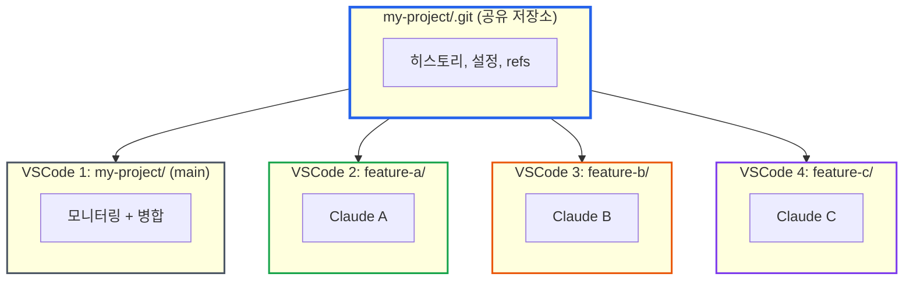

# Git Worktree로 AI 에이전트 동시 개발하기: 실전 튜토리얼

> **작성일**: 2025년 12월 28일
> **카테고리**: Git, AI Development, Workflow
> **키워드**: git worktree, Claude Code, multi-agent, 동시 개발, 브랜치 관리

## 요약

Claude Code를 여러 개 띄워서 frontend와 backend를 동시에 개발하거나, 여러 페이지를 병렬로 작업하면 생산성이 배가될 것이라 기대했다. 현실은 달랐다. 한 에이전트가 작업을 마치고 빌드나 타입체크를 실행하면, 다른 에이전트가 수정 중인 파일 때문에 빌드가 실패했다. 같은 파일을 동시에 수정하려는 충돌도 발생했다.

결국 여러 에이전트를 띄워놔도 실제로는 하나만 사용하게 되었다.

git worktree를 도입한 후, 상황이 바뀌었다. main 브랜치로 전체 상태를 모니터링하는 VSCode 하나, 개별 기능 브랜치를 개발하는 VSCode 여러 개를 띄워서 멀티 에이전트를 충돌 없이 운영할 수 있게 되었다.

## 문제: 같은 폴더에서 멀티에이전트 충돌

여러 에이전트를 동시에 실행하는 시나리오:
- 에이전트 A는 Frontend, 에이전트 B는 Backend 개발
- 또는 에이전트 A, B, C가 각각 다른 페이지 개발

**기대**: 같은 프로젝트 폴더에서 터미널을 여러 개 열고 Claude Code를 각각 실행하면 병렬 개발이 가능할 것이다.

**현실**: 한 에이전트가 `pnpm build`를 실행하면, 다른 에이전트가 수정 중인 불완전한 코드 때문에 빌드가 실패한다. 같은 파일을 동시에 수정하려는 충돌도 발생한다.

---

## 해결책: Worktree + 멀티 VSCode 구조

### Step 1: Worktree 생성 요청

메인 프로젝트의 VSCode에서 Claude Code에게 명시적으로 요청한다.

```
> 멀티 에이전트로 개발할 것이기 때문에 worktree 먼저 생성해
```

Claude Code가 worktree를 생성한다:

```bash
$ git worktree add ../my-project-feature-a -b feature/issue-33 main
```

### Step 2: 해당 Worktree에 VSCode 열기

worktree 생성이 완료되면, VSCode를 열어달라고 요청한다.

```
> 해당 워크트리에 vscode 를 열어줘
```

Claude Code가 새 VSCode 창을 연다:

```bash
$ code "../my-project-feature-a"
```

새 VSCode 창이 열리면 해당 worktree에서 작업을 시작할 수 있다.

### Step 3: 여러 기능을 병렬로 진행

Step 1-2를 반복해서 기능별 worktree를 생성하고, 각각 새 VSCode 창으로 연다.

```
my-project/              ← VSCode 창 1: main (원래 창, 모니터링용)
my-project-feature-a/    ← VSCode 창 2: issue-33 작업
my-project-feature-b/    ← VSCode 창 3: dashboard 작업
my-project-feature-c/    ← VSCode 창 4: payment 작업
```

### Step 4: 각 VSCode에서 Claude Code 실행 및 온보딩

각 VSCode 창에서 Claude Code를 실행하고, `/catchup`으로 프로젝트 컨텍스트를 파악시킨 후 작업을 시작한다.

**VSCode 창 2 (feature-a)**
```bash
$ claude
> /catchup
# Claude가 프로젝트 구조 파악

> 사용자 인증 기능을 구현해줘.
```

**VSCode 창 3 (feature-b)** - 동시에
```bash
$ claude
> /catchup

> 대시보드 UI를 구현해줘.
```

**VSCode 창 4 (feature-c)** - 동시에
```bash
$ claude
> /catchup

> 결제 페이지를 구현해줘.
```

각 에이전트가 독립된 디렉토리에서 작업하므로:
- 빌드/타입체크가 서로 간섭하지 않음
- 같은 파일 수정 충돌 없음
- 각자 커밋 가능

### Step 5: Main VSCode에서 전체 상태 모니터링

main 브랜치의 VSCode에서 Source Control 패널을 열면 모든 worktree가 표시된다.

```
SOURCE CONTROL
├── my-project (main)
├── my-project-feature-a (feature/issue-33)
├── my-project-feature-b (feature/dashboard)
└── my-project-feature-c (feature/payment)
```

각 worktree의 변경사항을 한 화면에서 확인할 수 있다.

### Step 6: 작업 완료 후 병합

각 에이전트가 작업을 완료하면 main에서 병합한다.

```bash
# main VSCode에서
$ git merge feature/issue-33
$ git merge feature/dashboard
$ git merge feature/payment
```

### Step 7: Worktree 정리

병합이 완료된 worktree는 삭제한다.

```bash
$ git worktree remove ../my-project-feature-a
$ git branch -d feature/issue-33
```

---

## 왜 이 방식이 동작하는가?

### 같은 폴더 vs Worktree

| 항목 | 같은 폴더 | git worktree |
|------|----------|--------------|
| 동시 작업 | 불가능 | 가능 |
| 빌드 간섭 | 발생 | 없음 |
| 파일 충돌 | 발생 | 없음 |
| .git 디렉토리 | 공유 | 공유 (링크) |
| 디스크 사용량 | 1배 | 소스 코드만 추가 |

### Worktree 개념

**git worktree**는 하나의 저장소(`.git`)에서 여러 작업 디렉토리를 만드는 기능이다.

호텔에 비유하면:
- **저장소(.git)** = 호텔 본관 (하나)
- **Worktree** = 객실 (여러 개)
- **브랜치** = 각 객실의 투숙객

모든 객실이 같은 호텔 시설(git 히스토리, 리모트 설정)을 공유하지만, 각 객실은 독립적으로 사용된다.


*출처: [GitKraken - Git Worktree](https://www.gitkraken.com/learn/git/git-worktree)*

---

## 실전 팁

### Worktree 네이밍 컨벤션

```bash
# 권장: 프로젝트명-기능명
../my-project-feature-auth
../my-project-feature-dashboard
../my-project-hotfix-login-bug
```

### 같은 브랜치는 동시에 체크아웃 불가

```bash
$ git worktree add ../another-main main
fatal: 'main' is already checked out at '/home/user/my-project'
```

이 제약 덕분에 같은 브랜치를 두 에이전트가 동시에 수정하는 문제를 방지할 수 있다.

### Worktree 정리

```bash
# worktree 목록 확인
$ git worktree list

# 삭제된 디렉토리 정리
$ git worktree prune

# worktree 제거
$ git worktree remove ../my-project-feature-a
```

---

## 멀티에이전트 워크플로우 요약



## 결론

git worktree를 활용하면 여러 Claude Code 인스턴스를 충돌 없이 동시에 운영할 수 있다. 핵심은 **기능별로 worktree를 생성하고, 각 worktree를 별도의 VSCode 창에서 여는 것**이다.

- main VSCode: 전체 상태 모니터링 + 병합
- 기능별 VSCode: 각각 Claude Code 실행

이 구조로 멀티에이전트 개발의 생산성을 실제로 활용할 수 있게 되었다.

## 참고 자료

- [Git Worktree 공식 문서](https://git-scm.com/docs/git-worktree)
- [GitKraken - Git Worktree 가이드](https://www.gitkraken.com/learn/git/git-worktree)
- [Atlassian Git Worktree 가이드](https://www.atlassian.com/git/tutorials/git-worktree)
