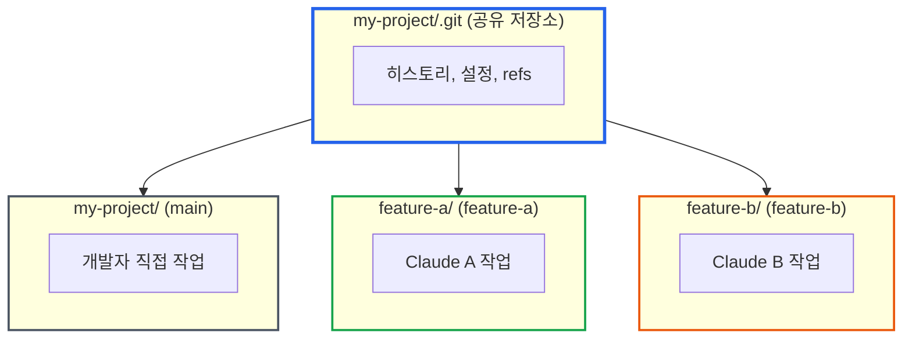

# Git Worktree로 AI 에이전트 동시 개발하기: 실전 튜토리얼

> **작성일**: 2025년 12월 28일
> **카테고리**: Git, AI Development, Workflow
> **키워드**: git worktree, Claude Code, multi-agent, 동시 개발, 브랜치 관리

## 요약

Claude Code, Gemini CLI, Codex 같은 AI 코딩 에이전트를 여러 개 동시에 실행하면 개발 속도가 빨라진다. 하지만 하나의 git 저장소에서 여러 에이전트가 동시에 작업하면 브랜치 충돌이 발생한다. git worktree를 사용하면 각 에이전트가 독립된 작업 디렉토리에서 동시에 다른 기능을 개발할 수 있다. 이 글에서는 Claude A와 Claude B가 각각 Feature A, Feature B를 동시에 개발하는 전체 과정을 따라할 수 있는 튜토리얼을 제공한다.

## 시나리오: 같은 프로젝트에서 동시 작업하고 싶다

프로젝트에 두 가지 기능을 추가해야 한다:
- **Feature A**: 사용자 인증 기능
- **Feature B**: 대시보드 UI

두 기능은 서로 독립적이다. Claude A와 Claude B를 동시에 실행해서 병렬로 개발하면 시간을 절반으로 줄일 수 있다.

**기대하는 것**: VSCode에서 같은 프로젝트 폴더를 열고, 터미널 2개에서 Claude Code를 각각 실행하면 동시에 작업할 수 있지 않을까?

## 방법 1: 같은 폴더에서 VSCode 창 2개 열기

```
my-project/          ← VSCode 창 1 (Claude A)
    └── .git/        ← VSCode 창 2 (Claude B)
```

**결과: 동작하지 않는다.**

```bash
# Claude A가 feature-a 브랜치로 전환
$ git checkout feature-a
Switched to branch 'feature-a'

# Claude B가 feature-b 브랜치로 전환 시도
$ git checkout feature-b
# Claude A의 작업 중인 파일도 함께 feature-b로 전환됨!
```

문제:
- 두 창이 **같은 작업 디렉토리**를 공유
- 한 쪽에서 브랜치를 전환하면 다른 쪽도 영향을 받음
- 동시에 다른 브랜치에서 작업하는 것이 불가능

## 방법 2: 저장소를 2번 clone

```bash
$ git clone https://github.com/user/my-project.git my-project
$ git clone https://github.com/user/my-project.git my-project-copy
```

```
my-project/          ← Claude A
    └── .git/        ← 전체 히스토리 (500MB)

my-project-copy/     ← Claude B
    └── .git/        ← 전체 히스토리 복제 (500MB)
```

**결과: 동작하지만 비효율적이다.**

- 디스크 공간 2배 사용 (`.git` 히스토리가 중복)
- `git fetch`를 각각 실행해야 함
- 두 저장소가 서로 독립적이라 커밋 히스토리 동기화가 수동

## 방법 3: Git Worktree 사용

```bash
$ git worktree add ../my-project-feature-a feature-a
$ git worktree add ../my-project-feature-b feature-b
```

```
my-project/              ← 메인 저장소 (main 브랜치)
    └── .git/            ← 히스토리 (500MB) - 하나만 존재

my-project-feature-a/    ← Claude A (feature-a 브랜치)
    └── .git (링크)      ← my-project/.git 을 가리킴

my-project-feature-b/    ← Claude B (feature-b 브랜치)
    └── .git (링크)      ← my-project/.git 을 가리킴
```

**결과: 동작하며 효율적이다.**

### 세 가지 방법 비교

| 항목 | 같은 폴더 | git clone | git worktree |
|------|----------|-----------|--------------|
| 동시 작업 | 불가능 | 가능 | 가능 |
| .git 디렉토리 | 공유 | 복제됨 (수백 MB~GB) | 공유 (링크만 생성) |
| 디스크 사용량 | 1배 | 2배 | 소스 코드만 추가 |
| 히스토리 동기화 | - | 별도 fetch 필요 | 자동 공유 |
| 브랜치 관리 | 단일 | 독립적 | 통합 관리 |

### Worktree란?

**git worktree**는 하나의 저장소(`.git`)에서 여러 작업 디렉토리를 만드는 기능이다.

호텔에 비유하면:
- **저장소(.git)** = 호텔 본관 (하나)
- **Worktree** = 객실 (여러 개)
- **브랜치** = 각 객실의 투숙객

모든 객실이 같은 호텔 시설(git 히스토리, 리모트 설정)을 공유하지만, 각 객실은 독립적으로 사용된다.


*출처: [GitKraken - Git Worktree](https://www.gitkraken.com/learn/git/git-worktree)*

## 튜토리얼: Claude A, B로 동시 개발하기

### 사전 준비

```bash
# 예제 프로젝트 생성
$ mkdir my-project && cd my-project
$ git init
$ echo "# My Project" > README.md
$ git add . && git commit -m "Initial commit"
```

### Step 1: 기능별 브랜치 생성

```bash
# Feature A 브랜치 생성
$ git branch feature-a

# Feature B 브랜치 생성
$ git branch feature-b

# 브랜치 확인
$ git branch
  feature-a
  feature-b
* main
```

### Step 2: Worktree 생성

각 에이전트가 작업할 독립 디렉토리를 만든다.

```bash
# Claude A를 위한 worktree (feature-a 브랜치)
$ git worktree add ../my-project-feature-a feature-a
Preparing worktree (checking out 'feature-a')
HEAD is now at abc1234 Initial commit

# Claude B를 위한 worktree (feature-b 브랜치)
$ git worktree add ../my-project-feature-b feature-b
Preparing worktree (checking out 'feature-b')
HEAD is now at abc1234 Initial commit
```

### Step 3: 디렉토리 구조 확인

```bash
$ ls -la ../
my-project/           # 메인 저장소 (main 브랜치)
my-project-feature-a/ # Claude A 작업 공간 (feature-a 브랜치)
my-project-feature-b/ # Claude B 작업 공간 (feature-b 브랜치)
```

각 디렉토리는 완전히 독립적인 작업 공간이다.

```bash
# 메인 저장소에서 worktree 목록 확인
$ git worktree list
/home/user/my-project           abc1234 [main]
/home/user/my-project-feature-a abc1234 [feature-a]
/home/user/my-project-feature-b abc1234 [feature-b]
```

### Step 4: 각 에이전트에서 작업 시작

**터미널 1: Claude A 실행**

```bash
$ cd ../my-project-feature-a
$ claude  # Claude Code 실행

# Claude A에게 지시
> 사용자 인증 기능을 구현해줘. src/auth/ 디렉토리에
> login.ts, logout.ts, session.ts 파일을 만들어.
```

**터미널 2: Claude B 실행 (동시에)**

```bash
$ cd ../my-project-feature-b
$ claude  # Claude Code 실행

# Claude B에게 지시
> 대시보드 UI를 구현해줘. src/dashboard/ 디렉토리에
> Dashboard.tsx, Sidebar.tsx, Header.tsx 파일을 만들어.
```

두 에이전트가 **동시에** 각자의 디렉토리에서 작업한다. 서로 간섭하지 않는다.

### Step 5: 작업 중 상태 확인

메인 저장소에서 모든 브랜치의 상태를 확인할 수 있다.

```bash
$ cd ../my-project
$ git log --oneline --all --graph

* def5678 (feature-b) Add dashboard components
* abc9012 (feature-b) Add Header component
| * 789abcd (feature-a) Add session management
| * 456defg (feature-a) Add login/logout
|/
* abc1234 (HEAD -> main) Initial commit
```

### Step 6: 작업 완료 후 병합

Claude A가 Feature A 완료:

```bash
$ cd ../my-project-feature-a
$ git status
On branch feature-a
nothing to commit, working tree clean

$ git log --oneline -3
789abcd Add session management
456defg Add login/logout
abc1234 Initial commit
```

Claude B가 Feature B 완료:

```bash
$ cd ../my-project-feature-b
$ git status
On branch feature-b
nothing to commit, working tree clean
```

### Step 7: Main 브랜치에 병합

```bash
$ cd ../my-project

# Feature A 병합
$ git merge feature-a -m "Merge feature-a: 사용자 인증 기능"

# Feature B 병합
$ git merge feature-b -m "Merge feature-b: 대시보드 UI"

# 최종 히스토리 확인
$ git log --oneline --graph
*   ghi7890 Merge feature-b: 대시보드 UI
|\
| * def5678 Add dashboard components
| * abc9012 Add Header component
* |   xyz4567 Merge feature-a: 사용자 인증 기능
|\ \
| |/
|/|
| * 789abcd Add session management
| * 456defg Add login/logout
|/
* abc1234 Initial commit
```

### Step 8: Worktree 정리

작업이 끝난 worktree는 삭제한다.

```bash
# worktree 제거
$ git worktree remove ../my-project-feature-a
$ git worktree remove ../my-project-feature-b

# 브랜치 삭제 (선택)
$ git branch -d feature-a
$ git branch -d feature-b

# 확인
$ git worktree list
/home/user/my-project  ghi7890 [main]
```

## Claude Code로 Worktree 자동 설정

수동으로 worktree를 생성할 필요 없이, Claude Code에게 직접 요청할 수 있다.

### 실제 사용 예시

```
> git worktree 로 github issue 33 을 진행하고 싶다.
```

Claude Code가 자동으로:

1. **기존 worktree 확인**
```bash
$ git worktree list
C:/Users/user/my-project  fe678c9 [main]
```

2. **관련 브랜치 검색** 후 없으면 새 브랜치와 worktree 생성
```bash
$ git worktree add ../my-project-consumer-journey -b feature/consumer-journey
Preparing worktree (new branch 'feature/consumer-journey')
HEAD is now at fe678c9 fix(web): improve deployment error handling
```

3. **작업 환경 선택 질문**
```
VSCode에서 새 창으로 열까요? 아니면 현재 세션에서 해당 디렉토리로 전환할까요?
```

4. **디렉토리 전환 후 의존성 설치**
```bash
$ cd ../my-project-consumer-journey
$ pnpm install
```

### VSCode Source Control 연동

Worktree를 생성하면 VSCode의 Source Control 패널에 자동으로 표시된다.

```
SOURCE CONTROL
├── my-project (main)
└── my-project-consumer-journey (feature/consumer-journey)
```

각 worktree의 변경사항을 한 화면에서 확인하고 커밋할 수 있다.

### 새 VSCode 창 vs 디렉토리 전환

| 방식 | 장점 | 단점 |
|------|------|------|
| 새 VSCode 창 | 완전히 독립된 환경, 원래 작업 유지 | 창이 많아짐 |
| 디렉토리 전환 | 단일 창에서 작업 | 기존 컨텍스트 잃음 |

**권장**: 병렬 작업 시 새 VSCode 창, 순차 작업 시 디렉토리 전환

## 실전 팁

### 1. Worktree 네이밍 컨벤션

```bash
# 권장: 프로젝트명-브랜치명
../my-project-feature-auth
../my-project-feature-dashboard
../my-project-hotfix-login-bug

# 또는 별도 디렉토리에 모아두기
../worktrees/feature-auth
../worktrees/feature-dashboard
```

### 2. 같은 브랜치는 동시에 체크아웃 불가

```bash
$ git worktree add ../another-main main
fatal: 'main' is already checked out at '/home/user/my-project'
```

이 제약은 의도적이다. 같은 브랜치를 두 곳에서 수정하면 충돌이 발생하기 때문이다.

### 3. Bare Repository 활용

모든 작업을 worktree로만 하려면 bare repository를 사용한다.

```bash
# bare 저장소 생성 (작업 디렉토리 없음)
$ git clone --bare https://github.com/user/repo.git repo.git

# 모든 브랜치를 worktree로 관리
$ cd repo.git
$ git worktree add ../repo-main main
$ git worktree add ../repo-feature-a feature-a
$ git worktree add ../repo-feature-b feature-b
```

이 방식의 장점:
- 메인 저장소가 작업 파일 없이 깔끔함
- 모든 브랜치가 동등하게 worktree로 관리됨

### 4. 원격 브랜치에서 바로 Worktree 생성

```bash
# 원격 브랜치를 추적하는 새 worktree 생성
$ git worktree add ../feature-c -b feature-c origin/feature-c
```

### 5. 임시 Worktree로 빠른 테스트

```bash
# 특정 커밋에서 테스트용 worktree 생성
$ git worktree add ../test-v1.0 v1.0.0

# 테스트 후 삭제
$ git worktree remove ../test-v1.0
```

## 자주 발생하는 문제

### Worktree 디렉토리를 수동 삭제한 경우

```bash
# 수동으로 디렉토리 삭제하면 worktree 목록에 잔재가 남음
$ rm -rf ../my-project-feature-a

# prune으로 정리
$ git worktree prune
```

### 브랜치 삭제 시 worktree가 있는 경우

```bash
$ git branch -d feature-a
error: Cannot delete branch 'feature-a' checked out at '../my-project-feature-a'

# worktree 먼저 제거
$ git worktree remove ../my-project-feature-a
$ git branch -d feature-a
```

## 멀티에이전트 워크플로우 요약



## 결론

git worktree는 멀티에이전트 개발 환경에서 필수 도구다. 각 에이전트가 독립된 작업 공간에서 동시에 작업하면서도 하나의 저장소를 공유할 수 있다. 디스크 공간을 절약하고, 브랜치 관리가 단순해지며, 히스토리가 자동으로 동기화된다.

AI 코딩 에이전트를 여러 개 동시에 활용하려면, 저장소를 복제하는 대신 worktree를 사용하자.

## 참고 자료

- [Git Worktree 공식 문서](https://git-scm.com/docs/git-worktree)
- [GitKraken - Git Worktree 가이드](https://www.gitkraken.com/learn/git/git-worktree)
- [Atlassian Git Worktree 가이드](https://www.atlassian.com/git/tutorials/git-worktree)
