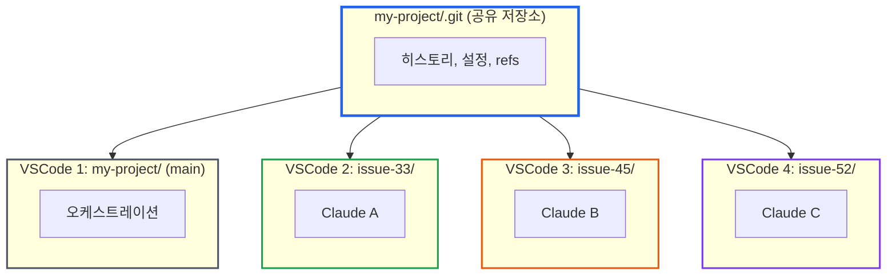

# Git Worktree로 Claude Code 멀티 에이전트 환경 구축하기

> **작성일**: 2025년 12월 28일
> **카테고리**: Git, AI Development, Workflow
> **키워드**: git worktree, Claude Code, multi-agent, 동시 개발, 브랜치 관리

## 요약

Claude Code를 여러 개 동시에 실행하면 개발 속도를 높일 수 있다. 하지만 같은 프로젝트 폴더에서 여러 에이전트가 작업하면 빌드 충돌과 파일 충돌이 발생한다.

git worktree를 사용하면 이 문제를 해결할 수 있다. 하나의 저장소에서 여러 작업 디렉토리를 만들어 각 Claude Code 인스턴스가 독립적으로 작업하도록 구성한다. 이 글에서는 Claude Code로 worktree를 생성하고 멀티 에이전트 환경을 구축하는 방법을 소개한다.

## 문제: 같은 폴더에서 멀티에이전트 충돌

여러 에이전트를 동시에 실행하는 시나리오:
- 에이전트 A는 Frontend, 에이전트 B는 Backend 개발
- 또는 에이전트 A, B, C가 각각 다른 페이지 개발

**기대**: 같은 프로젝트 폴더에서 터미널을 여러 개 열고 Claude Code를 각각 실행하면 병렬 개발이 가능할 것이다.

**현실**: 한 에이전트가 `pnpm build`를 실행하면, 다른 에이전트가 수정 중인 불완전한 코드 때문에 빌드가 실패한다. 같은 파일을 동시에 수정하려는 충돌도 발생한다.

---

## 해결책: Worktree + 멀티 VSCode 구조

### Step 1: Worktree 생성 요청

메인 프로젝트의 VSCode에서 Claude Code에게 명시적으로 요청한다.

```
> issue-33 사용자 인증 기능 개발용으로 worktree 생성해줘
```

Claude Code가 worktree를 생성한다:

```bash
$ git worktree add ../my-project-issue-33 -b feature/issue-33 main
```

### Step 2: 해당 Worktree에 VSCode 열기

worktree 생성이 완료되면, VSCode를 열어달라고 요청한다.

```
> 해당 워크트리에 vscode 를 열어줘
```

Claude Code가 새 VSCode 창을 연다:

```bash
$ code "../my-project-issue-33"
```

새 VSCode 창이 열리면 해당 worktree에서 작업을 시작할 수 있다.

### Step 3: 여러 기능을 병렬로 진행

Step 1-2를 반복해서 기능별 worktree를 생성하고, 각각 새 VSCode 창으로 연다.

```
my-project/              ← VSCode 창 1: main (원래 창, 모니터링용)
my-project-issue-33/     ← VSCode 창 2: 사용자 인증 작업
my-project-issue-45/     ← VSCode 창 3: 대시보드 작업
my-project-issue-52/     ← VSCode 창 4: 결제 작업
```

### Step 4: 각 VSCode에서 Claude Code 실행 및 온보딩

각 VSCode 창에서 Claude Code를 실행하고, `/catchup`으로 프로젝트 컨텍스트를 파악시킨 후 작업을 시작한다.

**VSCode 창 2 (issue-33)**
```bash
$ claude
> /catchup
# Claude가 프로젝트 구조 파악

> 사용자 인증 기능을 구현해줘.
```

**VSCode 창 3 (issue-45)** - 동시에
```bash
$ claude
> /catchup

> 대시보드 UI를 구현해줘.
```

**VSCode 창 4 (issue-52)** - 동시에
```bash
$ claude
> /catchup

> 결제 페이지를 구현해줘.
```

각 에이전트가 독립된 디렉토리에서 작업하므로:
- 빌드/타입체크가 서로 간섭하지 않음
- 같은 파일 수정 충돌 없음
- 각자 커밋 가능

### Step 5: Main VSCode는 오케스트레이션만 담당

main VSCode의 Claude Code는 직접 개발하지 않는다. 역할은 다음과 같다:
- 각 worktree 생성 및 VSCode 창 열기
- 전체 진행 상황 모니터링
- 작업 완료된 브랜치 병합
- worktree 정리

Source Control 패널을 열면 모든 worktree가 표시된다.

```
SOURCE CONTROL
├── my-project (main)
├── my-project-issue-33 (feature/issue-33)
├── my-project-issue-45 (feature/issue-45)
└── my-project-issue-52 (feature/issue-52)
```

각 worktree의 변경사항을 한 화면에서 확인할 수 있다.

### Step 6: 작업 완료 후 병합

각 에이전트가 작업을 완료하면 main VSCode의 Claude Code에게 병합을 요청한다.

```
> issue-33 작업 완료됐어. main에 병합해줘.
```

Claude Code가 병합을 수행한다:

```bash
$ git merge feature/issue-33
```

### Step 7: Worktree 정리

병합이 완료된 worktree는 삭제한다.

```
> issue-33 worktree 정리해줘
```

Claude Code가 worktree와 브랜치를 정리한다:

```bash
$ git worktree remove ../my-project-issue-33
$ git branch -d feature/issue-33
```

---

## 왜 이 방식이 동작하는가?

### 같은 폴더 vs Worktree

| 항목 | 같은 폴더 | git worktree |
|------|----------|--------------|
| 동시 작업 | 불가능 | 가능 |
| 빌드 간섭 | 발생 | 없음 |
| 파일 충돌 | 발생 | 없음 |
| .git 디렉토리 | 공유 | 공유 (링크) |
| 디스크 사용량 | 1배 | 소스 코드만 추가 |

### Worktree 개념

**git worktree**는 하나의 저장소(`.git`)에서 여러 작업 디렉토리를 만드는 기능이다.

호텔에 비유하면:
- **저장소(.git)** = 호텔 본관 (하나)
- **Worktree** = 객실 (여러 개)
- **브랜치** = 각 객실의 투숙객

모든 객실이 같은 호텔 시설(git 히스토리, 리모트 설정)을 공유하지만, 각 객실은 독립적으로 사용된다.


*출처: [GitKraken - Git Worktree](https://www.gitkraken.com/learn/git/git-worktree)*

---

## 실전 팁

### Worktree 네이밍 컨벤션

```bash
# 권장: 프로젝트명-기능명
../my-project-feature-auth
../my-project-feature-dashboard
../my-project-hotfix-login-bug
```

### 같은 브랜치는 동시에 체크아웃 불가

```bash
$ git worktree add ../another-main main
fatal: 'main' is already checked out at '/home/user/my-project'
```

이 제약 덕분에 같은 브랜치를 두 에이전트가 동시에 수정하는 문제를 방지할 수 있다.

### Worktree 정리

```bash
# worktree 목록 확인
$ git worktree list

# 삭제된 디렉토리 정리
$ git worktree prune

# worktree 제거
$ git worktree remove ../my-project-feature-a
```

---

## 멀티에이전트 워크플로우 요약



## 결론

git worktree를 활용하면 여러 Claude Code 인스턴스를 충돌 없이 동시에 운영할 수 있다. 핵심은 **기능별로 worktree를 생성하고, 각 worktree를 별도의 VSCode 창에서 여는 것**이다.

- main VSCode: 오케스트레이션 (worktree 생성, 병합, 정리)
- 기능별 VSCode: 실제 개발 작업

이 구조로 멀티에이전트 개발의 생산성을 실제로 활용할 수 있게 되었다.

## 참고 자료

- [Git Worktree 공식 문서](https://git-scm.com/docs/git-worktree)
- [GitKraken - Git Worktree 가이드](https://www.gitkraken.com/learn/git/git-worktree)
- [Atlassian Git Worktree 가이드](https://www.atlassian.com/git/tutorials/git-worktree)

### 관련 블로그

- [Google Antigravity 업데이트 주의: 같은 폴더에서 AI 도구 동시 사용 시 작업 손실 위험](https://blog.imprun.dev/99) - Git Worktree가 필요해진 배경
