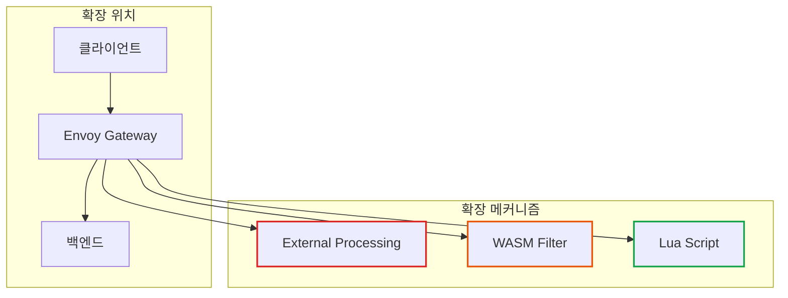
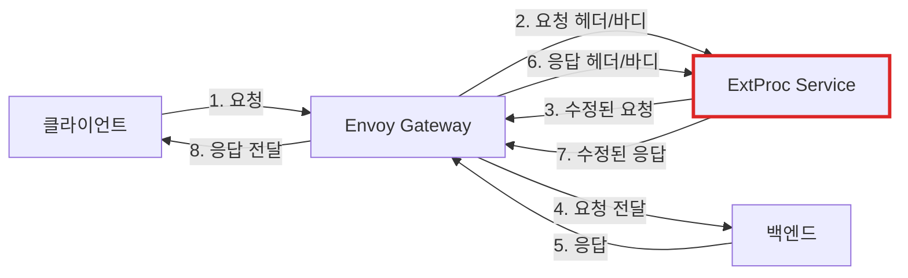
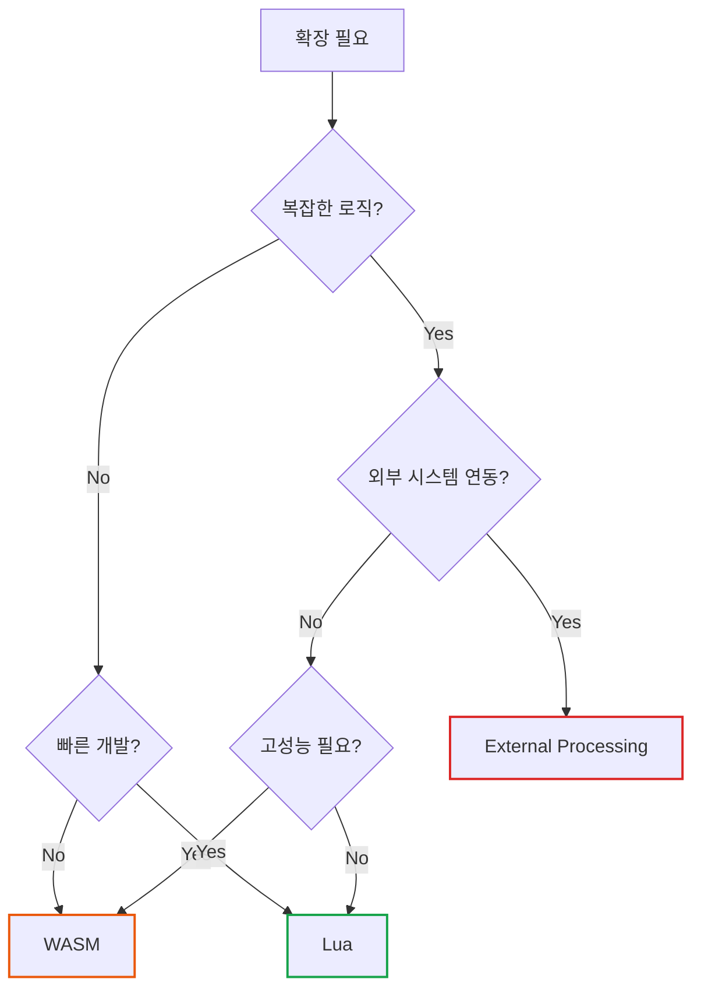

# Envoy Gateway 확장성: External Processing, WASM, Lua

> **작성일**: 2026년 1월 2일
> **카테고리**: Kubernetes, API Gateway, Extensibility
> **키워드**: Envoy Gateway, EnvoyExtensionPolicy, External Processing, WASM, Lua
> **시리즈**: Envoy Gateway 완벽 가이드 (6/6)

## 요약

Envoy Gateway는 표준 기능 외에 커스텀 로직을 삽입할 수 있는 확장 메커니즘을 제공한다. External Processing(ExtProc)은 gRPC 서비스로 요청/응답을 처리하고, WASM은 고성능 바이너리 확장을, Lua는 경량 스크립팅을 지원한다. 이 글에서는 각 확장 방식의 특징과 활용 사례를 다룬다.

## 확장 메커니즘 비교

| 방식 | 언어 | 성능 | 복잡도 | 적합한 상황 |
|-----|------|-----|--------|------------|
| **External Processing** | 모든 언어 (gRPC) | 중간 | 높음 | 복잡한 비즈니스 로직, 외부 시스템 연동 |
| **WASM** | Rust, C++, TinyGo 등 | 높음 | 중간 | 고성능 데이터 변환, 필터링 |
| **Lua** | Lua | 낮음 | 낮음 | 간단한 헤더 조작, 프로토타이핑 |



## External Processing (ExtProc)

### ExtProc란?

External Processing은 HTTP 요청/응답을 **외부 gRPC 서비스**로 보내 처리하는 방식이다. 복잡한 비즈니스 로직이나 외부 시스템 연동에 적합하다.

### 처리 흐름



### 설정 예제

```yaml
apiVersion: gateway.envoyproxy.io/v1alpha1
kind: EnvoyExtensionPolicy
metadata:
  name: ext-proc-policy
spec:
  targetRefs:
  - group: gateway.networking.k8s.io
    kind: HTTPRoute
    name: api-route
  extProc:
  - backendRefs:
    - name: ext-proc-service
      port: 9002
    processingMode:
      # 요청 헤더만 전송 (기본)
      request: {}
      # 응답 헤더 + 바디 스트리밍
      response:
        body: Streamed
```

### Processing Mode 옵션

| 모드 | 설명 |
|-----|------|
| `request: {}` | 요청 헤더만 전송 |
| `request: { body: Buffered }` | 요청 헤더 + 전체 바디 |
| `request: { body: Streamed }` | 요청 헤더 + 바디 스트리밍 |
| `response: {}` | 응답 헤더만 전송 |
| `response: { body: Buffered }` | 응답 헤더 + 전체 바디 |

### ExtProc 서비스 구현 (Go)

```go
package main

import (
    "log"
    "net"

    extproc "github.com/envoyproxy/go-control-plane/envoy/service/ext_proc/v3"
    "google.golang.org/grpc"
)

type server struct {
    extproc.UnimplementedExternalProcessorServer
}

func (s *server) Process(stream extproc.ExternalProcessor_ProcessServer) error {
    for {
        req, err := stream.Recv()
        if err != nil {
            return err
        }

        resp := &extproc.ProcessingResponse{}

        switch r := req.Request.(type) {
        case *extproc.ProcessingRequest_RequestHeaders:
            // 요청 헤더 처리
            log.Printf("Request path: %s", r.RequestHeaders.Headers.Headers)
            resp.Response = &extproc.ProcessingResponse_RequestHeaders{
                RequestHeaders: &extproc.HeadersResponse{
                    Response: &extproc.CommonResponse{
                        HeaderMutation: &extproc.HeaderMutation{
                            SetHeaders: []*core.HeaderValueOption{
                                {
                                    Header: &core.HeaderValue{
                                        Key:   "X-Processed-By",
                                        Value: "ext-proc",
                                    },
                                },
                            },
                        },
                    },
                },
            }
        case *extproc.ProcessingRequest_ResponseHeaders:
            // 응답 헤더 처리
            resp.Response = &extproc.ProcessingResponse_ResponseHeaders{
                ResponseHeaders: &extproc.HeadersResponse{},
            }
        }

        if err := stream.Send(resp); err != nil {
            return err
        }
    }
}

func main() {
    lis, _ := net.Listen("tcp", ":9002")
    s := grpc.NewServer()
    extproc.RegisterExternalProcessorServer(s, &server{})
    s.Serve(lis)
}
```

### 활용 사례

| 사례 | 설명 |
|-----|------|
| **요청 검증** | 복잡한 JSON 스키마 검증, 비즈니스 규칙 적용 |
| **데이터 변환** | 요청/응답 페이로드 변환 (XML → JSON 등) |
| **외부 연동** | 실시간 데이터 조회, 캐시 업데이트 |
| **감사 로깅** | 상세 요청 로그 저장, 컴플라이언스 |

## WASM (WebAssembly)

### WASM이란?

WebAssembly는 브라우저에서 시작되었지만, 이제 서버 사이드에서도 사용된다. Envoy에서는 **고성능 필터**로 활용된다. C++, Rust, TinyGo 등으로 작성하고, 바이너리로 컴파일하여 Envoy에 로드한다.

### WASM 로딩 방식

| 방식 | 설명 |
|-----|------|
| **HTTP** | URL에서 다운로드 |
| **Image** | OCI 이미지에서 로드 |

### HTTP WASM 예제

```yaml
apiVersion: gateway.envoyproxy.io/v1alpha1
kind: EnvoyExtensionPolicy
metadata:
  name: wasm-policy
spec:
  targetRefs:
  - group: gateway.networking.k8s.io
    kind: HTTPRoute
    name: api-route
  wasm:
  - name: custom-filter
    rootID: my_filter
    code:
      type: HTTP
      http:
        url: https://example.com/filters/custom.wasm
        sha256: abc123...  # 무결성 검증
```

### OCI Image WASM 예제

```yaml
apiVersion: gateway.envoyproxy.io/v1alpha1
kind: EnvoyExtensionPolicy
metadata:
  name: wasm-image-policy
spec:
  targetRefs:
  - group: gateway.networking.k8s.io
    kind: HTTPRoute
    name: api-route
  wasm:
  - name: custom-filter
    rootID: my_filter
    code:
      type: Image
      image:
        url: registry.example.com/wasm-filters/custom:v1.0
        pullSecretRef:
          name: registry-credentials
```

### WASM 개발 (Rust + proxy-wasm)

```rust
use proxy_wasm::traits::*;
use proxy_wasm::types::*;

proxy_wasm::main! {{
    proxy_wasm::set_http_context(|_, _| -> Box<dyn HttpContext> {
        Box::new(CustomFilter)
    });
}}

struct CustomFilter;

impl Context for CustomFilter {}

impl HttpContext for CustomFilter {
    fn on_http_request_headers(&mut self, _: usize, _: bool) -> Action {
        // 요청 헤더에 커스텀 헤더 추가
        self.add_http_request_header("X-Wasm-Processed", "true");

        // 특정 헤더 검사
        if let Some(api_key) = self.get_http_request_header("X-API-Key") {
            if !validate_api_key(&api_key) {
                self.send_http_response(403, vec![], Some(b"Forbidden"));
                return Action::Pause;
            }
        }

        Action::Continue
    }

    fn on_http_response_headers(&mut self, _: usize, _: bool) -> Action {
        // 응답 헤더 수정
        self.set_http_response_header("X-Powered-By", Some("WASM"));
        Action::Continue
    }
}

fn validate_api_key(key: &str) -> bool {
    // API Key 검증 로직
    key.starts_with("sk_")
}
```

### WASM 빌드 및 배포

```bash
# Rust WASM 빌드
cargo build --target wasm32-wasi --release

# OCI 이미지로 패키징
wasm-to-oci push \
  target/wasm32-wasi/release/custom_filter.wasm \
  registry.example.com/wasm-filters/custom:v1.0
```

### 활용 사례

| 사례 | 설명 |
|-----|------|
| **고성능 필터링** | 대용량 요청 검사, 패턴 매칭 |
| **데이터 마스킹** | PII 데이터 마스킹, 로그 필터링 |
| **커스텀 인증** | 독자적 토큰 검증 로직 |
| **메트릭 수집** | 커스텀 메트릭, 요청 분석 |

## Lua Scripting

### Lua란?

Lua는 경량 스크립팅 언어로, 간단한 요청/응답 수정에 적합하다. 컴파일 없이 즉시 적용할 수 있어 프로토타이핑에 유용하다.

### 설정 예제

```yaml
apiVersion: gateway.envoyproxy.io/v1alpha1
kind: EnvoyExtensionPolicy
metadata:
  name: lua-policy
spec:
  targetRefs:
  - group: gateway.networking.k8s.io
    kind: HTTPRoute
    name: api-route
  lua:
    source:
      type: Inline
      inline: |
        function envoy_on_request(request_handle)
          -- 요청 헤더 추가
          request_handle:headers():add("X-Lua-Processed", "true")

          -- 특정 경로 차단
          local path = request_handle:headers():get(":path")
          if string.match(path, "^/admin") then
            request_handle:respond({[":status"] = "403"}, "Forbidden")
          end
        end

        function envoy_on_response(response_handle)
          -- 응답 헤더 수정
          response_handle:headers():add("X-Response-Time", os.time())
        end
```

### ConfigMap 참조

```yaml
apiVersion: v1
kind: ConfigMap
metadata:
  name: lua-scripts
data:
  filter.lua: |
    function envoy_on_request(request_handle)
      local headers = request_handle:headers()
      -- 로직 구현
    end
---
apiVersion: gateway.envoyproxy.io/v1alpha1
kind: EnvoyExtensionPolicy
metadata:
  name: lua-configmap-policy
spec:
  targetRefs:
  - group: gateway.networking.k8s.io
    kind: HTTPRoute
    name: api-route
  lua:
    source:
      type: ValueRef
      valueRef:
        group: ""
        kind: ConfigMap
        name: lua-scripts
        key: filter.lua
```

### 활용 사례

| 사례 | 설명 |
|-----|------|
| **헤더 조작** | 헤더 추가/삭제/수정 |
| **간단한 라우팅** | 조건부 응답, 리다이렉트 |
| **디버깅** | 요청/응답 로깅 |
| **프로토타이핑** | 기능 검증 후 WASM으로 전환 |

## 확장 방식 선택 가이드



| 상황 | 권장 방식 |
|-----|---------|
| 외부 데이터베이스 조회 필요 | **ExtProc** |
| 복잡한 비즈니스 검증 | **ExtProc** |
| 고성능 데이터 변환 | **WASM** |
| 커스텀 인증 로직 | **WASM** |
| 간단한 헤더 조작 | **Lua** |
| 빠른 프로토타이핑 | **Lua** |

## imprun 확장 포인트 설계

imprun apigateway에서 확장을 지원할 때 고려할 사항:

### 1. 플러그인 인터페이스

```go
type Plugin interface {
    // 요청 전처리
    OnRequest(ctx context.Context, req *http.Request) (*http.Request, error)
    // 응답 후처리
    OnResponse(ctx context.Context, resp *http.Response) (*http.Response, error)
}
```

### 2. Envoy Gateway 매핑

| imprun Plugin 설정 | Envoy Gateway 리소스 |
|-------------------|---------------------|
| `type: extproc` | EnvoyExtensionPolicy + `.spec.extProc` |
| `type: wasm` | EnvoyExtensionPolicy + `.spec.wasm` |
| `type: lua` | EnvoyExtensionPolicy + `.spec.lua` |

### 3. 확장 설정 예시

```json
{
  "route": "/api/v1/*",
  "plugins": [
    {
      "name": "request-validator",
      "type": "extproc",
      "config": {
        "service": "validator-service:9002"
      }
    },
    {
      "name": "response-masker",
      "type": "wasm",
      "config": {
        "image": "registry.example.com/masker:v1.0"
      }
    }
  ]
}
```

## 시리즈 마무리

이 시리즈에서 다룬 내용을 정리하면:

1. **개요**: API Gateway 개념, Gateway API vs Ingress, Envoy Gateway 아키텍처
2. **핵심 리소스**: GatewayClass, Gateway, HTTPRoute, ReferenceGrant
3. **확장 API**: SecurityPolicy, BackendTrafficPolicy, ClientTrafficPolicy, Backend
4. **보안**: JWT, OIDC, ExtAuth, API Key, CORS
5. **트래픽 관리**: Rate Limiting, Circuit Breaker, Load Balancing, Retry, Timeout
6. **확장성**: External Processing, WASM, Lua

imprun apigateway 개발 시 이 내용을 참고하여 Envoy Gateway CRD 생성 로직을 구현하면 된다.

## 참고 자료

### 공식 문서
- [External Processing](https://gateway.envoyproxy.io/docs/tasks/extensibility/ext-proc/)
- [WASM Extensions](https://gateway.envoyproxy.io/docs/tasks/extensibility/wasm/)
- [Envoy WASM SDK](https://github.com/proxy-wasm/proxy-wasm-rust-sdk)

### 관련 블로그
- [Envoy Gateway 트래픽 관리](https://blog.imprun.dev/110)
- [Envoy Gateway 보안](https://blog.imprun.dev/109)

---

## 시리즈 네비게이션

| 이전 글 | 다음 글 |
|--------|--------|
| [트래픽 관리: Rate Limiting, Circuit Breaker](https://blog.imprun.dev/110) | - |

**Envoy Gateway 완벽 가이드 시리즈**
1. [Envoy Gateway 개요](https://blog.imprun.dev/106)
2. [Gateway API 핵심 리소스](https://blog.imprun.dev/107)
3. [확장 API](https://blog.imprun.dev/108)
4. [보안](https://blog.imprun.dev/109)
5. [트래픽 관리](https://blog.imprun.dev/110)
6. **확장성: ExtProc, WASM, Lua** ← 현재 글