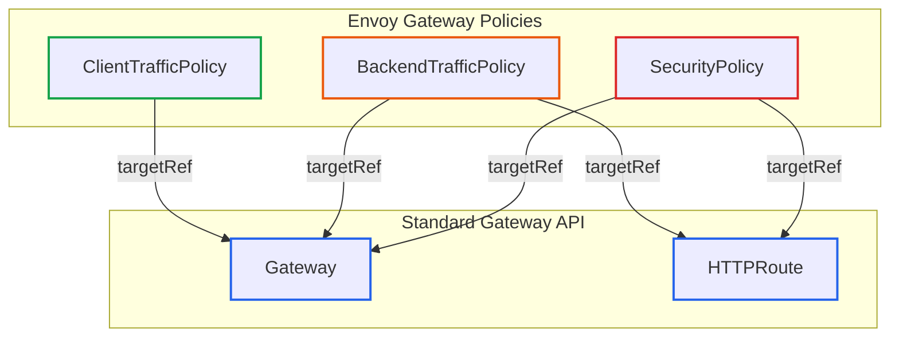
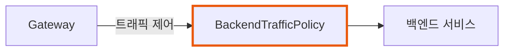

# Envoy Gateway 확장 API: Policy Attachment 모델과 실전 활용

> **작성일**: 2026년 1월 2일
> **카테고리**: Kubernetes, API Gateway, Envoy Gateway
> **키워드**: Envoy Gateway, SecurityPolicy, BackendTrafficPolicy, ClientTrafficPolicy, Backend
> **시리즈**: Envoy Gateway 완벽 가이드 (3/6)

## 요약

Envoy Gateway는 표준 Gateway API에 없는 기능을 확장 CRD로 제공한다. SecurityPolicy(보안), BackendTrafficPolicy(백엔드 트래픽), ClientTrafficPolicy(클라이언트 트래픽), Backend(외부 엔드포인트)가 핵심이다. 이 글에서는 Policy Attachment 모델, 정책 우선순위, 각 리소스의 역할을 설명한다.

## 왜 확장 API가 필요한가

표준 Gateway API는 라우팅(HTTPRoute)만 정의한다. 실무에서 필요한 기능들은 빠져있다:

- JWT 인증, API Key 검증
- 속도 제한, 서킷 브레이커
- 재시도, 타임아웃 정책
- 외부 URL/IP 백엔드 연결

Ingress 시절에는 이런 기능을 **어노테이션**으로 해결했다.

```yaml
# Ingress 방식 - 타입 검증 없음, 컨트롤러마다 상이
annotations:
  nginx.ingress.kubernetes.io/auth-type: "jwt"
  nginx.ingress.kubernetes.io/auth-jwt-secret: "my-secret"
```

Gateway API 확장은 **타입 안전한 CRD**로 해결한다.

```yaml
# Gateway API 확장 방식 - 타입 검증, 표준화
apiVersion: gateway.envoyproxy.io/v1alpha1
kind: SecurityPolicy
spec:
  jwt:
    providers:
    - name: my-provider
      remoteJWKS:
        uri: https://auth.example.com/.well-known/jwks.json
```

## Policy Attachment 모델

### 개념

Policy Attachment는 **정책을 리소스에 부착**하는 패턴이다. HTTPRoute나 Gateway를 직접 수정하지 않고, 별도의 Policy 리소스를 만들어 연결한다.



### targetRef: 정책 연결

모든 Policy는 `targetRef` 또는 `targetRefs`로 대상을 지정한다.

**단일 대상 지정**
```yaml
spec:
  targetRef:
    group: gateway.networking.k8s.io
    kind: HTTPRoute
    name: my-route
```

**다중 대상 지정**
```yaml
spec:
  targetRefs:
  - group: gateway.networking.k8s.io
    kind: HTTPRoute
    name: route-a
  - group: gateway.networking.k8s.io
    kind: HTTPRoute
    name: route-b
```

**레이블 기반 선택**
```yaml
spec:
  targetSelectors:
  - kind: HTTPRoute
    matchLabels:
      env: production
```

**특정 섹션 지정 (sectionName)**
```yaml
spec:
  targetRef:
    group: gateway.networking.k8s.io
    kind: Gateway
    name: my-gateway
    sectionName: https-listener  # 특정 리스너만
```

## 정책 우선순위

여러 정책이 같은 리소스에 적용될 때 우선순위가 중요하다.

### 계층별 우선순위

```
높음 ┌─────────────────────────────────────┐
     │  Route Rule Level (sectionName)    │
     ├─────────────────────────────────────┤
     │  Route Level (HTTPRoute)           │
     ├─────────────────────────────────────┤
     │  Listener Level (sectionName)      │
     ├─────────────────────────────────────┤
낮음 │  Gateway Level                      │
     └─────────────────────────────────────┘
```

**예시:**
```yaml
# Gateway 레벨 (우선순위 낮음)
kind: BackendTrafficPolicy
spec:
  targetRef:
    kind: Gateway
    name: my-gateway
  circuitBreaker:
    maxConnections: 100

---
# Route 레벨 (우선순위 높음)
kind: BackendTrafficPolicy
spec:
  targetRef:
    kind: HTTPRoute
    name: my-route
  circuitBreaker:
    maxConnections: 50  # 이 값이 적용됨
```

### 동일 레벨에서의 충돌

같은 레벨에 여러 정책이 있으면:

1. **생성 시간 우선**: 먼저 생성된 정책이 우선
2. **이름순 정렬**: 생성 시간이 같으면 알파벳순

## SecurityPolicy

### 역할

SecurityPolicy는 **인증/인가**를 담당한다. JWT 검증, 외부 인증, CORS 등을 설정한다.


### 지원 기능

| 기능 | 설명 |
|-----|------|
| `jwt` | JWT 토큰 검증 (JWKS) |
| `oidc` | OIDC Provider 연동 |
| `basicAuth` | Basic 인증 |
| `apiKey` | API Key 인증 |
| `extAuth` | 외부 인증 서비스 (HTTP/gRPC) |
| `cors` | CORS 정책 |
| `authorization` | 인가 규칙 (IP, JWT claim) |

### 예제: JWT 인증

```yaml
apiVersion: gateway.envoyproxy.io/v1alpha1
kind: SecurityPolicy
metadata:
  name: jwt-auth
spec:
  targetRef:
    group: gateway.networking.k8s.io
    kind: HTTPRoute
    name: api-route
  jwt:
    providers:
    - name: auth0
      remoteJWKS:
        uri: https://my-tenant.auth0.com/.well-known/jwks.json
      claimToHeaders:
      - claim: sub
        header: X-User-ID
```

### 예제: 외부 인증 서비스

```yaml
apiVersion: gateway.envoyproxy.io/v1alpha1
kind: SecurityPolicy
metadata:
  name: ext-auth
spec:
  targetRef:
    group: gateway.networking.k8s.io
    kind: HTTPRoute
    name: api-route
  extAuth:
    http:
      backendRefs:
      - name: auth-service
        port: 9001
      headersToBackend:
      - Authorization
      - X-Tenant-ID
```

## BackendTrafficPolicy

### 역할

BackendTrafficPolicy는 **Gateway → 백엔드** 구간의 트래픽을 제어한다.



### 지원 기능

| 기능 | 설명 |
|-----|------|
| `rateLimit` | 속도 제한 (Local/Global) |
| `circuitBreaker` | 서킷 브레이커 |
| `loadBalancer` | 로드 밸런싱 알고리즘 |
| `retry` | 재시도 정책 |
| `timeout` | 타임아웃 설정 |
| `healthCheck` | 헬스 체크 |
| `tcpKeepalive` | TCP Keepalive |

### 예제: 속도 제한

```yaml
apiVersion: gateway.envoyproxy.io/v1alpha1
kind: BackendTrafficPolicy
metadata:
  name: rate-limit-policy
spec:
  targetRef:
    group: gateway.networking.k8s.io
    kind: HTTPRoute
    name: api-route
  rateLimit:
    type: Local
    local:
      rules:
      - limit:
          requests: 100
          unit: Minute
```

### 예제: 서킷 브레이커 + 재시도

```yaml
apiVersion: gateway.envoyproxy.io/v1alpha1
kind: BackendTrafficPolicy
metadata:
  name: resilience-policy
spec:
  targetRef:
    group: gateway.networking.k8s.io
    kind: HTTPRoute
    name: api-route

  # 서킷 브레이커
  circuitBreaker:
    maxConnections: 100
    maxPendingRequests: 50
    maxParallelRequests: 100

  # 재시도
  retry:
    numRetries: 3
    perRetry:
      backOff:
        baseInterval: 100ms
        maxInterval: 1s
    retryOn:
      triggers:
      - "5xx"
      - "gateway-error"
      - "reset"

  # 타임아웃
  timeout:
    tcp:
      connectTimeout: 5s
    http:
      requestTimeout: 30s
```

### Policy Merging

BackendTrafficPolicy는 `mergeType`으로 상위 정책과 병합할 수 있다.

```yaml
# Gateway 레벨 정책
apiVersion: gateway.envoyproxy.io/v1alpha1
kind: BackendTrafficPolicy
metadata:
  name: global-policy
spec:
  targetRef:
    kind: Gateway
    name: my-gateway
  rateLimit:
    global:
      rules:
      - limit:
          requests: 1000
          unit: Second

---
# Route 레벨 정책 - 병합
apiVersion: gateway.envoyproxy.io/v1alpha1
kind: BackendTrafficPolicy
metadata:
  name: route-policy
spec:
  targetRef:
    kind: HTTPRoute
    name: my-route
  mergeType: StrategicMerge  # 상위 정책과 병합
  rateLimit:
    local:
      rules:
      - limit:
          requests: 10
          unit: Minute
# 결과: Global(1000/s) + Local(10/min) 둘 다 적용
```

## ClientTrafficPolicy

### 역할

ClientTrafficPolicy는 **클라이언트 → Gateway** 구간을 제어한다. Gateway의 리스너 동작을 설정한다.

### 지원 기능

| 기능 | 설명 |
|-----|------|
| `tls` | TLS 설정 (버전, 암호화 스위트) |
| `clientTimeout` | 클라이언트 타임아웃 |
| `tcpKeepalive` | TCP Keepalive |
| `http1/http2/http3` | HTTP 프로토콜 설정 |
| `path` | 경로 정규화 |
| `headers` | 헤더 처리 |
| `clientIPDetection` | 실제 클라이언트 IP 감지 |
| `connection` | 연결 제한 |

### 예제: TLS + HTTP/2 설정

```yaml
apiVersion: gateway.envoyproxy.io/v1alpha1
kind: ClientTrafficPolicy
metadata:
  name: tls-policy
spec:
  targetRef:
    group: gateway.networking.k8s.io
    kind: Gateway
    name: my-gateway
    sectionName: https-listener

  tls:
    minVersion: "1.2"
    maxVersion: "1.3"
    ciphers:
    - ECDHE-ECDSA-AES256-GCM-SHA384
    - ECDHE-RSA-AES256-GCM-SHA384

  http2:
    initialStreamWindowSize: 65536
    initialConnectionWindowSize: 1048576
```

### 예제: 클라이언트 IP 감지

```yaml
apiVersion: gateway.envoyproxy.io/v1alpha1
kind: ClientTrafficPolicy
metadata:
  name: client-ip-policy
spec:
  targetRef:
    kind: Gateway
    name: my-gateway
  clientIPDetection:
    xForwardedFor:
      numTrustedHops: 2  # 신뢰할 프록시 수
```

## Backend

### 역할

Backend는 **외부 엔드포인트**를 정의한다. 클러스터 외부의 URL이나 IP를 백엔드로 사용할 때 필요하다.

### 활성화

Backend는 기본적으로 비활성화되어 있다. EnvoyGateway 설정에서 활성화해야 한다.

```yaml
apiVersion: v1
kind: ConfigMap
metadata:
  name: envoy-gateway-config
  namespace: envoy-gateway-system
data:
  envoy-gateway.yaml: |
    apiVersion: gateway.envoyproxy.io/v1alpha1
    kind: EnvoyGateway
    extensionApis:
      enableBackend: true
```

### 예제: 외부 API 라우팅

```yaml
# Backend 정의
apiVersion: gateway.envoyproxy.io/v1alpha1
kind: Backend
metadata:
  name: external-api
spec:
  endpoints:
  - fqdn:
      hostname: api.external-service.com
      port: 443

---
# HTTPRoute에서 참조
apiVersion: gateway.networking.k8s.io/v1
kind: HTTPRoute
metadata:
  name: external-route
spec:
  parentRefs:
  - name: eg
  rules:
  - matches:
    - path:
        type: PathPrefix
        value: /external
    backendRefs:
    - group: gateway.envoyproxy.io
      kind: Backend
      name: external-api
```

### 예제: IP 기반 백엔드

```yaml
apiVersion: gateway.envoyproxy.io/v1alpha1
kind: Backend
metadata:
  name: legacy-service
spec:
  endpoints:
  - ip:
      address: 192.168.1.100
      port: 8080
  - ip:
      address: 192.168.1.101
      port: 8080
```

### Dynamic Forward Proxy

Backend를 `DynamicResolver` 타입으로 설정하면 동적 포워드 프록시로 동작한다.

```yaml
apiVersion: gateway.envoyproxy.io/v1alpha1
kind: Backend
metadata:
  name: dynamic-proxy
spec:
  type: DynamicResolver
  tls:
    wellKnownCACertificates: System
```

## imprun Entity 매핑

imprun apigateway의 설정이 Envoy Gateway 확장 API로 어떻게 변환되는지 정리한다.

| imprun 설정 | Envoy Gateway 리소스 | 필드 |
|------------|---------------------|------|
| `auth_mode: jwt` | SecurityPolicy | `.spec.jwt` |
| `auth_mode: apikey` | SecurityPolicy | `.spec.extAuth` (ExtAuth 서비스) |
| `auth_mode: oidc` | SecurityPolicy | `.spec.oidc` |
| `rate_limit` | BackendTrafficPolicy | `.spec.rateLimit` |
| `retry` | BackendTrafficPolicy | `.spec.retry` |
| `timeout` | BackendTrafficPolicy | `.spec.timeout` |
| `circuit_breaker` | BackendTrafficPolicy | `.spec.circuitBreaker` |
| `backend.url` (외부) | Backend | `.spec.endpoints` |
| `tls_settings` | ClientTrafficPolicy | `.spec.tls` |

## 다음 글 미리보기

[Envoy Gateway 보안](https://blog.imprun.dev/109)에서는 SecurityPolicy를 활용한 보안 구현(JWT, ExtAuth, OIDC, CORS)을 상세히 다룬다.

## 참고 자료

### 공식 문서
- [Envoy Gateway Extension Types API Reference](https://gateway.envoyproxy.io/docs/api/extension_types/)
- [SecurityPolicy](https://gateway.envoyproxy.io/docs/concepts/gateway_api_extensions/security-policy/)
- [BackendTrafficPolicy](https://gateway.envoyproxy.io/docs/concepts/gateway_api_extensions/backend-traffic-policy/)
- [ClientTrafficPolicy](https://gateway.envoyproxy.io/docs/concepts/gateway_api_extensions/client-traffic-policy/)

### 관련 블로그
- [Gateway API 핵심 리소스 가이드](https://blog.imprun.dev/107)
- [Envoy Gateway 개요](https://blog.imprun.dev/106)

---

## 시리즈 네비게이션

| 이전 글 | 다음 글 |
|--------|--------|
| [Gateway API 핵심 리소스](https://blog.imprun.dev/107) | [보안: 인증/인가 완벽 가이드](https://blog.imprun.dev/109) |

**Envoy Gateway 완벽 가이드 시리즈**
1. [Envoy Gateway 개요](https://blog.imprun.dev/106)
2. [Gateway API 핵심 리소스](https://blog.imprun.dev/107)
3. **확장 API: Policy Attachment 모델** ← 현재 글
4. [보안](https://blog.imprun.dev/109)
5. [트래픽 관리](https://blog.imprun.dev/110)
6. [확장성](https://blog.imprun.dev/111)