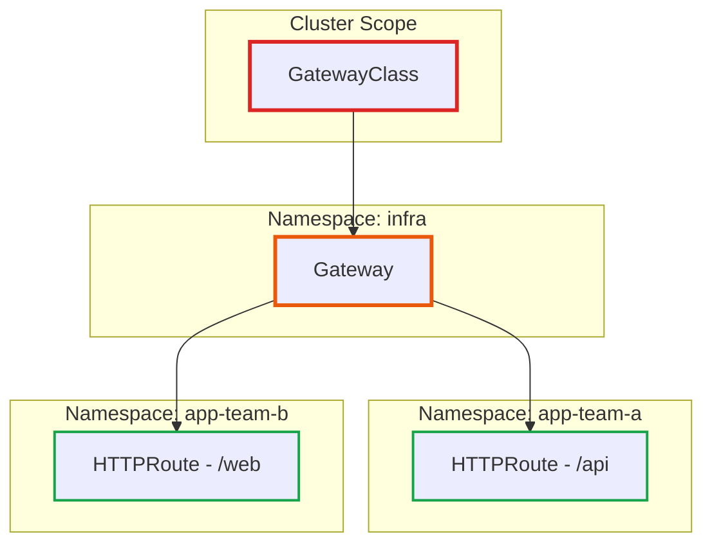
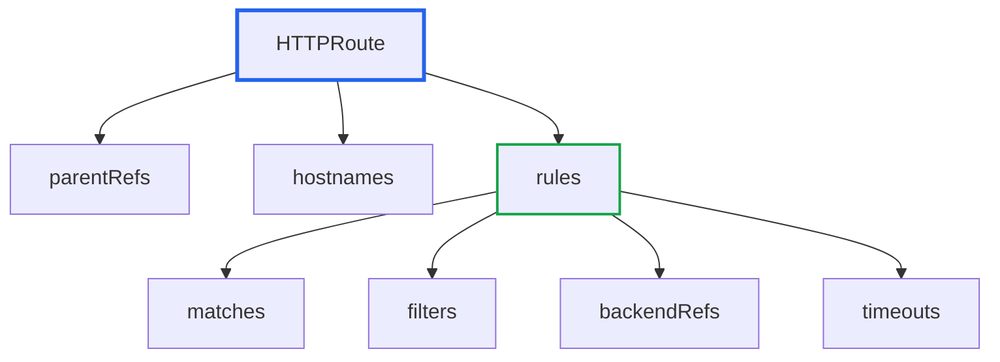
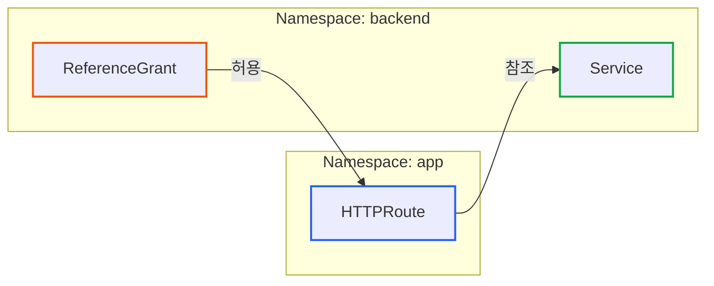

# Gateway API 핵심 리소스 가이드: GatewayClass, Gateway, HTTPRoute

> **작성일**: 2026년 1월 2일
> **카테고리**: Kubernetes, API Gateway, Gateway API
> **키워드**: Gateway API, GatewayClass, Gateway, HTTPRoute, Kubernetes
> **시리즈**: Envoy Gateway 완벽 가이드 (2/6)

## 요약

Gateway API는 GatewayClass, Gateway, Route의 3계층 구조로 트래픽 라우팅을 정의한다. 각 리소스는 인프라 팀, 플랫폼 팀, 애플리케이션 팀이 분리하여 관리할 수 있도록 설계되었다. 이 글에서는 각 리소스의 스펙, 관계, 실전 예제를 다룬다.

## Gateway API 리소스 계층 구조

Gateway API는 **역할 분리**를 핵심 설계 원칙으로 한다.

| 계층 | 역할 | 담당 |
|-----|------|------|
| GatewayClass | 어떤 종류의 Gateway를 만들지 정의 | 인프라 팀 |
| Gateway | 실제 진입점(리스너) 정의 | 플랫폼 팀 |
| HTTPRoute | 라우팅 규칙 정의 | 애플리케이션 팀 |



## GatewayClass

### 역할

GatewayClass는 **클러스터 스코프** 리소스로, Gateway 컨트롤러를 지정한다. Ingress의 IngressClass와 동일한 역할이다.

### 스펙

```yaml
apiVersion: gateway.networking.k8s.io/v1
kind: GatewayClass
metadata:
  name: eg  # 클러스터 스코프 - namespace 없음
spec:
  controllerName: gateway.envoyproxy.io/gatewayclass-controller
```

| 필드 | 설명 |
|-----|------|
| `controllerName` | Gateway를 관리할 컨트롤러 식별자 |
| `parametersRef` | (선택) 컨트롤러별 추가 설정 참조 |

### Envoy Gateway의 GatewayClass

Envoy Gateway를 설치하면 기본 GatewayClass가 생성된다:

```yaml
apiVersion: gateway.networking.k8s.io/v1
kind: GatewayClass
metadata:
  name: eg
spec:
  controllerName: gateway.envoyproxy.io/gatewayclass-controller
```

### 상태 확인

```bash
kubectl get gatewayclass eg -o yaml
```

```yaml
status:
  conditions:
  - type: Accepted
    status: "True"
    reason: Accepted
    message: "GatewayClass has been accepted by the controller"
```

`Accepted: True`면 컨트롤러가 이 GatewayClass를 인식했다는 의미다.

## Gateway

### 역할

Gateway는 **리스너(Listener)**를 정의하는 리소스다. 어떤 포트에서, 어떤 프로토콜로, 어떤 호스트의 트래픽을 받을지 결정한다.

### 스펙

```yaml
apiVersion: gateway.networking.k8s.io/v1
kind: Gateway
metadata:
  name: eg
  namespace: default
spec:
  gatewayClassName: eg  # 어떤 GatewayClass를 사용할지
  listeners:
  - name: http
    protocol: HTTP
    port: 80
    hostname: "*.example.com"  # 이 호스트만 허용
    allowedRoutes:
      namespaces:
        from: All  # 모든 네임스페이스의 Route 허용
```

### Listeners 상세

| 필드 | 설명 | 예시 |
|-----|------|------|
| `name` | 리스너 식별자 | `http`, `https`, `grpc` |
| `protocol` | 프로토콜 | `HTTP`, `HTTPS`, `TLS`, `TCP`, `UDP` |
| `port` | 포트 번호 | `80`, `443`, `8080` |
| `hostname` | 호스트 패턴 | `*.example.com`, `api.example.com` |
| `tls` | TLS 설정 | 인증서 Secret 참조 |
| `allowedRoutes` | Route 허용 정책 | 네임스페이스, 종류 제한 |

### 멀티 리스너 예제

```yaml
apiVersion: gateway.networking.k8s.io/v1
kind: Gateway
metadata:
  name: multi-listener-gateway
  namespace: infra
spec:
  gatewayClassName: eg
  listeners:
  # HTTP 리스너 - HTTPS로 리다이렉트용
  - name: http
    protocol: HTTP
    port: 80
    hostname: "*.example.com"
    allowedRoutes:
      namespaces:
        from: All

  # HTTPS 리스너 - 실제 트래픽 처리
  - name: https
    protocol: HTTPS
    port: 443
    hostname: "*.example.com"
    tls:
      mode: Terminate
      certificateRefs:
      - kind: Secret
        name: wildcard-tls
    allowedRoutes:
      namespaces:
        from: Selector
        selector:
          matchLabels:
            gateway-access: "true"

  # gRPC 전용 리스너
  - name: grpc
    protocol: HTTP  # gRPC는 HTTP/2 기반
    port: 9000
    hostname: "grpc.example.com"
    allowedRoutes:
      kinds:
      - kind: GRPCRoute
```

### allowedRoutes 패턴

**1. 모든 네임스페이스 허용**
```yaml
allowedRoutes:
  namespaces:
    from: All
```

**2. 같은 네임스페이스만 허용**
```yaml
allowedRoutes:
  namespaces:
    from: Same
```

**3. 레이블 기반 선택**
```yaml
allowedRoutes:
  namespaces:
    from: Selector
    selector:
      matchLabels:
        env: production
```

**4. Route 종류 제한**
```yaml
allowedRoutes:
  kinds:
  - kind: HTTPRoute
  - kind: GRPCRoute
```

### 상태 확인

```bash
kubectl get gateway eg -o yaml
```

```yaml
status:
  addresses:
  - type: IPAddress
    value: 10.96.0.100  # 할당된 IP
  listeners:
  - name: http
    attachedRoutes: 3  # 연결된 Route 수
    conditions:
    - type: Programmed
      status: "True"
```

## HTTPRoute

### 역할

HTTPRoute는 **라우팅 규칙**을 정의한다. 어떤 요청(Path, Header, Query)을 어떤 백엔드로 보낼지 결정한다.

### 스펙 구조



### 기본 예제

```yaml
apiVersion: gateway.networking.k8s.io/v1
kind: HTTPRoute
metadata:
  name: api-route
  namespace: app-team-a
spec:
  # 어떤 Gateway에 연결할지
  parentRefs:
  - name: eg
    namespace: default

  # 호스트 매칭
  hostnames:
  - "api.example.com"

  # 라우팅 규칙
  rules:
  - matches:
    - path:
        type: PathPrefix
        value: /users
    backendRefs:
    - name: user-service
      port: 8080
```

### matches: 요청 매칭

matches는 **OR 조건**으로 동작한다. 하나라도 일치하면 규칙이 적용된다.

**Path 매칭**
```yaml
matches:
- path:
    type: PathPrefix  # Exact, PathPrefix, RegularExpression
    value: /api/v1
```

**Header 매칭**
```yaml
matches:
- headers:
  - type: Exact  # Exact, RegularExpression
    name: X-Version
    value: "2"
```

**Query Parameter 매칭**
```yaml
matches:
- queryParams:
  - type: Exact
    name: debug
    value: "true"
```

**Method 매칭**
```yaml
matches:
- method: POST
```

**복합 조건 (AND)**
```yaml
matches:
- path:
    type: PathPrefix
    value: /api
  headers:
  - name: X-Version
    value: "2"
  method: GET
# Path AND Header AND Method 모두 일치해야 함
```

### filters: 요청/응답 처리

filters는 요청이나 응답을 변환한다.

**Header 추가/수정**
```yaml
filters:
- type: RequestHeaderModifier
  requestHeaderModifier:
    add:
    - name: X-Request-ID
      value: "{{uuid}}"
    set:
    - name: Host
      value: internal-service
    remove:
    - X-Debug
```

**URL 리다이렉트**
```yaml
filters:
- type: RequestRedirect
  requestRedirect:
    scheme: https
    statusCode: 301
```

**URL 재작성**
```yaml
filters:
- type: URLRewrite
  urlRewrite:
    path:
      type: ReplacePrefixMatch
      replacePrefixMatch: /v2
```

### backendRefs: 백엔드 지정

**단일 백엔드**
```yaml
backendRefs:
- name: my-service
  port: 8080
```

**가중치 기반 분배 (Canary)**
```yaml
backendRefs:
- name: my-service-v1
  port: 8080
  weight: 90
- name: my-service-v2
  port: 8080
  weight: 10
```

**외부 Backend (Envoy Gateway 확장)**
```yaml
backendRefs:
- group: gateway.envoyproxy.io
  kind: Backend
  name: external-api
```

### timeouts: 타임아웃 설정

```yaml
rules:
- matches:
  - path:
      type: PathPrefix
      value: /slow-api
  timeouts:
    request: 30s      # 전체 요청 타임아웃
    backendRequest: 10s  # 백엔드 요청 타임아웃 (재시도 포함)
  backendRefs:
  - name: slow-service
    port: 8080
```

## 실전 예제: imprun Route 매핑

imprun apigateway의 Route 설정이 HTTPRoute로 어떻게 변환되는지 예시다.

### imprun Route 정의

```json
{
  "name": "user-api",
  "path": "/api/users/*",
  "methods": ["GET", "POST"],
  "backend": {
    "url": "http://user-service:8080"
  },
  "auth_mode": "jwt"
}
```

### 변환된 HTTPRoute

```yaml
apiVersion: gateway.networking.k8s.io/v1
kind: HTTPRoute
metadata:
  name: user-api
  namespace: tenant-abc
  labels:
    imprun.dev/gateway: my-gateway
    imprun.dev/route: user-api
spec:
  parentRefs:
  - name: tenant-gateway
    namespace: imprun-system

  hostnames:
  - "api.tenant-abc.imprun.dev"

  rules:
  # GET /api/users/*
  - matches:
    - path:
        type: PathPrefix
        value: /api/users
      method: GET
    backendRefs:
    - name: user-service
      port: 8080

  # POST /api/users/*
  - matches:
    - path:
        type: PathPrefix
        value: /api/users
      method: POST
    backendRefs:
    - name: user-service
      port: 8080
```

**참고**: `auth_mode: jwt` 설정은 SecurityPolicy로 별도 생성된다 (다음 편에서 다룸).

## ReferenceGrant: 네임스페이스 간 참조

### 문제 상황

HTTPRoute가 다른 네임스페이스의 Service를 참조하려면 명시적 허가가 필요하다.



### ReferenceGrant 예제

```yaml
apiVersion: gateway.networking.k8s.io/v1beta1
kind: ReferenceGrant
metadata:
  name: allow-app-namespace
  namespace: backend  # 참조 대상이 있는 네임스페이스
spec:
  from:
  - group: gateway.networking.k8s.io
    kind: HTTPRoute
    namespace: app  # 참조를 허용할 소스 네임스페이스
  to:
  - group: ""
    kind: Service
```

이 ReferenceGrant가 있어야 `app` 네임스페이스의 HTTPRoute가 `backend` 네임스페이스의 Service를 참조할 수 있다.

## 디버깅 가이드

### Route가 연결되지 않을 때

```bash
# HTTPRoute 상태 확인
kubectl get httproute my-route -o yaml

# 예상 출력
status:
  parents:
  - parentRef:
      name: eg
    conditions:
    - type: Accepted
      status: "False"
      reason: NotAllowedByListeners
      message: "Route hostname doesn't match listener hostname"
```

### 일반적인 오류와 해결책

| 증상 | 원인 | 해결책 |
|-----|------|-------|
| `NotAllowedByListeners` | hostname 불일치 | HTTPRoute의 hostnames가 Gateway listeners의 hostname 패턴과 일치하는지 확인 |
| `RefNotPermitted` | 네임스페이스 참조 불가 | ReferenceGrant 생성 |
| `BackendNotFound` | Service 없음 | backendRefs의 Service 이름/포트 확인 |
| `InvalidParentRef` | Gateway 찾을 수 없음 | parentRefs의 name/namespace 확인 |

## 다음 글 미리보기

[Envoy Gateway 확장 API](https://blog.imprun.dev/108)에서는 SecurityPolicy, BackendTrafficPolicy, ClientTrafficPolicy를 다룬다. Policy Attachment 모델과 정책 우선순위를 상세히 설명한다.

## 참고 자료

### 공식 문서
- [Gateway API - GatewayClass](https://gateway-api.sigs.k8s.io/api-types/gatewayclass/)
- [Gateway API - Gateway](https://gateway-api.sigs.k8s.io/api-types/gateway/)
- [Gateway API - HTTPRoute](https://gateway-api.sigs.k8s.io/api-types/httproute/)
- [Gateway API - ReferenceGrant](https://gateway-api.sigs.k8s.io/api-types/referencegrant/)

### 관련 블로그
- [Envoy Gateway 개요: Kubernetes 네이티브 API Gateway의 새로운 표준](https://blog.imprun.dev/106)
- [Kubernetes Gateway API 설계 철학: Ingress를 넘어서](https://blog.imprun.dev/90)

---

## 시리즈 네비게이션

| 이전 글 | 다음 글 |
|--------|--------|
| [Envoy Gateway 개요](https://blog.imprun.dev/106) | [확장 API: Policy Attachment 모델](https://blog.imprun.dev/108) |

**Envoy Gateway 완벽 가이드 시리즈**
1. [Envoy Gateway 개요](https://blog.imprun.dev/106)
2. **Gateway API 핵심 리소스** ← 현재 글
3. [확장 API](https://blog.imprun.dev/108)
4. [보안](https://blog.imprun.dev/109)
5. [트래픽 관리](https://blog.imprun.dev/110)
6. [확장성](https://blog.imprun.dev/111)